# API参考手册

<cite>
**本文档引用的文件**
- [README.md](file://README.md)
- [VersionInfo.xml](file://VersionInfo.xml)
- [exposurerender.h](file://Source/exposurerender.h)
- [exposurerender.cpp](file://Source/exposurerender.cpp)
- [erbindable.h](file://Source/erbindable.h)
- [ertracer.h](file://Source/ertracer.h)
- [ervolume.h](file://Source/ervolume.h)
- [erlight.h](file://Source/erlight.h)
- [erobject.h](file://Source/erobject.h)
- [erclippingobject.h](file://Source/erclippingobject.h)
- [ertexture.h](file://Source/ertexture.h)
- [erbitmap.h](file://Source/erbitmap.h)
</cite>

## 目录
1. [简介](#简介)
2. [项目结构](#项目结构)
3. [核心组件](#核心组件)
4. [架构总览](#架构总览)
5. [详细组件分析](#详细组件分析)
6. [依赖关系分析](#依赖关系分析)
7. [性能考量](#性能考量)
8. [故障排查指南](#故障排查指南)
9. [结论](#结论)
10. [附录](#附录)

## 简介
本手册面向“曝光渲染框架”（CUDA体积光线渲染引擎）的API与使用方法，聚焦于渲染管线中的对象绑定、渲染估计与结果获取等核心能力。该框架采用C++与CUDA混合实现，通过一组可绑定的数据对象（如体积、光源、材质、纹理、位图等）描述场景，并提供统一的渲染接口以生成图像估计。

- 框架定位：交互式物理基础体积渲染，支持基于路径追踪的直接光重要性采样与可见性扫描。
- 版本信息：当前版本为 1.1.0。
- 平台与依赖：Windows平台，依赖CUDA与图形驱动；构建环境包含Qt与VTK（见README）。

章节来源
- [README.md:1-61](file://README.md#L1-L61)
- [VersionInfo.xml:1-10](file://VersionInfo.xml#L1-L10)

## 项目结构
仓库采用按功能域分层的头文件组织方式，核心API集中在Source目录下，主要模块包括：
- 渲染器与绑定接口：exposurerender.h/cpp
- 可绑定基类：erbindable.h
- 场景对象：ervolume.h、erlight.h、erobject.h、erclippingobject.h
- 材质与纹理：ertexture.h、erbitmap.h
- 追踪器与渲染设置：ertracer.h
- 其他支撑类型：buffer.h、vector.h、enums.h、defines.h等（在各头文件中被包含）

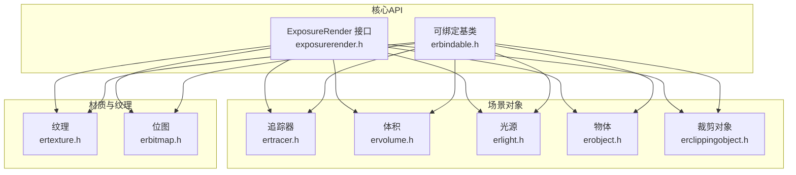

图表来源
- [exposurerender.h:32-42](file://Source/exposurerender.h#L32-L42)
- [erbindable.h:28-68](file://Source/erbindable.h#L28-L68)
- [ertracer.h:33-117](file://Source/ertracer.h#L33-L117)
- [ervolume.h:28-74](file://Source/ervolume.h#L28-L74)
- [erlight.h:27-66](file://Source/erlight.h#L27-L66)
- [erobject.h:27-67](file://Source/erobject.h#L27-L67)
- [erclippingobject.h:27-58](file://Source/erclippingobject.h#L27-L58)
- [ertexture.h:27-82](file://Source/ertexture.h#L27-L82)
- [erbitmap.h:28-61](file://Source/erbitmap.h#L28-L61)

章节来源
- [exposurerender.h:19-45](file://Source/exposurerender.h#L19-L45)
- [erbindable.h:19-71](file://Source/erbindable.h#L19-L71)

## 核心组件
本节概述与渲染流程直接相关的API与数据模型，重点说明绑定、渲染估计、结果获取与辅助查询接口。

- 绑定接口
  - 绑定追踪器、体积、光源、物体、裁剪对象、纹理、位图
  - 支持启用/禁用与解绑操作
- 渲染估计
  - 启动指定追踪器的渲染估计
  - 获取估计结果到外部缓冲区
- 辅助查询
  - 自动对焦距离计算
  - 迭代次数查询

章节来源
- [exposurerender.h:32-42](file://Source/exposurerender.h#L32-L42)

## 架构总览
下图展示渲染调用链：应用通过绑定接口将场景对象注册到渲染器，随后启动渲染估计，最终从GPU估计缓冲读取像素数据。

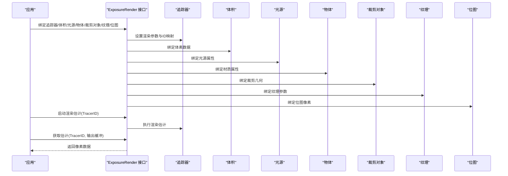

图表来源
- [exposurerender.h:32-42](file://Source/exposurerender.h#L32-L42)
- [ertracer.h:33-117](file://Source/ertracer.h#L33-L117)
- [ervolume.h:63-69](file://Source/ervolume.h#L63-L69)
- [erlight.h:61-66](file://Source/erlight.h#L61-L66)
- [erobject.h:62-67](file://Source/erobject.h#L62-L67)
- [erclippingobject.h:56-58](file://Source/erclippingobject.h#L56-L58)
- [ertexture.h:75-82](file://Source/ertexture.h#L75-L82)
- [erbitmap.h:55-61](file://Source/erbitmap.h#L55-L61)

## 详细组件分析

### 可绑定基类（ErBindable）
- 职责：为所有可绑定对象提供统一的生命周期与状态管理（ID、启用标志、脏标记），并定义主机端绑定/解绑接口。
- 关键点：派生类通过继承获得统一的标识与状态控制，便于上层集中管理。

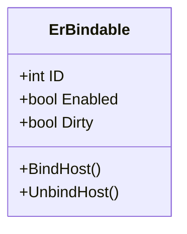

图表来源
- [erbindable.h:28-68](file://Source/erbindable.h#L28-L68)

章节来源
- [erbindable.h:28-68](file://Source/erbindable.h#L28-L68)

### 追踪器（ErTracer）
- 职责：承载渲染所需的全部上下文，包括一维传输函数（不透明度、漫反射、镜面反射、光泽度、发射）、相机、渲染设置、迭代次数、关联的体积与对象ID集合。
- 绑定：提供将外部ID映射到内部索引的绑定方法，确保跨对象引用的一致性。

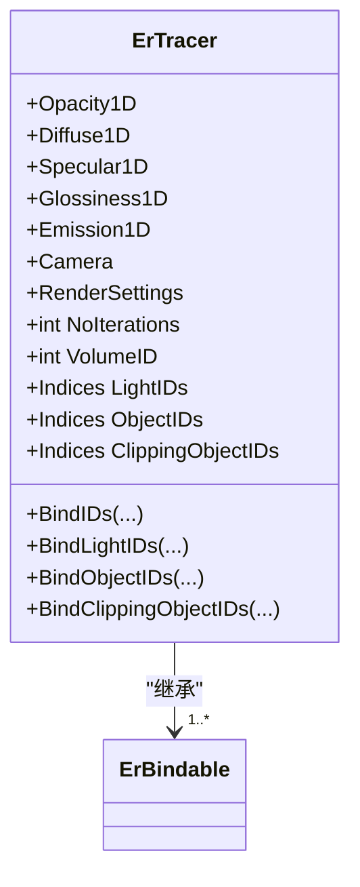

图表来源
- [ertracer.h:33-117](file://Source/ertracer.h#L33-L117)

章节来源
- [ertracer.h:33-117](file://Source/ertracer.h#L33-L117)

### 体积（ErVolume）
- 职责：封装3D体数据（体素），提供绑定主机侧体数据的方法，支持尺寸归一化与体元间距设置。

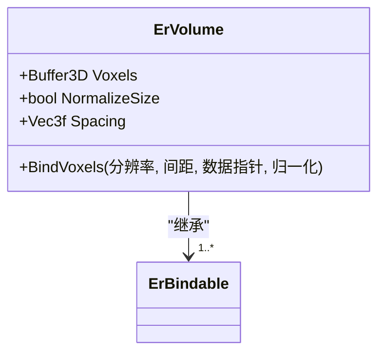

图表来源
- [ervolume.h:28-74](file://Source/ervolume.h#L28-L74)

章节来源
- [ervolume.h:28-74](file://Source/ervolume.h#L28-L74)

### 光源（ErLight）
- 职责：描述可绑定光源的可见性、形状、纹理ID、强度倍数与单位。

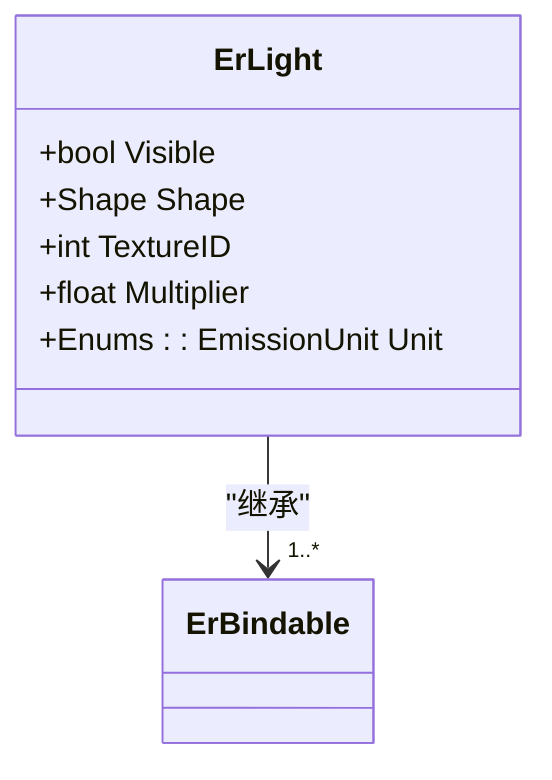

图表来源
- [erlight.h:27-66](file://Source/erlight.h#L27-L66)

章节来源
- [erlight.h:27-66](file://Source/erlight.h#L27-L66)

### 物体（ErObject）
- 职责：描述可绑定物体的几何形状与材质贴图（漫反射、镜面反射、光泽度）及折射率。

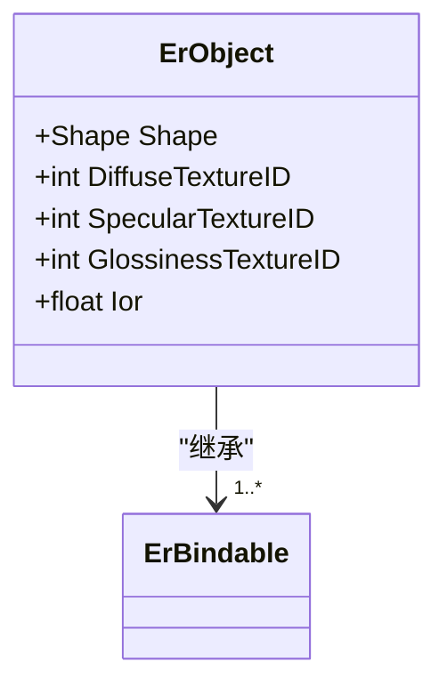

图表来源
- [erobject.h:27-67](file://Source/erobject.h#L27-L67)

章节来源
- [erobject.h:27-67](file://Source/erobject.h#L27-L67)

### 裁剪对象（ErClippingObject）
- 职责：描述用于裁剪体积的几何对象及其是否反转内外方向。

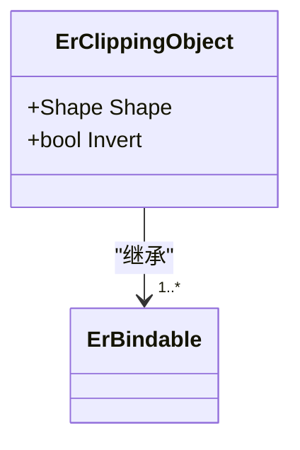

图表来源
- [erclippingobject.h:27-58](file://Source/erclippingobject.h#L27-L58)

章节来源
- [erclippingobject.h:27-58](file://Source/erclippingobject.h#L27-L58)

### 纹理（ErTexture）
- 职责：描述纹理类型、输出级别、位图ID、程序化纹理参数以及重复与翻转设置；提供设备端绑定与解绑。

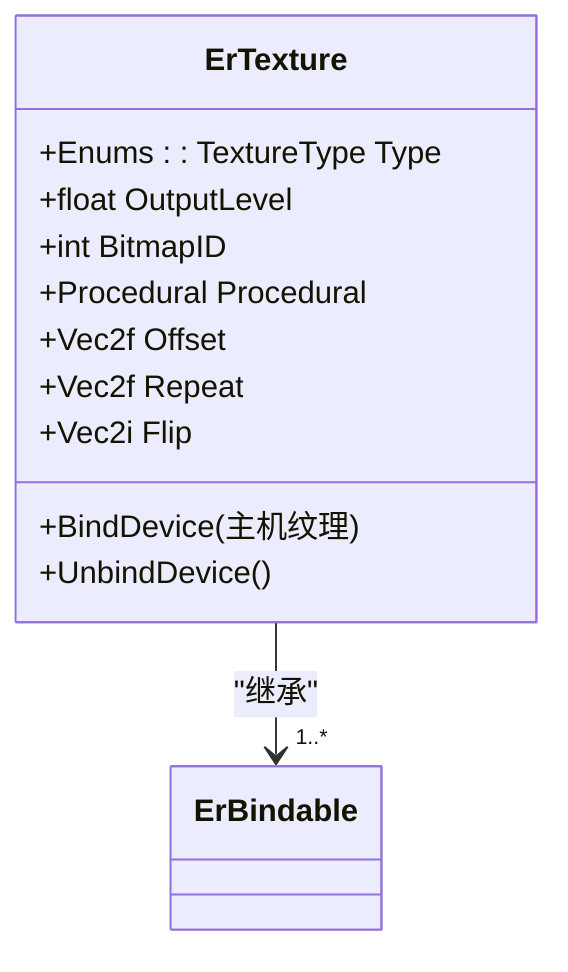

图表来源
- [ertexture.h:27-82](file://Source/ertexture.h#L27-L82)

章节来源
- [ertexture.h:27-82](file://Source/ertexture.h#L27-L82)

### 位图（ErBitmap）
- 职责：封装2D像素缓冲，提供绑定主机侧像素数据的方法。

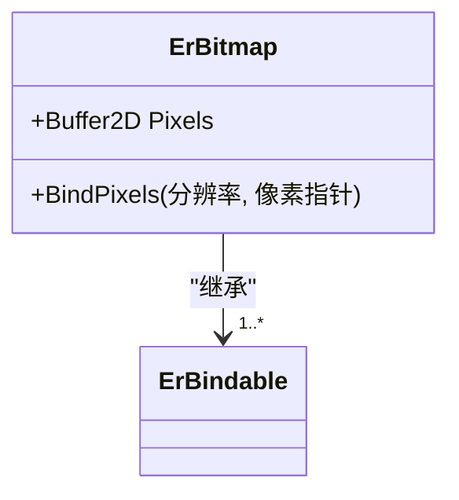

图表来源
- [erbitmap.h:28-61](file://Source/erbitmap.h#L28-L61)

章节来源
- [erbitmap.h:28-61](file://Source/erbitmap.h#L28-L61)

### 渲染接口（ExposureRender）
- 绑定接口：将各类对象绑定到渲染系统，支持启用/禁用。
- 渲染估计：启动指定追踪器的估计过程。
- 结果获取：将GPU估计结果拷贝到外部缓冲区。
- 辅助接口：自动对焦距离计算、迭代次数查询。

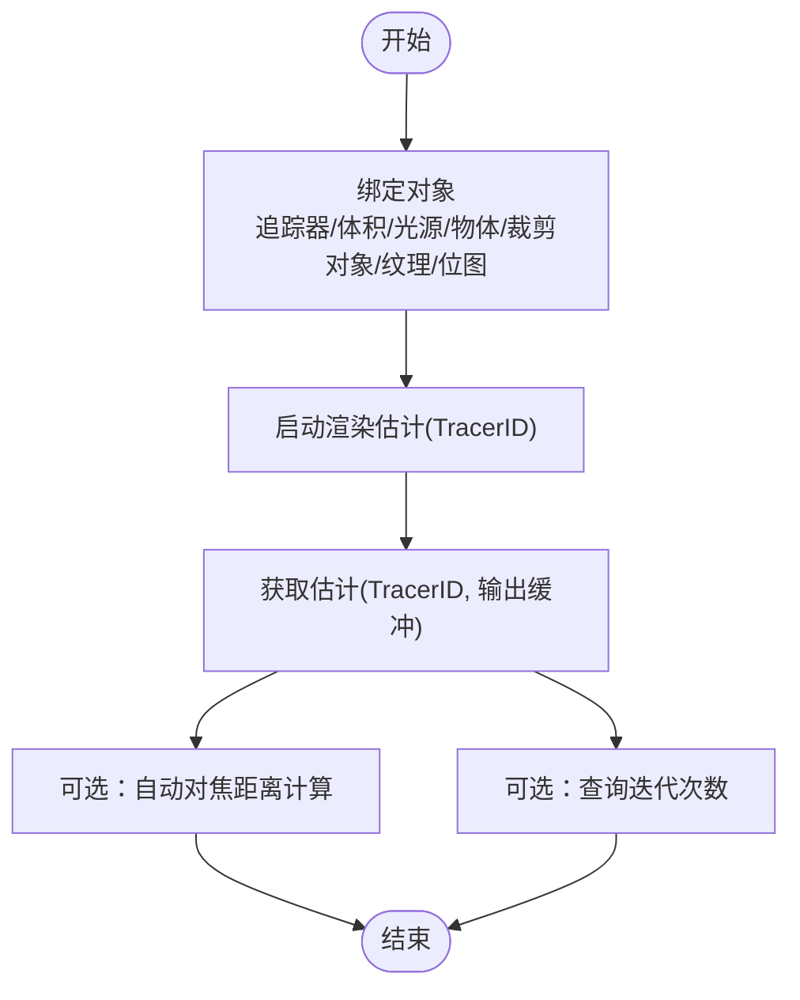

图表来源
- [exposurerender.h:32-42](file://Source/exposurerender.h#L32-L42)

章节来源
- [exposurerender.h:32-42](file://Source/exposurerender.h#L32-L42)

## 依赖关系分析
- 组件耦合：所有场景对象均继承自ErBindable，保证统一的状态与生命周期管理；渲染接口通过ID映射与绑定方法协调各对象。
- 外部依赖：CUDA运行时（由编译宏与内核实现体现）、图形与数学库（通过缓冲与向量类型间接依赖）。
- 版本与发布：版本信息文件提供版本号与下载链接，便于客户端识别与升级。

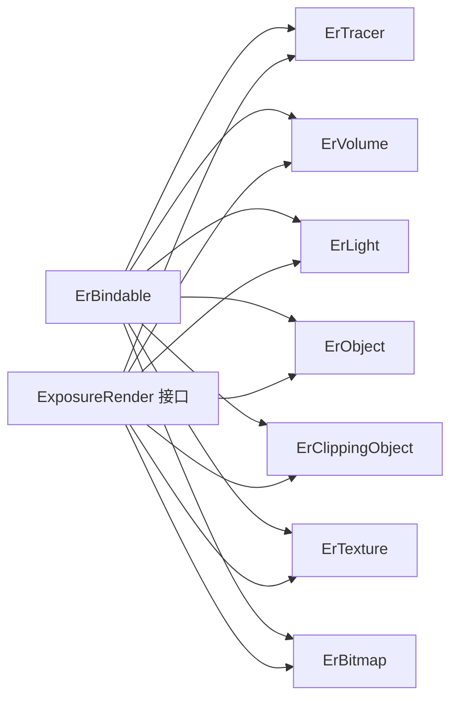

图表来源
- [erbindable.h:28-68](file://Source/erbindable.h#L28-L68)
- [exposurerender.h:32-42](file://Source/exposurerender.h#L32-L42)

章节来源
- [erbindable.h:28-68](file://Source/erbindable.h#L28-L68)
- [exposurerender.h:32-42](file://Source/exposurerender.h#L32-L42)

## 性能考量
- 体素数据与缓冲：使用3D/2D缓冲承载体数据与像素，建议在主机侧预分配连续内存以减少拷贝开销。
- 传输函数：一维传输函数（不透明度、漫反射、镜面反射、光泽度、发射）直接影响渲染质量与速度，应根据数据范围进行合理采样与压缩。
- 迭代次数：通过查询迭代次数接口评估收敛情况，动态调整以平衡质量与性能。
- 设备端绑定：纹理与位图提供设备端绑定/解绑方法，避免频繁主机-设备同步。
- CUDA架构：编译宏定义了目标架构，确保内核在目标GPU上高效执行。

章节来源
- [ervolume.h:63-69](file://Source/ervolume.h#L63-L69)
- [erbitmap.h:55-61](file://Source/erbitmap.h#L55-L61)
- [exposurerender.h:42-42](file://Source/exposurerender.h#L42-L42)
- [exposurerender.cpp:21-24](file://Source/exposurerender.cpp#L21-L24)

## 故障排查指南
- 对象未绑定：若渲染无输出或异常，检查是否已正确绑定对应对象（体积、光源、物体、裁剪对象、纹理、位图）。
- ID映射问题：当对象ID发生变化时，需重新调用绑定接口更新映射，确保追踪器引用有效。
- 缓冲大小不匹配：获取估计结果前确认输出缓冲大小与屏幕分辨率一致，避免越界写入。
- CUDA相关错误：若出现内核执行失败，检查CUDA驱动与架构兼容性，确认编译目标与运行设备一致。
- 异常处理：可绑定基类包含异常头文件，可在开发阶段启用异常以捕获底层错误。

章节来源
- [erbindable.h:28-68](file://Source/erbindable.h#L28-L68)
- [ertracer.h:82-103](file://Source/ertracer.h#L82-L103)
- [ervolume.h:63-69](file://Source/ervolume.h#L63-L69)
- [erbitmap.h:55-61](file://Source/erbitmap.h#L55-L61)

## 结论
本API参考手册梳理了曝光渲染框架的核心对象与渲染流程，明确了绑定、估计与结果获取的关键接口，并提供了性能与故障排查建议。对于实际集成，建议先完成场景对象的完整绑定，再启动渲染估计，并通过查询接口评估收敛与质量。

## 附录

### 版本与发布信息
- 版本：1.1.0
- 发布与下载：见版本信息文件提供的下载链接与说明。

章节来源
- [VersionInfo.xml:1-10](file://VersionInfo.xml#L1-L10)

### 平台与构建提示
- 平台：Windows
- 构建工具链：Visual Studio、Qt、VTK、CUDA（见README构建说明）
- 系统要求：内存、显卡驱动与CUDA兼容性详见README

章节来源
- [README.md:14-22](file://README.md#L14-L22)