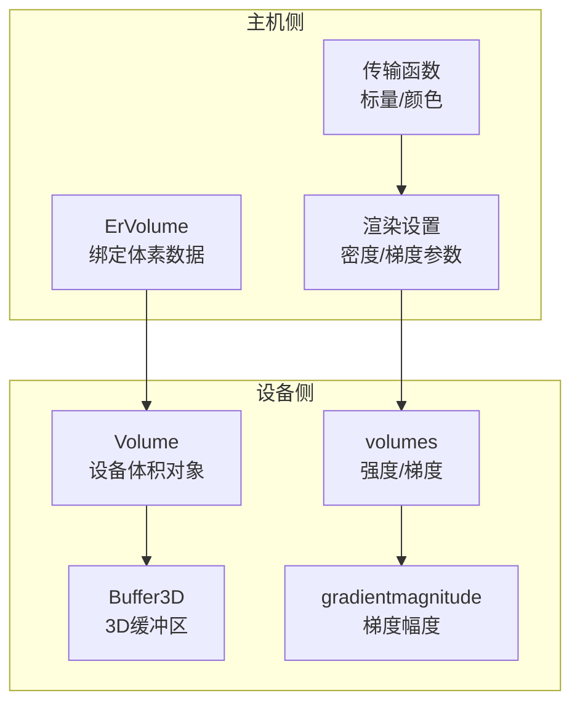
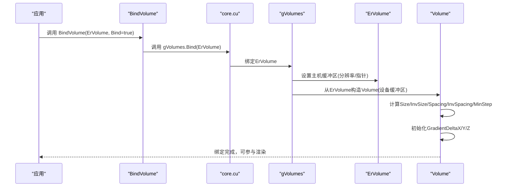
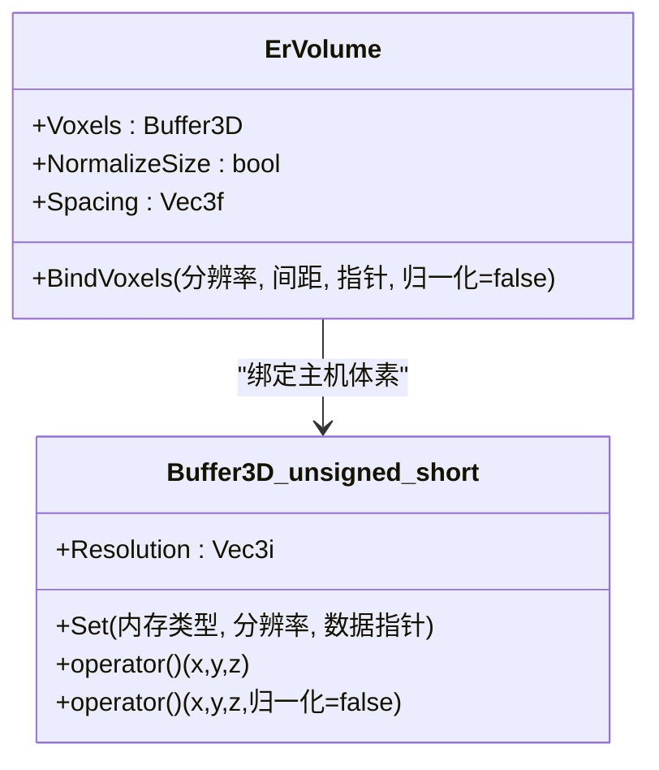
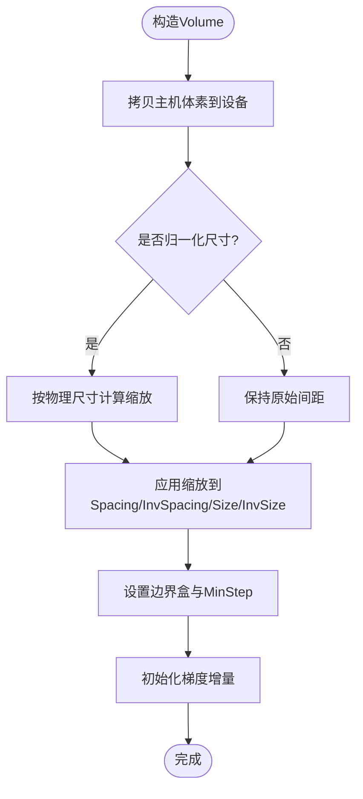
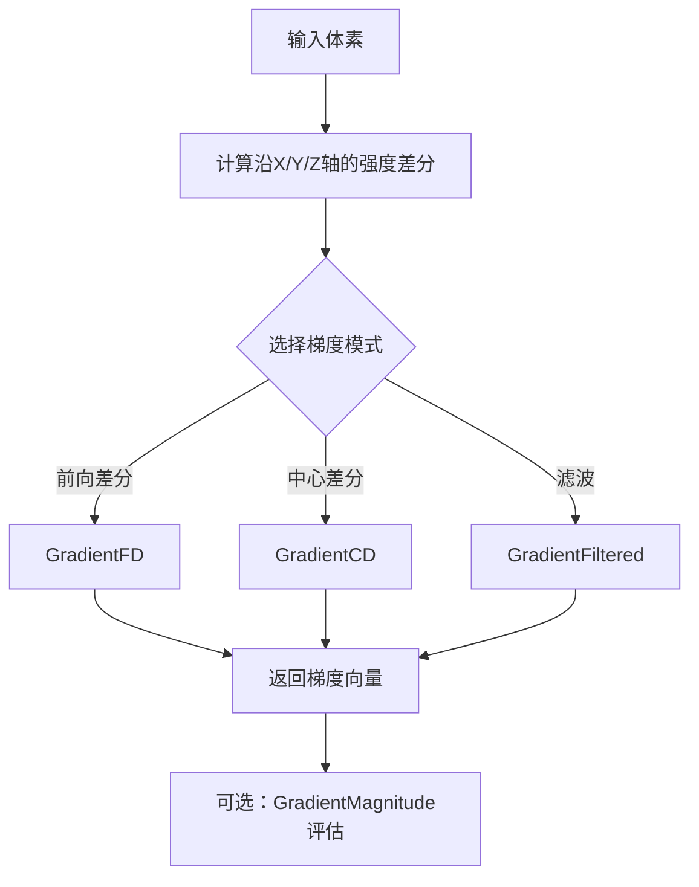
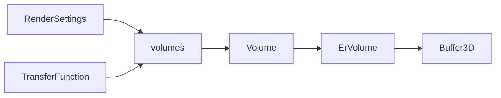

# 体积数据API

<cite>
**本文档引用的文件**
- [ervolume.h](file://Source/ervolume.h)
- [volume.h](file://Source/volume.h)
- [volumes.h](file://Source/volumes.h)
- [buffer3d.h](file://Source/buffer3d.h)
- [enums.h](file://Source/enums.h)
- [transferfunction.h](file://Source/transferfunction.h)
- [rendersettings.h](file://Source/rendersettings.h)
- [gradientmagnitude.cuh](file://Source/gradientmagnitude.cuh)
- [raymarching.h](file://Source/raymarching.h)
- [exposurerender.h](file://Source/exposurerender.h)
- [core.cu](file://Source/core.cu)
</cite>

## 目录
1. [简介](#简介)
2. [项目结构](#项目结构)
3. [核心组件](#核心组件)
4. [架构总览](#架构总览)
5. [详细组件分析](#详细组件分析)
6. [依赖关系分析](#依赖关系分析)
7. [性能考量](#性能考量)
8. [故障排查指南](#故障排查指南)
9. [结论](#结论)
10. [附录：完整使用示例与最佳实践](#附录完整使用示例与最佳实践)

## 简介
本文件面向曝光渲染框架中的体积数据API，系统性地阐述BindVolume函数及其相关接口，涵盖体积数据的加载、配置、内存布局、采样参数与传输函数设置，以及体积数据的预处理、梯度计算与优化策略。文档同时提供可直接定位到源码的路径指引，帮助开发者快速理解并正确使用该API。

## 项目结构
围绕体积数据API的关键文件组织如下：
- ErVolume与Volume：定义主机侧与设备侧的体积对象，负责体素数据的绑定与空间参数计算
- Buffer3D：通用三维缓冲区模板，支持主机/设备内存类型切换与三线性插值采样
- volumes：提供体数据强度查询与多种梯度计算方法（前向差分、中心差分、滤波）
- transferfunction：标量/颜色传输函数，用于控制不透明度与颜色映射
- rendersettings：渲染设置，包含密度缩放、梯度计算模式等关键参数
- gradientmagnitude：梯度幅度计算的CUDA内核与归约流程
- raymarching：体积采样与步长控制的基础流程
- exposurerender与core：对外暴露的绑定接口与内部绑定实现

**图表来源**
- [ervolume.h:28-74](file://Source/ervolume.h#L28-L74)
- [volume.h:26-150](file://Source/volume.h#L26-L150)
- [buffer3d.h:26-251](file://Source/buffer3d.h#L26-L251)
- [volumes.h:25-116](file://Source/volumes.h#L25-L116)
- [transferfunction.h:82-154](file://Source/transferfunction.h#L82-L154)
- [rendersettings.h:27-131](file://Source/rendersettings.h#L27-L131)
- [gradientmagnitude.cuh:28-71](file://Source/gradientmagnitude.cuh#L28-L71)

**章节来源**
- [ervolume.h:28-74](file://Source/ervolume.h#L28-L74)
- [volume.h:26-150](file://Source/volume.h#L26-L150)
- [buffer3d.h:26-251](file://Source/buffer3d.h#L26-L251)
- [volumes.h:25-116](file://Source/volumes.h#L25-L116)
- [transferfunction.h:82-154](file://Source/transferfunction.h#L82-L154)
- [rendersettings.h:27-131](file://Source/rendersettings.h#L27-L131)
- [gradientmagnitude.cuh:28-71](file://Source/gradientmagnitude.cuh#L28-L71)

## 核心组件
- ErVolume：主机侧体积对象，提供BindVoxels接口以绑定unsigned short类型的3D体素数据，支持是否归一化尺寸与体素间距设置
- Volume：设备侧体积对象，从ErVolume构造，完成设备端缓冲区分配、尺寸与步长计算、边界盒设置与梯度增量初始化
- Buffer3D<T>：通用三维缓冲区模板，支持主机/设备内存类型、重置、销毁、按分辨率分配与三线性插值采样
- volumes：提供GetIntensity、GradientFD/CD/Filtered与GradientMagnitude等函数，统一访问体数据并计算梯度
- 渲染设置与传输函数：通过RenderSettings与ScalarTransferFunction1D/ColorTransferFunction1D配置密度缩放、梯度计算模式与颜色/不透明度映射

**章节来源**
- [ervolume.h:63-69](file://Source/ervolume.h#L63-L69)
- [volume.h:100-129](file://Source/volume.h#L100-L129)
- [buffer3d.h:166-198](file://Source/buffer3d.h#L166-L198)
- [volumes.h:26-114](file://Source/volumes.h#L26-L114)
- [rendersettings.h:66-106](file://Source/rendersettings.h#L66-L106)
- [transferfunction.h:82-154](file://Source/transferfunction.h#L82-L154)

## 架构总览
BindVolume作为对外入口，将ErVolume绑定至全局管理器；随后Volume负责将主机侧体素数据迁移至设备端，并根据体素分辨率与间距计算空间参数，供光线步进与着色阶段使用。

**图表来源**
- [exposurerender.h:32-38](file://Source/exposurerender.h#L32-L38)
- [core.cu:66-74](file://Source/core.cu#L66-L74)
- [ervolume.h:63-69](file://Source/ervolume.h#L63-L69)
- [volume.h:100-129](file://Source/volume.h#L100-L129)

**章节来源**
- [exposurerender.h:32-38](file://Source/exposurerender.h#L32-L38)
- [core.cu:66-74](file://Source/core.cu#L66-L74)
- [ervolume.h:63-69](file://Source/ervolume.h#L63-L69)
- [volume.h:100-129](file://Source/volume.h#L100-L129)

## 详细组件分析

### ErVolume：体素数据绑定与配置
- BindVoxels(分辨率, 间距, 指针, 是否归一化尺寸)
  - 将主机侧体素数据以unsigned short形式绑定到Buffer3D
  - 支持按物理尺寸归一化，便于多尺度数据的一致渲染
- 成员变量
  - Voxels：Buffer3D<unsigned short>，存储体素数据
  - NormalizeSize：是否按物理尺寸归一化
  - Spacing：体素间距（物理单位）

**图表来源**
- [ervolume.h:63-69](file://Source/ervolume.h#L63-L69)
- [buffer3d.h:166-198](file://Source/buffer3d.h#L166-L198)

**章节来源**
- [ervolume.h:63-69](file://Source/ervolume.h#L63-L69)
- [buffer3d.h:166-198](file://Source/buffer3d.h#L166-L198)

### Volume：设备侧体积对象与空间参数
- 从ErVolume构造时完成以下工作：
  - 设备端Buffer3D分配
  - 若启用归一化，则按物理尺寸计算缩放因子
  - 计算Spacing/InvSpacing、Size/InvSize、MinStep
  - 初始化边界盒BoundingBox与梯度增量GradientDeltaX/Y/Z
- 体数据访问
  - operator()(Vec3f)：将世界坐标映射到本地体素坐标后进行三线性插值

**图表来源**
- [volume.h:100-129](file://Source/volume.h#L100-L129)

**章节来源**
- [volume.h:100-129](file://Source/volume.h#L100-L129)

### 体素数据格式与内存布局
- 数据类型：unsigned short（单通道体素值）
- 内存布局：按深度优先顺序存储，索引公式为 z*W*H + y*W + x
- 插值：三线性插值，支持归一化与非归一化两种坐标系
- 内存类型：支持主机与设备两端，Set接口自动处理主机/设备间的数据拷贝

**章节来源**
- [buffer3d.h:210-242](file://Source/buffer3d.h#L210-L242)
- [buffer3d.h:166-198](file://Source/buffer3d.h#L166-L198)

### 采样参数与步长控制
- 密度缩放：RenderSettings.Shading.DensityScale影响光线步长的计算
- 步长因子：RenderSettings.Traversal.StepFactorPrimary/Shadow决定主光与阴影步长
- 最大阴影距离：RenderSettings.Traversal.MaxShadowDistance限制阴影步进范围
- 体积采样：SampleVolume中基于包围盒相交与指数分布计算步长

**章节来源**
- [rendersettings.h:66-106](file://Source/rendersettings.h#L66-L106)
- [rendersettings.h:30-64](file://Source/rendersettings.h#L30-L64)
- [raymarching.h:30-45](file://Source/raymarching.h#L30-L45)

### 传输函数设置
- 标量传输函数：ScalarTransferFunction1D，用于控制不透明度随体素强度的变化
- 颜色传输函数：ColorTransferFunction1D，分别对RGB三个通道设置节点
- 使用方式：在渲染管线中通过Evaluate(Intensity)获取不透明度或颜色

**章节来源**
- [transferfunction.h:82-154](file://Source/transferfunction.h#L82-L154)

### 梯度计算与预处理
- 梯度计算模式：ForwardDifferences、CentralDifferences、Filtered
- GradientFD/CD/Filtered：三种数值微分方案，分别对应前向差分、中心差分与滤波增强
- GradientMagnitude：沿三个轴的差分平方和开方，用于梯度幅度评估
- 预处理：ComputeGradientMagnitudeVolume通过CUDA内核计算梯度幅度并归约得到最大梯度值，用于后续渲染调优

**图表来源**
- [volumes.h:31-86](file://Source/volumes.h#L31-L86)
- [volumes.h:93-114](file://Source/volumes.h#L93-L114)
- [gradientmagnitude.cuh:46-71](file://Source/gradientmagnitude.cuh#L46-L71)

**章节来源**
- [volumes.h:31-86](file://Source/volumes.h#L31-L86)
- [volumes.h:93-114](file://Source/volumes.h#L93-L114)
- [gradientmagnitude.cuh:46-71](file://Source/gradientmagnitude.cuh#L46-L71)

## 依赖关系分析
- ErVolume依赖Buffer3D<unsigned short>进行体素数据存储
- Volume依赖ErVolume完成设备端缓冲区与空间参数初始化
- volumes模块依赖全局tracer与体积数组访问体数据
- 渲染设置与传输函数贯穿采样与着色阶段

**图表来源**
- [ervolume.h:71](file://Source/ervolume.h#L71)
- [volume.h:149](file://Source/volume.h#L149)
- [volumes.h:26-114](file://Source/volumes.h#L26-L114)
- [rendersettings.h:129-131](file://Source/rendersettings.h#L129-L131)
- [transferfunction.h:118-154](file://Source/transferfunction.h#L118-L154)

**章节来源**
- [ervolume.h:71](file://Source/ervolume.h#L71)
- [volume.h:149](file://Source/volume.h#L149)
- [volumes.h:26-114](file://Source/volumes.h#L26-L114)
- [rendersettings.h:129-131](file://Source/rendersettings.h#L129-L131)
- [transferfunction.h:118-154](file://Source/transferfunction.h#L118-L154)

## 性能考量
- 体素数据类型：unsigned short减少内存占用，适合大规模体积数据
- 设备端缓存：Volume在构造时完成设备端缓冲区分配与参数计算，避免渲染时重复开销
- 梯度计算：根据需求选择合适的梯度模式，中心差分通常更稳定但计算成本更高；滤波版本在边缘细节上更平滑
- 步长控制：合理设置密度缩放与步长因子，平衡渲染质量与速度
- CUDA归约：使用thrust::reduce计算最大梯度幅度，有助于动态调整渲染参数

[本节为通用性能建议，无需特定文件引用]

## 故障排查指南
- 体素数据未生效
  - 检查BindVoxels是否正确调用且分辨率与数据指针有效
  - 确认BindVolume已调用并处于Bind=true状态
- 渲染结果异常
  - 核对RenderSettings中的密度缩放与步长因子
  - 检查传输函数节点设置是否覆盖目标强度范围
- 梯度计算异常
  - 确认GradientComputation枚举值与期望一致
  - 如使用滤波梯度，检查体素分辨率是否足够
- 内存问题
  - 大体积数据可能导致设备内存不足，考虑降低分辨率或使用分块策略

**章节来源**
- [ervolume.h:63-69](file://Source/ervolume.h#L63-L69)
- [core.cu:66-74](file://Source/core.cu#L66-L74)
- [rendersettings.h:66-106](file://Source/rendersettings.h#L66-L106)
- [transferfunction.h:105-113](file://Source/transferfunction.h#L105-L113)
- [volumes.h:76-86](file://Source/volumes.h#L76-L86)

## 结论
BindVolume及相关体积API提供了从主机侧体素数据绑定到设备侧空间参数计算与梯度处理的完整链路。通过合理的数据格式、内存布局与渲染参数配置，可在保证视觉质量的同时获得良好的性能表现。结合传输函数与梯度计算策略，可针对不同应用场景实现灵活的体积渲染效果。

[本节为总结性内容，无需特定文件引用]

## 附录：完整使用示例与最佳实践

### 示例一：绑定并渲染CT数据（归一化尺寸）
- 准备数据
  - 体素数据为unsigned short，分辨率为(W,H,D)，按深度优先顺序排列
  - 已知体素间距Spacing（物理单位）
- 绑定步骤
  - 创建ErVolume并调用BindVoxels(分辨率, 间距, 指针, 归一化=true)
  - 调用BindVolume(ErVolume, true)
  - 配置RenderSettings：设置密度缩放与梯度计算模式
  - 配置传输函数：添加标量/颜色节点以突出感兴趣结构
- 渲染流程
  - 在光线步进中使用SampleVolume，依据包围盒与密度缩放确定步长
  - 使用volumes模块的GetIntensity与Gradient计算采样点的强度与梯度

**章节来源**
- [ervolume.h:63-69](file://Source/ervolume.h#L63-L69)
- [core.cu:66-74](file://Source/core.cu#L66-L74)
- [rendersettings.h:66-106](file://Source/rendersettings.h#L66-L106)
- [transferfunction.h:105-151](file://Source/transferfunction.h#L105-L151)
- [raymarching.h:30-45](file://Source/raymarching.h#L30-L45)

### 示例二：自定义梯度计算与幅度预处理
- 选择梯度模式
  - ForwardDifferences：计算速度快，适合实时渲染
  - CentralDifferences：精度更高，边缘更锐利
  - Filtered：在噪声环境下更稳健
- 预处理最大梯度幅度
  - 使用ComputeGradientMagnitudeVolume计算最大梯度值
  - 基于最大梯度调整渲染参数（如密度缩放、阈值）

**章节来源**
- [volumes.h:76-114](file://Source/volumes.h#L76-L114)
- [gradientmagnitude.cuh:46-71](file://Source/gradientmagnitude.cuh#L46-L71)

### 示例三：多格式体数据加载思路
- NIfTI/RAW等格式
  - 将外部数据转换为连续的unsigned short数组
  - 计算体素间距（如从元数据读取）
  - 调用BindVoxels完成绑定
- DICOM序列
  - 按切片顺序拼接为3D数组，注意方向一致性
  - 根据像素间距与层厚设置Spacing

[本小节为概念性指导，无需特定文件引用]