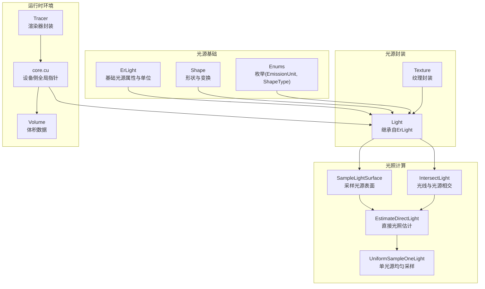
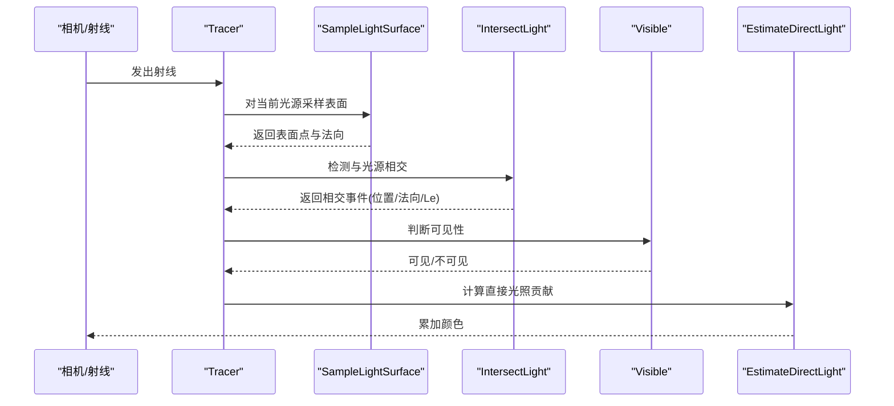
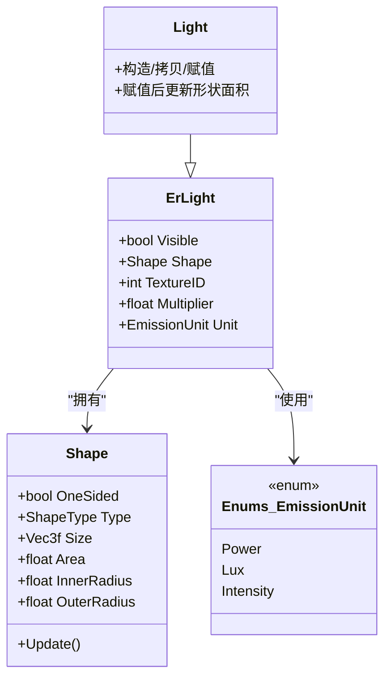
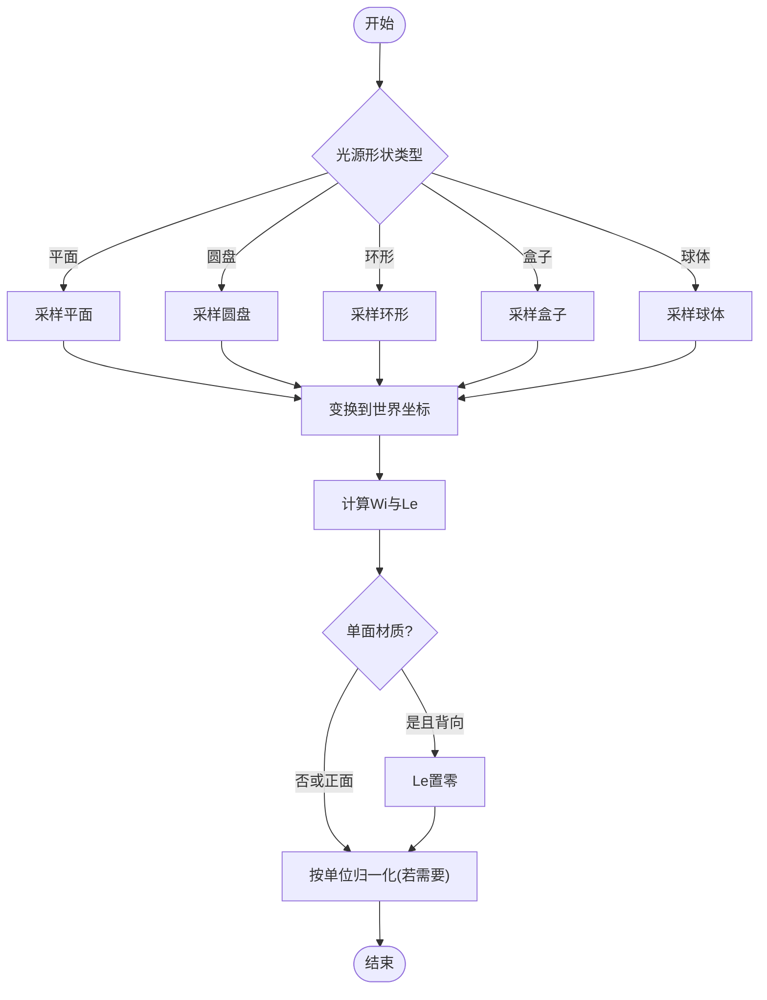
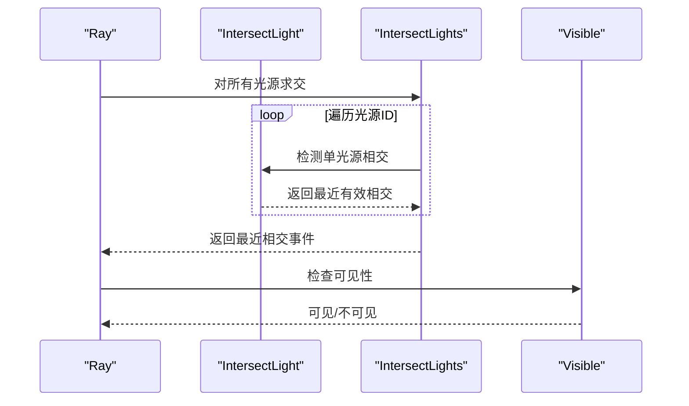
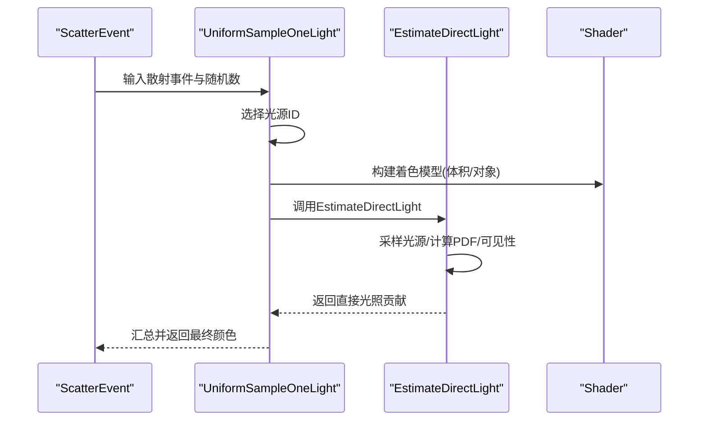
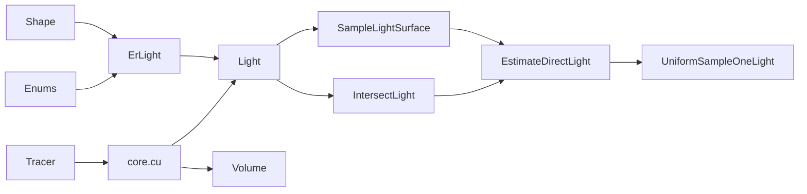

# 光源API

<cite>
**本文引用的文件**
- [light.h](file://Source/light.h)
- [lights.h](file://Source/lights.h)
- [erlight.h](file://Source/erlight.h)
- [enums.h](file://Source/enums.h)
- [shape.h](file://Source/shape.h)
- [shapes.h](file://Source/shapes.h)
- [texture.h](file://Source/texture.h)
- [transport.h](file://Source/transport.h)
- [core.cu](file://Source/core.cu)
- [tracer.h](file://Source/tracer.h)
- [volume.h](file://Source/volume.h)
</cite>

## 目录
1. [简介](#简介)
2. [项目结构](#项目结构)
3. [核心组件](#核心组件)
4. [架构总览](#架构总览)
5. [详细组件分析](#详细组件分析)
6. [依赖关系分析](#依赖关系分析)
7. [性能考量](#性能考量)
8. [故障排查指南](#故障排查指南)
9. [结论](#结论)
10. [附录：API与使用示例路径](#附录api与使用示例路径)

## 简介
本文件面向曝光渲染框架中的光源API，系统性梳理光源绑定、类型与参数、光照模型设置、动态调整与多光源管理、以及体积渲染中的光照计算优化方法。重点围绕 BindLight 的概念与实现思路展开，并结合现有代码中对光源采样、相交检测、可见性判断与直接光照估计的组织方式，给出可操作的配置与使用建议。

## 项目结构
光源相关代码主要分布在以下模块：
- 基类与绑定接口：ErLight、ErBindable
- 光源类型封装：Light
- 形状与采样：Shape、SampleLightSurface、IntersectLight
- 光照计算：SampleLight、EstimateDirectLight、UniformSampleOneLight
- 枚举与单位：EmissionUnit、ShapeType
- 设备侧全局资源：gpLights、gpTracer 等

图表来源
- [erlight.h:27-66](file://Source/erlight.h#L27-L66)
- [light.h:26-46](file://Source/light.h#L26-L46)
- [shape.h:57-113](file://Source/shape.h#L57-L113)
- [enums.h:88-93](file://Source/enums.h#L88-L93)
- [lights.h:28-88](file://Source/lights.h#L28-L88)
- [transport.h:58-156](file://Source/transport.h#L58-L156)
- [core.cu:30-36](file://Source/core.cu#L30-L36)
- [tracer.h:31-55](file://Source/tracer.h#L31-L55)
- [volume.h:26-150](file://Source/volume.h#L26-L150)

章节来源
- [light.h:26-46](file://Source/light.h#L26-L46)
- [erlight.h:27-66](file://Source/erlight.h#L27-L66)
- [shape.h:57-113](file://Source/shape.h#L57-L113)
- [enums.h:88-93](file://Source/enums.h#L88-L93)
- [lights.h:28-131](file://Source/lights.h#L28-L131)
- [transport.h:58-156](file://Source/transport.h#L58-L156)
- [core.cu:30-36](file://Source/core.cu#L30-L36)
- [tracer.h:31-55](file://Source/tracer.h#L31-L55)
- [volume.h:26-150](file://Source/volume.h#L26-L150)

## 核心组件
- ErLight：光源基类，包含可见性、形状、纹理ID、强度倍数与发射单位等属性。
- Light：对 ErLight 的轻量封装，提供构造与赋值逻辑，并在赋值后更新形状面积。
- Shape：描述光源几何形状（平面、圆盘、环形、盒子、球体等），支持面积计算与变换矩阵。
- EmissionUnit：发射单位枚举（功率、照度、强度），影响辐射度归一化。
- SampleLightSurface/IntersectLight：按形状类型进行表面采样与光线相交。
- EstimateDirectLight/UniformSampleOneLight：基于重要性采样的直接光照估计与单光源均匀采样。

章节来源
- [erlight.h:27-66](file://Source/erlight.h#L27-L66)
- [light.h:26-46](file://Source/light.h#L26-L46)
- [shape.h:57-113](file://Source/shape.h#L57-L113)
- [enums.h:88-93](file://Source/enums.h#L88-L93)
- [lights.h:28-88](file://Source/lights.h#L28-L88)
- [transport.h:58-156](file://Source/transport.h#L58-L156)

## 架构总览
光源API围绕“形状-采样-相交-可见性-估计”的流程组织，设备侧通过全局指针访问光源集合与渲染器状态，实现体积与对象场景下的统一光照计算。

图表来源
- [lights.h:28-88](file://Source/lights.h#L28-L88)
- [transport.h:46-113](file://Source/transport.h#L46-L113)

章节来源
- [lights.h:28-131](file://Source/lights.h#L28-L131)
- [transport.h:46-156](file://Source/transport.h#L46-L156)

## 详细组件分析

### 组件A：光源基类与封装（ErLight → Light）
- ErLight 提供可见性、形状、纹理ID、强度倍数与发射单位等核心字段；单位枚举来自 EmissionUnit。
- Light 在赋值 ErLight 后调用 Shape.Update，确保面积等派生信息同步。

图表来源
- [erlight.h:27-66](file://Source/erlight.h#L27-L66)
- [light.h:26-46](file://Source/light.h#L26-L46)
- [shape.h:57-113](file://Source/shape.h#L57-L113)
- [enums.h:88-93](file://Source/enums.h#L88-L93)

章节来源
- [erlight.h:27-66](file://Source/erlight.h#L27-L66)
- [light.h:26-46](file://Source/light.h#L26-L46)
- [shape.h:57-113](file://Source/shape.h#L57-L113)
- [enums.h:88-93](file://Source/enums.h#L88-L93)

### 组件B：光源采样与相交（SampleLightSurface/IntersectLight）
- SampleLightSurface：根据形状类型生成表面点与UV，并应用形状变换矩阵得到世界空间点与法向。
- SampleLight：从表面采样得到 Wi（从散射点指向光源的方向）与 Le（光源发出radiance或irradiance，受单位与纹理影响）。
- IntersectLight：对射线与光源形状进行求交，返回最近相交的散射事件（含位置、法向、Le、UV等）。

图表来源
- [lights.h:28-57](file://Source/lights.h#L28-L57)
- [shapes.h:31-42](file://Source/shapes.h#L31-L42)

章节来源
- [lights.h:28-88](file://Source/lights.h#L28-L88)
- [shapes.h:31-72](file://Source/shapes.h#L31-L72)

### 组件C：多光源管理与可见性（IntersectLights/Visible）
- IntersectLights：遍历当前渲染器登记的光源ID列表，对每盏光源执行 IntersectLight 并选择最近有效相交。
- Visible：在开启阴影追踪时，沿两点连线发射阴影射线，检查是否被光源或其他对象遮挡。

图表来源
- [lights.h:90-131](file://Source/lights.h#L90-L131)
- [transport.h:46-56](file://Source/transport.h#L46-L56)

章节来源
- [lights.h:90-131](file://Source/lights.h#L90-L131)
- [transport.h:46-56](file://Source/transport.h#L46-L56)

### 组件D：光照估计与体积渲染集成（EstimateDirectLight/UniformSampleOneLight）
- EstimateDirectLight：对单光源进行重要性采样，结合BRDF/相位函数与几何因子，使用功率权衡合并贡献。
- UniformSampleOneLight：从光源集合中均匀选择一盏光源，构建对应着色模型（体积或对象），估计其直接光照贡献并按光源数量缩放。

图表来源
- [transport.h:115-156](file://Source/transport.h#L115-L156)
- [transport.h:58-113](file://Source/transport.h#L58-L113)

章节来源
- [transport.h:58-156](file://Source/transport.h#L58-L156)

### 组件E：形状与面积计算（Shape/Area）
- Shape.Update 根据类型计算面积，用于单位换算与重要性采样PDF归一化。
- 支持平面、圆盘、环形、盒子、球体与圆柱体（部分接口预留）。

章节来源
- [shape.h:57-113](file://Source/shape.h#L57-L113)
- [shapes.h:31-72](file://Source/shapes.h#L31-L72)

## 依赖关系分析
- Light 依赖 ErLight 与 Shape；ErLight 依赖 ErBindable 与 Shape。
- 光照计算模块依赖纹理评估、着色模型与形状相交工具。
- 设备侧通过 core.cu 中的全局指针访问光源数组与渲染器状态。

图表来源
- [erlight.h:27-66](file://Source/erlight.h#L27-L66)
- [light.h:26-46](file://Source/light.h#L26-L46)
- [lights.h:28-88](file://Source/lights.h#L28-L88)
- [transport.h:58-156](file://Source/transport.h#L58-L156)
- [core.cu:30-36](file://Source/core.cu#L30-L36)
- [volume.h:26-150](file://Source/volume.h#L26-L150)

章节来源
- [erlight.h:27-66](file://Source/erlight.h#L27-L66)
- [light.h:26-46](file://Source/light.h#L26-L46)
- [lights.h:28-131](file://Source/lights.h#L28-L131)
- [transport.h:58-156](file://Source/transport.h#L58-L156)
- [core.cu:30-36](file://Source/core.cu#L30-L36)
- [volume.h:26-150](file://Source/volume.h#L26-L150)

## 性能考量
- 单光源均匀采样：UniformSampleOneLight 会按光源数量缩放结果，适合多光源场景下减少重采样开销。
- PDF与重要性采样：EstimateDirectLight 使用功率权衡合并BSDF与光源PDF，有助于降低方差。
- 形状面积：Shape.Update 提前计算面积，避免重复计算，提升采样与可见性判断效率。
- 阴影射线步长：体积渲染中的阴影步长与最小步长相关，合理设置可平衡精度与速度。

章节来源
- [transport.h:115-156](file://Source/transport.h#L115-L156)
- [transport.h:58-113](file://Source/transport.h#L58-L113)
- [shape.h:92-103](file://Source/shape.h#L92-L103)
- [volume.h:122-129](file://Source/volume.h#L122-L129)

## 故障排查指南
- 光源不发光或亮度异常
  - 检查 Multiplier 与 EmissionUnit 设置；单位为照度或强度时需按面积归一化。
  - 纹理ID是否有效，EvaluateTexture 是否返回非黑。
- 光源单面材质无效
  - OneSided 条件下，背面相交应被抑制（Le置零）。
- 可见性误判
  - 检查 Visible 的阴影射线参数（起点偏移、最大距离）与相交检测。
- 多光源未生效
  - 确认 Tracer 中登记的 LightIDs 数量与索引范围；UniformSampleOneLight 仅在有光源时参与累计。

章节来源
- [lights.h:50-57](file://Source/lights.h#L50-L57)
- [lights.h:52-53](file://Source/lights.h#L52-L53)
- [transport.h:46-56](file://Source/transport.h#L46-L56)
- [transport.h:123-130](file://Source/transport.h#L123-L130)

## 结论
该光源API以 ErLight 为核心，通过 Light 封装与 Shape/Enum 的配合，提供了灵活的多光源与多形状支持。结合 SampleLight、IntersectLight、EstimateDirectLight 与 UniformSampleOneLight，可在体积渲染中高效地进行直接光照估计。通过单位与面积的正确设置、可见性判断与重要性采样策略，可获得稳定且高效的渲染结果。

## 附录：API与使用示例路径
- 绑定光源（概念性说明）
  - 绑定流程：创建光源实例 → 设置形状与材质（纹理ID、Multiplier、Unit）→ 注册到渲染器的光源列表 → 在渲染循环中由 UniformSampleOneLight/EstimateDirectLight 使用。
  - 注意：代码中未提供显式的 BindLight 函数，但可通过 Tracer 的 LightIDs 列表与全局光源数组协同实现绑定效果。
- 光源类型与参数
  - 类型：平面、圆盘、环形、盒子、球体（圆柱体预留）。
  - 参数：位置/方向（通过形状变换矩阵）、尺寸/半径、单面材质、纹理ID、强度倍数、发射单位。
- 光照模型设置
  - 单位：功率、照度、强度；照度/强度通常需按面积归一化。
  - 着色模型：根据场景类型（体积/对象）构建不同Shader。
- 动态调整与多光源管理
  - 运行时可切换光源可见性与单位；多光源通过 UniformSampleOneLight 均匀采样并累加。
- 体积渲染中的使用
  - 在 UniformSampleOneLight 中先评估体积发射项，再叠加各光源的直接光照贡献。

章节来源
- [light.h:26-46](file://Source/light.h#L26-L46)
- [erlight.h:61-65](file://Source/erlight.h#L61-L65)
- [shape.h:105-112](file://Source/shape.h#L105-L112)
- [enums.h:88-93](file://Source/enums.h#L88-L93)
- [transport.h:115-156](file://Source/transport.h#L115-L156)
- [lights.h:90-131](file://Source/lights.h#L90-L131)