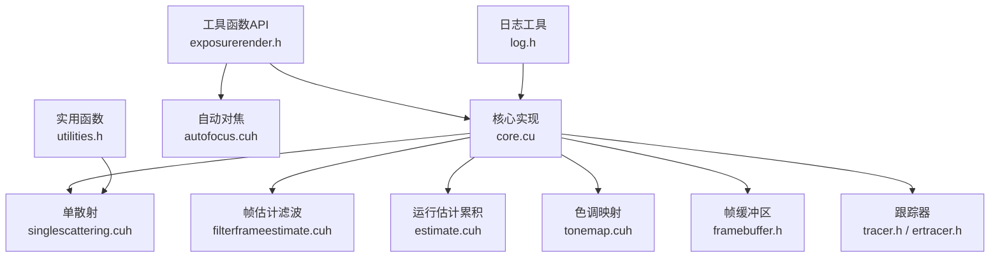
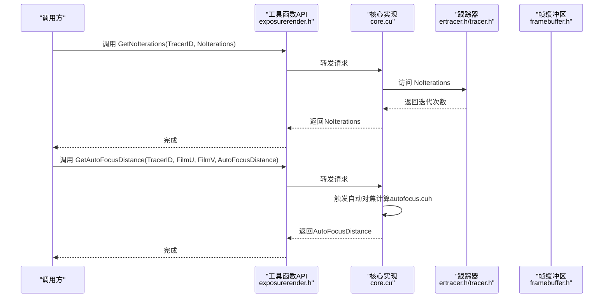
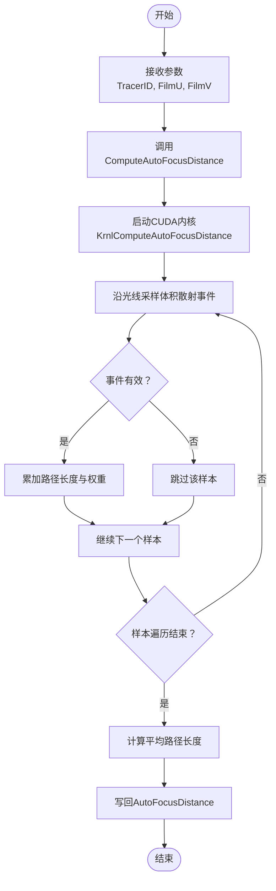
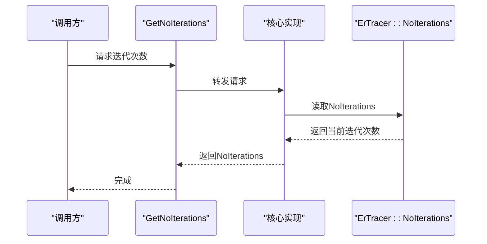
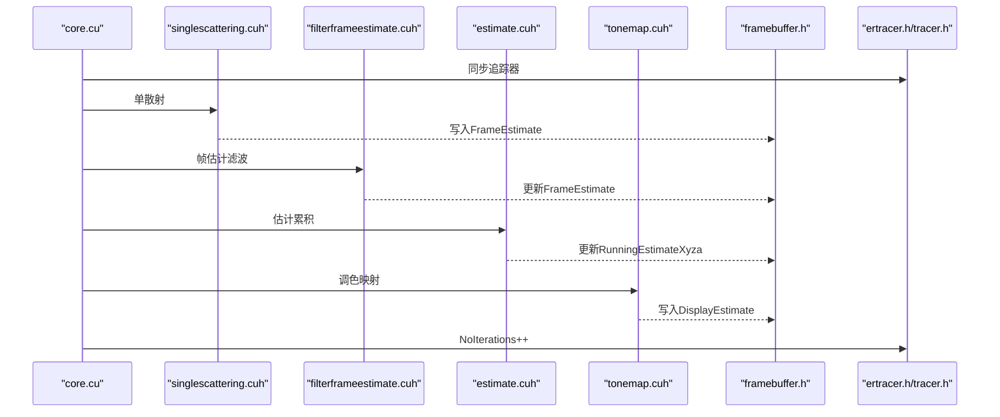
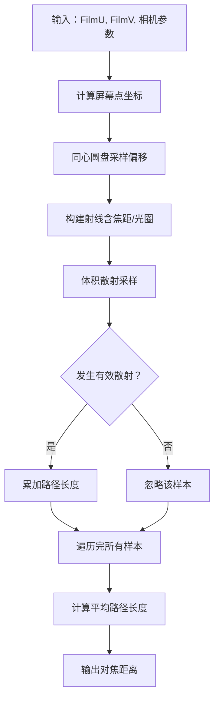
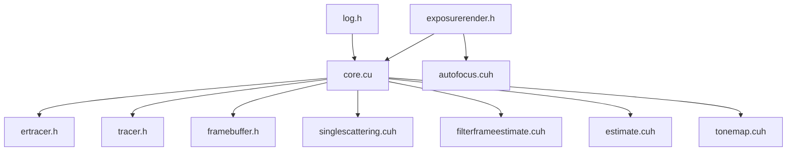

# 工具函数API

<cite>
**本文档引用的文件**
- [exposurerender.h](file://Source/exposurerender.h)
- [core.cu](file://Source/core.cu)
- [autofocus.cuh](file://Source/autofocus.cuh)
- [estimate.cuh](file://Source/estimate.cuh)
- [framebuffer.h](file://Source/framebuffer.h)
- [tracer.h](file://Source/tracer.h)
- [ertracer.h](file://Source/ertracer.h)
- [singlescattering.cuh](file://Source/singlescattering.cuh)
- [filterframeestimate.cuh](file://Source/filterframeestimate.cuh)
- [tonemap.cuh](file://Source/tonemap.cuh)
- [log.h](file://Source/log.h)
- [utilities.h](file://Source/utilities.h)
</cite>

## 目录
1. [简介](#简介)
2. [项目结构](#项目结构)
3. [核心组件](#核心组件)
4. [架构总览](#架构总览)
5. [详细组件分析](#详细组件分析)
6. [依赖关系分析](#依赖关系分析)
7. [性能考虑](#性能考虑)
8. [故障排查指南](#故障排查指南)
9. [结论](#结论)
10. [附录](#附录)

## 简介
本文件面向曝光渲染框架中的工具函数API，重点记录以下两个辅助工具函数：
- GetAutoFocusDistance：用于在给定胶片坐标下计算自动对焦距离，辅助实现景深效果与焦点区域估计。
- GetNoIterations：用于获取当前渲染跟踪器的迭代次数，便于统计渲染进度、收敛状态与调试。

文档将从系统架构、数据流、处理逻辑、集成点、错误处理与性能特征等方面进行深入解析，并提供基于现有源码的完整调用流程与调试建议。

## 项目结构
围绕工具函数API，相关的核心文件组织如下：
- 暴露API头文件：定义对外导出的工具函数接口（GetAutoFocusDistance、GetNoIterations）。
- 渲染管线实现：包含单散射、帧估计过滤、运行时估计累积、色调映射等阶段。
- 帧缓冲区与跟踪器：承载渲染中间结果与迭代计数等状态。
- 自动对焦实现：CUDA内核与主机侧封装，计算像素处的平均自由程以估计对焦距离。
- 日志与实用函数：提供调试日志与通用数学/向量转换工具。

**图表来源**
- [exposurerender.h:41-42](file://Source/exposurerender.h#L41-L42)
- [core.cu:126-153](file://Source/core.cu#L126-L153)
- [singlescattering.cuh:27-38](file://Source/singlescattering.cuh#L27-L38)
- [filterframeestimate.cuh:66-74](file://Source/filterframeestimate.cuh#L66-L74)
- [estimate.cuh:34-38](file://Source/estimate.cuh#L34-L38)
- [tonemap.cuh:61-65](file://Source/tonemap.cuh#L61-L65)
- [framebuffer.h:26-105](file://Source/framebuffer.h#L26-L105)
- [tracer.h:31-55](file://Source/tracer.h#L31-L55)
- [ertracer.h:33-117](file://Source/ertracer.h#L33-L117)
- [autofocus.cuh:26-75](file://Source/autofocus.cuh#L26-L75)
- [log.h:27-39](file://Source/log.h#L27-L39)
- [utilities.h:28-67](file://Source/utilities.h#L28-L67)

**章节来源**
- [exposurerender.h:41-42](file://Source/exposurernder.h#L41-L42)
- [core.cu:126-153](file://Source/core.cu#L126-L153)

## 核心组件
- 工具函数API（对外）
  - GetAutoFocusDistance(TracerID, FilmU, FilmV, AutoFocusDistance)
  - GetNoIterations(TracerID, NoIterations)
- 渲染估计主流程（内部）
  - RenderEstimate(TracerID)：同步追踪器后依次执行单散射、帧估计滤波、估计累积、色调映射，并递增迭代计数。
- 帧缓冲区与跟踪器
  - FrameBuffer：管理帧估计、运行估计、显示估计等缓冲区及随机种子。
  - Tracer/ErTracer：持有相机、渲染设置、体积/光源/对象绑定索引以及迭代计数NoIterations。

**章节来源**
- [exposurerender.h:41-42](file://Source/exposurerender.h#L41-L42)
- [core.cu:126-136](file://Source/core.cu#L126-L136)
- [framebuffer.h:26-105](file://Source/framebuffer.h#L26-L105)
- [tracer.h:31-55](file://Source/tracer.h#L31-L55)
- [ertracer.h:33-117](file://Source/ertracer.h#L33-L117)

## 架构总览
工具函数API位于渲染框架的外部接口层，通过TracerID定位到具体的渲染跟踪器实例，进而访问其帧缓冲区与统计信息。渲染主流程在每次估计后更新迭代计数，为GetNoIterations提供依据；自动对焦功能则独立于主渲染流程，按需计算指定像素的对焦距离。

**图表来源**
- [exposurerender.h:41-42](file://Source/exposurerender.h#L41-L42)
- [core.cu:145-153](file://Source/core.cu#L145-L153)
- [autofocus.cuh:65-75](file://Source/autofocus.cuh#L65-L75)
- [ertracer.h:112](file://Source/ertracer.h#L112)
- [framebuffer.h:93-104](file://Source/framebuffer.h#L93-L104)

## 详细组件分析

### 工具函数API：GetAutoFocusDistance
- 函数用途
  - 在给定胶片坐标(FilmU, FilmV)下，计算该像素对应的自动对焦距离，用于景深控制或焦点区域估计。
- 参数说明
  - TracerID：渲染跟踪器标识符，用于定位具体渲染上下文。
  - FilmU, FilmV：胶片空间坐标（像素坐标），决定采样光线方向。
  - AutoFocusDistance：输出参数，返回计算得到的对焦距离。
- 返回值
  - 无直接返回值；通过输出参数AutoFocusDistance返回结果。
- 实现要点
  - 主机侧接口声明存在，但当前实现体为空，实际计算由autofocus.cuh中的ComputeAutoFocusDistance完成。
  - 内核KrnlComputeAutoFocusDistance在CUDA设备上执行，对固定数量的样本进行体积散射事件采样，统计有效事件的平均路径长度作为对焦距离。
- 使用场景
  - 结合相机光圈与焦距参数，为景深渲染提供焦点估计。
  - 与渲染主流程解耦，可按需调用以支持交互式焦点调整。

**图表来源**
- [autofocus.cuh:26-63](file://Source/autofocus.cuh#L26-L63)
- [autofocus.cuh:65-75](file://Source/autofocus.cuh#L65-L75)

**章节来源**
- [exposurerender.h:41](file://Source/exposurerender.h#L41)
- [core.cu:145-148](file://Source/core.cu#L145-L148)
- [autofocus.cuh:26-75](file://Source/autofocus.cuh#L26-L75)

### 工具函数API：GetNoIterations
- 函数用途
  - 获取当前渲染跟踪器的迭代次数，用于监控渲染收敛状态、统计迭代步数与调试。
- 参数说明
  - TracerID：渲染跟踪器标识符。
  - NoIterations：输出参数，返回当前累计的迭代次数。
- 返回值
  - 无直接返回值；通过输出参数NoIterations返回结果。
- 实现要点
  - 主机侧接口声明存在，但当前实现体为空，实际迭代计数存储于ErTracer::NoIterations。
  - 每次渲染估计主流程结束后，NoIterations自增1，体现累积估计的迭代步数。
- 使用场景
  - 进度条显示与收敛判断。
  - 调试渲染过程中的估计稳定性与噪声水平。

**图表来源**
- [exposurerender.h:42](file://Source/exposurerender.h#L42)
- [core.cu:150-153](file://Source/core.cu#L150-L153)
- [ertracer.h:112](file://Source/ertracer.h#L112)

**章节来源**
- [exposurerender.h:42](file://Source/exposurerender.h#L42)
- [core.cu:150-153](file://Source/core.cu#L150-L153)
- [ertracer.h:112](file://Source/ertracer.h#L112)

### 渲染估计主流程与迭代统计
- RenderEstimate(TracerID)
  - 同步追踪器后依次执行：单散射、帧估计滤波、估计累积、色调映射。
  - 每次估计完成后，NoIterations自增1，反映累积估计的迭代步数。
- 估计累积（Cumulative Moving Average）
  - 使用运行估计缓冲区与帧估计缓冲区，按当前迭代次数进行移动平均，逐步稳定图像。
- 帧缓冲区
  - 包含FrameEstimate、RunningEstimateXyza、DisplayEstimate等缓冲区，支撑多阶段渲染与显示。
- 调色映射
  - 将运行估计转换为显示估计，结合曝光参数生成最终像素颜色。

**图表来源**
- [core.cu:126-136](file://Source/core.cu#L126-L136)
- [singlescattering.cuh:27-38](file://Source/singlescattering.cuh#L27-L38)
- [filterframeestimate.cuh:66-74](file://Source/filterframeestimate.cuh#L66-L74)
- [estimate.cuh:34-38](file://Source/estimate.cuh#L34-L38)
- [tonemap.cuh:61-65](file://Source/tonemap.cuh#L61-L65)
- [framebuffer.h:93-104](file://Source/framebuffer.h#L93-L104)
- [ertracer.h:112](file://Source/ertracer.h#L112)

**章节来源**
- [core.cu:126-136](file://Source/core.cu#L126-L136)
- [estimate.cuh:27-38](file://Source/estimate.cuh#L27-L38)
- [framebuffer.h:26-105](file://Source/framebuffer.h#L26-L105)
- [ertracer.h:112](file://Source/ertracer.h#L112)

### 自动对焦算法原理
- 核心思想
  - 在给定胶片坐标处，沿多个随机偏移的屏幕点方向发射光线，对每条光线进行体积散射事件采样。
  - 对于发生有效散射事件的样本，累加其路径长度（从相机位置到散射点的距离），最后以加权平均的方式得到对焦距离。
- 关键步骤
  - 屏幕点扰动：在FilmU/FilmV基础上加入小幅度同心圆盘采样，模拟景深模糊。
  - 光线构建：基于相机参数与屏幕点构造射线，限制近远裁剪面。
  - 体积采样：沿光线步进，根据密度与衰减函数判断是否发生散射事件。
  - 路径长度统计：仅对有效事件累加路径长度，最终计算平均值作为对焦距离。
- 适用性
  - 适用于体积渲染场景下的焦点估计，可作为景深参数的参考输入。

**图表来源**
- [autofocus.cuh:38-62](file://Source/autofocus.cuh#L38-L62)

**章节来源**
- [autofocus.cuh:26-75](file://Source/autofocus.cuh#L26-L75)

### 迭代统计的含义与调试信息
- 迭代统计含义
  - NoIterations表示运行估计的累积迭代次数，数值越高通常意味着估计更稳定、噪声更低。
- 调试信息获取
  - 可通过GetNoIterations查询当前迭代次数，结合渲染主流程的执行时间与显示估计变化进行调试。
  - 日志工具提供DebugLog接口，可用于输出关键节点信息（当前已注释，启用后可输出调试日志）。

**章节来源**
- [ertracer.h:112](file://Source/ertracer.h#L112)
- [core.cu:135](file://Source/core.cu#L135)
- [log.h:27-39](file://Source/log.h#L27-L39)

## 依赖关系分析
- 接口依赖
  - 工具函数API依赖于ErTracer/Tracer实例及其帧缓冲区。
  - 自动对焦功能依赖于相机参数、随机种子与体积散射采样。
- 内部耦合
  - 渲染主流程与迭代统计紧密耦合，NoIterations贯穿估计累积阶段。
  - 帧缓冲区在各阶段之间传递中间结果，确保数据一致性。
- 外部依赖
  - CUDA运行时与内核调度宏（LAUNCH_CUDA_KERNEL_TIMED等）用于性能计时与内核执行。

**图表来源**
- [exposurerender.h:41-42](file://Source/exposurerender.h#L41-L42)
- [core.cu:126-153](file://Source/core.cu#L126-L153)
- [ertracer.h:33-117](file://Source/ertracer.h#L33-L117)
- [tracer.h:31-55](file://Source/tracer.h#L31-L55)
- [framebuffer.h:26-105](file://Source/framebuffer.h#L26-L105)
- [singlescattering.cuh:27-38](file://Source/singlescattering.cuh#L27-L38)
- [filterframeestimate.cuh:66-74](file://Source/filterframeestimate.cuh#L66-L74)
- [estimate.cuh:34-38](file://Source/estimate.cuh#L34-L38)
- [tonemap.cuh:61-65](file://Source/tonemap.cuh#L61-L65)
- [autofocus.cuh:65-75](file://Source/autofocus.cuh#L65-L75)
- [log.h:27-39](file://Source/log.h#L27-L39)

**章节来源**
- [exposurerender.h:41-42](file://Source/exposurerender.h#L41-L42)
- [core.cu:126-153](file://Source/core.cu#L126-L153)

## 性能考虑
- CUDA内核计时
  - 多个阶段使用LAUNCH_CUDA_KERNEL_TIMED进行内核执行与计时，便于识别瓶颈。
- 并行策略
  - 各阶段采用二维块/网格维度并行，充分利用GPU吞吐能力。
- 随机种子管理
  - 帧缓冲区维护两套随机种子缓冲，保证估计稳定性与可重现性。
- 估计累积
  - 移动平均策略随迭代次数增加逐步降低噪声，但也会增加计算开销。

**章节来源**
- [estimate.cuh:34-38](file://Source/estimate.cuh#L34-L38)
- [filterframeestimate.cuh:66-74](file://Source/filterframeestimate.cuh#L66-L74)
- [framebuffer.h:93-104](file://Source/framebuffer.h#L93-L104)

## 故障排查指南
- 自动对焦距离异常
  - 检查FilmU/FilmV是否在胶片分辨率范围内。
  - 确认相机参数（焦距、光圈）设置合理，避免极端景深导致路径长度异常。
  - 若无有效散射事件，内核会退化为最后一次事件的路径长度，需检查体积密度与采样步长。
- 迭代次数不增长
  - 确认RenderEstimate是否被正确调用，NoIterations仅在估计完成后自增。
  - 检查帧缓冲区尺寸与随机种子是否重置，避免估计停滞。
- 调试日志
  - 可启用DebugLog接口输出关键节点信息，辅助定位问题。

**章节来源**
- [autofocus.cuh:59-62](file://Source/autofocus.cuh#L59-L62)
- [core.cu:135](file://Source/core.cu#L135)
- [framebuffer.h:70-74](file://Source/framebuffer.h#L70-L74)
- [log.h:27-39](file://Source/log.h#L27-L39)

## 结论
- GetAutoFocusDistance与GetNoIterations为曝光渲染框架提供了简洁而关键的工具函数API，分别用于对焦距离估计与迭代统计查询。
- 自动对焦算法基于体积散射事件的路径长度统计，适合景深渲染场景；迭代统计则为渲染收敛与调试提供量化指标。
- 建议在实际应用中结合相机参数与渲染设置，合理使用这两个工具函数以提升渲染质量与开发效率。

## 附录
- 代码示例（路径引用）
  - 获取自动对焦距离
    - [exposurerender.h:41](file://Source/exposurerender.h#L41)
    - [core.cu:145-148](file://Source/core.cu#L145-L148)
    - [autofocus.cuh:65-75](file://Source/autofocus.cuh#L65-L75)
  - 获取迭代次数
    - [exposurerender.h:42](file://Source/exposurerender.h#L42)
    - [core.cu:150-153](file://Source/core.cu#L150-L153)
    - [ertracer.h:112](file://Source/ertracer.h#L112)
  - 渲染估计主流程
    - [core.cu:126-136](file://Source/core.cu#L126-L136)
    - [singlescattering.cuh:27-38](file://Source/singlescattering.cuh#L27-L38)
    - [filterframeestimate.cuh:66-74](file://Source/filterframeestimate.cuh#L66-L74)
    - [estimate.cuh:34-38](file://Source/estimate.cuh#L34-L38)
    - [tonemap.cuh:61-65](file://Source/tonemap.cuh#L61-L65)
  - 帧缓冲区与跟踪器
    - [framebuffer.h:26-105](file://Source/framebuffer.h#L26-L105)
    - [tracer.h:31-55](file://Source/tracer.h#L31-L55)
    - [ertracer.h:33-117](file://Source/ertracer.h#L33-L117)
  - 日志与实用函数
    - [log.h:27-39](file://Source/log.h#L27-L39)
    - [utilities.h:28-67](file://Source/utilities.h#L28-L67)