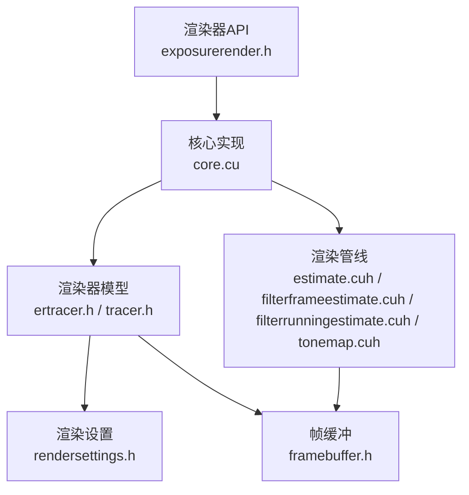
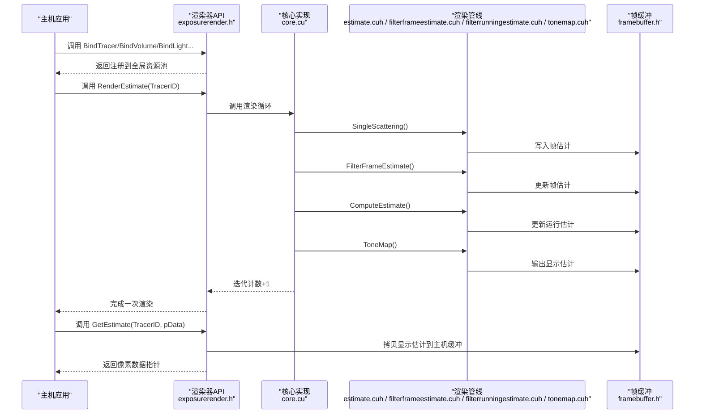
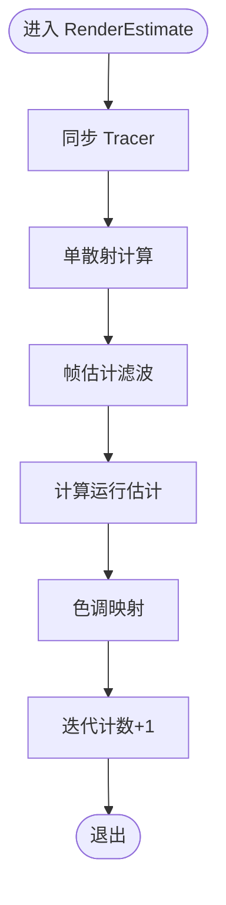
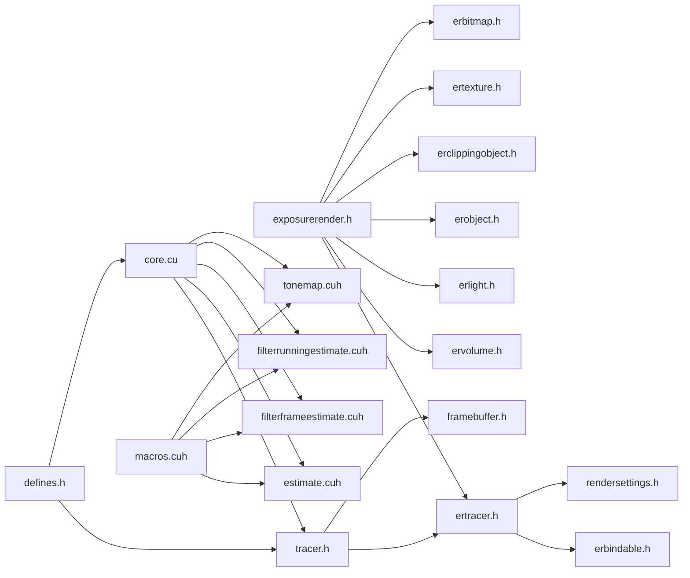

# 渲染器API

<cite>
**本文引用的文件**
- [exposurerender.h](file://Source/exposurerender.h)
- [exposurerender.cpp](file://Source/exposurerender.cpp)
- [ertracer.h](file://Source/ertracer.h)
- [tracer.h](file://Source/tracer.h)
- [rendersettings.h](file://Source/rendersettings.h)
- [erbindable.h](file://Source/erbindable.h)
- [enums.h](file://Source/enums.h)
- [defines.h](file://Source/defines.h)
- [core.cu](file://Source/core.cu)
- [estimate.cuh](file://Source/estimate.cuh)
- [filterframeestimate.cuh](file://Source/filterframeestimate.cuh)
- [filterrunningestimate.cuh](file://Source/filterrunningestimate.cuh)
- [tonemap.cuh](file://Source/tonemap.cuh)
- [framebuffer.h](file://Source/framebuffer.h)
- [volumes.h](file://Source/volumes.h)
- [macros.cuh](file://Source/macros.cuh)
- [README.md](file://README.md)
</cite>

## 目录
1. [简介](#简介)
2. [项目结构](#项目结构)
3. [核心组件](#核心组件)
4. [架构总览](#架构总览)
5. [详细组件分析](#详细组件分析)
6. [依赖关系分析](#依赖关系分析)
7. [性能考虑](#性能考虑)
8. [故障排查指南](#故障排查指南)
9. [结论](#结论)
10. [附录：完整体积渲染使用示例](#附录完整体积渲染使用示例)

## 简介
本文件为曝光渲染框架的渲染器API提供系统化、可操作的文档，重点覆盖以下核心接口与流程：
- 绑定类API：BindTracer、BindVolume、BindLight、BindObject、BindClippingObject、BindTexture、BindBitmap
- 渲染控制API：RenderEstimate（执行一次渲染估计）、GetEstimate（获取当前显示估计）
- 查询API：GetNoIterations（查询累计迭代次数）、GetAutoFocusDistance（自动对焦距离，当前未实现）
- 渲染管线阶段：单散射计算、帧估计滤波、运行估计更新、色调映射
- 渲染配置参数：遍历步长、阴影、着色模式、密度缩放、梯度阈值与因子等
- 性能优化建议：CUDA内核启动参数、缓冲区复用、随机种子缓存、后处理滤波策略

该API以DLL导出形式提供，面向主机侧调用，内部通过CUDA内核在GPU上执行渲染管线。

## 项目结构
围绕渲染器API的关键文件组织如下：
- 导出头文件：定义对外API（绑定、渲染、查询）
- 渲染器模型：ErTracer及其派生Tracer，承载渲染设置、相机、传输函数、对象索引等
- 渲染设置：RenderSettings（遍历与着色）、枚举类型、常量宏
- 帧缓冲：FrameBuffer（多层设备/主机缓冲，支持滤波与色调映射）
- 渲染管线：单散射、帧估计滤波、运行估计、色调映射等CUDA内核
- 核心实现：core.cu中具体调用各阶段并维护迭代计数

图表来源
- [exposurerender.h:32-42](file://Source/exposurerender.h#L32-L42)
- [core.cu:126-153](file://Source/core.cu#L126-L153)
- [ertracer.h:33-117](file://Source/ertracer.h#L33-L117)
- [tracer.h:31-55](file://Source/tracer.h#L31-L55)
- [rendersettings.h:27-131](file://Source/rendersettings.h#L27-L131)
- [framebuffer.h:26-105](file://Source/framebuffer.h#L26-L105)
- [estimate.cuh:27-38](file://Source/estimate.cuh#L27-L38)
- [filterframeestimate.cuh:33-74](file://Source/filterframeestimate.cuh#L33-L74)
- [filterrunningestimate.cuh:55-200](file://Source/filterrunningestimate.cuh#L55-L200)
- [tonemap.cuh:49-65](file://Source/tonemap.cuh#L49-L65)

章节来源
- [exposurerender.h:32-42](file://Source/exposurerender.h#L32-L42)
- [core.cu:126-153](file://Source/core.cu#L126-L153)
- [README.md:14-22](file://README.md#L14-L22)

## 核心组件
- 渲染器模型 ErTracer/Tracer
  - ErTracer：继承自 ErBindable，包含1D传输函数（不透明度/漫反射/镜面/光泽/发射）、相机、渲染设置、对象ID集合、体积ID、迭代计数等
  - Tracer：在 ErTracer 基础上增加 FrameBuffer，负责渲染输出缓冲与尺寸调整
- 渲染设置 RenderSettings
  - 遍历设置：主路径步进因子、阴影步进因子、是否启用阴影、最大阴影距离
  - 着色设置：着色模式、密度缩放、是否按密度调制不透明度、梯度计算方式、梯度阈值、梯度因子
- 帧缓冲 FrameBuffer
  - 设备侧：帧估计、临时帧估计、运行估计、显示估计、滤波后显示估计、随机种子及副本
  - 主机侧：显示估计主机拷贝
  - 提供 Resize/Free/Reset 等生命周期管理

章节来源
- [ertracer.h:33-117](file://Source/ertracer.h#L33-L117)
- [tracer.h:31-55](file://Source/tracer.h#L31-L55)
- [rendersettings.h:27-131](file://Source/rendersettings.h#L27-L131)
- [framebuffer.h:26-105](file://Source/framebuffer.h#L26-L105)

## 架构总览
渲染器API采用“主机侧控制 + GPU内核执行”的分层设计。主机侧通过绑定接口注册场景元素，随后调用 RenderEstimate 执行一次完整渲染循环；最终通过 GetEstimate 获取当前显示估计数据。

图表来源
- [exposurerender.h:32-42](file://Source/exposurerender.h#L32-L42)
- [core.cu:126-143](file://Source/core.cu#L126-L143)
- [estimate.cuh:27-38](file://Source/estimate.cuh#L27-L38)
- [filterframeestimate.cuh:66-74](file://Source/filterframeestimate.cuh#L66-L74)
- [filterrunningestimate.cuh:193-200](file://Source/filterrunningestimate.cuh#L193-L200)
- [tonemap.cuh:49-65](file://Source/tonemap.cuh#L49-L65)
- [framebuffer.h:29-41](file://Source/framebuffer.h#L29-L41)

## 详细组件分析

### BindTracer 函数
- 功能：将一个 ErTracer 实例绑定到渲染系统，使其可被后续渲染调用使用
- 参数
  - Tracer：要绑定的渲染器实例（传入常量引用）
  - Bind：布尔开关，默认 true 表示绑定，false 表示解绑
- 返回值：无
- 使用要点
  - 绑定前需确保 Tracer 已完成相机、传输函数、光照、对象、裁剪对象、体积等资源的配置
  - 解绑时会从全局资源池移除对应实例
- 错误处理
  - 当前实现通过调试日志记录绑定状态，未见显式异常抛出
- 示例参考
  - [exposurerender.h:32](file://Source/exposurerender.h#L32)
  - [core.cu:109-114](file://Source/core.cu#L109-L114)

章节来源
- [exposurerender.h:32](file://Source/exposurerender.h#L32)
- [core.cu:109-114](file://Source/core.cu#L109-L114)

### RenderEstimate 函数
- 功能：执行一次完整的渲染估计流程，包括单散射、帧估计滤波、运行估计更新、色调映射，并递增迭代计数
- 参数
  - TracerID：目标渲染器实例的标识符
- 返回值：无
- 处理流程
  - 同步 Tracer
  - 单散射计算
  - 帧估计高斯滤波
  - 计算运行估计（累积移动平均）
  - 色调映射（将运行估计转换为显示估计）
  - 迭代计数 NoIterations 自增
- 错误处理
  - 内部使用 CUDA 启动宏进行事件计时与错误检查
- 示例参考
  - [exposurerender.h:39](file://Source/exposurerender.h#L39)
  - [core.cu:126-136](file://Source/core.cu#L126-L136)
  - [estimate.cuh:27-38](file://Source/estimate.cuh#L27-L38)
  - [filterframeestimate.cuh:66-74](file://Source/filterframeestimate.cuh#L66-L74)
  - [tonemap.cuh:49-65](file://Source/tonemap.cuh#L49-L65)

图表来源
- [core.cu:126-136](file://Source/core.cu#L126-L136)
- [estimate.cuh:27-38](file://Source/estimate.cuh#L27-L38)
- [filterframeestimate.cuh:66-74](file://Source/filterframeestimate.cuh#L66-L74)
- [tonemap.cuh:49-65](file://Source/tonemap.cuh#L49-L65)

章节来源
- [exposurerender.h:39](file://Source/exposurerender.h#L39)
- [core.cu:126-136](file://Source/core.cu#L126-L136)

### GetEstimate 函数
- 功能：将当前显示估计（RGBA）从设备内存拷贝到主机提供的缓冲区
- 参数
  - TracerID：目标渲染器实例的标识符
  - pData：指向主机侧缓冲区的指针，要求足够容纳分辨率×4字节（RGBA）
- 返回值：无
- 注意事项
  - pData 必须由调用方分配并保证大小正确
  - 数据格式为每像素4字节（RGBA），通道范围通常映射到0–255
- 示例参考
  - [exposurerender.h:40](file://Source/exposurerender.h#L40)
  - [core.cu:138-143](file://Source/core.cu#L138-L143)
  - [framebuffer.h:97-104](file://Source/framebuffer.h#L97-L104)

章节来源
- [exposurerender.h:40](file://Source/exposurerender.h#L40)
- [core.cu:138-143](file://Source/core.cu#L138-L143)
- [framebuffer.h:97-104](file://Source/framebuffer.h#L97-L104)

### GetNoIterations 函数
- 功能：查询指定渲染器实例的累计迭代次数
- 参数
  - TracerID：目标渲染器实例的标识符
  - NoIterations：输出参数，返回当前迭代次数
- 返回值：无
- 注意事项
  - 当前实现注释掉实际读取逻辑，仅占位
- 示例参考
  - [exposurerender.h:42](file://Source/exposurerender.h#L42)
  - [core.cu:150-153](file://Source/core.cu#L150-L153)

章节来源
- [exposurerender.h:42](file://Source/exposurerender.h#L42)
- [core.cu:150-153](file://Source/core.cu#L150-L153)

### GetAutoFocusDistance 函数
- 功能：根据胶片坐标计算自动对焦距离（预留接口）
- 参数
  - TracerID：目标渲染器实例的标识符
  - FilmU/FilmV：胶片空间坐标
  - AutoFocusDistance：输出参数，返回对焦距离
- 返回值：无
- 注意事项
  - 当前实现为空实现，未提供功能
- 示例参考
  - [exposurerender.h:41](file://Source/exposurerender.h#L41)
  - [core.cu:145-148](file://Source/core.cu#L145-L148)

章节来源
- [exposurerender.h:41](file://Source/exposurerender.h#L41)
- [core.cu:145-148](file://Source/core.cu#L145-L148)

### 绑定类API（BindVolume/BindLight/BindObject/BindClippingObject/BindTexture/BindBitmap）
- 功能：将场景中的体积、光源、几何对象、裁剪对象、纹理、位图等资源绑定到渲染系统
- 参数
  - 对应实体（如 ErVolume、ErLight 等）按常量引用传入
  - Bind：默认 true 表示绑定，false 表示解绑
- 返回值：无
- 使用要点
  - 绑定后，渲染器可通过内部ID映射访问这些资源
  - 解绑时从全局资源池移除
- 示例参考
  - [exposurerender.h:33-38](file://Source/exposurerender.h#L33-L38)
  - [core.cu:109-124](file://Source/core.cu#L109-L124)

章节来源
- [exposurerender.h:33-38](file://Source/exposurerender.h#L33-L38)
- [core.cu:109-124](file://Source/core.cu#L109-L124)

### 渲染器状态管理
- ErBindable 基类
  - ID：唯一标识符
  - Enabled：是否启用
  - Dirty：脏标记（用于驱动更新）
  - BindHost/UnbindHost：主机侧绑定/解绑
- ErTracer/Tracer
  - 保存相机、渲染设置、传输函数、对象ID集合、体积ID、迭代计数
  - Tracer 在 ErTracer 基础上扩展帧缓冲
- 帧缓冲 FrameBuffer
  - 设备侧与主机侧缓冲分离，支持滤波与随机种子缓存
  - 提供 Resize/Free/Reset 生命周期管理

章节来源
- [erbindable.h:28-68](file://Source/erbindable.h#L28-L68)
- [ertracer.h:33-117](file://Source/ertracer.h#L33-L117)
- [tracer.h:31-55](file://Source/tracer.h#L31-L55)
- [framebuffer.h:26-105](file://Source/framebuffer.h#L26-L105)

### 渲染配置参数
- 遍历设置（TraversalSettings）
  - StepFactorPrimary：主光线步进因子
  - StepFactorShadow：阴影步进因子
  - Shadows：是否启用阴影
  - MaxShadowDistance：最大阴影距离
- 着色设置（ShadingSettings）
  - Type：着色模式（BRDF/相函数/混合/调制/阈值/梯度幅值）
  - DensityScale：密度缩放
  - OpacityModulated：是否按密度调制不透明度
  - GradientComputation：梯度计算方式
  - GradientThreshold：梯度阈值
  - GradientFactor：梯度因子
- 其他
  - 枚举类型定义于 enums.h，涵盖内存类型、程序化纹理、形状、着色模式、梯度模式、异常级别、发光单位、散射函数与类型等

章节来源
- [rendersettings.h:27-131](file://Source/rendersettings.h#L27-L131)
- [enums.h:24-111](file://Source/enums.h#L24-L111)

## 依赖关系分析
- 头文件依赖
  - exposurerender.h 依赖 ertracer.h、ervolume.h、erlight.h、erobject.h、erclippingobject.h、ertexture.h、erbitmap.h
  - ertracer.h 依赖 erbindable.h、transferfunction.h、camera.h、rendersettings.h
  - tracer.h 依赖 ertracer.h、framebuffer.h
  - core.cu 依赖 tracers 管理器、渲染管线内核
- 内核与宏
  - 渲染管线内核使用 LAUNCH_DIMENSIONS/LAUNCH_CUDA_KERNEL_TIMED 等宏进行网格/块维度计算与计时
  - 宏定义位于 macros.cuh
- 常量与平台
  - defines.h 提供EXPOSURE_RENDER_DLL、HOST/DEVICE宏、数学常量、颜色通道数等

图表来源
- [exposurerender.h:21-28](file://Source/exposurerender.h#L21-L28)
- [ertracer.h:21-25](file://Source/ertracer.h#L21-L25)
- [tracer.h:21-23](file://Source/tracer.h#L21-L23)
- [core.cu:126-153](file://Source/core.cu#L126-L153)
- [estimate.cuh:27-38](file://Source/estimate.cuh#L27-L38)
- [filterframeestimate.cuh:66-74](file://Source/filterframeestimate.cuh#L66-L74)
- [filterrunningestimate.cuh:193-200](file://Source/filterrunningestimate.cuh#L193-L200)
- [tonemap.cuh:49-65](file://Source/tonemap.cuh#L49-L65)
- [macros.cuh:27-65](file://Source/macros.cuh#L27-L65)
- [defines.h:31-56](file://Source/defines.h#L31-L56)

章节来源
- [exposurerender.h:21-28](file://Source/exposurerender.h#L21-L28)
- [ertracer.h:21-25](file://Source/ertracer.h#L21-L25)
- [tracer.h:21-23](file://Source/tracer.h#L21-L23)
- [core.cu:126-153](file://Source/core.cu#L126-L153)
- [macros.cuh:27-65](file://Source/macros.cuh#L27-L65)
- [defines.h:31-56](file://Source/defines.h#L31-L56)

## 性能考虑
- CUDA 内核启动参数
  - 使用 LAUNCH_DIMENSIONS 宏统一计算 GridDim/BlockDim，避免硬编码
  - 不同阶段使用不同块尺寸（如 16×8、8×8）以适配不同负载
- 缓冲区复用
  - 帧缓冲包含临时缓冲与副本，减少频繁分配与拷贝
  - 随机种子缓存（RandomSeedsCopy1/2）避免每次重置生成新序列
- 迭代与估计
  - 运行估计采用累积移动平均，随着迭代次数增加图像收敛更稳定
  - 建议在交互模式下限制迭代上限，在质量模式下逐步增加
- 滤波与色调映射
  - 高斯滤波与双边滤波分别适用于平滑与边缘保持场景
  - 色调映射将运行估计转换为显示估计，注意曝光与伽马参数
- 资源绑定
  - 尽量批量绑定/解绑，减少频繁切换带来的同步开销

章节来源
- [macros.cuh:27-65](file://Source/macros.cuh#L27-L65)
- [framebuffer.h:29-91](file://Source/framebuffer.h#L29-L91)
- [estimate.cuh:27-38](file://Source/estimate.cuh#L27-L38)
- [filterframeestimate.cuh:66-74](file://Source/filterframeestimate.cuh#L66-L74)
- [filterrunningestimate.cuh:193-200](file://Source/filterrunningestimate.cuh#L193-L200)
- [tonemap.cuh:49-65](file://Source/tonemap.cuh#L49-L65)

## 故障排查指南
- 渲染结果为空或全黑
  - 检查是否已绑定有效体积与相机
  - 确认传输函数节点数量与范围合理（MAX_NO_TF_NODES）
- 性能异常
  - 检查块尺寸与分辨率匹配度，避免过小的块导致利用率低
  - 关注迭代次数增长速度，必要时降低密度缩放或步进因子
- 显示异常
  - 确认 GetEstimate 的输出缓冲大小与分辨率一致
  - 检查色调映射参数（曝光、伽马）是否合适
- 绑定问题
  - 确保绑定/解绑成对出现，避免悬挂引用
  - 检查 ErBindable 的 Dirty 标记是否触发了必要的更新

章节来源
- [defines.h:76-77](file://Source/defines.h#L76-L77)
- [framebuffer.h:93-104](file://Source/framebuffer.h#L93-L104)
- [tonemap.cuh:36-65](file://Source/tonemap.cuh#L36-L65)
- [erbindable.h:28-68](file://Source/erbindable.h#L28-L68)

## 结论
渲染器API提供了清晰的绑定、渲染与查询接口，配合完善的渲染设置与帧缓冲管理，能够高效地在GPU上执行体积渲染。通过合理配置渲染参数与遵循性能优化建议，可在交互性与质量之间取得良好平衡。当前部分查询接口（如 GetNoIterations、GetAutoFocusDistance）处于占位或预留状态，建议在后续版本中完善其实现。

## 附录：完整体积渲染使用示例
以下示例展示如何正确使用渲染器API进行体积渲染（步骤说明，不包含具体代码内容）：
1. 初始化渲染器
   - 创建 ErTracer 实例，设置相机与渲染设置
   - 配置传输函数（不透明度/漫反射/镜面/光泽/发射）
   - 绑定体积、光源、对象、裁剪对象、纹理与位图
   - 调用 BindTracer 完成渲染器注册
   - 参考：[exposurerender.h:32-38](file://Source/exposurerender.h#L32-L38)，[ertracer.h:33-117](file://Source/ertracer.h#L33-L117)，[rendersettings.h:27-131](file://Source/rendersettings.h#L27-L131)
2. 执行渲染循环
   - 循环调用 RenderEstimate(TracerID) 触发一次渲染估计
   - 在每次渲染后检查迭代次数，直到达到期望质量
   - 参考：[exposurerender.h:39](file://Source/exposurerender.h#L39)，[core.cu:126-136](file://Source/core.cu#L126-L136)
3. 获取结果
   - 分配足够大的主机缓冲区，调用 GetEstimate(TracerID, pData) 获取RGBA像素数据
   - 参考：[exposurerender.h:40](file://Source/exposurerender.h#L40)，[core.cu:138-143](file://Source/core.cu#L138-L143)，[framebuffer.h:97-104](file://Source/framebuffer.h#L97-L104)
4. 查询统计信息
   - 如需迭代次数，调用 GetNoIterations(TracerID, NoIterations)
   - 参考：[exposurerender.h:42](file://Source/exposurerender.h#L42)，[core.cu:150-153](file://Source/core.cu#L150-L153)
5. 资源清理
   - 渲染完成后，可选择解绑资源或释放帧缓冲
   - 参考：[core.cu:109-124](file://Source/core.cu#L109-L124)，[framebuffer.h:76-91](file://Source/framebuffer.h#L76-L91)

章节来源
- [exposurerender.h:32-42](file://Source/exposurerender.h#L32-L42)
- [ertracer.h:33-117](file://Source/ertracer.h#L33-L117)
- [rendersettings.h:27-131](file://Source/rendersettings.h#L27-L131)
- [core.cu:109-153](file://Source/core.cu#L109-L153)
- [framebuffer.h:29-91](file://Source/framebuffer.h#L29-L91)