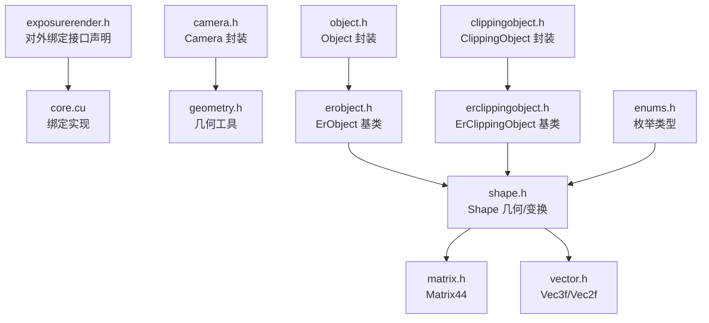
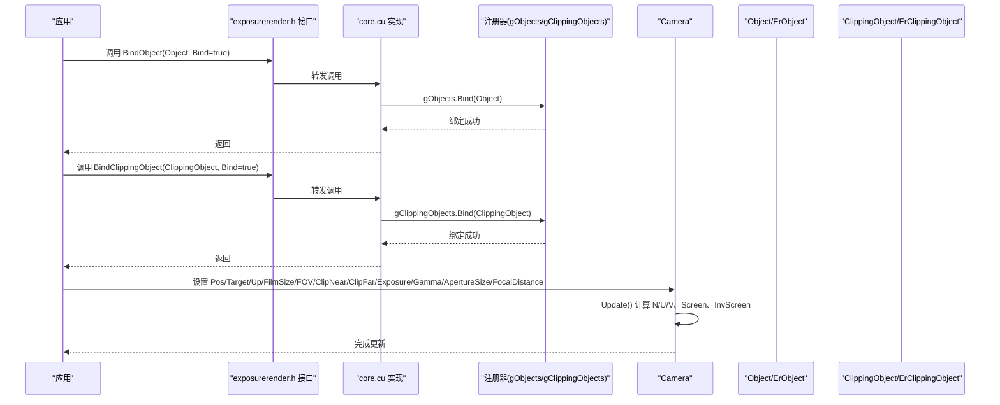
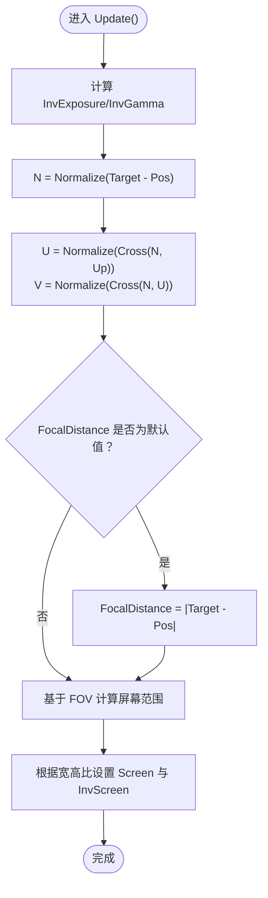
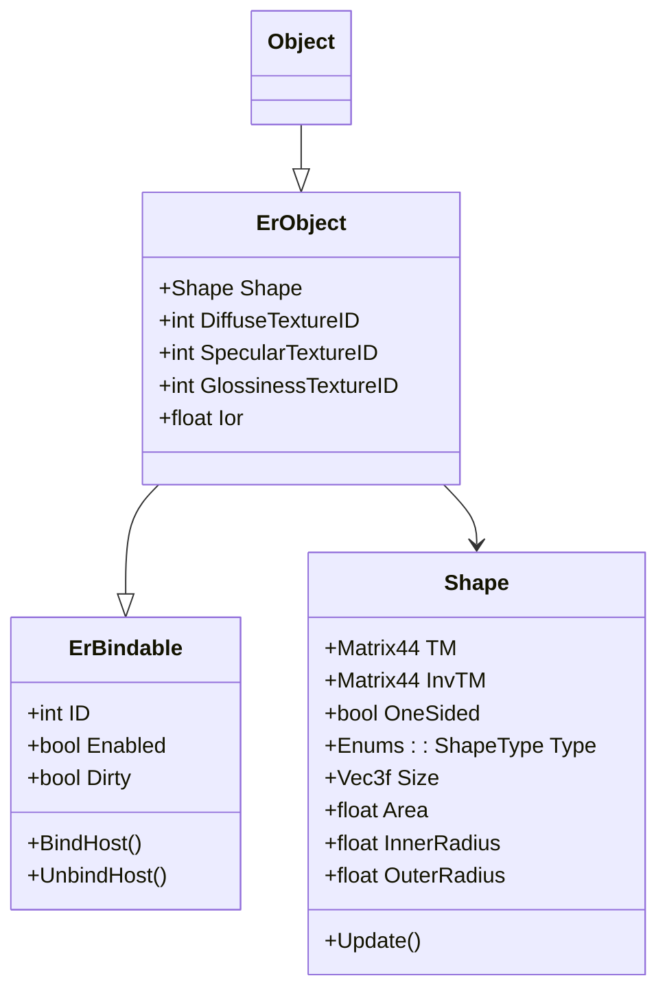
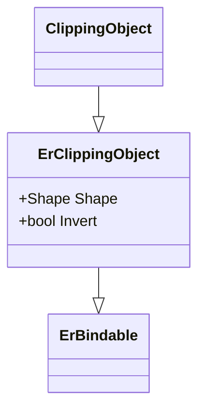
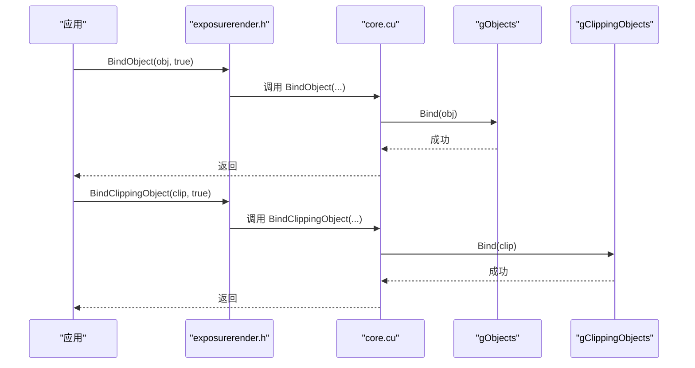
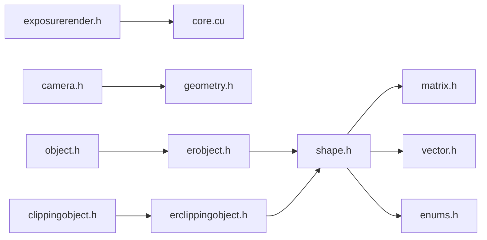

# 相机和对象API

<cite>
**本文档引用的文件**
- [exposurerender.h](file://Source/exposurerrender.h)
- [exposurerender.cpp](file://Source/exposurerender.cpp)
- [camera.h](file://Source/camera.h)
- [object.h](file://Source/object.h)
- [clippingobject.h](file://Source/clippingobject.h)
- [erobject.h](file://Source/erobject.h)
- [erclippingobject.h](file://Source/erclippingobject.h)
- [erbindable.h](file://Source/erbindable.h)
- [shape.h](file://Source/shape.h)
- [enums.h](file://Source/enums.h)
- [vector.h](file://Source/vector.h)
- [matrix.h](file://Source/matrix.h)
- [geometry.h](file://Source/geometry.h)
- [core.cu](file://Source/core.cu)
</cite>

## 目录
1. [简介](#简介)
2. [项目结构](#项目结构)
3. [核心组件](#核心组件)
4. [架构总览](#架构总览)
5. [详细组件分析](#详细组件分析)
6. [依赖关系分析](#依赖关系分析)
7. [性能考虑](#性能考虑)
8. [故障排除指南](#故障排除指南)
9. [结论](#结论)
10. [附录：完整使用示例与最佳实践](#附录完整使用示例与最佳实践)

## 简介
本文件面向曝光渲染框架的相机与对象API，重点记录以下内容：
- 绑定接口：BindObject 与 BindClippingObject 的作用与用法
- 相机API：相机参数（位置、目标点、上方向、胶片尺寸、视野角、近远裁剪面、曝光、伽马、光圈、焦距等）的设置与调整
- 对象与裁剪对象：几何变换（形状与矩阵）、材质属性（漫反射/镜面/光泽度贴图与折射率）与裁剪功能
- 场景构建流程：从创建对象到绑定、再到渲染估计的整体步骤

本指南兼顾工程实现细节与可读性，帮助开发者快速掌握相机与对象API的正确使用方式。

## 项目结构
围绕相机与对象API的关键文件组织如下：
- 暴露层头文件：定义对外公开的绑定与渲染接口
- 内部类型封装：Camera、Object、ClippingObject 分别封装 ErCamera、ErObject、ErClippingObject
- 基类与数据模型：ErBindable 提供统一的绑定状态；Shape 描述几何与变换；Matrix44、Vec3f 等向量/矩阵类型支撑几何运算
- 实现层：核心绑定逻辑在实现文件中完成

图表来源
- [exposurerender.h:32-43](file://Source/exposurerender.h#L32-L43)
- [core.cu:66-115](file://Source/core.cu#L66-L115)
- [camera.h:26-116](file://Source/camera.h#L26-L116)
- [object.h:26-45](file://Source/object.h#L26-L45)
- [clippingobject.h:26-44](file://Source/clippingobject.h#L26-L44)
- [erobject.h:27-67](file://Source/erobject.h#L27-L67)
- [erclippingobject.h:27-58](file://Source/erclippingobject.h#L27-L58)
- [shape.h:57-113](file://Source/shape.h#L57-L113)
- [enums.h:52-61](file://Source/enums.h#L52-L61)
- [matrix.h:27-56](file://Source/matrix.h#L27-L56)
- [vector.h:450-495](file://Source/vector.h#L450-L495)
- [geometry.h:30-68](file://Source/geometry.h#L30-L68)

章节来源
- [exposurerender.h:32-43](file://Source/exposurerender.h#L32-L43)
- [core.cu:66-115](file://Source/core.cu#L66-L115)
- [camera.h:26-116](file://Source/camera.h#L26-L116)
- [object.h:26-45](file://Source/object.h#L26-L45)
- [clippingobject.h:26-44](file://Source/clippingobject.h#L26-L44)
- [erobject.h:27-67](file://Source/erobject.h#L27-L67)
- [erclippingobject.h:27-58](file://Source/erclippingobject.h#L27-L58)
- [shape.h:57-113](file://Source/shape.h#L57-L113)
- [enums.h:52-61](file://Source/enums.h#L52-L61)
- [matrix.h:27-56](file://Source/matrix.h#L27-L56)
- [vector.h:450-495](file://Source/vector.h#L450-L495)
- [geometry.h:30-68](file://Source/geometry.h#L30-L68)

## 核心组件
本节概述相机与对象API的关键能力与职责：
- 相机（Camera）
  - 胶片尺寸、位置、目标点、上方向、视野角、近远裁剪面、曝光、伽马、光圈大小、焦距
  - 更新内部坐标系（N/U/V）、屏幕范围与像素尺度
- 对象（Object）
  - 继承自 ErObject，承载几何（Shape）与材质属性（漫反射/镜面/光泽度贴图ID与折射率）
- 裁剪对象（ClippingObject）
  - 继承自 ErClippingObject，支持形状与布尔反转（Invert），用于场景裁剪
- 绑定接口（对外）
  - BindObject、BindClippingObject：将对象/裁剪对象加入渲染管线
  - 其他绑定接口：BindTracer、BindVolume、BindLight、BindTexture、BindBitmap
  - 渲染估计接口：RenderEstimate、GetEstimate、GetAutoFocusDistance、GetNoIterations

章节来源
- [camera.h:98-116](file://Source/camera.h#L98-L116)
- [object.h:26-45](file://Source/object.h#L26-L45)
- [clippingobject.h:26-44](file://Source/clippingobject.h#L26-L44)
- [erobject.h:62-67](file://Source/erobject.h#L62-L67)
- [erclippingobject.h:56-58](file://Source/erclippingobject.h#L56-L58)
- [exposurerender.h:32-43](file://Source/exposurerender.h#L32-L43)

## 架构总览
相机与对象API通过暴露层接口与实现层绑定逻辑协同工作，形成“声明式绑定 + 运行时更新”的架构模式。

图表来源
- [exposurerender.h:32-43](file://Source/exposurerender.h#L32-L43)
- [core.cu:86-104](file://Source/core.cu#L86-L104)
- [camera.h:61-96](file://Source/camera.h#L61-L96)

## 详细组件分析

### 相机（Camera）API
- 关键参数
  - 胶片尺寸：FilmSize（像素）
  - 位置/目标/上方向：Pos、Target、Up
  - 视野角：FOV（度）
  - 近远裁剪面：ClipNear、ClipFar
  - 曝光与伽马：Exposure、Gamma
  - 光圈与焦距：ApertureSize、FocalDistance
- 更新流程
  - Update() 计算逆曝光/逆伽马、归一化主光轴N、U/V基向量
  - 根据纵横比计算屏幕边界 Screen[2][2] 与像素尺度 InvScreen
  - 若未显式设置焦距，则自动推导为 Target-Pos 的长度

图表来源
- [camera.h:61-96](file://Source/camera.h#L61-L96)

章节来源
- [camera.h:98-116](file://Source/camera.h#L98-L116)
- [camera.h:61-96](file://Source/camera.h#L61-L96)

### 对象（Object）与材质属性
- 继承关系
  - Object → ErObject → ErBindable
- 材质属性
  - DiffuseTextureID、SpecularTextureID、GlossinessTextureID：纹理ID
  - Ior：折射率
- 几何与变换
  - Shape：包含类型、尺寸、内外半径、面积、是否单面、变换矩阵 TM/InvTM
  - 通过 Update() 计算不同形状的表面积

图表来源
- [erbindable.h:28-68](file://Source/erbindable.h#L28-L68)
- [erobject.h:27-67](file://Source/erobject.h#L27-L67)
- [object.h:26-45](file://Source/object.h#L26-L45)
- [shape.h:57-113](file://Source/shape.h#L57-L113)

章节来源
- [erobject.h:62-67](file://Source/erobject.h#L62-L67)
- [shape.h:92-103](file://Source/shape.h#L92-L103)

### 裁剪对象（ClippingObject）与裁剪功能
- 继承关系
  - ClippingObject → ErClippingObject → ErBindable
- 裁剪属性
  - Shape：裁剪形状
  - Invert：布尔反转，控制内外取反
- 使用场景
  - 与场景对象配合，实现复杂几何的局部裁剪

图表来源
- [erclippingobject.h:27-58](file://Source/erclippingobject.h#L27-L58)
- [clippingobject.h:26-44](file://Source/clippingobject.h#L26-L44)

章节来源
- [erclippingobject.h:56-58](file://Source/erclippingobject.h#L56-L58)
- [clippingobject.h:26-44](file://Source/clippingobject.h#L26-L44)

### 绑定接口（对外API）
- BindObject
  - 功能：将对象加入渲染管线
  - 行为：Bind=true 时绑定，否则解绑
- BindClippingObject
  - 功能：将裁剪对象加入渲染管线
  - 行为：Bind=true 时绑定，否则解绑
- 其他绑定接口
  - BindTracer、BindVolume、BindLight、BindTexture、BindBitmap
- 渲染估计接口
  - RenderEstimate、GetEstimate、GetAutoFocusDistance、GetNoIterations

图表来源
- [exposurerender.h:32-43](file://Source/exposurerender.h#L32-L43)
- [core.cu:86-104](file://Source/core.cu#L86-L104)

章节来源
- [exposurerender.h:32-43](file://Source/exposurerender.h#L32-L43)
- [core.cu:86-104](file://Source/core.cu#L86-L104)

## 依赖关系分析
- 类型依赖
  - Object/ClippingObject 依赖 ErObject/ErClippingObject
  - ErObject/ErClippingObject 依赖 ErBindable
  - Shape 依赖 Matrix44、Vec3f、枚举类型
  - Camera 依赖 geometry.h 中的向量/矩阵工具
- 绑定依赖
  - 对外绑定接口由实现层转发至全局注册器（如 gObjects、gClippingObjects）

图表来源
- [exposurerender.h:32-43](file://Source/exposurerender.h#L32-L43)
- [core.cu:66-115](file://Source/core.cu#L66-L115)
- [camera.h:26-116](file://Source/camera.h#L26-L116)
- [object.h:26-45](file://Source/object.h#L26-L45)
- [clippingobject.h:26-44](file://Source/clippingobject.h#L26-L44)
- [erobject.h:27-67](file://Source/erobject.h#L27-L67)
- [erclippingobject.h:27-58](file://Source/erclippingobject.h#L27-L58)
- [shape.h:57-113](file://Source/shape.h#L57-L113)
- [enums.h:52-61](file://Source/enums.h#L52-L61)
- [matrix.h:27-56](file://Source/matrix.h#L27-L56)
- [vector.h:450-495](file://Source/vector.h#L450-L495)
- [geometry.h:30-68](file://Source/geometry.h#L30-L68)

章节来源
- [exposurerender.h:32-43](file://Source/exposurerender.h#L32-L43)
- [core.cu:66-115](file://Source/core.cu#L66-L115)
- [camera.h:26-116](file://Source/camera.h#L26-L116)
- [object.h:26-45](file://Source/object.h#L26-L45)
- [clippingobject.h:26-44](file://Source/clippingobject.h#L26-L44)
- [erobject.h:27-67](file://Source/erobject.h#L27-L67)
- [erclippingobject.h:27-58](file://Source/erclippingobject.h#L27-L58)
- [shape.h:57-113](file://Source/shape.h#L57-L113)
- [enums.h:52-61](file://Source/enums.h#L52-L61)
- [matrix.h:27-56](file://Source/matrix.h#L27-L56)
- [vector.h:450-495](file://Source/vector.h#L450-L495)
- [geometry.h:30-68](file://Source/geometry.h#L30-L68)

## 性能考虑
- 相机更新成本
  - Update() 包含三角函数与向量运算，建议在参数变更后统一调用，避免频繁重复计算
- 绑定开销
  - 绑定/解绑操作会更新内部注册表，应尽量批处理批量对象，减少多次切换
- 几何与材质
  - 大量对象/贴图可能带来内存与带宽压力，优先复用纹理与共享材质
- 渲染估计
  - RenderEstimate 与 GetEstimate 为关键路径，建议在主线程异步调度，避免阻塞UI

## 故障排除指南
- 绑定无效
  - 确认 BindObject/BindClippingObject 的第二个参数为 true
  - 检查对象/裁剪对象的 Enabled 状态
- 相机视角异常
  - 检查 Pos/Target/Up 是否共线导致 N/U/V 计算失败
  - 确认 FOV、FilmSize 与屏幕比例一致
- 焦点与景深问题
  - 若未设置 FocalDistance，系统会自动推导；若需要精确景深，请显式设置 ApertureSize 与 FocalDistance
- 材质不生效
  - 确认 Diffuse/Specular/Glossiness 纹理ID有效且已绑定

章节来源
- [erbindable.h:65-68](file://Source/erbindable.h#L65-L68)
- [camera.h:61-96](file://Source/camera.h#L61-L96)
- [exposurerender.h:32-43](file://Source/exposurerender.h#L32-L43)

## 结论
相机与对象API以清晰的封装与统一的绑定接口为核心，既保证了易用性，又提供了足够的灵活性。通过合理设置相机参数、管理对象层次与材质属性，并正确使用 BindObject/BindClippingObject，可以高效构建复杂的体积渲染场景。建议在实际工程中遵循“先建模、再绑定、后渲染”的流程，并结合性能优化策略提升交互体验。

## 附录：完整使用示例与最佳实践
以下为构建场景、配置相机视角与管理对象层次的参考流程（以步骤形式描述，便于对照源码实现）：

- 步骤1：创建对象
  - 使用 Object/ErObject 定义几何与材质属性（形状、尺寸、纹理ID、折射率）
  - 参考路径：[object.h:26-45](file://Source/object.h#L26-L45)、[erobject.h:27-67](file://Source/erobject.h#L27-L67)、[shape.h:57-113](file://Source/shape.h#L57-L113)
- 步骤2：创建裁剪对象
  - 使用 ClippingObject/ErClippingObject 定义裁剪形状与反转标志
  - 参考路径：[clippingobject.h:26-44](file://Source/clippingobject.h#L26-L44)、[erclippingobject.h:27-58](file://Source/erclippingobject.h#L27-L58)
- 步骤3：绑定对象与裁剪对象
  - 调用 BindObject/BindClippingObject 并传入 Bind=true
  - 参考路径：[exposurerender.h:32-43](file://Source/exposurerender.h#L32-L43)、[core.cu:86-104](file://Source/core.cu#L86-L104)
- 步骤4：配置相机
  - 设置 Pos/Target/Up/FilmSize/FOV/ClipNear/ClipFar/Exposure/Gamma/ApertureSize/FocalDistance
  - 调用 Update() 以刷新内部坐标系与屏幕参数
  - 参考路径：[camera.h:98-116](file://Source/camera.h#L98-L116)、[camera.h:61-96](file://Source/camera.h#L61-L96)
- 步骤5：渲染估计与结果获取
  - 调用 RenderEstimate 启动估计，随后使用 GetEstimate 获取结果
  - 参考路径：[exposurerender.h:39-43](file://Source/exposurerender.h#L39-L43)

最佳实践要点：
- 在场景初始化阶段集中调用 BindObject/BindClippingObject，避免频繁切换
- 相机参数修改后统一调用 Update()，确保后续渲染一致性
- 材质与纹理尽量复用，减少绑定次数
- 使用 GetAutoFocusDistance 与 FocalDistance 协同实现景深效果