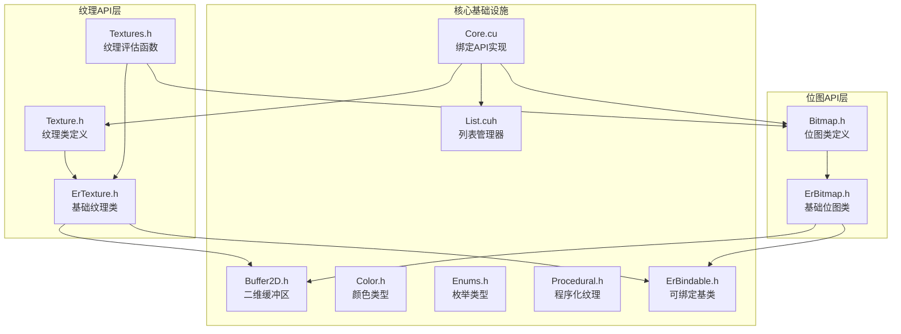
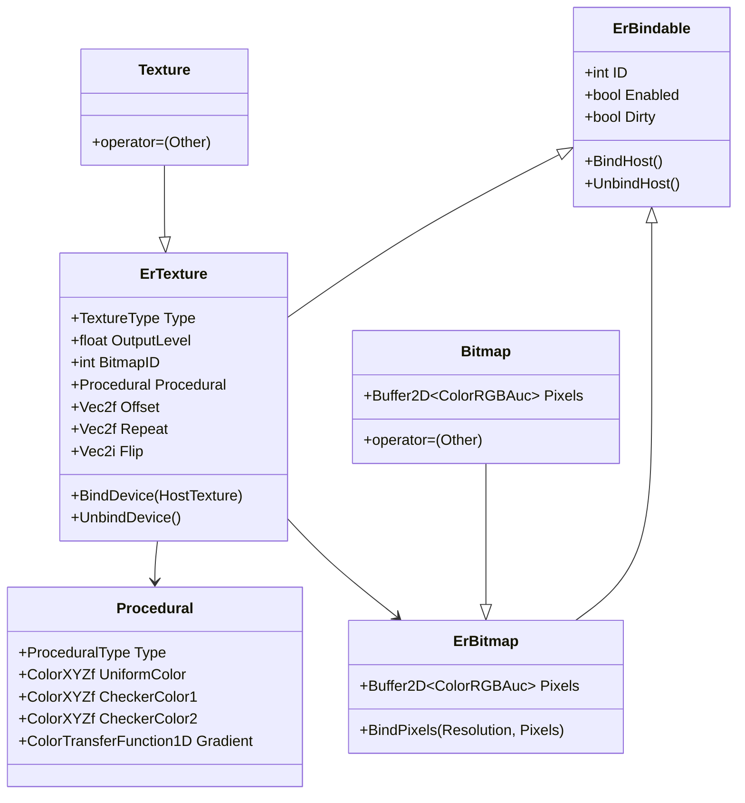
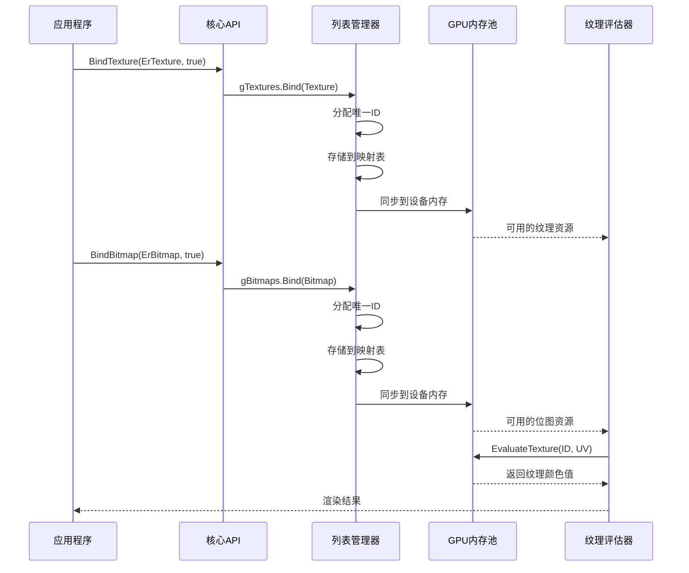
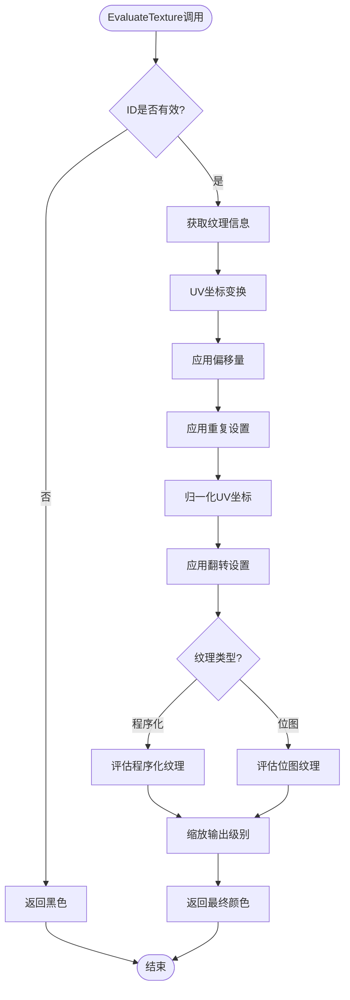
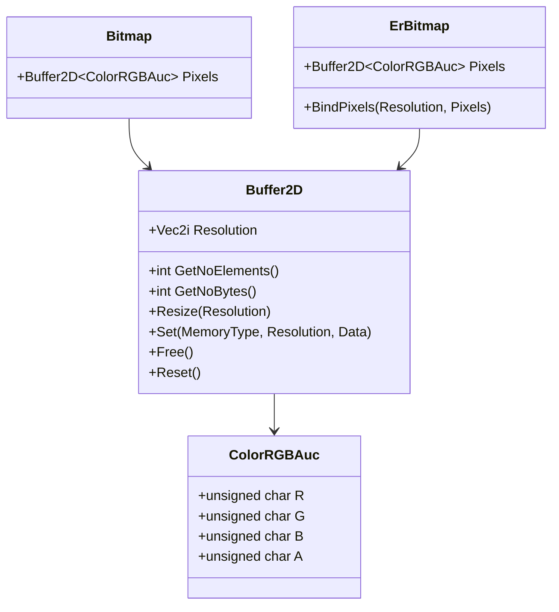
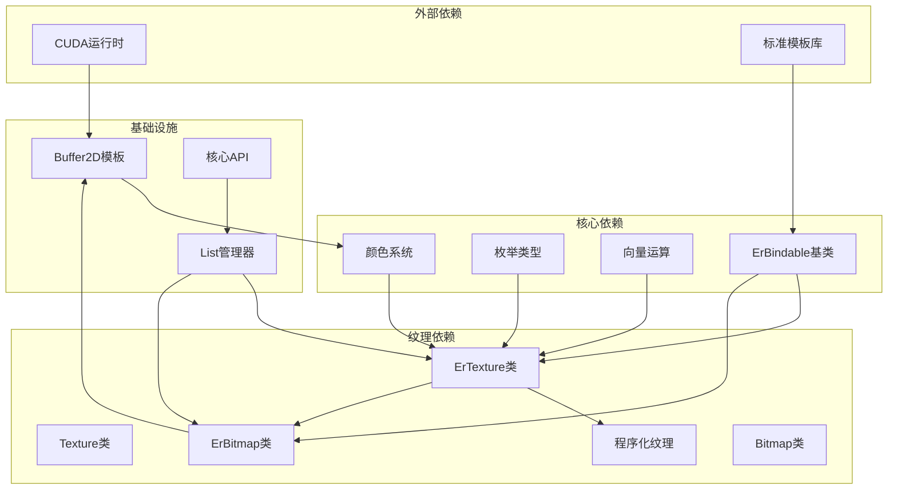

# 纹理和位图API

<cite>
**本文档引用的文件**
- [texture.h](file://Source/texture.h)
- [textures.h](file://Source/textures.h)
- [bitmap.h](file://Source/bitmap.h)
- [erbitmap.h](file://Source/erbitmap.h)
- [ertexture.h](file://Source/ertexture.h)
- [enums.h](file://Source/enums.h)
- [procedural.h](file://Source/procedural.h)
- [erbindable.h](file://Source/erbindable.h)
- [buffer2d.h](file://Source/buffer2d.h)
- [color.h](file://Source/color.h)
- [core.cu](file://Source/core.cu)
- [list.cuh](file://Source/list.cuh)
</cite>

## 目录
1. [简介](#简介)
2. [项目结构](#项目结构)
3. [核心组件](#核心组件)
4. [架构概览](#架构概览)
5. [详细组件分析](#详细组件分析)
6. [依赖关系分析](#依赖关系分析)
7. [性能考虑](#性能考虑)
8. [故障排除指南](#故障排除指南)
9. [结论](#结论)
10. [附录：完整使用示例](#附录完整使用示例)

## 简介

曝光渲染框架提供了完整的纹理和位图API系统，支持程序化纹理生成和位图纹理映射。该系统采用GPU加速的纹理管理机制，通过统一的绑定接口实现纹理资源的动态管理。

本API主要包含两个核心功能：
- **BindTexture函数**：绑定纹理资源到GPU内存池
- **BindBitmap函数**：绑定位图资源到GPU内存池

系统支持多种纹理类型（程序化纹理和位图纹理），提供灵活的纹理映射参数配置，包括偏移、重复、翻转等属性。

## 项目结构

曝光渲染框架的纹理和位图API分布在以下关键文件中：



**图表来源**
- [texture.h:26-45](file://Source/texture.h#L26-L45)
- [bitmap.h:27-74](file://Source/bitmap.h#L27-L74)
- [textures.h:64-111](file://Source/textures.h#L64-L111)
- [core.cu:106-124](file://Source/core.cu#L106-L124)

**章节来源**
- [texture.h:1-48](file://Source/texture.h#L1-L48)
- [bitmap.h:1-77](file://Source/bitmap.h#L1-L77)
- [textures.h:1-114](file://Source/textures.h#L1-L114)
- [core.cu:30-156](file://Source/core.cu#L30-L156)

## 核心组件

### 纹理系统架构



**图表来源**
- [erbindable.h:28-68](file://Source/erbindable.h#L28-L68)
- [ertexture.h:27-82](file://Source/ertexture.h#L27-L82)
- [erbitmap.h:28-61](file://Source/erbitmap.h#L28-L61)
- [texture.h:26-45](file://Source/texture.h#L26-L45)
- [bitmap.h:27-74](file://Source/bitmap.h#L27-L74)
- [procedural.h:27-60](file://Source/procedural.h#L27-L60)

### 纹理类型枚举

系统支持两种主要的纹理类型：

| 枚举值 | 类型描述 | 特点 |
|--------|----------|------|
| Procedural | 程序化纹理 | 基于数学算法生成，内存占用小 |
| Bitmap | 位图纹理 | 基于像素数据，支持复杂图像 |

**章节来源**
- [enums.h:46-50](file://Source/enums.h#L46-L50)
- [textures.h:93-108](file://Source/textures.h#L93-L108)

## 架构概览

曝光渲染框架采用分层架构设计，通过统一的绑定接口实现资源管理：



**图表来源**
- [core.cu:106-124](file://Source/core.cu#L106-L124)
- [list.cuh:59-83](file://Source/list.cuh#L59-L83)
- [textures.h:64-111](file://Source/textures.h#L64-L111)

## 详细组件分析

### 绑定API实现

#### BindTexture函数

BindTexture函数负责将纹理资源绑定到GPU内存池中：

```mermaid
flowchart TD
Start([调用BindTexture]) --> CheckBind{"是否执行绑定?"}
CheckBind --> |是| CallBind[gTextures.Bind(Texture)]
CheckBind --> |否| CallUnbind[gTextures.Unbind(Texture)]
CallBind --> ValidateID{"验证纹理ID"}
ValidateID --> |有效| AllocateMemory[分配GPU内存]
ValidateID --> |无效| LogError[记录错误日志]
AllocateMemory --> StoreTexture[存储纹理数据]
StoreTexture --> SyncToDevice[同步到设备]
SyncToDevice --> UpdateMap[更新映射表]
UpdateMap --> Success([绑定成功])
CallUnbind --> RemoveTexture[从内存池移除]
RemoveTexture --> UpdateMap
LogError --> End([结束])
Success --> End
```

**图表来源**
- [core.cu:106-114](file://Source/core.cu#L106-L114)
- [list.cuh:59-83](file://Source/list.cuh#L59-L83)

#### BindBitmap函数

BindBitmap函数专门处理位图资源的绑定：

```mermaid
flowchart TD
Start([调用BindBitmap]) --> CheckBind{"是否执行绑定?"}
CheckBind --> |是| CallBind[gBitmaps.Bind(Bitmap)]
CheckBind --> |否| CallUnbind[gBitmaps.Unbind(Bitmap)]
CallBind --> ValidateResolution{"检查位图分辨率"}
ValidateResolution --> |有效| AllocatePixels[分配像素内存]
ValidateResolution --> |无效| HandleError[处理错误]
AllocatePixels --> CopyPixels[复制像素数据]
CopyPixels --> SyncToDevice[同步到GPU]
SyncToDevice --> UpdateBitmapMap[更新位图映射]
UpdateBitmapMap --> Success([位图绑定完成])
CallUnbind --> RemoveBitmap[释放位图资源]
RemoveBitmap --> CleanupMemory[清理内存]
CleanupMemory --> Success
HandleError --> End([结束])
Success --> End
```

**图表来源**
- [core.cu:116-124](file://Source/core.cu#L116-L124)
- [list.cuh:85-106](file://Source/list.cuh#L85-L106)

**章节来源**
- [core.cu:106-124](file://Source/core.cu#L106-L124)

### 纹理评估系统

纹理评估系统负责根据UV坐标计算纹理颜色值：



**图表来源**
- [textures.h:64-111](file://Source/textures.h#L64-L111)

**章节来源**
- [textures.h:64-111](file://Source/textures.h#L64-L111)

### 内存管理系统

系统采用智能的内存管理策略，支持主机和设备内存之间的高效传输：



**图表来源**
- [buffer2d.h:26-263](file://Source/buffer2d.h#L26-L263)
- [bitmap.h:73](file://Source/bitmap.h#L73)
- [erbitmap.h:60](file://Source/erbitmap.h#L60)

**章节来源**
- [buffer2d.h:67-198](file://Source/buffer2d.h#L67-L198)
- [bitmap.h:73](file://Source/bitmap.h#L73)
- [erbitmap.h:55-58](file://Source/erbitmap.h#L55-L58)

## 依赖关系分析

### 纹理系统依赖图



**图表来源**
- [erbindable.h:28-68](file://Source/erbindable.h#L28-L68)
- [ertexture.h:27-82](file://Source/ertexture.h#L27-L82)
- [erbitmap.h:28-61](file://Source/erbitmap.h#L28-L61)
- [buffer2d.h:26-263](file://Source/buffer2d.h#L26-L263)
- [list.cuh:27-173](file://Source/list.cuh#L27-L173)

**章节来源**
- [erbindable.h:28-68](file://Source/erbindable.h#L28-L68)
- [enums.h:24-111](file://Source/enums.h#L24-L111)

## 性能考虑

### 内存优化策略

1. **零拷贝优化**：对于只读纹理数据，系统支持直接访问GPU内存
2. **批量同步**：纹理和位图资源通过列表管理器批量同步到GPU
3. **智能缓存**：纹理评估结果在GPU端缓存，避免重复计算

### 并行处理特性

- **GPU并行**：纹理评估在CUDA核心上并行执行
- **异步操作**：内存传输操作与渲染过程异步进行
- **流式处理**：支持多纹理同时处理的流水线架构

## 故障排除指南

### 常见问题及解决方案

| 问题类型 | 症状 | 可能原因 | 解决方案 |
|----------|------|----------|----------|
| 纹理绑定失败 | BindTexture返回失败 | 纹理ID冲突或内存不足 | 检查纹理ID唯一性，释放不需要的纹理 |
| 位图加载错误 | BindBitmap抛出异常 | 分辨率无效或像素数据损坏 | 验证位图文件完整性，检查内存分配 |
| 纹理显示异常 | 渲染结果不正确 | UV坐标变换错误 | 检查Offset和Repeat设置，验证纹理映射 |
| 性能问题 | 渲染帧率低 | GPU内存不足或频繁绑定 | 减少纹理数量，复用现有纹理 |

**章节来源**
- [list.cuh:85-106](file://Source/list.cuh#L85-L106)
- [buffer2d.h:67-96](file://Source/buffer2d.h#L67-L96)

## 结论

曝光渲染框架的纹理和位图API提供了强大而灵活的资源管理能力。通过统一的绑定接口和高效的GPU内存管理，系统能够支持复杂的纹理渲染需求。

关键优势包括：
- **模块化设计**：清晰的层次结构便于维护和扩展
- **高性能实现**：GPU加速的纹理处理确保实时渲染能力
- **灵活配置**：丰富的纹理参数支持各种渲染效果
- **内存优化**：智能的内存管理减少资源浪费

## 附录：完整使用示例

### 示例1：程序化纹理绑定

```cpp
// 创建程序化纹理
ExposureRender::ErTexture proceduralTex;
proceduralTex.Type = ExposureRender::Enums::Procedural;
proceduralTex.OutputLevel = 1.0f;
proceduralTex.Procedural.Type = ExposureRender::Enums::Checker;

// 绑定到渲染系统
ExposureRender::BindTexture(proceduralTex, true);

// 在着色器中使用
// EvaluateTexture(textureID, uvCoords)
```

**章节来源**
- [textures.h:93-108](file://Source/textures.h#L93-L108)
- [core.cu:106-114](file://Source/core.cu#L106-L114)

### 示例2：位图纹理绑定

```cpp
// 加载位图数据
ExposureRender::ErBitmap bitmap;
bitmap.BindPixels(Vec2i(width, height), pixelData);

// 绑定位图到GPU
ExposureRender::BindBitmap(bitmap, true);

// 配置纹理映射参数
ExposureRender::ErTexture tex;
tex.Type = ExposureRender::Enums::Bitmap;
tex.BitmapID = bitmapID;
tex.Offset = Vec2f(0.0f, 0.0f);
tex.Repeat = Vec2f(1.0f, 1.0f);
tex.Flip = Vec2i(0, 0);

// 绑定纹理
ExposureRender::BindTexture(tex, true);
```

**章节来源**
- [erbitmap.h:55-58](file://Source/erbitmap.h#L55-L58)
- [core.cu:116-124](file://Source/core.cu#L116-L124)
- [textures.h:75-91](file://Source/textures.h#L75-L91)

### 示例3：纹理参数配置

```cpp
// 创建纹理对象
ExposureRender::ErTexture texture;

// 设置纹理类型
texture.Type = ExposureRender::Enums::Procedural;

// 配置纹理映射参数
texture.Offset = Vec2f(0.1f, 0.2f);      // 纹理偏移
texture.Repeat = Vec2f(2.0f, 1.5f);      // 重复次数
texture.Flip = Vec2i(1, 0);              // X轴翻转

// 设置输出级别
texture.OutputLevel = 0.8f;

// 绑定到渲染系统
ExposureRender::BindTexture(texture, true);
```

**章节来源**
- [ertexture.h:75-81](file://Source/ertexture.h#L75-L81)
- [textures.h:75-91](file://Source/textures.h#L75-L91)