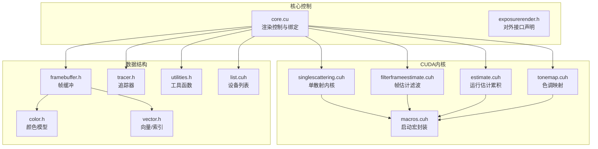
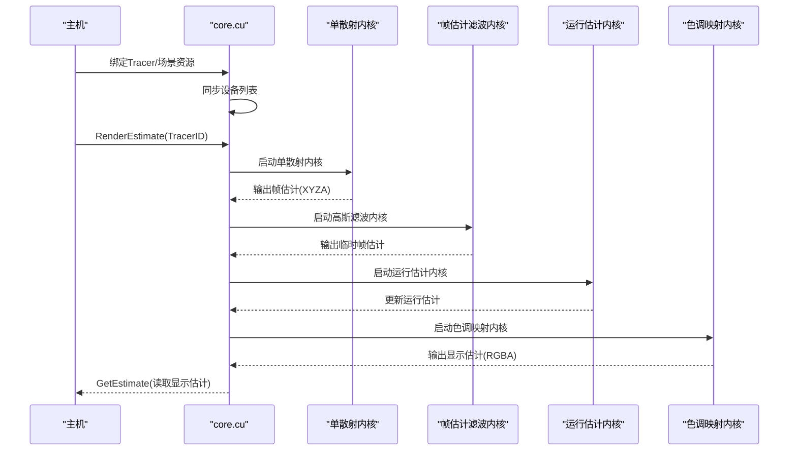
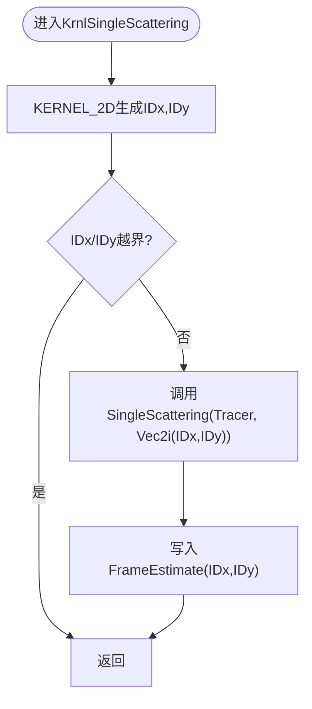
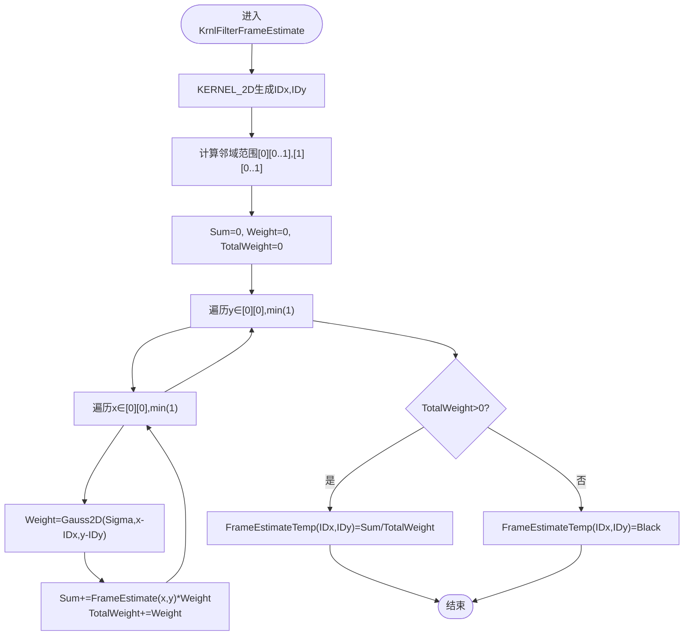
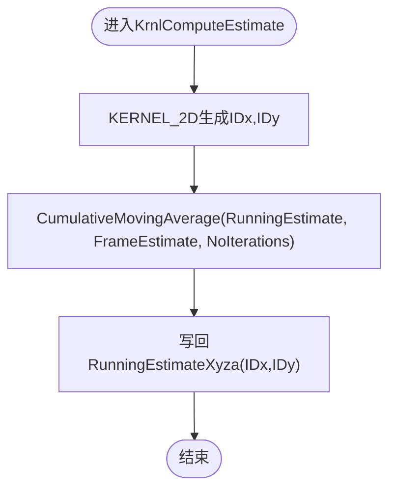
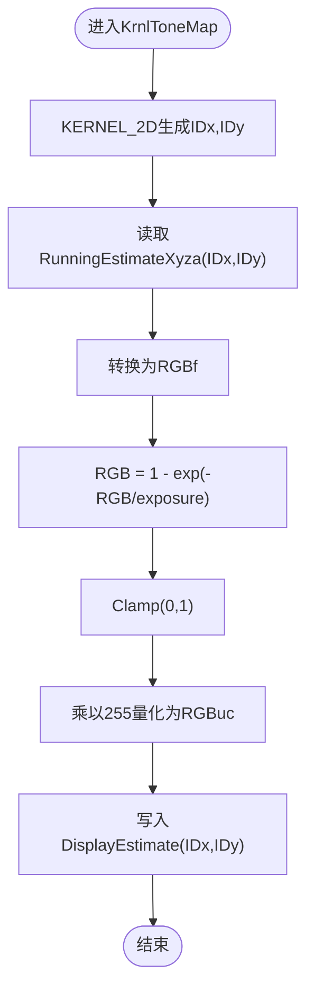
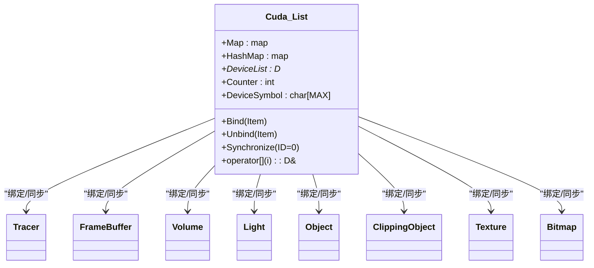
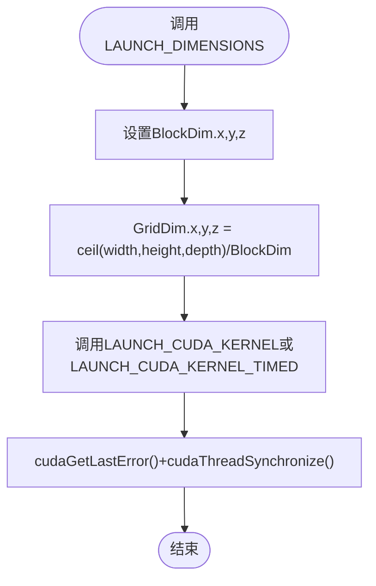
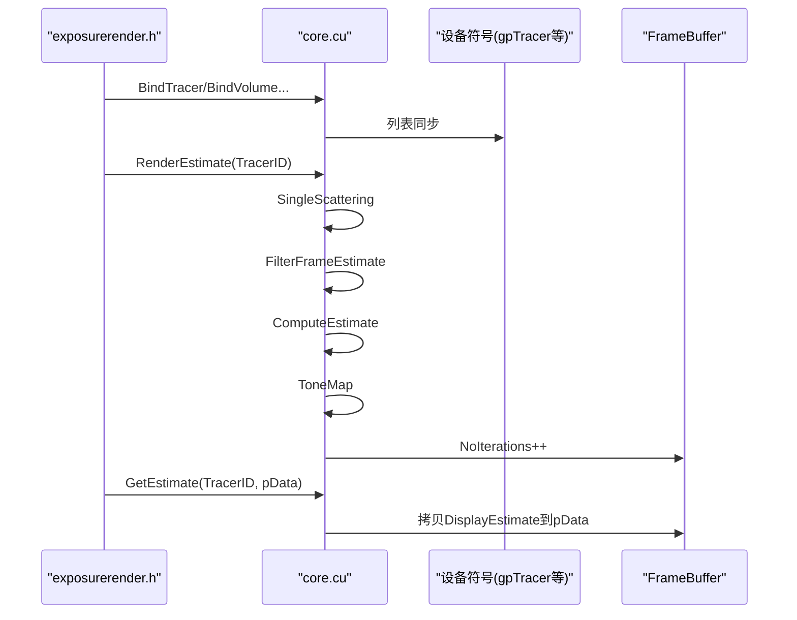
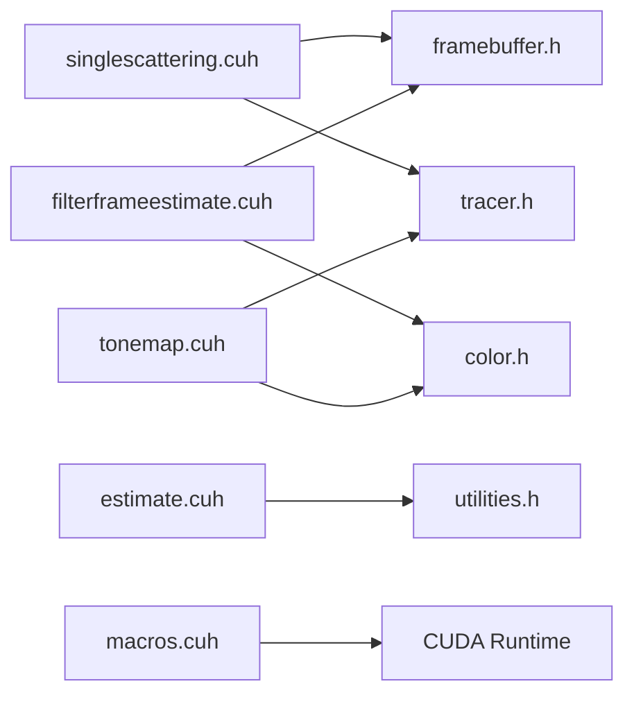

# CUDA内核实现

<cite>
**本文档引用的文件**
- [core.cu](file://Source/core.cu)
- [exposurerender.h](file://Source/exposurerender.h)
- [exposurerender.cpp](file://Source/exposurerender.cpp)
- [singlescattering.cuh](file://Source/singlescattering.cuh)
- [filterframeestimate.cuh](file://Source/filterframeestimate.cuh)
- [estimate.cuh](file://Source/estimate.cuh)
- [tonemap.cuh](file://Source/tonemap.cuh)
- [list.cuh](file://Source/list.cuh)
- [macros.cuh](file://Source/macros.cuh)
- [framebuffer.h](file://Source/framebuffer.h)
- [tracer.h](file://Source/tracer.h)
- [color.h](file://Source/color.h)
- [vector.h](file://Source/vector.h)
- [utilities.h](file://Source/utilities.h)
</cite>

## 目录
1. [简介](#简介)
2. [项目结构](#项目结构)
3. [核心组件](#核心组件)
4. [架构总览](#架构总览)
5. [详细组件分析](#详细组件分析)
6. [依赖分析](#依赖分析)
7. [性能考虑](#性能考虑)
8. [故障排除指南](#故障排除指南)
9. [结论](#结论)
10. [附录](#附录)

## 简介
本文件系统性梳理了基于CUDA的体积渲染流水线在该代码库中的实现与使用方式，重点覆盖以下方面：
- 内核实现细节：单散射、帧估计滤波、运行估计累积、色调映射等
- 调用关系与控制流：从绑定资源到渲染估计再到输出显示的完整流程
- 接口与领域模型：Tracer、FrameBuffer、颜色空间与向量类型等
- 使用模式与配置项：块/网格维度、高斯核参数、曝光与伽马等
- 与其他组件的关系：设备列表同步、缓冲区管理、主机-设备内存拷贝
- 常见问题与解决方案：边界检查、核函数启动、错误处理

## 项目结构
该项目采用“按功能模块划分”的组织方式，CUDA相关内核集中在独立的头文件中，配合核心控制逻辑与数据结构定义：
- 核心控制与绑定：core.cu、exposurerender.h/.cpp
- 渲染流水线内核：singlescattering.cuh、filterframeestimate.cuh、estimate.cuh、tonemap.cuh
- 设备资源管理：list.cuh（设备符号绑定）
- 宏与启动封装：macros.cuh
- 数据模型：framebuffer.h、tracer.h、color.h、vector.h、utilities.h

**图表来源**
- [core.cu:1-156](file://Source/core.cu#L1-L156)
- [exposurerender.h:1-45](file://Source/exposurerender.h#L1-L45)
- [singlescattering.cuh:1-41](file://Source/singlescattering.cuh#L1-L41)
- [filterframeestimate.cuh:1-77](file://Source/filterframeestimate.cuh#L1-L77)
- [estimate.cuh:1-40](file://Source/estimate.cuh#L1-L40)
- [tonemap.cuh:1-68](file://Source/tonemap.cuh#L1-L68)
- [macros.cuh:1-105](file://Source/macros.cuh#L1-L105)
- [framebuffer.h:1-108](file://Source/framebuffer.h#L1-L108)
- [tracer.h:1-58](file://Source/tracer.h#L1-L58)
- [color.h:1-287](file://Source/color.h#L1-L287)
- [vector.h:1-582](file://Source/vector.h#L1-L582)
- [utilities.h:1-70](file://Source/utilities.h#L1-L70)
- [list.cuh:1-178](file://Source/list.cuh#L1-L178)

**章节来源**
- [core.cu:1-156](file://Source/core.cu#L1-L156)
- [exposurerender.h:1-45](file://Source/exposurerender.h#L1-L45)
- [exposurerender.cpp:1-24](file://Source/exposurerender.cpp#L1-L24)

## 核心组件
- 设备列表绑定（Cuda::List）：将主机侧对象映射到设备符号，支持按ID绑定/解绑与增量同步，确保内核访问到最新数据。
- Tracer与FrameBuffer：Tracer继承自ErTracer并持有FrameBuffer；FrameBuffer管理多组2D缓冲（帧估计、运行估计、显示估计等），并负责尺寸变更与重置。
- 颜色与向量：统一的颜色空间（RGB/XYZ/RGBA）与向量类型（Vec2/Vec3/Vec4）及常用运算，支撑内核中的像素级计算。
- 宏与启动封装：LAUNCH_DIMENSIONS、LAUNCH_CUDA_KERNEL、LAUNCH_CUDA_KERNEL_TIMED等宏简化网格/块维度计算与核函数启动。

**章节来源**
- [list.cuh:27-178](file://Source/list.cuh#L27-L178)
- [tracer.h:31-55](file://Source/tracer.h#L31-L55)
- [framebuffer.h:26-105](file://Source/framebuffer.h#L26-L105)
- [color.h:59-287](file://Source/color.h#L59-L287)
- [vector.h:397-582](file://Source/vector.h#L397-L582)
- [macros.cuh:27-105](file://Source/macros.cuh#L27-L105)

## 架构总览
渲染流水线由四个阶段组成，每个阶段对应一个CUDA内核或一组内核操作，通过FrameBuffer在阶段间传递数据。

**图表来源**
- [core.cu:126-143](file://Source/core.cu#L126-L143)
- [singlescattering.cuh:27-38](file://Source/singlescattering.cuh#L27-L38)
- [filterframeestimate.cuh:66-74](file://Source/filterframeestimate.cuh#L66-L74)
- [estimate.cuh:27-38](file://Source/estimate.cuh#L27-L38)
- [tonemap.cuh:49-65](file://Source/tonemap.cuh#L49-L65)

## 详细组件分析

### 单散射内核（KrnlSingleScattering）
- 功能：对每个像素计算单次散射贡献，写入FrameBuffer.FrameEstimate。
- 并行策略：二维网格（宽度=图像宽度，高度=图像高度），块大小为16×8。
- 关键点：使用KERNEL_2D宏生成线程索引，调用SingleScattering函数进行逐像素计算。

**图表来源**
- [singlescattering.cuh:27-32](file://Source/singlescattering.cuh#L27-L32)
- [macros.cuh:83-91](file://Source/macros.cuh#L83-L91)

**章节来源**
- [singlescattering.cuh:27-38](file://Source/singlescattering.cuh#L27-L38)
- [macros.cuh:75-101](file://Source/macros.cuh#L75-L101)

### 帧估计滤波（KrnlFilterFrameEstimate）
- 功能：对FrameEstimate进行高斯加权邻域平均，结果写入FrameEstimateTemp并回写。
- 参数：核半径与Sigma（高斯函数的标准差）。
- 边界处理：计算有效范围并裁剪至图像边界。
- 归一化：权重累加后对颜色分量做归一化。

**图表来源**
- [filterframeestimate.cuh:33-64](file://Source/filterframeestimate.cuh#L33-L64)
- [filterframeestimate.cuh:28-31](file://Source/filterframeestimate.cuh#L28-L31)

**章节来源**
- [filterframeestimate.cuh:28-74](file://Source/filterframeestimate.cuh#L28-L74)

### 运行估计累积（KrnlComputeEstimate）
- 功能：使用累计移动平均更新运行估计，逐步收敛到真实辐射度。
- 并行策略：二维网格，块大小为16×8。
- 累加公式：A_{n+1} = A_n + (X_n - A_n)/max(N,1)，其中N为迭代次数。

**图表来源**
- [estimate.cuh:27-32](file://Source/estimate.cuh#L27-L32)
- [utilities.h:59-67](file://Source/utilities.h#L59-L67)

**章节来源**
- [estimate.cuh:27-38](file://Source/estimate.cuh#L27-L38)
- [utilities.h:59-67](file://Source/utilities.h#L59-L67)

### 色调映射（KrnlToneMap）
- 功能：将运行估计（XYZA）转换为显示估计（RGBA），应用曝光与简单量化。
- 曝光模型：对RGB分量应用1-exp(-I/exposure)，并夹紧到[0,1]。
- 伽马校正：注释掉的伽马校正路径表明当前实现未启用。
- 输出：将RGB分量乘以255并写入DisplayEstimate。

**图表来源**
- [tonemap.cuh:30-59](file://Source/tonemap.cuh#L30-L59)

**章节来源**
- [tonemap.cuh:30-65](file://Source/tonemap.cuh#L30-L65)

### 设备列表绑定与同步（Cuda::List）
- 作用：将主机侧对象集合映射到设备符号，支持按ID绑定/解绑与增量同步。
- 绑定流程：分配设备内存，复制主机数据，写入设备符号；Unbind时释放并更新映射。
- 同步策略：全量同步或针对特定ID的增量同步，保证内核访问到最新数据。

**图表来源**
- [list.cuh:27-178](file://Source/list.cuh#L27-L178)

**章节来源**
- [list.cuh:27-178](file://Source/list.cuh#L27-L178)

### 核函数启动宏与维度计算（macros.cuh）
- LAUNCH_DIMENSIONS：根据宽度、高度、深度与块维度计算GridDim。
- LAUNCH_CUDA_KERNEL/LAUNCH_CUDA_KERNEL_TIMED：封装核函数启动与错误检查，后者额外记录事件时间。
- KERNEL_1D/2D/3D：生成线程索引IDx/IDy/IDz与全局IDk，并进行越界检查。

**图表来源**
- [macros.cuh:27-73](file://Source/macros.cuh#L27-L73)

**章节来源**
- [macros.cuh:27-105](file://Source/macros.cuh#L27-L105)

### 对外接口与渲染流程（core.cu, exposurerender.h）
- 绑定接口：BindTracer/BindVolume/BindLight/BindObject/BindClippingObject/BindTexture/BindBitmap，支持开启/关闭绑定。
- 渲染接口：RenderEstimate执行单散射→滤波→估计累积→色调映射的完整流程，并递增迭代计数。
- 输出接口：GetEstimate将显示估计从设备拷贝到主机缓冲区；GetAutoFocusDistance/GetNoIterations预留扩展。

**图表来源**
- [exposurerender.h:32-43](file://Source/exposurerender.h#L32-L43)
- [core.cu:56-143](file://Source/core.cu#L56-L143)

**章节来源**
- [exposurerender.h:32-43](file://Source/exposurerender.h#L32-L43)
- [core.cu:56-156](file://Source/core.cu#L56-L156)

## 依赖分析
- 内核对数据结构的依赖：
  - FrameBuffer提供多组2D缓冲与随机种子，内核直接读写其成员。
  - Tracer持有FrameBuffer并携带相机曝光等参数，内核通过设备符号访问。
- 内核对工具函数的依赖：
  - utilities.h提供累计移动平均、向量/颜色转换等基础算子。
  - color.h提供颜色空间转换与Clamp等操作。
  - vector.h提供向量运算与索引类型。
- 启动宏对CUDA运行时的依赖：
  - macros.cuh依赖cudaEvent_t进行计时，依赖cudaGetLastError/cudaThreadSynchronize进行错误检查。

**图表来源**
- [singlescattering.cuh:21-22](file://Source/singlescattering.cuh#L21-L22)
- [filterframeestimate.cuh:21-23](file://Source/filterframeestimate.cuh#L21-L23)
- [estimate.cuh:21-22](file://Source/estimate.cuh#L21-L22)
- [tonemap.cuh:21-22](file://Source/tonemap.cuh#L21-L22)
- [macros.cuh:21](file://Source/macros.cuh#L21)

**章节来源**
- [framebuffer.h:26-105](file://Source/framebuffer.h#L26-L105)
- [tracer.h:31-55](file://Source/tracer.h#L31-L55)
- [color.h:59-287](file://Source/color.h#L59-L287)
- [utilities.h:25-70](file://Source/utilities.h#L25-L70)
- [macros.cuh:21-105](file://Source/macros.cuh#L21-L105)

## 性能考虑
- 线程粒度与占用率：
  - 单散射与运行估计使用16×8块，滤波使用8×8块，有助于提升SM占用率与吞吐。
- 访存模式：
  - 二维内核按行优先访问，建议确保缓存行对齐与连续访存以减少冲突。
- 归约与同步：
  - 高斯滤波存在局部归约（权重累加），建议避免过度的分支发散以保持Warp一致性。
- 时间测量：
  - 使用LAUNCH_CUDA_KERNEL_TIMED可定位热点内核，便于针对性优化。

[本节为通用性能指导，不直接分析具体文件]

## 故障排除指南
- 核函数未执行或结果异常：
  - 检查KERNEL_2D/KERNEL_3D的越界判断是否生效，确认GridDim与BlockDim计算正确。
  - 参考：[macros.cuh:83-101](file://Source/macros.cuh#L83-L101)
- 设备符号未更新：
  - 确认已调用Synchronize或针对特定ID的增量同步，确保gpTracer等设备符号指向最新数据。
  - 参考：[list.cuh:108-148](file://Source/list.cuh#L108-L148)
- 显示估计为空或全黑：
  - 检查SingleScattering输出是否为黑色，以及运行估计累积是否正常进行。
  - 参考：[singlescattering.cuh:27-38](file://Source/singlescattering.cuh#L27-L38)、[estimate.cuh:27-38](file://Source/estimate.cuh#L27-L38)
- 错误检查与调试：
  - 使用LAUNCH_CUDA_KERNEL的错误检查宏，确保cudaGetLastError与cudaThreadSynchronize被调用。
  - 参考：[macros.cuh:67-73](file://Source/macros.cuh#L67-L73)

**章节来源**
- [macros.cuh:67-101](file://Source/macros.cuh#L67-L101)
- [list.cuh:108-148](file://Source/list.cuh#L108-L148)
- [singlescattering.cuh:27-38](file://Source/singlescattering.cuh#L27-L38)
- [estimate.cuh:27-38](file://Source/estimate.cuh#L27-L38)

## 结论
该CUDA内核实现遵循清晰的流水线设计：单散射生成初始估计，高斯滤波平滑噪声，累计移动平均逐步收敛，最后通过色调映射得到最终显示。通过Cuda::List实现主机-设备资源的动态绑定与同步，结合宏封装的启动与计时机制，整体具备良好的可维护性与可观测性。建议在后续迭代中完善自动对焦与迭代次数查询接口，并进一步优化滤波与颜色转换路径以提升性能。

[本节为总结性内容，不直接分析具体文件]

## 附录

### 接口与参数速查
- 绑定接口（布尔参数决定绑定/解绑）
  - BindTracer/BindVolume/BindLight/BindObject/BindClippingObject/BindTexture/BindBitmap
  - 参考：[exposurerender.h:32-39](file://Source/exposurerender.h#L32-L39)
- 渲染与输出
  - RenderEstimate(TracerID)：执行单散射→滤波→估计累积→色调映射
  - GetEstimate(TracerID, pData)：将DisplayEstimate拷贝到主机缓冲区
  - 参考：[core.cu:126-143](file://Source/core.cu#L126-L143)
- 配置与参数
  - 单散射/运行估计：块大小16×8，滤波：块大小8×8
  - 高斯滤波：核半径1，Sigma=1.0
  - 曝光：来自Tracer.Camera.Exposure
  - 参考：[singlescattering.cuh:36-37](file://Source/singlescattering.cuh#L36-L37)、[filterframeestimate.cuh:68-69](file://Source/filterframeestimate.cuh#L68-L69)、[tonemap.cuh:34-36](file://Source/tonemap.cuh#L34-L36)

**章节来源**
- [exposurerender.h:32-43](file://Source/exposurerender.h#L32-L43)
- [core.cu:126-143](file://Source/core.cu#L126-L143)
- [singlescattering.cuh:36-37](file://Source/singlescattering.cuh#L36-L37)
- [filterframeestimate.cuh:68-69](file://Source/filterframeestimate.cuh#L68-L69)
- [tonemap.cuh:34-36](file://Source/tonemap.cuh#L34-L36)