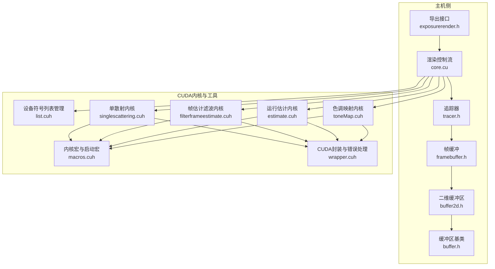
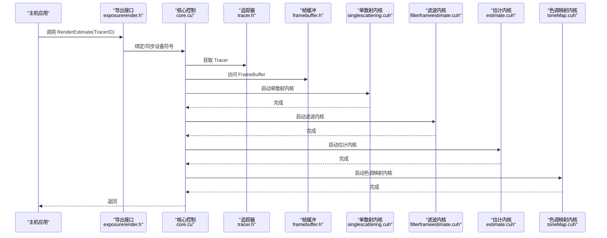
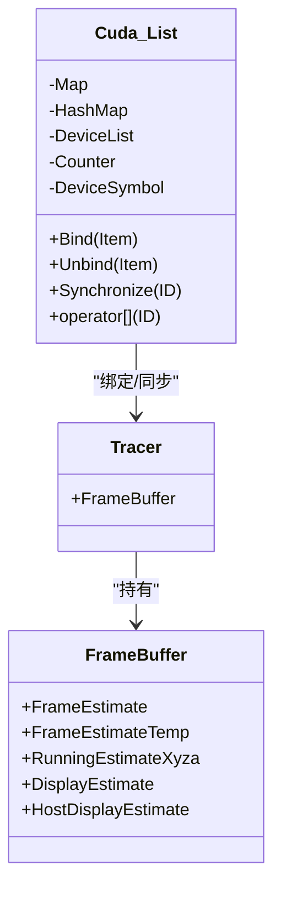
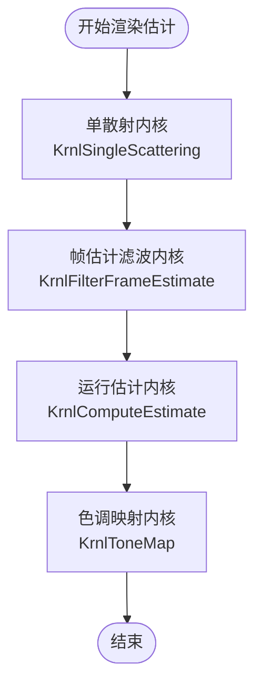
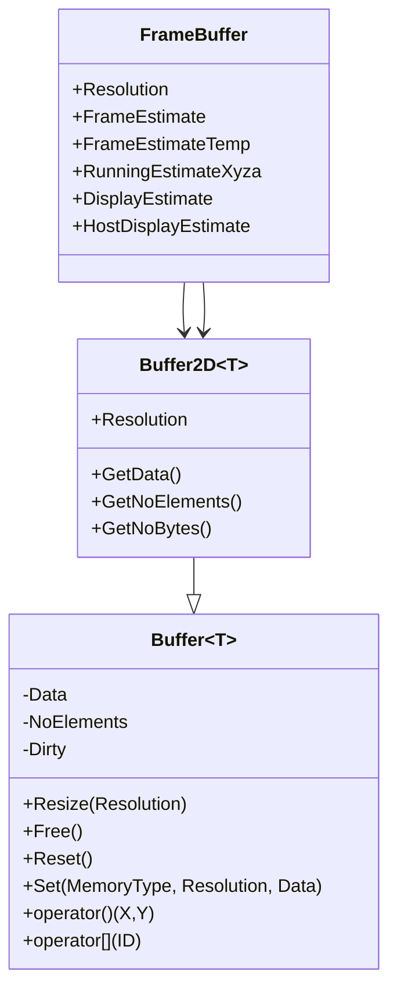
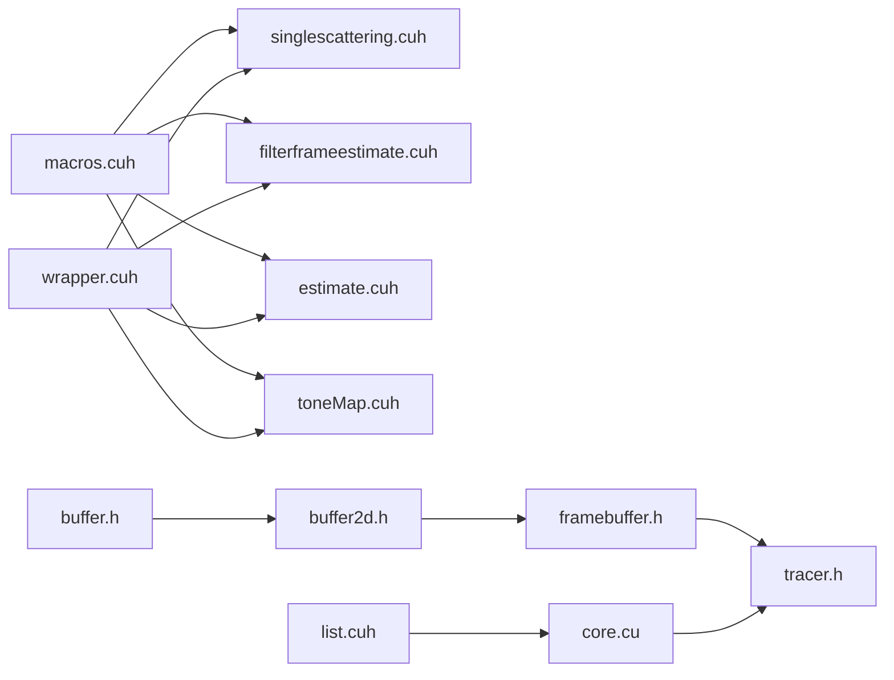

# CUDA编程模型

<cite>
**本文引用的文件**
- [core.cu](file://Source/core.cu)
- [macros.cuh](file://Source/macros.cuh)
- [defines.h](file://Source/defines.h)
- [wrapper.cuh](file://Source/wrapper.cuh)
- [list.cuh](file://Source/list.cuh)
- [singlescattering.cuh](file://Source/singlescattering.cuh)
- [filterframeestimate.cuh](file://Source/filterframeestimate.cuh)
- [estimate.cuh](file://Source/estimate.cuh)
- [toneMap.cuh](file://Source/toneMap.cuh)
- [framebuffer.h](file://Source/framebuffer.h)
- [tracer.h](file://Source/tracer.h)
- [buffer2d.h](file://Source/buffer2d.h)
- [buffer.h](file://Source/buffer.h)
- [enums.h](file://Source/enums.h)
- [exposurerender.h](file://Source/exposurerender.h)
</cite>

## 目录
1. [引言](#引言)
2. [项目结构](#项目结构)
3. [核心组件](#核心组件)
4. [架构总览](#架构总览)
5. [详细组件分析](#详细组件分析)
6. [依赖关系分析](#依赖关系分析)
7. [性能考虑](#性能考虑)
8. [故障排查指南](#故障排查指南)
9. [结论](#结论)
10. [附录](#附录)

## 引言
本文件系统性阐述该代码库中的CUDA编程模型与实现方式，覆盖以下主题：
- CUDA基本概念：主机端与设备端、线程层次（线程块、网格）、内存模型（全局、常量、纹理等）与执行模型（内核启动、同步）。
- 内核函数定义与调用：网格/块维度设置、线程索引宏、内核封装与计时宏。
- 宏定义使用：KERNEL、LAUNCH_DIMENSIONS、LAUNCH_CUDA_KERNEL、LAUNCH_CUDA_KERNEL_TIMED、KERNEL_1D/KERNEL_2D/KERNEL_3D 等。
- 主机-设备交互：内存分配、拷贝、符号绑定、错误处理与同步。
- 实际流程示例：单散射、帧估计滤波、运行估计累积、色调映射的内核调用序列。
- 性能优化原则与最佳实践。

## 项目结构
该项目采用“分层+功能模块”组织方式：
- 核心渲染管线在主机侧通过一组导出函数驱动，内部以CUDA内核完成并行计算。
- 内存管理抽象为Buffer与Buffer2D模板类，支持主机/设备双内存类型。
- CUDA宏与工具集中在独立头文件中，便于跨文件复用。
- 渲染状态与帧缓冲由Tracer与FrameBuffer承载。

图表来源
- [exposurerender.h:32-42](file://Source/exposurerender.h#L32-L42)
- [core.cu:56-136](file://Source/core.cu#L56-L136)
- [tracer.h:31-55](file://Source/tracer.h#L31-L55)
- [framebuffer.h:26-105](file://Source/framebuffer.h#L26-L105)
- [buffer2d.h:26-289](file://Source/buffer2d.h#L26-L289)
- [buffer.h:27-124](file://Source/buffer.h#L27-L124)
- [macros.cuh:27-102](file://Source/macros.cuh#L27-L102)
- [wrapper.cuh:35-147](file://Source/wrapper.cuh#L35-L147)
- [list.cuh:27-178](file://Source/list.cuh#L27-L178)
- [singlescattering.cuh:27-38](file://Source/singlescattering.cuh#L27-L38)
- [filterframeestimate.cuh:33-74](file://Source/filterframeestimate.cuh#L33-L74)
- [estimate.cuh:27-38](file://Source/estimate.cuh#L27-L38)
- [toneMap.cuh:49-65](file://Source/toneMap.cuh#L49-L65)

章节来源
- [exposurerender.h:32-42](file://Source/exposurerender.h#L32-L42)
- [core.cu:56-136](file://Source/core.cu#L56-L136)
- [tracer.h:31-55](file://Source/tracer.h#L31-L55)
- [framebuffer.h:26-105](file://Source/framebuffer.h#L26-L105)
- [buffer2d.h:26-289](file://Source/buffer2d.h#L26-L289)
- [buffer.h:27-124](file://Source/buffer.h#L27-L124)

## 核心组件
- 宏与工具
  - 内核与启动宏：KERNEL、LAUNCH_DIMENSIONS、LAUNCH_CUDA_KERNEL、LAUNCH_CUDA_KERNEL_TIMED。
  - 线程索引宏：KERNEL_1D、KERNEL_2D、KERNEL_3D。
- 设备符号列表：Cuda::List模板类负责主机侧资源到设备符号的同步与绑定。
- 帧缓冲：FrameBuffer集中管理渲染过程中的多张2D缓冲（估计、临时、显示等）。
- 渲染管线：由core.cu中的导出函数协调，依次调用单散射、滤波、估计累积、色调映射四个阶段的内核。

章节来源
- [macros.cuh:27-102](file://Source/macros.cuh#L27-L102)
- [list.cuh:27-178](file://Source/list.cuh#L27-L178)
- [framebuffer.h:26-105](file://Source/framebuffer.h#L26-L105)
- [core.cu:56-136](file://Source/core.cu#L56-L136)

## 架构总览
下图展示了从主机到设备的渲染控制流与数据路径：

图表来源
- [exposurerender.h:32-42](file://Source/exposurerender.h#L32-L42)
- [core.cu:126-136](file://Source/core.cu#L126-L136)
- [singlescattering.cuh:34-38](file://Source/singlescattering.cuh#L34-L38)
- [filterframeestimate.cuh:66-74](file://Source/filterframeestimate.cuh#L66-L74)
- [estimate.cuh:34-38](file://Source/estimate.cuh#L34-L38)
- [toneMap.cuh:61-65](file://Source/toneMap.cuh#L61-L65)

## 详细组件分析

### 宏与执行模型
- 内核与启动宏
  - KERNEL：在CUDA编译环境下映射为__global__，否则为空。
  - LAUNCH_DIMENSIONS：根据宽度、高度、深度与块维度计算网格维度。
  - LAUNCH_CUDA_KERNEL/LAUNCH_CUDA_KERNEL_TIMED：封装内核调用与错误检查、可选计时。
- 线程索引宏
  - KERNEL_1D/KERNEL_2D/KERNEL_3D：生成线程索引IDx/IDy/IDz与线程块内线程序号IDt、线性索引IDk，并进行越界返回保护。
- 使用建议
  - 在2D图像处理中优先使用KERNEL_2D，结合LAUNCH_DIMENSIONS与LAUNCH_CUDA_KERNEL_TIMED进行统一启动与计时。
  - 对于需要精确计时的内核，使用LAUNCH_CUDA_KERNEL_TIMED；对调试或简单场景可用LAUNCH_CUDA_KERNEL。

章节来源
- [defines.h:40-56](file://Source/defines.h#L40-L56)
- [macros.cuh:27-102](file://Source/macros.cuh#L27-L102)

### 设备符号列表与主机-设备同步
- Cuda::List模板类
  - 支持主机侧资源集合到设备符号的绑定、解绑与同步。
  - Synchronize在主机侧构建设备数组，再通过MemCopyHostToDeviceSymbol写入设备符号指针。
- 关键点
  - 设备符号名称通过构造函数传入，用于后续cudaMemcpyToSymbol。
  - 支持按ID同步单个对象或全量同步。

图表来源
- [list.cuh:27-178](file://Source/list.cuh#L27-L178)
- [tracer.h:31-55](file://Source/tracer.h#L31-L55)
- [framebuffer.h:26-105](file://Source/framebuffer.h#L26-L105)

章节来源
- [list.cuh:27-178](file://Source/list.cuh#L27-L178)

### 内核函数与调用机制
- 单散射内核
  - 使用KERNEL_2D遍历像素，调用单散射函数写入FrameEstimate。
  - 通过LAUNCH_DIMENSIONS与LAUNCH_CUDA_KERNEL_TIMED启动。
- 帧估计滤波内核
  - 使用高斯核在局部范围内加权求和，输出到FrameEstimateTemp，再回写。
- 运行估计内核
  - 使用累积移动平均更新RunningEstimateXyza。
- 色调映射内核
  - 将RunningEstimateXyza转换为DisplayEstimate的RGB通道。

图表来源
- [singlescattering.cuh:27-38](file://Source/singlescattering.cuh#L27-L38)
- [filterframeestimate.cuh:33-74](file://Source/filterframeestimate.cuh#L33-L74)
- [estimate.cuh:27-38](file://Source/estimate.cuh#L27-L38)
- [toneMap.cuh:49-65](file://Source/toneMap.cuh#L49-L65)

章节来源
- [singlescattering.cuh:27-38](file://Source/singlescattering.cuh#L27-L38)
- [filterframeestimate.cuh:33-74](file://Source/filterframeestimate.cuh#L33-L74)
- [estimate.cuh:27-38](file://Source/estimate.cuh#L27-L38)
- [toneMap.cuh:49-65](file://Source/toneMap.cuh#L49-L65)

### 内存模型与缓冲区抽象
- Buffer与Buffer2D
  - 提供统一的内存分配、释放、重置、尺寸调整与读写操作。
  - 支持主机与设备两种内存类型，设备侧通过Cuda命名空间的封装函数进行分配与拷贝。
- 帧缓冲FrameBuffer
  - 包含多张2D缓冲（估计、临时、运行估计、显示等），并维护分辨率与随机种子缓冲。
- 内存拷贝策略
  - HostToDevice/DeviceToHost/DeviceToDevice三类拷贝封装。
  - 常量内存拷贝通过cudaMemcpyToSymbol完成，用于向设备符号写入参数。

图表来源
- [buffer.h:27-124](file://Source/buffer.h#L27-L124)
- [buffer2d.h:26-289](file://Source/buffer2d.h#L26-L289)
- [framebuffer.h:26-105](file://Source/framebuffer.h#L26-L105)

章节来源
- [buffer.h:27-124](file://Source/buffer.h#L27-L124)
- [buffer2d.h:26-289](file://Source/buffer2d.h#L26-L289)
- [framebuffer.h:26-105](file://Source/framebuffer.h#L26-L105)

### 主机-设备交互与同步
- 错误处理与同步
  - wrapper.cuh提供HandleCudaError、ThreadSynchronize、Allocate/MemCopy/Free等封装，统一错误抛出与同步。
- 符号绑定
  - list.cuh通过MemCopyHostToDeviceSymbol将设备指针写入设备符号，使内核可通过全局符号访问主机侧聚合数据。
- 数据传输
  - 从设备到主机：core.cu中通过Cuda::MemCopyDeviceToHost将显示估计拷贝至CPU缓冲，供上层使用。

章节来源
- [wrapper.cuh:38-147](file://Source/wrapper.cuh#L38-L147)
- [list.cuh:108-148](file://Source/list.cuh#L108-L148)
- [core.cu:138-143](file://Source/core.cu#L138-L143)

## 依赖关系分析
- 宏与工具层
  - macros.cuh被各内核文件直接包含，提供统一的线程索引与启动宏。
  - wrapper.cuh在__CUDA_ARCH__条件下包含CUDA运行时API，提供内存与符号操作封装。
- 渲染控制层
  - core.cu导出接口，协调Tracer与FrameBuffer，调用各内核阶段。
- 数据结构层
  - buffer.h/buffer2d.h为所有2D缓冲提供统一抽象；framebuffer.h组合多个缓冲；tracer.h将二者整合。
- 设备符号层
  - list.cuh负责将主机侧资源映射到设备符号，供内核访问。

图表来源
- [macros.cuh:27-102](file://Source/macros.cuh#L27-L102)
- [wrapper.cuh:35-147](file://Source/wrapper.cuh#L35-L147)
- [list.cuh:27-178](file://Source/list.cuh#L27-L178)
- [core.cu:56-136](file://Source/core.cu#L56-L136)
- [buffer.h:27-124](file://Source/buffer.h#L27-L124)
- [buffer2d.h:26-289](file://Source/buffer2d.h#L26-L289)
- [framebuffer.h:26-105](file://Source/framebuffer.h#L26-L105)
- [tracer.h:31-55](file://Source/tracer.h#L31-L55)

章节来源
- [macros.cuh:27-102](file://Source/macros.cuh#L27-L102)
- [wrapper.cuh:35-147](file://Source/wrapper.cuh#L35-L147)
- [list.cuh:27-178](file://Source/list.cuh#L27-L178)
- [core.cu:56-136](file://Source/core.cu#L56-L136)
- [buffer.h:27-124](file://Source/buffer.h#L27-L124)
- [buffer2d.h:26-289](file://Source/buffer2d.h#L26-L289)
- [framebuffer.h:26-105](file://Source/framebuffer.h#L26-L105)
- [tracer.h:31-55](file://Source/tracer.h#L31-L55)

## 性能考虑
- 线程块维度选择
  - 项目中常见块维度为(16,8,1)或(8,8,1)，应结合SM寄存器/共享内存限制与占用率进行微调。
- 网格维度计算
  - 使用LAUNCH_DIMENSIONS自动按块大小向上取整，避免线程越界与空闲。
- 内存访问模式
  - KERNEL_2D按行主序访问，尽量保证连续访问与对齐，减少分支发散。
- 同步与计时
  - 使用LAUNCH_CUDA_KERNEL_TIMED进行粗粒度内核耗时统计；必要时在关键点插入同步以避免异步竞争。
- 缓冲区管理
  - 避免频繁Resize与拷贝；批量更新时优先使用DeviceToDevice拷贝。
- 常量内存与符号
  - 将只读参数写入常量内存或设备符号，减少全局内存往返。

## 故障排查指南
- 常见错误定位
  - 使用HandleCudaError捕获cudaGetLastError与cudaEventSynchronize后的错误，结合标题字符串快速定位问题。
- 同步问题
  - 若出现未定义行为或数据不一致，检查是否遗漏cudaThreadSynchronize或cudaEventSynchronize。
- 内存问题
  - 检查cudaMalloc/cudaMemcpyToSymbol返回值；确认Free在释放前已同步。
- 越界访问
  - 确保KERNEL_1D/KERNEL_2D/KERNEL_3D的越界保护生效，且网格维度计算正确。

章节来源
- [wrapper.cuh:38-147](file://Source/wrapper.cuh#L38-L147)
- [macros.cuh:41-73](file://Source/macros.cuh#L41-L73)

## 结论
该代码库以清晰的宏与工具层、抽象的缓冲区层以及模块化的内核实现，构建了完整的CUDA渲染管线。通过统一的内核启动宏、线程索引宏与设备符号管理，实现了从主机到设备的数据与控制流协同。遵循本文的性能与排错建议，可在保证正确性的前提下进一步提升吞吐与稳定性。

## 附录
- 关键API与流程路径
  - 导出接口声明：[exposurerender.h:32-42](file://Source/exposurerender.h#L32-L42)
  - 渲染估计流程入口：[core.cu:126-136](file://Source/core.cu#L126-L136)
  - 单散射内核与启动：[singlescattering.cuh:27-38](file://Source/singlescattering.cuh#L27-L38)
  - 帧估计滤波内核与启动：[filterframeestimate.cuh:33-74](file://Source/filterframeestimate.cuh#L33-L74)
  - 运行估计内核与启动：[estimate.cuh:27-38](file://Source/estimate.cuh#L27-L38)
  - 色调映射内核与启动：[toneMap.cuh:49-65](file://Source/toneMap.cuh#L49-L65)
  - 设备符号列表与同步：[list.cuh:108-148](file://Source/list.cuh#L108-L148)
  - 宏定义与内核启动宏：[macros.cuh:27-102](file://Source/macros.cuh#L27-L102)
  - CUDA封装与错误处理：[wrapper.cuh:38-147](file://Source/wrapper.cuh#L38-L147)
  - 帧缓冲与缓冲区抽象：[framebuffer.h:26-105](file://Source/framebuffer.h#L26-L105), [buffer2d.h:26-289](file://Source/buffer2d.h#L26-L289), [buffer.h:27-124](file://Source/buffer.h#L27-L124)
  - 内存类型枚举：[enums.h:26-30](file://Source/enums.h#L26-L30)