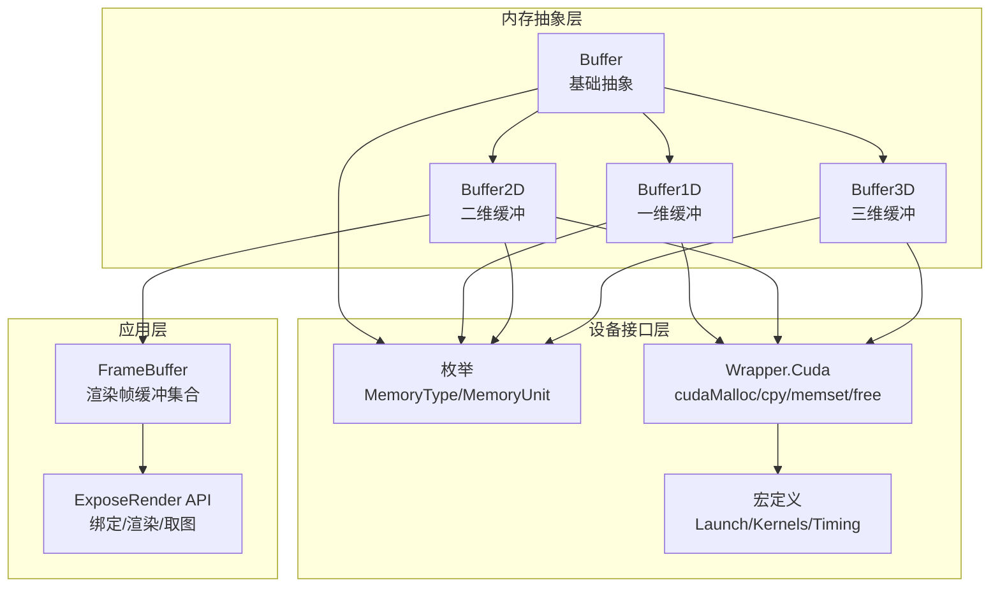
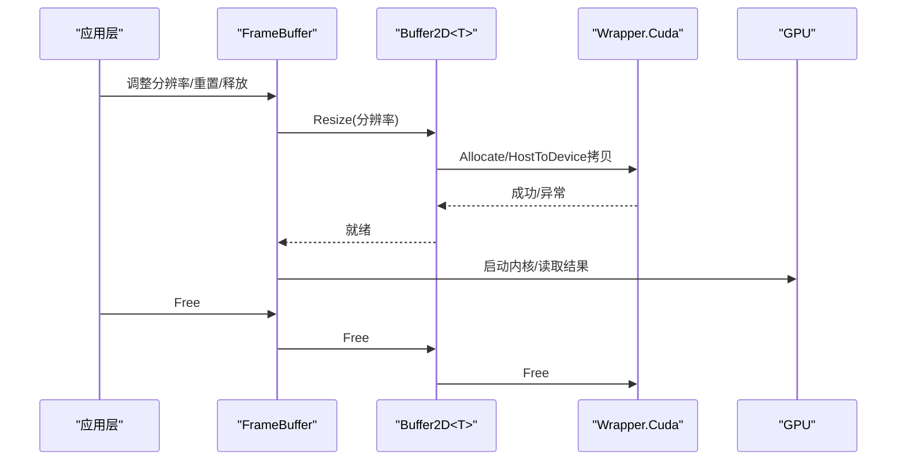
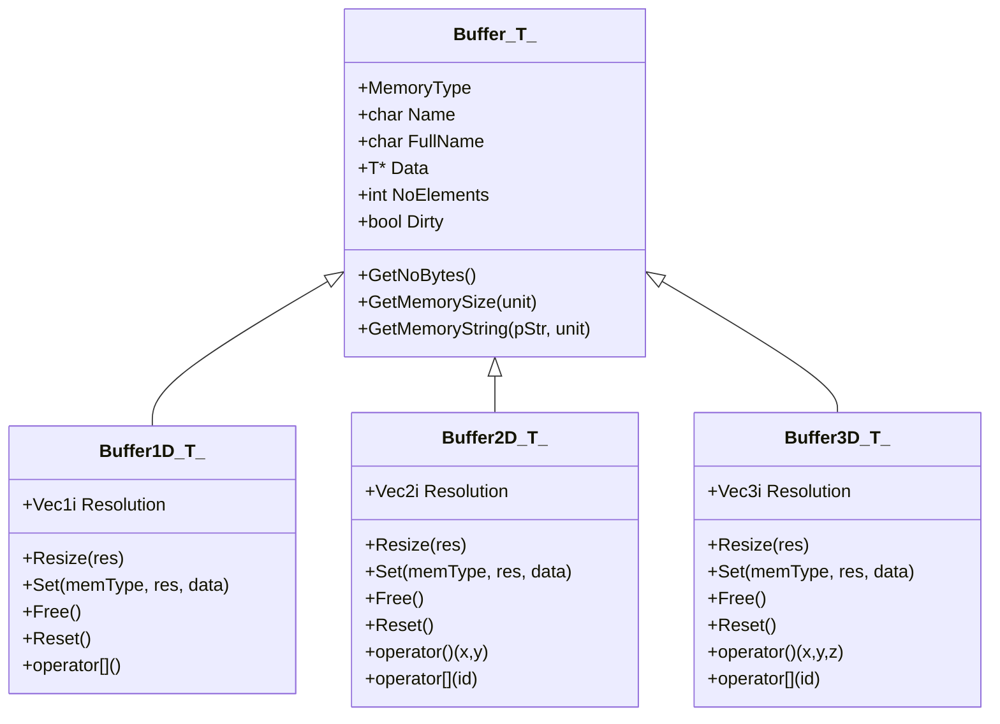
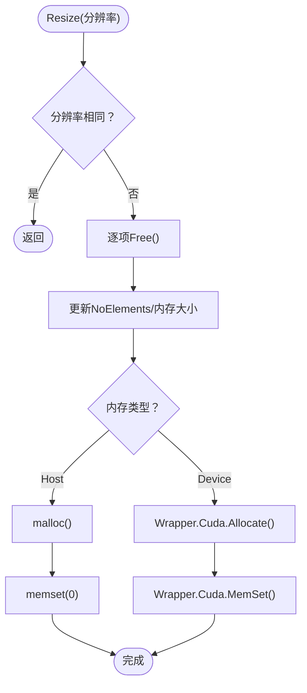
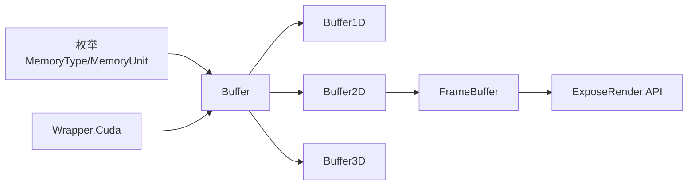

# 内存管理策略

<cite>
**本文引用的文件**
- [framebuffer.h](file://Source/framebuffer.h)
- [buffer.h](file://Source/buffer.h)
- [buffer1d.h](file://Source/buffer1d.h)
- [buffer2d.h](file://Source/buffer2d.h)
- [buffer3d.h](file://Source/buffer3d.h)
- [device.h](file://Source/device.h)
- [enums.h](file://Source/enums.h)
- [wrapper.cuh](file://Source/wrapper.cuh)
- [macros.cuh](file://Source/macros.cuh)
- [exposurerender.h](file://Source/exposurerender.h)
</cite>

## 目录
1. [引言](#引言)
2. [项目结构](#项目结构)
3. [核心组件](#核心组件)
4. [架构总览](#架构总览)
5. [详细组件分析](#详细组件分析)
6. [依赖关系分析](#依赖关系分析)
7. [性能考量](#性能考量)
8. [故障排查指南](#故障排查指南)
9. [结论](#结论)
10. [附录](#附录)

## 引言
本文件系统性梳理本项目在CUDA环境下的内存管理策略，覆盖以下主题：
- CUDA内存类型与用途：全局内存、共享内存、常量内存、纹理内存（cudaArray）等
- 帧缓冲区的内存布局与访问模式
- 分配、释放与拷贝的最佳实践
- 纹理内存的使用方法与优势
- 内存带宽优化技巧与缓存策略
- 内存泄漏检测与调试方法
- 实际内存管理代码示例路径与性能测试流程

## 项目结构
本项目采用模板化缓冲区抽象，按维度拆分（1D/2D/3D），统一管理主机与设备内存，并通过封装的CUDA调用接口进行分配、拷贝与释放。

图表来源
- [buffer.h:27-121](file://Source/buffer.h#L27-L121)
- [buffer1d.h:26-196](file://Source/buffer1d.h#L26-L196)
- [buffer2d.h:26-289](file://Source/buffer2d.h#L26-L289)
- [buffer3d.h:26-254](file://Source/buffer3d.h#L26-L254)
- [enums.h:26-37](file://Source/enums.h#L26-L37)
- [wrapper.cuh:35-147](file://Source/wrapper.cuh#L35-L147)
- [macros.cuh:24-105](file://Source/macros.cuh#L24-L105)
- [framebuffer.h:26-108](file://Source/framebuffer.h#L26-L108)
- [exposurerender.h:21-44](file://Source/exposurerender.h#L21-L44)

章节来源
- [buffer.h:27-121](file://Source/buffer.h#L27-L121)
- [buffer1d.h:26-196](file://Source/buffer1d.h#L26-L196)
- [buffer2d.h:26-289](file://Source/buffer2d.h#L26-L289)
- [buffer3d.h:26-254](file://Source/buffer3d.h#L26-L254)
- [enums.h:26-37](file://Source/enums.h#L26-L37)
- [wrapper.cuh:35-147](file://Source/wrapper.cuh#L35-L147)
- [macros.cuh:24-105](file://Source/macros.cuh#L24-L105)
- [framebuffer.h:26-108](file://Source/framebuffer.h#L26-L108)
- [exposurerender.h:21-44](file://Source/exposurerender.h#L21-L44)

## 核心组件
- 基础缓冲抽象：统一管理内存类型（主机/设备）、元素数量、数据指针与脏标记，提供尺寸查询与内存字符串输出。
- 一维/二维/三维缓冲：分别按一维、行列式线性索引与多维索引访问，支持重置、销毁、设置与拷贝。
- 设备对象基类：提供主机生命周期管理的基类。
- 枚举：内存类型与单位、纹理类型等。
- CUDA包装器：封装cudaMalloc/cudaMemcpy/cudaMemset/cudaFree及错误处理。
- 宏：内核启动、网格/块维度计算、计时事件。
- 帧缓冲：集中管理渲染过程中的估计帧、显示帧、临时帧与随机种子等缓冲。

章节来源
- [buffer.h:27-121](file://Source/buffer.h#L27-L121)
- [buffer1d.h:26-196](file://Source/buffer1d.h#L26-L196)
- [buffer2d.h:26-289](file://Source/buffer2d.h#L26-L289)
- [buffer3d.h:26-254](file://Source/buffer3d.h#L26-L254)
- [device.h:28-45](file://Source/device.h#L28-L45)
- [enums.h:26-37](file://Source/enums.h#L26-L37)
- [wrapper.cuh:35-147](file://Source/wrapper.cuh#L35-L147)
- [macros.cuh:24-105](file://Source/macros.cuh#L24-L105)
- [framebuffer.h:26-108](file://Source/framebuffer.h#L26-L108)

## 架构总览
下图展示了从应用到设备的内存管理路径，以及帧缓冲集合如何协调各缓冲的生命周期。

图表来源
- [framebuffer.h:45-91](file://Source/framebuffer.h#L45-L91)
- [buffer2d.h:125-198](file://Source/buffer2d.h#L125-L198)
- [wrapper.cuh:53-135](file://Source/wrapper.cuh#L53-L135)

章节来源
- [framebuffer.h:45-91](file://Source/framebuffer.h#L45-L91)
- [buffer2d.h:125-198](file://Source/buffer2d.h#L125-L198)
- [wrapper.cuh:53-135](file://Source/wrapper.cuh#L53-L135)

## 详细组件分析

### 基础缓冲与内存类型
- 统一抽象：Buffer<T>保存内存类型、元素数、数据指针与名称，提供内存大小查询与字符串格式化。
- 内存类型：Host/Device由枚举控制；设备侧通过Wrapper.Cuda进行分配/释放/拷贝/清零。
- 错误处理：所有CUDA调用均包裹错误检查与同步，避免静默失败。

图表来源
- [buffer.h:27-121](file://Source/buffer.h#L27-L121)
- [buffer1d.h:26-196](file://Source/buffer1d.h#L26-L196)
- [buffer2d.h:26-289](file://Source/buffer2d.h#L26-L289)
- [buffer3d.h:26-254](file://Source/buffer3d.h#L26-L254)

章节来源
- [buffer.h:27-121](file://Source/buffer.h#L27-L121)
- [buffer1d.h:26-196](file://Source/buffer1d.h#L26-L196)
- [buffer2d.h:26-289](file://Source/buffer2d.h#L26-L289)
- [buffer3d.h:26-254](file://Source/buffer3d.h#L26-L254)

### 帧缓冲区布局与访问模式
- 帧缓冲集合包含多类缓冲：帧估计（XYZA）、运行估计（XYZA）、显示估计（RGBA）、临时缓冲、过滤后显示估计、随机种子及其缓存、主机侧显示缓冲。
- 访问模式：
  - 2D缓冲通过行列索引与线性索引两种方式访问，支持双线性插值采样。
  - 随机种子缓冲派生自2D缓冲，构造时在主机侧生成并设置到设备。
  - 通过Resize统一调整尺寸，Reset清零，Free释放，Reset可恢复初始状态。

图表来源
- [buffer2d.h:125-164](file://Source/buffer2d.h#L125-L164)
- [buffer1d.h:117-141](file://Source/buffer1d.h#L117-L141)
- [buffer3d.h:125-164](file://Source/buffer3d.h#L125-L164)

章节来源
- [framebuffer.h:26-108](file://Source/framebuffer.h#L26-L108)
- [buffer2d.h:125-198](file://Source/buffer2d.h#L125-L198)
- [buffer1d.h:117-175](file://Source/buffer1d.h#L117-L175)
- [buffer3d.h:125-198](file://Source/buffer3d.h#L125-L198)

### CUDA内存类型与用途
- 全局内存：用于大规模数据存储，如帧缓冲、体积数据、纹理数据等。通过Wrapper.Cuda.Allocate与Wrapper.Cuda.Free管理。
- 共享内存：在核函数中使用共享内存以提升局部访问性能（需在核函数中显式声明与管理）。
- 常量内存：适合只读且广播访问的数据，如参数表。通过Wrapper.Cuda.HostToConstantDevice或符号拷贝接口写入。
- 纹理内存（cudaArray）：适合高带宽采样场景，支持硬件过滤与边界处理。项目中通过cudaArray接口进行释放与地址获取。

章节来源
- [wrapper.cuh:35-147](file://Source/wrapper.cuh#L35-L147)
- [enums.h:26-37](file://Source/enums.h#L26-L37)

### 分配、释放与拷贝最佳实践
- 统一入口：所有设备内存分配通过Wrapper.Cuda.Allocate，释放通过Wrapper.Cuda.Free，拷贝通过Wrapper.Cuda.MemCopy系列宏。
- 同步与错误：每次调用前/后执行同步与错误检查，确保问题早发现。
- 拷贝方向：主机到设备、设备到主机、设备到设备三类，根据源/目的选择合适接口。
- 清零：对设备侧清零使用Wrapper.Cuda.MemSet，避免未初始化数据导致的不确定行为。
- 生命周期：先Free再Resize，避免悬挂指针；重置时保持一致性。

章节来源
- [buffer2d.h:166-198](file://Source/buffer2d.h#L166-L198)
- [buffer1d.h:143-175](file://Source/buffer1d.h#L143-L175)
- [buffer3d.h:166-198](file://Source/buffer3d.h#L166-L198)
- [wrapper.cuh:53-135](file://Source/wrapper.cuh#L53-L135)

### 纹理内存的使用方法与优势
- 使用场景：高带宽采样、频繁的二维/三维空间查询、需要硬件过滤与边界处理。
- 接口要点：通过cudaArray接口进行分配与释放；使用符号拷贝接口将主机数据写入常量内存或符号区域。
- 优势：硬件级缓存、可配置过滤、边界模式（重复/镜像/零填充等）由硬件自动处理，减少核函数开销。

章节来源
- [wrapper.cuh:116-141](file://Source/wrapper.cuh#L116-L141)
- [wrapper.cuh:74-93](file://Source/wrapper.cuh#L74-L93)

### 内存带宽优化技巧与缓存策略
- 访存对齐与连续性：优先使用连续内存布局，避免跨行/跨页跳转；2D缓冲采用行主序线性索引，便于缓存命中。
- 纹理/常量内存：对只读广播数据放入常量内存；对采样密集数据考虑纹理内存。
- 共享内存：在核函数中将热点数据搬移到共享内存，减少全局内存往返。
- 批处理与合并访问：尽量将相邻线程访问相邻数据，提高吞吐。
- 减少主机-设备往返：批量传输、流水化处理，避免频繁同步。

章节来源
- [buffer2d.h:210-254](file://Source/buffer2d.h#L210-L254)
- [wrapper.cuh:53-135](file://Source/wrapper.cuh#L53-L135)

### 内存泄漏检测与调试方法
- 脏标记：缓冲内部维护Dirty标志，用于指示数据是否已更新，辅助判断拷贝与释放时机。
- 日志与调试：缓冲构造/析构/Resize/Free均输出调试日志，便于定位泄漏与越界。
- 错误检查：所有CUDA调用均包裹错误检查与同步，异常抛出前附带错误信息。
- 建议：在开发阶段启用严格日志，使用工具（如Nsight Systems/Compute）进行内存与带宽分析。

章节来源
- [buffer.h:31-81](file://Source/buffer.h#L31-L81)
- [buffer2d.h:67-96](file://Source/buffer2d.h#L67-L96)
- [buffer1d.h:67-88](file://Source/buffer1d.h#L67-L88)
- [buffer3d.h:67-96](file://Source/buffer3d.h#L67-L96)
- [wrapper.cuh:38-46](file://Source/wrapper.cuh#L38-L46)

### 实际内存管理代码示例与性能测试
- 示例路径（不展示具体代码，仅给出路径）：
  - 一维缓冲分配与拷贝：[buffer1d.h:117-175](file://Source/buffer1d.h#L117-L175)
  - 二维缓冲分配与拷贝：[buffer2d.h:125-198](file://Source/buffer2d.h#L125-L198)
  - 三维缓冲分配与拷贝：[buffer3d.h:125-198](file://Source/buffer3d.h#L125-L198)
  - 设备内存分配/释放/清零：[wrapper.cuh:53-135](file://Source/wrapper.cuh#L53-L135)
  - 帧缓冲集合生命周期管理：[framebuffer.h:45-91](file://Source/framebuffer.h#L45-L91)
- 性能测试流程（基于宏）：
  - 使用计时宏包裹内核调用，测量启动/同步/事件间隔，评估内核耗时与带宽利用率。
  - 参考路径：[macros.cuh:41-73](file://Source/macros.cuh#L41-L73)

章节来源
- [buffer1d.h:117-175](file://Source/buffer1d.h#L117-L175)
- [buffer2d.h:125-198](file://Source/buffer2d.h#L125-L198)
- [buffer3d.h:125-198](file://Source/buffer3d.h#L125-L198)
- [wrapper.cuh:53-135](file://Source/wrapper.cuh#L53-L135)
- [framebuffer.h:45-91](file://Source/framebuffer.h#L45-L91)
- [macros.cuh:41-73](file://Source/macros.cuh#L41-L73)

## 依赖关系分析
- 组件耦合：
  - Buffer<T>族依赖枚举与Wrapper.Cuda；Buffer2D派生RandomSeedBuffer2D用于随机种子。
  - FrameBuffer聚合多个Buffer2D实例，形成渲染管线的缓冲池。
- 外部依赖：
  - CUDA运行时API与错误处理；主机侧malloc/free与memcpy。
- 潜在风险：
  - 构造/拷贝过程中未检查空指针与尺寸一致性可能导致越界。
  - 设备端未及时同步可能掩盖异步错误。

图表来源
- [enums.h:26-37](file://Source/enums.h#L26-L37)
- [buffer.h:27-121](file://Source/buffer.h#L27-L121)
- [buffer1d.h:26-196](file://Source/buffer1d.h#L26-L196)
- [buffer2d.h:26-289](file://Source/buffer2d.h#L26-L289)
- [buffer3d.h:26-254](file://Source/buffer3d.h#L26-L254)
- [framebuffer.h:26-108](file://Source/framebuffer.h#L26-L108)
- [exposurerender.h:21-44](file://Source/exposurerender.h#L21-L44)

章节来源
- [enums.h:26-37](file://Source/enums.h#L26-L37)
- [buffer.h:27-121](file://Source/buffer.h#L27-L121)
- [buffer1d.h:26-196](file://Source/buffer1d.h#L26-L196)
- [buffer2d.h:26-289](file://Source/buffer2d.h#L26-L289)
- [buffer3d.h:26-254](file://Source/buffer3d.h#L26-L254)
- [framebuffer.h:26-108](file://Source/framebuffer.h#L26-L108)
- [exposurerender.h:21-44](file://Source/exposurerender.h#L21-L44)

## 性能考量
- 访存模式：优先连续访问，避免跨行/跨页抖动；必要时使用cudaMallocPitch以获得对齐的pitched内存。
- 数据驻留：将热点数据尽量驻留在设备端，减少主机-设备往返。
- 并行度：合理设置块/网格维度，确保充分利用SM；使用共享内存缓存重复访问的数据。
- 带宽与延迟：区分高带宽与低延迟需求，前者可用纹理/常量内存，后者可用共享内存。
- 测试与度量：使用事件计时宏评估内核性能，结合Nsight工具分析占用率与冲突。

章节来源
- [wrapper.cuh:60-65](file://Source/wrapper.cuh#L60-L65)
- [macros.cuh:41-73](file://Source/macros.cuh#L41-L73)

## 故障排查指南
- 常见症状与定位：
  - 显存不足：检查分配尺寸与累计内存；确认Free路径是否被调用。
  - 越界访问：核函数中使用Clamp保护索引；Buffer2D/3D提供Clamp版本索引。
  - 同步问题：确保在关键点调用同步与错误检查。
- 工具建议：
  - CUDA错误检查宏与异常抛出，便于快速定位失败点。
  - 使用Nsight Systems/Compute进行内存与内核分析。

章节来源
- [buffer2d.h:215-254](file://Source/buffer2d.h#L215-L254)
- [buffer3d.h:216-242](file://Source/buffer3d.h#L216-L242)
- [wrapper.cuh:38-46](file://Source/wrapper.cuh#L38-L46)

## 结论
本项目通过模板化的缓冲区抽象与统一的CUDA包装器，实现了对主机/设备内存的一致管理。帧缓冲集合以2D为主，辅以1D/3D缓冲满足不同数据结构需求。配合纹理/常量内存与共享内存策略，可在保证正确性的前提下显著提升带宽与吞吐。建议在开发与发布流程中持续使用日志与计时宏进行回归验证，并结合专业工具进行深度分析。

## 附录
- 关键API路径参考：
  - 分配/释放/拷贝/清零：[wrapper.cuh:53-135](file://Source/wrapper.cuh#L53-L135)
  - 2D缓冲操作：[buffer2d.h:125-198](file://Source/buffer2d.h#L125-L198)
  - 1D/3D缓冲操作：[buffer1d.h:117-175](file://Source/buffer1d.h#L117-L175), [buffer3d.h:125-198](file://Source/buffer3d.h#L125-L198)
  - 帧缓冲集合：[framebuffer.h:45-91](file://Source/framebuffer.h#L45-L91)
  - 计时宏：[macros.cuh:41-73](file://Source/macros.cuh#L41-L73)