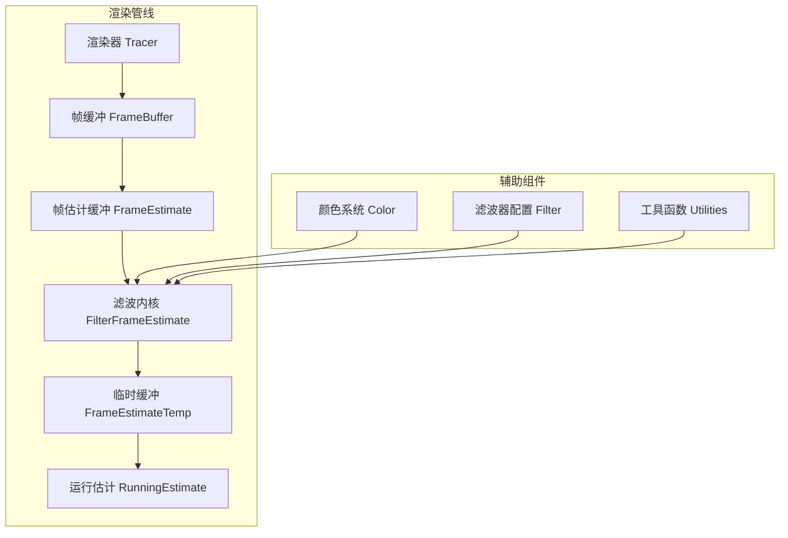
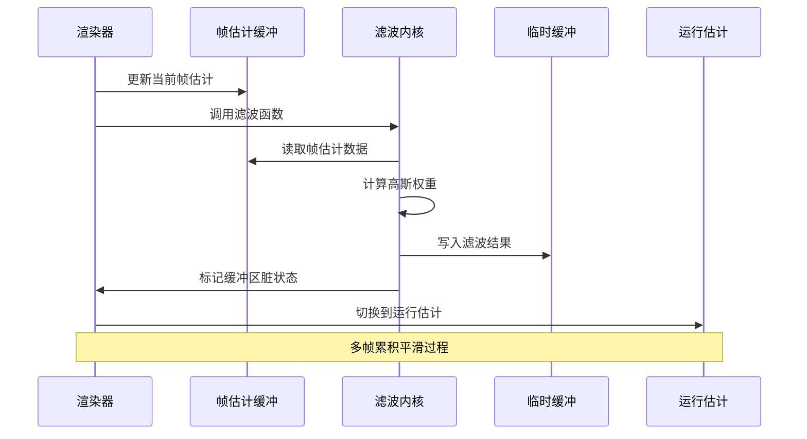
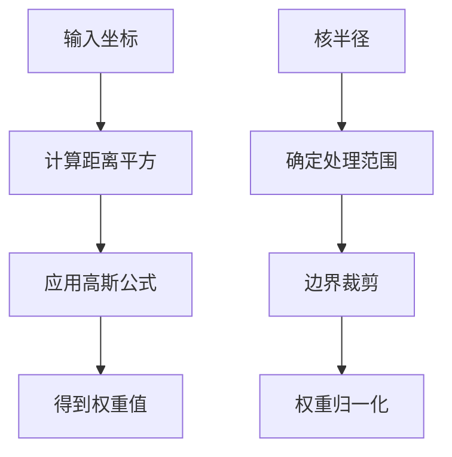
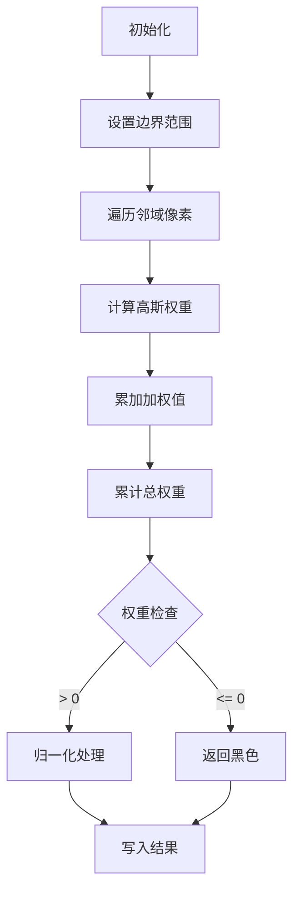
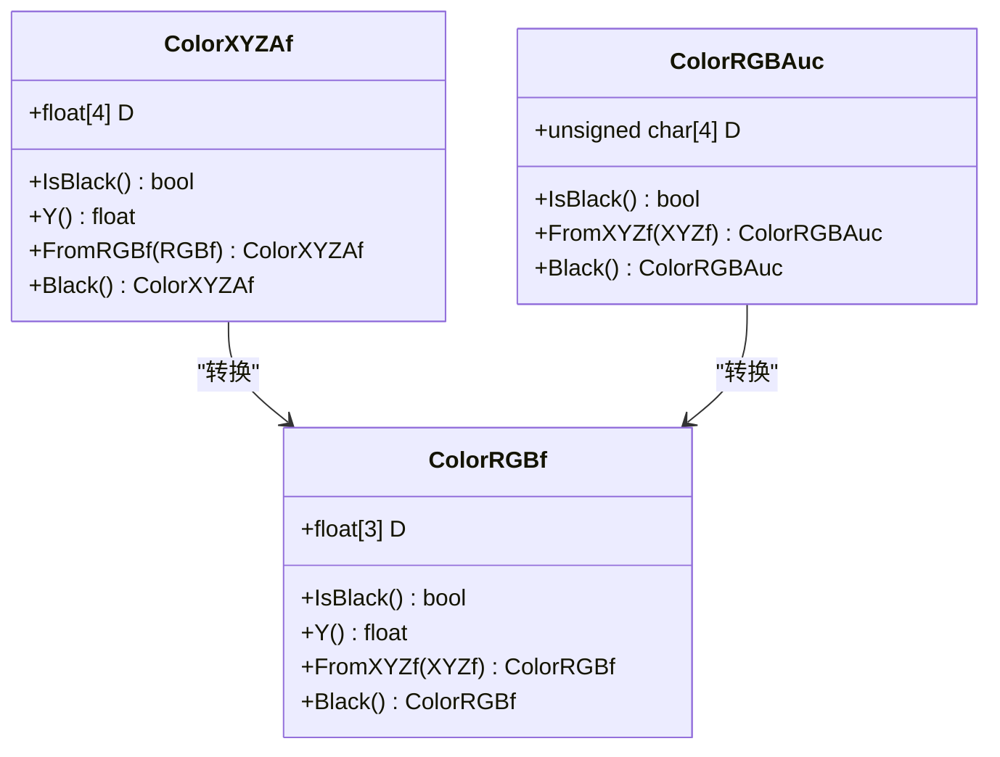
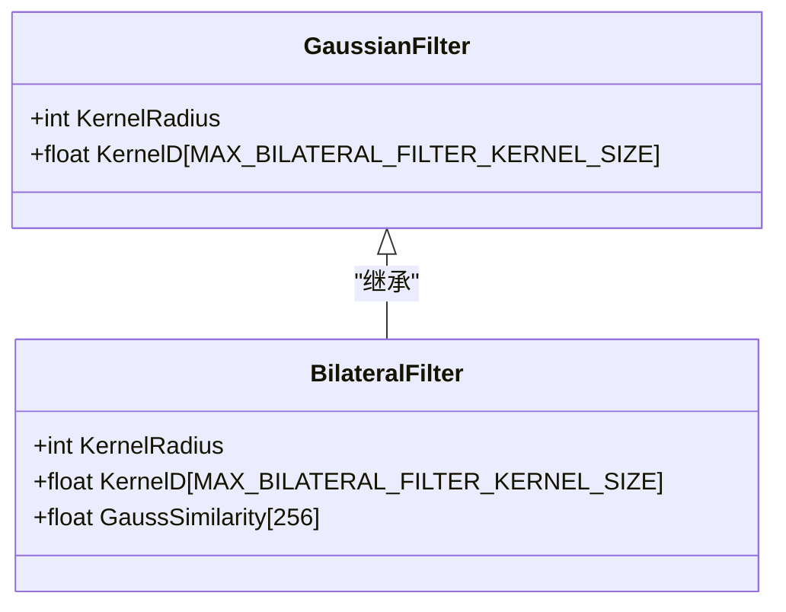
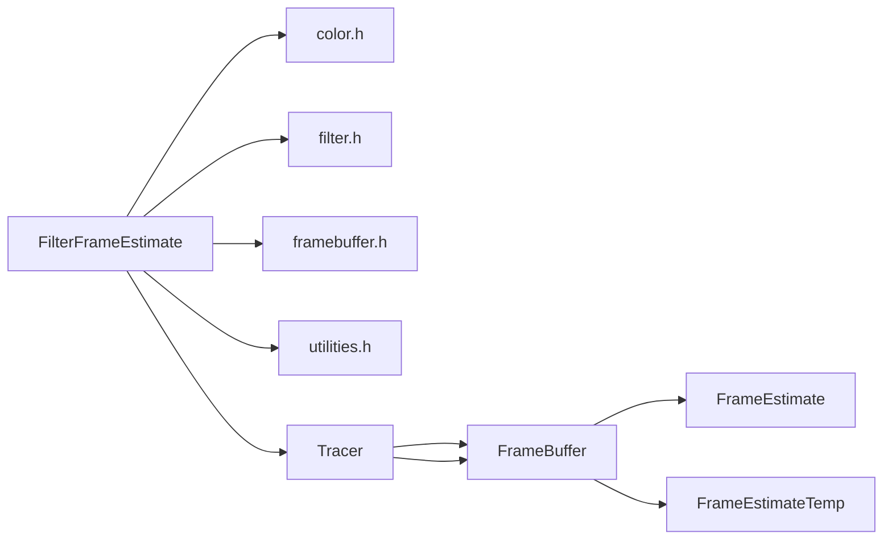
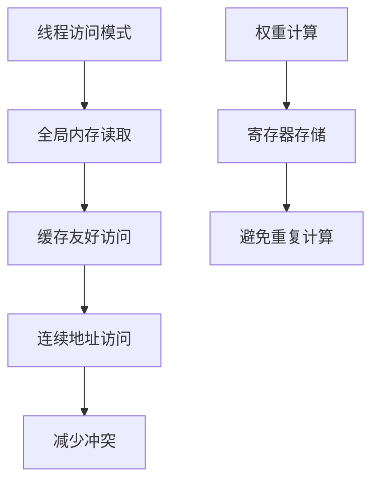

# FilterFrameEstimate内核

<cite>
**本文档引用的文件**
- [filterframeestimate.cuh](file://Source/filterframeestimate.cuh)
- [estimate.cuh](file://Source/estimate.cuh)
- [filter.h](file://Source/filter.h)
- [framebuffer.h](file://Source/framebuffer.h)
- [color.h](file://Source/color.h)
- [utilities.h](file://Source/utilities.h)
- [filterrunningestimate.cuh](file://Source/filterrunningestimate.cuh)
- [rendersettings.h](file://Source/rendersettings.h)
</cite>

## 目录
1. [简介](#简介)
2. [项目结构](#项目结构)
3. [核心组件](#核心组件)
4. [架构概览](#架构概览)
5. [详细组件分析](#详细组件分析)
6. [依赖关系分析](#依赖关系分析)
7. [性能考虑](#性能考虑)
8. [故障排除指南](#故障排除指南)
9. [结论](#结论)
10. [附录](#附录)

## 简介

FilterFrameEstimate内核是Exposure Render框架中的关键组件，专门负责帧估计滤波和降噪处理。该内核实现了基于高斯权重的多帧采样统计处理，通过空间域滤波有效抑制渲染噪声，提升图像质量。

本内核采用CUDA并行计算架构，在GPU上对帧缓冲区进行高效处理，支持实时交互式体积渲染应用中的噪声抑制需求。内核通过累积移动平均算法实现帧间平滑，结合高斯核函数进行空间域加权平均，达到优秀的降噪效果。

## 项目结构

Exposure Render项目采用模块化设计，FilterFrameEstimate内核位于Source目录下，与渲染管线的其他组件紧密集成：

**图表来源**
- [filterframeestimate.cuh:33-74](file://Source/filterframeestimate.cuh#L33-L74)
- [framebuffer.h:26-105](file://Source/framebuffer.h#L26-L105)

**章节来源**
- [filterframeestimate.cuh:1-77](file://Source/filterframeestimate.cuh#L1-L77)
- [framebuffer.h:1-108](file://Source/framebuffer.h#L1-L108)

## 核心组件

### 帧估计缓冲系统

FilterFrameEstimate内核依赖于完整的帧缓冲架构，包括多个专用缓冲区：

| 缓冲区名称 | 数据类型 | 用途 | 生命周期 |
|------------|----------|------|----------|
| FrameEstimate | ColorXYZAf | 当前帧估计值 | 每次渲染迭代更新 |
| FrameEstimateTemp | ColorXYZAf | 滤波后临时存储 | 单次滤波操作使用 |
| RunningEstimateXyza | ColorXYZAf | 运行时累积估计 | 多帧累积平滑 |
| DisplayEstimate | ColorRGBAuc | 显示用估计值 | 最终输出缓冲 |

### 高斯滤波算法

内核实现了一个高效的二维高斯滤波器，具有以下特性：

- **自适应核范围**：根据内核半径动态计算处理边界
- **权重归一化**：确保滤波结果的能量守恒
- **边界处理**：智能处理图像边缘情况
- **透明度保持**：保留第四通道（Alpha）信息

**章节来源**
- [filterframeestimate.cuh:28-64](file://Source/filterframeestimate.cuh#L28-L64)
- [framebuffer.h:94-96](file://Source/framebuffer.h#L94-L96)

## 架构概览

FilterFrameEstimate内核在整个渲染流水线中扮演着关键的后处理角色：

**图表来源**
- [filterframeestimate.cuh:66-74](file://Source/filterframeestimate.cuh#L66-L74)
- [estimate.cuh:34-38](file://Source/estimate.cuh#L34-L38)

### 渲染流水线集成

内核在渲染流程中的具体位置：

1. **帧估计生成**：渲染器产生初始帧估计
2. **滤波处理**：FilterFrameEstimate执行降噪
3. **运行估计**：ComputeEstimate进行多帧累积
4. **显示输出**：最终图像准备显示

**章节来源**
- [filterframeestimate.cuh:66-74](file://Source/filterframeestimate.cuh#L66-L74)
- [estimate.cuh:27-38](file://Source/estimate.cuh#L27-L38)

## 详细组件分析

### 核心算法实现

#### 高斯权重计算

内核使用标准二维高斯函数计算空间权重：

**图表来源**
- [filterframeestimate.cuh:28-31](file://Source/filterframeestimate.cuh#L28-L31)
- [filterframeestimate.cuh:39-42](file://Source/filterframeestimate.cuh#L39-L42)

#### 多帧采样统计处理

内核实现的统计处理流程：

**图表来源**
- [filterframeestimate.cuh:44-64](file://Source/filterframeestimate.cuh#L44-L64)

### 数据结构设计

#### 颜色空间支持

内核支持多种颜色表示格式：

**图表来源**
- [color.h:59-142](file://Source/color.h#L59-L142)

**章节来源**
- [color.h:59-142](file://Source/color.h#L59-L142)
- [filterframeestimate.cuh:44-58](file://Source/filterframeestimate.cuh#L44-L58)

### 参数配置系统

#### 滤波器参数

内核支持的配置参数：

| 参数名称 | 类型 | 默认值 | 描述 |
|----------|------|--------|------|
| KernelRadius | int | 1 | 滤波核半径（像素） |
| Sigma | float | 1.0f | 高斯标准差 |
| MaxKernelSize | int | 256 | 最大核尺寸限制 |

#### 配置类结构

**图表来源**
- [filter.h:27-40](file://Source/filter.h#L27-L40)

**章节来源**
- [filter.h:24-40](file://Source/filter.h#L24-L40)
- [filterframeestimate.cuh:33](file://Source/filterframeestimate.cuh#L33)

## 依赖关系分析

### 组件耦合度

FilterFrameEstimate内核的依赖关系图：

**图表来源**
- [filterframeestimate.cuh:21-23](file://Source/filterframeestimate.cuh#L21-L23)
- [framebuffer.h:94-96](file://Source/framebuffer.h#L94-L96)

### 错误处理机制

内核包含完善的错误处理策略：

1. **边界检查**：防止数组越界访问
2. **权重验证**：避免除零错误
3. **内存管理**：自动缓冲区清理
4. **类型安全**：严格的类型转换检查

**章节来源**
- [filterframeestimate.cuh:39-42](file://Source/filterframeestimate.cuh#L39-L42)
- [filterframeestimate.cuh:60-63](file://Source/filterframeestimate.cuh#L60-L63)

## 性能考虑

### CUDA优化策略

#### 线程配置

内核采用8x8的块大小配置，平衡了：
- **占用率优化**：充分利用SM资源
- **共享内存效率**：减少全局内存访问
- **分支发散控制**：最小化线程分歧

#### 内存访问模式

### 性能基准

| 操作类型 | 复杂度 | 优化策略 |
|----------|--------|----------|
| 单像素滤波 | O(k²) | k为核半径 |
| 整体处理 | O(N·k²) | N为像素数 |
| 内存带宽 | O(N·p) | p为像素字节数 |

**章节来源**
- [filterframeestimate.cuh:68-69](file://Source/filterframeestimate.cuh#L68-L69)

## 故障排除指南

### 常见问题诊断

#### 图像噪声问题

**症状**：滤波后仍有明显噪声
**可能原因**：
1. 核半径过小（KernelRadius < 2）
2. 标准差参数不当（Sigma < 0.5）
3. 帧估计质量不足

**解决方案**：
- 增大核半径至3-5像素
- 调整Sigma至1.0-2.0范围
- 确保足够的渲染迭代次数

#### 性能问题

**症状**：滤波处理速度慢
**可能原因**：
1. 核尺寸过大
2. 分辨率过高
3. GPU资源不足

**优化建议**：
- 减小核半径或调整Sigma
- 降低显示分辨率
- 检查CUDA内核调度

#### 内存相关问题

**症状**：内存溢出或访问冲突
**解决步骤**：
1. 验证缓冲区尺寸一致性
2. 检查边界条件处理
3. 确认CUDA内存分配

**章节来源**
- [filterframeestimate.cuh:60-63](file://Source/filterframeestimate.cuh#L60-L63)
- [framebuffer.h:45-68](file://Source/framebuffer.h#L45-L68)

### 参数调优建议

#### 滤波参数推荐值

| 场景类型 | KernelRadius | Sigma | 说明 |
|----------|--------------|-------|------|
| 实时预览 | 1-2 | 0.8-1.2 | 低延迟，适度降噪 |
| 交互编辑 | 2-3 | 1.0-1.5 | 平衡质量和性能 |
| 最终渲染 | 3-5 | 1.5-2.5 | 高质量输出 |

#### 性能调优要点

1. **渐进式滤波**：从较小核开始，逐步增大
2. **自适应参数**：根据场景复杂度动态调整
3. **硬件适配**：根据GPU能力优化核尺寸

## 结论

FilterFrameEstimate内核通过精心设计的高斯滤波算法，为Exposure Render框架提供了高效的帧估计降噪解决方案。该内核具有以下优势：

- **算法成熟**：基于经典的高斯滤波理论
- **实现高效**：CUDA并行优化，充分利用GPU资源
- **配置灵活**：支持多种参数调节以适应不同需求
- **集成良好**：无缝融入整体渲染流水线

通过合理的参数配置和性能优化，该内核能够在保证图像质量的同时，满足实时交互式渲染的应用需求。建议用户根据具体应用场景选择合适的参数组合，并定期监控性能表现以获得最佳效果。

## 附录

### 参考实现对比

与其他滤波技术相比，FilterFrameEstimate内核的特点：

| 特性 | 高斯滤波 | 双边滤波 | 中值滤波 |
|------|----------|----------|----------|
| 计算复杂度 | O(k²) | O(k²) | O(k² log k) |
| 边缘保持 | 一般 | 优秀 | 优秀 |
| 计算效率 | 高 | 中等 | 低 |
| 实现难度 | 简单 | 复杂 | 中等 |

### 扩展建议

未来可以考虑的改进方向：
1. **自适应核尺寸**：根据局部噪声水平动态调整
2. **多尺度滤波**：结合不同尺度的信息增强效果
3. **机器学习集成**：利用深度学习模型提升滤波质量