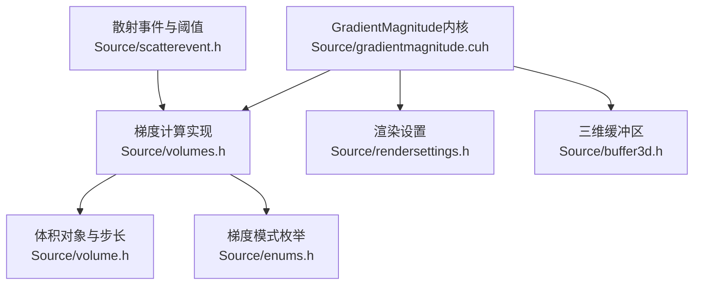
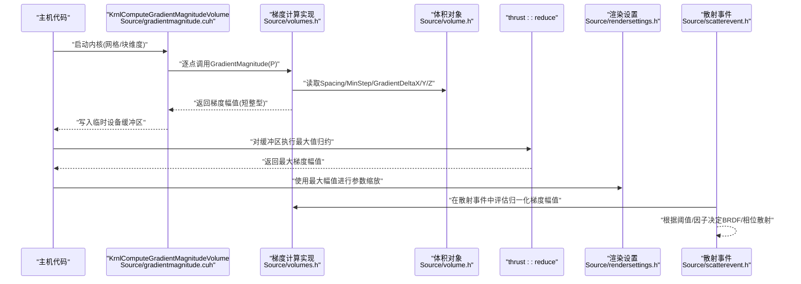
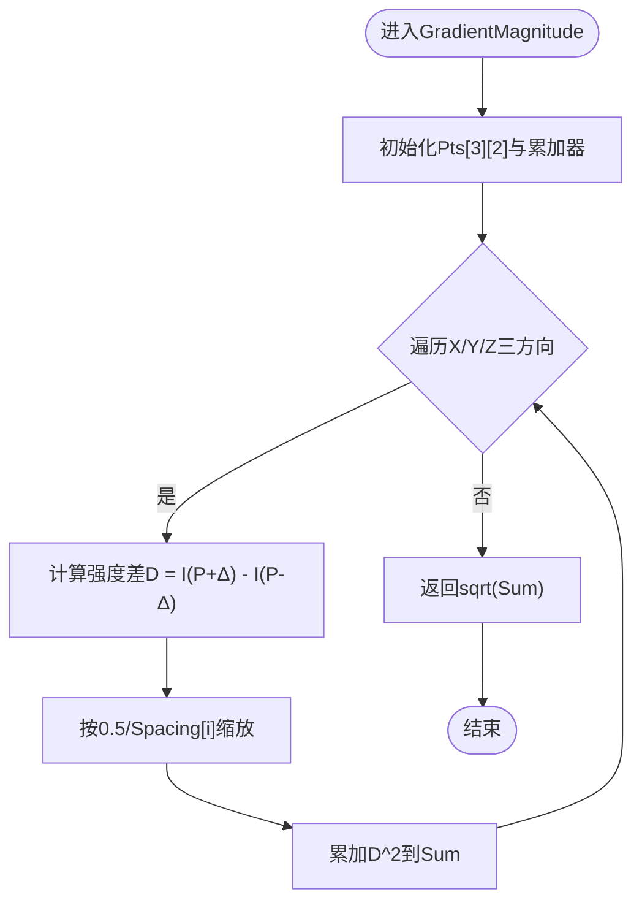
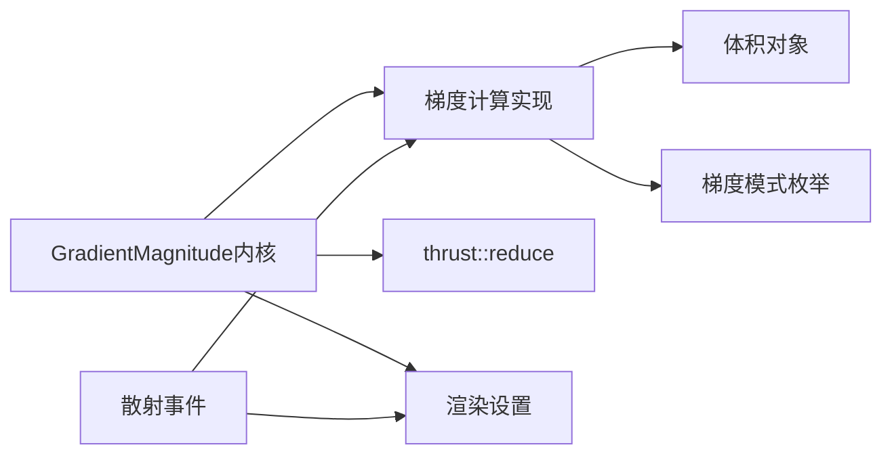
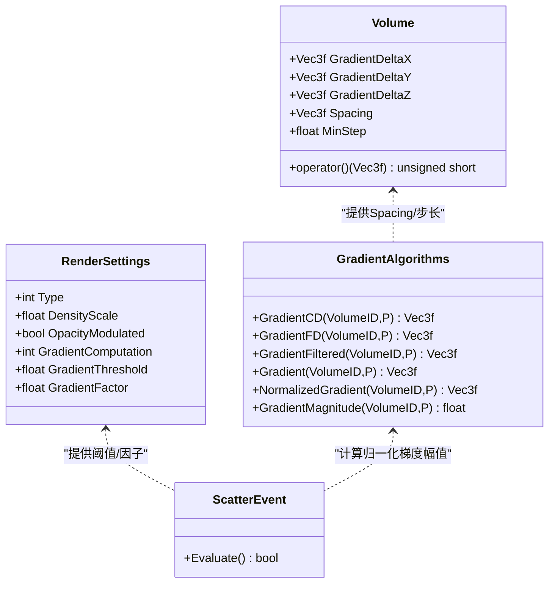

# GradientMagnitude内核

<cite>
**本文引用的文件**
- [gradientmagnitude.cuh](file://Source/gradientmagnitude.cuh)
- [volumes.h](file://Source/volumes.h)
- [volume.h](file://Source/volume.h)
- [enums.h](file://Source/enums.h)
- [rendersettings.h](file://Source/rendersettings.h)
- [scatterevent.h](file://Source/scatterevent.h)
- [buffer3d.h](file://Source/buffer3d.h)
</cite>

## 目录
1. [简介](#简介)
2. [项目结构](#项目结构)
3. [核心组件](#核心组件)
4. [架构总览](#架构总览)
5. [详细组件分析](#详细组件分析)
6. [依赖分析](#依赖分析)
7. [性能考虑](#性能考虑)
8. [故障排查指南](#故障排查指南)
9. [结论](#结论)
10. [附录](#附录)

## 简介
本文件围绕GradientMagnitude内核展开，系统性阐述其在三维体积数据上的梯度场计算与幅值提取机制，覆盖数值微分策略、边缘检测思想、边界与精度控制、渲染中的应用、性能与内存特征、可视化与参数配置方法，以及与渲染管线其他内核的协作关系。目标是帮助读者从原理到实践全面理解该内核的设计与使用。

## 项目结构
与GradientMagnitude内核直接相关的核心文件如下：
- Source/gradientmagnitude.cuh：定义内核接口与最大梯度幅值的归约流程
- Source/volumes.h：实现多种数值微分（前向、中心、滤波）与梯度幅值计算
- Source/volume.h：体积对象及其梯度步长、间距等关键参数
- Source/enums.h：包含梯度计算模式枚举（前向、中心、滤波）
- Source/rendersettings.h：渲染设置中的梯度阈值、因子等参数
- Source/scatterevent.h：散射事件中对梯度幅值的使用与阈值判断
- Source/buffer3d.h：三维缓冲区的内存分配与访问模型

**图表来源**
- [gradientmagnitude.cuh:1-73](file://Source/gradientmagnitude.cuh#L1-L73)
- [volumes.h:1-116](file://Source/volumes.h#L1-L116)
- [volume.h:1-153](file://Source/volume.h#L1-L153)
- [enums.h:1-111](file://Source/enums.h#L1-L111)
- [rendersettings.h:1-134](file://Source/rendersettings.h#L1-L134)
- [scatterevent.h:170-212](file://Source/scatterevent.h#L170-L212)
- [buffer3d.h:1-254](file://Source/buffer3d.h#L1-L254)

**章节来源**
- [gradientmagnitude.cuh:1-73](file://Source/gradientmagnitude.cuh#L1-L73)
- [volumes.h:1-116](file://Source/volumes.h#L1-L116)
- [volume.h:1-153](file://Source/volume.h#L1-L153)
- [enums.h:1-111](file://Source/enums.h#L1-L111)
- [rendersettings.h:1-134](file://Source/rendersettings.h#L1-L134)
- [scatterevent.h:170-212](file://Source/scatterevent.h#L170-L212)
- [buffer3d.h:1-254](file://Source/buffer3d.h#L1-L254)

## 核心组件
- 内核函数：用于并行计算每个体素位置的梯度幅值，并输出到临时设备缓冲区
- 最大幅值归约：通过thrust::reduce在设备端求取全局最大梯度幅值，供后续渲染参数缩放使用
- 梯度计算实现：提供前向差分、中心差分与滤波差分三种策略，支持按渲染设置动态切换
- 边界与步长：基于体积对象的Spacing与MinStep确定各方向的微分步长，确保物理单位一致性
- 渲染集成：在散射事件中使用归一化的梯度幅值进行概率采样或阈值判定

**章节来源**
- [gradientmagnitude.cuh:28-71](file://Source/gradientmagnitude.cuh#L28-L71)
- [volumes.h:31-116](file://Source/volumes.h#L31-L116)
- [volume.h:140-149](file://Source/volume.h#L140-L149)
- [enums.h:73-78](file://Source/enums.h#L73-L78)
- [scatterevent.h:175-204](file://Source/scatterevent.h#L175-L204)

## 架构总览
下图展示从内核调用到梯度幅值归约的整体流程，以及与体积对象、渲染设置和散射事件的交互。

**图表来源**
- [gradientmagnitude.cuh:46-71](file://Source/gradientmagnitude.cuh#L46-L71)
- [volumes.h:93-116](file://Source/volumes.h#L93-L116)
- [volume.h:140-149](file://Source/volume.h#L140-L149)
- [rendersettings.h:66-106](file://Source/rendersettings.h#L66-L106)
- [scatterevent.h:175-204](file://Source/scatterevent.h#L175-L204)

## 详细组件分析

### 数值微分与梯度幅值算法
- 前向差分：以当前点与其沿各坐标轴正方向的邻居点强度差作为近似导数
- 中心差分：以沿各坐标轴正负方向两点强度差作为近似导数，通常更稳定
- 滤波差分：在中心差分基础上引入多点插值与加权组合，进一步抑制噪声
- 梯度幅值：对三个方向的导数平方和开方，再按各方向Spacing归一化，得到物理空间的梯度幅值

**图表来源**
- [volumes.h:93-116](file://Source/volumes.h#L93-L116)

**章节来源**
- [volumes.h:31-116](file://Source/volumes.h#L31-L116)
- [enums.h:73-78](file://Source/enums.h#L73-L78)

### 边界与精度控制
- 步长设置：体积对象根据最小步长与Spacing构造各方向的微分步长，保证不同分辨率下的导数可比性
- 物理归一化：在计算导数时除以对应方向的Spacing，使结果具备物理意义
- 缓冲区类型：梯度幅值以短整型存储，便于高效归约与后续查找表映射

**章节来源**
- [volume.h:140-149](file://Source/volume.h#L140-L149)
- [volumes.h:93-116](file://Source/volumes.h#L93-L116)
- [buffer3d.h:200-251](file://Source/buffer3d.h#L200-L251)

### 三维体积数据处理
- 体数据访问：通过体积对象的重载操作符按局部坐标查询体素强度，内部完成坐标变换与插值
- 并行策略：内核采用8×8×8线程块，网格维度按体数据尺寸向上取整，确保所有体素被覆盖
- 临时缓冲：在设备端分配临时缓冲存放梯度幅值，完成后释放，避免长期驻留

**章节来源**
- [gradientmagnitude.cuh:46-71](file://Source/gradientmagnitude.cuh#L46-L71)
- [volume.h:131-138](file://Source/volume.h#L131-L138)
- [buffer3d.h:125-164](file://Source/buffer3d.h#L125-L164)

### 渲染中的应用场景
- 散射事件概率：将归一化的梯度幅值与渲染设置中的阈值、因子结合，决定BRDF或相位散射的采样概率
- 阈值触发：当归一化梯度幅值超过阈值时，切换到特定散射模式，增强边缘或高梯度区域的视觉表现
- 参数缩放：最大梯度幅值用于构建归一化范围，使梯度对渲染的影响平滑且可控

**章节来源**
- [scatterevent.h:175-204](file://Source/scatterevent.h#L175-L204)
- [rendersettings.h:66-106](file://Source/rendersettings.h#L66-L106)

### 可视化与参数配置
- 可视化思路：将梯度幅值映射到伪彩色或透明度，突出体积内部的强度变化边界
- 关键参数：
  - 渲染设置中的梯度计算模式（前向/中心/滤波）
  - 梯度阈值与梯度因子，用于散射事件的概率或阈值判定
  - 密度缩放与是否按透射率调制，影响最终渲染对比度

**章节来源**
- [rendersettings.h:66-106](file://Source/rendersettings.h#L66-L106)
- [enums.h:73-78](file://Source/enums.h#L73-L78)

## 依赖分析
- 内核依赖于体积对象提供的Spacing与微分步长，以及渲染设置中的梯度计算模式
- 梯度幅值归约依赖thrust库，要求设备端内存可用
- 散射事件依赖归一化后的梯度幅值与渲染设置中的阈值/因子

**图表来源**
- [gradientmagnitude.cuh:28-71](file://Source/gradientmagnitude.cuh#L28-L71)
- [volumes.h:76-86](file://Source/volumes.h#L76-L86)
- [enums.h:73-78](file://Source/enums.h#L73-L78)
- [scatterevent.h:175-204](file://Source/scatterevent.h#L175-L204)

**章节来源**
- [gradientmagnitude.cuh:28-71](file://Source/gradientmagnitude.cuh#L28-L71)
- [volumes.h:76-86](file://Source/volumes.h#L76-L86)
- [enums.h:73-78](file://Source/enums.h#L73-L78)
- [scatterevent.h:175-204](file://Source/scatterevent.h#L175-L204)

## 性能考虑
- 计算复杂度：内核对每个体素执行常数次访存与标量运算，整体复杂度O(N)，N为体素总数
- 内存带宽：需要访问邻域体素强度，存在一定的内存带宽压力；建议使用连续布局与合适的块大小
- 归约成本：thrust::reduce在设备端执行，时间复杂度近似O(N)，但具有良好的GPU并行效率
- 优化建议：
  - 合理选择块大小（当前为8×8×8），平衡占用与吞吐
  - 在设备端复用临时缓冲，减少频繁分配/释放
  - 对于大规模体积，可考虑分层或分块策略降低瞬时内存峰值

[本节为通用性能讨论，不直接分析具体文件]

## 故障排查指南
- 梯度幅值异常为零或全零
  - 检查体积对象的Spacing与MinStep是否合理
  - 确认内核启动参数与体数据分辨率一致
- 归约结果异常
  - 确保设备端临时缓冲成功分配与释放
  - 检查thrust::reduce的起止指针范围与元素类型
- 散射事件未按预期触发
  - 核对渲染设置中的梯度阈值与因子
  - 确认归一化梯度幅值的范围是否正确

**章节来源**
- [gradientmagnitude.cuh:46-71](file://Source/gradientmagnitude.cuh#L46-L71)
- [volume.h:140-149](file://Source/volume.h#L140-L149)
- [rendersettings.h:66-106](file://Source/rendersettings.h#L66-L106)

## 结论
GradientMagnitude内核通过高效的数值微分与归约机制，为体积渲染提供了关键的梯度信息。它在保持物理一致性的前提下，支持多种梯度计算策略，并与渲染设置紧密耦合，既可用于边缘增强，也可用于概率散射采样。配合合理的参数配置与内存管理，可在保证性能的同时获得高质量的可视化效果。

[本节为总结性内容，不直接分析具体文件]

## 附录

### 关键流程类图

**图表来源**
- [volume.h:140-149](file://Source/volume.h#L140-L149)
- [volumes.h:31-116](file://Source/volumes.h#L31-L116)
- [rendersettings.h:66-106](file://Source/rendersettings.h#L66-L106)
- [scatterevent.h:175-204](file://Source/scatterevent.h#L175-L204)