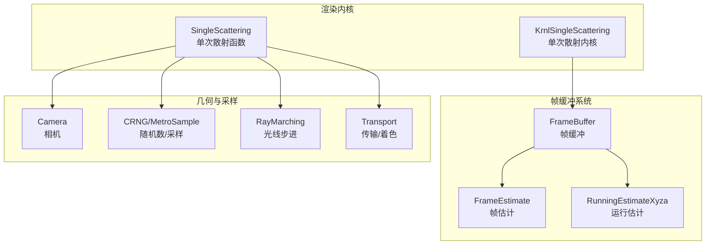
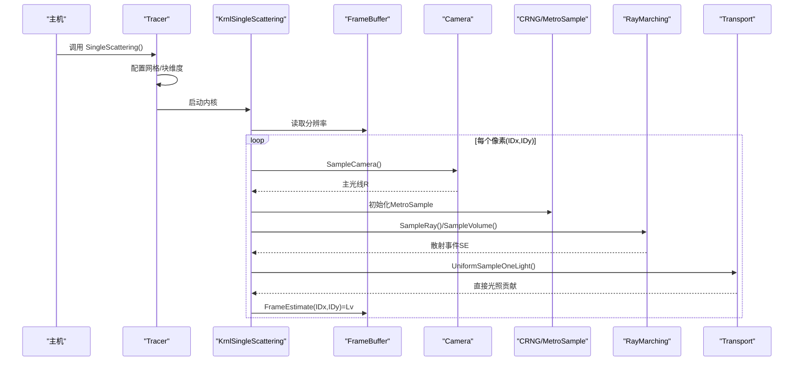
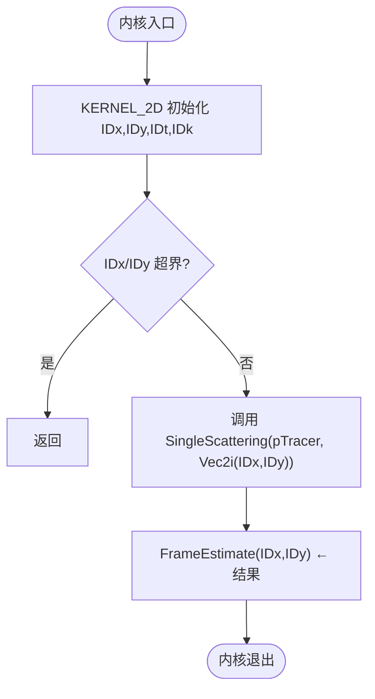
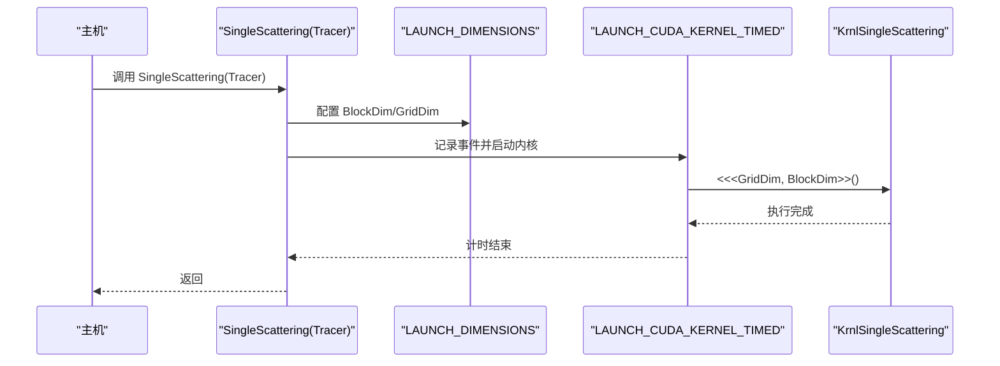
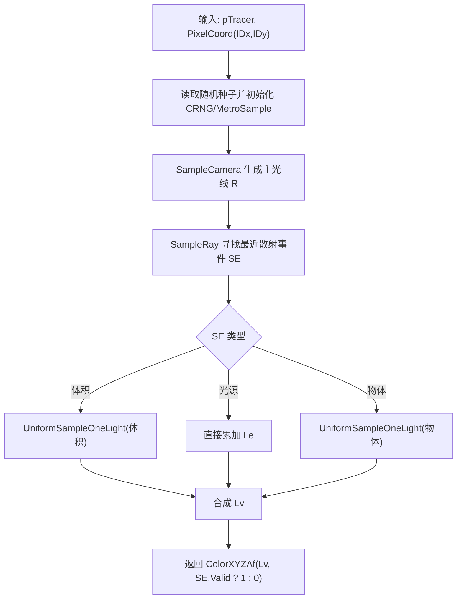
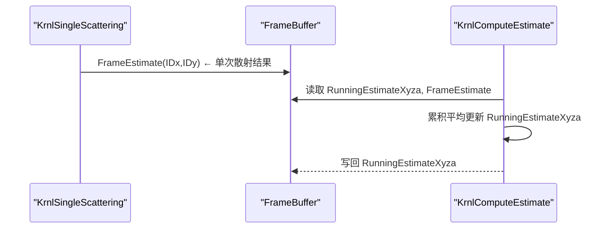
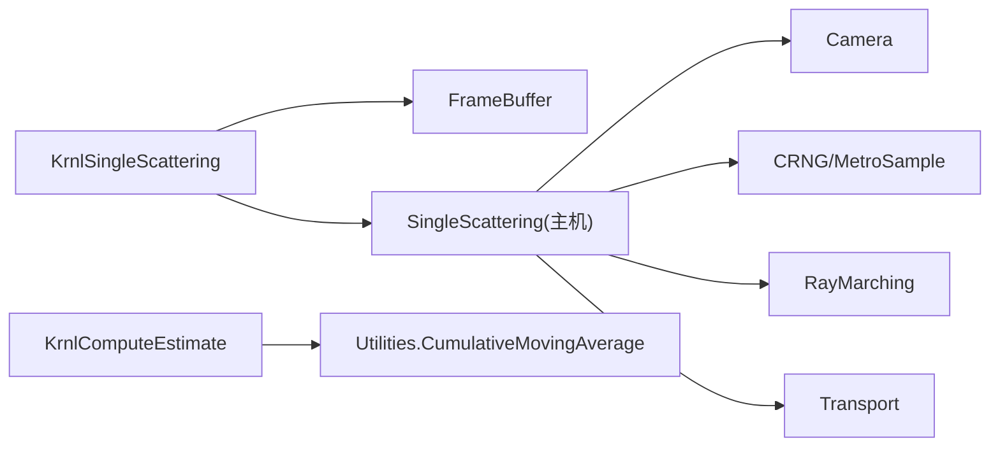

# KrnlSingleScattering内核

<cite>
**本文引用的文件**
- [singlescattering.cuh](file://Source/singlescattering.cuh)
- [singlescattering.h](file://Source/singlescattering.h)
- [macros.cuh](file://Source/macros.cuh)
- [framebuffer.h](file://Source/framebuffer.h)
- [estimate.cuh](file://Source/estimate.cuh)
- [transport.h](file://Source/transport.h)
- [tracer.h](file://Source/tracer.h)
- [utilities.h](file://Source/utilities.h)
- [camera.h](file://Source/camera.h)
- [scatterevent.h](file://Source/scatterevent.h)
- [raymarching.h](file://Source/raymarching.h)
- [montecarlo.h](file://Source/montecarlo.h)
- [color.h](file://Source/color.h)
- [geometry.h](file://Source/geometry.h)
</cite>

## 目录
1. [简介](#简介)
2. [项目结构](#项目结构)
3. [核心组件](#核心组件)
4. [架构总览](#架构总览)
5. [详细组件分析](#详细组件分析)
6. [依赖关系分析](#依赖关系分析)
7. [性能考量](#性能考量)
8. [故障排查指南](#故障排查指南)
9. [结论](#结论)
10. [附录](#附录)

## 简介
本文件围绕 KrnlSingleScattering 单次散射渲染内核展开，系统性阐述其工作原理、实现机制与性能特征。重点包括：
- 光线传播与单次散射积分的计算流程
- 帧估计生成与累积平均过程
- KERNEL_2D 宏的二维并行计算模式
- SingleScattering 函数的调用链与参数传递
- 内核与帧缓冲系统的交互方式
- 性能优化建议与调试方法

## 项目结构
KrnlSingleScattering 所在模块位于 Source 目录，主要涉及渲染内核、帧缓冲、相机模型、采样与传输等子系统。

图表来源
- [singlescattering.cuh:27-32](file://Source/singlescattering.cuh#L27-L32)
- [singlescattering.h:76-102](file://Source/singlescattering.h#L76-L102)
- [framebuffer.h:26-105](file://Source/framebuffer.h#L26-L105)
- [camera.h:26-116](file://Source/camera.h#L26-L116)
- [raymarching.h:30-71](file://Source/raymarching.h#L30-L71)
- [transport.h:115-156](file://Source/transport.h#L115-L156)

章节来源
- [singlescattering.cuh:27-38](file://Source/singlescattering.cuh#L27-L38)
- [framebuffer.h:26-105](file://Source/framebuffer.h#L26-L105)

## 核心组件
- KrnlSingleScattering：CUDA 内核，按像素并行计算单次散射贡献，并写入帧估计缓冲。
- SingleScattering（主机侧）：调度器，配置网格/块维度并启动内核。
- FrameBuffer：管理分辨率与多类缓冲区（帧估计、运行估计、显示估计、随机种子等）。
- Camera：定义视图参数与屏幕空间映射。
- RayMarching：体积步进采样与散射事件检测。
- Transport：直接光照估计与材质/相位函数评估。
- Utilities：通用工具（移动平均、颜色转换、Glossiness 映射等）。

章节来源
- [singlescattering.cuh:27-38](file://Source/singlescattering.cuh#L27-L38)
- [singlescattering.h:76-102](file://Source/singlescattering.h#L76-L102)
- [framebuffer.h:26-105](file://Source/framebuffer.h#L26-L105)
- [camera.h:26-116](file://Source/camera.h#L26-L116)
- [raymarching.h:30-71](file://Source/raymarching.h#L30-L71)
- [transport.h:115-156](file://Source/transport.h#L115-L156)
- [utilities.h:59-67](file://Source/utilities.h#L59-L67)

## 架构总览
KrnlSingleScattering 的执行路径从主机侧 SingleScattering 调度开始，进入设备端内核，逐像素完成以下步骤：
- 依据像素坐标与相机模型生成主光线
- 在体积中进行步进采样，寻找最近散射事件
- 根据事件类型（体积/光源/物体）计算贡献
- 将结果写入帧估计缓冲
- 后续通过运行估计内核进行累积平均

图表来源
- [singlescattering.cuh:27-38](file://Source/singlescattering.cuh#L27-L38)
- [singlescattering.h:76-102](file://Source/singlescattering.h#L76-L102)
- [camera.h:29-50](file://Source/camera.h#L29-L50)
- [raymarching.h:30-71](file://Source/raymarching.h#L30-L71)
- [transport.h:115-156](file://Source/transport.h#L115-L156)

## 详细组件分析

### KrnlSingleScattering 内核
- 并行模式：使用 KERNEL_2D 宏，按像素(IDx,IDy)并行，IDk 为线性索引，IDt 为线程局部索引。
- 工作内容：对每个像素调用 SingleScattering 获取颜色与可见性，写入 FrameBuffer.FrameEstimate。
- 边界检查：当 IDx 或 IDy 超出分辨率时提前返回。

图表来源
- [singlescattering.cuh:27-32](file://Source/singlescattering.cuh#L27-L32)
- [macros.cuh:83-90](file://Source/macros.cuh#L83-L90)

章节来源
- [singlescattering.cuh:27-32](file://Source/singlescattering.cuh#L27-L32)
- [macros.cuh:83-90](file://Source/macros.cuh#L83-L90)

### SingleScattering 函数（主机侧）
- 调度：设置块/网格维度（LAUNCH_DIMENSIONS），以固定块大小启动 KrnlSingleScattering。
- 计时：使用 LAUNCH_CUDA_KERNEL_TIMED 包裹内核调用，测量执行时间。
- 参数：接收 Tracer 引用，内部通过 gpTracer 访问全局状态（相机、帧缓冲、随机种子等）。

图表来源
- [singlescattering.cuh:34-38](file://Source/singlescattering.cuh#L34-L38)
- [macros.cuh:27-39](file://Source/macros.cuh#L27-L39)
- [macros.cuh:41-65](file://Source/macros.cuh#L41-L65)

章节来源
- [singlescattering.cuh:34-38](file://Source/singlescattering.cuh#L34-L38)
- [macros.cuh:27-39](file://Source/macros.cuh#L27-L39)
- [macros.cuh:41-65](file://Source/macros.cuh#L41-L65)

### 单次散射计算流程（设备侧）
- 随机种子：根据像素坐标从 FrameBuffer.RandomSeeds1/2 读取种子，初始化 CRNG 与 MetroSample。
- 相机采样：SampleCamera 根据 FilmSize、Aperture/FocalDistance 等生成主光线 R。
- 散射事件：SampleRay 组合体积散射、光源与物体相交，选择最近有效事件。
- 光照贡献：
  - 体积事件：UniformSampleOneLight 使用材质/相位函数与直接光照估计
  - 光源事件：直接累加 Le
  - 物体事件：UniformSampleOneLight
- 可见性：若事件有效，Alpha=1；否则 Alpha=0。

图表来源
- [singlescattering.h:76-102](file://Source/singlescattering.h#L76-L102)
- [camera.h:29-50](file://Source/camera.h#L29-L50)
- [raymarching.h:52-74](file://Source/raymarching.h#L52-L74)
- [transport.h:115-156](file://Source/transport.h#L115-L156)

章节来源
- [singlescattering.h:76-102](file://Source/singlescattering.h#L76-L102)
- [camera.h:29-50](file://Source/camera.h#L29-L50)
- [raymarching.h:52-74](file://Source/raymarching.h#L52-L74)
- [transport.h:115-156](file://Source/transport.h#L115-L156)

### 帧估计与累积平均
- 帧估计写入：KrnlSingleScattering 将每像素结果写入 FrameEstimate 缓冲。
- 运行估计：KrnlComputeEstimate 使用 CumulativeMovingAverage 对帧估计进行迭代平均，更新 RunningEstimateXyza。
- 显示估计：后续可将运行估计转换为显示格式并进行滤波。

图表来源
- [singlescattering.cuh:31](file://Source/singlescattering.cuh#L31)
- [estimate.cuh:27-32](file://Source/estimate.cuh#L27-L32)
- [utilities.h:59-67](file://Source/utilities.h#L59-L67)

章节来源
- [singlescattering.cuh:31](file://Source/singlescattering.cuh#L31)
- [estimate.cuh:27-38](file://Source/estimate.cuh#L27-L38)
- [utilities.h:59-67](file://Source/utilities.h#L59-L67)

### KERNEL_2D 宏与二维并行计算
- 宏定义：KERNEL_2D 提供 IDx、IDy、IDt（线程局部）、IDk（线性索引）与边界检查。
- 并行策略：每个像素一个线程块，块内线程布局为 16x8（由调度器设定），IDt 用于共享内存或局部索引。
- 边界处理：越界直接返回，避免越界访问。

章节来源
- [macros.cuh:83-90](file://Source/macros.cuh#L83-L90)
- [singlescattering.cuh:29](file://Source/singlescattering.cuh#L29)
- [singlescattering.cuh:36](file://Source/singlescattering.cuh#L36)

### 内核与帧缓冲系统的交互
- 分辨率：gpTracer->FrameBuffer.Resolution 提供宽度与高度，驱动 KERNEL_2D 循环。
- 随机种子：FrameBuffer.RandomSeeds1/2 为每像素提供独立随机种子，确保采样独立性。
- 缓冲区：FrameEstimate 保存单次散射结果；RunningEstimateXyza 保存累积平均结果；DisplayEstimate 等用于最终显示。

章节来源
- [singlescattering.cuh:29](file://Source/singlescattering.cuh#L29)
- [framebuffer.h:93-104](file://Source/framebuffer.h#L93-L104)
- [tracer.h:54](file://Source/tracer.h#L54)

## 依赖关系分析
- KrnlSingleScattering 依赖 FrameBuffer（分辨率、随机种子、帧估计缓冲）。
- SingleScattering 依赖相机模型、随机数、光线步进与传输模块。
- 运行估计依赖 CumulativeMovingAverage 实现平滑收敛。

图表来源
- [singlescattering.cuh:27-38](file://Source/singlescattering.cuh#L27-L38)
- [framebuffer.h:93-104](file://Source/framebuffer.h#L93-L104)
- [estimate.cuh:27-38](file://Source/estimate.cuh#L27-L38)
- [utilities.h:59-67](file://Source/utilities.h#L59-L67)

章节来源
- [singlescattering.cuh:27-38](file://Source/singlescattering.cuh#L27-L38)
- [estimate.cuh:27-38](file://Source/estimate.cuh#L27-L38)
- [utilities.h:59-67](file://Source/utilities.h#L59-L67)

## 性能考量
- 并行粒度：每个像素一个线程，适合高分辨率场景；块大小 16x8 可平衡寄存器与吞吐。
- 内存访问：FrameEstimate 与 RandomSeeds 为二维连续布局，有利于带宽利用。
- 步进采样：体积步进的步长与密度参数影响计算量，需权衡质量与速度。
- 累积平均：运行估计迭代提升稳定性，减少闪烁，但增加一次额外内核。
- 随机数：每像素独立种子保证采样独立性，避免相关噪声。

## 故障排查指南
- 越界访问：确认 KERNEL_2D 的边界检查是否生效，分辨率与块大小匹配。
- 随机数异常：检查 RandomSeeds1/2 是否正确初始化与拷贝至设备。
- 光线步进失败：检查相机近远裁剪面、体积包围盒与步进参数。
- 累积平均不收敛：确认 NoIterations 与 CumulativeMovingAverage 的分母处理。
- 调试计时：使用 LAUNCH_CUDA_KERNEL_TIMED 查看内核耗时，定位瓶颈。

章节来源
- [macros.cuh:83-90](file://Source/macros.cuh#L83-L90)
- [framebuffer.h:70-74](file://Source/framebuffer.h#L70-L74)
- [raymarching.h:45-68](file://Source/raymarching.h#L45-L68)
- [utilities.h:59-67](file://Source/utilities.h#L59-L67)
- [macros.cuh:41-65](file://Source/macros.cuh#L41-L65)

## 结论
KrnlSingleScattering 以内核级并行实现了单次散射的像素级计算，结合帧缓冲与运行估计内核形成稳定的迭代渲染管线。通过 KERNEL_2D 宏与固定块尺寸，系统在质量与性能间取得良好平衡；配合体积步进与直接光照估计，能够高效生成高质量帧估计并逐步收敛。

## 附录
- 关键数据类型与颜色空间：参考颜色与向量定义，确保在 XYZ/RGB 之间的转换一致。
- 几何与变换：矩阵与向量变换支持复杂场景下的相机与体积变换。

章节来源
- [color.h:59-142](file://Source/color.h#L59-L142)
- [geometry.h:30-68](file://Source/geometry.h#L30-L68)