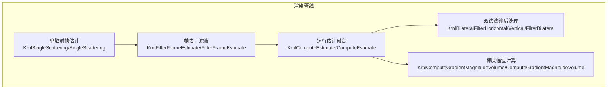
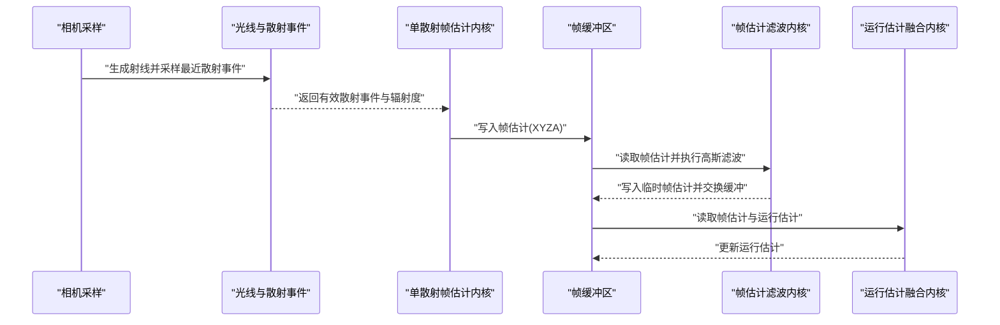
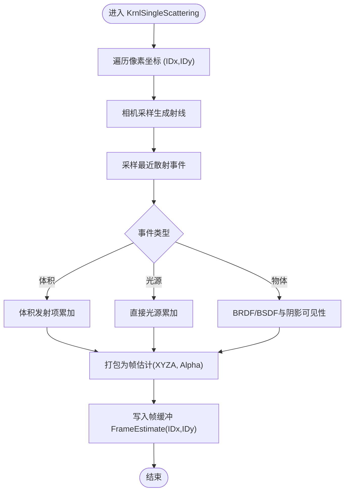
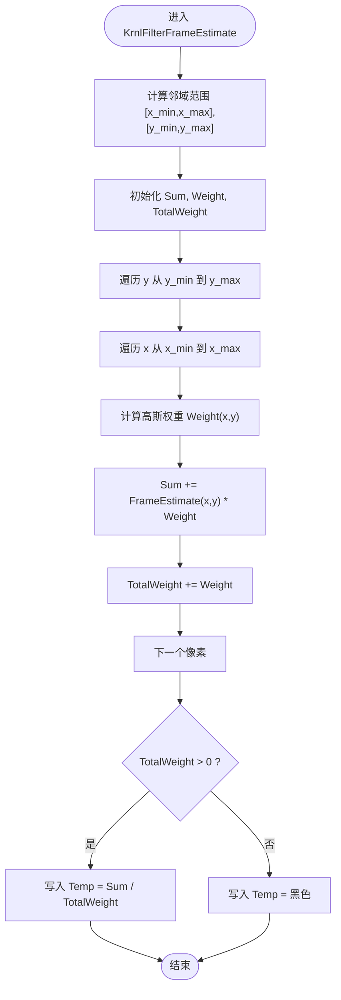
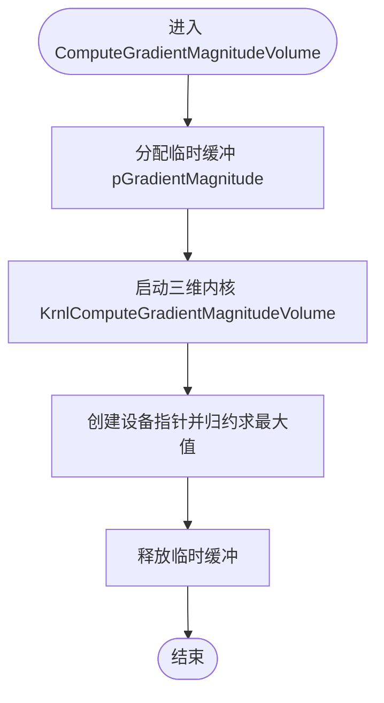
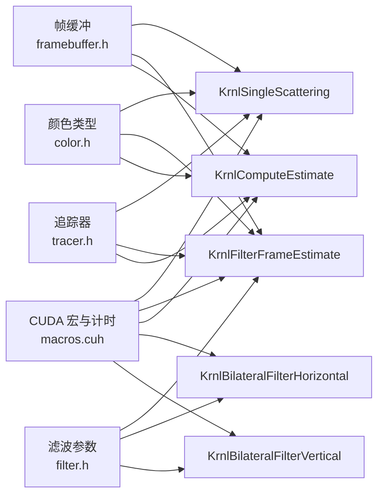

# 内核函数详解

<cite>
**本文引用的文件**
- [singlescattering.cuh](file://Source/singlescattering.cuh)
- [singlescattering.h](file://Source/singlescattering.h)
- [filterframeestimate.cuh](file://Source/filterframeestimate.cuh)
- [gradientmagnitude.cuh](file://Source/gradientmagnitude.cuh)
- [estimate.cuh](file://Source/estimate.cuh)
- [filterrunningestimate.cuh](file://Source/filterrunningestimate.cuh)
- [color.h](file://Source/color.h)
- [filter.h](file://Source/filter.h)
- [framebuffer.h](file://Source/framebuffer.h)
- [tracer.h](file://Source/tracer.h)
- [macros.cuh](file://Source/macros.cuh)
- [utilities.h](file://Source/utilities.h)
- [transport.h](file://Source/transport.h)
- [volumes.h](file://Source/volumes.h)
</cite>

## 目录
1. [简介](#简介)
2. [项目结构](#项目结构)
3. [核心组件](#核心组件)
4. [架构总览](#架构总览)
5. [详细组件分析](#详细组件分析)
6. [依赖关系分析](#依赖关系分析)
7. [性能考量](#性能考量)
8. [故障排查指南](#故障排查指南)
9. [结论](#结论)
10. [附录：调用示例与参数配置](#附录调用示例与参数配置)

## 简介
本文件系统性解析项目中的三类关键CUDA内核：单散射帧估计内核、帧估计滤波内核以及梯度幅值计算内核。文档覆盖各内核的实现原理、数据流、输入输出、性能特征，并给出调用流程图、时序图与优化建议，帮助开发者在交互式体绘制场景中高效使用与调试这些内核。

## 项目结构
围绕渲染管线，内核主要分布在以下模块：
- 单散射采样与帧估计生成：KrnlSingleScattering 与 SingleScattering
- 帧估计滤波与降噪：KrnlFilterFrameEstimate 与 FilterFrameEstimate
- 运行估计融合：KrnlComputeEstimate 与 ComputeEstimate
- 双边滤波后处理：KrnlBilateralFilterHorizontal/Vertical 与 FilterBilateral
- 梯度幅值计算（体积）：KrnlComputeGradientMagnitudeVolume 与 ComputeGradientMagnitudeVolume
- 数据类型与宏：color.h、filter.h、framebuffer.h、tracer.h、macros.cuh、utilities.h、transport.h、volumes.h

**图表来源**
- [singlescattering.cuh:27-38](file://Source/singlescattering.cuh#L27-L38)
- [filterframeestimate.cuh:33-74](file://Source/filterframeestimate.cuh#L33-L74)
- [estimate.cuh:27-38](file://Source/estimate.cuh#L27-L38)
- [filterrunningestimate.cuh:55-200](file://Source/filterrunningestimate.cuh#L55-L200)
- [gradientmagnitude.cuh:28-71](file://Source/gradientmagnitude.cuh#L28-L71)

**章节来源**
- [singlescattering.cuh:27-38](file://Source/singlescattering.cuh#L27-L38)
- [filterframeestimate.cuh:33-74](file://Source/filterframeestimate.cuh#L33-L74)
- [estimate.cuh:27-38](file://Source/estimate.cuh#L27-L38)
- [filterrunningestimate.cuh:55-200](file://Source/filterrunningestimate.cuh#L55-L200)
- [gradientmagnitude.cuh:28-71](file://Source/gradientmagnitude.cuh#L28-L71)

## 核心组件
- 单散射帧估计内核：为每个像素生成一次散射贡献的帧估计，作为后续迭代的基础。
- 帧估计滤波内核：以高斯核对局部邻域进行加权平均，降低噪声并平滑伪影。
- 运行估计融合内核：基于累积移动平均，将多帧帧估计融合为最终的运行估计。
- 双边滤波内核：利用颜色相似性与空间距离的复合权重，实现边缘保持的去噪。
- 梯度幅值计算内核：计算体数据的梯度幅值并归约得到最大梯度幅值，用于自适应步长等用途。

**章节来源**
- [singlescattering.cuh:27-38](file://Source/singlescattering.cuh#L27-L38)
- [filterframeestimate.cuh:33-74](file://Source/filterframeestimate.cuh#L33-L74)
- [estimate.cuh:27-38](file://Source/estimate.cuh#L27-L38)
- [filterrunningestimate.cuh:55-200](file://Source/filterrunningestimate.cuh#L55-L200)
- [gradientmagnitude.cuh:28-71](file://Source/gradientmagnitude.cuh#L28-L71)

## 架构总览
下图展示从相机采样到帧估计生成、再到滤波与融合的整体流程。

**图表来源**
- [singlescattering.h:76-102](file://Source/singlescattering.h#L76-L102)
- [singlescattering.cuh:27-38](file://Source/singlescattering.cuh#L27-L38)
- [filterframeestimate.cuh:33-74](file://Source/filterframeestimate.cuh#L33-L74)
- [estimate.cuh:27-38](file://Source/estimate.cuh#L27-L38)
- [framebuffer.h:93-104](file://Source/framebuffer.h#L93-L104)

## 详细组件分析

### KrnlSingleScattering：单散射帧估计内核
- 功能概述
  - 针对屏幕上的每个像素，调用单散射函数生成该像素的帧估计（含XYZ三通道辐射度与Alpha有效性标志）。
- 输入输出
  - 输入：帧缓冲分辨率（宽高）、随机种子、相机参数、灯光集合、对象与体积数据。
  - 输出：帧缓冲中的帧估计（每像素一个四分量颜色，第4分量表示该像素是否有效）。
- 处理逻辑
  - 使用二维网格遍历每个像素坐标，构造相机射线并采样最近散射事件；根据事件类型累加直接光照或体积发射项，最终封装为帧估计。
- 性能特征
  - 每像素一次内核调用，线程数等于像素总数；计算复杂度与像素数线性相关；受光线相交、材质BRDF/BSDF评估与采样策略影响。
- 关键实现路径
  - 内核入口与像素循环：[singlescattering.cuh:27-32](file://Source/singlescattering.cuh#L27-L32)
  - 单像素单散射计算：[singlescattering.h:76-102](file://Source/singlescattering.h#L76-L102)
  - 光线采样与散射事件选择：[singlescattering.h:29-74](file://Source/singlescattering.h#L29-L74)
  - 直接光照与体积发射评估：[transport.h:115-156](file://Source/transport.h#L115-L156)

**图表来源**
- [singlescattering.cuh:27-32](file://Source/singlescattering.cuh#L27-L32)
- [singlescattering.h:76-102](file://Source/singlescattering.h#L76-L102)
- [transport.h:115-156](file://Source/transport.h#L115-L156)

**章节来源**
- [singlescattering.cuh:27-38](file://Source/singlescattering.cuh#L27-L38)
- [singlescattering.h:29-102](file://Source/singlescattering.h#L29-L102)
- [transport.h:115-156](file://Source/transport.h#L115-L156)

### FilterFrameEstimate：帧估计滤波内核
- 功能概述
  - 对每个像素的邻域使用二维高斯核进行加权求和，归一化后写入临时缓冲，随后交换为新的帧估计。
- 输入输出
  - 输入：帧估计缓冲、高斯核半径与方差参数。
  - 输出：帧估计临时缓冲（交换后成为新的帧估计）。
- 处理逻辑
  - 计算当前像素邻域边界，遍历邻域像素，按二维高斯权重累加颜色并归一化；保留Alpha分量不变。
- 性能特征
  - 每像素一次内核调用，邻域大小由半径决定；时间复杂度近似为 O(R^2·N)，其中R为核半径，N为像素数。
- 关键实现路径
  - 内核主体与边界裁剪：[filterframeestimate.cuh:33-64](file://Source/filterframeestimate.cuh#L33-L64)
  - 高斯权重计算：[filterframeestimate.cuh:28-31](file://Source/filterframeestimate.cuh#L28-L31)
  - 调用与缓冲交换：[filterframeestimate.cuh:66-74](file://Source/filterframeestimate.cuh#L66-L74)

**图表来源**
- [filterframeestimate.cuh:33-64](file://Source/filterframeestimate.cuh#L33-L64)
- [filterframeestimate.cuh:28-31](file://Source/filterframeestimate.cuh#L28-L31)

**章节来源**
- [filterframeestimate.cuh:28-74](file://Source/filterframeestimate.cuh#L28-L74)
- [filter.h:27-40](file://Source/filter.h#L27-L40)

### GradientMagnitude：梯度幅值计算内核
- 功能概述
  - 计算体数据在每个体素处的梯度幅值，并通过归约操作得到全局最大梯度幅值，用于步长控制等用途。
- 输入输出
  - 输入：体数据尺寸（宽、高、深）、临时缓冲指针。
  - 输出：最大梯度幅值。
- 处理逻辑
  - 启动三维网格遍历体素，计算三方向差分或滤波梯度，求幅值并存入临时缓冲；随后使用thrust归约得到最大值。
- 性能特征
  - 时间复杂度 O(W×H×D)；内存带宽受限，适合在设备端并行计算；归约阶段存在同步开销。
- 关键实现路径
  - 三维内核占位与注释（当前未启用）：[gradientmagnitude.cuh:28-44](file://Source/gradientmagnitude.cuh#L28-L44)
  - 体积梯度计算与幅值公式：[volumes.h:93-114](file://Source/volumes.h#L93-L114)
  - 最大值归约与内存管理：[gradientmagnitude.cuh:46-71](file://Source/gradientmagnitude.cuh#L46-L71)

**图表来源**
- [gradientmagnitude.cuh:46-71](file://Source/gradientmagnitude.cuh#L46-L71)
- [volumes.h:93-114](file://Source/volumes.h#L93-L114)

**章节来源**
- [gradientmagnitude.cuh:28-71](file://Source/gradientmagnitude.cuh#L28-L71)
- [volumes.h:93-114](file://Source/volumes.h#L93-L114)

### 运行估计融合与双边滤波（补充）
- 运行估计融合
  - 使用累积移动平均将当前帧估计融合进运行估计，随迭代次数增加逐步收敛。
  - 关键实现路径：[estimate.cuh:27-38](file://Source/estimate.cuh#L27-L38)、[utilities.h:59-67](file://Source/utilities.h#L59-L67)
- 双边滤波后处理
  - 分水平与垂直两阶段，利用空间权重与亮度相似性权重，实现边缘保持的双边滤波。
  - 关键实现路径：[filterrunningestimate.cuh:55-191](file://Source/filterrunningestimate.cuh#L55-L191)

**章节来源**
- [estimate.cuh:27-38](file://Source/estimate.cuh#L27-L38)
- [utilities.h:59-67](file://Source/utilities.h#L59-L67)
- [filterrunningestimate.cuh:55-191](file://Source/filterrunningestimate.cuh#L55-L191)

## 依赖关系分析
- 内核间耦合
  - 单散射帧估计内核独立生成帧估计，后续由帧估计滤波与运行估计融合共同提升质量。
  - 双边滤波作为后处理步骤，作用于显示估计（非帧估计），与单散射内核无直接耦合。
- 外部依赖
  - CUDA运行时与thrust归约：用于计时与最大值归约。
  - 自定义宏与缓冲：统一的内核宏、帧缓冲与追踪器对象贯穿多个内核。
- 数据类型与接口
  - 颜色类型与转换：XYZ/RGB/RGBA之间的转换与运算。
  - 滤波参数：高斯核与双边核的半径与权重表。

**图表来源**
- [macros.cuh:27-101](file://Source/macros.cuh#L27-L101)
- [framebuffer.h:93-104](file://Source/framebuffer.h#L93-L104)
- [color.h:59-142](file://Source/color.h#L59-L142)
- [filter.h:27-40](file://Source/filter.h#L27-L40)
- [tracer.h:31-55](file://Source/tracer.h#L31-L55)

**章节来源**
- [macros.cuh:27-101](file://Source/macros.cuh#L27-L101)
- [framebuffer.h:93-104](file://Source/framebuffer.h#L93-L104)
- [color.h:59-142](file://Source/color.h#L59-L142)
- [filter.h:27-40](file://Source/filter.h#L27-L40)
- [tracer.h:31-55](file://Source/tracer.h#L31-L55)

## 性能考量
- 并行粒度
  - 帧估计类内核采用像素级并行，确保良好的占用率；建议块维度与SM资源匹配，避免寄存器压力过大。
- 内存访问
  - 帧估计与双边滤波均涉及全局内存读写，注意缓存友好性与合并访问模式；必要时可引入共享内存减少重复读取。
- 归约与同步
  - 梯度幅值归约存在同步成本，建议在需要时才执行，避免频繁触发。
- 参数敏感性
  - 高斯核半径与双边核半径直接影响计算量与图像质量，需结合分辨率与目标信噪比折中设置。
- 计时与诊断
  - 使用统一的内核计时宏记录执行时间，便于定位热点。

[本节为通用指导，不直接分析具体文件]

## 故障排查指南
- 帧估计全黑或异常
  - 检查相机采样与射线构建是否正确，确认散射事件类型判断与可见性判定。
  - 关注帧估计写入前后的Alpha有效性标志。
- 滤波后出现光晕或边缘模糊
  - 调整高斯核半径与Sigma，避免过大的核导致能量扩散。
  - 双边滤波时检查亮度相似性权重表与空间权重表的一致性。
- 运行估计不收敛或抖动
  - 确认累计移动平均的N参数与迭代次数一致，避免除零或数值不稳定。
- 梯度幅值计算未生效
  - 当前内核主体为空实现，需启用三维内核并完成体数据访问与梯度计算。
- CUDA错误与同步
  - 使用统一的错误处理宏捕获内核错误与同步失败，定位问题发生点。

**章节来源**
- [singlescattering.h:76-102](file://Source/singlescattering.h#L76-L102)
- [filterframeestimate.cuh:33-74](file://Source/filterframeestimate.cuh#L33-L74)
- [filterrunningestimate.cuh:55-191](file://Source/filterrunningestimate.cuh#L55-L191)
- [utilities.h:59-67](file://Source/utilities.h#L59-L67)
- [gradientmagnitude.cuh:28-71](file://Source/gradientmagnitude.cuh#L28-L71)

## 结论
本文对单散射帧估计、帧估计滤波、运行估计融合与双边滤波、以及梯度幅值计算等内核进行了全面解析。通过明确输入输出、处理流程与性能特征，配合调用序列与时序图，有助于在实际工程中高效集成与优化这些内核，获得高质量且实时的交互式体绘制效果。

[本节为总结性内容，不直接分析具体文件]

## 附录：调用示例与参数配置
- 单散射帧估计
  - 调用入口：[singlescattering.cuh:34-38](file://Source/singlescattering.cuh#L34-L38)
  - 关键参数：帧缓冲分辨率、随机种子、相机参数、灯光集合、体积与材质属性。
- 帧估计滤波
  - 调用入口：[filterframeestimate.cuh:66-74](file://Source/filterframeestimate.cuh#L66-L74)
  - 关键参数：核半径、Sigma（控制高斯权重分布）。
- 运行估计融合
  - 调用入口：[estimate.cuh:34-38](file://Source/estimate.cuh#L34-L38)
  - 关键参数：迭代次数N（影响累积移动平均权重）。
- 双边滤波后处理
  - 调用入口：[filterrunningestimate.cuh:193-200](file://Source/filterrunningestimate.cuh#L193-L200)
  - 关键参数：核半径、空间权重表、亮度相似性权重表。
- 梯度幅值计算
  - 调用入口：[gradientmagnitude.cuh:46-71](file://Source/gradientmagnitude.cuh#L46-L71)
  - 关键参数：体数据尺寸、临时缓冲、归约策略。

**章节来源**
- [singlescattering.cuh:34-38](file://Source/singlescattering.cuh#L34-L38)
- [filterframeestimate.cuh:66-74](file://Source/filterframeestimate.cuh#L66-L74)
- [estimate.cuh:34-38](file://Source/estimate.cuh#L34-L38)
- [filterrunningestimate.cuh:193-200](file://Source/filterrunningestimate.cuh#L193-L200)
- [gradientmagnitude.cuh:46-71](file://Source/gradientmagnitude.cuh#L46-L71)