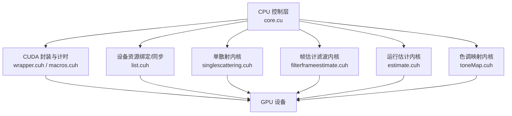
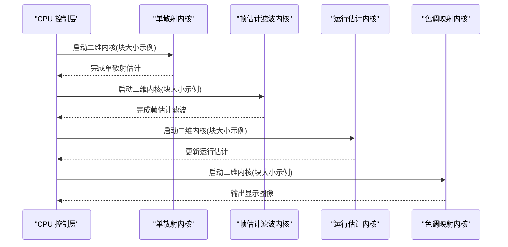
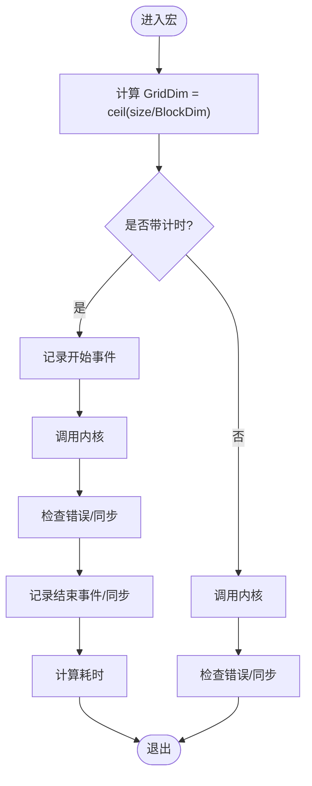
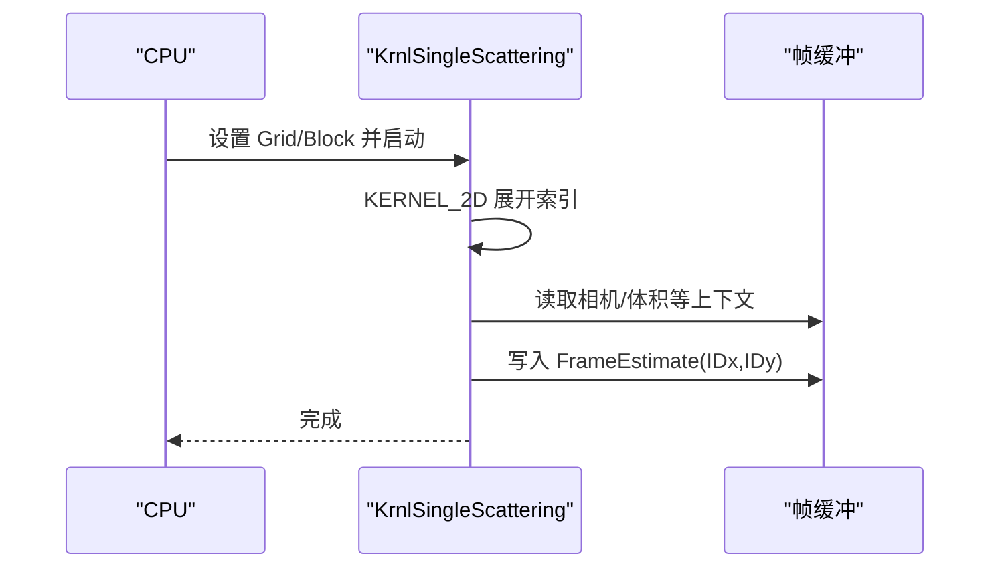
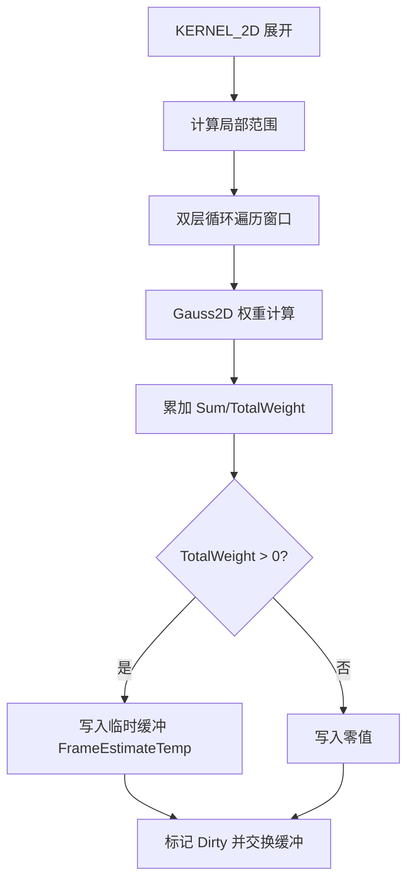
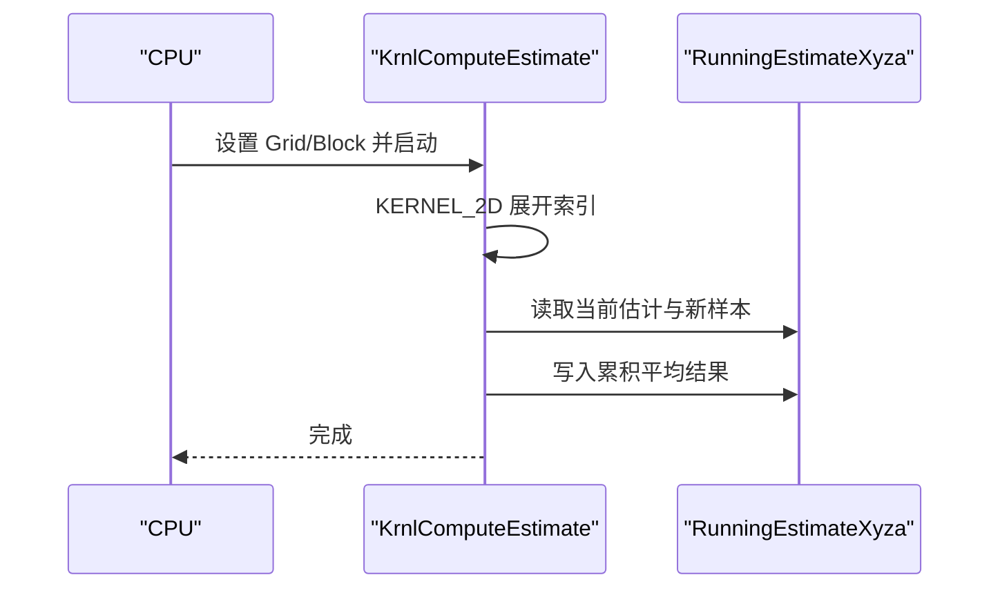
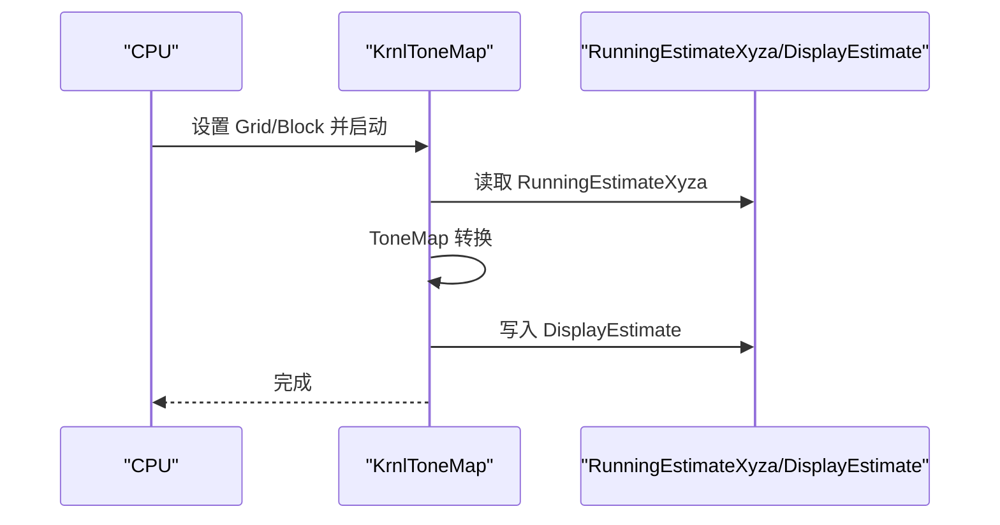
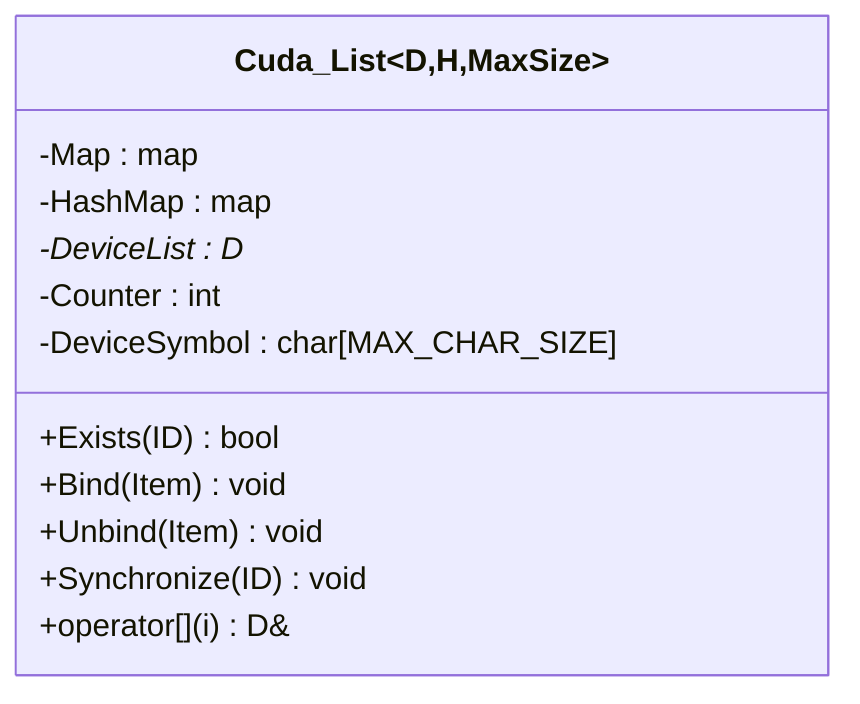
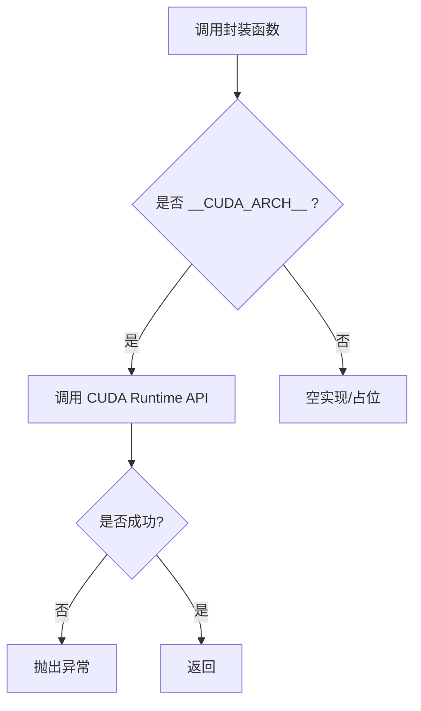
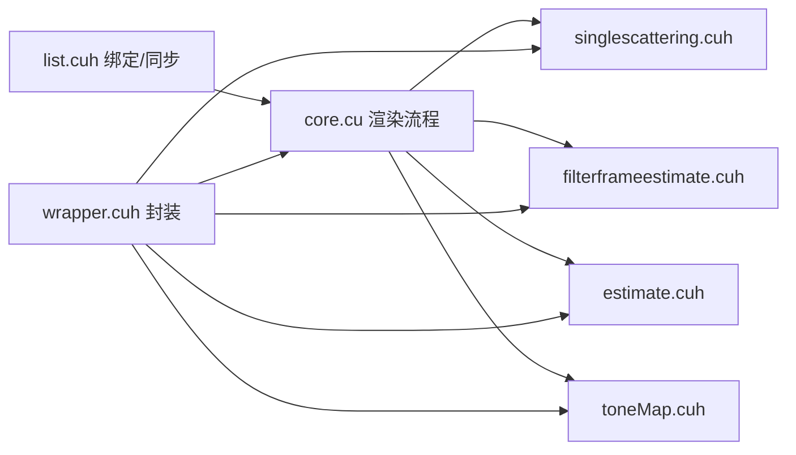

# 性能优化技巧

<cite>
**本文引用的文件**
- [core.cu](file://Source/core.cu)
- [timing.h](file://Source/timing.h)
- [macros.cuh](file://Source/macros.cuh)
- [defines.h](file://Source/defines.h)
- [device.h](file://Source/device.h)
- [singlescattering.cuh](file://Source/singlescattering.cuh)
- [filterframeestimate.cuh](file://Source/filterframeestimate.cuh)
- [estimate.cuh](file://Source/estimate.cuh)
- [toneMap.cuh](file://Source/toneMap.cuh)
- [list.cuh](file://Source/list.cuh)
- [wrapper.cuh](file://Source/wrapper.cuh)
- [utilities.h](file://Source/utilities.h)
- [geometry.h](file://Source/geometry.h)
</cite>

## 目录
1. [简介](#简介)
2. [项目结构](#项目结构)
3. [核心组件](#核心组件)
4. [架构总览](#架构总览)
5. [详细组件分析](#详细组件分析)
6. [依赖分析](#依赖分析)
7. [性能考虑](#性能考虑)
8. [故障排查指南](#故障排查指南)
9. [结论](#结论)
10. [附录](#附录)

## 简介
本文件聚焦于该体积渲染框架中的CUDA性能优化实践，系统阐述线程块大小选择、内存访问模式优化、分支发散规避、缓存与合并访问利用、并行度提升以及性能计时与分析方法，并结合代码中的宏与内核调用路径给出可操作的优化建议与实证参考。

## 项目结构
该项目采用“功能模块化 + CUDA内核”的组织方式：顶层控制流程在CPU侧编排，具体计算以二维CUDA内核为主；通过统一的宏与封装接口管理启动参数、计时与错误处理；设备资源通过列表类进行绑定与同步。

图表来源
- [core.cu:126-136](file://Source/core.cu#L126-L136)
- [singlescattering.cuh:34-38](file://Source/singlescattering.cuh#L34-L38)
- [filterframeestimate.cuh:66-74](file://Source/filterframeestimate.cuh#L66-L74)
- [estimate.cuh:34-38](file://Source/estimate.cuh#L34-L38)
- [toneMap.cuh:61-65](file://Source/toneMap.cuh#L61-L65)
- [wrapper.cuh:38-142](file://Source/wrapper.cuh#L38-L142)
- [list.cuh:108-148](file://Source/list.cuh#L108-L148)

章节来源
- [core.cu:126-136](file://Source/core.cu#L126-L136)
- [singlescattering.cuh:34-38](file://Source/singlescattering.cuh#L34-L38)
- [filterframeestimate.cuh:66-74](file://Source/filterframeestimate.cuh#L66-L74)
- [estimate.cuh:34-38](file://Source/estimate.cuh#L34-L38)
- [toneMap.cuh:61-65](file://Source/toneMap.cuh#L61-L65)
- [wrapper.cuh:38-142](file://Source/wrapper.cuh#L38-L142)
- [list.cuh:108-148](file://Source/list.cuh#L108-L148)

## 核心组件
- 统一内核启动与计时宏
  - 提供二维/三维索引展开、网格/块维度计算、带事件计时的内核启动宏，便于快速插入性能测量点。
- 内核函数族
  - 单散射、帧估计滤波、运行估计、色调映射四个主要阶段均以二维内核实现，覆盖像素级并行。
- 设备资源绑定与同步
  - 通过模板列表类在主机侧维护设备对象数组，并在需要时同步到设备符号指针，确保内核读取一致性。
- CUDA封装与错误处理
  - 对CUDA API进行统一封装，集中处理错误与同步，降低重复代码与出错概率。

章节来源
- [macros.cuh:27-101](file://Source/macros.cuh#L27-L101)
- [singlescattering.cuh:27-38](file://Source/singlescattering.cuh#L27-L38)
- [filterframeestimate.cuh:33-74](file://Source/filterframeestimate.cuh#L33-L74)
- [estimate.cuh:27-38](file://Source/estimate.cuh#L27-L38)
- [toneMap.cuh:49-65](file://Source/toneMap.cuh#L49-L65)
- [list.cuh:27-148](file://Source/list.cuh#L27-L148)
- [wrapper.cuh:38-142](file://Source/wrapper.cuh#L38-L142)

## 架构总览
渲染管线由四步组成：单散射估计、帧估计滤波、运行估计累积、色调映射输出。每一步均以二维像素并行内核执行，CPU侧负责参数准备、资源同步与结果拷贝。

图表来源
- [core.cu:126-136](file://Source/core.cu#L126-L136)
- [singlescattering.cuh:34-38](file://Source/singlescattering.cuh#L34-L38)
- [filterframeestimate.cuh:66-74](file://Source/filterframeestimate.cuh#L66-L74)
- [estimate.cuh:34-38](file://Source/estimate.cuh#L34-L38)
- [toneMap.cuh:61-65](file://Source/toneMap.cuh#L61-L65)

## 详细组件分析

### 组件A：内核启动与计时（LAUNCH_* 宏）
- 功能要点
  - 计算网格维度：基于宽度、高度、深度与块维数，向上取整得到GridDim。
  - 启动内核：支持带事件计时与不带计时两种宏，后者仅做错误检查与同步。
  - 索引展开：提供一维/二维/三维索引宏，自动处理越界返回，减少分支发散。
- 性能影响
  - 合理的块维数直接影响寄存器压力、SM吞吐与占用率。
  - 计时宏用于定位瓶颈阶段，便于迭代优化。

图表来源
- [macros.cuh:27-73](file://Source/macros.cuh#L27-L73)
- [macros.cuh:41-65](file://Source/macros.cuh#L41-L65)

章节来源
- [macros.cuh:27-101](file://Source/macros.cuh#L27-L101)

### 组件B：单散射内核（KrnlSingleScattering）
- 并行粒度：每个像素一个线程。
- 关键路径：二维索引展开后直接调用单散射函数，写入帧估计缓冲区。
- 优化关注点：内存访问局部性、共享内存复用、分支收敛。

图表来源
- [singlescattering.cuh:27-32](file://Source/singlescattering.cuh#L27-L32)
- [singlescattering.cuh:34-38](file://Source/singlescattering.cuh#L34-L38)

章节来源
- [singlescattering.cuh:27-38](file://Source/singlescattering.cuh#L27-L38)

### 组件C：帧估计滤波内核（KrnlFilterFrameEstimate）
- 并行粒度：每个像素一个线程，执行局部高斯加权求和。
- 关键路径：计算局部范围、遍历窗口累加、归一化。
- 优化关注点：窗口半径与块大小匹配，避免越界分支，尽量合并访问。

图表来源
- [filterframeestimate.cuh:33-64](file://Source/filterframeestimate.cuh#L33-L64)
- [filterframeestimate.cuh:66-74](file://Source/filterframeestimate.cuh#L66-L74)

章节来源
- [filterframeestimate.cuh:28-74](file://Source/filterframeestimate.cuh#L28-L74)

### 组件D：运行估计内核（KrnlComputeEstimate）
- 并行粒度：每个像素一个线程，更新累计平均。
- 关键路径：调用累积移动平均函数，写回 RunningEstimateXyza。
- 优化关注点：避免不必要的条件分支，保持数据类型一致。

图表来源
- [estimate.cuh:27-32](file://Source/estimate.cuh#L27-L32)
- [estimate.cuh:34-38](file://Source/estimate.cuh#L34-L38)

章节来源
- [estimate.cuh:27-38](file://Source/estimate.cuh#L27-L38)

### 组件E：色调映射内核（KrnlToneMap）
- 并行粒度：每个像素一个线程，执行曝光/伽马等映射。
- 关键路径：从XYZA转换RGB，应用曝光与饱和，写入显示缓冲。
- 优化关注点：向量化与标量运算混合时注意寄存器分配。

图表来源
- [toneMap.cuh:49-59](file://Source/toneMap.cuh#L49-L59)
- [toneMap.cuh:61-65](file://Source/toneMap.cuh#L61-L65)

章节来源
- [toneMap.cuh:30-65](file://Source/toneMap.cuh#L30-L65)

### 组件F：设备资源绑定与同步（Cuda::List）
- 功能要点：主机侧维护设备对象映射，按需同步到设备符号指针，保证内核读取一致性。
- 性能影响：同步成本与绑定对象数量相关，应避免频繁同步；批量同步优于逐项同步。

图表来源
- [list.cuh:27-173](file://Source/list.cuh#L27-L173)

章节来源
- [list.cuh:27-148](file://Source/list.cuh#L27-L148)

### 组件G：CUDA封装与错误处理（wrapper.cuh）
- 功能要点：封装内存分配/拷贝/释放、常量内存拷贝、事件与同步、错误处理。
- 性能影响：统一的同步点有助于避免竞态，但过多同步会降低吞吐；错误处理失败即抛异常，利于早期发现。

图表来源
- [wrapper.cuh:38-142](file://Source/wrapper.cuh#L38-L142)

章节来源
- [wrapper.cuh:38-142](file://Source/wrapper.cuh#L38-L142)

## 依赖分析
- 控制流依赖
  - CPU控制层依次调用四个内核，形成流水线式渲染。
- 数据依赖
  - 帧估计缓冲在滤波阶段被临时缓冲替换，随后交换回主缓冲。
  - 运行估计缓冲与显示缓冲分别承载中间与最终输出。
- 同步依赖
  - 列表同步在绑定/解绑时触发，确保内核读取最新设备数据。
  - 计时宏内部使用事件记录，避免阻塞主线程。

图表来源
- [core.cu:126-136](file://Source/core.cu#L126-L136)
- [list.cuh:108-148](file://Source/list.cuh#L108-L148)
- [wrapper.cuh:38-142](file://Source/wrapper.cuh#L38-L142)

章节来源
- [core.cu:126-136](file://Source/core.cu#L126-L136)
- [list.cuh:108-148](file://Source/list.cuh#L108-L148)
- [wrapper.cuh:38-142](file://Source/wrapper.cuh#L38-L142)

## 性能考虑

### 线程块大小选择
- 当前示例
  - 单散射/运行估计/色调映射：块维数为 16x8 或 8x8。
  - 帧估计滤波：块维数为 8x8。
- 优化建议
  - 以 warp（32）为基本调度单元，块维数尽量为 8/16/32 的组合，兼顾寄存器与共享内存预算。
  - 针对不同内核负载调整块维数：计算密集型可尝试更大块（如 16x16），内存受限时优先小块（如 8x8）。
  - 使用 occupancy calculator 评估占用率，追求接近 100% 的占用以提升吞吐。

章节来源
- [singlescattering.cuh:36](file://Source/singlescattering.cuh#L36)
- [estimate.cuh:36](file://Source/estimate.cuh#L36)
- [toneMap.cuh:63](file://Source/toneMap.cuh#L63)
- [filterframeestimate.cuh:68](file://Source/filterframeestimate.cuh#L68)

### 内存访问模式优化
- 合并访问
  - 二维像素并行天然具备行内合并访问优势；确保线程访问相邻元素，避免跨行跳跃。
- 缓冲区设计
  - 滤波阶段使用临时缓冲与交换机制，减少写-读竞争；注意尺寸与对齐。
- 常量/设备符号
  - 通过设备符号暴露只读参数，提高带宽利用率并降低指令复杂度。

章节来源
- [filterframeestimate.cuh:66-74](file://Source/filterframeestimate.cuh#L66-L74)
- [list.cuh:128-131](file://Source/list.cuh#L128-L131)

### 分支发散避免
- 索引展开宏在进入内核后先进行越界判断并提前返回，避免无效工作与分支发散。
- 在滤波内核中，窗口边界计算使用 max/min，尽量减少条件跳转。

章节来源
- [macros.cuh:75-101](file://Source/macros.cuh#L75-L101)
- [filterframeestimate.cuh:39-42](file://Source/filterframeestimate.cuh#L39-L42)

### 缓存利用策略
- L1/L2 缓存
  - 通过合并访问与局部性提升缓存命中；避免跨块/跨行的随机访问。
- 共享内存
  - 对滤波窗口内的数据可考虑分块加载至共享内存，减少全局内存往返。
- 常量缓存
  - 将只读参数放入常量内存，减少 L0/L1 压力。

章节来源
- [filterframeestimate.cuh:33-64](file://Source/filterframeestimate.cuh#L33-L64)
- [list.cuh:128-131](file://Source/list.cuh#L128-L131)

### 并行度优化技巧
- 线程粒度
  - 像素级并行已较细，进一步拆分可引入向量化（如 2x/4x）或批处理策略。
- 资源绑定
  - 批量同步设备资源，减少频繁同步带来的停顿。
- 流水线
  - 多帧间交错执行不同阶段，或使用 CUDA streams 实现阶段并行。

章节来源
- [core.cu:126-136](file://Source/core.cu#L126-L136)
- [list.cuh:108-148](file://Source/list.cuh#L108-L148)

### 性能计时与分析工具使用
- 计时宏
  - 使用事件记录内核启动与停止，计算阶段耗时；适合快速定位瓶颈。
- 错误处理
  - 统一的错误处理封装在封装层，失败即抛异常，便于调试。
- 建议
  - 在关键阶段插入计时宏，记录事件名称与耗时；结合 GPU 工具（如 nsight）进行更深入分析。

章节来源
- [macros.cuh:41-65](file://Source/macros.cuh#L41-L65)
- [wrapper.cuh:38-46](file://Source/wrapper.cuh#L38-L46)
- [timing.h:27-61](file://Source/timing.h#L27-L61)

### 具体优化案例与对比思路
- 案例1：滤波阶段
  - 现状：8x8 块，逐像素窗口遍历。
  - 可选方案A：增大块至 16x16，减少网格开销；若共享内存足够，将窗口分块加载。
  - 可选方案B：将窗口半径与Sigma参数常量化，减少寄存器占用。
  - 预期收益：在不牺牲精度的前提下提升吞吐，降低全局内存带宽压力。
- 案例2：运行估计
  - 现状：逐像素累积平均。
  - 可选方案：将 RGBA 向量化处理，减少访存次数；或在更高分辨率下采用多 pass 累积。
  - 预期收益：降低写放大，提升缓存效率。
- 案例3：色调映射
  - 现状：逐像素曝光/伽马映射。
  - 可选方案：将曝光参数常量化；在输出端进行批量拷贝。
  - 预期收益：减少分支与访存，提升整体帧率。

章节来源
- [filterframeestimate.cuh:33-74](file://Source/filterframeestimate.cuh#L33-L74)
- [estimate.cuh:27-38](file://Source/estimate.cuh#L27-L38)
- [toneMap.cuh:30-65](file://Source/toneMap.cuh#L30-L65)

## 故障排查指南
- 常见问题
  - 越界访问：确认网格/块维度与分辨率匹配；检查索引展开后的越界返回逻辑。
  - 同步问题：避免在热路径上频繁同步；必要时使用 CUDA streams。
  - 内存错误：统一使用封装层进行内存分配/拷贝/释放，失败即抛异常。
- 排查步骤
  - 在关键内核前后插入计时宏，定位耗时阶段。
  - 检查设备符号同步是否及时；确认缓冲区尺寸与对齐。
  - 使用统一错误处理接口，捕获并记录错误信息。

章节来源
- [macros.cuh:41-65](file://Source/macros.cuh#L41-L65)
- [wrapper.cuh:38-142](file://Source/wrapper.cuh#L38-L142)
- [list.cuh:108-148](file://Source/list.cuh#L108-L148)

## 结论
本项目以二维像素级内核为核心，配合统一的启动宏、计时宏与CUDA封装，形成了清晰的渲染管线与可扩展的性能分析框架。通过合理选择块维数、优化内存访问与分支发散、利用缓存与常量内存、提升并行度与减少同步，可在不改变算法的前提下显著提升性能。建议在后续迭代中引入共享内存分块、向量化与多流并行等高级技术，并持续以计时宏与专业工具进行验证。

## 附录
- 关键实现路径参考
  - 内核启动与计时：[macros.cuh:27-101](file://Source/macros.cuh#L27-L101)
  - 单散射内核：[singlescattering.cuh:27-38](file://Source/singlescattering.cuh#L27-L38)
  - 帧估计滤波内核：[filterframeestimate.cuh:33-74](file://Source/filterframeestimate.cuh#L33-L74)
  - 运行估计内核：[estimate.cuh:27-38](file://Source/estimate.cuh#L27-L38)
  - 色调映射内核：[toneMap.cuh:49-65](file://Source/toneMap.cuh#L49-L65)
  - 设备资源绑定/同步：[list.cuh:27-148](file://Source/list.cuh#L27-L148)
  - CUDA封装与错误处理：[wrapper.cuh:38-142](file://Source/wrapper.cuh#L38-L142)
  - 几何与工具函数：[geometry.h:27-141](file://Source/geometry.h#L27-L141), [utilities.h:25-70](file://Source/utilities.h#L25-L70)