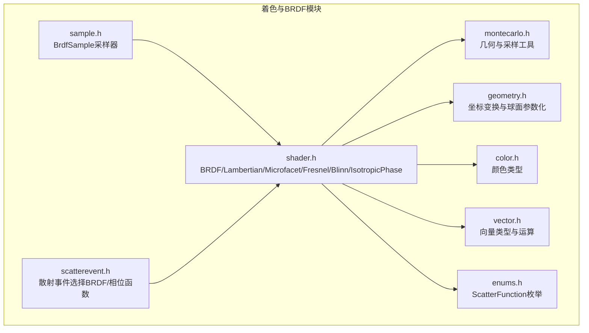
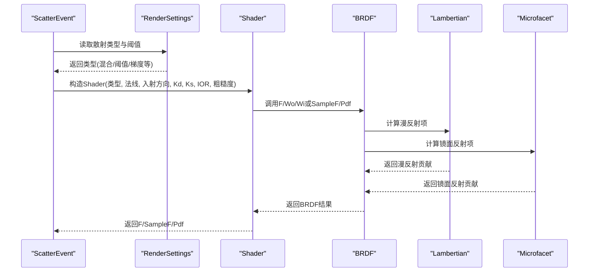
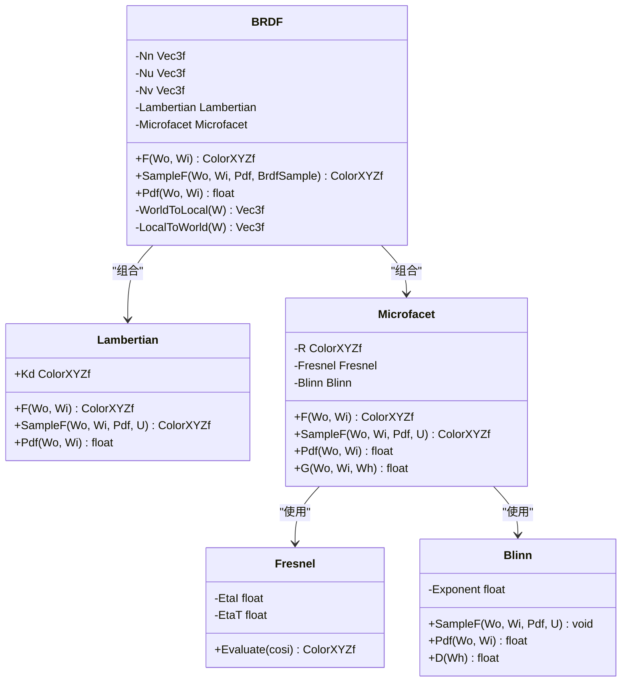
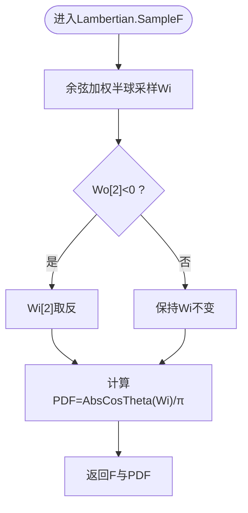
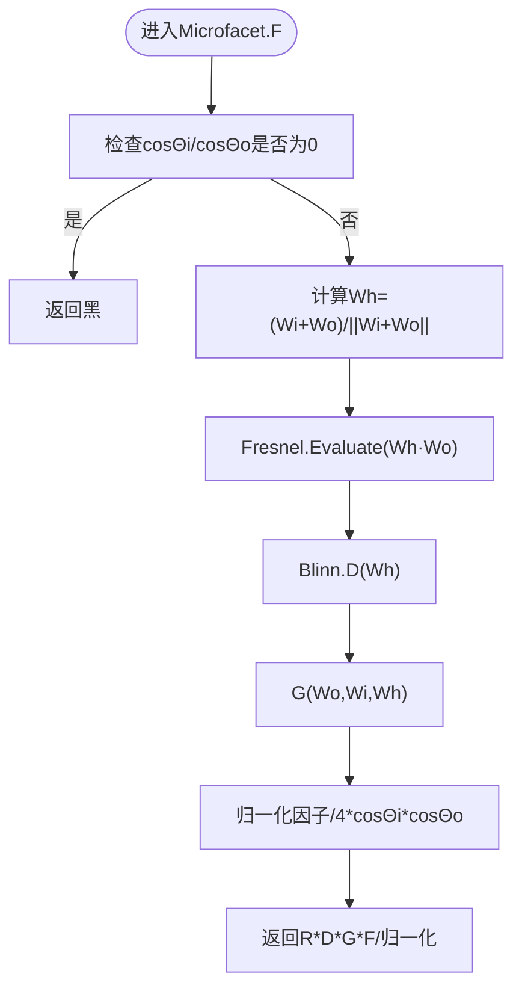
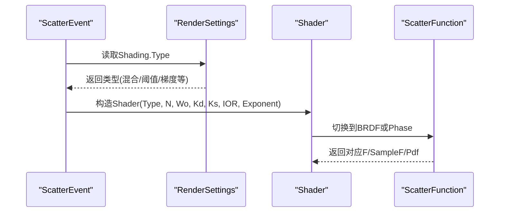
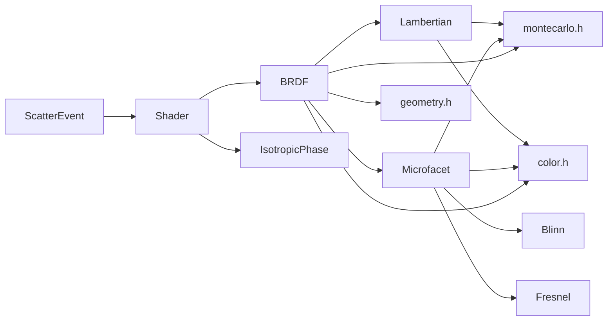

# BRDF模型

<cite>
**本文引用的文件**
- [shader.h](file://Source/shader.h)
- [montecarlo.h](file://Source/montecarlo.h)
- [geometry.h](file://Source/geometry.h)
- [color.h](file://Source/color.h)
- [vector.h](file://Source/vector.h)
- [enums.h](file://Source/enums.h)
- [sample.h](file://Source/sample.h)
- [scatterevent.h](file://Source/scatterevent.h)
</cite>

## 目录
1. [简介](#简介)
2. [项目结构](#项目结构)
3. [核心组件](#核心组件)
4. [架构总览](#架构总览)
5. [详细组件分析](#详细组件分析)
6. [依赖关系分析](#依赖关系分析)
7. [性能考量](#性能考量)
8. [故障排查指南](#故障排查指南)
9. [结论](#结论)
10. [附录](#附录)

## 简介
本文件系统性阐述该代码库中的双向反射分布函数（BRDF）实现，重点覆盖：
- Lambertian漫反射与Microfacet镜面反射的数学原理与代码映射
- BRDF类如何组合材质属性（漫反射系数Kd、镜面反射系数Ks、折射率IOR、粗糙度指数）
- 接口设计、调用关系与使用模式
- 配置选项、参数与返回值说明
- 数值稳定性、角度计算与概率密度函数（PDF）处理
- 常见问题与解决方案，兼顾初学者与高级开发者

## 项目结构
BRDF相关的核心代码集中在渲染着色模块中，主要文件如下：
- Source/shader.h：BRDF、Lambertian、Microfacet、Fresnel、Blinn等类的定义与实现
- Source/montecarlo.h：几何与蒙特卡洛采样辅助函数（角度、PDF、半球采样等）
- Source/geometry.h：坐标变换、球面参数化等几何工具
- Source/color.h、Source/vector.h：颜色与向量数据类型及运算
- Source/enums.h：散射函数类型枚举（BRDF/相位函数）
- Source/sample.h：BRDF采样器BrdfSample
- Source/scatterevent.h：散射事件中BRDF/相位函数的选择逻辑

**图表来源**
- [shader.h:1-486](file://Source/shader.h#L1-L486)
- [montecarlo.h:1-229](file://Source/montecarlo.h#L1-L229)
- [geometry.h:1-141](file://Source/geometry.h#L1-L141)
- [color.h:1-287](file://Source/color.h#L1-L287)
- [vector.h:1-582](file://Source/vector.h#L1-L582)
- [enums.h:1-111](file://Source/enums.h#L1-L111)
- [sample.h:1-279](file://Source/sample.h#L1-L279)
- [scatterevent.h:1-212](file://Source/scatterevent.h#L1-L212)

**章节来源**
- [shader.h:1-486](file://Source/shader.h#L1-L486)
- [montecarlo.h:1-229](file://Source/montecarlo.h#L1-L229)
- [geometry.h:1-141](file://Source/geometry.h#L1-L141)
- [color.h:1-287](file://Source/color.h#L1-L287)
- [vector.h:1-582](file://Source/vector.h#L1-L582)
- [enums.h:1-111](file://Source/enums.h#L1-L111)
- [sample.h:1-279](file://Source/sample.h#L1-L279)
- [scatterevent.h:1-212](file://Source/scatterevent.h#L1-L212)

## 核心组件
- BRDF：组合漫反射与微表面镜面反射，支持世界到局部坐标转换与采样
- Lambertian：理想漫反射，双向反射分布为常数，PDF为余弦加权半球PDF
- Microfacet：基于法线分布（Blinn）与菲涅尔效应的镜面反射，包含几何遮蔽校正
- Fresnel：电介质菲涅尔反射，处理入射角与折射率
- Blinn：各向同性微表面法线分布，参数为粗糙度指数
- IsotropicPhase：各向同性相位函数（用于体积散射）
- Shader：根据散射类型在BRDF与相位函数之间切换
- BrdfSample：BRDF采样器，支持组件选择与方向采样

**章节来源**
- [shader.h:29-483](file://Source/shader.h#L29-L483)

## 架构总览
BRDF的调用链路从散射事件选择开始，依据渲染设置决定使用BRDF还是相位函数，并通过Shader统一对外提供F、SampleF、Pdf接口。

**图表来源**
- [scatterevent.h:155-212](file://Source/scatterevent.h#L155-L212)
- [shader.h:415-483](file://Source/shader.h#L415-L483)
- [shader.h:316-413](file://Source/shader.h#L316-L413)
- [shader.h:29-70](file://Source/shader.h#L29-L70)
- [shader.h:198-274](file://Source/shader.h#L198-L274)

**章节来源**
- [scatterevent.h:155-212](file://Source/scatterevent.h#L155-L212)
- [shader.h:415-483](file://Source/shader.h#L415-L483)
- [shader.h:316-413](file://Source/shader.h#L316-L413)

## 详细组件分析

### BRDF类
- 组合策略：BRDF由Lambertian与Microfacet组成，二者在F、SampleF、Pdf中分别计算后叠加
- 坐标系：构造时建立局部坐标系Nu/Nv/Nn，提供WorldToLocal/LocalToWorld进行变换
- 接口：
  - F(Wo, Wi)：返回双向反射通量
  - SampleF(Wo, Wi, Pdf, BrdfSample)：按权重随机选择漫反射或镜面反射分量并返回PDF
  - Pdf(Wo, Wi)：返回联合PDF（两个分量PDF之和）

**图表来源**
- [shader.h:316-413](file://Source/shader.h#L316-L413)
- [shader.h:29-70](file://Source/shader.h#L29-L70)
- [shader.h:198-274](file://Source/shader.h#L198-L274)
- [shader.h:79-128](file://Source/shader.h#L79-L128)
- [shader.h:130-196](file://Source/shader.h#L130-L196)

**章节来源**
- [shader.h:316-413](file://Source/shader.h#L316-L413)

### Lambertian漫反射
- 数学模型：双向反射分布为常数，F = Kd / π
- 采样：余弦加权半球采样，PDF为AbsCosTheta(Wi)/π
- 边界处理：当Wi或Wo在底面半球时，确保方向一致（SameHemisphere）

**图表来源**
- [shader.h:29-70](file://Source/shader.h#L29-L70)
- [montecarlo.h:139-161](file://Source/montecarlo.h#L139-L161)

**章节来源**
- [shader.h:29-70](file://Source/shader.h#L29-L70)
- [montecarlo.h:139-161](file://Source/montecarlo.h#L139-L161)

### Microfacet镜面反射
- 数学模型：F = R * D(Wh) * G(Wo,Wi,Wh) * Fresnel(Wh·Wo) / (4*cosΘi*cosΘo)
- 分布：Blinn法线分布，PDF与半角向量Wh相关
- 几何校正：G采用Smith遮蔽-阴影校正，避免过度遮蔽
- 菲涅尔：电介质菲涅尔，考虑入射角与折射率
- 采样：通过Blinn分布采样Wh，再由反射公式得到Wi；若不在同一半球则拒绝

**图表来源**
- [shader.h:198-274](file://Source/shader.h#L198-L274)
- [shader.h:130-196](file://Source/shader.h#L130-L196)
- [shader.h:79-128](file://Source/shader.h#L79-L128)

**章节来源**
- [shader.h:198-274](file://Source/shader.h#L198-L274)
- [shader.h:130-196](file://Source/shader.h#L130-L196)
- [shader.h:79-128](file://Source/shader.h#L79-L128)

### Shader与散射事件
- Shader根据ScatterFunction类型在BRDF与IsotropicPhase之间切换
- 散射事件根据渲染设置选择BRDF或相位函数，并传入材质参数（Kd、Ks、IOR、粗糙度）

**图表来源**
- [scatterevent.h:155-212](file://Source/scatterevent.h#L155-L212)
- [shader.h:415-483](file://Source/shader.h#L415-L483)
- [enums.h:95-99](file://Source/enums.h#L95-L99)

**章节来源**
- [scatterevent.h:155-212](file://Source/scatterevent.h#L155-L212)
- [shader.h:415-483](file://Source/shader.h#L415-L483)
- [enums.h:95-99](file://Source/enums.h#L95-L99)

## 依赖关系分析
- BRDF依赖Lambertian与Microfacet；Microfacet内部依赖Fresnel与Blinn；Fresnel依赖Snell定律与FrDiel
- 所有几何与采样函数来自montecarlo.h与geometry.h；颜色与向量来自color.h与vector.h
- 散射事件选择逻辑位于scatterevent.h，最终调用shader.h中的Shader

**图表来源**
- [shader.h:29-483](file://Source/shader.h#L29-L483)
- [montecarlo.h:1-229](file://Source/montecarlo.h#L1-L229)
- [geometry.h:1-141](file://Source/geometry.h#L1-L141)
- [color.h:1-287](file://Source/color.h#L1-L287)
- [scatterevent.h:1-212](file://Source/scatterevent.h#L1-L212)

**章节来源**
- [shader.h:29-483](file://Source/shader.h#L29-L483)
- [montecarlo.h:1-229](file://Source/montecarlo.h#L1-L229)
- [geometry.h:1-141](file://Source/geometry.h#L1-L141)
- [color.h:1-287](file://Source/color.h#L1-L287)
- [scatterevent.h:1-212](file://Source/scatterevent.h#L1-L212)

## 性能考量
- 微表面模型涉及昂贵的几何遮蔽校正与法线分布计算，建议：
  - 在高光区域优先使用镜面反射，漫反射作为补充
  - 合理设置粗糙度指数，避免过高的D导致数值不稳定
  - 使用快速三角函数近似与分支预测友好的条件判断
- 采样策略：
  - Blinn采样通过幂次逆变换生成Wh，随后反射得到Wi，注意Wh与Wo同侧判断
  - 漫反射采样使用余弦加权半球，避免低效的拒绝采样

[本节为通用性能指导，不直接分析具体文件]

## 故障排查指南
- 数值稳定性
  - Wh为零或NaN：在计算Wh前检查Wi+Wo是否为零向量，避免除零
  - 折射角越界：Snell定律中sin²t需小于等于1，否则发生全内反射
  - PDF为0：当Wi与Wo不在同一半球时，镜面PDF应为0
- 角度与半球一致性
  - SameHemisphere判断：确保Wi与Wo在同一半球，否则拒绝镜面反射
  - 入射方向翻转：当Wo[2]<0时，漫反射采样需要相应调整Wi的朝向
- 概率密度函数
  - BRDF中两个分量的PDF相加，SampleF中也应累加对应的PDF
  - Blinn PDF在Wh与Wo夹角为钝角时置零，避免负概率

**章节来源**
- [shader.h:212-249](file://Source/shader.h#L212-L249)
- [shader.h:46-61](file://Source/shader.h#L46-L61)
- [montecarlo.h:57-70](file://Source/montecarlo.h#L57-L70)

## 结论
该BRDF实现以模块化方式组织，Lambertian与Microfacet分别覆盖漫反射与镜面反射，BRDF通过坐标变换与分量叠加实现统一接口。配合散射事件选择逻辑，可灵活切换BRDF与相位函数，满足体积渲染与物体表面渲染的多样化需求。实践中需关注数值稳定性、角度一致性与PDF正确性，以获得高质量且稳定的渲染结果。

[本节为总结性内容，不直接分析具体文件]

## 附录

### 接口与参数速查
- BRDF
  - 输入：法线N、入射方向Wo、漫反射系数Kd、镜面反射系数Ks、折射率IOR、粗糙度指数Exponent
  - 输出：F(Wo, Wi)、SampleF(Wo, Wi, Pdf, BrdfSample)、Pdf(Wo, Wi)
- Lambertian
  - 输入：Kd
  - 输出：F、SampleF、Pdf
- Microfacet
  - 输入：R、IOR、Exponent
  - 输出：F、SampleF、Pdf
- Shader
  - 输入：类型、N、Wo、Kd、Ks、IOR、Exponent
  - 输出：F、SampleF、Pdf
- BrdfSample
  - 输入：随机数生成器
  - 输出：Component（0~0.5漫反射，0.5~1镜面）、Dir（方向采样）

**章节来源**
- [shader.h:316-483](file://Source/shader.h#L316-L483)
- [sample.h:114-156](file://Source/sample.h#L114-L156)