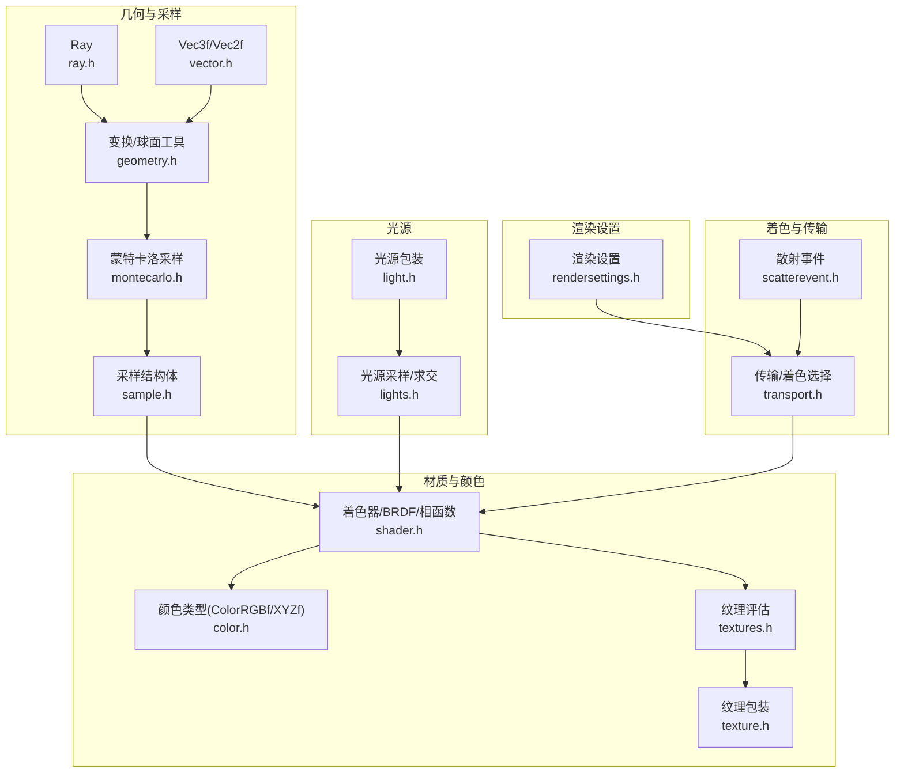
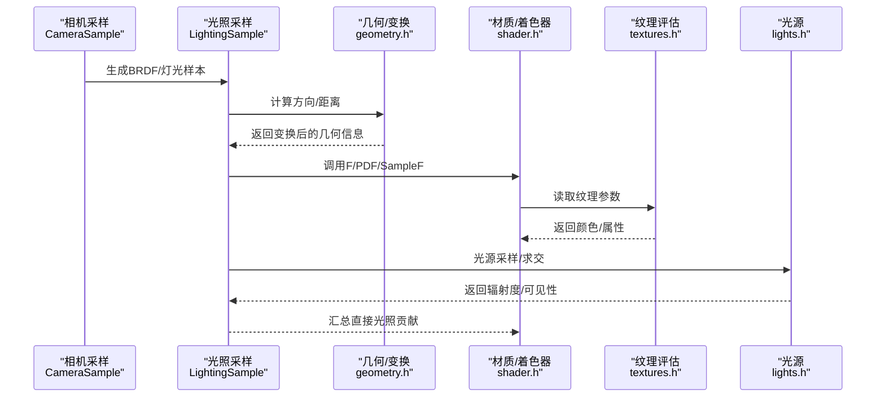
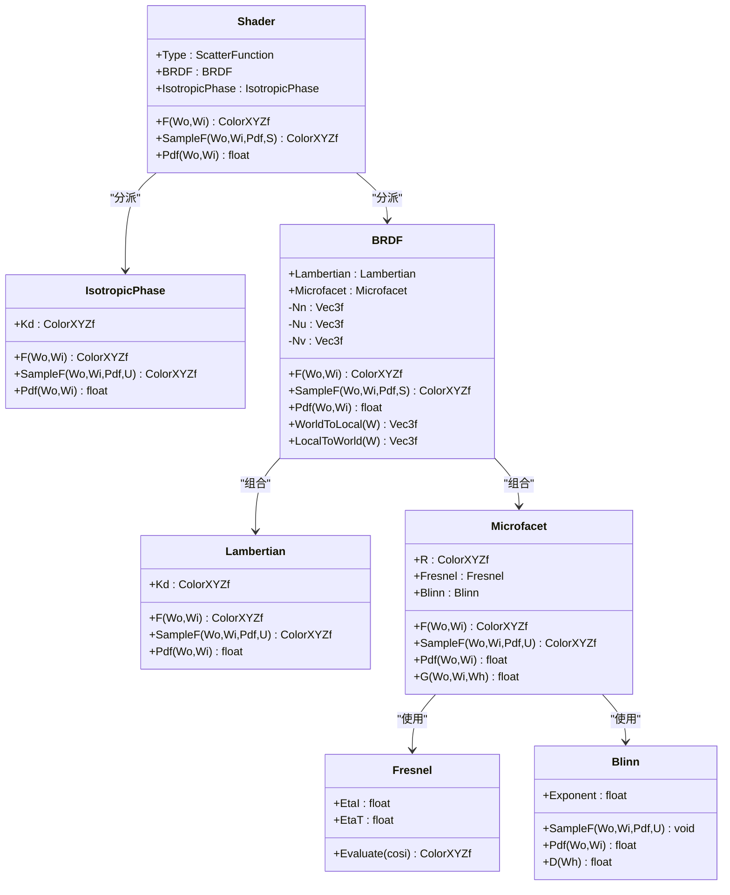
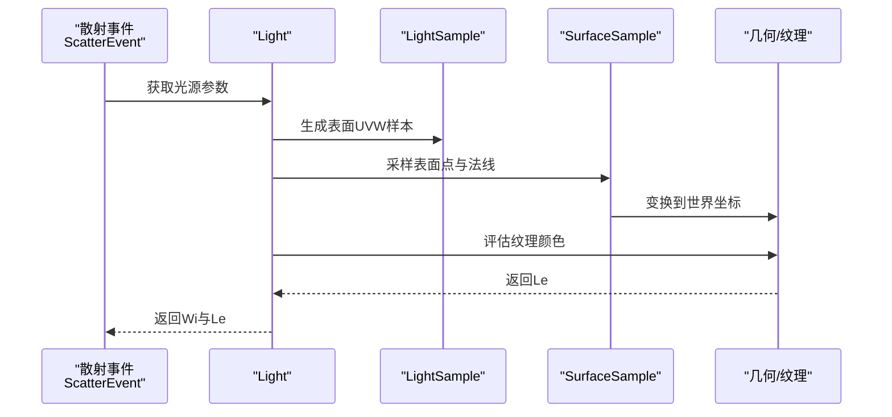
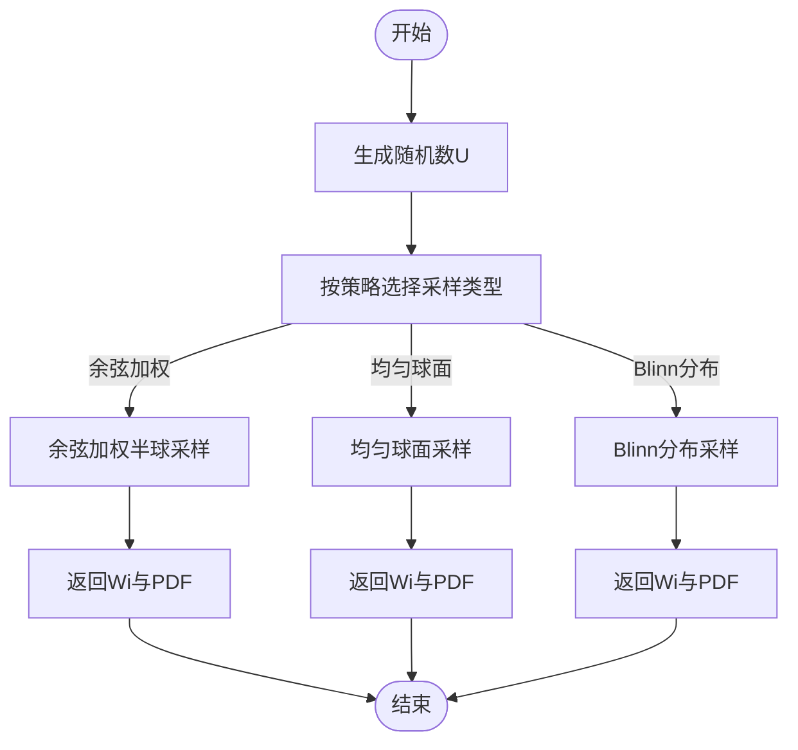
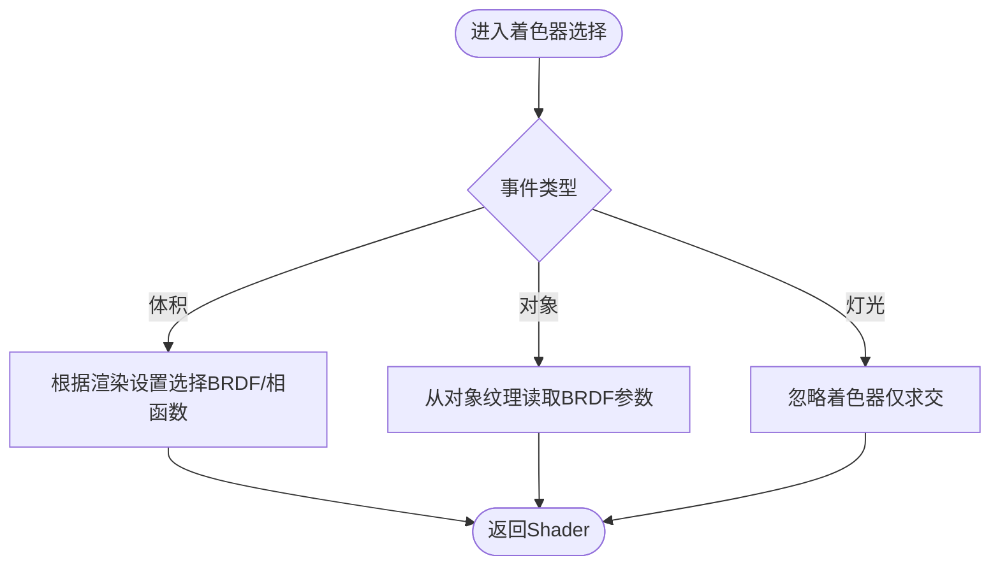
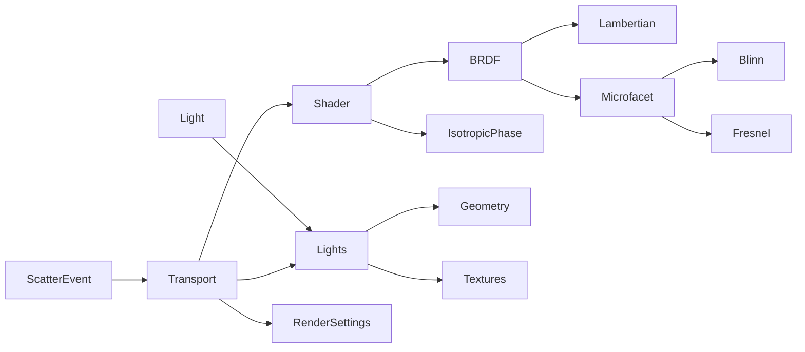

# 光照和着色系统

<cite>
**本文引用的文件**
- [shader.h](file://Source/shader.h)
- [light.h](file://Source/light.h)
- [lights.h](file://Source/lights.h)
- [color.h](file://Source/color.h)
- [texture.h](file://Source/texture.h)
- [textures.h](file://Source/textures.h)
- [enums.h](file://Source/enums.h)
- [geometry.h](file://Source/geometry.h)
- [montecarlo.h](file://Source/montecarlo.h)
- [sample.h](file://Source/sample.h)
- [vector.h](file://Source/vector.h)
- [ray.h](file://Source/ray.h)
- [matrix.h](file://Source/matrix.h)
- [scatterevent.h](file://Source/scatterevent.h)
- [transport.h](file://Source/transport.h)
- [rendersettings.h](file://Source/rendersettings.h)
</cite>

## 目录
1. [简介](#简介)
2. [项目结构](#项目结构)
3. [核心组件](#核心组件)
4. [架构总览](#架构总览)
5. [详细组件分析](#详细组件分析)
6. [依赖关系分析](#依赖关系分析)
7. [性能考量](#性能考量)
8. [故障排查指南](#故障排查指南)
9. [结论](#结论)
10. [附录](#附录)

## 简介
本文件系统性阐述光照与着色系统的实现细节、调用关系、接口定义、领域模型与使用模式。内容覆盖从几何采样、材质模型（朗伯+微表面）、菲涅尔反射、相函数到光源采样与着色器选择策略，并结合渲染设置与体积/对象着色路径进行说明。文档以循序渐进的方式组织，既适合初学者理解基础概念，也为有经验的开发者提供深入的技术细节与优化建议。

## 项目结构
该系统围绕“几何/采样/材质/光源/颜色”五大模块构建，采用头文件库形式组织，便于在CPU/GPU混合计算中复用。关键目录与文件职责概览：
- 几何与采样：ray.h、vector.h、geometry.h、montecarlo.h、sample.h
- 材质与着色：shader.h、color.h、textures.h、texture.h
- 光源：light.h、lights.h
- 渲染设置：rendersettings.h
- 着色器选择与传输：scatterevent.h、transport.h

**图表来源**
- [ray.h:26-56](file://Source/ray.h#L26-L56)
- [vector.h:450-495](file://Source/vector.h#L450-L495)
- [geometry.h:30-85](file://Source/geometry.h#L30-L85)
- [montecarlo.h:27-227](file://Source/montecarlo.h#L27-L227)
- [sample.h:57-197](file://Source/sample.h#L57-L197)
- [color.h:59-142](file://Source/color.h#L59-L142)
- [textures.h:64-111](file://Source/textures.h#L64-L111)
- [texture.h:26-45](file://Source/texture.h#L26-L45)
- [shader.h:29-483](file://Source/shader.h#L29-L483)
- [light.h:26-46](file://Source/light.h#L26-L46)
- [lights.h:28-133](file://Source/lights.h#L28-L133)
- [rendersettings.h:66-131](file://Source/rendersettings.h#L66-L131)
- [scatterevent.h:82-212](file://Source/scatterevent.h#L82-L212)
- [transport.h:139-158](file://Source/transport.h#L139-L158)

**章节来源**
- [ray.h:26-56](file://Source/ray.h#L26-L56)
- [vector.h:450-495](file://Source/vector.h#L450-L495)
- [geometry.h:30-85](file://Source/geometry.h#L30-L85)
- [montecarlo.h:27-227](file://Source/montecarlo.h#L27-L227)
- [sample.h:57-197](file://Source/sample.h#L57-L197)
- [color.h:59-142](file://Source/color.h#L59-L142)
- [textures.h:64-111](file://Source/textures.h#L64-L111)
- [texture.h:26-45](file://Source/texture.h#L26-L45)
- [shader.h:29-483](file://Source/shader.h#L29-L483)
- [light.h:26-46](file://Source/light.h#L26-L46)
- [lights.h:28-133](file://Source/lights.h#L28-L133)
- [rendersettings.h:66-131](file://Source/rendersettings.h#L66-L131)
- [scatterevent.h:82-212](file://Source/scatterevent.h#L82-L212)
- [transport.h:139-158](file://Source/transport.h#L139-L158)

## 核心组件
- 材质与着色器
  - Lambertian：朗伯漫反射项，提供 F/PDF/SampleF。
  - Blinn：微表面分布（各向同性），提供采样与PDF。
  - Fresnel：电介质菲涅尔反射，基于Snell定律与折射率。
  - Microfacet：微表面BRDF组合，含遮挡几何因子G。
  - IsotropicPhase：各向同性相函数（用于体积散射）。
  - BRDF：组合朗伯与微表面，支持局部-世界坐标转换。
  - Shader：统一对外接口，根据类型分派至BRDF或相函数。
- 光源
  - Light：ErLight包装，提供更新与赋值。
  - lights.h：按形状类型采样表面、光线求交、可见性判断。
- 颜色与纹理
  - ColorRGBf/ColorXYZf/ColorXYZAf：多格式颜色类型与转换。
  - textures.h：纹理评估（程序纹理/位图），支持重复、偏移、翻转与输出级别。
- 几何与采样
  - Ray/Vec3f/Vec2f：基础几何与向量运算。
  - geometry.h：点/向量/射线变换、球面参数化。
  - montecarlo.h：半球/球面采样、余弦加权半球、Blinn分布采样等。
  - sample.h：SurfaceSample/LightSample/BrdfSample/LightingSample/CameraSample/MetroSample等采样结构体。

**章节来源**
- [shader.h:29-483](file://Source/shader.h#L29-L483)
- [light.h:26-46](file://Source/light.h#L26-L46)
- [lights.h:28-133](file://Source/lights.h#L28-L133)
- [color.h:59-286](file://Source/color.h#L59-L286)
- [textures.h:26-111](file://Source/textures.h#L26-L111)
- [geometry.h:30-85](file://Source/geometry.h#L30-L85)
- [montecarlo.h:27-227](file://Source/montecarlo.h#L27-L227)
- [sample.h:57-279](file://Source/sample.h#L57-L279)

## 架构总览
系统通过“采样-求交-着色”的主循环工作。采样器生成随机数，几何模块执行射线变换与求交，材质模块根据类型选择BRDF或相函数，光源模块提供入射光贡献，最终由传输层整合得到像素颜色。

**图表来源**
- [sample.h:158-197](file://Source/sample.h#L158-L197)
- [geometry.h:30-85](file://Source/geometry.h#L30-L85)
- [shader.h:415-483](file://Source/shader.h#L415-L483)
- [textures.h:64-111](file://Source/textures.h#L64-L111)
- [lights.h:28-133](file://Source/lights.h#L28-L133)

## 详细组件分析

### 材质与着色器（Shader/BRDF/微表面）
- 关键类与方法
  - Lambertian：F、SampleF、Pdf；用于漫反射。
  - Blinn：SampleF、Pdf、D；用于微表面法线分布。
  - Fresnel：Evaluate；电介质菲涅尔反射。
  - Microfacet：F、SampleF、Pdf、G；组合菲涅尔与分布。
  - IsotropicPhase：F、SampleF、Pdf；体积散射相函数。
  - BRDF：组合Lambertian与Microfacet，提供WorldToLocal/LocalToWorld。
  - Shader：根据类型分派至BRDF或IsotropicPhase。

**图表来源**
- [shader.h:29-483](file://Source/shader.h#L29-L483)

**章节来源**
- [shader.h:29-483](file://Source/shader.h#L29-L483)

### 光源与采样（Light/Lights）
- Light：ErLight包装，提供赋值与更新。
- lights.h：
  - SampleLightSurface：按形状类型采样表面点与UV。
  - SampleLight：计算Wi与出射Radiance，考虑单侧与单位制。
  - IntersectLight/IntersectLights：射线与光源求交，返回最近交点。
  - IntersectsLight：快速可见性检测。

**图表来源**
- [lights.h:28-133](file://Source/lights.h#L28-L133)
- [geometry.h:30-85](file://Source/geometry.h#L30-L85)
- [textures.h:64-111](file://Source/textures.h#L64-L111)

**章节来源**
- [light.h:26-46](file://Source/light.h#L26-L46)
- [lights.h:28-133](file://Source/lights.h#L28-L133)

### 几何与采样（Ray/Vec/Transform/采样函数）
- Ray：射线起点、方向、参数范围。
- Vec3f/Vec2f：向量运算、点积、叉积、归一化、插值。
- geometry.h：点/向量/射线变换、球面参数化、插值。
- montecarlo.h：半球/球面/余弦加权半球采样、Blinn分布采样、PDF计算。
- sample.h：各类采样结构体（表面、光源、BRDF、灯光、相机、马尔可夫）。

**图表来源**
- [montecarlo.h:72-221](file://Source/montecarlo.h#L72-L221)
- [sample.h:114-156](file://Source/sample.h#L114-L156)

**章节来源**
- [ray.h:26-56](file://Source/ray.h#L26-L56)
- [vector.h:450-495](file://Source/vector.h#L450-L495)
- [geometry.h:30-85](file://Source/geometry.h#L30-L85)
- [montecarlo.h:72-221](file://Source/montecarlo.h#L72-L221)
- [sample.h:114-156](file://Source/sample.h#L114-L156)

### 着色器选择与传输（ScatterEvent/Transport）
- ScatterEvent：封装类型、位置、法线、入射方向、出射Radiance、UV等。
- transport.h：根据类型（体积/对象/灯光）选择着色器参数（漫反射、镜面、光泽度、IOR），并估计直接光照贡献。
- scatterevent.h：着色器选择逻辑（如基于梯度幅值阈值切换BRDF/相函数）。

**图表来源**
- [scatterevent.h:82-212](file://Source/scatterevent.h#L82-L212)
- [transport.h:139-158](file://Source/transport.h#L139-L158)

**章节来源**
- [scatterevent.h:82-212](file://Source/scatterevent.h#L82-L212)
- [transport.h:139-158](file://Source/transport.h#L139-L158)

## 依赖关系分析
- 组件耦合
  - Shader依赖BRDF/IsotropicPhase；BRDF组合Lambertian与Microfacet；Microfacet依赖Fresnel与Blinn。
  - Lights依赖几何与纹理模块；Light为ErLight包装。
  - Transport/ScatterEvent依赖渲染设置与全局资源（纹理/对象/光线列表）。
- 外部依赖
  - 数学运算依赖vector.h、geometry.h、montecarlo.h。
  - 颜色与纹理依赖color.h、textures.h、texture.h。
- 潜在环依赖
  - 当前文件间未见明显环形包含；若后续扩展需避免头文件循环包含。

**图表来源**
- [shader.h:29-483](file://Source/shader.h#L29-L483)
- [lights.h:28-133](file://Source/lights.h#L28-L133)
- [light.h:26-46](file://Source/light.h#L26-L46)
- [transport.h:139-158](file://Source/transport.h#L139-L158)
- [scatterevent.h:82-212](file://Source/scatterevent.h#L82-L212)
- [rendersettings.h:66-131](file://Source/rendersettings.h#L66-L131)

**章节来源**
- [shader.h:29-483](file://Source/shader.h#L29-L483)
- [lights.h:28-133](file://Source/lights.h#L28-L133)
- [light.h:26-46](file://Source/light.h#L26-L46)
- [transport.h:139-158](file://Source/transport.h#L139-L158)
- [scatterevent.h:82-212](file://Source/scatterevent.h#L82-L212)
- [rendersettings.h:66-131](file://Source/rendersettings.h#L66-L131)

## 性能考量
- 采样策略
  - 使用余弦加权半球采样减少方差，提升漫反射收敛速度。
  - Blinn分布采样与PDF平衡，避免不必要重投样。
- 纹理访问
  - 程序纹理与位图评估需注意缓存与边界处理（重复、偏移、翻转）。
- 光源求交
  - 对大量光源可采用空间划分或快速求交预筛选，降低IntersectLights开销。
- 渲染设置
  - 密度缩放、梯度阈值与因子影响体积渲染质量与性能，应按场景动态调整。

[本节为通用指导，无需具体文件引用]

## 故障排查指南
- 着色结果过暗/过亮
  - 检查颜色空间转换是否正确（RGB↔XYZ）。
  - 核对纹理输出级别与单位制（功率/勒克斯/强度）。
- 菲涅尔反射异常
  - 确认折射率输入与入射角Clamp范围。
- 采样噪声大
  - 增大采样步长因子或使用更优的策略（如重要性采样）。
- 光源不可见
  - 检查OneSided与Dot符号，确保法线方向一致。
- 梯度阈值导致BRDF/相函数切换异常
  - 调整梯度阈值与因子，或切换为固定模式。

**章节来源**
- [color.h:144-286](file://Source/color.h#L144-L286)
- [textures.h:64-111](file://Source/textures.h#L64-L111)
- [montecarlo.h:72-221](file://Source/montecarlo.h#L72-L221)
- [lights.h:28-133](file://Source/lights.h#L28-L133)
- [rendersettings.h:66-131](file://Source/rendersettings.h#L66-L131)

## 结论
该光照与着色系统以模块化设计为核心，通过统一的着色器接口屏蔽材质差异，结合几何采样与光源求交实现高效的直接光照估计。系统在BRDF与相函数之间灵活切换，并提供丰富的渲染设置以适配不同场景需求。建议在实际工程中关注采样策略、纹理访问与求交性能，并依据场景特性调整渲染参数以获得最佳画质与效率平衡。

[本节为总结，无需具体文件引用]

## 附录

### 关键枚举与配置
- 散射函数类型：Brdf、PhaseFunction
- 着色模式：BrdfOnly、PhaseFunctionOnly、Hybrid、Modulation、Threshold、GradientMagnitude
- 形状类型：Plane、Disk、Ring、Box、Sphere、Cylinder、Cone
- 发光单位：Power、Lux、Intensity

**章节来源**
- [enums.h:95-107](file://Source/enums.h#L95-L107)
- [rendersettings.h:66-106](file://Source/rendersettings.h#L66-L106)

### 接口与返回值摘要
- Shader::F/Wi/Pdf：返回双向反射分布函数或相函数值，以及PDF。
- Lambertian/Blinn/Fresnel/Microfacet：分别提供F/PDF/SampleF。
- textures.h::EvaluateTexture：返回纹理颜色，受重复、偏移、翻转与输出级别影响。
- lights.h::SampleLight/IntersectLight：返回Wi与Le，或最近交点信息。

**章节来源**
- [shader.h:415-483](file://Source/shader.h#L415-L483)
- [textures.h:64-111](file://Source/textures.h#L64-L111)
- [lights.h:44-133](file://Source/lights.h#L44-L133)