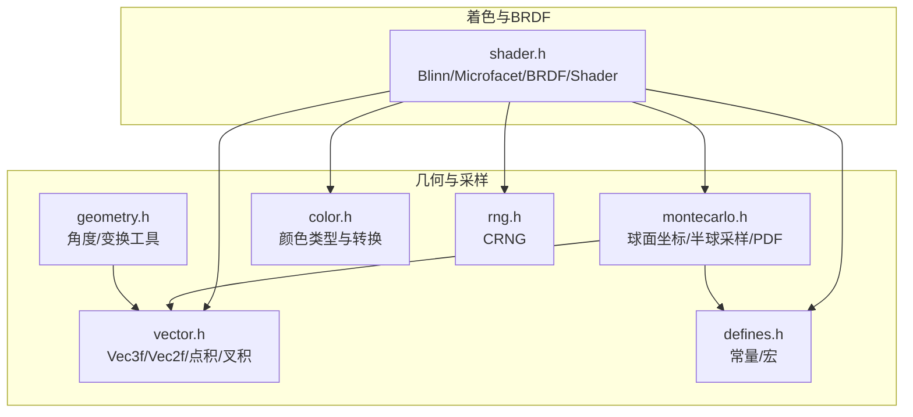
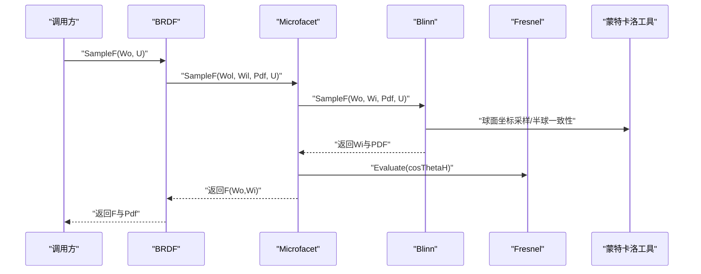
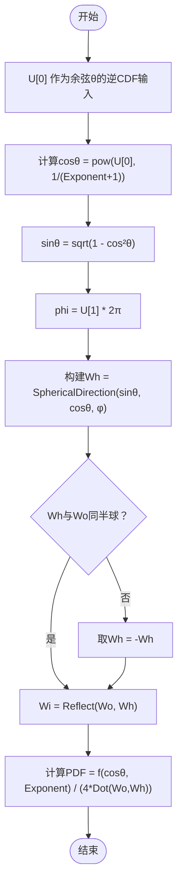
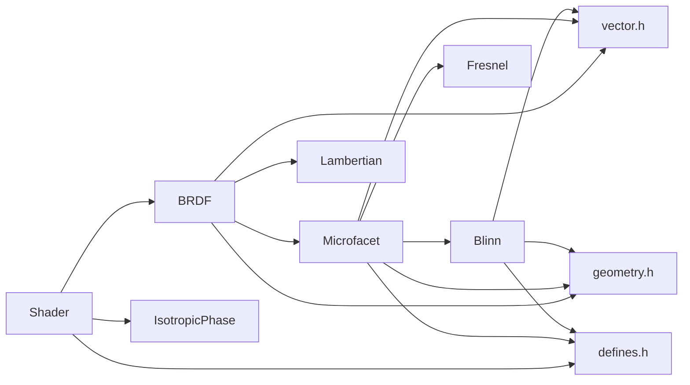

# 微表面分布

<cite>
**本文引用的文件**
- [shader.h](file://Source/shader.h)
- [montecarlo.h](file://Source/montecarlo.h)
- [vector.h](file://Source/vector.h)
- [geometry.h](file://Source/geometry.h)
- [color.h](file://Source/color.h)
- [defines.h](file://Source/defines.h)
- [rng.h](file://Source/rng.h)
</cite>

## 目录
1. [简介](#简介)
2. [项目结构](#项目结构)
3. [核心组件](#核心组件)
4. [架构总览](#架构总览)
5. [详细组件分析](#详细组件分析)
6. [依赖关系分析](#依赖关系分析)
7. [性能考量](#性能考量)
8. [故障排查指南](#故障排查指南)
9. [结论](#结论)
10. [附录](#附录)

## 简介
本文件围绕微表面分布（特别是Blinn-Phong微表面分布）在光线追踪渲染器中的实现与使用进行系统性说明。重点涵盖：
- Blinn-Phong分布函数的数学定义、概率密度（PDF）与采样方法
- 几何遮蔽函数G的物理意义与计算
- 接口设计与调用关系（从BRDF到着色器）
- 使用模式与参数（粗糙度指数对表面反射的影响）
- 常见问题与解决方案（归一化、采样偏移、数值稳定性）

该实现位于渲染器的着色模块中，采用CUDA友好的设备函数与向量运算，支持在GPU上高效执行蒙特卡洛采样与BRDF评估。

## 项目结构
与微表面分布相关的代码集中在着色与几何辅助模块中：
- 着色与BRDF：[shader.h](file://Source/shader.h)
- 蒙特卡洛与球面坐标工具：[montecarlo.h](file://Source/montecarlo.h)
- 向量与颜色类型：[vector.h](file://Source/vector.h)、[color.h](file://Source/color.h)
- 常量与宏：[defines.h](file://Source/defines.h)
- 随机数生成：[rng.h](file://Source/rng.h)

图表来源
- [shader.h](file://Source/shader.h)
- [montecarlo.h](file://Source/montecarlo.h)
- [vector.h](file://Source/vector.h)
- [color.h](file://Source/color.h)
- [defines.h](file://Source/defines.h)
- [rng.h](file://Source/rng.h)

章节来源
- [shader.h](file://Source/shader.h)
- [montecarlo.h](file://Source/montecarlo.h)
- [vector.h](file://Source/vector.h)
- [color.h](file://Source/color.h)
- [defines.h](file://Source/defines.h)
- [rng.h](file://Source/rng.h)

## 核心组件
- Blinn类：实现Blinn-Phong微表面分布的概率密度与采样，提供分布函数D与PDF计算。
- Microfacet类：封装镜面反射BRDF，组合Fresnel与Blinn分布，并计算几何遮蔽函数G。
- BRDF类：将漫反射与微表面镜面项组合，支持局部坐标系变换与混合采样。
- Shader类：对外统一接口，根据散射函数类型选择BRDF或相位函数。

章节来源
- [shader.h](file://Source/shader.h)

## 架构总览
下图展示了从入射方向到出射方向的BRDF评估与采样流程，以及微表面分布与几何遮蔽函数的参与位置。

图表来源
- [shader.h](file://Source/shader.h)
- [montecarlo.h](file://Source/montecarlo.h)

章节来源
- [shader.h](file://Source/shader.h)

## 详细组件分析

### Blinn-Phong微表面分布（Blinn类）
- 数学公式与分布函数D
  - 分布函数D(Wh)与余弦幂形式相关，指数由Exponent控制，用于描述微平面法线分布的集中程度。
  - 归一化常数与几何因子共同决定分布的形状。
- 概率密度（PDF）
  - PDF(Wo, Wi)基于半角向量Wh = Normalize(Wo + Wi)，通过指数分布的概率密度推导得到。
  - 当Wo与Wh夹角非锐时，PDF置零以保证能量守恒与物理正确性。
- 采样方法
  - 通过对余弦θ的逆CDF求解，结合均匀随机数U[0]与U[1]生成半角向量Wh，再通过镜面反射关系Wi = Reflect(Wo, Wh)得到出射方向。
  - 若采样后的Wh不在同一半球，则取反向Wh以保持半球一致性。
- 关键实现路径
  - 分布函数D：[D](file://Source/shader.h)
  - PDF计算：[Pdf](file://Source/shader.h)
  - 采样流程：[SampleF](file://Source/shader.h)

图表来源
- [shader.h](file://Source/shader.h)
- [montecarlo.h](file://Source/montecarlo.h)

章节来源
- [shader.h](file://Source/shader.h)
- [montecarlo.h](file://Source/montecarlo.h)

### 几何遮蔽函数G（Microfacet类）
- 物理意义
  - G(Wo, Wi, Wh)表示由于微表面几何遮挡导致的可见性修正，避免过度增亮。
- 计算方法
  - 使用两个投影项的最小值，分别对应从入射/出射方向观察到的半角法线可见性。
  - 公式中涉及N·Wh、N·Wo、N·Wi与Wo·Wh等点积，均取绝对值以确保半球一致性。
- 实现要点
  - 当Wo与Wh夹角为钝角时，PDF与G均为零，避免不合理的贡献。
  - Wh由Wi与Wo的归一化和得到，随后进行单位化与角度计算。

章节来源
- [shader.h](file://Source/shader.h)

### 微表面BRDF（Microfacet类）
- 组成
  - 结合漫反射（Lambertian）与镜面（Microfacet）两部分，形成混合BRDF。
  - 镜面项包含：反射率R、菲涅尔项F、分布函数D与几何遮蔽G。
- 采样与PDF
  - SampleF委托给Blinn进行半角向量采样，随后检查半球一致性，若不一致则返回零响应。
  - Pdf直接复用Blinn的PDF，但仅在同半球条件下有效。
- 使用模式
  - 在BRDF中，根据权重混合漫反射与微表面项，实现粗糙度可调的镜面反射。

章节来源
- [shader.h](file://Source/shader.h)

### BRDF与Shader接口（BRDF/Shader类）
- BRDF
  - 提供WorldToLocal/LocalToWorld，将世界坐标转换到局部坐标系，便于在切空间中进行BRDF评估。
  - SampleF按组件权重混合漫反射与微表面项的采样结果，并累加PDF。
- Shader
  - 对外统一接口，根据散射函数类型选择BRDF或相位函数，简化调用端逻辑。

章节来源
- [shader.h](file://Source/shader.h)

## 依赖关系分析
- Blinn/Microfacet依赖于：
  - 向量运算：点积、叉积、长度、归一化
  - 角度与球面坐标：SphericalDirection、AbsCosTheta、AbsDot
  - 常量与宏：PI、INV_PI、INV_TWO_PI等
  - 随机数：CRNG提供二维随机向量U用于采样
- 几何遮蔽函数G依赖于半角向量Wh与入/出射方向的几何关系，确保半球一致性。

图表来源
- [shader.h](file://Source/shader.h)
- [vector.h](file://Source/vector.h)
- [geometry.h](file://Source/geometry.h)
- [defines.h](file://Source/defines.h)

章节来源
- [shader.h](file://Source/shader.h)
- [vector.h](file://Source/vector.h)
- [geometry.h](file://Source/geometry.h)
- [defines.h](file://Source/defines.h)

## 性能考量
- GPU友好设计
  - 所有函数标记为设备函数，适合在CUDA核函数中调用。
  - 向量化与内联策略减少函数调用开销。
- 采样效率
  - Blinn采样通过解析逆CDF避免昂贵的拒绝采样。
  - 半角向量Wh的构造与镜面反射计算均为标量与向量基本运算。
- 数值稳定性
  - 使用Clamp与max(0.f, ...)确保三角函数平方根与除法的安全性。
  - Wh归一化前的零向量检测避免无效反射。

章节来源
- [shader.h](file://Source/shader.h)
- [montecarlo.h](file://Source/montecarlo.h)

## 故障排查指南
- 分布函数未归一化
  - 现象：镜面反射过亮或能量不守恒
  - 处理：确认D与PDF的归一化常数与几何因子一致；检查Exponent取正值且合理范围
  - 参考：[D](file://Source/shader.h)、[Pdf](file://Source/shader.h)
- 采样偏移与半球一致性
  - 现象：采样后Wi与Wo跨半球导致G为零或Fresnel错误
  - 处理：确保Wh与Wo同半球；若不同半球，取反Wh后再计算Wi
  - 参考：[SampleF](file://Source/shader.h)
- 数值精度与除零
  - 现象：Wh为零向量或Dot(Wo, Wh)接近零导致除零
  - 处理：Wh初始化后进行归一化；对Dot(Wo, Wh)做阈值保护；PDF在非锐角时置零
  - 参考：[Pdf](file://Source/shader.h)、[G](file://Source/shader.h)
- 粗糙度指数对反射的影响
  - 现象：Exponent过大/过小导致视觉异常
  - 处理：Exponent越大，分布越尖锐，镜面反射更集中；Exponent越小，分布越平坦，漫反射占比更高
  - 参考：[Blinn构造与D/PDF](file://Source/shader.h)

章节来源
- [shader.h](file://Source/shader.h)
- [montecarlo.h](file://Source/montecarlo.h)

## 结论
本实现以Blinn-Phong微表面分布为核心，结合菲涅尔与几何遮蔽，提供了高效的GPU就绪BRDF实现。通过半角向量采样与解析PDF，既保证了物理正确性，又具备良好的数值稳定性与性能表现。实际使用中，应关注粗糙度指数的合理设置与半球一致性检查，以获得稳定且逼真的表面反射效果。

## 附录
- 数学公式摘要
  - 分布函数D(Wh)：与cos^α(θ)成正比，α为Exponent
  - PDF(Wo, Wi)：基于Wh = Normalize(Wo + Wi)的指数分布PDF
  - G(Wo, Wi, Wh)：min(1, min(2*N·Wh*N·Wo/W·Wh, 2*N·Wh*N·Wi/W·Wh))
  - 反射模型：(R * D * G * F) / (4 * cosIo * cosIi)

章节来源
- [shader.h](file://Source/shader.h)