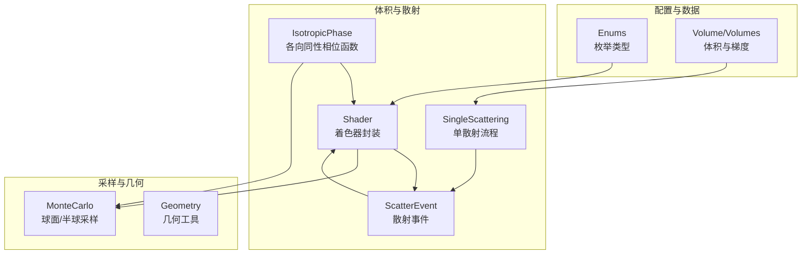
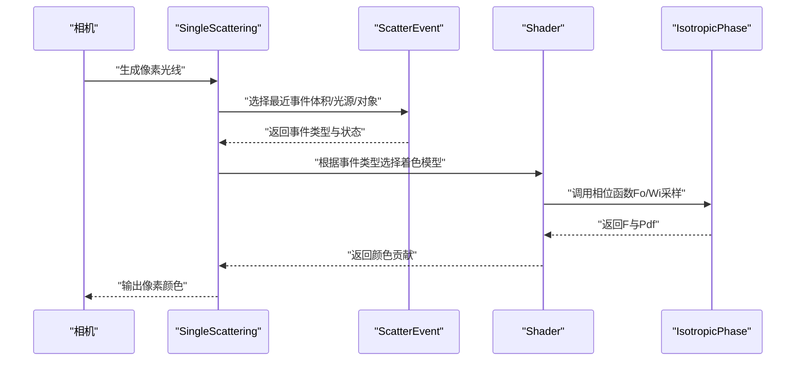
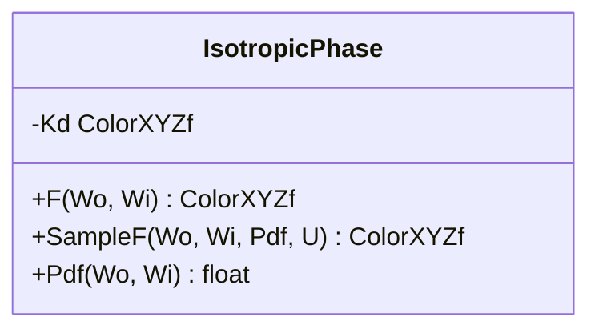
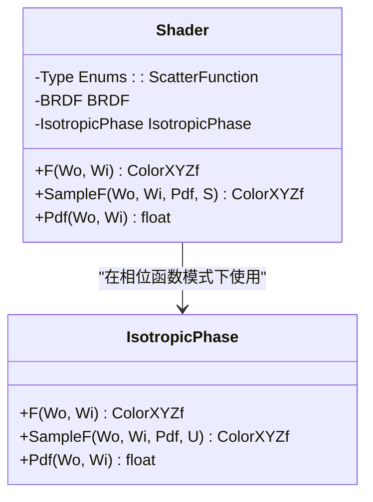
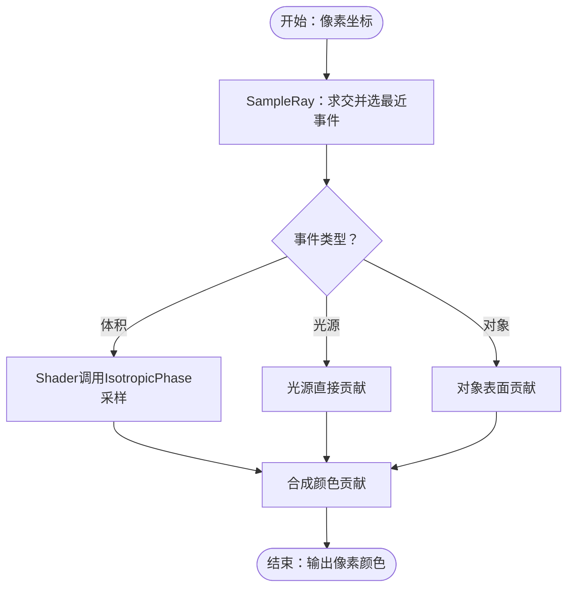
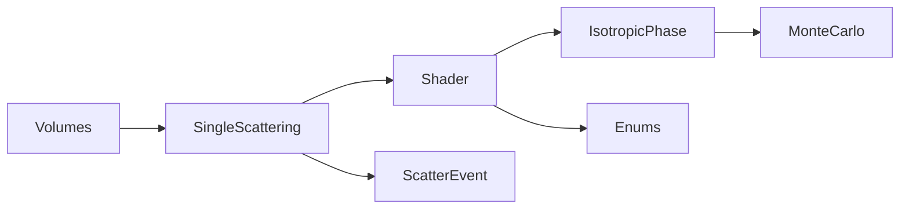

# 相位函数

<cite>
**本文引用的文件**
- [shader.h](file://Source/shader.h)
- [montecarlo.h](file://Source/montecarlo.h)
- [singlescattering.h](file://Source/singlescattering.h)
- [singlescattering.cuh](file://Source/singlescattering.cuh)
- [scatterevent.h](file://Source/scatterevent.h)
- [enums.h](file://Source/enums.h)
- [volumes.h](file://Source/volumes.h)
- [volume.h](file://Source/volume.h)
</cite>

## 目录
1. [引言](#引言)
2. [项目结构](#项目结构)
3. [核心组件](#核心组件)
4. [架构总览](#架构总览)
5. [详细组件分析](#详细组件分析)
6. [依赖分析](#依赖分析)
7. [性能考虑](#性能考虑)
8. [故障排查指南](#故障排查指南)
9. [结论](#结论)
10. [附录](#附录)

## 引言
本章节面向“相位函数”在体积散射中的实现与使用，系统阐述各向同性相位函数（IsotropicPhase）的数学原理、接口设计、调用关系与在渲染管线中的作用。文档同时覆盖与单散射（Single Scattering）流程的衔接、配置选项、参数与返回值，并给出常见问题与优化建议，帮助初学者快速上手，也为有经验的开发者提供深入的技术细节。

## 项目结构
围绕相位函数的相关代码主要分布在以下模块：
- 相位函数与着色器模型：shader.h
- 蒙特卡洛采样与球面采样：montecarlo.h
- 单散射流程与事件选择：singlescattering.h、singlescattering.cuh
- 散射事件数据结构：scatterevent.h
- 渲染设置与枚举类型：enums.h
- 体积数据与梯度：volumes.h、volume.h

图表来源
- [shader.h:276-314](file://Source/shader.h#L276-L314)
- [shader.h:415-483](file://Source/shader.h#L415-L483)
- [montecarlo.h:191-221](file://Source/montecarlo.h#L191-L221)
- [singlescattering.h:52-102](file://Source/singlescattering.h#L52-L102)
- [scatterevent.h:31-151](file://Source/scatterevent.h#L31-L151)
- [enums.h:63-107](file://Source/enums.h#L63-L107)
- [volumes.h:26-114](file://Source/volumes.h#L26-L114)
- [volume.h:26-150](file://Source/volume.h#L26-L150)

章节来源
- [shader.h:276-314](file://Source/shader.h#L276-L314)
- [montecarlo.h:191-221](file://Source/montecarlo.h#L191-L221)
- [singlescattering.h:52-102](file://Source/singlescattering.h#L52-L102)
- [scatterevent.h:31-151](file://Source/scatterevent.h#L31-L151)
- [enums.h:63-107](file://Source/enums.h#L63-L107)
- [volumes.h:26-114](file://Source/volumes.h#L26-L114)
- [volume.h:26-150](file://Source/volume.h#L26-L150)

## 核心组件
- 各向同性相位函数（IsotropicPhase）
  - 数学形式：相位函数为常数，概率密度为均匀分布于单位球面。
  - 接口要点：F(Wo, Wi) 返回辐亮度比值；SampleF(Wo, Wi, Pdf, U) 进行球面均匀采样并返回PDF；Pdf(Wo, Wi) 返回球面均匀PDF。
  - 参数：Kd（颜色权重），控制相位函数幅度。
  - 返回值：F返回颜色（XYZ），SampleF返回颜色与PDF，Pdf返回标量概率密度。
- 着色器（Shader）
  - 封装BRDF与相位函数两种散射模型，根据设置在两者间切换。
  - 提供统一的F、SampleF、Pdf接口，内部路由到对应模型。
- 散射事件（ScatterEvent）
  - 记录光线与体积、光源或物体的最近相交事件，携带位置、法线、入射方向、出射方向、发光等信息。
- 单散射流程（SingleScattering）
  - 从相机采样光线，选择最近的散射事件（体积/光源/对象），并进行一次散射路径的估计。
- 体积与梯度（Volume/Volumes）
  - 提供体数据访问与梯度计算，支撑体积渲染与光照计算。

章节来源
- [shader.h:276-314](file://Source/shader.h#L276-L314)
- [shader.h:415-483](file://Source/shader.h#L415-L483)
- [scatterevent.h:31-151](file://Source/scatterevent.h#L31-L151)
- [singlescattering.h:52-102](file://Source/singlescattering.h#L52-L102)
- [volumes.h:26-114](file://Source/volumes.h#L26-L114)
- [volume.h:26-150](file://Source/volume.h#L26-L150)

## 架构总览
下图展示了从相机到单次散射再到相位函数采样的整体流程，以及相位函数在着色器中的角色。

图表来源
- [singlescattering.h:52-102](file://Source/singlescattering.h#L52-L102)
- [shader.h:415-483](file://Source/shader.h#L415-L483)
- [shader.h:276-314](file://Source/shader.h#L276-L314)

章节来源
- [singlescattering.h:52-102](file://Source/singlescattering.h#L52-L102)
- [shader.h:415-483](file://Source/shader.h#L415-L483)
- [shader.h:276-314](file://Source/shader.h#L276-L314)

## 详细组件分析

### 各向同性相位函数（IsotropicPhase）
- 数学原理
  - 均匀相位函数：p(θ,φ)=常数，单位球面上均匀分布。
  - 归一化：PDF = 1/(4π)，F(Wo, Wi) = Kd/π（此处Kd为颜色权重）。
- 接口与行为
  - F(Wo, Wi)：返回该方向下的相位函数值（颜色）。
  - SampleF(Wo, Wi, Pdf, U)：使用均匀球面采样生成Wi，并返回PDF与F值。
  - Pdf(Wo, Wi)：返回均匀球面PDF（常数）。
- 关键实现点
  - 球面均匀采样：UniformSampleSphereSurface(U)。
  - PDF常量：INV_FOUR_PI_F（1/(4π)）。
- 使用场景
  - 体积散射（雾、烟、云等）的简化建模。
  - 作为单散射路径中散射方向生成的基础。

图表来源
- [shader.h:276-314](file://Source/shader.h#L276-L314)

章节来源
- [shader.h:276-314](file://Source/shader.h#L276-L314)
- [montecarlo.h:191-199](file://Source/montecarlo.h#L191-L199)

### 着色器（Shader）与相位函数集成
- 统一接口
  - F(Wo, Wi)、SampleF、Pdf对外暴露一致接口。
  - 内部通过枚举类型选择BRDF或相位函数。
- 与IsotropicPhase的组合
  - 在“相位函数仅”模式下，Shader将直接使用IsotropicPhase进行散射方向采样与BRDF值评估。
- 配置项
  - 渲染设置中的散射函数类型（ScatterFunction）决定走BRDF还是相位函数路径。

图表来源
- [shader.h:415-483](file://Source/shader.h#L415-L483)
- [shader.h:276-314](file://Source/shader.h#L276-L314)

章节来源
- [shader.h:415-483](file://Source/shader.h#L415-L483)
- [enums.h:95-99](file://Source/enums.h#L95-L99)

### 单散射流程与相位函数的衔接
- 流程概览
  - 从相机生成光线，与体积、光源、对象求交，选择最近事件。
  - 若事件为体积，则调用相位函数进行散射方向采样与辐射度估计。
- 关键步骤
  - SampleRay：选择最近事件（体积/光源/对象）。
  - SingleScattering：对每个像素执行一次散射估计，结合UniformSampleOneLight等策略。
- 与相位函数的关系
  - 当事件类型为体积时，Shader会通过IsotropicPhase进行Fo/Wi采样，从而影响散射方向与能量分配。

图表来源
- [singlescattering.h:52-102](file://Source/singlescattering.h#L52-L102)
- [shader.h:415-483](file://Source/shader.h#L415-L483)
- [shader.h:276-314](file://Source/shader.h#L276-L314)

章节来源
- [singlescattering.h:52-102](file://Source/singlescattering.h#L52-L102)
- [shader.h:415-483](file://Source/shader.h#L415-L483)
- [shader.h:276-314](file://Source/shader.h#L276-L314)

### 体积与梯度对相位函数的影响
- 体积数据
  - Volume提供体素查询与边界盒、间距、最小步长等信息，支撑体积渲染。
- 梯度计算
  - Volumes提供多种梯度计算方式（前向差分、中心差分、滤波），用于光照与掩膜等用途。
- 对相位函数的作用
  - 相位函数本身不依赖梯度；但若渲染设置启用基于梯度的混合或遮罩（例如某些着色模式），则梯度会影响最终视觉效果（如混合BRDF与相位函数的概率）。

章节来源
- [volume.h:26-150](file://Source/volume.h#L26-L150)
- [volumes.h:26-114](file://Source/volumes.h#L26-L114)

## 依赖分析
- IsotropicPhase依赖
  - 几何与采样：UniformSampleSphereSurface（球面均匀采样）。
  - 常量：INV_FOUR_PI_F（球面均匀PDF）。
- Shader依赖
  - Enums：ScatterFunction（选择BRDF或相位函数）。
  - IsotropicPhase：在相位函数模式下被调用。
- 单散射流程依赖
  - ScatterEvent：记录事件类型与状态。
  - Shader：在体积事件中进行相位函数采样。
- 体积与梯度依赖
  - Volume/Volumes：提供体数据与梯度计算，间接影响渲染结果。

图表来源
- [shader.h:276-314](file://Source/shader.h#L276-L314)
- [shader.h:415-483](file://Source/shader.h#L415-L483)
- [enums.h:95-99](file://Source/enums.h#L95-L99)
- [singlescattering.h:52-102](file://Source/singlescattering.h#L52-L102)
- [scatterevent.h:31-151](file://Source/scatterevent.h#L31-L151)
- [volumes.h:26-114](file://Source/volumes.h#L26-L114)

章节来源
- [shader.h:276-314](file://Source/shader.h#L276-L314)
- [shader.h:415-483](file://Source/shader.h#L415-L483)
- [enums.h:95-99](file://Source/enums.h#L95-L99)
- [singlescattering.h:52-102](file://Source/singlescattering.h#L52-L102)
- [scatterevent.h:31-151](file://Source/scatterevent.h#L31-L151)
- [volumes.h:26-114](file://Source/volumes.h#L26-L114)

## 性能考虑
- 球面均匀采样成本低，适合实时渲染路径。
- 单散射核函数（KrnlSingleScattering）按像素并行，适合CUDA加速。
- 体积梯度计算可选择不同模式（前向/中心/滤波），在质量与速度之间权衡。
- 将相位函数与BRDF混合时，注意混合概率的计算开销（例如基于梯度的阈值或调制）。

## 故障排查指南
- 问题：相位函数未生效
  - 检查渲染设置中的散射函数类型是否为“相位函数”模式。
  - 确认事件类型为体积且有效。
- 问题：散射方向单一或不对称
  - 检查UniformSampleSphereSurface是否正确使用，确保随机数输入U在[0,1)范围内。
- 问题：数值不稳定或结果异常
  - 检查INV_FOUR_PI_F与INV_PI_F的使用一致性，避免重复除以π导致误差。
- 问题：性能不足
  - 调整体积梯度计算模式，必要时使用前向差分以降低开销。
  - 合理设置单散射核的块尺寸与网格尺寸。

章节来源
- [shader.h:276-314](file://Source/shader.h#L276-L314)
- [montecarlo.h:191-199](file://Source/montecarlo.h#L191-L199)
- [singlescattering.cuh:27-38](file://Source/singlescattering.cuh#L27-L38)
- [volumes.h:76-86](file://Source/volumes.h#L76-L86)

## 结论
各向同性相位函数是体积散射建模的基石，其数学简洁、实现高效，适合在单散射路径中快速生成散射方向。通过Shader的统一接口，它与BRDF无缝集成，并可在不同渲染模式下灵活切换。配合合理的体积数据与梯度计算，相位函数能够真实地模拟光线在介质中的多次散射行为，为交互式体积渲染提供稳定而可控的性能与视觉质量。

## 附录
- 关键接口速查
  - IsotropicPhase
    - F(Wo, Wi)：返回相位函数值（颜色）
    - SampleF(Wo, Wi, Pdf, U)：球面均匀采样并返回F与Pdf
    - Pdf(Wo, Wi)：返回均匀球面PDF
  - Shader
    - F/Wo/Wi：统一散射模型接口
    - SampleF/Wo/Wi/Pdf：统一采样接口
    - Pdf/Wo/Wi：统一概率密度接口
- 相关枚举
  - Enums::ScatterFunction：选择BRDF或相位函数
  - Enums::ShadingMode：着色模式（含相位函数仅模式）

章节来源
- [shader.h:276-314](file://Source/shader.h#L276-L314)
- [shader.h:415-483](file://Source/shader.h#L415-L483)
- [enums.h:95-107](file://Source/enums.h#L95-L107)