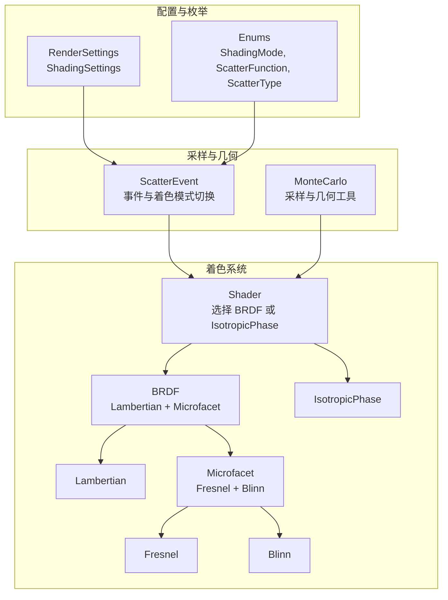
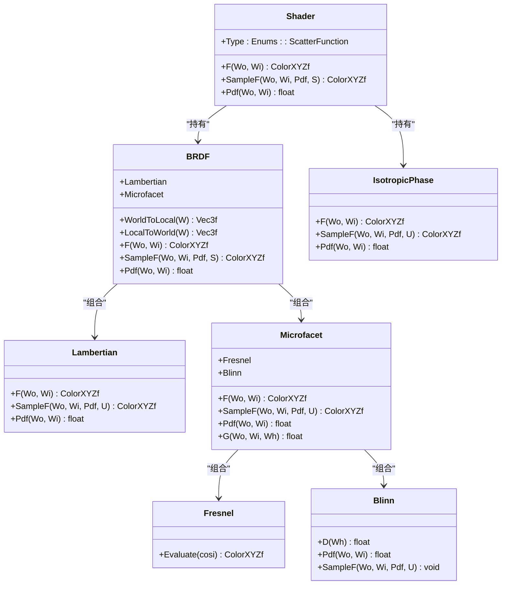
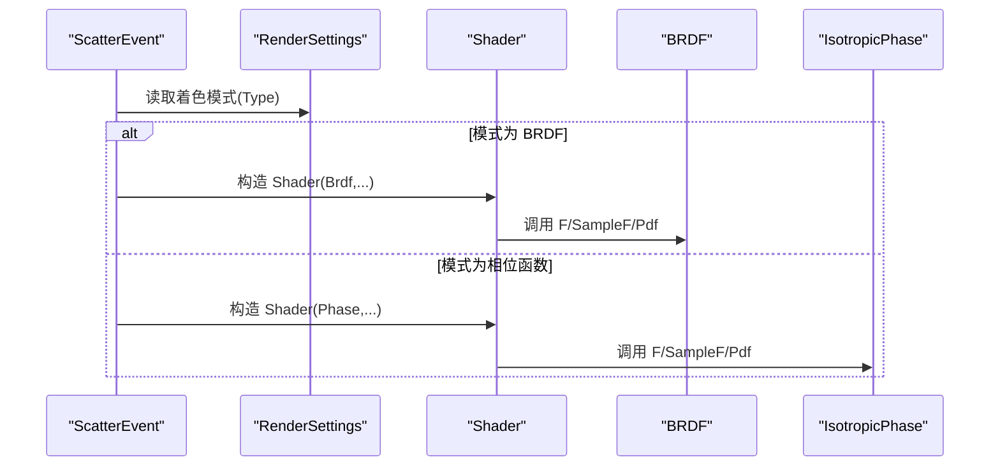
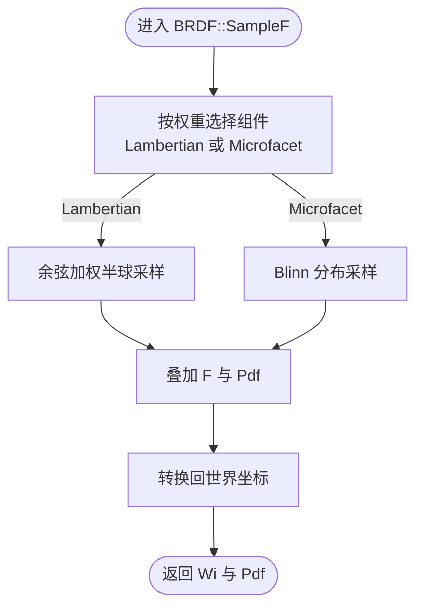
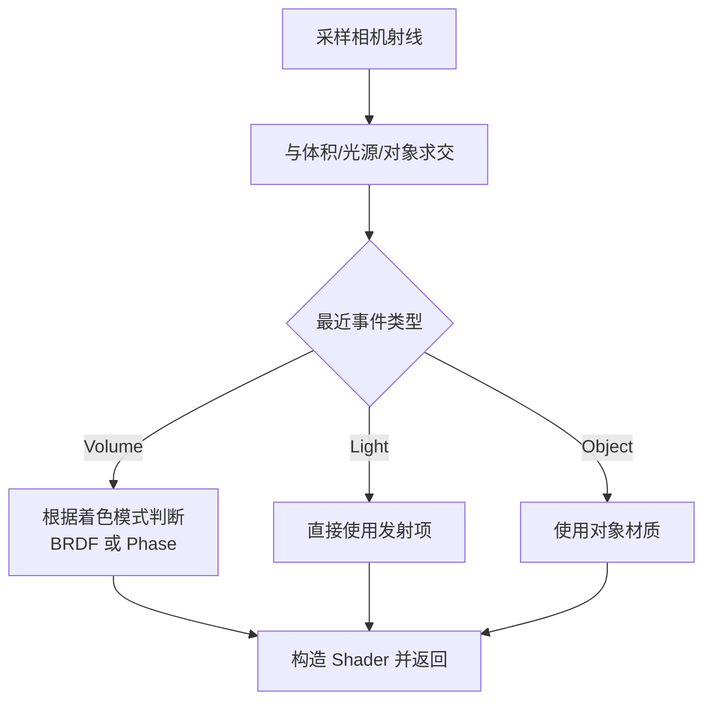
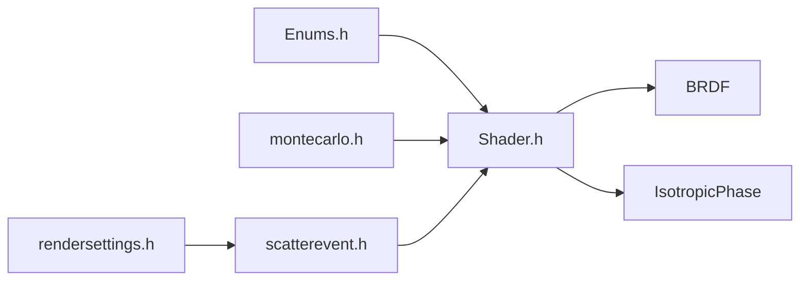

# 着色系统

<cite>
**本文引用的文件**
- [shader.h](file://Source/shader.h)
- [enums.h](file://Source/enums.h)
- [montecarlo.h](file://Source/montecarlo.h)
- [scatterevent.h](file://Source/scatterevent.h)
- [rendersettings.h](file://Source/rendersettings.h)
- [tracer.h](file://Source/tracer.h)
- [singlescattering.h](file://Source/singlescattering.h)
- [utilities.h](file://Source/utilities.h)
</cite>

## 目录
1. [简介](#简介)
2. [项目结构](#项目结构)
3. [核心组件](#核心组件)
4. [架构总览](#架构总览)
5. [详细组件分析](#详细组件分析)
6. [依赖关系分析](#依赖关系分析)
7. [性能考虑](#性能考虑)
8. [故障排查指南](#故障排查指南)
9. [结论](#结论)
10. [附录](#附录)

## 简介
本文件系统性地解析着色系统的设计与实现，重点覆盖 Shader 类的接口、调用关系与使用模式；阐述 BRDF 与相位函数（IsotropicPhase）的选择机制；梳理配置选项、类型枚举与混合策略；说明着色系统如何依据散射函数类型选择相应着色模型；并提供常见问题的解决方案与性能优化建议。文档兼顾初学者可读性与资深开发者所需的技术深度。

## 项目结构
着色系统位于 Source 目录中，围绕 Shader 类为核心，配合枚举类型、蒙特卡洛采样工具与渲染设置进行工作流编排。关键文件包括：
- shader.h：定义 Shader、BRDF、Lambertian、Microfacet、Fresnel、Blinn、IsotropicPhase 等着色模型与接口
- enums.h：定义 ShadingMode、ScatterFunction、ScatterType 等枚举类型
- montecarlo.h：提供几何与采样辅助函数（如半球采样、球面采样等）
- scatterevent.h：描述散射事件并负责在不同着色模式间切换
- rendersettings.h：渲染设置中的着色参数（密度缩放、梯度阈值、因子等）
- tracer.h：渲染器基类与帧缓冲区
- singlescattering.h：单次散射路径采样流程
- utilities.h：通用工具函数（如光泽度指数转换）

图表来源
- [shader.h:415-483](file://Source/shader.h#L415-L483)
- [shader.h:316-413](file://Source/shader.h#L316-L413)
- [shader.h:29-70](file://Source/shader.h#L29-L70)
- [shader.h:198-274](file://Source/shader.h#L198-L274)
- [shader.h:79-128](file://Source/shader.h#L79-L128)
- [shader.h:130-196](file://Source/shader.h#L130-L196)
- [shader.h:276-314](file://Source/shader.h#L276-L314)
- [enums.h:63-107](file://Source/enums.h#L63-L107)
- [montecarlo.h:139-200](file://Source/montecarlo.h#L139-L200)
- [scatterevent.h:82-139](file://Source/scatterevent.h#L82-L139)
- [rendersettings.h:66-106](file://Source/rendersettings.h#L66-L106)

章节来源
- [shader.h:1-486](file://Source/shader.h#L1-L486)
- [enums.h:1-111](file://Source/enums.h#L1-L111)
- [montecarlo.h:1-229](file://Source/montecarlo.h#L1-L229)
- [scatterevent.h:1-212](file://Source/scatterevent.h#L1-L212)
- [rendersettings.h:1-134](file://Source/rendersettings.h#L1-L134)
- [tracer.h:1-58](file://Source/tracer.h#L1-L58)
- [singlescattering.h:1-105](file://Source/singlescattering.h#L1-L105)
- [utilities.h:1-70](file://Source/utilities.h#L1-L70)

## 核心组件
- Shader：统一的着色接口，内部持有 BRDF 与 IsotropicPhase 两种模型，并通过枚举类型决定当前使用哪一种。对外提供 F、SampleF、Pdf 三个核心方法，分别用于反射率计算、采样与概率密度评估。
- BRDF：组合漫反射（Lambertian）与镜面反射（Microfacet），支持局部坐标系变换与混合采样策略。
- IsotropicPhase：各向同性相位函数，常用于体积散射的简化模型。
- Lambertian/Microfacet/Fresnel/Blinn：基础物理模型，分别对应漫反射、微表面材质、菲涅尔效应与分布函数。
- ScatterEvent：描述一次散射事件，负责根据渲染设置在 BRDF 与相位函数之间切换，并构造对应的 Shader 实例。
- RenderSettings/ShadingSettings：提供着色模式、密度缩放、梯度阈值与因子等配置项，驱动着色模型的混合策略。

章节来源
- [shader.h:415-483](file://Source/shader.h#L415-L483)
- [shader.h:316-413](file://Source/shader.h#L316-L413)
- [shader.h:276-314](file://Source/shader.h#L276-L314)
- [shader.h:29-70](file://Source/shader.h#L29-L70)
- [shader.h:198-274](file://Source/shader.h#L198-L274)
- [shader.h:79-128](file://Source/shader.h#L79-L128)
- [shader.h:130-196](file://Source/shader.h#L130-L196)
- [scatterevent.h:82-139](file://Source/scatterevent.h#L82-L139)
- [rendersettings.h:66-106](file://Source/rendersettings.h#L66-L106)

## 架构总览
着色系统采用“策略模式”与“组合模式”的结合：
- 策略模式：通过 Shader 的类型枚举在 BRDF 与 IsotropicPhase 之间切换
- 组合模式：BRDF 内部组合 Lambertian 与 Microfacet，形成混合材质模型
- 配置驱动：RenderSettings 中的 ShadingSettings 决定着色模式与混合强度

图表来源
- [shader.h:415-483](file://Source/shader.h#L415-L483)
- [shader.h:316-413](file://Source/shader.h#L316-L413)
- [shader.h:276-314](file://Source/shader.h#L276-L314)
- [shader.h:29-70](file://Source/shader.h#L29-L70)
- [shader.h:198-274](file://Source/shader.h#L198-L274)
- [shader.h:79-128](file://Source/shader.h#L79-L128)
- [shader.h:130-196](file://Source/shader.h#L130-L196)

## 详细组件分析

### Shader 类与接口
- 接口职责
  - F：返回从入射方向到出射方向的反射率（BRDF 或相位函数）
  - SampleF：按给定样本生成新的出射方向与概率密度
  - Pdf：返回当前方向对下的概率密度
- 选择机制
  - 通过内部枚举类型决定调用 BRDF 还是 IsotropicPhase 的对应方法
- 使用模式
  - 在散射事件发生时，根据渲染设置构造 Shader 实例，随后在路径追踪或光照计算中调用上述接口

图表来源
- [scatterevent.h:82-139](file://Source/scatterevent.h#L82-L139)
- [shader.h:429-469](file://Source/shader.h#L429-L469)
- [rendersettings.h:66-106](file://Source/rendersettings.h#L66-L106)

章节来源
- [shader.h:415-483](file://Source/shader.h#L415-L483)
- [scatterevent.h:82-139](file://Source/scatterevent.h#L82-L139)
- [rendersettings.h:66-106](file://Source/rendersettings.h#L66-L106)

### BRDF 混合模型
- 结构组成
  - Lambertian：漫反射项，使用余弦加权半球采样
  - Microfacet：镜面反射项，由 Fresnel 与 Blinn 分布共同决定
  - 局部坐标系：通过法线与切线向量构建，保证在局部空间内进行材质计算
- 混合策略
  - SampleF 中以固定权重（示例中使用 0.5）混合 Lambertian 与 Microfacet 的采样结果
  - Pdf 与 F 均为两项之和，体现能量守恒与概率密度叠加
- 关键算法
  - 余弦加权半球采样（Lambertian）
  - Blinn 分布采样与 PDF 计算（Microfacet）

图表来源
- [shader.h:357-382](file://Source/shader.h#L357-L382)
- [shader.h:47-61](file://Source/shader.h#L47-L61)
- [shader.h:142-164](file://Source/shader.h#L142-L164)

章节来源
- [shader.h:316-413](file://Source/shader.h#L316-L413)
- [shader.h:29-70](file://Source/shader.h#L29-L70)
- [shader.h:130-196](file://Source/shader.h#L130-L196)
- [montecarlo.h:139-160](file://Source/montecarlo.h#L139-L160)

### IsotropicPhase 相位函数
- 特点
  - 各向同性，不依赖入射/出射角，仅与颜色系数相关
  - 采样在单位球面上均匀分布，PDF 为常数
- 应用场景
  - 体积散射的简化模型，适合快速渲染或作为混合策略的一部分

章节来源
- [shader.h:276-314](file://Source/shader.h#L276-L314)
- [montecarlo.h:191-199](file://Source/montecarlo.h#L191-L199)

### 散射事件与着色模型切换
- 切换逻辑
  - 根据 RenderSettings.Shading.Type 选择 BRDFOnly、PhaseFunctionOnly、Hybrid、Modulation、Threshold、GradientMagnitude 等模式
  - 在 Hybrid/Modulation/Threshold/GradientMagnitude 等模式下，结合梯度幅度与密度信息动态决定是否使用 BRDF 或相位函数
- 典型流程
  - 采样相机射线
  - 与体积、光源、对象求交，选择最近事件
  - 根据事件类型与着色模式构造 Shader 并参与后续光照计算

图表来源
- [singlescattering.h:29-102](file://Source/singlescattering.h#L29-L102)
- [scatterevent.h:82-139](file://Source/scatterevent.h#L82-L139)

章节来源
- [singlescattering.h:29-102](file://Source/singlescattering.h#L29-L102)
- [scatterevent.h:82-139](file://Source/scatterevent.h#L82-L139)

### 配置选项与类型枚举
- ShadingMode（着色模式）
  - BrdfOnly：仅使用 BRDF
  - PhaseFunctionOnly：仅使用相位函数
  - Hybrid：混合策略（具体实现见注释片段）
  - Modulation：基于密度与梯度的调制
  - Threshold：基于梯度阈值的二值切换
  - GradientMagnitude：基于梯度幅度的混合
- ScatterFunction（散射函数）
  - Brdf：BRDF 模型
  - PhaseFunction：相位函数
- ScatterType（散射类型）
  - Volume/Light/Object/SlicePlane：事件类型
- RenderSettings.ShadingSettings（着色配置）
  - Type：着色模式
  - DensityScale：密度缩放
  - OpacityModulated：是否启用透明度调制
  - GradientComputation：梯度计算方式
  - GradientThreshold：梯度阈值
  - GradientFactor：梯度因子

章节来源
- [enums.h:63-107](file://Source/enums.h#L63-L107)
- [rendersettings.h:66-106](file://Source/rendersettings.h#L66-L106)

## 依赖关系分析
- Shader 依赖
  - Enums：类型枚举（ScatterFunction）
  - 几何与采样：蒙特卡洛工具（采样半球、球面、几何判断等）
  - BRDF/IsotropicPhase：内部组合的材质模型
- ScatterEvent 依赖
  - RenderSettings：读取着色模式
  - Shader：构造着色器实例
  - 体积/光源/对象：求交与事件类型

图表来源
- [shader.h:415-483](file://Source/shader.h#L415-L483)
- [enums.h:95-99](file://Source/enums.h#L95-L99)
- [montecarlo.h:139-200](file://Source/montecarlo.h#L139-L200)
- [scatterevent.h:82-139](file://Source/scatterevent.h#L82-L139)
- [rendersettings.h:66-106](file://Source/rendersettings.h#L66-L106)

章节来源
- [shader.h:415-483](file://Source/shader.h#L415-L483)
- [enums.h:95-99](file://Source/enums.h#L95-L99)
- [montecarlo.h:139-200](file://Source/montecarlo.h#L139-L200)
- [scatterevent.h:82-139](file://Source/scatterevent.h#L82-L139)
- [rendersettings.h:66-106](file://Source/rendersettings.h#L66-L106)

## 性能考虑
- 采样效率
  - Lambertian 使用余弦加权半球采样，计算简单且 PDF 明确，适合高频使用
  - Microfacet 的 Blinn 分布采样涉及幂运算与归一化，需注意在热点路径上的开销
- 概率密度叠加
  - BRDF 中两项叠加会增加计算量，但保持了能量守恒与一致的 PDF
- 梯度混合策略
  - Modulation/Threshold/GradientMagnitude 等模式引入额外的梯度计算与随机数比较，可能成为性能瓶颈
  - 可通过减少采样次数、缓存梯度值或调整阈值/因子来平衡质量与速度
- 内存与设备端执行
  - HOST_DEVICE 宏确保在 CPU/GPU 上均可高效运行，但在 GPU 上应避免频繁的分支与条件判断

[本节为通用性能讨论，无需特定文件来源]

## 故障排查指南
- 着色模型切换异常
  - 症状：渲染结果在 BRDF 与相位函数之间频繁跳变
  - 排查：检查 RenderSettings.Shading.Type 与 GradientThreshold/GradientFactor 设置；确认 ScatterEvent 中的混合逻辑是否正确
- PDF 异常导致噪声
  - 症状：路径追踪出现高方差
  - 排查：核对 BRDF 的 PDF 叠加与采样权重；确保 Microfacet 的半角向量未退化（分母为零的情况）
- 菲涅尔与布林分布数值不稳定
  - 症状：镜面反射出现 NaN 或极值
  - 排查：检查入射角范围与折射率设置；确保 Snell 定律求解不会产生越界
- 梯度混合策略失效
  - 症状：无论梯度多大都只使用一种模型
  - 排查：确认 GradientMagnitude 的归一化范围与 Inv 值；检查 OpacityModulated 是否影响最终概率

章节来源
- [shader.h:212-249](file://Source/shader.h#L212-L249)
- [shader.h:384-395](file://Source/shader.h#L384-L395)
- [scatterevent.h:155-212](file://Source/scatterevent.h#L155-L212)

## 结论
着色系统通过 Shader 将 BRDF 与相位函数抽象为统一接口，并以 RenderSettings 与 ScatterEvent 驱动不同着色模式的切换。BRDF 采用漫反射与微表面材质的组合，辅以精确的采样与 PDF 计算；相位函数提供简化的体积散射模型。通过合理的配置与混合策略，系统可在真实感与性能之间取得良好平衡。对于复杂场景，建议优先优化采样策略与梯度混合逻辑，以获得更稳定与高效的渲染结果。

[本节为总结性内容，无需特定文件来源]

## 附录
- 常用术语
  - BRDF：双向反射分布函数
  - 相位函数：描述散射方向的概率密度
  - 梯度幅度：体积数据在空间中的变化程度
  - 透射率调制：根据密度与梯度动态调整 BRDF 使用概率

[本节为概念性内容，无需特定文件来源]