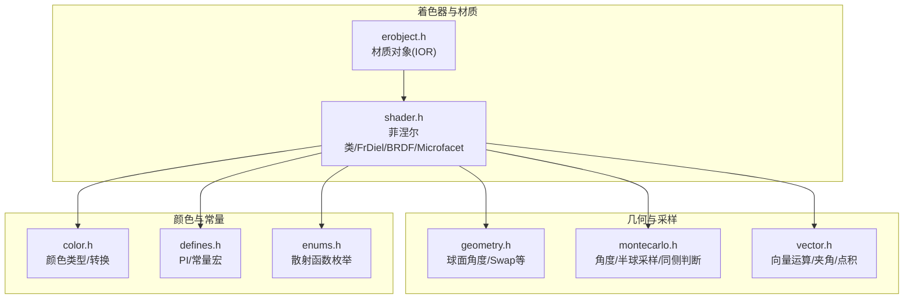
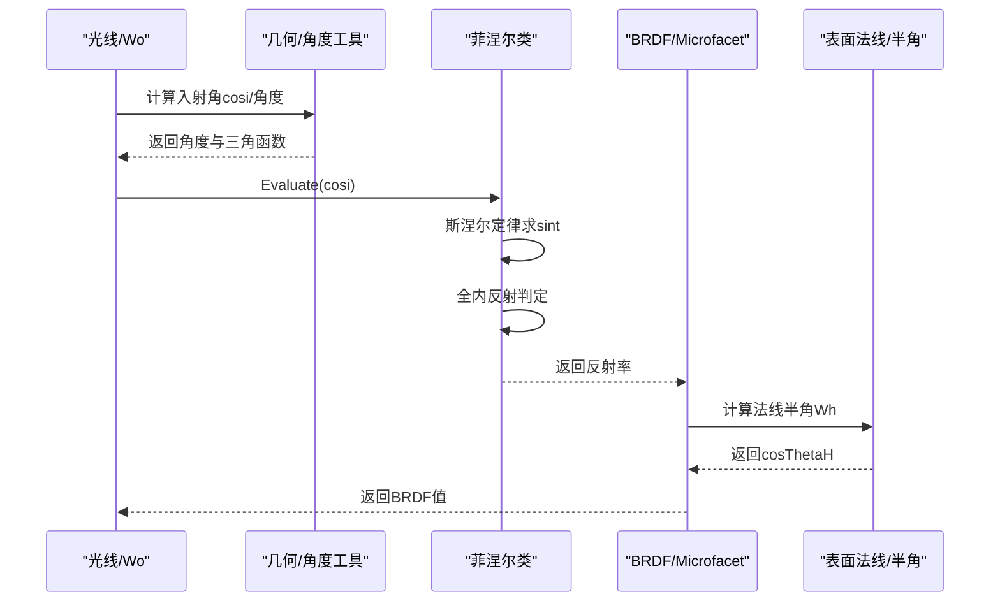
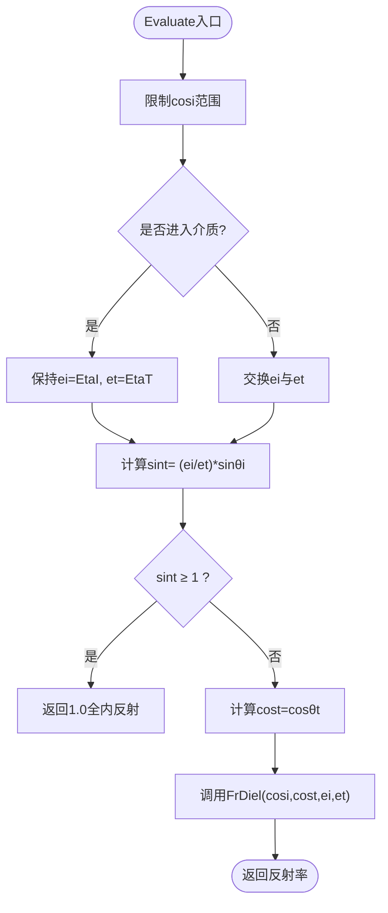
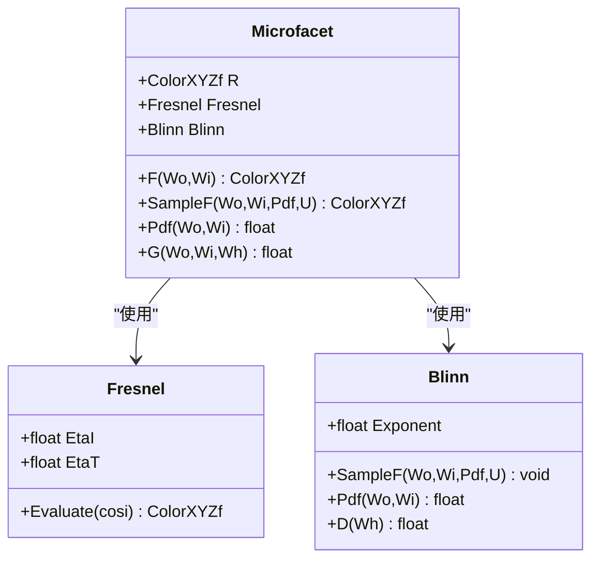
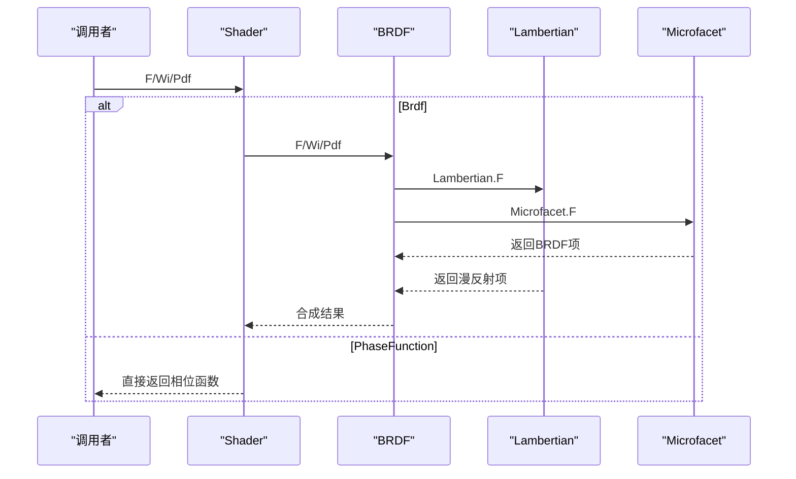
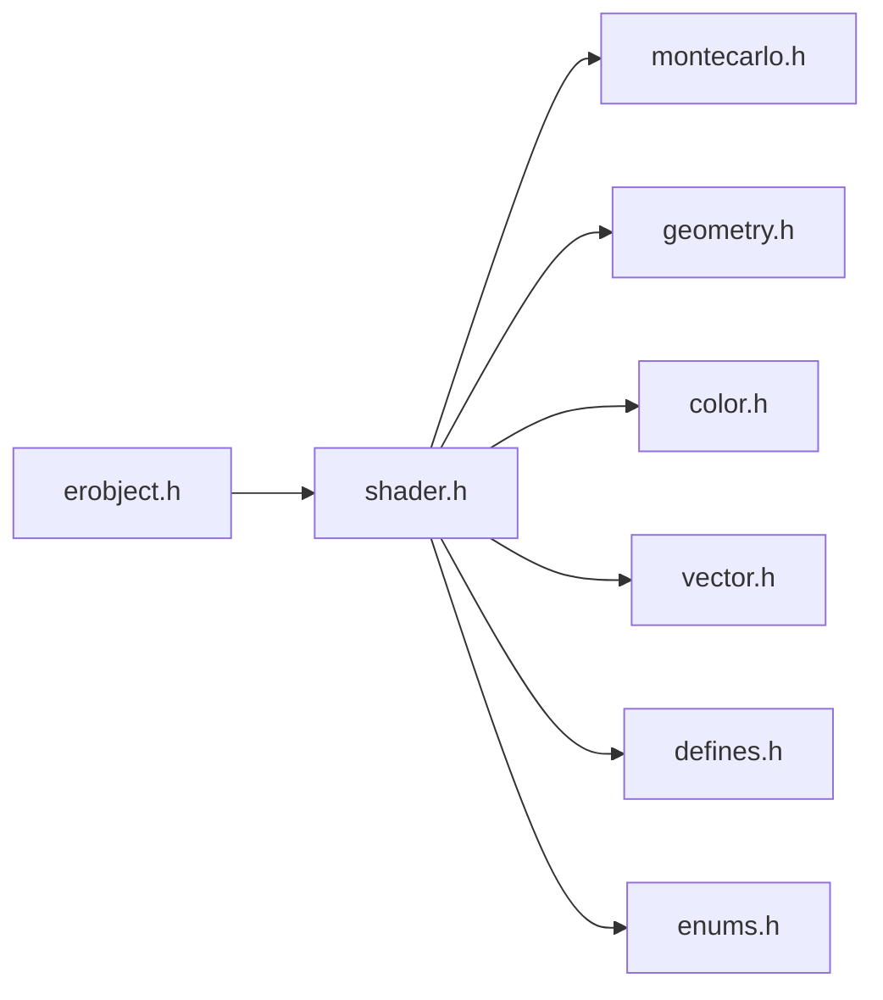

# 菲涅尔反射

<cite>
**本文引用的文件**
- [shader.h](file://Source/shader.h)
- [montecarlo.h](file://Source/montecarlo.h)
- [geometry.h](file://Source/geometry.h)
- [color.h](file://Source/color.h)
- [vector.h](file://Source/vector.h)
- [enums.h](file://Source/enums.h)
- [defines.h](file://Source/defines.h)
- [erobject.h](file://Source/erobject.h)
</cite>

## 目录
1. [引言](#引言)
2. [项目结构](#项目结构)
3. [核心组件](#核心组件)
4. [架构总览](#架构总览)
5. [详细组件分析](#详细组件分析)
6. [依赖分析](#依赖分析)
7. [性能考虑](#性能考虑)
8. [故障排查指南](#故障排查指南)
9. [结论](#结论)
10. [附录：使用模式与示例路径](#附录使用模式与示例路径)

## 引言
本文件围绕代码库中的菲涅尔反射实现展开，系统性阐述介电材料与导体的反射计算、折射率参数、入射角与透射角的推导过程，以及在光学模拟中的物理意义与数值稳定性处理。文档既面向初学者提供清晰的概念与流程说明，也为有经验的开发者提供深入的实现细节、调用关系与优化建议。

## 项目结构
与菲涅尔反射直接相关的代码主要集中在着色器与几何/采样工具模块中：
- 菲涅尔类与介电反射计算位于着色器头文件中
- 角度与球面坐标工具由几何与蒙特卡洛采样模块提供
- 颜色与向量类型及常量定义支撑反射与材质参数
- 材质对象包含折射率字段，用于连接场景材质与菲涅尔模型

**图表来源**
- [shader.h:79-128](file://Source/shader.h#L79-L128)
- [geometry.h:70-85](file://Source/geometry.h#L70-L85)
- [montecarlo.h:27-65](file://Source/montecarlo.h#L27-L65)
- [vector.h:477-485](file://Source/vector.h#L477-L485)
- [color.h:76-93](file://Source/color.h#L76-L93)
- [defines.h:58-77](file://Source/defines.h#L58-L77)
- [enums.h:95-99](file://Source/enums.h#L95-L99)
- [erobject.h:35-66](file://Source/erobject.h#L35-L66)

**章节来源**
- [shader.h:79-128](file://Source/shader.h#L79-L128)
- [montecarlo.h:27-65](file://Source/montecarlo.h#L27-L65)
- [geometry.h:70-85](file://Source/geometry.h#L70-L85)
- [color.h:76-93](file://Source/color.h#L76-L93)
- [vector.h:477-485](file://Source/vector.h#L477-L485)
- [defines.h:58-77](file://Source/defines.h#L58-L77)
- [enums.h:95-99](file://Source/enums.h#L95-L99)
- [erobject.h:35-66](file://Source/erobject.h#L35-L66)

## 核心组件
- 菲涅尔类：提供介电材料的反射计算，内部通过斯涅尔定律判断全内反射，并在透射时使用双分量公式计算反射率
- 介电反射函数：对平行与垂直偏振分量分别计算反射比并取平均，得到标量反射率
- 微表面材质：结合菲涅尔与微平面分布计算BRDF项，支持粗糙度与折射率参数
- 角度与半球采样：提供余弦加权半球采样、同侧判断、球面方向转换等基础能力
- 颜色与向量：提供颜色空间转换与向量运算，支撑BRDF与菲涅尔的数值计算

**章节来源**
- [shader.h:72-128](file://Source/shader.h#L72-L128)
- [shader.h:198-274](file://Source/shader.h#L198-L274)
- [montecarlo.h:139-155](file://Source/montecarlo.h#L139-L155)
- [montecarlo.h:57-65](file://Source/montecarlo.h#L57-L65)
- [color.h:76-93](file://Source/color.h#L76-L93)
- [vector.h:477-485](file://Source/vector.h#L477-L485)

## 架构总览
菲涅尔反射在渲染管线中的位置与调用链如下：

**图表来源**
- [shader.h:92-117](file://Source/shader.h#L92-L117)
- [shader.h:212-231](file://Source/shader.h#L212-L231)
- [montecarlo.h:27-45](file://Source/montecarlo.h#L27-L45)
- [geometry.h:70-85](file://Source/geometry.h#L70-L85)

## 详细组件分析

### 组件A：菲涅尔类（介电材料）
- 功能要点
  - 输入：入射角余弦cosi、折射率对EtaI/EtaT
  - 流程：根据cosi判断进入/离开介质；利用斯涅尔定律计算sinθt；若sinθt≥1则全内反射返回1；否则计算透射角cosθt并调用FrDiel
  - 输出：标量反射率（双偏振分量平均）
- 关键实现路径
  - Evaluate入口与全内反射处理：[Evaluate:92-117](file://Source/shader.h#L92-L117)
  - 介电反射函数FrDiel（平行/垂直分量）：[FrDiel:72-77](file://Source/shader.h#L72-L77)
  - 角度与三角函数工具：[CosTheta/SinTheta:27-45](file://Source/montecarlo.h#L27-L45)
  - 球面角度与归一化：[SphericalTheta/Phi:70-79](file://Source/geometry.h#L70-L79)

**图表来源**
- [shader.h:92-117](file://Source/shader.h#L92-L117)
- [shader.h:72-77](file://Source/shader.h#L72-L77)
- [montecarlo.h:27-45](file://Source/montecarlo.h#L27-L45)
- [geometry.h:70-85](file://Source/geometry.h#L70-L85)

**章节来源**
- [shader.h:72-117](file://Source/shader.h#L72-L117)
- [montecarlo.h:27-45](file://Source/montecarlo.h#L27-L45)
- [geometry.h:70-85](file://Source/geometry.h#L70-L85)

### 组件B：微表面材质与菲涅尔组合
- 功能要点
  - 使用Fresnel类计算基于半角向量的菲涅尔反射
  - 结合Blinn微平面分布与几何遮蔽因子G，形成完整的BRDF项
  - 支持粗糙度指数与折射率作为材质参数
- 关键实现路径
  - 微表面BRDF计算：[F(Wo,Wi):212-231](file://Source/shader.h#L212-L231)
  - 几何遮蔽因子G：[G:251-259](file://Source/shader.h#L251-L259)
  - 菲涅尔参数初始化（折射率IOR）：[构造函数:205-210](file://Source/shader.h#L205-L210)
  - 材质IOR字段（对象级）：[Ior](file://Source/erobject.h#L66)

**图表来源**
- [shader.h:79-128](file://Source/shader.h#L79-L128)
- [shader.h:130-196](file://Source/shader.h#L130-L196)
- [shader.h:198-274](file://Source/shader.h#L198-L274)

**章节来源**
- [shader.h:198-274](file://Source/shader.h#L198-L274)
- [erobject.h:66](file://Source/erobject.h#L66)

### 组件C：BRDF混合与采样
- 功能要点
  - 将朗伯与微表面BRDF按权重混合
  - 提供采样与PDF计算，支持不同散射函数类型
- 关键实现路径
  - BRDF混合与采样：[BRDF:316-413](file://Source/shader.h#L316-L413)
  - 散射函数枚举：[ScatterFunction:95-99](file://Source/enums.h#L95-L99)
  - Shader封装：[Shader:415-483](file://Source/shader.h#L415-L483)

**图表来源**
- [shader.h:415-483](file://Source/shader.h#L415-L483)
- [shader.h:316-413](file://Source/shader.h#L316-L413)
- [enums.h:95-99](file://Source/enums.h#L95-L99)

**章节来源**
- [shader.h:316-483](file://Source/shader.h#L316-L483)
- [enums.h:95-99](file://Source/enums.h#L95-L99)

## 依赖分析
- 模块耦合
  - shader.h高度依赖montecarlo.h与geometry.h提供的角度与半球采样工具
  - color.h与vector.h为数值计算提供基础数据结构与运算
  - erobject.h的IOR字段为菲涅尔类提供折射率输入
- 外部依赖
  - 数学常量与宏定义来源于defines.h
  - 散射函数类型来源于enums.h

**图表来源**
- [shader.h:79-128](file://Source/shader.h#L79-L128)
- [montecarlo.h:27-65](file://Source/montecarlo.h#L27-L65)
- [geometry.h:70-85](file://Source/geometry.h#L70-L85)
- [color.h:76-93](file://Source/color.h#L76-L93)
- [vector.h:477-485](file://Source/vector.h#L477-L485)
- [erobject.h:35-66](file://Source/erobject.h#L35-L66)
- [defines.h:58-77](file://Source/defines.h#L58-L77)
- [enums.h:95-99](file://Source/enums.h#L95-L99)

**章节来源**
- [shader.h:79-128](file://Source/shader.h#L79-L128)
- [montecarlo.h:27-65](file://Source/montecarlo.h#L27-L65)
- [geometry.h:70-85](file://Source/geometry.h#L70-L85)
- [color.h:76-93](file://Source/color.h#L76-L93)
- [vector.h:477-485](file://Source/vector.h#L477-L485)
- [erobject.h:35-66](file://Source/erobject.h#L35-L66)
- [defines.h:58-77](file://Source/defines.h#L58-L77)
- [enums.h:95-99](file://Source/enums.h#L95-L99)

## 性能考虑
- 数值稳定性
  - 在计算sqrt(max(0.f, ...))避免负数开方
  - clamp限制cosi范围，防止三角函数异常
- 分支与条件
  - 全内反射快速返回可减少后续计算
  - 同侧判断与半角归一化避免无效向量
- 并行与设备端执行
  - 所有函数标注为设备端可执行，适合GPU并行渲染

[本节为通用性能讨论，不直接分析具体文件]

## 故障排查指南
- 常见问题
  - 全内反射：当sinθt≥1时返回1，若出现过度反射，检查入射角与折射率设置
  - 折射率匹配：当EtaI≈EtaT时，反射率趋近于0，注意数值误差
  - 数值不稳定：确保cosi在[-1,1]范围内，避免极端角度导致的NaN
- 定位手段
  - 断点或日志：在Evaluate入口与Snell计算处检查中间变量
  - 参数校验：确认IOR与Exponent合理范围
- 解决方案
  - 对cosi进行clamp
  - 对sint进行阈值判断，必要时引入小量ε避免边界误差
  - 使用颜色与向量工具进行数值校验

**章节来源**
- [shader.h:92-117](file://Source/shader.h#L92-L117)
- [montecarlo.h:27-45](file://Source/montecarlo.h#L27-L45)
- [vector.h:477-485](file://Source/vector.h#L477-L485)

## 结论
该代码库提供了完整的介电材料菲涅尔反射实现，并将其无缝集成到微表面BRDF框架中。通过清晰的接口设计与稳健的数值处理，既能满足光学模拟的精度需求，又便于在渲染管线中高效并行执行。对于导体等更复杂介质，可在现有Fresnel框架上扩展复折射率模型。

[本节为总结性内容，不直接分析具体文件]

## 附录：使用模式与示例路径
- 介电材料反射计算
  - 入口：[Fresnel.Evaluate:92-117](file://Source/shader.h#L92-L117)
  - 双偏振分量反射：[FrDiel:72-77](file://Source/shader.h#L72-L77)
- 微表面BRDF与菲涅尔组合
  - BRDF项计算：[Microfacet.F:212-231](file://Source/shader.h#L212-L231)
  - 几何遮蔽因子：[G:251-259](file://Source/shader.h#L251-L259)
  - 材质IOR设置：[ErObject.Ior](file://Source/erobject.h#L66)
- 角度与采样工具
  - 余弦加权半球采样：[CosineWeightedHemisphere:139-155](file://Source/montecarlo.h#L139-L155)
  - 同侧判断：[SameHemisphere:57-65](file://Source/montecarlo.h#L57-L65)
  - 球面角度：[SphericalTheta/Phi:70-79](file://Source/geometry.h#L70-L79)
- 颜色与常量
  - 颜色类型与转换：[ColorXYZf:76-93](file://Source/color.h#L76-L93)
  - 数学常量：[PI_F等:58-77](file://Source/defines.h#L58-L77)

**章节来源**
- [shader.h:72-117](file://Source/shader.h#L72-L117)
- [shader.h:198-274](file://Source/shader.h#L198-L274)
- [erobject.h:66](file://Source/erobject.h#L66)
- [montecarlo.h:139-155](file://Source/montecarlo.h#L139-L155)
- [montecarlo.h:57-65](file://Source/montecarlo.h#L57-L65)
- [geometry.h:70-79](file://Source/geometry.h#L70-L79)
- [color.h:76-93](file://Source/color.h#L76-L93)
- [defines.h:58-77](file://Source/defines.h#L58-L77)