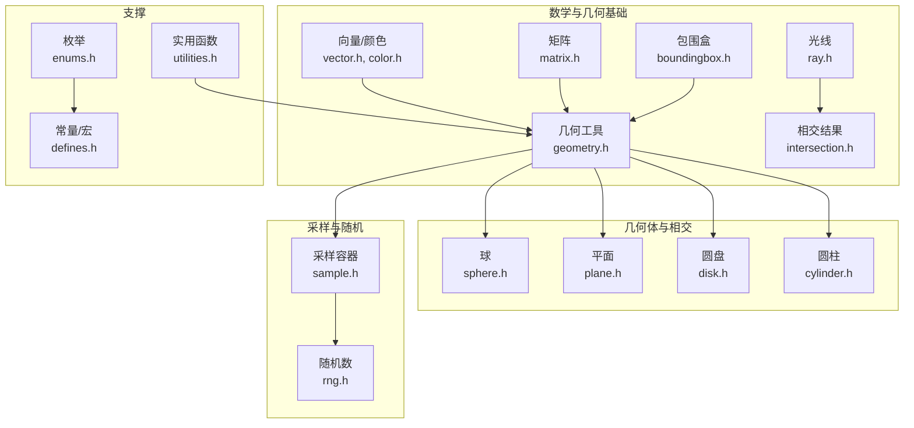
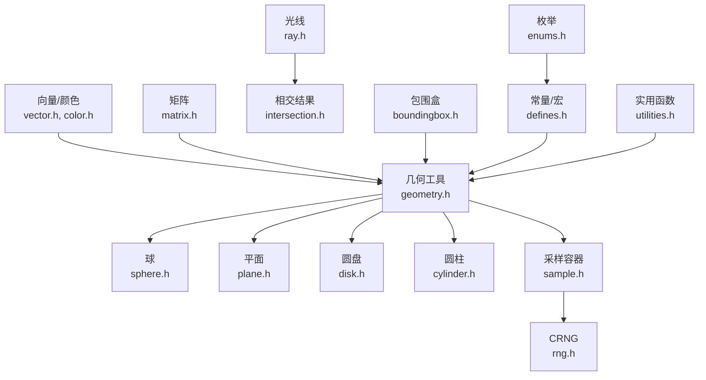
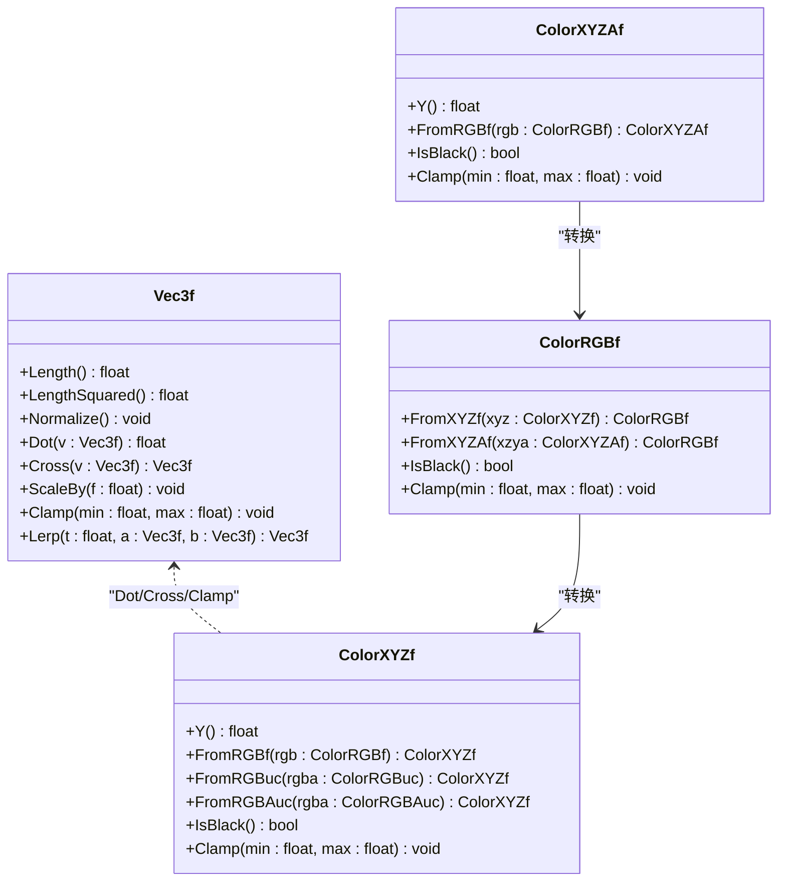
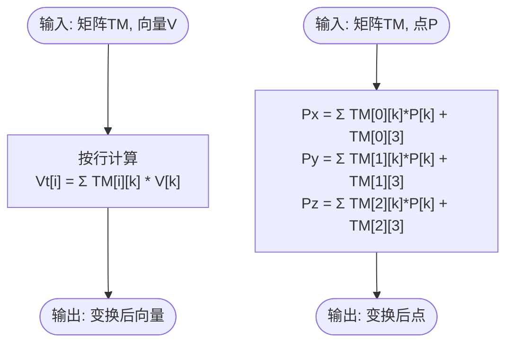
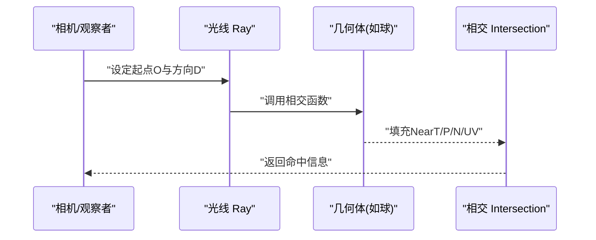
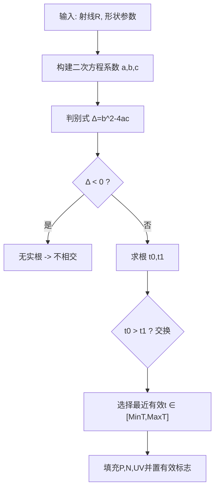
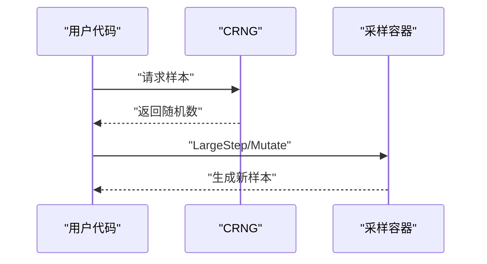
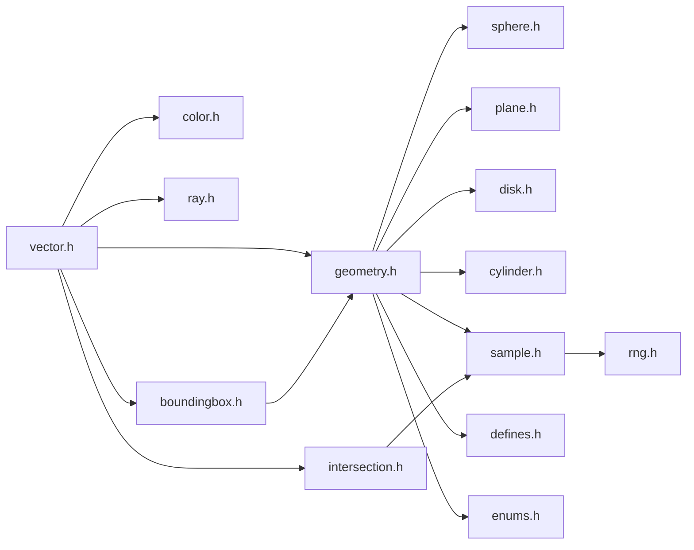

# 几何和数学基础

<cite>
**本文引用的文件**
- [vector.h](file://Source/vector.h)
- [matrix.h](file://Source/matrix.h)
- [geometry.h](file://Source/geometry.h)
- [ray.h](file://Source/ray.h)
- [intersection.h](file://Source/intersection.h)
- [boundingbox.h](file://Source/boundingbox.h)
- [sphere.h](file://Source/sphere.h)
- [plane.h](file://Source/plane.h)
- [disk.h](file://Source/disk.h)
- [cylinder.h](file://Source/cylinder.h)
- [color.h](file://Source/color.h)
- [sample.h](file://Source/sample.h)
- [rng.h](file://Source/rng.h)
- [enums.h](file://Source/enums.h)
- [defines.h](file://Source/defines.h)
- [utilities.h](file://Source/utilities.h)
</cite>

## 目录
1. [简介](#简介)
2. [项目结构](#项目结构)
3. [核心组件](#核心组件)
4. [架构总览](#架构总览)
5. [详细组件分析](#详细组件分析)
6. [依赖分析](#依赖分析)
7. [性能考量](#性能考量)
8. [故障排查指南](#故障排查指南)
9. [结论](#结论)
10. [附录](#附录)

## 简介
本章节面向“几何与数学基础”主题，系统梳理本代码库中的向量、矩阵、光线、相交、采样、颜色空间与数值常量等核心数学与几何构件。文档以循序渐进的方式呈现：先从数据类型与运算符重载入手，再过渡到几何对象（球、平面、圆盘、圆柱）与光线追踪相交算法，随后引入颜色空间转换与蒙特卡洛采样，最后给出架构视图、依赖关系、性能建议与常见问题排查。文中所有技术细节均直接来源于仓库源码，避免臆测。

## 项目结构
围绕几何与数学的基础构件主要分布在以下头文件中：
- 向量与颜色：vector.h、color.h
- 变换与几何工具：matrix.h、geometry.h
- 光线与相交：ray.h、intersection.h、boundingbox.h
- 基础几何体与相交：sphere.h、plane.h、disk.h、cylinder.h
- 采样与随机数：sample.h、rng.h
- 枚举与常量：enums.h、defines.h
- 实用函数：utilities.h

**图表来源**
- [vector.h:1-582](file://Source/vector.h#L1-L582)
- [color.h:1-287](file://Source/color.h#L1-L287)
- [matrix.h:1-59](file://Source/matrix.h#L1-L59)
- [geometry.h:1-141](file://Source/geometry.h#L1-L141)
- [ray.h:1-58](file://Source/ray.h#L1-L58)
- [intersection.h:1-81](file://Source/intersection.h#L1-L81)
- [boundingbox.h:1-79](file://Source/boundingbox.h#L1-L79)
- [sphere.h:1-173](file://Source/sphere.h#L1-L173)
- [plane.h:1-110](file://Source/plane.h#L1-L110)
- [disk.h:1-77](file://Source/disk.h#L1-L77)
- [cylinder.h:1-132](file://Source/cylinder.h#L1-L132)
- [sample.h:1-279](file://Source/sample.h#L1-L279)
- [rng.h:1-68](file://Source/rng.h#L1-L68)
- [enums.h:1-111](file://Source/enums.h#L1-L111)
- [defines.h:1-114](file://Source/defines.h#L1-L114)
- [utilities.h:1-70](file://Source/utilities.h#L1-L70)

**章节来源**
- [vector.h:1-582](file://Source/vector.h#L1-L582)
- [color.h:1-287](file://Source/color.h#L1-L287)
- [matrix.h:1-59](file://Source/matrix.h#L1-L59)
- [geometry.h:1-141](file://Source/geometry.h#L1-L141)
- [ray.h:1-58](file://Source/ray.h#L1-L58)
- [intersection.h:1-81](file://Source/intersection.h#L1-L81)
- [boundingbox.h:1-79](file://Source/boundingbox.h#L1-L79)
- [sphere.h:1-173](file://Source/sphere.h#L1-L173)
- [plane.h:1-110](file://Source/plane.h#L1-L110)
- [disk.h:1-77](file://Source/disk.h#L1-L77)
- [cylinder.h:1-132](file://Source/cylinder.h#L1-L132)
- [sample.h:1-279](file://Source/sample.h#L1-L279)
- [rng.h:1-68](file://Source/rng.h#L1-L68)
- [enums.h:1-111](file://Source/enums.h#L1-L111)
- [defines.h:1-114](file://Source/defines.h#L1-L114)
- [utilities.h:1-70](file://Source/utilities.h#L1-L70)

## 核心组件
本节聚焦于最基础且高频使用的数学与几何构件，包括：
- 多维向量族：Vec2i/Vec2f、Vec3i/Vec3f、Vec4i/Vec4f 及其分量访问、算术、比较、归一化、点积、叉积、夹角与插值等。
- 颜色空间族：RGB、XYZ、XYZA 及其相互转换、亮度计算、缩放与插值。
- 矩阵：4×4 浮点矩阵，支持单位初始化与拷贝赋值。
- 几何工具：向量变换、点变换、光线变换、球面坐标与UV映射、线性插值、交换等。
- 光线与相交：光线类、相交结果类、包围盒。
- 基础几何体与相交：球、平面、圆盘、圆柱的相交与采样。
- 采样与随机：多类采样容器（表面、光照、BRDF、相机、整体）与CRNG伪随机数生成器。
- 常量与枚举：数学常量、宏、设备端标记、异常级别、散射类型等。

**章节来源**
- [vector.h:397-582](file://Source/vector.h#L397-L582)
- [color.h:59-287](file://Source/color.h#L59-L287)
- [matrix.h:27-59](file://Source/matrix.h#L27-L59)
- [geometry.h:30-141](file://Source/geometry.h#L30-L141)
- [ray.h:26-58](file://Source/ray.h#L26-L58)
- [intersection.h:30-81](file://Source/intersection.h#L30-L81)
- [boundingbox.h:26-79](file://Source/boundingbox.h#L26-L79)
- [sphere.h:28-173](file://Source/sphere.h#L28-L173)
- [plane.h:27-110](file://Source/plane.h#L27-L110)
- [disk.h:27-77](file://Source/disk.h#L27-L77)
- [cylinder.h:30-132](file://Source/cylinder.h#L30-L132)
- [sample.h:57-279](file://Source/sample.h#L57-L279)
- [rng.h:26-68](file://Source/rng.h#L26-L68)
- [enums.h:24-111](file://Source/enums.h#L24-L111)
- [defines.h:37-114](file://Source/defines.h#L37-L114)
- [utilities.h:28-70](file://Source/utilities.h#L28-L70)

## 架构总览
下图展示几何与数学基础在渲染管线中的位置与交互关系：向量/颜色作为底层数据类型；矩阵与几何工具负责变换；光线与相交定义追踪路径与命中信息；基础几何体与相交提供具体形状的求解；采样与随机为蒙特卡洛积分提供样本；颜色空间转换贯穿渲染输出；常量与枚举提供统一约定。

**图表来源**
- [vector.h:1-582](file://Source/vector.h#L1-L582)
- [color.h:1-287](file://Source/color.h#L1-L287)
- [matrix.h:1-59](file://Source/matrix.h#L1-L59)
- [geometry.h:1-141](file://Source/geometry.h#L1-L141)
- [ray.h:1-58](file://Source/ray.h#L1-L58)
- [intersection.h:1-81](file://Source/intersection.h#L1-L81)
- [boundingbox.h:1-79](file://Source/boundingbox.h#L1-L79)
- [sphere.h:1-173](file://Source/sphere.h#L1-L173)
- [plane.h:1-110](file://Source/plane.h#L1-L110)
- [disk.h:1-77](file://Source/disk.h#L1-L77)
- [cylinder.h:1-132](file://Source/cylinder.h#L1-L132)
- [sample.h:1-279](file://Source/sample.h#L1-L279)
- [rng.h:1-68](file://Source/rng.h#L1-L68)
- [enums.h:1-111](file://Source/enums.h#L1-L111)
- [defines.h:1-114](file://Source/defines.h#L1-L114)
- [utilities.h:1-70](file://Source/utilities.h#L1-L70)

## 详细组件分析

### 向量与颜色体系
- 向量族
  - 支持默认、拷贝、全分量构造与数组构造。
  - 提供下标访问、算术运算（加减乘除、标量乘除）、复合赋值、比较运算。
  - Vec2f/Vec3f/Vec4f 提供长度、长度平方、归一化、点积、叉积、分量最小/最大、Clamp、插值等。
  - Vec3f 提供ScaleBy、Dot、Cross、ClampedAbsDot、ClampedDot等常用光追运算。
  - 提供全局函数Normalize、Length、Distance、DistanceSquared、Lerp等。
- 颜色空间族
  - ColorRGBf、ColorXYZf、ColorXYZAf、ColorRGBuc、ColorRGBAuc。
  - 支持全分量构造、算术与比较、Clamp、IsBlack、亮度Y()。
  - 提供RGB↔XYZ↔其他格式的双向转换，以及按通道插值与缩放。

**图表来源**
- [vector.h:450-495](file://Source/vector.h#L450-L495)
- [color.h:76-142](file://Source/color.h#L76-L142)
- [color.h:144-222](file://Source/color.h#L144-L222)
- [color.h:213-258](file://Source/color.h#L213-L258)

**章节来源**
- [vector.h:397-582](file://Source/vector.h#L397-L582)
- [color.h:59-287](file://Source/color.h#L59-L287)

### 矩阵与几何变换
- Matrix44
  - 单位初始化、拷贝与赋值。
  - 数据布局为4×4浮点数组。
- 几何工具
  - TransformVector：纯向量变换（忽略平移）。
  - TransformPoint：点变换（含平移）。
  - TransformRay：将矩阵作用于光线，返回新光线（含MinT/MaxT重计算）。
  - SphericalTheta/Phi/SphericalToUV：球面坐标到UV映射。
  - Lerp：标量线性插值。
  - swap/Swap：整型/浮点/指针的交换。

**图表来源**
- [geometry.h:30-52](file://Source/geometry.h#L30-L52)

**章节来源**
- [matrix.h:27-59](file://Source/matrix.h#L27-L59)
- [geometry.h:30-141](file://Source/geometry.h#L30-L141)

### 光线与相交
- Ray
  - 构造函数可指定起点、方向、近远裁剪参数。
  - 重载()用于按参数t取点：P(t)=O+Normalize(D)*t。
- Intersection
  - 标记命中状态、前后表面、近远参数、位置、法线、UV。
  - 提供SetValid/SetInvalid辅助设置。
- BoundingBox
  - 维护最小/最大顶点、尺寸与逆尺寸，支持更新。

**图表来源**
- [ray.h:26-58](file://Source/ray.h#L26-L58)
- [intersection.h:30-81](file://Source/intersection.h#L30-L81)
- [boundingbox.h:26-79](file://Source/boundingbox.h#L26-L79)

**章节来源**
- [ray.h:26-58](file://Source/ray.h#L26-L58)
- [intersection.h:30-81](file://Source/intersection.h#L30-L81)
- [boundingbox.h:26-79](file://Source/boundingbox.h#L26-L79)

### 基础几何体与相交
- 球
  - IntersectSphereP：仅判断是否相交。
  - IntersectSphere：计算最近交点并填充Intersection（位置、法线、UV）。
  - IntersectUnitSphere：半径为1的便捷版本。
  - InsideSphere：判断点是否在球内。
  - SampleUnitSphere/SampleSphere：球面均匀采样（球坐标→笛卡尔坐标，UV由球面角参数得到）。
- 平面
  - IntersectPlaneP/IntersectPlane：平面相交（可选单面）。
  - IntersectPlaneP(Size)/IntersectPlane(Size)：带尺寸限制的相交。
  - InsidePlane：判断点是否在平面上方。
  - SampleUnitPlane/SamplePlane：平面均匀采样。
- 圆盘
  - IntersectDiskP/IntersectDisk：圆盘相交（基于平面相交并检查半径）。
  - SampleUnitDisk/SampleDisk：圆盘均匀采样（极坐标采样）。
- 圆柱
  - IntersectCylinder：圆柱相交（注释掉的完整实现，当前为空）。
  - InsideCylinder：判断点是否在圆柱内。
  - SampleCylinder：圆柱采样（注释掉的实现）。

**图表来源**
- [sphere.h:28-140](file://Source/sphere.h#L28-L140)
- [plane.h:27-88](file://Source/plane.h#L27-L88)
- [disk.h:27-57](file://Source/disk.h#L27-L57)

**章节来源**
- [sphere.h:28-173](file://Source/sphere.h#L28-L173)
- [plane.h:27-110](file://Source/plane.h#L27-L110)
- [disk.h:27-77](file://Source/disk.h#L27-L77)
- [cylinder.h:30-132](file://Source/cylinder.h#L30-L132)

### 采样与随机数
- CRNG
  - 基于两套种子的线性同余生成器，输出[-1,1]范围浮点。
  - 提供Get1/Get2/Get3生成标量/向量样本。
- 多类采样容器
  - SurfaceSample：表面点、法线、UV。
  - LightSample：光照采样（UVW与大步/变异）。
  - BrdfSample：BRDF采样（组件+方向）。
  - LightingSample：光照采样（BRDF+光源+编号）。
  - CameraSample：相机采样（胶片UV、镜头UV）。
  - MetroSample：整体采样（包含旧亮度）。
- Mutate系列：对单/向量/三维变量进行局部扰动，配合CRNG使用。

**图表来源**
- [rng.h:26-68](file://Source/rng.h#L26-L68)
- [sample.h:57-279](file://Source/sample.h#L57-L279)

**章节来源**
- [rng.h:26-68](file://Source/rng.h#L26-L68)
- [sample.h:57-279](file://Source/sample.h#L57-L279)

### 颜色空间与实用函数
- 颜色空间转换
  - RGB↔XYZ使用标准矩阵，支持有符号/无符号整型与带Alpha的XYZA。
  - 提供亮度Y()与插值函数。
- 实用函数
  - GlossinessExponent：光泽度指数化。
  - ToVec3f/FromVec3f：与CUDA向量互转。
  - ToColorXYZf：数组到颜色的转换。
  - G：几何因子（两表面间遮蔽/透射影响）。
  - CumulativeMovingAverage：累积移动平均。

**章节来源**
- [color.h:59-287](file://Source/color.h#L59-L287)
- [utilities.h:28-70](file://Source/utilities.h#L28-L70)

## 依赖分析
- 内部依赖
  - vector.h 被 color.h、geometry.h、ray.h、intersection.h、boundingbox.h 等广泛使用。
  - geometry.h 依赖 vector.h、ray.h、matrix.h，并被 sphere.h、plane.h、disk.h、cylinder.h 使用。
  - sample.h 依赖 geometry.h、color.h、rng.h。
  - intersection.h 依赖 ray.h、matrix.h、color.h。
  - boundingbox.h 依赖 vector.h。
- 外部依赖
  - CUDA运行时（通过头文件声明）。
  - 标准库（float.h、algorithm、math.h）。
- 宏与平台
  - defines.h 定义设备端标记（HOST_DEVICE等）、数学常量、阈值、尺寸等。

**图表来源**
- [vector.h:1-582](file://Source/vector.h#L1-L582)
- [geometry.h:1-141](file://Source/geometry.h#L1-L141)
- [ray.h:1-58](file://Source/ray.h#L1-L58)
- [intersection.h:1-81](file://Source/intersection.h#L1-L81)
- [boundingbox.h:1-79](file://Source/boundingbox.h#L1-L79)
- [sphere.h:1-173](file://Source/sphere.h#L1-L173)
- [plane.h:1-110](file://Source/plane.h#L1-L110)
- [disk.h:1-77](file://Source/disk.h#L1-L77)
- [cylinder.h:1-132](file://Source/cylinder.h#L1-L132)
- [sample.h:1-279](file://Source/sample.h#L1-L279)
- [rng.h:1-68](file://Source/rng.h#L1-L68)
- [enums.h:1-111](file://Source/enums.h#L1-L111)
- [defines.h:1-114](file://Source/defines.h#L1-L114)

**章节来源**
- [vector.h:1-582](file://Source/vector.h#L1-L582)
- [geometry.h:1-141](file://Source/geometry.h#L1-L141)
- [sample.h:1-279](file://Source/sample.h#L1-L279)

## 性能考量
- 向量化与SIMD
  - 向量族采用连续内存布局与固定维度，便于编译器优化与SIMD扩展。
- 设备端标记
  - HOST_DEVICE宏确保CPU/GPU双端兼容，减少分支开销。
- 矩阵变换
  - TransformPoint/TransformVector分离平移与纯旋转/缩放，避免不必要的平移参与。
- 判别式求根
  - 球/圆盘等二次方程求解优先使用数值稳定策略（如避免直接计算差值），降低精度损失。
- 采样与随机
  - CRNG使用线性同余生成，速度快；Mutate系列小扰动提升马尔可夫链混合速度。
- 常量与阈值
  - RAY_EPS等阈值统一管理，避免魔法数导致的不一致行为。

[本节为通用性能讨论，无需特定文件来源]

## 故障排查指南
- 相交无结果
  - 检查光线方向与形状参数是否合理；确认MinT/MaxT范围覆盖有效区间。
  - 对球/圆盘等二次方程求解，确认判别式计算与根的选择逻辑。
- 法线方向异常
  - 平面单面模式下注意前后表面切换与法线翻转。
- UV映射错误
  - 确认球面到UV映射的θ/φ范围与边界处理。
- 颜色溢出或过暗
  - 检查颜色空间转换矩阵与Clamp使用；确认亮度计算与插值范围。
- 随机序列不一致
  - 确认CRNG种子一致性与LargeStep/Mutate调用顺序。

**章节来源**
- [sphere.h:28-140](file://Source/sphere.h#L28-L140)
- [plane.h:27-88](file://Source/plane.h#L27-L88)
- [disk.h:27-57](file://Source/disk.h#L27-L57)
- [geometry.h:70-85](file://Source/geometry.h#L70-L85)
- [color.h:144-258](file://Source/color.h#L144-L258)
- [rng.h:26-68](file://Source/rng.h#L26-L68)

## 结论
本代码库以向量/颜色为核心，辅以矩阵与几何工具，构建了完整的光线追踪几何与数学基础。通过清晰的类设计与稳定的数值流程，为球、平面、圆盘、圆柱等几何体的相交与采样提供了可靠实现。结合颜色空间转换与蒙特卡洛采样，可进一步拓展至渲染管线的其他模块。建议在扩展新几何体时遵循现有命名、参数与返回约定，保持与intersection与sample体系的一致性。

[本节为总结性内容，无需特定文件来源]

## 附录
- 关键常量与宏
  - 数学常量：π、2π、1/π、1/2π、4π、弧度换算等。
  - 数值阈值：RAY_EPS、RAY_EPS_2、ONE_OVER_255等。
  - 设备端宏：HOST_DEVICE、KERNEL、DEVICE等。
- 枚举类型
  - 内存类型、纹理类型、形状类型、散射类型、异常级别等。

**章节来源**
- [defines.h:58-78](file://Source/defines.h#L58-L78)
- [enums.h:24-111](file://Source/enums.h#L24-L111)