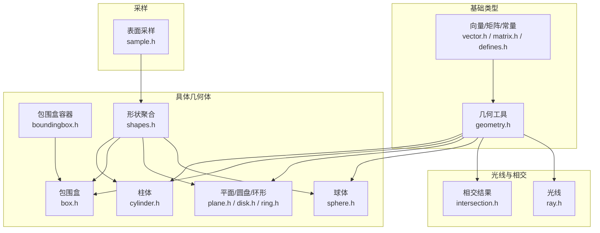
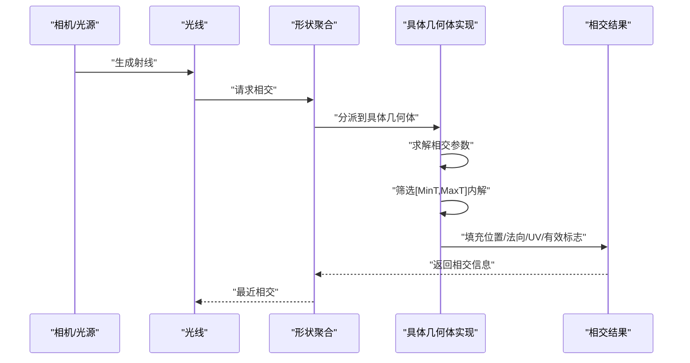
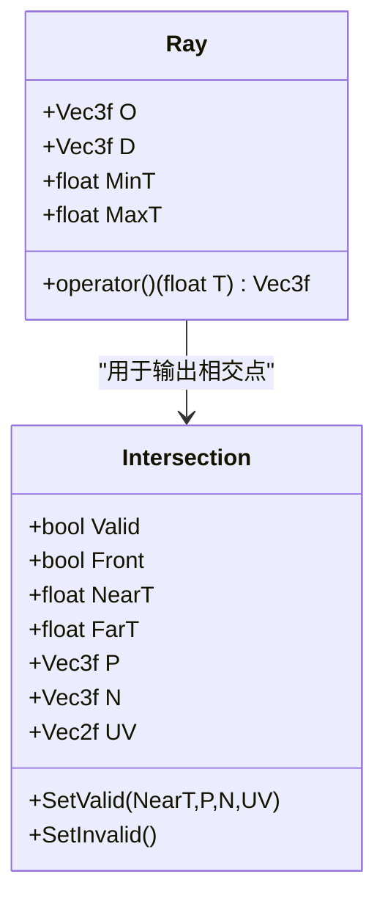
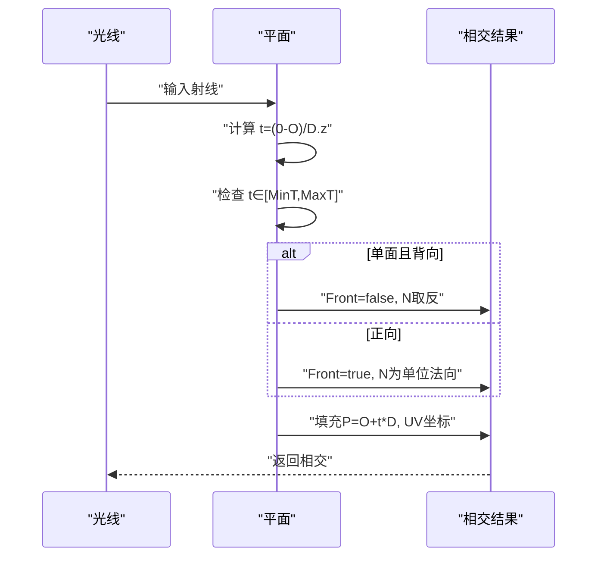
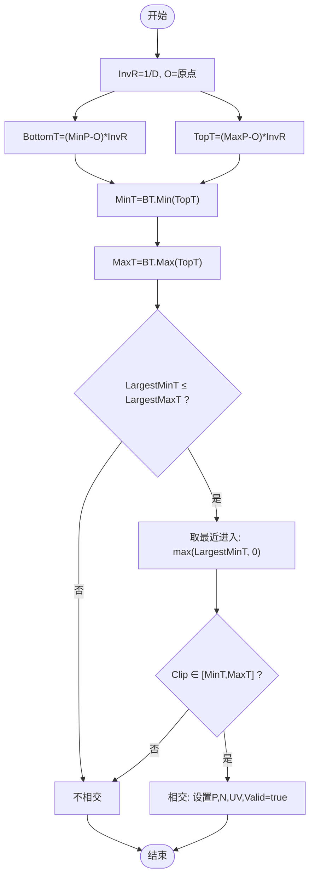
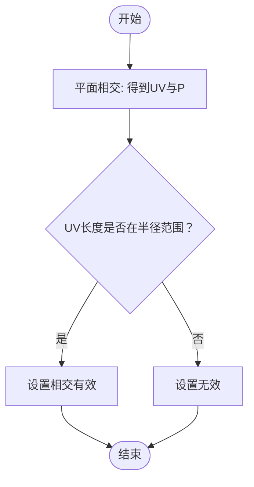
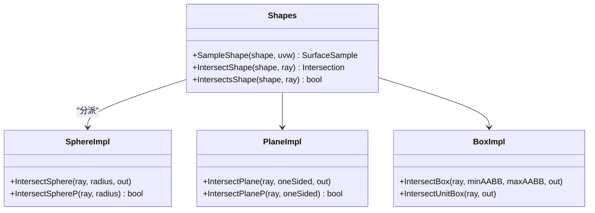
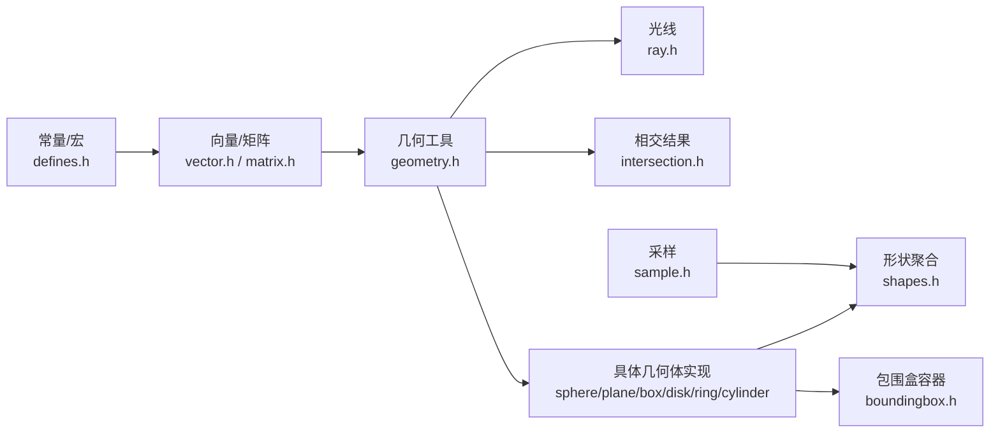

# 几何相交算法

<cite>
**本文档引用的文件**
- [ray.h](file://Source/ray.h)
- [intersection.h](file://Source/intersection.h)
- [geometry.h](file://Source/geometry.h)
- [vector.h](file://Source/vector.h)
- [defines.h](file://Source/defines.h)
- [sphere.h](file://Source/sphere.h)
- [plane.h](file://Source/plane.h)
- [box.h](file://Source/box.h)
- [disk.h](file://Source/disk.h)
- [ring.h](file://Source/ring.h)
- [cylinder.h](file://Source/cylinder.h)
- [boundingbox.h](file://Source/boundingbox.h)
- [sample.h](file://Source/sample.h)
- [matrix.h](file://Source/matrix.h)
- [shapes.h](file://Source/shapes.h)
</cite>

## 目录
1. [引言](#引言)
2. [项目结构](#项目结构)
3. [核心组件](#核心组件)
4. [架构总览](#架构总览)
5. [详细组件分析](#详细组件分析)
6. [依赖关系分析](#依赖关系分析)
7. [性能考虑](#性能考虑)
8. [故障排查指南](#故障排查指南)
9. [结论](#结论)
10. [附录](#附录)

## 引言
本文件系统性梳理该光线追踪渲染器中的几何相交算法，覆盖光线与球体、平面、包围盒、圆盘、环形、柱体等常见几何体的相交测试与采样流程，并解释相交参数的物理意义、边界条件处理、数值稳定性与性能优化策略。文档以代码为依据，辅以可视化图示，帮助读者快速理解并正确应用这些算法。

## 项目结构
该项目采用“按功能模块组织”的方式，几何与相交相关的核心文件分布如下：
- 光线与相交数据结构：ray.h、intersection.h
- 基础几何与向量运算：geometry.h、vector.h、matrix.h、defines.h
- 具体几何体相交与采样：sphere.h、plane.h、box.h、disk.h、ring.h、cylinder.h
- 包围盒与形状聚合：boundingbox.h、shapes.h
- 表面采样与随机数：sample.h



图表来源
- [vector.h:1-582](file://Source/vector.h#L1-L582)
- [matrix.h:1-59](file://Source/matrix.h#L1-L59)
- [geometry.h:1-141](file://Source/geometry.h#L1-L141)
- [ray.h:1-58](file://Source/ray.h#L1-L58)
- [intersection.h:1-81](file://Source/intersection.h#L1-L81)
- [sphere.h:1-173](file://Source/sphere.h#L1-L173)
- [plane.h:1-110](file://Source/plane.h#L1-L110)
- [disk.h:1-77](file://Source/disk.h#L1-L77)
- [ring.h:1-78](file://Source/ring.h#L1-L78)
- [box.h:1-84](file://Source/box.h#L1-L84)
- [cylinder.h:1-132](file://Source/cylinder.h#L1-L132)
- [boundingbox.h:1-79](file://Source/boundingbox.h#L1-L79)
- [shapes.h:1-75](file://Source/shapes.h#L1-L75)
- [sample.h:1-279](file://Source/sample.h#L1-L279)

章节来源
- [ray.h:1-58](file://Source/ray.h#L1-L58)
- [intersection.h:1-81](file://Source/intersection.h#L1-L81)
- [geometry.h:1-141](file://Source/geometry.h#L1-L141)
- [vector.h:1-582](file://Source/vector.h#L1-L582)
- [defines.h:1-114](file://Source/defines.h#L1-L114)
- [sphere.h:1-173](file://Source/sphere.h#L1-L173)
- [plane.h:1-110](file://Source/plane.h#L1-L110)
- [box.h:1-84](file://Source/box.h#L1-L84)
- [disk.h:1-77](file://Source/disk.h#L1-L77)
- [ring.h:1-78](file://Source/ring.h#L1-L78)
- [cylinder.h:1-132](file://Source/cylinder.h#L1-L132)
- [boundingbox.h:1-79](file://Source/boundingbox.h#L1-L79)
- [sample.h:1-279](file://Source/sample.h#L1-L279)
- [matrix.h:1-59](file://Source/matrix.h#L1-L59)
- [shapes.h:1-75](file://Source/shapes.h#L1-L75)

## 核心组件
- 光线类：表示起点、方向、参数范围，支持参数化采样与变换。
- 相交结果类：封装有效标志、最近/最远相交参数、位置、法向、UV坐标等。
- 向量与矩阵：提供点/向量运算、射线变换、球面参数化等工具。
- 形状聚合：统一调度不同几何体的相交与采样。

章节来源
- [ray.h:26-58](file://Source/ray.h#L26-L58)
- [intersection.h:30-81](file://Source/intersection.h#L30-L81)
- [geometry.h:30-141](file://Source/geometry.h#L30-L141)
- [vector.h:450-582](file://Source/vector.h#L450-L582)
- [matrix.h:27-59](file://Source/matrix.h#L27-L59)

## 架构总览
相交流程通常遵循以下步骤：
- 输入：光线（起点、方向、参数范围）
- 计算：针对目标几何体求解相交参数集合
- 过滤：在[MinT, MaxT]范围内选择最近相交
- 输出：填充相交结果（位置、法向、UV、前后表面标记）



图表来源
- [shapes.h:44-72](file://Source/shapes.h#L44-L72)
- [sphere.h:84-140](file://Source/sphere.h#L84-L140)
- [plane.h:41-62](file://Source/plane.h#L41-L62)
- [box.h:51-83](file://Source/box.h#L51-L83)
- [disk.h:37-49](file://Source/disk.h#L37-L49)
- [ring.h:45-57](file://Source/ring.h#L45-L57)

## 详细组件分析

### 光线与相交数据结构
- 光线：包含起点O、方向D、参数范围MinT/MaxT；支持参数化采样P(T)=O+normalize(D)*T。
- 相交结果：包含有效标志、最近/最远参数、位置P、法向N、UV坐标、前后表面标记Front；提供设置有效/无效状态的便捷接口。



图表来源
- [ray.h:26-58](file://Source/ray.h#L26-L58)
- [intersection.h:30-81](file://Source/intersection.h#L30-L81)

章节来源
- [ray.h:26-58](file://Source/ray.h#L26-L58)
- [intersection.h:30-81](file://Source/intersection.h#L30-L81)

### 射线与球体相交
- 数学模型：将射线方程代入球面方程得到关于T的二次方程，通过判别式判断相交性，求根后在[MinT, MaxT]范围内取最近解。
- 算法要点：
  - 使用稳定的求根公式避免灾难性消亡。
  - 对t0/t1排序，确保t0为较小解。
  - 仅当最近解位于有效区间时才视为有效相交。
- 物理意义：NearT为最近入射点参数；P为世界空间相交位置；N为单位法向（指向出射侧）；UV为球面UV映射。

```mermaid
flowchart TD
Start(["开始"]) --> Coeff["计算二次方程系数 a,b,c"]
Coeff --> Disc["计算判别式 disc=b^2-4ac"]
Disc --> Check{"disc < 0 ?"}
Check --> |是| Miss["无实根 -> 不相交"]
Check --> |否| Roots["稳定求根: q=-0.5*(b±sqrt(disc))"]
Roots --> T0T1["求 t0=q/a, t1=c/q 并保证 t0≤t1"]
T0T1 --> NearSel{"选择最近有效解"}
NearSel --> |t0在[MinT,MaxT]| UseT0["使用 t0 作为 NearT"]
NearSel --> |否则t1在[MinT,MaxT]| UseT1["使用 t1 作为 NearT"]
NearSel --> |均不满足| Miss
UseT0 --> Valid["设置相交结果: P,N,UV,Valid=true"]
UseT1 --> Valid
Miss --> End(["结束"])
Valid --> End
```

图表来源
- [sphere.h:28-82](file://Source/sphere.h#L28-L82)
- [sphere.h:84-140](file://Source/sphere.h#L84-L140)

章节来源
- [sphere.h:28-140](file://Source/sphere.h#L28-L140)

### 射线与平面相交
- 数学模型：射线P(t)=O+t*D与平面N·(P-P0)=0求解t。
- 算法要点：
  - 若方向与法向垂直（分母接近零），则平行或共面，无唯一相交。
  - 可选单面模式：根据方向与法向夹角决定Front标志与法向朝向。
  - 支持带尺寸的矩形平面裁剪（UV范围归一化）。



图表来源
- [plane.h:27-62](file://Source/plane.h#L27-L62)
- [plane.h:64-88](file://Source/plane.h#L64-L88)

章节来源
- [plane.h:27-88](file://Source/plane.h#L27-L88)

### 包围盒（AABB）相交（Ray-Box）
- 数学模型：对轴向分别计算进入/离开参数，取全局最大进入与最小离开，若最大进入小于最小离开则相交。
- 算法要点：
  - 使用逆方向加速：InvR=1/D，减少除法次数。
  - 分别计算BottomT与TopT，取Min/Max组合。
  - 仅当最近进入参数在[MinT,MaxT]内时才有效。
  - 根据最近入射点坐标确定法向（六个面之一）。



图表来源
- [box.h:26-49](file://Source/box.h#L26-L49)
- [box.h:51-83](file://Source/box.h#L51-L83)

章节来源
- [box.h:26-83](file://Source/box.h#L26-L83)

### 圆盘与环形相交
- 圆盘：先按平面相交，再检查UV半径是否在半径以内；可选偏移高度。
- 环形：先按平面相交，再检查UV半径在内外半径之间。



图表来源
- [disk.h:27-49](file://Source/disk.h#L27-L49)
- [ring.h:35-57](file://Source/ring.h#L35-L57)

章节来源
- [disk.h:27-77](file://Source/disk.h#L27-L77)
- [ring.h:27-78](file://Source/ring.h#L27-L78)

### 柱体相交（概念说明）
- 实现现状：当前文件中柱体相交函数未完全实现，注释展示了思路（二次方程求解+端面圆盘相交检测）。
- 建议：可参考圆柱方程与端面相交的通用流程，结合AABB/圆盘相交逻辑完成。

章节来源
- [cylinder.h:30-94](file://Source/cylinder.h#L30-L94)

### 形状聚合与采样
- 形状聚合：根据形状类型分派到对应相交/采样函数，便于统一管理。
- 表面采样：提供均匀/重要性采样所需的UVW参数到几何空间的映射。



图表来源
- [shapes.h:31-72](file://Source/shapes.h#L31-L72)
- [sphere.h:28-140](file://Source/sphere.h#L28-L140)
- [plane.h:27-88](file://Source/plane.h#L27-L88)
- [box.h:26-83](file://Source/box.h#L26-L83)

章节来源
- [shapes.h:31-75](file://Source/shapes.h#L31-L75)

## 依赖关系分析
- 几何工具依赖：所有相交实现依赖geometry.h提供的向量运算、球面参数化、射线变换等。
- 常量与精度：RAY_EPS定义了数值稳定性阈值，用于避免除零与浮点误差。
- 数据结构耦合：Ray与Intersection紧密耦合，后者承载前者的相交结果；Shapes统一调度各几何体实现。



图表来源
- [defines.h:71-72](file://Source/defines.h#L71-L72)
- [vector.h:450-582](file://Source/vector.h#L450-L582)
- [geometry.h:30-141](file://Source/geometry.h#L30-L141)
- [ray.h:26-58](file://Source/ray.h#L26-L58)
- [intersection.h:30-81](file://Source/intersection.h#L30-L81)
- [sphere.h:21-173](file://Source/sphere.h#L21-L173)
- [plane.h:21-110](file://Source/plane.h#L21-L110)
- [box.h:21-84](file://Source/box.h#L21-L84)
- [disk.h:21-77](file://Source/disk.h#L21-L77)
- [ring.h:21-78](file://Source/ring.h#L21-L78)
- [cylinder.h:21-132](file://Source/cylinder.h#L21-L132)
- [boundingbox.h:26-79](file://Source/boundingbox.h#L26-L79)
- [shapes.h:21-75](file://Source/shapes.h#L21-L75)
- [sample.h:21-279](file://Source/sample.h#L21-L279)

章节来源
- [defines.h:71-72](file://Source/defines.h#L71-L72)
- [geometry.h:30-141](file://Source/geometry.h#L30-L141)
- [vector.h:450-582](file://Source/vector.h#L450-L582)
- [ray.h:26-58](file://Source/ray.h#L26-L58)
- [intersection.h:30-81](file://Source/intersection.h#L30-L81)
- [shapes.h:21-75](file://Source/shapes.h#L21-L75)

## 性能考虑
- 避免重复开销：
  - 使用InvR=1/D预计算逆方向，减少除法运算。
  - 在求根前先计算判别式，尽早短路。
- 数值稳定性：
  - 使用稳定的求根公式，优先用q=-0.5*(b±sqrt(disc))避免b与sqrt(disc)相近导致的精度损失。
  - 使用RAY_EPS处理接近零的分母，避免不稳定。
- 分支优化：
  - AABB相交先做快速失败（最大进入>最小离开），再进行参数裁剪。
  - 平面相交先检查分母大小，避免无效除法。
- 内存与调用：
  - Intersection尽量复用，减少构造/拷贝。
  - 形状聚合通过switch分派，保持调用路径清晰。

## 故障排查指南
- 常见问题与定位
  - “无相交”或“总是无相交”：检查MinT/MaxT范围是否合理；确认Ray方向是否与几何体同向；核对OneSided设置。
  - “法向错误”：确认Front标志与OneSided逻辑；注意平面背向时法向翻转。
  - “UV异常”：核对UV归一化与坐标系映射（如球面UV、矩形平面UV）。
  - “边界穿透/遗漏”：检查AABB相交时最近进入参数是否被裁剪至[MinT,MaxT]之外。
- 调试建议
  - 打印关键中间变量：t0/t1、LargestMinT/LargestMaxT、UV长度。
  - 使用Ray参数化采样验证P=T处位置是否正确。
  - 对比不同几何体实现的UV范围与坐标系约定。

章节来源
- [sphere.h:28-140](file://Source/sphere.h#L28-L140)
- [plane.h:27-88](file://Source/plane.h#L27-L88)
- [box.h:26-83](file://Source/box.h#L26-L83)
- [disk.h:27-77](file://Source/disk.h#L27-L77)
- [ring.h:27-78](file://Source/ring.h#L27-L78)
- [geometry.h:70-85](file://Source/geometry.h#L70-L85)

## 结论
该代码库提供了完整的光线与多种几何体的相交框架：从光线与相交结果的数据结构，到球体、平面、包围盒、圆盘、环形等具体实现，再到形状聚合与采样工具。算法在数值稳定性与性能方面做了针对性设计（如稳定的求根、InvR预计算、快速失败）。建议在实际工程中结合具体几何与采样需求，严格校验UV与法向一致性，并在边界条件下进行充分测试。

## 附录
- 相交参数的物理意义
  - NearT/FarT：光线参数化下的最近/最远相交距离，用于遮挡剔除与体积步进。
  - P：世界空间相交位置，用于着色与阴影计算。
  - N：单位法向，指向出射侧或根据OneSided决定Front。
  - UV：纹理/BRDF采样的参数域坐标，需与采样器约定一致。
- 边界条件与退化情况
  - 平面：方向与法向垂直（分母接近零）时无唯一解。
  - 球体：判别式非正时无实根；求根时注意数值稳定。
  - AABB：最大进入≥最小离开才相交；最近进入可能被裁剪至无效区间。
  - 圆盘/环形：UV半径超出范围时无效。