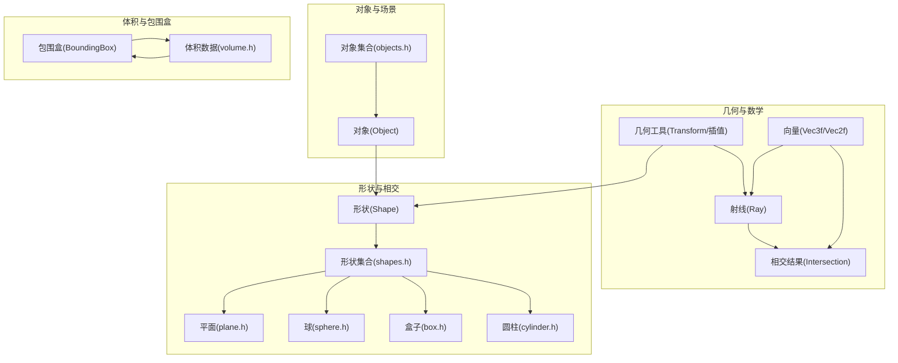
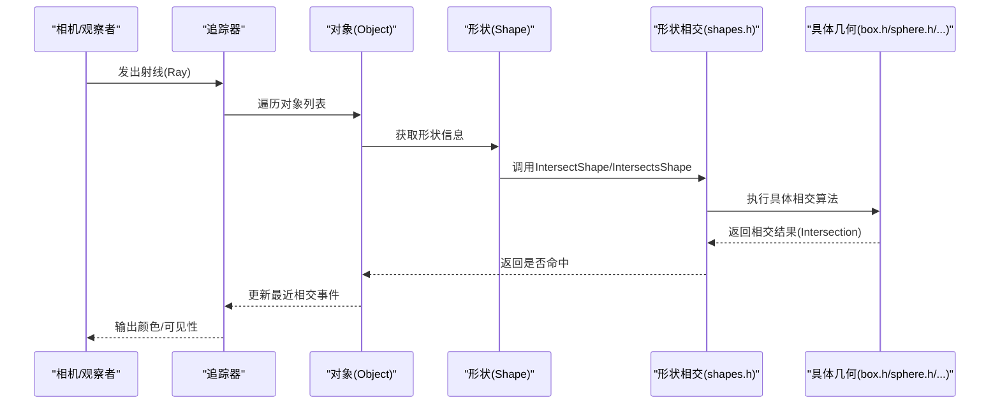
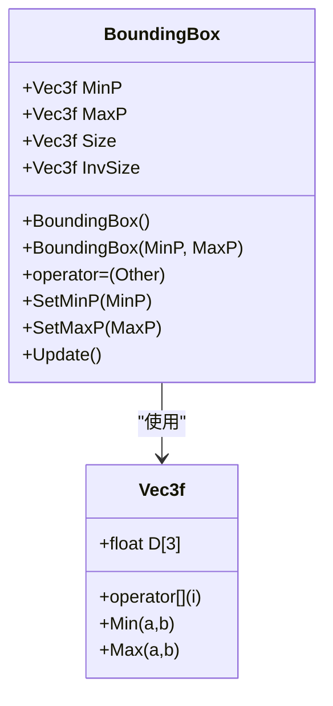
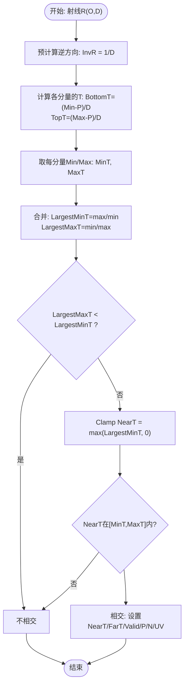
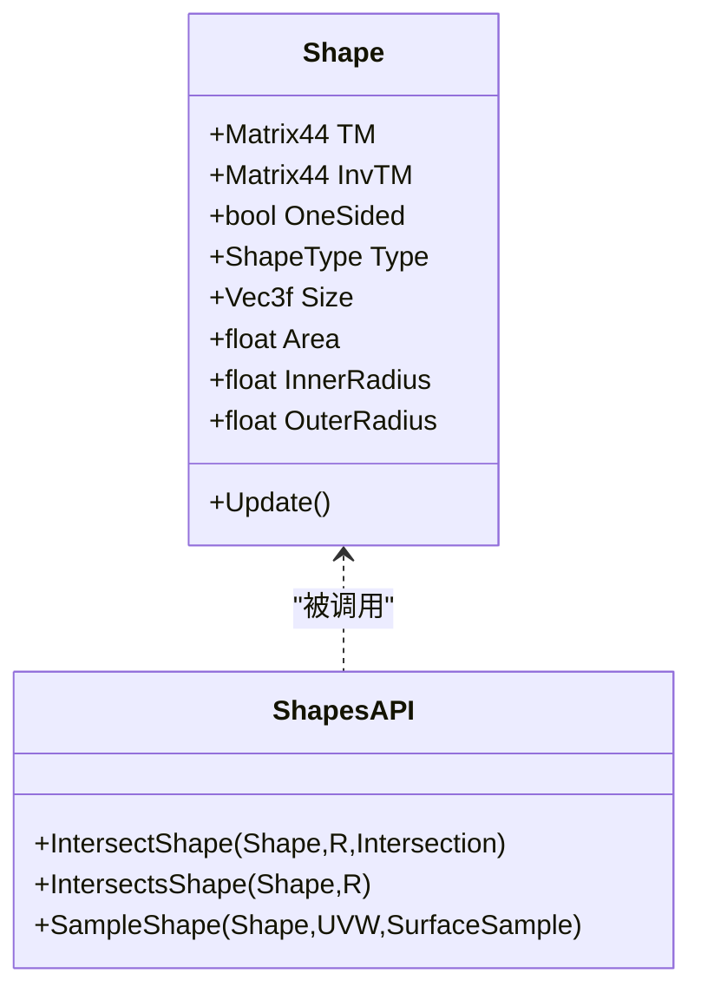
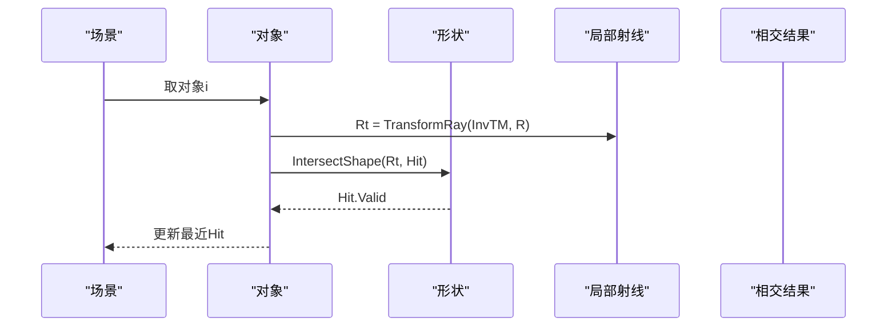
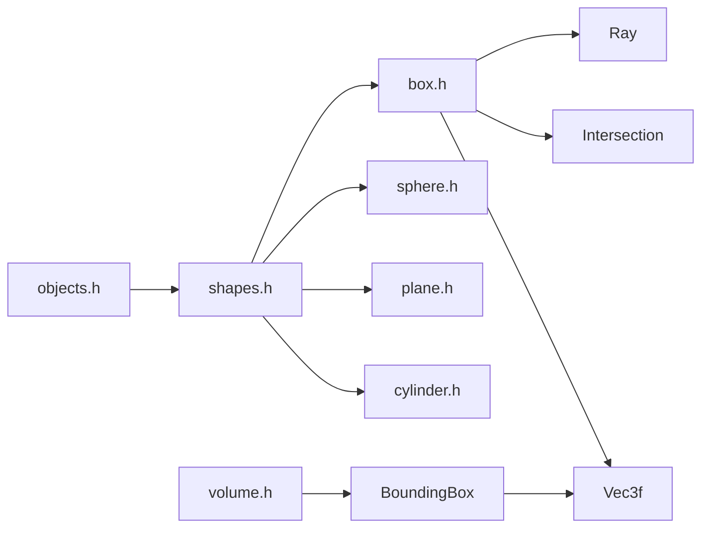

# 包围盒和空间分割

<cite>
**本文引用的文件**
- [boundingbox.h](file://Source/boundingbox.h)
- [box.h](file://Source/box.h)
- [vector.h](file://Source/vector.h)
- [ray.h](file://Source/ray.h)
- [intersection.h](file://Source/intersection.h)
- [geometry.h](file://Source/geometry.h)
- [sphere.h](file://Source/sphere.h)
- [plane.h](file://Source/plane.h)
- [cylinder.h](file://Source/cylinder.h)
- [shape.h](file://Source/shape.h)
- [shapes.h](file://Source/shapes.h)
- [objects.h](file://Source/objects.h)
- [volume.h](file://Source/volume.h)
</cite>

## 目录
1. [引言](#引言)
2. [项目结构](#项目结构)
3. [核心组件](#核心组件)
4. [架构总览](#架构总览)
5. [详细组件分析](#详细组件分析)
6. [依赖关系分析](#依赖关系分析)
7. [性能考量](#性能考量)
8. [故障排查指南](#故障排查指南)
9. [结论](#结论)
10. [附录](#附录)

## 引言
本文件围绕包围盒与空间分割展开，系统阐述包围盒的概念、AABB（轴对齐包围盒）的实现与应用；记录包围盒的构造、合并、包含测试等基础操作；解释其在加速算法中的作用（如BVH构建思路、空间分割策略）；给出相交测试的实现细节与优化技巧，并结合光线相交、碰撞检测、可见性判断等实际应用场景进行说明。同时覆盖边界情况与退化情形的处理方法。

## 项目结构
该代码库采用“按功能域分层”的组织方式：几何原语（球、平面、盒子、圆柱等）、通用向量与射线类型、相交结果封装、形状与对象抽象、以及体积数据结构等模块清晰分离。包围盒作为几何基础设施，贯穿于形状、对象、体积等模块中，用于加速相交查询与空间划分。

**图表来源**
- [vector.h:450-495](file://Source/vector.h#L450-L495)
- [ray.h:26-56](file://Source/ray.h#L26-L56)
- [intersection.h:30-78](file://Source/intersection.h#L30-L78)
- [geometry.h:30-68](file://Source/geometry.h#L30-L68)
- [shape.h:57-113](file://Source/shape.h#L57-L113)
- [shapes.h:44-55](file://Source/shapes.h#L44-L55)
- [plane.h:27-62](file://Source/plane.h#L27-L62)
- [sphere.h:28-140](file://Source/sphere.h#L28-L140)
- [box.h:26-83](file://Source/box.h#L26-L83)
- [cylinder.h:30-94](file://Source/cylinder.h#L30-L94)
- [objects.h:26-44](file://Source/objects.h#L26-L44)
- [volume.h:101-152](file://Source/volume.h#L101-L152)

**章节来源**
- [boundingbox.h:26-77](file://Source/boundingbox.h#L26-L77)
- [vector.h:450-495](file://Source/vector.h#L450-L495)
- [ray.h:26-56](file://Source/ray.h#L26-L56)
- [intersection.h:30-78](file://Source/intersection.h#L30-L78)
- [geometry.h:30-68](file://Source/geometry.h#L30-L68)
- [shape.h:57-113](file://Source/shape.h#L57-L113)
- [shapes.h:44-72](file://Source/shapes.h#L44-L72)
- [plane.h:27-62](file://Source/plane.h#L27-L62)
- [sphere.h:28-140](file://Source/sphere.h#L28-L140)
- [box.h:26-83](file://Source/box.h#L26-L83)
- [cylinder.h:30-94](file://Source/cylinder.h#L30-L94)
- [objects.h:26-82](file://Source/objects.h#L26-L82)
- [volume.h:101-152](file://Source/volume.h#L101-L152)

## 核心组件
- 包围盒 BoundingBox：存储最小/最大顶点、尺寸与逆尺寸，支持更新与设置接口。
- AABB 相交：提供单位盒、任意AABB与盒采样函数，以及快速相交判定。
- 射线与相交：射线类定义参数区间与采样，相交结果封装有效标志、位置、法线、UV等。
- 形状与相交：统一的形状接口与多形体相交/相交判定函数，便于扩展新几何。
- 对象与场景：对象持有形状并参与场景相交与可见性查询。
- 体积数据：体积对象维护自身包围盒，用于采样与梯度计算。

**章节来源**
- [boundingbox.h:26-77](file://Source/boundingbox.h#L26-L77)
- [box.h:26-114](file://Source/box.h#L26-L114)
- [ray.h:26-56](file://Source/ray.h#L26-L56)
- [intersection.h:30-78](file://Source/intersection.h#L30-L78)
- [shapes.h:44-72](file://Source/shapes.h#L44-L72)
- [objects.h:26-82](file://Source/objects.h#L26-L82)
- [volume.h:101-152](file://Source/volume.h#L101-L152)

## 架构总览
下图展示从射线到形状再到对象的相交流程，以及包围盒在体积数据中的角色。

**图表来源**
- [objects.h:26-66](file://Source/objects.h#L26-L66)
- [shapes.h:44-72](file://Source/shapes.h#L44-L72)
- [box.h:51-83](file://Source/box.h#L51-L83)
- [sphere.h:84-140](file://Source/sphere.h#L84-L140)
- [plane.h:41-62](file://Source/plane.h#L41-L62)

## 详细组件分析

### 包围盒类 BoundingBox
- 设计要点
  - 存储最小/最大顶点与尺寸，尺寸为MaxP - MinP，逆尺寸用于快速缩放。
  - 提供默认构造、拷贝赋值、设置最小/最大顶点与更新尺寸的接口。
- 数据结构复杂度
  - 更新操作为O(1)，构造与赋值也为常数时间。
- 边界与退化
  - 默认构造将MinP初始化为正无穷、MaxP为负无穷，适合累积合并。
  - 当未设置任何点时，尺寸与逆尺寸为零，需在使用前确保已合并有效范围。

**图表来源**
- [boundingbox.h:26-77](file://Source/boundingbox.h#L26-L77)
- [vector.h:450-495](file://Source/vector.h#L450-L495)

**章节来源**
- [boundingbox.h:26-77](file://Source/boundingbox.h#L26-L77)
- [vector.h:450-495](file://Source/vector.h#L450-L495)

### AABB 相交与相交判定
- 单位盒与任意AABB相交
  - 使用分量式快速相交：分别沿x/y/z轴求进入/离开参数，取最大进入与最小离开，若最大进入小于最小离开且均在射线参数范围内则命中。
  - 命中时可计算交点位置与面法线（根据交点坐标接近边界确定）。
- 相交判定（快速版）
  - 仅返回布尔值，避免构造完整相交结果，适合早期剔除。
- 盒内包含与表面采样
  - 提供盒内包含测试与均匀表面采样（按面分配权重）。

**图表来源**
- [box.h:51-83](file://Source/box.h#L51-L83)

**章节来源**
- [box.h:26-114](file://Source/box.h#L26-L114)

### 射线与相交结果
- 射线
  - 定义起点O、方向D、参数范围[MinT, MaxT]，支持按参数采样点。
- 相交结果
  - 标志位Valid指示是否命中；Front指示内外表面；NearT/FarT为最近/最远交点参数；P为交点位置；N为法线；UV为纹理坐标。
  - 提供SetValid/SetInvalid辅助函数，便于快速设置状态。

**章节来源**
- [ray.h:26-56](file://Source/ray.h#L26-L56)
- [intersection.h:30-78](file://Source/intersection.h#L30-L78)

### 形状与相交接口
- 形状
  - 统一描述几何类型、尺寸、面积、变换矩阵及其逆矩阵，支持更新面积。
- 形状相交
  - 提供IntersectShape/IntersectsShape，内部根据类型分派到具体几何相交函数（平面、球、盒、圆盘、环、圆柱）。
- 表面采样
  - 提供按UVW的均匀表面采样，输出位置、法线与UV。

**图表来源**
- [shape.h:57-113](file://Source/shape.h#L57-L113)
- [shapes.h:44-72](file://Source/shapes.h#L44-L72)

**章节来源**
- [shape.h:57-113](file://Source/shape.h#L57-L113)
- [shapes.h:31-72](file://Source/shapes.h#L31-L72)

### 对象与场景相交
- 对象持有形状，通过变换矩阵将世界坐标下的射线转换到局部坐标系，再调用形状相交接口。
- 场景遍历所有对象，选择最近的相交事件作为最终结果。

**图表来源**
- [objects.h:26-66](file://Source/objects.h#L26-L66)
- [geometry.h:54-67](file://Source/geometry.h#L54-L67)

**章节来源**
- [objects.h:26-82](file://Source/objects.h#L26-L82)
- [geometry.h:54-67](file://Source/geometry.h#L54-L67)

### 体积数据与包围盒
- 体积对象维护自身包围盒，用于：
  - 空间映射：将世界坐标转换为体数据局部坐标；
  - 梯度计算：沿xyz三个方向的步长由最小间距决定；
  - 可视化/裁剪：基于包围盒进行早期剔除。
- 构造时根据分辨率与间距计算物理尺寸，并设置包围盒上下界。

**章节来源**
- [volume.h:101-152](file://Source/volume.h#L101-L152)

## 依赖关系分析
- 包围盒依赖向量类型（Vec3f），用于点运算与尺寸计算。
- AABB相交依赖射线与相交结果，以及向量的分量级最小/最大操作。
- 形状与对象依赖几何工具（变换矩阵、向量变换）。
- 体积数据依赖包围盒进行空间映射与梯度步长设定。

**图表来源**
- [boundingbox.h:26-77](file://Source/boundingbox.h#L26-L77)
- [box.h:26-83](file://Source/box.h#L26-L83)
- [ray.h:26-56](file://Source/ray.h#L26-L56)
- [intersection.h:30-78](file://Source/intersection.h#L30-L78)
- [shapes.h:44-55](file://Source/shapes.h#L44-L55)
- [objects.h:26-44](file://Source/objects.h#L26-L44)
- [volume.h:101-152](file://Source/volume.h#L101-L152)

**章节来源**
- [boundingbox.h:26-77](file://Source/boundingbox.h#L26-L77)
- [box.h:26-83](file://Source/box.h#L26-L83)
- [shapes.h:44-55](file://Source/shapes.h#L44-L55)
- [objects.h:26-44](file://Source/objects.h#L26-L44)
- [volume.h:101-152](file://Source/volume.h#L101-L152)

## 性能考量
- AABB相交
  - 分量式求解避免三角函数与开方，常数时间复杂度；建议优先使用IntersectBoxP进行早期剔除。
  - 利用InvR与分量Min/Max减少分支与比较次数。
- 向量与数值
  - 使用分量级Min/Max与Clamp可减少循环与分支，提升GPU友好性。
- 体积采样
  - 通过包围盒与逆尺寸进行线性映射，避免多次除法；梯度步长取最小间距，保证稳定与高效。
- 场景遍历
  - 先对对象集合进行包围盒相交预筛选，再进行精确相交，可显著降低复杂几何的调用次数。

[本节为通用性能讨论，无需特定文件来源]

## 故障排查指南
- 空包围盒
  - 现象：尺寸或逆尺寸为零，导致映射异常。
  - 处理：确保至少一次合并或显式设置MinP/MaxP后调用Update。
- 退化情况
  - 现象：射线与面平行或相切，导致T无定义或无效。
  - 处理：检查射线方向分量，避免除零；在AABB相交中使用InvR并注意分母为无穷的情形。
- 边界精度
  - 现象：交点恰好位于边界，法线判定出现歧义。
  - 处理：使用微小偏移（如0.0001f）进行边界判定，确保法线方向一致。
- 相交顺序
  - 现象：多个对象相交，最近距离错误。
  - 处理：在场景遍历时维护最小T并及时更新最近相交事件。

**章节来源**
- [boundingbox.h:29-35](file://Source/boundingbox.h#L29-L35)
- [box.h:75-82](file://Source/box.h#L75-L82)
- [objects.h:46-66](file://Source/objects.h#L46-L66)

## 结论
包围盒与AABB是实现高效光线追踪与体积渲染的关键基础设施。通过统一的形状接口与相交API，项目实现了对多种几何类型的灵活支持；借助包围盒与快速相交判定，可在场景层面进行有效的早期剔除与空间分割。配合体积对象的包围盒映射与梯度计算，可进一步提升渲染质量与性能。针对边界与退化情形的处理策略，有助于提升算法鲁棒性。

[本节为总结性内容，无需特定文件来源]

## 附录
- AABB相交流程（概念示意）
  - 输入：射线R(O,D)、AABB(Min,Max)
  - 步骤：计算InvR；沿各分量求BottomT/TopT；取MinT/MaxT；合并得到LargestMinT/LargestMaxT；Clamp NearT；检查参数范围；设置交点与法线；输出命中标志。
- 空间分割策略（概念）
  - 在构建场景层次时，优先依据包围盒的轴对齐投影长度进行分割，使子节点的包围盒尽可能紧密，降低相交测试的代价。
- 应用示例
  - 光线相交：先用AABB相交快速判定，再进行精确相交。
  - 碰撞检测：利用对象包围盒与场景包围盒的相交测试进行粗筛。
  - 可见性判断：基于包围盒与摄像机Frustum的相交进行剔除。

[本节为概念性内容，无需特定文件来源]