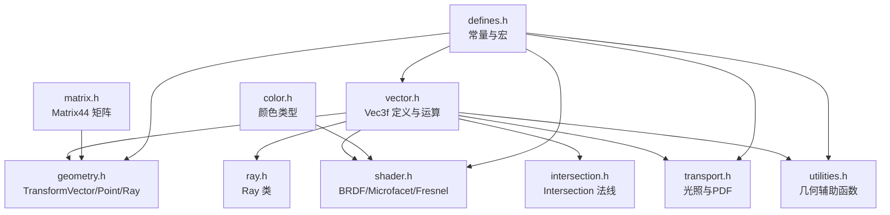
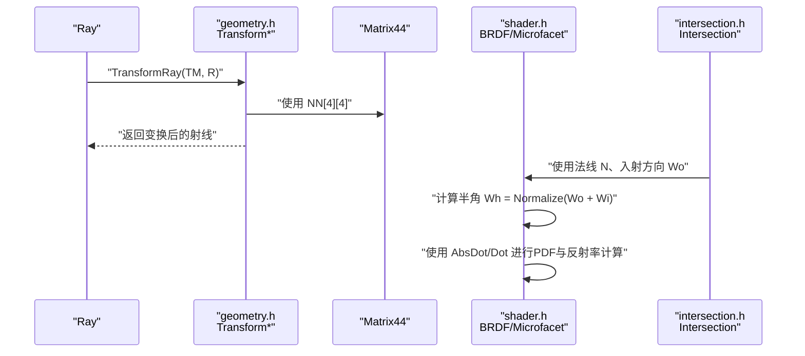
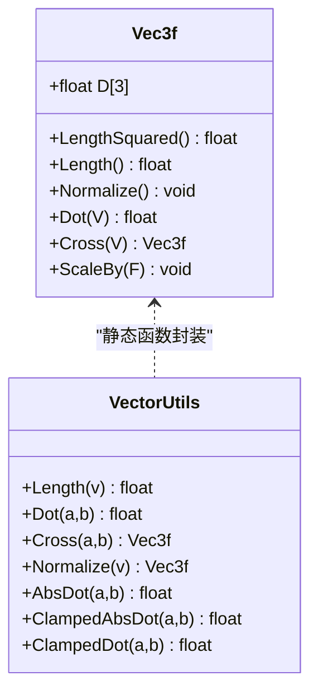
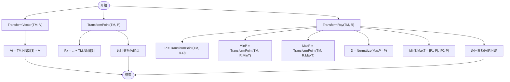
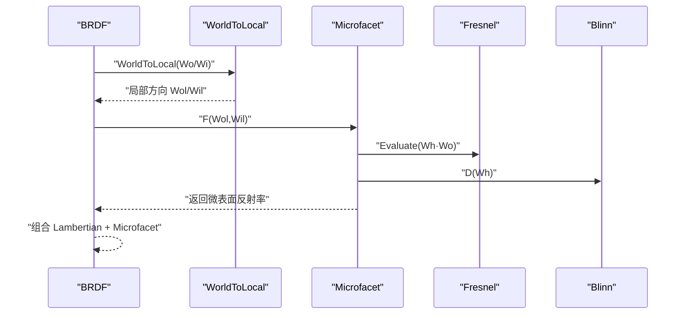
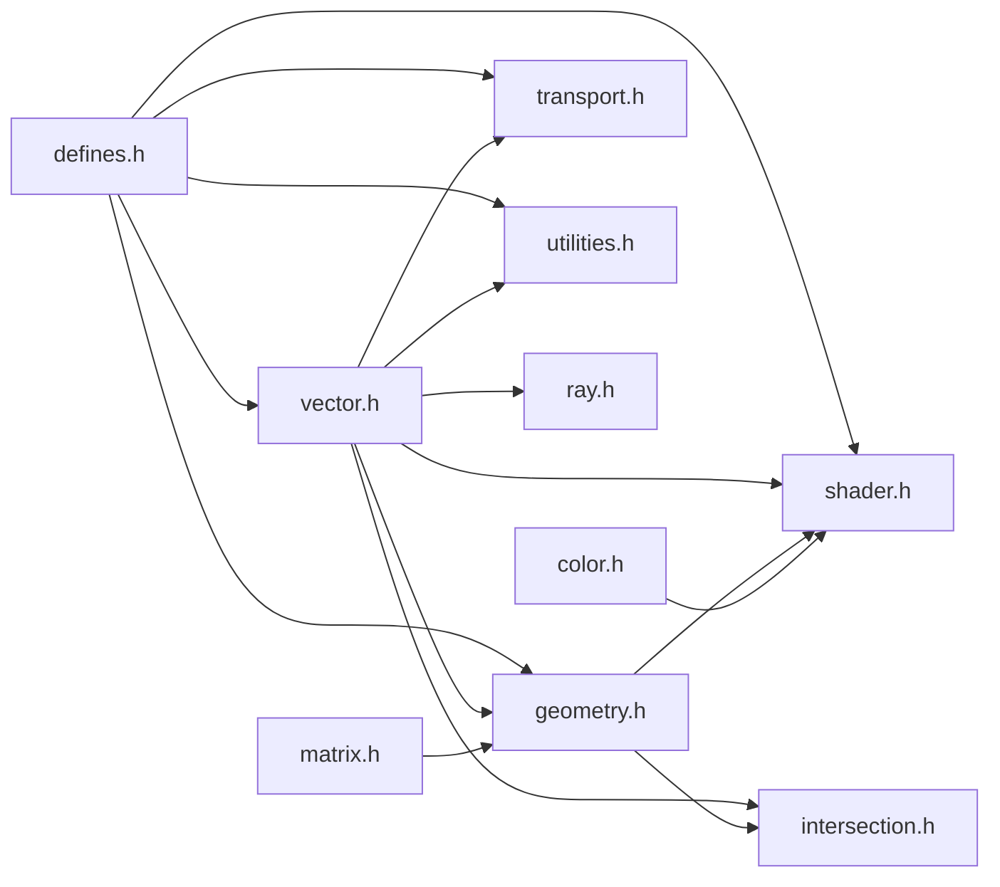

# 向量运算

<cite>
**本文引用的文件**
- [vector.h](file://Source/vector.h)
- [geometry.h](file://Source/geometry.h)
- [matrix.h](file://Source/matrix.h)
- [ray.h](file://Source/ray.h)
- [shader.h](file://Source/shader.h)
- [intersection.h](file://Source/intersection.h)
- [color.h](file://Source/color.h)
- [transport.h](file://Source/transport.h)
- [utilities.h](file://Source/utilities.h)
- [defines.h](file://Source/defines.h)
</cite>

## 目录
1. [简介](#简介)
2. [项目结构](#项目结构)
3. [核心组件](#核心组件)
4. [架构总览](#架构总览)
5. [详细组件分析](#详细组件分析)
6. [依赖关系分析](#依赖关系分析)
7. [性能考量](#性能考量)
8. [故障排查指南](#故障排查指南)
9. [结论](#结论)
10. [附录](#附录)

## 简介
本文件系统性地阐述了该渲染框架中的向量运算体系，重点覆盖：
- Vec3f 向量类的实现细节与接口
- 基本运算（加减乘除、标量乘除）
- 几何运算（点积、叉积、长度、归一化）
- 变换函数（向量变换 TransformVector、点变换 TransformPoint、射线变换 TransformRay）
- 在渲染中的关键应用：光线传播、法线计算、光照计算、微表面材质模型
- 数值精度与边界情况处理建议

## 项目结构
与向量运算直接相关的核心文件如下：
- Source/vector.h：向量模板宏与 Vec3f 的定义、基本运算与几何运算
- Source/geometry.h：矩阵与向量/点/射线的变换函数
- Source/matrix.h：4×4 矩阵类
- Source/ray.h：射线类，依赖 Vec3f
- Source/shader.h：BRDF/Microfacet/Fresnel 等材质模型中大量使用向量运算
- Source/intersection.h：交点数据结构，包含法线向量
- Source/color.h：颜色类型，与向量运算配合用于渲染结果
- Source/transport.h、utilities.h：光照与几何辅助函数中广泛使用向量点积、夹角与距离
- Source/defines.h：常量与宏（如 PI、Clamp、HOST_DEVICE）

图表来源
- [vector.h:1-582](file://Source/vector.h#L1-L582)
- [geometry.h:1-141](file://Source/geometry.h#L1-L141)
- [matrix.h:1-59](file://Source/matrix.h#L1-L59)
- [ray.h:1-58](file://Source/ray.h#L1-L58)
- [shader.h:1-486](file://Source/shader.h#L1-L486)
- [intersection.h:1-81](file://Source/intersection.h#L1-L81)
- [color.h:1-287](file://Source/color.h#L1-L287)
- [transport.h:70-158](file://Source/transport.h#L70-L158)
- [utilities.h:50-70](file://Source/utilities.h#L50-L70)
- [defines.h:1-114](file://Source/defines.h#L1-L114)

章节来源
- [vector.h:1-582](file://Source/vector.h#L1-L582)
- [geometry.h:1-141](file://Source/geometry.h#L1-L141)
- [matrix.h:1-59](file://Source/matrix.h#L1-L59)
- [ray.h:1-58](file://Source/ray.h#L1-L58)
- [shader.h:1-486](file://Source/shader.h#L1-L486)
- [intersection.h:1-81](file://Source/intersection.h#L1-L81)
- [color.h:1-287](file://Source/color.h#L1-L287)
- [transport.h:70-158](file://Source/transport.h#L70-L158)
- [utilities.h:50-70](file://Source/utilities.h#L50-L70)
- [defines.h:1-114](file://Source/defines.h#L1-L114)

## 核心组件
- Vec3f：三维浮点向量，支持分量访问、加减乘除、标量乘除、点积、叉积、长度、归一化、Clamp、Min/Max 等。
- TransformVector/TransformPoint/TransformRay：基于 4×4 矩阵对向量、点、射线进行变换。
- Ray：由起点与方向组成，支持按参数 t 计算位置。
- Intersection：包含交点位置、法线、UV 等信息，法线通常需要归一化。
- 材质与光照：BRDF、Microfacet、Fresnel、相位函数等均以向量运算为核心。

章节来源
- [vector.h:450-495](file://Source/vector.h#L450-L495)
- [geometry.h:30-68](file://Source/geometry.h#L30-L68)
- [ray.h:26-56](file://Source/ray.h#L26-L56)
- [intersection.h:30-78](file://Source/intersection.h#L30-L78)
- [shader.h:29-483](file://Source/shader.h#L29-L483)

## 架构总览
向量运算贯穿渲染管线的关键路径：
- 光线生成与传播：Ray 提供按参数 t 的位置计算，方向通常需要归一化。
- 几何变换：TransformVector/Point/Ray 将世界坐标系下的几何元素转换到目标坐标系。
- 光照计算：通过点积、夹角、距离平方等向量运算计算入射/出射方向与法线的关系，以及能量传输。
- 材质模型：BRDF/Microfacet 使用点积、归一化、半角向量等进行散射采样与概率密度计算。

图表来源
- [geometry.h:54-68](file://Source/geometry.h#L54-L68)
- [matrix.h:27-56](file://Source/matrix.h#L27-L56)
- [shader.h:130-274](file://Source/shader.h#L130-L274)
- [intersection.h:30-78](file://Source/intersection.h#L30-L78)

## 详细组件分析

### Vec3f 向量类与基本运算
- 分量访问与构造：支持默认、拷贝、全分量赋值、数组构造、三元构造。
- 基本运算：逐分量加减、逐分量乘除、标量乘除、取负、比较运算。
- 几何运算：Length/LengthSquared、Normalize；Dot/Cross；Clamp/Min/Max；Lerp。
- 静态工具：Length/Dot/Cross/Normalize/AbsDot/ClampedAbsDot/ClampedDot 等。

图表来源
- [vector.h:450-495](file://Source/vector.h#L450-L495)
- [vector.h:543-552](file://Source/vector.h#L543-L552)

章节来源
- [vector.h:450-495](file://Source/vector.h#L450-L495)
- [vector.h:543-552](file://Source/vector.h#L543-L552)

### 向量加减乘除与标量运算
- 逐分量加减：对应分量相加/相减。
- 逐分量乘除：对应分量相乘/相除。
- 标量乘除：向量与标量逐分量相乘/相除。
- 比较运算：逐分量比较，支持 <、<=、>、>=、==、!=。
- Min/Max/Clamp：逐分量最小/最大与范围钳制。

章节来源
- [vector.h:130-210](file://Source/vector.h#L130-L210)
- [vector.h:295-361](file://Source/vector.h#L295-L361)

### 点积、叉积与归一化
- 点积 Dot：用于计算夹角余弦、投影长度、能量权重。
- 叉积 Cross：用于构造正交基（如法线）、半角向量的垂直分量。
- 归一化 Normalize：确保方向向量单位长度，避免数值误差累积。
- AbsDot/ClampedAbsDot/ClampedDot：在光照与PDF计算中避免负值或超界。

章节来源
- [vector.h:477-485](file://Source/vector.h#L477-L485)
- [vector.h:546-549](file://Source/vector.h#L546-L549)

### 变换函数：TransformVector/TransformPoint/TransformRay
- TransformVector：仅做旋转/缩放/剪切变换，不参与平移。
- TransformPoint：参与平移，适用于顶点坐标。
- TransformRay：对射线起点和平移后的终点进行变换，并重新计算方向与 t 区间。

图表来源
- [geometry.h:30-68](file://Source/geometry.h#L30-L68)
- [matrix.h:27-56](file://Source/matrix.h#L27-L56)

章节来源
- [geometry.h:30-68](file://Source/geometry.h#L30-L68)
- [matrix.h:27-56](file://Source/matrix.h#L27-L56)

### Ray 类与光线传播
- 构造：起点 O、方向 D、参数区间 MinT/MaxT。
- 按参数 t 计算位置：O + Normalize(D) * t。
- 方向归一化确保 t 的几何意义一致。

章节来源
- [ray.h:26-56](file://Source/ray.h#L26-L56)

### Intersection 与法线
- 交点结构包含 Valid、Front、NearT/FarT、P、N、UV。
- 法线 N 通常需要归一化以保证光照计算稳定。

章节来源
- [intersection.h:30-78](file://Source/intersection.h#L30-L78)

### 材质与光照中的向量运算
- BRDF：构造局部坐标系 Nu/Nv/Nn，WorldToLocal/LocalToWorld 使用 Dot/Cross 进行基变换。
- Microfacet：使用半角向量 Wh = Normalize(Wo + Wi)，结合 Fresnel 与分布函数 D 计算反射率与 PDF。
- Fresnel：根据入射角与折射率计算反射率，注意 Snell 定律导致的全反射分支。
- 相位函数：各向同性相位函数用于体积散射。

图表来源
- [shader.h:316-413](file://Source/shader.h#L316-L413)
- [shader.h:198-274](file://Source/shader.h#L198-L274)
- [shader.h:79-128](file://Source/shader.h#L79-L128)

章节来源
- [shader.h:316-413](file://Source/shader.h#L316-L413)
- [shader.h:198-274](file://Source/shader.h#L198-L274)
- [shader.h:79-128](file://Source/shader.h#L79-L128)

### 光照计算中的向量应用
- 光源到表面的向量 W = Normalize(P2 - P1)，用于计算几何因子。
- AbsDot 用于确保法线与入射方向的夹角项非负，避免能量反向。
- 距离平方用于计算光源 PDF 与能量衰减。

章节来源
- [transport.h:70-110](file://Source/transport.h#L70-L110)
- [utilities.h:53-57](file://Source/utilities.h#L53-L57)

## 依赖关系分析
- vector.h 是基础，被 geometry.h、ray.h、shader.h、intersection.h、transport.h、utilities.h 广泛依赖。
- geometry.h 依赖 matrix.h 提供变换矩阵。
- shader.h 依赖 geometry.h 的变换函数与 defines.h 的数学常量。
- color.h 与 vector.h 协作，用于颜色空间转换与渲染结果表达。

图表来源
- [vector.h:1-582](file://Source/vector.h#L1-L582)
- [geometry.h:1-141](file://Source/geometry.h#L1-L141)
- [matrix.h:1-59](file://Source/matrix.h#L1-L59)
- [ray.h:1-58](file://Source/ray.h#L1-L58)
- [shader.h:1-486](file://Source/shader.h#L1-L486)
- [intersection.h:1-81](file://Source/intersection.h#L1-L81)
- [color.h:1-287](file://Source/color.h#L1-L287)
- [transport.h:70-158](file://Source/transport.h#L70-L158)
- [utilities.h:50-70](file://Source/utilities.h#L50-L70)
- [defines.h:1-114](file://Source/defines.h#L1-L114)

章节来源
- [vector.h:1-582](file://Source/vector.h#L1-L582)
- [geometry.h:1-141](file://Source/geometry.h#L1-L141)
- [matrix.h:1-59](file://Source/matrix.h#L1-L59)
- [ray.h:1-58](file://Source/ray.h#L1-L58)
- [shader.h:1-486](file://Source/shader.h#L1-L486)
- [intersection.h:1-81](file://Source/intersection.h#L1-L81)
- [color.h:1-287](file://Source/color.h#L1-L287)
- [transport.h:70-158](file://Source/transport.h#L70-L158)
- [utilities.h:50-70](file://Source/utilities.h#L50-L70)
- [defines.h:1-114](file://Source/defines.h#L1-L114)

## 性能考量
- 向量运算多为逐分量操作，开销低且易于并行化。
- 归一化前先计算 LengthSquared 可减少一次 sqrt 的开销（Vec3f 已提供 LengthSquared）。
- 点积与叉积是光照与材质模型的核心，应尽量复用中间结果（如半角向量 Wh）。
- 在 GPU 上，使用 HOST_DEVICE 宏确保在设备端高效执行。

## 故障排查指南
- 归一化失败（零向量）：当向量长度为 0 时，Normalize 会除以 0。应在调用前检查 Length > 0 或使用安全版本。
- 夹角与点积异常：AbsDot/ClampedAbsDot/ClampedDot 用于钳制范围，避免负值或超界导致的物理错误。
- 变换方向不正确：TransformRay 中方向使用 Normalize(MaxP - Rt.O)，若 MaxP 与 O 相等会导致零向量。请确保 MinT/MaxT 设置合理。
- 数值精度：使用 defines.h 中的 RAY_EPS 等小量处理边界情况，避免除零或不稳定行为。
- 法线未归一化：在材质模型与光照计算前，确保法线 N 已 Normalize。

章节来源
- [vector.h:469-475](file://Source/vector.h#L469-L475)
- [geometry.h:58-65](file://Source/geometry.h#L58-L65)
- [defines.h:71-72](file://Source/defines.h#L71-L72)

## 结论
该框架以 Vec3f 为核心，构建了完整的向量运算体系，并将其无缝集成到光线传播、几何变换、光照与材质模型中。通过点积、叉积、归一化与变换函数，实现了从基础几何到复杂材质散射的完整渲染流程。遵循本文的数值处理与边界条件建议，可有效提升稳定性与性能。

## 附录
- 常用宏与常量：PI、INV_PI、RAY_EPS、HOST_DEVICE 等，见 defines.h。
- 颜色空间与向量协作：color.h 提供 RGB/XYZ 转换，便于将向量运算结果映射到最终显示颜色。