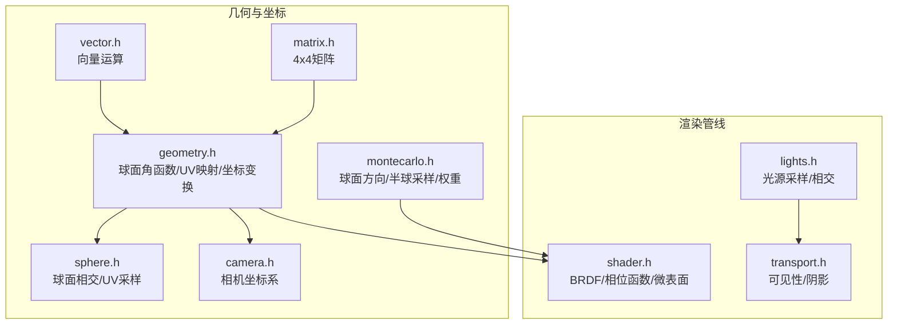
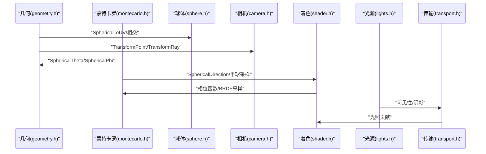
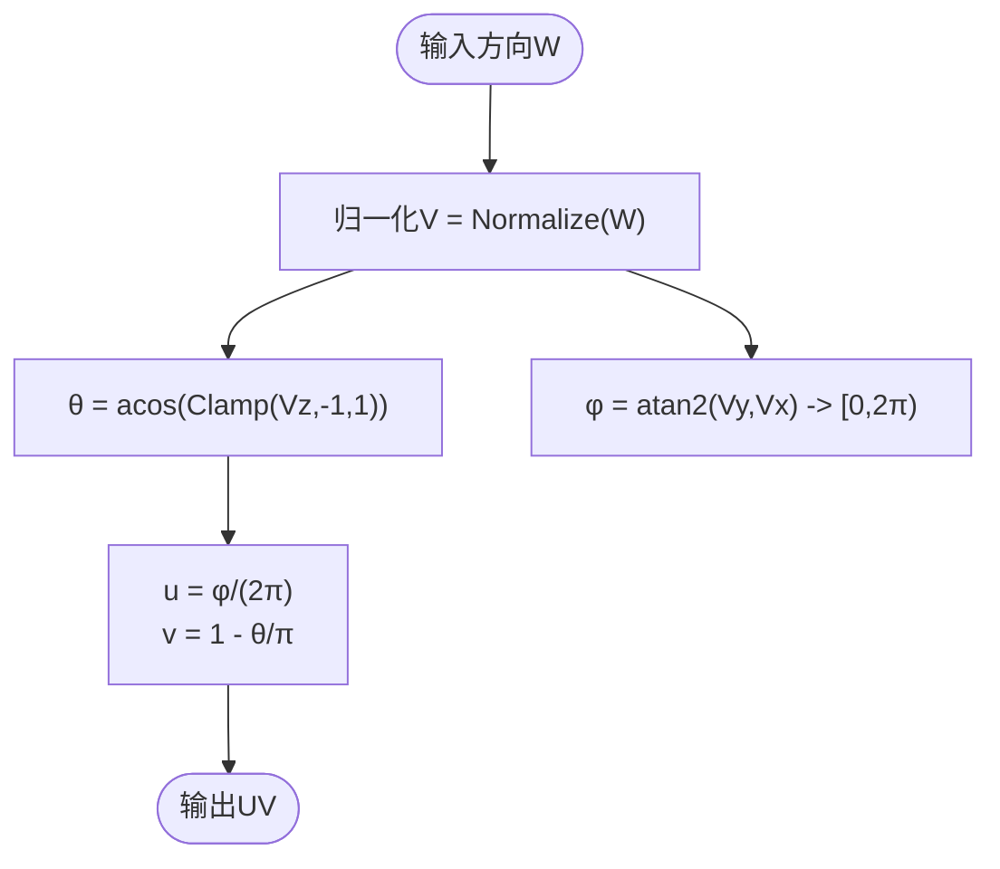
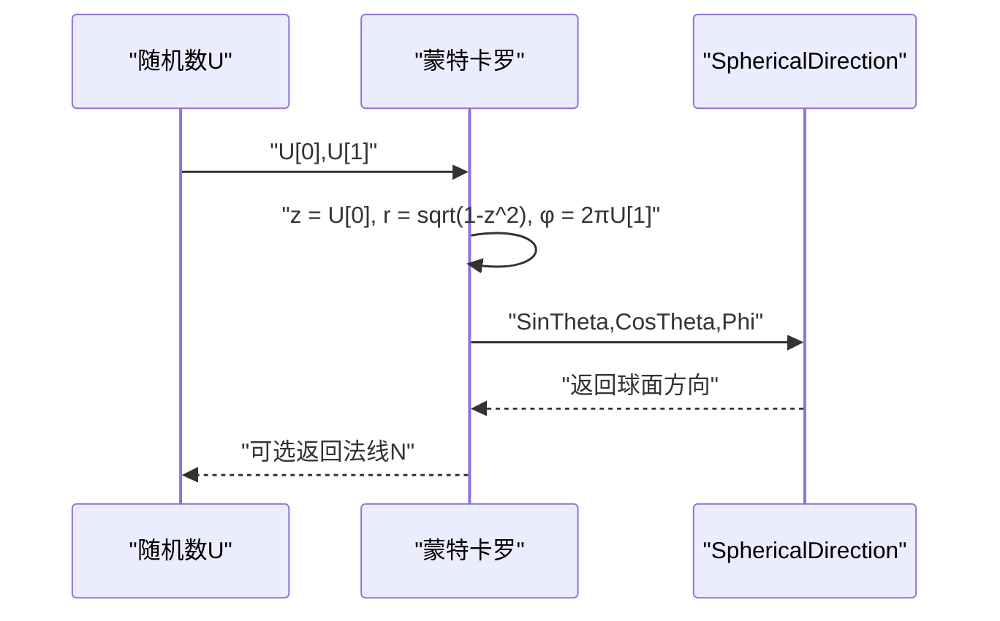
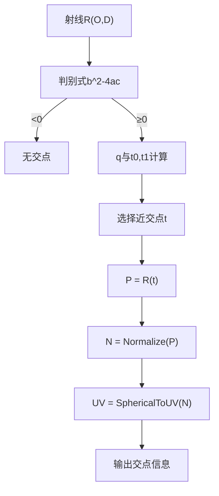
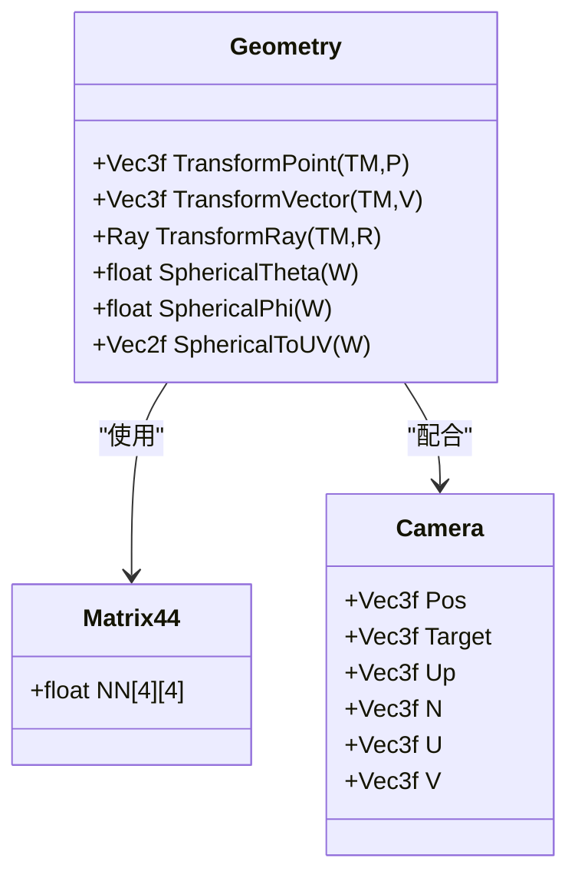
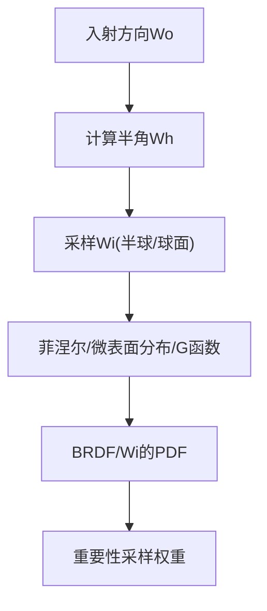
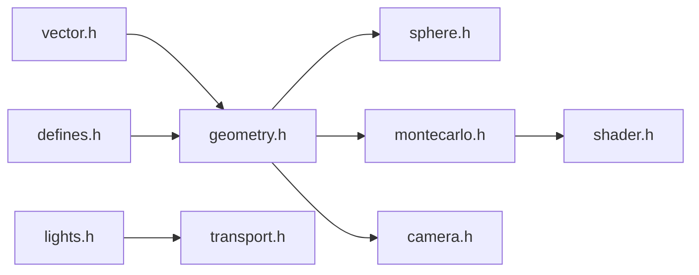

# 坐标系和球面坐标

<cite>
**本文引用的文件**
- [geometry.h](file://Source/geometry.h)
- [montecarlo.h](file://Source/montecarlo.h)
- [sphere.h](file://Source/sphere.h)
- [vector.h](file://Source/vector.h)
- [matrix.h](file://Source/matrix.h)
- [camera.h](file://Source/camera.h)
- [shader.h](file://Source/shader.h)
- [lights.h](file://Source/lights.h)
- [transport.h](file://Source/transport.h)
- [defines.h](file://Source/defines.h)
</cite>

## 目录
1. [引言](#引言)
2. [项目结构](#项目结构)
3. [核心组件](#核心组件)
4. [架构总览](#架构总览)
5. [详细组件分析](#详细组件分析)
6. [依赖关系分析](#依赖关系分析)
7. [性能考量](#性能考量)
8. [故障排查指南](#故障排查指南)
9. [结论](#结论)
10. [附录](#附录)

## 引言
本文件围绕笛卡尔坐标系与球面坐标系之间的转换与应用展开，重点覆盖以下主题：
- 球面坐标系的数学定义与实现：SphericalTheta、SphericalPhi 函数的数学原理与数值稳定性处理。
- 球面坐标到纹理坐标的映射 SphericalToUV 的算法与边界条件。
- 极坐标系统在光线方向表示、光源分布采样、相位函数计算中的应用。
- 实际坐标变换示例：世界坐标、局部坐标、观察坐标之间的转换流程与注意事项。
- 角度范围、边界条件与数值稳定性的处理策略。

## 项目结构
该代码库采用模块化组织，涉及几何、向量、矩阵、相机、着色器、蒙特卡洛采样、光源与传输等多个模块。与坐标系和球面坐标直接相关的核心文件如下：
- 几何与坐标转换：geometry.h（球面角函数、球面到UV映射）
- 蒙特卡罗采样与球面方向生成：montecarlo.h（球面方向、半球采样、权重）
- 球体相交与UV采样：sphere.h（单位球相交、球面采样）
- 向量与点运算：vector.h（点积、叉积、归一化、夹角等）
- 变换矩阵：matrix.h（4×4矩阵）
- 坐标变换与相机系统：geometry.h、camera.h（点/向量/射线变换、相机坐标系）
- 着色器与相位函数：shader.h（BRDF、相位函数、微表面模型）
- 光源与可见性：lights.h、transport.h（光源采样、阴影与可见性）

**图表来源**
- [geometry.h:70-85](file://Source/geometry.h#L70-L85)
- [montecarlo.h:162-182](file://Source/montecarlo.h#L162-L182)
- [sphere.h:139-162](file://Source/sphere.h#L139-L162)
- [vector.h:477-485](file://Source/vector.h#L477-L485)
- [matrix.h:27-56](file://Source/matrix.h#L27-L56)
- [camera.h:66-68](file://Source/camera.h#L66-L68)
- [shader.h:276-314](file://Source/shader.h#L276-L314)
- [lights.h:44-87](file://Source/lights.h#L44-L87)
- [transport.h:47-56](file://Source/transport.h#L47-L56)

**章节来源**
- [geometry.h:70-85](file://Source/geometry.h#L70-L85)
- [montecarlo.h:162-182](file://Source/montecarlo.h#L162-L182)
- [sphere.h:139-162](file://Source/sphere.h#L139-L162)
- [vector.h:477-485](file://Source/vector.h#L477-L485)
- [matrix.h:27-56](file://Source/matrix.h#L27-L56)
- [camera.h:66-68](file://Source/camera.h#L66-L68)
- [shader.h:276-314](file://Source/shader.h#L276-L314)
- [lights.h:44-87](file://Source/lights.h#L44-L87)
- [transport.h:47-56](file://Source/transport.h#L47-L56)

## 核心组件
- 球面角函数：SphericalTheta、SphericalPhi 提供从三维方向到球面参数的映射，并对输入进行数值稳定处理。
- 球面到UV映射：SphericalToUV 将单位球上的方向映射到纹理空间的(u,v)坐标，遵循标准投影约定。
- 球面方向生成：SphericalDirection 支持多种形式的球面方向构造，包括以基向量或法线为参考的定向球面方向。
- 半球采样与权重：SampleHemisphere、CosineWeightedHemisphere、ConcentricSampleDisk 等用于重要性采样。
- 坐标变换：TransformPoint、TransformVector、TransformRay 提供世界/局部/观察坐标之间的转换。
- 相位函数与BRDF：IsotropicPhase、BRDF、Microfacet 等在散射建模中广泛使用球面坐标表示入射/出射方向。

**章节来源**
- [geometry.h:70-85](file://Source/geometry.h#L70-L85)
- [montecarlo.h:162-182](file://Source/montecarlo.h#L162-L182)
- [montecarlo.h:72-84](file://Source/montecarlo.h#L72-L84)
- [montecarlo.h:139-155](file://Source/montecarlo.h#L139-L155)
- [montecarlo.h:86-137](file://Source/montecarlo.h#L86-L137)
- [geometry.h:43-68](file://Source/geometry.h#L43-L68)
- [shader.h:276-314](file://Source/shader.h#L276-L314)
- [shader.h:316-413](file://Source/shader.h#L316-L413)

## 架构总览
下图展示了坐标系统在渲染管线中的交互关系：几何层负责球面角与UV映射；采样层负责球面方向与半球采样；变换层负责坐标系转换；着色层负责相位函数与BRDF；光源与传输层负责可见性与光照贡献。

**图表来源**
- [geometry.h:70-85](file://Source/geometry.h#L70-L85)
- [montecarlo.h:162-182](file://Source/montecarlo.h#L162-L182)
- [sphere.h:139-162](file://Source/sphere.h#L139-L162)
- [camera.h:66-68](file://Source/camera.h#L66-L68)
- [shader.h:276-314](file://Source/shader.h#L276-L314)
- [lights.h:44-87](file://Source/lights.h#L44-L87)
- [transport.h:47-56](file://Source/transport.h#L47-L56)

## 详细组件分析

### 组件A：球面角函数与球面到UV映射
- SphericalTheta：计算方向与正Z轴的夹角，使用Clamp确保输入在[-1,1]范围内，避免反余弦域错误。
- SphericalPhi：计算方向在XY平面上的方位角，使用atan2保证象限正确，并将负值映射到[0,2π]。
- SphericalToUV：将单位方向映射到纹理空间(u,v)，其中u对应方位角，v对应极角，且v方向翻转以匹配常见纹理坐标约定。

**图表来源**
- [geometry.h:70-85](file://Source/geometry.h#L70-L85)

**章节来源**
- [geometry.h:70-85](file://Source/geometry.h#L70-L85)

### 组件B：球面方向生成与半球采样
- SphericalDirection：支持三种形式：
  - 仅由sinθ、cosθ、φ构造球面方向。
  - 使用三个基向量x、y、z线性组合构造定向球面方向。
  - 以法线N为参考，通过辅助基向量构建局部坐标系后生成方向。
- SampleHemisphere/CosineWeightedHemisphere：在半球上进行重要性采样，结合cosθ权重，提高采样效率。
- ConcentricSampleDisk：将平方域均匀分布映射到圆盘，避免中心退化，常用于半球采样的预处理。

**图表来源**
- [montecarlo.h:72-84](file://Source/montecarlo.h#L72-L84)
- [montecarlo.h:139-155](file://Source/montecarlo.h#L139-L155)
- [montecarlo.h:162-182](file://Source/montecarlo.h#L162-L182)

**章节来源**
- [montecarlo.h:72-84](file://Source/montecarlo.h#L72-L84)
- [montecarlo.h:139-155](file://Source/montecarlo.h#L139-L155)
- [montecarlo.h:162-182](file://Source/montecarlo.h#L162-L182)
- [montecarlo.h:86-137](file://Source/montecarlo.h#L86-L137)

### 组件C：球面相交与UV采样
- IntersectSphere/IntersectUnitSphere：求解射线与球的相交，计算最近交点、法线与UV坐标。
- SampleUnitSphere/SampleSphere：在球表面进行均匀采样，返回位置、法线与球面坐标(u,v)。

**图表来源**
- [sphere.h:84-140](file://Source/sphere.h#L84-L140)
- [geometry.h:81-85](file://Source/geometry.h#L81-L85)

**章节来源**
- [sphere.h:84-140](file://Source/sphere.h#L84-L140)
- [sphere.h:152-170](file://Source/sphere.h#L152-L170)
- [geometry.h:81-85](file://Source/geometry.h#L81-L85)

### 组件D：坐标变换与相机系统
- TransformPoint/TransformVector/TransformRay：基于4×4矩阵进行点、向量与射线的变换，支持世界/局部/观察坐标系切换。
- 相机坐标系：N、U、V构成相机局部坐标系，用于屏幕空间与世界空间的转换。

**图表来源**
- [matrix.h:27-56](file://Source/matrix.h#L27-L56)
- [geometry.h:43-68](file://Source/geometry.h#L43-L68)
- [geometry.h:70-85](file://Source/geometry.h#L70-L85)
- [camera.h:66-68](file://Source/camera.h#L66-L68)

**章节来源**
- [matrix.h:27-56](file://Source/matrix.h#L27-L56)
- [geometry.h:43-68](file://Source/geometry.h#L43-L68)
- [geometry.h:70-85](file://Source/geometry.h#L70-L85)
- [camera.h:66-68](file://Source/camera.h#L66-L68)

### 组件E：相位函数与BRDF中的极坐标应用
- IsotropicPhase：各向同性相位函数，PDF为常数，采样时使用球面均匀采样。
- BRDF/Microfacet：在微表面模型中使用半角向量与球面坐标表示入射/出射方向，结合几何遮蔽函数与菲涅尔项。

**图表来源**
- [shader.h:276-314](file://Source/shader.h#L276-L314)
- [shader.h:316-413](file://Source/shader.h#L316-L413)
- [montecarlo.h:162-182](file://Source/montecarlo.h#L162-L182)

**章节来源**
- [shader.h:276-314](file://Source/shader.h#L276-L314)
- [shader.h:316-413](file://Source/shader.h#L316-L413)
- [montecarlo.h:162-182](file://Source/montecarlo.h#L162-L182)

## 依赖关系分析
- 几何层依赖向量运算（点积、叉积、归一化）与常量定义（π、INV_PI等）。
- 蒙特卡罗层依赖几何层的球面角函数与球面方向生成。
- 球体模块依赖几何层的UV映射与向量归一化。
- 着色层依赖蒙特卡罗层的方向采样与几何层的球面参数。
- 光源与传输层依赖几何层的变换与可见性判断。

**图表来源**
- [vector.h:477-485](file://Source/vector.h#L477-L485)
- [defines.h:58-70](file://Source/defines.h#L58-L70)
- [geometry.h:70-85](file://Source/geometry.h#L70-L85)
- [sphere.h:139-162](file://Source/sphere.h#L139-L162)
- [montecarlo.h:162-182](file://Source/montecarlo.h#L162-L182)
- [shader.h:276-314](file://Source/shader.h#L276-L314)
- [camera.h:66-68](file://Source/camera.h#L66-L68)
- [lights.h:44-87](file://Source/lights.h#L44-L87)
- [transport.h:47-56](file://Source/transport.h#L47-L56)

**章节来源**
- [vector.h:477-485](file://Source/vector.h#L477-L485)
- [defines.h:58-70](file://Source/defines.h#L58-L70)
- [geometry.h:70-85](file://Source/geometry.h#L70-L85)
- [sphere.h:139-162](file://Source/sphere.h#L139-L162)
- [montecarlo.h:162-182](file://Source/montecarlo.h#L162-L182)
- [shader.h:276-314](file://Source/shader.h#L276-L314)
- [camera.h:66-68](file://Source/camera.h#L66-L68)
- [lights.h:44-87](file://Source/lights.h#L44-L87)
- [transport.h:47-56](file://Source/transport.h#L47-L56)

## 性能考量
- 数学函数调用：acos、asin、atan2、sqrt等在GPU路径下需注意精度与分支开销，建议尽量减少重复计算并复用中间结果（如SinTheta、CosTheta）。
- 数值稳定性：SphericalTheta中对输入进行Clamp，避免反余弦域错误；SphericalPhi使用atan2避免除零与象限错误。
- 采样效率：CosineWeightedHemisphere与ConcentricSampleDisk降低方差，提升收敛速度。
- 内存访问：UV映射与纹理查询应尽量连续，避免频繁的非缓存访问。

## 故障排查指南
- 球面角异常：
  - 症状：θ或φ出现NaN或不连续。
  - 排查：确认输入方向已归一化；检查Clamp范围是否被外部修改；验证atan2参数顺序。
- UV映射翻转：
  - 症状：v坐标上下颠倒。
  - 排查：核对SphericalToUV中v的翻转逻辑与纹理坐标约定。
- 半球采样退化：
  - 症状：中心区域采样密度异常。
  - 排查：确认使用ConcentricSampleDisk而非直接极坐标映射；检查z与r的计算顺序。
- 变换错误：
  - 症状：点/向量变换后方向或位置异常。
  - 排查：核对矩阵类型（旋转/平移/缩放）与TransformPoint/TransformVector的使用场景。

**章节来源**
- [geometry.h:70-85](file://Source/geometry.h#L70-L85)
- [montecarlo.h:86-137](file://Source/montecarlo.h#L86-L137)
- [montecarlo.h:72-84](file://Source/montecarlo.h#L72-L84)
- [geometry.h:43-68](file://Source/geometry.h#L43-L68)

## 结论
本代码库在坐标系与球面坐标方面提供了完整的工具链：从球面角函数与UV映射，到球面方向生成与半球采样，再到坐标变换与相位函数/BRDF应用。通过严格的数值稳定处理与高效的采样策略，能够可靠地支撑光线传播、光源采样与材质散射的渲染需求。实际工程中，应重点关注输入数据的归一化、角度范围与边界条件的处理，以及采样策略与几何变换的一致性。

## 附录
- 常量定义：π、2π、1/π、1/2π、4π等常量在defines.h中集中管理，便于统一控制与跨平台兼容。
- 球面坐标约定：θ∈[0,π]，φ∈[0,2π)，与UV映射一一对应。

**章节来源**
- [defines.h:58-70](file://Source/defines.h#L58-L70)