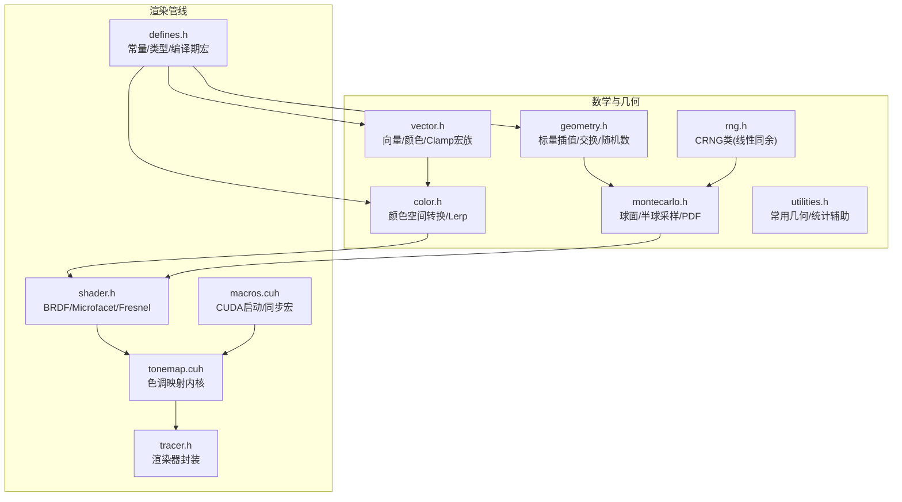
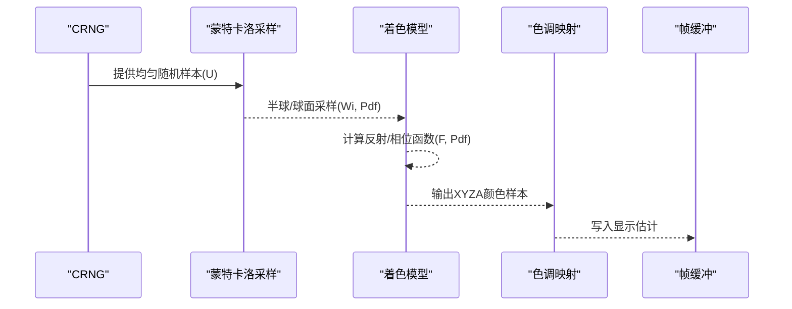
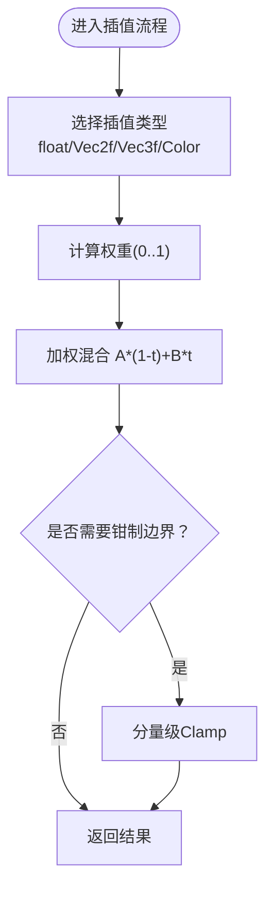
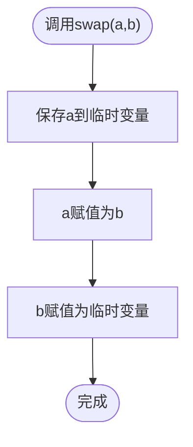
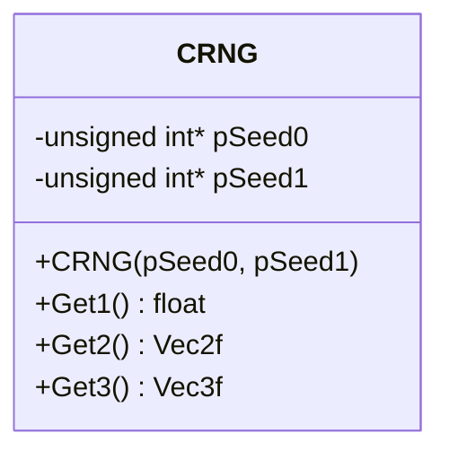
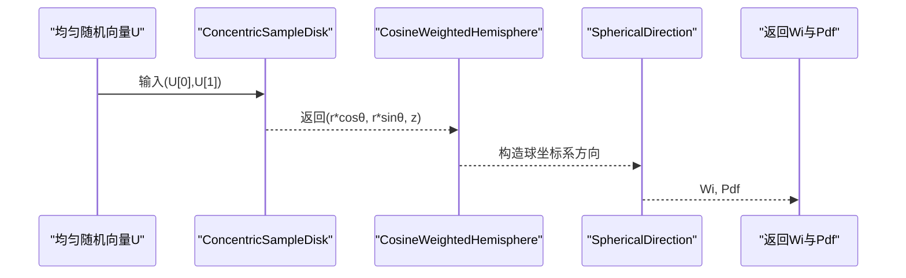
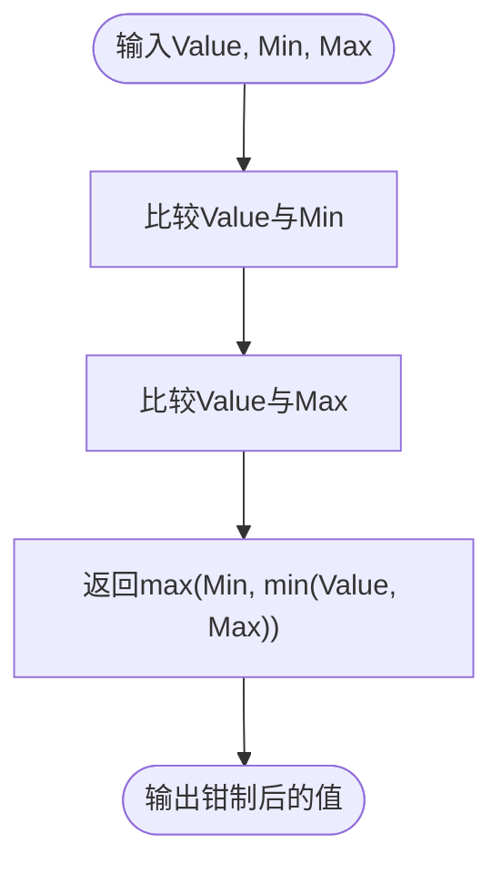
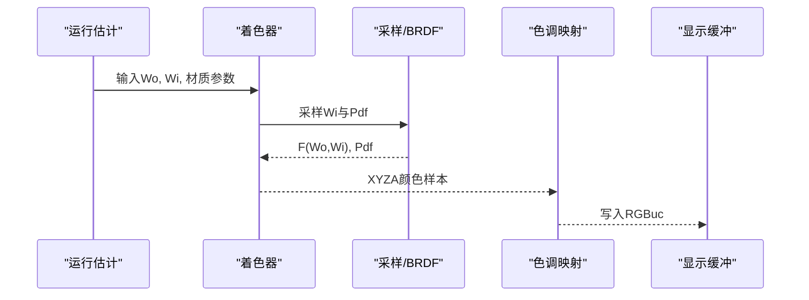
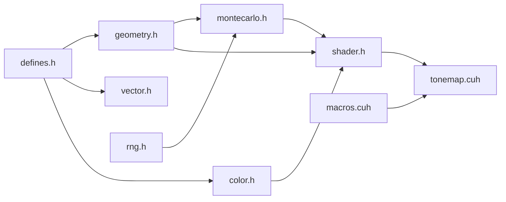

# 实用数学函数

<cite>
**本文引用的文件**
- [geometry.h](file://Source/geometry.h)
- [vector.h](file://Source/vector.h)
- [color.h](file://Source/color.h)
- [montecarlo.h](file://Source/montecarlo.h)
- [rng.h](file://Source/rng.h)
- [tonemap.cuh](file://Source/tonemap.cuh)
- [shader.h](file://Source/shader.h)
- [utilities.h](file://Source/utilities.h)
- [macros.cuh](file://Source/macros.cuh)
- [defines.h](file://Source/defines.h)
- [tracer.h](file://Source/tracer.h)
</cite>

## 目录
1. [引言](#引言)
2. [项目结构](#项目结构)
3. [核心组件](#核心组件)
4. [架构总览](#架构总览)
5. [详细组件分析](#详细组件分析)
6. [依赖分析](#依赖分析)
7. [性能考虑](#性能考虑)
8. [故障排查指南](#故障排查指南)
9. [结论](#结论)
10. [附录](#附录)

## 引言
本文件系统化梳理并深入解析本项目中的实用数学函数与辅助工具，覆盖以下主题：
- 插值函数：float 标量线性插值、向量与颜色的插值实现及在渲染中的应用
- 交换函数：整型与浮点型的就地交换，以及在排序与求解中的作用
- 随机数生成：基于线性同余与位拼接的浮点随机数生成器及其在蒙特卡洛采样中的使用
- 数值处理：Clamp 边界钳制、向量与颜色的分量级边界处理策略
- 渲染算法中的应用：颜色混合、纹理采样、动画过渡、抗锯齿、色调映射等
- 性能优化、数值精度与平台兼容性建议

## 项目结构
该代码库采用“按功能域分层”的组织方式，数学与几何基础位于 Source 目录，渲染管线通过着色器、采样与色调映射等模块协同工作。

图示来源
- [geometry.h:87-140](file://Source/geometry.h#L87-L140)
- [vector.h:397-582](file://Source/vector.h#L397-L582)
- [color.h:59-287](file://Source/color.h#L59-L287)
- [montecarlo.h:27-229](file://Source/montecarlo.h#L27-L229)
- [rng.h:26-68](file://Source/rng.h#L26-L68)
- [utilities.h:25-70](file://Source/utilities.h#L25-L70)
- [shader.h:29-486](file://Source/shader.h#L29-L486)
- [tonemap.cuh:29-68](file://Source/tonemap.cuh#L29-L68)
- [tracer.h:31-58](file://Source/tracer.h#L31-L58)
- [macros.cuh:27-105](file://Source/macros.cuh#L27-L105)
- [defines.h:37-114](file://Source/defines.h#L37-L114)

章节来源
- [geometry.h:87-140](file://Source/geometry.h#L87-L140)
- [vector.h:397-582](file://Source/vector.h#L397-L582)
- [color.h:59-287](file://Source/color.h#L59-L287)
- [montecarlo.h:27-229](file://Source/montecarlo.h#L27-L229)
- [rng.h:26-68](file://Source/rng.h#L26-L68)
- [utilities.h:25-70](file://Source/utilities.h#L25-L70)
- [shader.h:29-486](file://Source/shader.h#L29-L486)
- [tonemap.cuh:29-68](file://Source/tonemap.cuh#L29-L68)
- [tracer.h:31-58](file://Source/tracer.h#L31-L58)
- [macros.cuh:27-105](file://Source/macros.cuh#L27-L105)
- [defines.h:37-114](file://Source/defines.h#L37-L114)

## 核心组件
- 标量与向量插值
  - float 标量线性插值：用于动画过渡、曝光估计融合等
  - Vec2f/Vec3f 插值：用于位置/方向插值
  - ColorRGBf/ColorXYZf/ColorXYZAf 插值：用于颜色混合与色调映射
- 交换函数
  - 支持 int 与 float 的就地交换，便于快速排序与数值求解
- 随机数生成
  - CRNG 类：基于两路线性同余与位拼接生成 [-1,1] 区间均匀分布的浮点样本
  - 配合蒙特卡洛采样模块进行球面/半球/圆盘采样
- 数值处理
  - Clamp 宏族：对单分量与向量/颜色进行边界钳制
  - 向量与颜色的分量级比较与最小/最大运算

章节来源
- [geometry.h:87-140](file://Source/geometry.h#L87-L140)
- [vector.h:27-44](file://Source/vector.h#L27-L44)
- [vector.h:345-361](file://Source/vector.h#L345-L361)
- [color.h:260-287](file://Source/color.h#L260-L287)
- [montecarlo.h:72-222](file://Source/montecarlo.h#L72-L222)
- [rng.h:26-68](file://Source/rng.h#L26-L68)

## 架构总览
渲染管线中数学函数的协作关系如下：

图示来源
- [rng.h:26-68](file://Source/rng.h#L26-L68)
- [montecarlo.h:72-222](file://Source/montecarlo.h#L72-L222)
- [shader.h:415-486](file://Source/shader.h#L415-L486)
- [tonemap.cuh:29-68](file://Source/tonemap.cuh#L29-L68)

## 详细组件分析

### 组件A：标量与向量/颜色插值
- float 线性插值：在 geometry.h 中提供标量插值，适用于曝光估计的移动平均融合、时间轴过渡等
- Vec2f/Vec3f 插值：在 vector.h 中定义，用于位置/方向的平滑过渡
- 颜色插值：在 color.h 中定义多种颜色类型的插值，用于颜色混合与色调映射

图示来源
- [geometry.h:87-90](file://Source/geometry.h#L87-L90)
- [vector.h:534](file://Source/vector.h#L534)
- [vector.h:552](file://Source/vector.h#L552)
- [color.h:262](file://Source/color.h#L262)
- [color.h:266](file://Source/color.h#L266)
- [color.h:278](file://Source/color.h#L278)

章节来源
- [geometry.h:87-90](file://Source/geometry.h#L87-L90)
- [vector.h:534](file://Source/vector.h#L534)
- [vector.h:552](file://Source/vector.h#L552)
- [color.h:262](file://Source/color.h#L262)
- [color.h:266](file://Source/color.h#L266)
- [color.h:278](file://Source/color.h#L278)

### 组件B：交换函数
- 提供 int 与 float 的就地交换，支持指针与引用两种形式
- 典型用途：快速排序、选择排序、求解过程中的元素交换

图示来源
- [geometry.h:92-133](file://Source/geometry.h#L92-L133)

章节来源
- [geometry.h:92-133](file://Source/geometry.h#L92-L133)

### 组件C：随机数生成（CRNG）
- 基于两路线性同余生成器，通过位拼接构造 IEEE 浮点数，得到 [-1,1] 区间的均匀分布
- 提供 Get1/Get2/Get3 接口，分别输出标量与二维/三维样本
- 在蒙特卡洛采样中作为输入 U 使用

图示来源
- [rng.h:26-68](file://Source/rng.h#L26-L68)

章节来源
- [rng.h:26-68](file://Source/rng.h#L26-L68)

### 组件D：蒙特卡洛采样与几何函数
- 球面/半球/圆盘采样：UniformSampleSphereSurface/UniformSampleHemisphere/CosineWeightedHemisphere/ConcentricSampleDisk
- 角度与方位函数：SphericalTheta/SphericalPhi/SphericalToUV
- PDF 与几何判断：AbsCosTheta/CosTheta/SameHemisphere 等

图示来源
- [montecarlo.h:86-155](file://Source/montecarlo.h#L86-L155)
- [montecarlo.h:162-182](file://Source/montecarlo.h#L162-L182)

章节来源
- [montecarlo.h:72-222](file://Source/montecarlo.h#L72-L222)

### 组件E：数值处理与边界钳制（Clamp）
- 单分量 Clamp：对标量进行上下界钳制
- 向量/颜色 Clamp 宏族：对每个分量独立钳制，保证颜色与向量在合法范围
- 在着色与色调映射中广泛使用，避免溢出与负值

图示来源
- [vector.h:40-43](file://Source/vector.h#L40-L43)
- [vector.h:345-361](file://Source/vector.h#L345-L361)
- [color.h:66](file://Source/color.h#L66)
- [color.h:83](file://Source/color.h#L83)
- [color.h:102](file://Source/color.h#L102)

章节来源
- [vector.h:40-43](file://Source/vector.h#L40-L43)
- [vector.h:345-361](file://Source/vector.h#L345-L361)
- [color.h:66](file://Source/color.h#L66)
- [color.h:83](file://Source/color.h#L83)
- [color.h:102](file://Source/color.h#L102)

### 组件F：渲染中的应用与示例
- 颜色混合：在着色器与色调映射中使用颜色插值与 Clamp
- 纹理采样：结合蒙特卡洛采样生成的 Wi/Pdf 进行双向反射分布函数评估
- 动画过渡：使用 float 插值实现曝光估计或参数的平滑过渡
- 抗锯齿：通过多采样（多随机样本）降低噪声，提升图像质量
- 色调映射：将 HDR XYZA 转换为显示可用的 RGBuc，并进行曝光与伽马修正

图示来源
- [shader.h:415-486](file://Source/shader.h#L415-L486)
- [tonemap.cuh:29-68](file://Source/tonemap.cuh#L29-L68)

章节来源
- [shader.h:415-486](file://Source/shader.h#L415-L486)
- [tonemap.cuh:29-68](file://Source/tonemap.cuh#L29-L68)

## 依赖分析
- 几何与数学基础
  - geometry.h 依赖 defines.h（常量与编译期宏），提供标量插值、交换与随机数接口
  - vector.h 依赖 defines.h 与 enums.h，提供向量/颜色与 Clamp 宏族
  - color.h 依赖 vector.h，提供颜色空间转换与插值
- 蒙特卡洛与随机数
  - montecarlo.h 依赖 geometry.h（角度与三角函数）、rng.h（随机样本）
  - rng.h 依赖 geometry.h（向量类型）
- 渲染与着色
  - shader.h 依赖 montecarlo.h 与 geometry.h，实现 BRDF、微表面与菲涅尔
  - tonemap.cuh 依赖 geometry.h 与 color.h，执行色调映射
- CUDA 启动与同步
  - macros.cuh 提供网格/块维度计算与内核启动宏
  - wrapper.cuh 提供 CUDA 错误处理与内存管理封装

图示来源
- [defines.h:37-114](file://Source/defines.h#L37-L114)
- [geometry.h:87-140](file://Source/geometry.h#L87-L140)
- [vector.h:397-582](file://Source/vector.h#L397-L582)
- [color.h:59-287](file://Source/color.h#L59-L287)
- [montecarlo.h:27-229](file://Source/montecarlo.h#L27-L229)
- [rng.h:26-68](file://Source/rng.h#L26-L68)
- [shader.h:29-486](file://Source/shader.h#L29-L486)
- [tonemap.cuh:29-68](file://Source/tonemap.cuh#L29-L68)
- [macros.cuh:27-105](file://Source/macros.cuh#L27-L105)

章节来源
- [defines.h:37-114](file://Source/defines.h#L37-L114)
- [geometry.h:87-140](file://Source/geometry.h#L87-L140)
- [vector.h:397-582](file://Source/vector.h#L397-L582)
- [color.h:59-287](file://Source/color.h#L59-L287)
- [montecarlo.h:27-229](file://Source/montecarlo.h#L27-L229)
- [rng.h:26-68](file://Source/rng.h#L26-L68)
- [shader.h:29-486](file://Source/shader.h#L29-L486)
- [tonemap.cuh:29-68](file://Source/tonemap.cuh#L29-L68)
- [macros.cuh:27-105](file://Source/macros.cuh#L27-L105)

## 性能考虑
- 插值与交换
  - 插值为 O(1)，尽量使用标量与向量内联实现，避免额外拷贝
  - 交换为常数时间操作，适合在内层循环中频繁调用
- 随机数生成
  - CRNG 为纯整数位运算，无除法开销；注意种子更新顺序以保证相关性控制
  - 多样本时可并行生成，结合 CUDA 线程并行优势
- 蒙特卡洛采样
  - 圆盘映射与球面采样均为 O(1)，注意分支预测与条件跳转
  - CosineWeightedHemisphere 可减少重要性采样的方差
- Clamp 与颜色处理
  - 分量级 Clamp 比标量 Clamp 更稳定，避免溢出
  - 色调映射中指数与乘法应尽量合并，减少冗余计算
- CUDA 启动与同步
  - 使用宏统一网格/块维度，减少重复计算
  - 合理设置块大小与网格大小，避免资源浪费

## 故障排查指南
- 插值结果异常
  - 检查权重 t 是否在 [0,1] 区间；越界可能导致颜色溢出
  - 对颜色插值后使用 Clamp 保护
- 交换未生效
  - 确认传入的是引用而非只读值；检查作用域与生命周期
- 随机数退化
  - 若 Get1 连续输出相同值，检查种子初始化与更新逻辑
  - 多线程/多流场景下需为每条流维护独立种子
- 蒙特卡洛采样方向错误
  - 检查 SameHemisphere 判定与法线方向一致性
  - 球坐标构造时注意角度范围与正负号
- 色调映射偏暗或过曝
  - 检查曝光参数与伽马修正；确保 Clamp 在 exp 前后正确使用

章节来源
- [geometry.h:87-140](file://Source/geometry.h#L87-L140)
- [montecarlo.h:57-70](file://Source/montecarlo.h#L57-L70)
- [tonemap.cuh:30-47](file://Source/tonemap.cuh#L30-L47)
- [rng.h:26-68](file://Source/rng.h#L26-L68)

## 结论
本项目的数学与几何基础完善，插值、交换、随机数与 Clamp 等通用工具为渲染管线提供了高复用性与高性能的支撑。通过蒙特卡洛采样与着色模型的组合，实现了高质量的颜色混合与光照模拟；配合色调映射与帧缓冲，最终输出稳定的显示结果。建议在实际工程中：
- 明确各函数的适用范围与边界条件
- 在 CUDA 环境下充分利用内联与常量优化
- 严格控制随机种子与采样策略，确保收敛与稳定性

## 附录
- 关键接口路径参考
  - float 插值：[geometry.h:87-90](file://Source/geometry.h#L87-L90)
  - Vec2f/Vec3f 插值：[vector.h:534](file://Source/vector.h#L534), [vector.h:552](file://Source/vector.h#L552)
  - 颜色插值：[color.h:262](file://Source/color.h#L262), [color.h:266](file://Source/color.h#L266), [color.h:278](file://Source/color.h#L278)
  - 交换函数：[geometry.h:92-133](file://Source/geometry.h#L92-L133)
  - CRNG 随机数：[rng.h:26-68](file://Source/rng.h#L26-L68)
  - Clamp 宏族：[vector.h:40-43](file://Source/vector.h#L40-L43), [vector.h:345-361](file://Source/vector.h#L345-L361), [color.h:66](file://Source/color.h#L66), [color.h:83](file://Source/color.h#L83), [color.h:102](file://Source/color.h#L102)
  - 蒙特卡洛采样：[montecarlo.h:72-222](file://Source/montecarlo.h#L72-L222)
  - 色调映射：[tonemap.cuh:29-68](file://Source/tonemap.cuh#L29-L68)
  - CUDA 启动宏：[macros.cuh:27-105](file://Source/macros.cuh#L27-L105)
  - 常量与编译期宏：[defines.h:37-114](file://Source/defines.h#L37-L114)