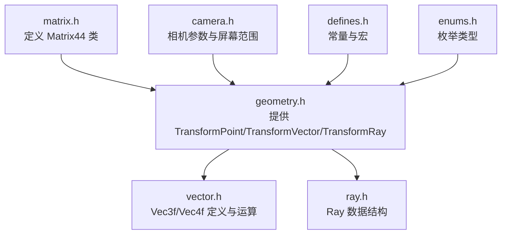
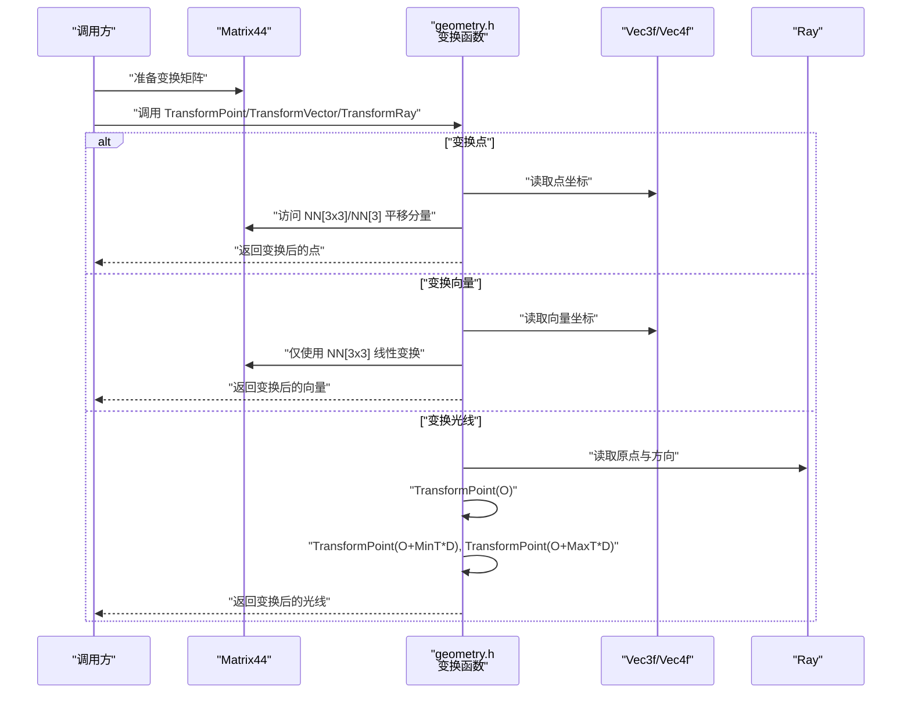
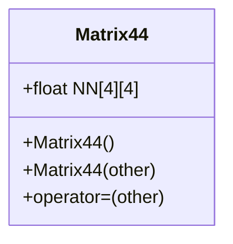
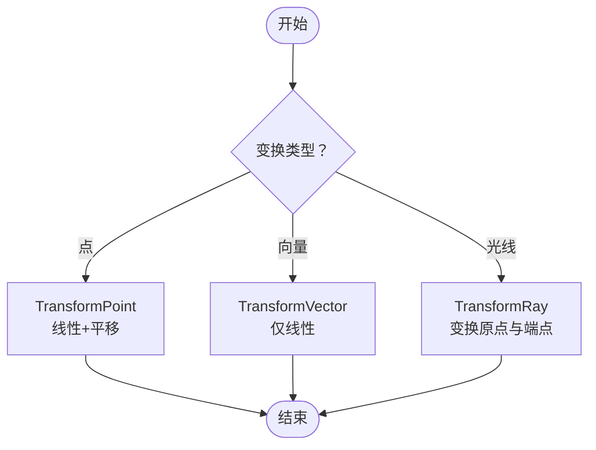
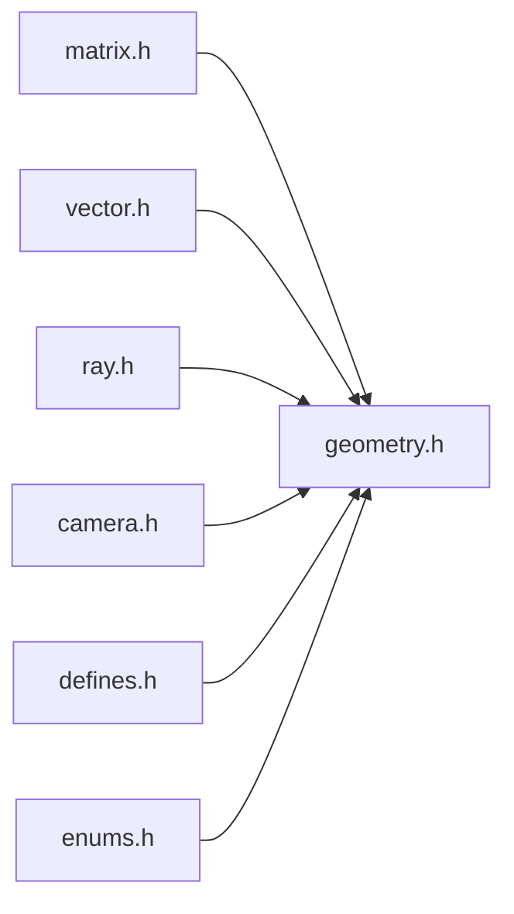

# 矩阵变换

<cite>
**本文引用的文件**
- [matrix.h](file://Source/matrix.h)
- [geometry.h](file://Source/geometry.h)
- [vector.h](file://Source/vector.h)
- [camera.h](file://Source/camera.h)
- [ray.h](file://Source/ray.h)
- [defines.h](file://Source/defines.h)
- [enums.h](file://Source/enums.h)
</cite>

## 目录
1. [引言](#引言)
2. [项目结构](#项目结构)
3. [核心组件](#核心组件)
4. [架构总览](#架构总览)
5. [详细组件分析](#详细组件分析)
6. [依赖关系分析](#依赖关系分析)
7. [性能考量](#性能考量)
8. [故障排查指南](#故障排查指南)
9. [结论](#结论)
10. [附录](#附录)

## 引言
本文件围绕四维齐次坐标下的4x4变换矩阵展开，系统阐述该框架中矩阵类的设计、点与向量的变换函数、齐次坐标在3D几何变换中的作用，并结合渲染管线中的常见用法（物体变换、视图变换、投影变换）给出流程说明与实践建议。由于当前仓库未提供矩阵乘法运算符或标准基元变换矩阵构造函数（如平移、旋转、缩放），本文将以现有实现为基础，补充数学原理与扩展建议，帮助读者在不改变现有接口的前提下安全地扩展功能。

## 项目结构
与矩阵变换直接相关的源文件集中在以下模块：
- 矩阵定义：matrix.h
- 几何变换函数：geometry.h
- 向量与通用工具：vector.h
- 摄像机参数与屏幕范围：camera.h
- 光线数据结构：ray.h
- 常量与宏定义：defines.h
- 枚举类型：enums.h

图表来源
- [matrix.h:27-56](file://Source/matrix.h#L27-L56)
- [geometry.h:29-68](file://Source/geometry.h#L29-L68)
- [vector.h:450-519](file://Source/vector.h#L450-L519)
- [ray.h:26-56](file://Source/ray.h#L26-L56)
- [camera.h:26-116](file://Source/camera.h#L26-L116)
- [defines.h:37-114](file://Source/defines.h#L37-L114)
- [enums.h:24-111](file://Source/enums.h#L24-L111)

章节来源
- [matrix.h:27-56](file://Source/matrix.h#L27-L56)
- [geometry.h:29-68](file://Source/geometry.h#L29-L68)
- [vector.h:450-519](file://Source/vector.h#L450-L519)
- [ray.h:26-56](file://Source/ray.h#L26-L56)
- [camera.h:26-116](file://Source/camera.h#L26-L116)
- [defines.h:37-114](file://Source/defines.h#L37-L114)
- [enums.h:24-111](file://Source/enums.h#L24-L111)

## 核心组件
- Matrix44 类
  - 设计要点：采用4x4数组存储，构造时初始化为单位阵；提供拷贝构造与赋值运算，便于按值传递与复制。
  - 存储布局：行主序的浮点数组，便于直接映射到GPU或图形API。
- 变换函数族
  - TransformPoint：对点进行仿射变换（含平移），使用矩阵前3x3子块作用于坐标，再加第4列作为平移。
  - TransformVector：仅对方向向量进行线性变换（忽略平移），用于法向量的协变变换需使用逆转置矩阵。
  - TransformRay：将光线原点与两个采样点经由变换后重新计算方向与有效区间。

章节来源
- [matrix.h:30-55](file://Source/matrix.h#L30-L55)
- [geometry.h:30-68](file://Source/geometry.h#L30-L68)

## 架构总览
下图展示了从输入到输出的关键调用链：上层通过Matrix44持有变换，geometry.h中的变换函数将其应用于点、向量与光线。

图表来源
- [geometry.h:30-68](file://Source/geometry.h#L30-L68)
- [matrix.h:55](file://Source/matrix.h#L55)
- [vector.h:450-519](file://Source/vector.h#L450-L519)
- [ray.h:26-56](file://Source/ray.h#L26-L56)

## 详细组件分析

### Matrix44 类设计与用途
- 初始化：默认构造函数设置为单位矩阵，适合作为“无变换”初始状态。
- 复制：拷贝构造与赋值确保对象语义清晰，避免浅拷贝问题。
- 存储：NN[4][4]以行主序组织，便于与OpenGL/DirectX等图形API对接。

图表来源
- [matrix.h:27-56](file://Source/matrix.h#L27-L56)

章节来源
- [matrix.h:27-56](file://Source/matrix.h#L27-L56)

### 几何变换函数：点、向量与光线
- TransformPoint
  - 数学原理：将点坐标(x,y,z)与矩阵前3列组合，再叠加平移列，得到Px,Py,Pz。
  - 使用场景：物体局部坐标到世界坐标、世界坐标到裁剪空间等。
- TransformVector
  - 数学原理：仅使用3x3线性部分，不加平移列，适合方向向量与切向量。
  - 注意：法向量应使用逆转置矩阵进行协变变换。
- TransformRay
  - 实现要点：先变换原点，再变换两个端点，重新计算方向与区间长度，保证数值稳定。

图表来源
- [geometry.h:30-68](file://Source/geometry.h#L30-L68)

章节来源
- [geometry.h:30-68](file://Source/geometry.h#L30-L68)

### 齐次坐标与4x4矩阵
- 齐次坐标：通过增加一维w，将平移、旋转、缩放、投影统一为矩阵乘法，便于组合与批处理。
- 在本实现中：
  - 点的齐次表示为(x,y,z,1)，平移通过第4列实现。
  - 方向向量的齐次表示为(x,y,z,0)，平移不影响方向。
- 适用范围：物体变换、视图变换、投影变换均可使用同一框架。

章节来源
- [geometry.h:30-68](file://Source/geometry.h#L30-L68)

### 实际使用场景与建议
- 物体变换（Model）
  - 将Mesh顶点作为点传入TransformPoint，得到模型空间到世界坐标的变换结果。
- 视图变换（View）
  - 使用相机的前向、侧向、上向构建视图矩阵，随后用TransformPoint/TransformVector对顶点与法向量进行变换。
- 投影变换（Projection）
  - 透视投影矩阵通常包含近远裁剪面与视野参数，可结合camera.h中的屏幕范围参数进行一致性处理。

章节来源
- [camera.h:61-96](file://Source/camera.h#L61-L96)
- [geometry.h:30-68](file://Source/geometry.h#L30-L68)

### 扩展建议（基于现有接口）
- 矩阵乘法
  - 当前未提供矩阵乘法运算符，可在Matrix44中添加乘法运算符以支持复合变换。
  - 复杂度：O(1)次乘加操作，适合GPU并行。
- 基元变换矩阵
  - 平移：在第4列填入位移分量。
  - 旋转：按轴角或欧拉角构造3x3旋转矩阵。
  - 缩放：对3x3主子块对角线赋值。
  - 注意：这些构造函数可作为静态工厂方法，不破坏现有接口。

章节来源
- [matrix.h:27-56](file://Source/matrix.h#L27-L56)

## 依赖关系分析
- 直接依赖
  - geometry.h 依赖 matrix.h（使用Matrix44）、vector.h（Vec3f）、ray.h（Ray）。
  - camera.h 依赖 vector.h（Vec3f/Vec2i）与自身更新逻辑。
  - defines.h 提供PI、角度换算等常量，被geometry.h等广泛使用。
- 耦合与内聚
  - 矩阵与变换分离良好：Matrix44只负责存储，变换逻辑集中在geometry.h，降低耦合。
  - 向量与光线作为基础类型被多处复用，内聚度高。

图表来源
- [geometry.h:21-24](file://Source/geometry.h#L21-L24)
- [camera.h:21](file://Source/camera.h#L21)
- [defines.h:25-27](file://Source/defines.h#L25-L27)
- [enums.h:21](file://Source/enums.h#L21)

章节来源
- [geometry.h:21-24](file://Source/geometry.h#L21-L24)
- [camera.h:21](file://Source/camera.h#L21)
- [defines.h:25-27](file://Source/defines.h#L25-L27)
- [enums.h:21](file://Source/enums.h#L21)

## 性能考量
- 计算复杂度
  - TransformPoint/TransformVector均为固定次数的乘加，时间复杂度O(1)。
  - 矩阵乘法若引入，单次复杂度为O(1)（4x4），但组合多次变换时可显著减少乘法次数。
- 内存与带宽
  - Matrix44占用64字节（4x4浮点），缓存友好；与Vec3f/Vec4f配合使用时注意内存对齐。
- GPU友好性
  - HOST_DEVICE宏使函数可在CPU/GPU两端编译，适合在着色器或核函数中复用。

章节来源
- [matrix.h:55](file://Source/matrix.h#L55)
- [vector.h:450-519](file://Source/vector.h#L450-L519)
- [defines.h:40-56](file://Source/defines.h#L40-L56)

## 故障排查指南
- 变换后出现漂移或方向异常
  - 检查是否误用TransformVector对点进行变换；点应使用TransformPoint。
  - 法向量应使用逆转置矩阵，否则会出现形变扭曲。
- 光线变换导致方向错误
  - TransformRay会根据变换后的端点重新计算方向与区间，确保输入光线区间与方向正确。
- 相机投影不一致
  - camera.h的屏幕范围与分辨率相关，确保FilmSize与投影矩阵参数匹配。

章节来源
- [geometry.h:30-68](file://Source/geometry.h#L30-L68)
- [camera.h:61-96](file://Source/camera.h#L61-L96)

## 结论
本仓库提供了简洁而清晰的4x4矩阵与基本变换函数，满足点、向量与光线在渲染管线中的基础需求。通过引入矩阵乘法与标准基元变换矩阵构造函数，可进一步完善变换体系，同时保持与现有接口的兼容性。齐次坐标与4x4矩阵为统一处理平移、旋转、缩放与投影提供了数学基础，适合在物体变换、视图变换与投影变换中复用。

## 附录
- 常用常量与宏（来自defines.h）
  - 圆周率、角度换算、设备端宏等，为数学计算与跨平台编译提供支撑。
- 相关类型
  - Vec3f/Vec4f：向量与齐次向量的基础类型。
  - Ray：光线数据结构，支持按参数采样。

章节来源
- [defines.h:58-78](file://Source/defines.h#L58-L78)
- [vector.h:450-519](file://Source/vector.h#L450-L519)
- [ray.h:26-56](file://Source/ray.h#L26-L56)