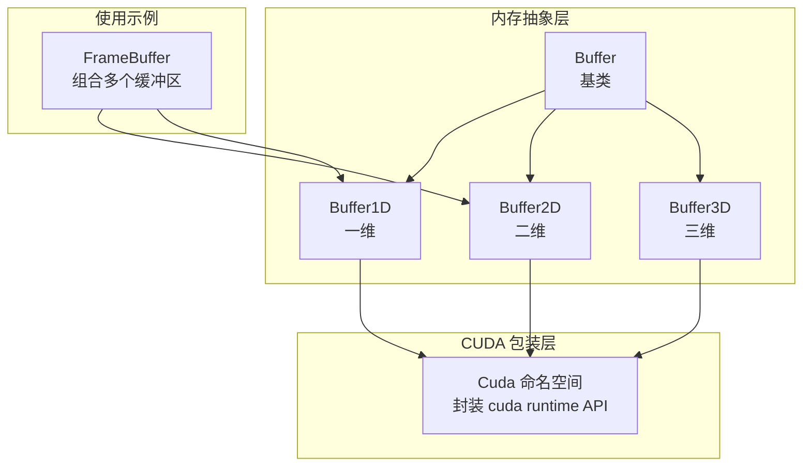
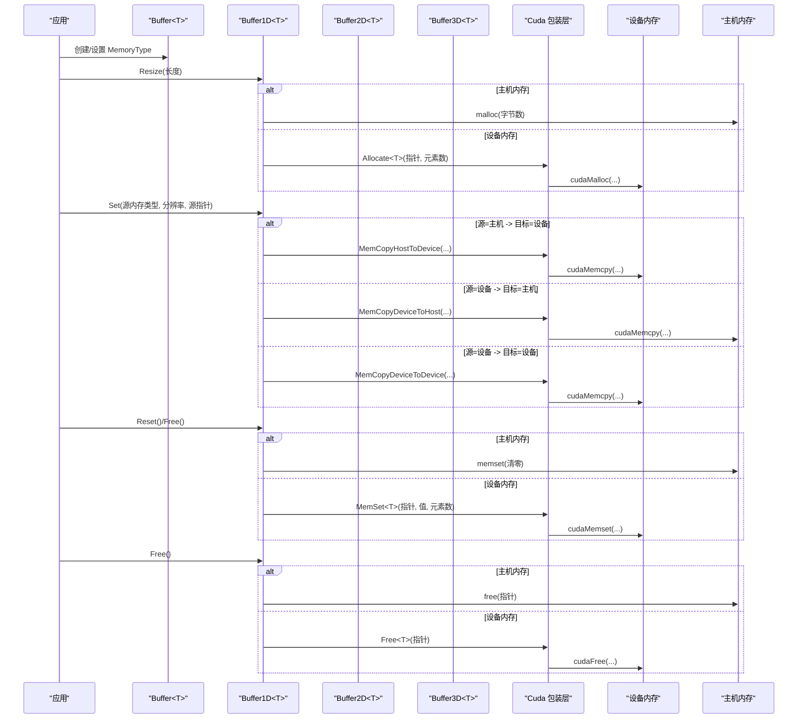
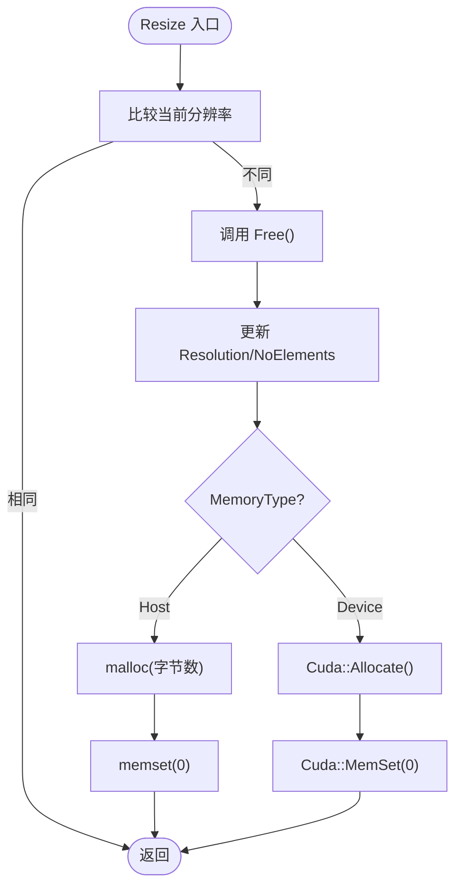
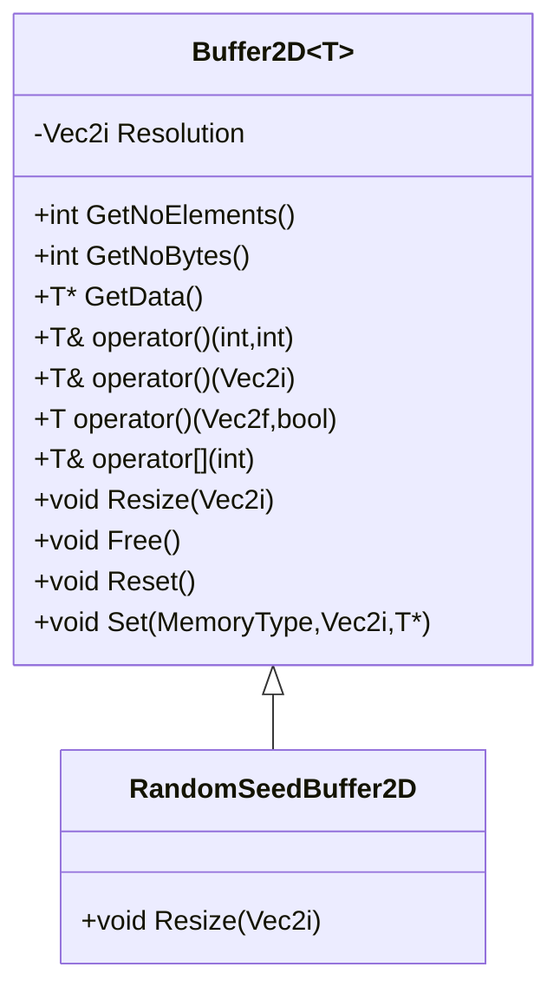
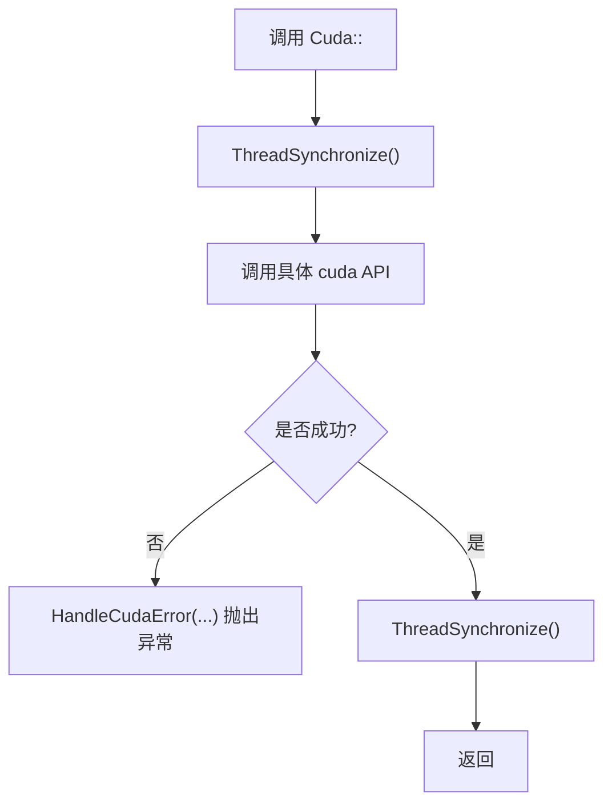
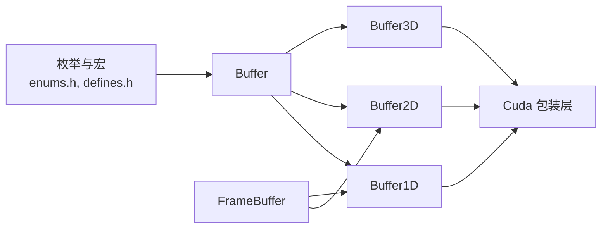

# 内存分配策略

<cite>
**本文引用的文件**
- [buffer.h](file://Source/buffer.h)
- [buffer1d.h](file://Source/buffer1d.h)
- [buffer2d.h](file://Source/buffer2d.h)
- [buffer3d.h](file://Source/buffer3d.h)
- [wrapper.cuh](file://Source/wrapper.cuh)
- [enums.h](file://Source/enums.h)
- [defines.h](file://Source/defines.h)
- [framebuffer.h](file://Source/framebuffer.h)
- [log.h](file://Source/log.h)
- [exception.h](file://Source/exception.h)
- [macros.cuh](file://Source/macros.cuh)
</cite>

## 目录
1. [简介](#简介)
2. [项目结构](#项目结构)
3. [核心组件](#核心组件)
4. [架构总览](#架构总览)
5. [详细组件分析](#详细组件分析)
6. [依赖关系分析](#依赖关系分析)
7. [性能考量](#性能考量)
8. [故障排查指南](#故障排查指南)
9. [结论](#结论)
10. [附录](#附录)

## 简介
本文件系统性阐述该代码库中的内存分配与管理策略，覆盖主机（Host）与设备（Device，CUDA）两类内存的分配、重置、销毁与释放流程；解释内存对齐与缓存优化思路；总结主机-设备间数据传输的优化策略；并给出内存碎片化与泄漏的预防建议及监控与调试方法。内容既面向初学者，也提供足够的工程细节以指导高级开发者。

## 项目结构
围绕内存管理的关键模块包括：
- 基类与通用接口：Buffer<T>
- 一维/二维/三维缓冲区：Buffer1D<T>、Buffer2D<T>、Buffer3D<T>
- CUDA 包装层：Cuda 命名空间封装 cuda runtime API
- 枚举与编译期宏：MemoryType、MemoryUnit、HOST/DEVICE 宏等
- 使用示例：FrameBuffer 将多类缓冲区组合用于渲染管线

**图表来源**
- [buffer.h:27-121](file://Source/buffer.h#L27-L121)
- [buffer1d.h:26-195](file://Source/buffer1d.h#L26-L195)
- [buffer2d.h:26-289](file://Source/buffer2d.h#L26-L289)
- [buffer3d.h:26-254](file://Source/buffer3d.h#L26-L254)
- [wrapper.cuh:35-147](file://Source/wrapper.cuh#L35-L147)
- [framebuffer.h:26-108](file://Source/framebuffer.h#L26-L108)

**章节来源**
- [buffer.h:27-121](file://Source/buffer.h#L27-L121)
- [buffer1d.h:26-195](file://Source/buffer1d.h#L26-L195)
- [buffer2d.h:26-289](file://Source/buffer2d.h#L26-L289)
- [buffer3d.h:26-254](file://Source/buffer3d.h#L26-L254)
- [wrapper.cuh:35-147](file://Source/wrapper.cuh#L35-L147)
- [framebuffer.h:26-108](file://Source/framebuffer.h#L26-L108)

## 核心组件
- Buffer<T>：定义内存类型、名称、元素计数、字节大小、内存字符串格式化等通用能力，并提供派生类共享的接口骨架。
- Buffer1D<T>/Buffer2D<T>/Buffer3D<T>：分别实现一维、二维、三维数组的分配、重置、销毁与拷贝；根据 MemoryType 在主机或设备上分配；支持主机-设备之间的数据传输。
- Cuda 包装层：统一封装 cudaMalloc/cudaMemcpy/cudaMemset/cudaFree 等 API，并在每次调用前后执行同步与错误检查。
- FrameBuffer：在渲染场景中集中管理帧估计、显示估计、随机种子等缓冲区，统一 Resize/Reset/Free 流程。

**章节来源**
- [buffer.h:27-121](file://Source/buffer.h#L27-L121)
- [buffer1d.h:26-195](file://Source/buffer1d.h#L26-L195)
- [buffer2d.h:26-289](file://Source/buffer2d.h#L26-L289)
- [buffer3d.h:26-254](file://Source/buffer3d.h#L26-L254)
- [wrapper.cuh:35-147](file://Source/wrapper.cuh#L35-L147)
- [framebuffer.h:26-108](file://Source/framebuffer.h#L26-L108)

## 架构总览
下图展示了缓冲区对象在主机与设备之间的生命周期与交互关系，以及 CUDA 包装层的统一入口。

**图表来源**
- [buffer1d.h:117-175](file://Source/buffer1d.h#L117-L175)
- [buffer2d.h:166-198](file://Source/buffer2d.h#L166-L198)
- [buffer3d.h:166-198](file://Source/buffer3d.h#L166-L198)
- [wrapper.cuh:53-135](file://Source/wrapper.cuh#L53-L135)

## 详细组件分析

### Buffer<T> 抽象层
- 职责：统一管理内存类型（主机/设备）、名称、元素数量、字节大小、内存单位换算与字符串输出。
- 关键点：
  - MemoryType 通过枚举控制分配路径。
  - GetNoBytes/GetMemorySize/GetMemoryString 提供统一的容量查询与格式化输出。
  - FullName 用于调试日志标识。

**章节来源**
- [buffer.h:27-121](file://Source/buffer.h#L27-L121)
- [enums.h:26-37](file://Source/enums.h#L26-L37)

### Buffer1D<T>：一维缓冲区
- 分配与释放：根据 MemoryType 选择 malloc 或 Cuda::Allocate；Free 时对应 free 或 Cuda::Free。
- 重置：Host 使用 memset，Device 使用 Cuda::MemSet。
- 数据传输：支持 Host <-> Device、Device <-> Device 的三类 memcpy 调用。
- 生命周期：Resize 自动 Free 并重新分配；Reset 清零并标记 Dirty。

**图表来源**
- [buffer1d.h:117-141](file://Source/buffer1d.h#L117-L141)
- [buffer1d.h:67-88](file://Source/buffer1d.h#L67-L88)
- [buffer1d.h:99-115](file://Source/buffer1d.h#L99-L115)

**章节来源**
- [buffer1d.h:26-195](file://Source/buffer1d.h#L26-L195)
- [wrapper.cuh:53-72](file://Source/wrapper.cuh#L53-L72)

### Buffer2D<T>：二维缓冲区
- 分配：按 Width×Height 计算元素数，Host 分配，Device 通过 Cuda::Allocate。
- 随机种子缓冲区 RandomSeedBuffer2D：构造时生成随机种子数组并通过 Set() 复制到目标内存。
- 数据访问：提供多种索引与双线性插值读取接口，便于渲染采样。

**图表来源**
- [buffer2d.h:26-289](file://Source/buffer2d.h#L26-L289)

**章节来源**
- [buffer2d.h:26-289](file://Source/buffer2d.h#L26-L289)

### Buffer3D<T>：三维缓冲区
- 分配：按 Width×Height×Depth 计算元素数，Host 分配，Device 通过 Cuda::Allocate。
- 数据访问：提供三种索引与三线性插值读取接口，适用于体积采样。

**章节来源**
- [buffer3d.h:26-254](file://Source/buffer3d.h#L26-L254)

### CUDA 包装层 Cuda 命名空间
- 统一封装：
  - 分配：Allocate<T>() 对应 cudaMalloc，可选 AllocatePitched()。
  - 清零：MemSet<T>() 对应 cudaMemset。
  - 传输：MemCopyHostToDevice()/MemCopyDeviceToHost()/MemCopyDeviceToDevice()。
  - 符号内存：HostToConstantDevice()/MemCopyHostToDeviceSymbol()/MemCopyDeviceToDeviceSymbol()。
  - 释放：Free<T>() 对应 cudaFree；FreeArray() 对 cudaArray。
  - 同步与错误：ThreadSynchronize()；HandleCudaError() 抛出异常。
- 错误处理：所有包装函数在调用前后执行同步并检查错误，失败时抛出异常。

**图表来源**
- [wrapper.cuh:38-147](file://Source/wrapper.cuh#L38-L147)
- [exception.h:27-55](file://Source/exception.h#L27-L55)

**章节来源**
- [wrapper.cuh:35-147](file://Source/wrapper.cuh#L35-L147)
- [exception.h:27-55](file://Source/exception.h#L27-L55)

### 使用示例：FrameBuffer
- 组合多个缓冲区：帧估计、临时缓冲、运行估计、显示估计、过滤后显示、随机种子及其缓存、主机侧显示缓冲。
- 生命周期管理：Resize 统一调整各缓冲区尺寸；Reset 恢复随机种子缓存；Free 释放全部资源。

**章节来源**
- [framebuffer.h:26-108](file://Source/framebuffer.h#L26-L108)

## 依赖关系分析
- Buffer<T> 作为基类被 Buffer1D/Buffer2D/Buffer3D 继承，提供统一的内存元信息与工具方法。
- Buffer1D/Buffer2D/Buffer3D 通过 Cuda 包装层与 CUDA 运行时交互，实现设备内存分配与数据传输。
- FrameBuffer 依赖 Buffer2D/Buffer1D 等，形成渲染管线中的缓冲区集合。
- 枚举与宏定义为跨平台与条件编译提供基础支撑。

**图表来源**
- [enums.h:26-37](file://Source/enums.h#L26-L37)
- [defines.h:40-56](file://Source/defines.h#L40-L56)
- [buffer.h:27-121](file://Source/buffer.h#L27-L121)
- [buffer1d.h:26-195](file://Source/buffer1d.h#L26-L195)
- [buffer2d.h:26-289](file://Source/buffer2d.h#L26-L289)
- [buffer3d.h:26-254](file://Source/buffer3d.h#L26-L254)
- [wrapper.cuh:35-147](file://Source/wrapper.cuh#L35-L147)
- [framebuffer.h:26-108](file://Source/framebuffer.h#L26-L108)

**章节来源**
- [enums.h:26-37](file://Source/enums.h#L26-L37)
- [defines.h:40-56](file://Source/defines.h#L40-L56)
- [buffer.h:27-121](file://Source/buffer.h#L27-L121)
- [buffer1d.h:26-195](file://Source/buffer1d.h#L26-L195)
- [buffer2d.h:26-289](file://Source/buffer2d.h#L26-L289)
- [buffer3d.h:26-254](file://Source/buffer3d.h#L26-L254)
- [wrapper.cuh:35-147](file://Source/wrapper.cuh#L35-L147)
- [framebuffer.h:26-108](file://Source/framebuffer.h#L26-L108)

## 性能考量
- 内存对齐与缓存优化
  - 设备内存分配：优先使用 cudaMalloc/cudaMallocPitch 获取连续且对齐的内存块，减少访问抖动与缓存未命中。
  - Host 内存分配：使用标准 malloc/free，确保元素类型对齐（sizeof(T)），避免非对齐访问惩罚。
- 传输优化
  - 批量传输：尽量合并多次小传输为一次大传输，减少 cudaMemcpy 开销。
  - 双缓冲/环形缓冲：在渲染管线中使用两套缓冲（如 Temp 与主缓冲）降低同步等待。
  - 异步传输：结合 cudaStream 可进一步提升吞吐（需配合流与事件）。
- 生命周期优化
  - Resize 时先 Free 再 Allocate，避免重复分配带来的碎片与浪费。
  - Reset 仅清零必要区域，避免全量写入。
- 调度与同步
  - 包装层在每次 API 调用前后执行 ThreadSynchronize，有助于定位异步问题，但可能带来性能开销；在性能敏感路径可考虑移除同步或改为更细粒度的同步策略。

[本节为通用性能建议，不直接分析特定文件，故无“章节来源”]

## 故障排查指南
- 错误处理与异常
  - Cuda 包装层在每个 API 调用后检查错误并抛出异常，异常类包含级别与消息，便于定位问题。
  - 建议在关键路径捕获异常并记录上下文，避免静默失败。
- 日志与诊断
  - 缓冲区在 Free/Resize/Reset/Set 等关键节点打印调试日志，可用于追踪分配与释放轨迹。
  - 可结合 CUDA 事件（cudaEvent）统计内核与传输耗时，辅助性能分析。
- 常见问题
  - 设备内存不足：检查分配大小与设备可用显存；考虑分块处理或压缩存储。
  - 传输方向错误：确认 Set 中源/目标 MemoryType 与 memcpy 参数一致。
  - 未释放导致泄漏：确保在对象析构或切换分辨率时调用 Free/Destroy。

**章节来源**
- [wrapper.cuh:38-46](file://Source/wrapper.cuh#L38-L46)
- [exception.h:27-55](file://Source/exception.h#L27-L55)
- [log.h:27-39](file://Source/log.h#L27-L39)
- [macros.cuh:41-73](file://Source/macros.cuh#L41-L73)

## 结论
该代码库通过 Buffer<T> 抽象与 Cuda 包装层，实现了主机与设备内存的统一管理与安全传输。Buffer1D/Buffer2D/Buffer3D 提供了清晰的生命周期与数据访问接口，FrameBuffer 则将多类缓冲整合到渲染工作流中。通过统一的错误处理与调试日志，能够有效预防与定位内存相关问题。在实际工程中，建议结合 cudaMallocPitch、批量传输与异步流进一步优化性能，并在关键路径谨慎平衡同步与性能。

[本节为总结性内容，不直接分析特定文件，故无“章节来源”]

## 附录
- 关键 API 一览
  - 分配：Cuda::Allocate<T>()、Cuda::AllocatePiched<T>()
  - 清零：Cuda::MemSet<T>()
  - 传输：Cuda::MemCopyHostToDevice()、Cuda::MemCopyDeviceToHost()、Cuda::MemCopyDeviceToDevice()
  - 释放：Cuda::Free<T>()、Cuda::FreeArray()
  - 同步与错误：Cuda::ThreadSynchronize()、Cuda::HandleCudaError()

**章节来源**
- [wrapper.cuh:53-147](file://Source/wrapper.cuh#L53-L147)