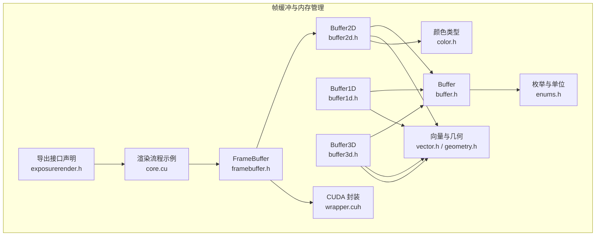
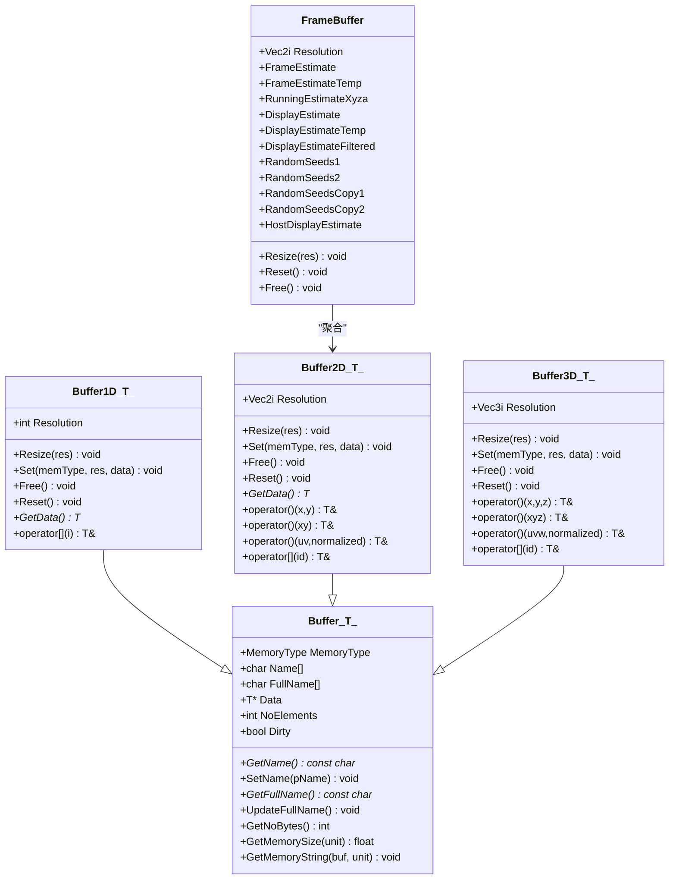
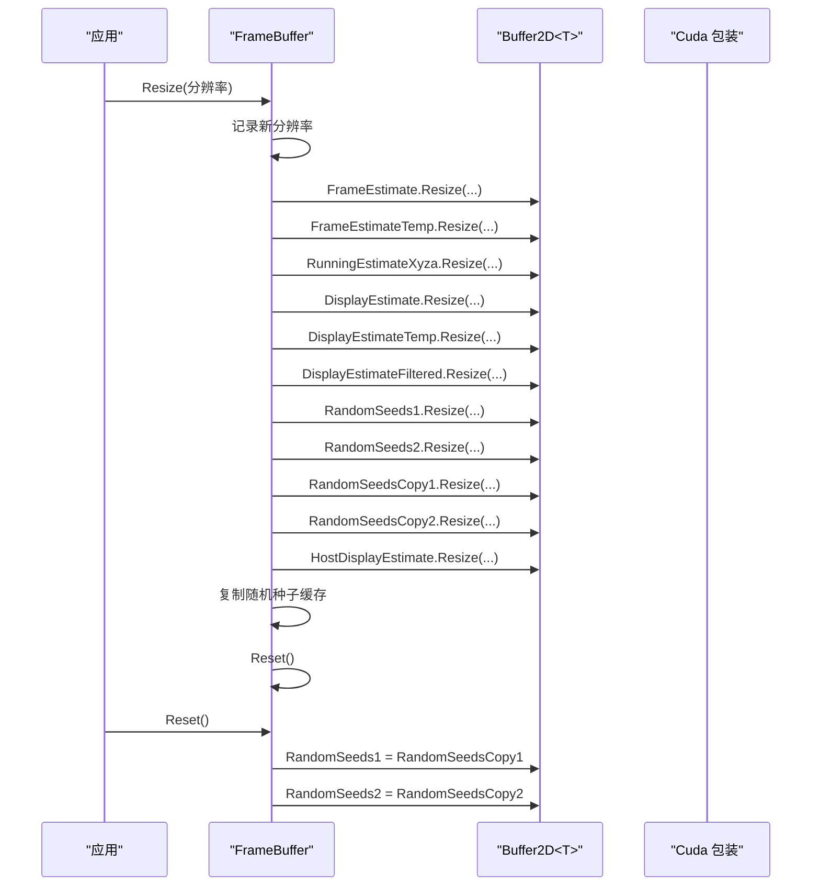
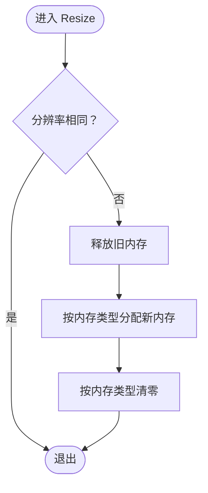
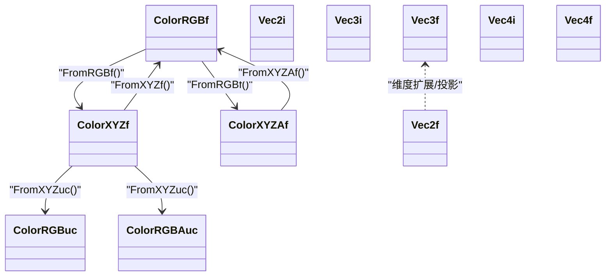
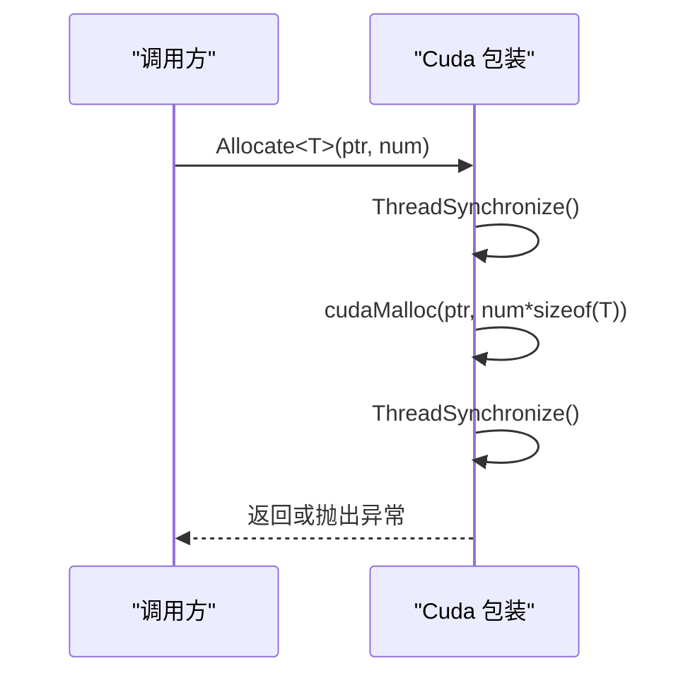
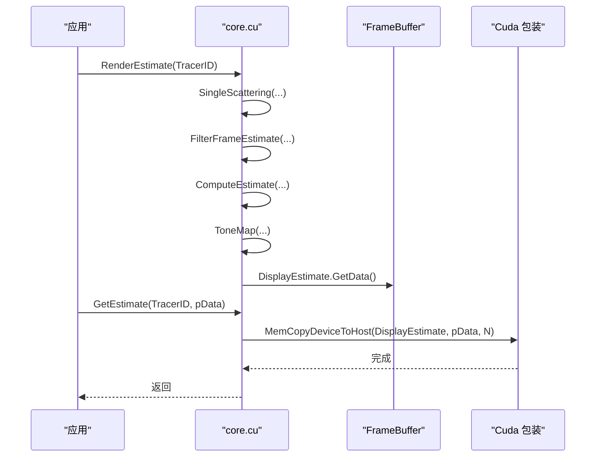
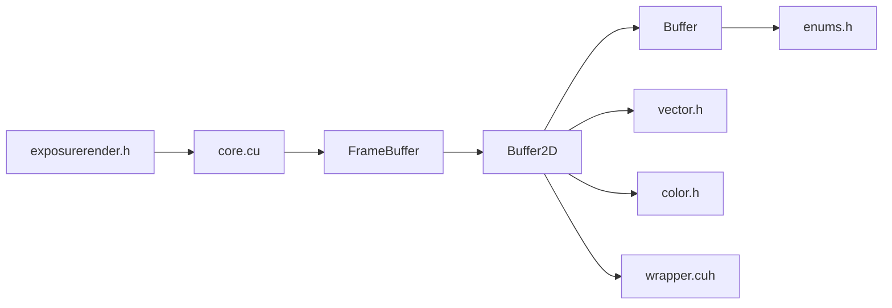

# 帧缓冲和内存管理

<cite>
**本文引用的文件**   
- [framebuffer.h](file://Source/framebuffer.h)
- [buffer2d.h](file://Source/buffer2d.h)
- [buffer1d.h](file://Source/buffer1d.h)
- [buffer3d.h](file://Source/buffer3d.h)
- [buffer.h](file://Source/buffer.h)
- [color.h](file://Source/color.h)
- [enums.h](file://Source/enums.h)
- [vector.h](file://Source/vector.h)
- [geometry.h](file://Source/geometry.h)
- [wrapper.cuh](file://Source/wrapper.cuh)
- [core.cu](file://Source/core.cu)
- [exposurerender.h](file://Source/exposurerender.h)
- [README.md](file://README.md)
</cite>

## 目录
1. [简介](#简介)
2. [项目结构](#项目结构)
3. [核心组件](#核心组件)
4. [架构总览](#架构总览)
5. [详细组件分析](#详细组件分析)
6. [依赖分析](#依赖分析)
7. [性能考虑](#性能考虑)
8. [故障排查指南](#故障排查指南)
9. [结论](#结论)
10. [附录](#附录)

## 简介
本章节面向“帧缓冲与内存管理”主题，系统性阐述代码库中用于体积渲染的帧缓冲设计、通用缓冲模板体系、颜色与向量数据类型、以及与 CUDA 设备内存交互的封装层。文档从领域模型、接口契约、调用关系、配置选项、参数与返回值、到常见问题与优化建议，逐层展开，既适合初学者快速上手，也为有经验的开发者提供深入的技术细节。

## 项目结构
围绕帧缓冲与内存管理的相关模块主要分布在以下文件：
- 帧缓冲：framebuffer.h
- 缓冲模板（1D/2D/3D）：buffer1d.h、buffer2d.h、buffer3d.h
- 通用缓冲基类与工具：buffer.h、enums.h、vector.h、color.h、geometry.h
- CUDA 内存封装：wrapper.cuh
- 使用示例与导出接口：core.cu、exposurerender.h
- 项目说明：README.md

**图表来源**
- [framebuffer.h:1-108](file://Source/framebuffer.h#L1-L108)
- [buffer2d.h:1-289](file://Source/buffer2d.h#L1-L289)
- [buffer1d.h:1-196](file://Source/buffer1d.h#L1-L196)
- [buffer3d.h:1-254](file://Source/buffer3d.h#L1-L254)
- [buffer.h:1-124](file://Source/buffer.h#L1-L124)
- [enums.h:1-111](file://Source/enums.h#L1-L111)
- [vector.h:1-582](file://Source/vector.h#L1-L582)
- [color.h:1-287](file://Source/color.h#L1-L287)
- [geometry.h:1-141](file://Source/geometry.h#L1-L141)
- [wrapper.cuh:1-147](file://Source/wrapper.cuh#L1-L147)
- [core.cu:126-143](file://Source/core.cu#L126-L143)
- [exposurerender.h:35-44](file://Source/exposurerender.h#L35-L44)

**章节来源**
- [framebuffer.h:1-108](file://Source/framebuffer.h#L1-L108)
- [buffer2d.h:1-289](file://Source/buffer2d.h#L1-L289)
- [buffer1d.h:1-196](file://Source/buffer1d.h#L1-L196)
- [buffer3d.h:1-254](file://Source/buffer3d.h#L1-L254)
- [buffer.h:1-124](file://Source/buffer.h#L1-L124)
- [enums.h:1-111](file://Source/enums.h#L1-L111)
- [vector.h:1-582](file://Source/vector.h#L1-L582)
- [color.h:1-287](file://Source/color.h#L1-L287)
- [geometry.h:1-141](file://Source/geometry.h#L1-L141)
- [wrapper.cuh:1-147](file://Source/wrapper.cuh#L1-L147)
- [core.cu:126-143](file://Source/core.cu#L126-L143)
- [exposurerender.h:35-44](file://Source/exposurerender.h#L35-L44)

## 核心组件
- 帧缓冲 FrameBuffer：统一管理渲染过程中的多路估计与显示缓冲，负责尺寸变更、重置与释放。
- 通用缓冲模板 Buffer<T> 及其派生 Buffer1D/Buffer2D/Buffer3D：提供统一的内存分配、拷贝、清零、查询等能力，并支持主机与设备两种内存类型。
- 颜色与向量类型：ColorRGBf/ColorXYZf/ColorXYZAf/ColorRGBuc/ColorRGBAuc 与 Vec2i/Vec2f/Vec3i/Vec3f 等，支撑渲染管线的数据表达。
- CUDA 封装 Cuda 命名空间：封装 cudaMalloc/cudaMemcpy/cudaMemset 等底层调用，统一错误处理与同步策略。
- 使用示例：通过 RenderEstimate 与 GetEstimate 展示如何在渲染循环中使用帧缓冲，并将结果回传到主机。

**章节来源**
- [framebuffer.h:26-105](file://Source/framebuffer.h#L26-L105)
- [buffer.h:27-121](file://Source/buffer.h#L27-L121)
- [buffer1d.h:26-193](file://Source/buffer1d.h#L26-L193)
- [buffer2d.h:26-263](file://Source/buffer2d.h#L26-L263)
- [buffer3d.h:26-251](file://Source/buffer3d.h#L26-L251)
- [color.h:59-142](file://Source/color.h#L59-L142)
- [vector.h:397-519](file://Source/vector.h#L397-L519)
- [wrapper.cuh:35-143](file://Source/wrapper.cuh#L35-L143)
- [core.cu:126-143](file://Source/core.cu#L126-L143)

## 架构总览
帧缓冲与内存管理的整体架构围绕“模板缓冲 + 颜色/向量类型 + CUDA 封装”的分层设计展开。FrameBuffer 聚合多个 Buffer2D 实例，按渲染阶段组织数据；Buffer<T> 提供内存生命周期管理；wrapper.cuh 统一设备内存操作；颜色与向量类型保证数值计算一致性。

**图表来源**
- [buffer.h:27-121](file://Source/buffer.h#L27-L121)
- [buffer1d.h:26-193](file://Source/buffer1d.h#L26-L193)
- [buffer2d.h:26-263](file://Source/buffer2d.h#L26-L263)
- [buffer3d.h:26-251](file://Source/buffer3d.h#L26-L251)
- [framebuffer.h:26-105](file://Source/framebuffer.h#L26-L105)

## 详细组件分析

### 帧缓冲 FrameBuffer
- 角色定位：集中管理渲染过程中的估计与显示缓冲，包括帧估计、运行估计、显示估计及其临时与滤波版本，以及随机种子缓存与主机侧显示缓冲。
- 关键行为
  - Resize(分辨率)：根据新分辨率调整所有内部缓冲大小，并复制随机种子缓存，最后执行 Reset。
  - Reset()：将随机种子恢复到缓存状态，确保采样一致性。
  - Free()：释放所有缓冲并重置分辨率。
- 内存类型选择：默认使用设备内存（Device），以充分利用 GPU 并行计算能力；主机侧仅保留最终显示结果缓冲以便 CPU 拷贝读取。

**图表来源**
- [framebuffer.h:45-74](file://Source/framebuffer.h#L45-L74)
- [buffer2d.h:125-198](file://Source/buffer2d.h#L125-L198)

**章节来源**
- [framebuffer.h:26-105](file://Source/framebuffer.h#L26-L105)

### 通用缓冲模板 Buffer<T>
- 设计要点
  - 统一的内存类型枚举（Host/Device）与名称管理，便于调试与统计。
  - 提供内存大小查询与字符串化输出，便于日志与监控。
  - 虚函数 GetNoBytes 由派生类覆盖，实现按元素数量与类型大小的精确计量。
- 生命周期管理
  - Resize：释放旧内存、按内存类型分配新内存、Reset 清零。
  - Set：在不同内存类型间进行拷贝（主机↔设备、设备↔设备），并标记脏位。
  - Reset：按内存类型调用 memset 或设备端 MemSet 清零。
  - Free：释放并重置状态。
- 错误处理：通过 wrapper.cuh 中的 Cuda 包装统一抛出异常，避免分散的错误检查。

**图表来源**
- [buffer1d.h:117-141](file://Source/buffer1d.h#L117-L141)
- [buffer2d.h:125-164](file://Source/buffer2d.h#L125-L164)
- [buffer3d.h:125-164](file://Source/buffer3d.h#L125-L164)

**章节来源**
- [buffer.h:27-121](file://Source/buffer.h#L27-L121)
- [buffer1d.h:26-193](file://Source/buffer1d.h#L26-L193)
- [buffer2d.h:26-263](file://Source/buffer2d.h#L26-L263)
- [buffer3d.h:26-251](file://Source/buffer3d.h#L26-L251)

### 颜色与向量类型
- 颜色类型
  - 浮点 RGB/XYZ/XYZA 与无符号整型 RGB/RGBA，提供相互转换、亮度计算、插值等常用操作。
  - 支持构造、赋值、比较、四则运算与 clamp 等宏生成的操作集。
- 向量类型
  - Vec2i/Vec2f、Vec3i/Vec3f、Vec4i/Vec4f，提供长度、归一化、点积、叉积、插值等几何运算。
  - Clamp/Lerp 等工具函数，便于边界约束与线性插值。

**图表来源**
- [color.h:59-142](file://Source/color.h#L59-L142)
- [color.h:144-258](file://Source/color.h#L144-L258)
- [vector.h:397-519](file://Source/vector.h#L397-L519)

**章节来源**
- [color.h:1-287](file://Source/color.h#L1-L287)
- [vector.h:1-582](file://Source/vector.h#L1-L582)

### CUDA 内存封装
- 功能概览
  - 分配/释放：cudaMalloc/cudaFree，带同步与错误检查。
  - 设置：cudaMemset，支持设备端清零。
  - 拷贝：主机↔设备、设备↔设备，支持符号地址拷贝。
  - 同步：cudaThreadSynchronize，统一同步点。
- 错误处理：HandleCudaError 在非成功时抛出异常，确保错误不被忽略。

**图表来源**
- [wrapper.cuh:53-58](file://Source/wrapper.cuh#L53-L58)
- [wrapper.cuh:38-46](file://Source/wrapper.cuh#L38-L46)

**章节来源**
- [wrapper.cuh:1-147](file://Source/wrapper.cuh#L1-L147)

### 使用模式与调用关系
- 渲染循环典型步骤
  - 初始化帧缓冲并设置分辨率。
  - 执行单散射、帧估计过滤、估计合成与色调映射。
  - 将设备侧显示缓冲拷贝到主机，供上层应用读取。
- 接口契约
  - RenderEstimate：执行一轮渲染估计并更新迭代次数。
  - GetEstimate：将 DisplayEstimate 的设备数据拷贝到用户提供的主机缓冲区。

**图表来源**
- [core.cu:126-143](file://Source/core.cu#L126-L143)
- [exposurerender.h:35-44](file://Source/exposurerender.h#L35-L44)

**章节来源**
- [core.cu:126-143](file://Source/core.cu#L126-L143)
- [exposurerender.h:35-44](file://Source/exposurerender.h#L35-L44)

## 依赖分析
- 组件耦合
  - FrameBuffer 依赖 Buffer2D，后者继承自 Buffer<T>，形成清晰的层次结构。
  - Buffer<T> 依赖枚举与内存单位（enums.h）、向量与几何（vector.h/geometry.h）、颜色（color.h）。
  - CUDA 封装独立于业务逻辑，通过 wrapper.cuh 对外暴露静态方法，降低耦合度。
- 外部依赖
  - CUDA 运行时 API：用于设备内存分配、拷贝与同步。
  - 异常与日志：统一的异常类型与日志宏，便于调试与排错。

**图表来源**
- [framebuffer.h:21-105](file://Source/framebuffer.h#L21-L105)
- [buffer2d.h:21-263](file://Source/buffer2d.h#L21-L263)
- [buffer.h:21-121](file://Source/buffer.h#L21-L121)
- [enums.h:24-37](file://Source/enums.h#L24-L37)
- [vector.h:21-582](file://Source/vector.h#L21-L582)
- [color.h:21-287](file://Source/color.h#L21-L287)
- [wrapper.cuh:21-147](file://Source/wrapper.cuh#L21-L147)
- [core.cu:126-143](file://Source/core.cu#L126-L143)
- [exposurerender.h:35-44](file://Source/exposurerender.h#L35-L44)

**章节来源**
- [framebuffer.h:21-105](file://Source/framebuffer.h#L21-L105)
- [buffer2d.h:21-263](file://Source/buffer2d.h#L21-L263)
- [buffer.h:21-121](file://Source/buffer.h#L21-L121)
- [enums.h:24-37](file://Source/enums.h#L24-L37)
- [vector.h:21-582](file://Source/vector.h#L21-L582)
- [color.h:21-287](file://Source/color.h#L21-L287)
- [wrapper.cuh:21-147](file://Source/wrapper.cuh#L21-L147)
- [core.cu:126-143](file://Source/core.cu#L126-L143)
- [exposurerender.h:35-44](file://Source/exposurerender.h#L35-L44)

## 性能考虑
- 内存分配与拷贝
  - 优先使用设备内存承载中间缓冲，减少主机与设备之间的频繁拷贝。
  - 在 Resize 时统一释放与重新分配，避免碎片化；必要时复用已分配的内存块。
- 清零策略
  - Reset 使用 memset 或设备端 MemSet，确保初始化开销可控。
- 数据布局
  - 2D/3D 缓冲采用连续内存布局，结合算子重载的索引函数，提升访问局部性。
- CUDA 同步
  - wrapper.cuh 在关键路径前后插入同步，避免异步导致的竞态；在高频调用场景下可评估批量同步策略。

[本节为通用指导，无需具体文件分析]

## 故障排查指南
- 常见问题
  - 设备内存不足：分配失败会触发异常。检查帧缓冲分辨率与颜色深度，适当降低分辨率或关闭不必要的中间缓冲。
  - 拷贝失败：主机到设备或设备到主机拷贝失败会抛出异常。确认缓冲尺寸与指针有效性。
  - 同步问题：未同步导致的异步错误。确保在关键路径前后调用 ThreadSynchronize。
- 排查步骤
  - 启用调试日志，观察 Resize/Set/Free 的调用序列与内存大小字符串。
  - 使用 GetNoBytes 与 GetMemoryString 输出当前占用，核对预期值。
  - 在 RenderEstimate 后调用 GetEstimate，确认拷贝是否成功且数据有效。

**章节来源**
- [wrapper.cuh:38-46](file://Source/wrapper.cuh#L38-L46)
- [buffer2d.h:67-96](file://Source/buffer2d.h#L67-L96)
- [buffer1d.h:67-88](file://Source/buffer1d.h#L67-L88)
- [buffer3d.h:67-96](file://Source/buffer3d.h#L67-L96)

## 结论
该帧缓冲与内存管理体系通过模板缓冲与 CUDA 封装，实现了高效、可维护的体积渲染数据通路。FrameBuffer 将多阶段估计与显示缓冲统一管理，Buffer<T> 提供一致的生命周期与拷贝语义，颜色与向量类型保障数值稳定性。配合 wrapper.cuh 的错误处理与同步机制，整体架构在性能与可靠性之间取得良好平衡。

[本节为总结，无需具体文件分析]

## 附录

### 配置选项与参数
- 内存类型
  - Host：主机内存，适合最终输出与小规模数据。
  - Device：设备内存，适合中间计算与大规模数据。
- 内存单位
  - KiloByte/MegaByte/GigaByte：用于内存大小字符串化输出。
- 帧缓冲关键参数
  - Resolution：帧缓冲分辨率（Vec2i），决定各缓冲的元素总数。
  - 颜色深度：DisplayEstimate 使用 RGBA 无符号整型，FrameEstimate 使用 XYZA 浮点类型。

**章节来源**
- [enums.h:24-37](file://Source/enums.h#L24-L37)
- [framebuffer.h:93-104](file://Source/framebuffer.h#L93-L104)
- [color.h:112-142](file://Source/color.h#L112-L142)

### 返回值与接口契约
- Resize/Set/Free/Reset：无返回值，通过异常传播错误。
- GetNoBytes：返回字节数，用于内存统计与日志。
- GetData：返回底层数据指针，供外部直接访问。
- RenderEstimate：执行一轮渲染估计并更新迭代次数。
- GetEstimate：将设备侧显示缓冲拷贝到用户提供的主机缓冲区。

**章节来源**
- [buffer2d.h:200-213](file://Source/buffer2d.h#L200-L213)
- [buffer1d.h:177-190](file://Source/buffer1d.h#L177-L190)
- [buffer3d.h:200-248](file://Source/buffer3d.h#L200-L248)
- [core.cu:126-143](file://Source/core.cu#L126-L143)
- [exposurerender.h:35-44](file://Source/exposurerender.h#L35-L44)

### 系统要求与兼容性
- 系统与硬件：Windows、NVIDIA CUDA 兼容 GPU、至少 512MB 显存。
- 开发环境：Visual Studio、Qt、VTK、CUDA 版本参见构建说明。

**章节来源**
- [README.md:14-22](file://README.md#L14-L22)