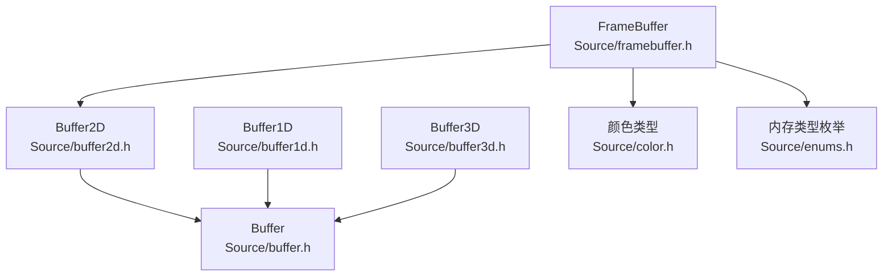
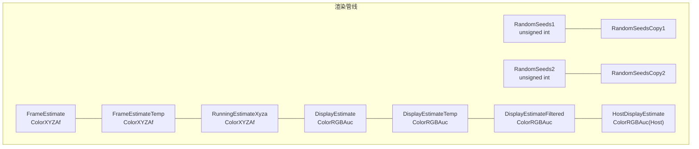
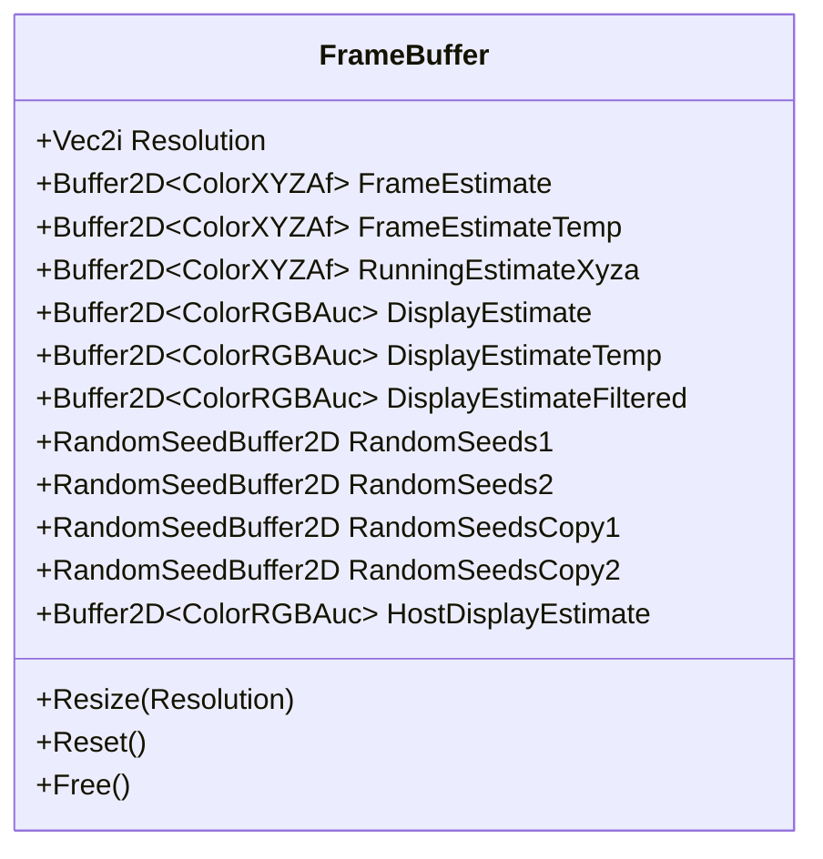
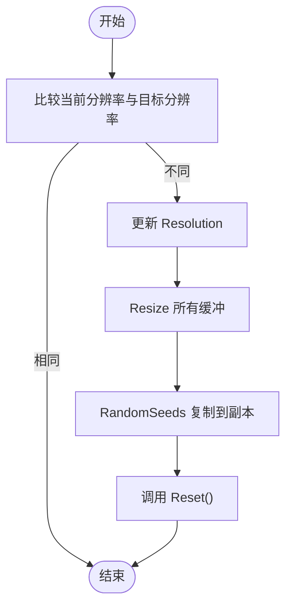
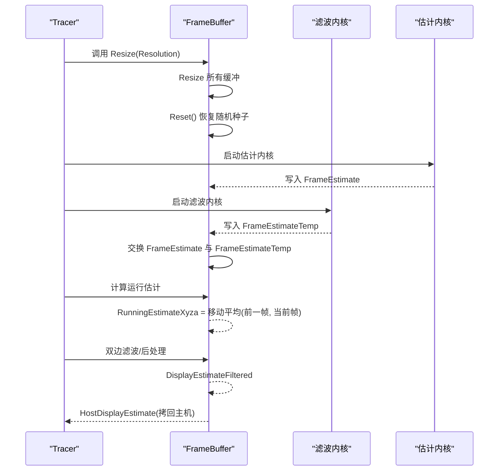
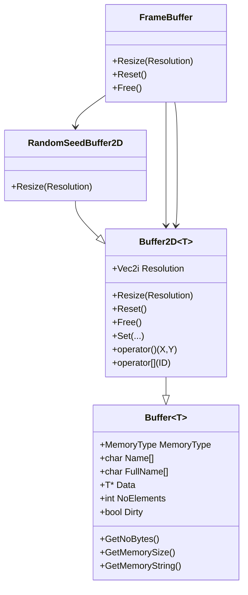

# 帧缓冲设计

<cite>
**本文引用的文件**
- [framebuffer.h](file://Source/framebuffer.h)
- [buffer2d.h](file://Source/buffer2d.h)
- [buffer.h](file://Source/buffer.h)
- [buffer1d.h](file://Source/buffer1d.h)
- [buffer3d.h](file://Source/buffer3d.h)
- [color.h](file://Source/color.h)
- [enums.h](file://Source/enums.h)
- [filterframeestimate.cuh](file://Source/filterframeestimate.cuh)
- [estimate.cuh](file://Source/estimate.cuh)
- [filterrunningestimate.cuh](file://Source/filterrunningestimate.cuh)
- [tracer.h](file://Source/tracer.h)
- [rendersettings.h](file://Source/rendersettings.h)
</cite>

## 目录
1. [简介](#简介)
2. [项目结构](#项目结构)
3. [核心组件](#核心组件)
4. [架构总览](#架构总览)
5. [详细组件分析](#详细组件分析)
6. [依赖关系分析](#依赖关系分析)
7. [性能考量](#性能考量)
8. [故障排查指南](#故障排查指南)
9. [结论](#结论)
10. [附录](#附录)

## 简介
本文件系统性阐述帧缓冲（FrameBuffer）的设计理念、成员组织与生命周期管理，并结合实际代码路径说明如何创建、调整尺寸与重置帧缓冲。文档还解释了不同缓冲类型的职责（如 FrameEstimate、DisplayEstimate、RunningEstimate 等），以及它们在渲染管线中的数据流转与同步机制；同时覆盖尺寸变化时的状态管理策略，帮助初学者快速上手，也为有经验的开发者提供深入的技术细节。

## 项目结构
帧缓冲位于渲染框架的内存与数据层面，围绕二维缓冲区模板类构建，配合颜色类型与随机种子缓冲，支撑估计值计算、双边滤波与主机端显示输出。下图给出与帧缓冲直接相关的模块关系：

图表来源
- [framebuffer.h:26-105](file://Source/framebuffer.h#L26-L105)
- [buffer2d.h:26-263](file://Source/buffer2d.h#L26-L263)
- [buffer1d.h:26-193](file://Source/buffer1d.h#L26-L193)
- [buffer3d.h:26-251](file://Source/buffer3d.h#L26-L251)
- [buffer.h:27-121](file://Source/buffer.h#L27-L121)
- [color.h:59-142](file://Source/color.h#L59-L142)
- [enums.h:24-37](file://Source/enums.h#L24-L37)

章节来源
- [framebuffer.h:26-105](file://Source/framebuffer.h#L26-L105)
- [buffer2d.h:26-263](file://Source/buffer2d.h#L26-L263)
- [buffer1d.h:26-193](file://Source/buffer1d.h#L26-L193)
- [buffer3d.h:26-251](file://Source/buffer3d.h#L26-L251)
- [buffer.h:27-121](file://Source/buffer.h#L27-L121)
- [color.h:59-142](file://Source/color.h#L59-L142)
- [enums.h:24-37](file://Source/enums.h#L24-L37)

## 核心组件
- FrameBuffer：统一持有所有渲染阶段所需的缓冲区，负责尺寸变更与重置逻辑。
- Buffer2D<T>：通用二维缓冲区模板，提供分配、重置、拷贝与访问接口。
- 颜色类型：ColorXYZAf、ColorRGBAuc 等，用于估计值与显示值的数据格式。
- 随机种子缓冲：RandomSeedBuffer2D，按像素生成并缓存随机种子，支持重置。
- 枚举：MemoryType（Host/Device）用于选择内存位置。

章节来源
- [framebuffer.h:26-105](file://Source/framebuffer.h#L26-L105)
- [buffer2d.h:26-263](file://Source/buffer2d.h#L26-L263)
- [color.h:59-142](file://Source/color.h#L59-L142)
- [enums.h:24-37](file://Source/enums.h#L24-L37)

## 架构总览
FrameBuffer 将渲染过程中的估计值与显示值分层管理，形成“估计—临时—运行估计—显示”的流水线。尺寸变化时，所有相关缓冲同步重建，确保 GPU/主机侧一致性；渲染结束后，估计值通过双边滤波等后处理步骤进入最终显示缓冲。

图表来源
- [framebuffer.h:93-104](file://Source/framebuffer.h#L93-L104)
- [buffer2d.h:265-286](file://Source/buffer2d.h#L265-L286)
- [color.h:59-142](file://Source/color.h#L59-L142)

## 详细组件分析

### FrameBuffer 类设计与生命周期
- 成员组织
  - 分别持有估计缓冲（FrameEstimate、FrameEstimateTemp）、运行估计（RunningEstimateXyza）、显示缓冲（DisplayEstimate、DisplayEstimateTemp、DisplayEstimateFiltered）、随机种子缓冲（RandomSeeds1/2 及其副本）与主机端显示缓冲（HostDisplayEstimate）。
  - 所有缓冲均为 Buffer2D 或 RandomSeedBuffer2D 实例，统一由二维缓冲模板管理。
- 生命周期管理
  - 构造：初始化各缓冲并指定内存类型（设备侧为主，主机侧仅显示缓冲）。
  - Resize：当分辨率变化时，同步调整所有相关缓冲，并复制随机种子到副本以保持一致性，随后调用 Reset。
  - Reset：将随机种子缓冲恢复到副本状态，保证迭代一致性。
  - Free：释放所有缓冲并清零分辨率，避免悬挂指针与内存泄漏。

图表来源
- [framebuffer.h:26-105](file://Source/framebuffer.h#L26-L105)

章节来源
- [framebuffer.h:29-43](file://Source/framebuffer.h#L29-L43)
- [framebuffer.h:45-68](file://Source/framebuffer.h#L45-L68)
- [framebuffer.h:70-74](file://Source/framebuffer.h#L70-L74)
- [framebuffer.h:76-91](file://Source/framebuffer.h#L76-L91)

### 缓冲类型与用途
- FrameEstimate / FrameEstimateTemp
  - 数据类型：ColorXYZAf（包含 XYZA 通道，通常为累积估计值与样本数）。
  - 用途：每帧生成的原始估计值与临时中间结果，用于后续滤波或移动平均。
- RunningEstimateXyza
  - 数据类型：ColorXYZAf。
  - 用途：通过累计移动平均将多帧估计融合为稳定运行估计。
- DisplayEstimate / DisplayEstimateTemp / DisplayEstimateFiltered
  - 数据类型：ColorRGBAuc（无符号字节 RGBA）。
  - 用途：最终显示缓冲及其临时与滤波版本；滤波后输出至主机端显示缓冲。
- RandomSeeds1 / RandomSeeds2 及其副本
  - 数据类型：unsigned int。
  - 用途：每像素随机种子，驱动采样与抖动；副本用于重置以维持迭代一致性。
- HostDisplayEstimate
  - 数据类型：ColorRGBAuc（Host）。
  - 用途：从设备侧拷回主机，供界面或导出使用。

章节来源
- [framebuffer.h:93-104](file://Source/framebuffer.h#L93-L104)
- [buffer2d.h:265-286](file://Source/buffer2d.h#L265-L286)
- [color.h:59-142](file://Source/color.h#L59-L142)
- [enums.h:24-37](file://Source/enums.h#L24-L37)

### 尺寸变化与状态管理
- 尺寸变化流程
  - 比较当前分辨率与目标分辨率，若相同则短路返回。
  - 更新 Resolution 并依次 Resize 所有缓冲。
  - 将 RandomSeeds1/2 复制到副本，确保重置后种子一致。
  - 调用 Reset，恢复随机种子状态。
- 重置流程
  - 将 RandomSeeds1/2 恢复为副本，保证迭代稳定性。
- 释放流程
  - Free 逐个释放设备/主机缓冲，并将 Resolution 清零。

图表来源
- [framebuffer.h:45-74](file://Source/framebuffer.h#L45-L74)

章节来源
- [framebuffer.h:45-74](file://Source/framebuffer.h#L45-L74)

### 数据流与同步机制
- 估计阶段
  - 每帧生成 FrameEstimate（ColorXYZAf），随后通过滤波（如高斯）写入 FrameEstimateTemp，再回写到 FrameEstimate，形成平滑估计。
- 运行估计
  - 使用累计移动平均将 FrameEstimate 融合到 RunningEstimateXyza，提升稳定性。
- 显示阶段
  - RunningEstimateXyza 经过后处理（如双边滤波）得到 DisplayEstimateFiltered，再拷回主机侧 HostDisplayEstimate 供显示。
- 同步点
  - CUDA 内核执行后，显式标记 Dirty 或交换缓冲，确保 CPU/GPU 读写顺序正确。

图表来源
- [filterframeestimate.cuh:33-74](file://Source/filterframeestimate.cuh#L33-L74)
- [estimate.cuh:27-38](file://Source/estimate.cuh#L27-L38)
- [filterrunningestimate.cuh:193-200](file://Source/filterrunningestimate.cuh#L193-L200)
- [framebuffer.h:45-74](file://Source/framebuffer.h#L45-L74)

章节来源
- [filterframeestimate.cuh:33-74](file://Source/filterframeestimate.cuh#L33-L74)
- [estimate.cuh:27-38](file://Source/estimate.cuh#L27-L38)
- [filterrunningestimate.cuh:193-200](file://Source/filterrunningestimate.cuh#L193-L200)

### 创建、调整尺寸与重置的实践路径
- 创建
  - 在 Tracer 构造中组合 FrameBuffer，默认构造会初始化各缓冲的内存类型与名称。
  - 参考路径：[framebuffer.h:29-43](file://Source/framebuffer.h#L29-L43)
- 调整尺寸
  - 通过 Tracer 的赋值操作符根据相机胶片尺寸触发 FrameBuffer.Resize。
  - 参考路径：[tracer.h:40-52](file://Source/tracer.h#L40-L52)
- 重置
  - 在渲染参数或迭代控制需要时调用 Reset，恢复随机种子。
  - 参考路径：[framebuffer.h:70-74](file://Source/framebuffer.h#L70-L74)

章节来源
- [framebuffer.h:29-43](file://Source/framebuffer.h#L29-L43)
- [tracer.h:40-52](file://Source/tracer.h#L40-L52)
- [framebuffer.h:70-74](file://Source/framebuffer.h#L70-L74)

### 随机种子与迭代一致性
- RandomSeedBuffer2D 重载 Resize，按像素生成随机数并设置缓冲。
- Reset 将 RandomSeeds1/2 恢复到副本，确保每次重置后迭代起点一致。
- 参考路径：
  - [buffer2d.h:265-286](file://Source/buffer2d.h#L265-L286)
  - [framebuffer.h:70-74](file://Source/framebuffer.h#L70-L74)

章节来源
- [buffer2d.h:265-286](file://Source/buffer2d.h#L265-L286)
- [framebuffer.h:70-74](file://Source/framebuffer.h#L70-L74)

## 依赖关系分析
- FrameBuffer 依赖 Buffer2D 与 RandomSeedBuffer2D，后者继承自 Buffer2D。
- Buffer2D 继承自通用 Buffer<T>，统一管理内存类型、名称与容量。
- 颜色类型 ColorXYZAf/ColorRGBAuc 定义于 color.h，作为缓冲元素类型。
- 枚举 MemoryType（Host/Device）定义于 enums.h，用于选择内存位置。

图表来源
- [buffer.h:27-121](file://Source/buffer.h#L27-L121)
- [buffer2d.h:26-263](file://Source/buffer2d.h#L26-L263)
- [buffer2d.h:265-286](file://Source/buffer2d.h#L265-L286)
- [framebuffer.h:26-105](file://Source/framebuffer.h#L26-L105)

章节来源
- [buffer.h:27-121](file://Source/buffer.h#L27-L121)
- [buffer2d.h:26-263](file://Source/buffer2d.h#L26-L263)
- [buffer2d.h:265-286](file://Source/buffer2d.h#L265-L286)
- [framebuffer.h:26-105](file://Source/framebuffer.h#L26-L105)

## 性能考量
- 设备侧优先：FrameEstimate、RunningEstimateXyza、DisplayEstimate 等主要缓冲采用 Device 内存，减少主机拷贝开销。
- 批量重置：Buffer2D.Reset 使用 memset/Cuda::MemSet 将缓冲清零，避免逐像素循环。
- 滤波优化：双边滤波采用分水平/垂直两阶段，共享内存与同步机制降低带宽压力。
- 内存对齐与容量：Buffer2D 通过 NoElements 与 GetNoBytes 计算容量，避免重复分配与越界访问。

章节来源
- [buffer2d.h:107-123](file://Source/buffer2d.h#L107-L123)
- [filterrunningestimate.cuh:55-122](file://Source/filterrunningestimate.cuh#L55-L122)
- [filterrunningestimate.cuh:124-191](file://Source/filterrunningestimate.cuh#L124-L191)

## 故障排查指南
- 尺寸未生效
  - 检查是否调用 Resize 且分辨率确实发生变化；确认 Reset 是否被调用。
  - 参考路径：[framebuffer.h:45-68](file://Source/framebuffer.h#L45-L68)
- 设备内存不足
  - 查看 Buffer2D::Resize 日志与内存字符串输出，确认分配成功。
  - 参考路径：[buffer2d.h:125-164](file://Source/buffer2d.h#L125-L164)
- 显示异常或全黑
  - 确认 RunningEstimateXyza 已由估计内核填充；检查滤波后是否写回 DisplayEstimate。
  - 参考路径：[estimate.cuh:27-38](file://Source/estimate.cuh#L27-L38)
  - 参考路径：[filterframeestimate.cuh:66-74](file://Source/filterframeestimate.cuh#L66-L74)
- 随机种子不一致导致闪烁
  - 确保 Reset 后 RandomSeeds1/2 已恢复到副本；检查副本是否随分辨率变化同步复制。
  - 参考路径：[framebuffer.h:70-74](file://Source/framebuffer.h#L70-L74)
  - 参考路径：[buffer2d.h:273-285](file://Source/buffer2d.h#L273-L285)

章节来源
- [framebuffer.h:45-68](file://Source/framebuffer.h#L45-L68)
- [buffer2d.h:125-164](file://Source/buffer2d.h#L125-L164)
- [estimate.cuh:27-38](file://Source/estimate.cuh#L27-L38)
- [filterframeestimate.cuh:66-74](file://Source/filterframeestimate.cuh#L66-L74)
- [framebuffer.h:70-74](file://Source/framebuffer.h#L70-L74)
- [buffer2d.h:273-285](file://Source/buffer2d.h#L273-L285)

## 结论
FrameBuffer 通过统一的二维缓冲模板与明确的生命周期管理，实现了估计、滤波与显示的清晰分离。其 Resize/Reset/Free 流程确保在分辨率变化与迭代重置时的一致性与稳定性；颜色类型与随机种子缓冲进一步提升了渲染质量与可重现性。配合滤波与累计移动平均，系统在交互性能与视觉质量之间取得良好平衡。

## 附录
- 关键实现路径速查
  - 帧缓冲定义与成员：[framebuffer.h:26-105](file://Source/framebuffer.h#L26-L105)
  - 二维缓冲模板与接口：[buffer2d.h:26-263](file://Source/buffer2d.h#L26-L263)
  - 颜色类型定义：[color.h:59-142](file://Source/color.h#L59-L142)
  - 内存类型枚举：[enums.h:24-37](file://Source/enums.h#L24-L37)
  - 估计内核与运行估计：[estimate.cuh:27-38](file://Source/estimate.cuh#L27-L38)
  - 帧估计滤波：[filterframeestimate.cuh:33-74](file://Source/filterframeestimate.cuh#L33-L74)
  - 双边滤波后处理：[filterrunningestimate.cuh:193-200](file://Source/filterrunningestimate.cuh#L193-L200)
  - Tracer 与帧缓冲集成：[tracer.h:31-54](file://Source/tracer.h#L31-L54)
  - 渲染设置（含滤波配置）：[rendersettings.h:27-131](file://Source/rendersettings.h#L27-L131)