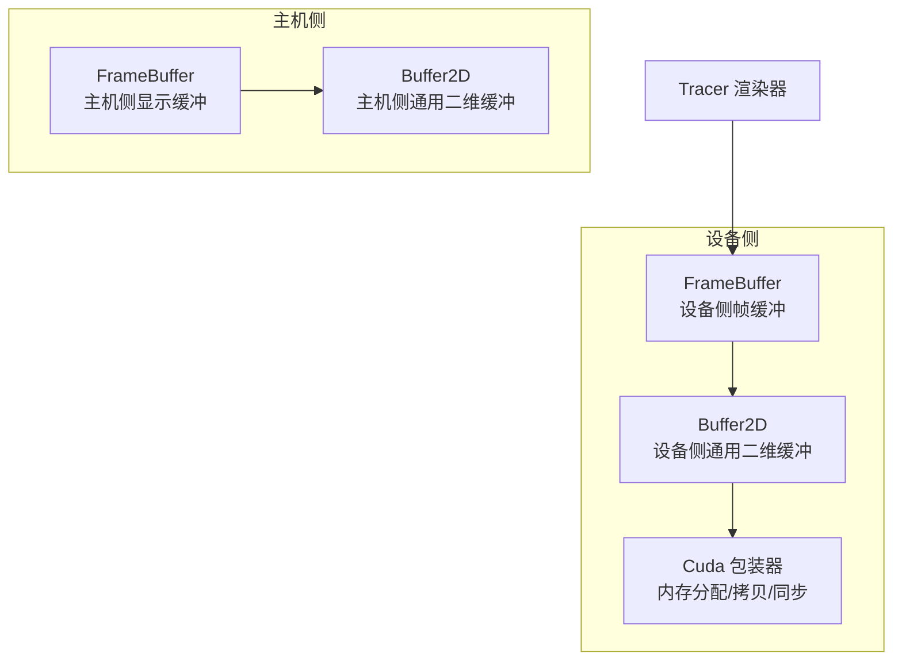
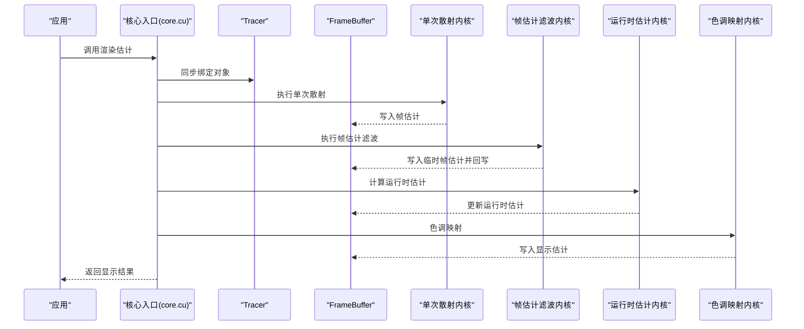
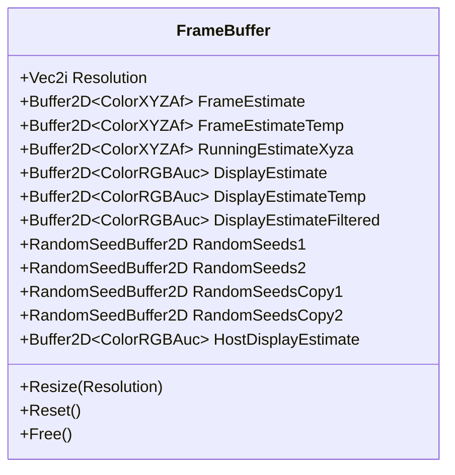
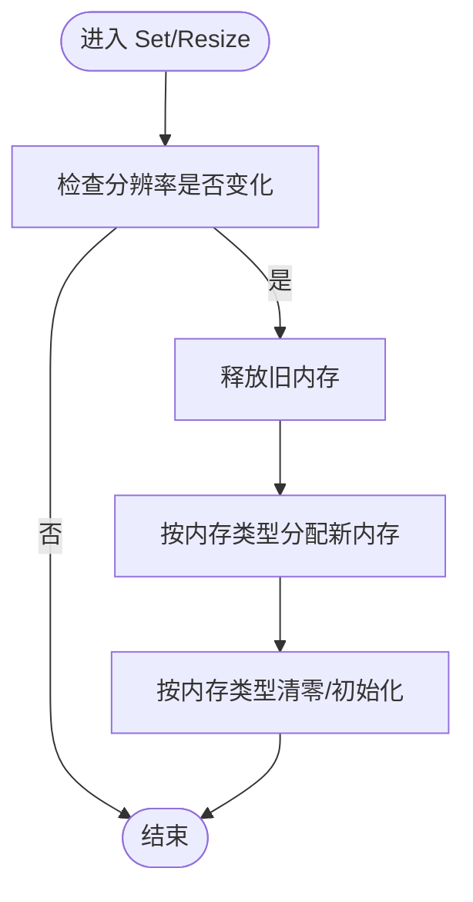
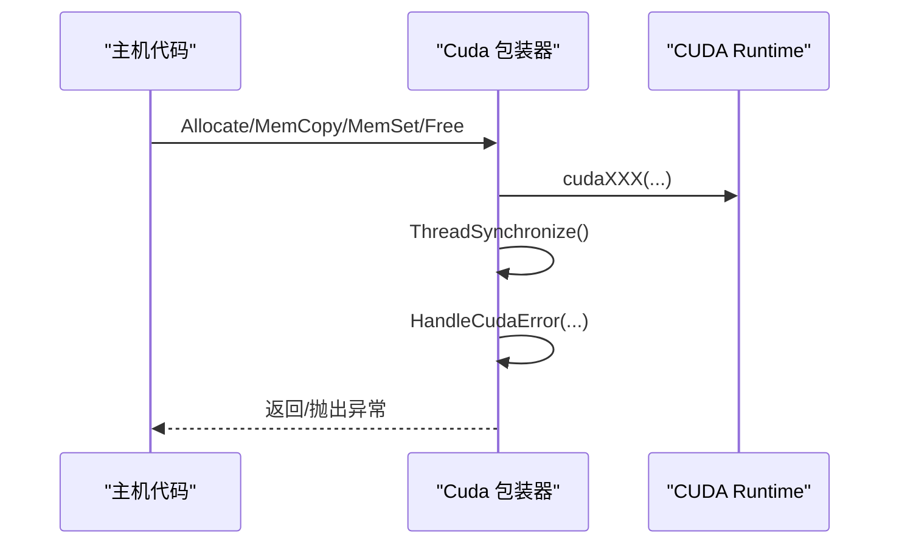
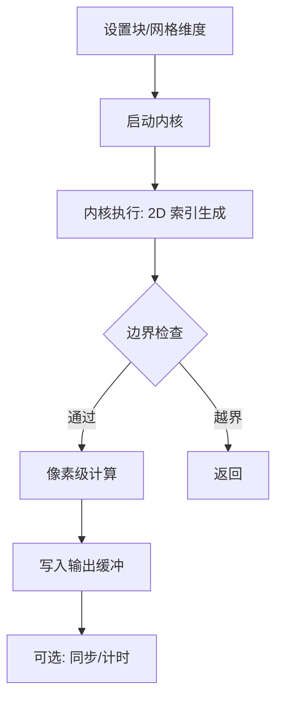
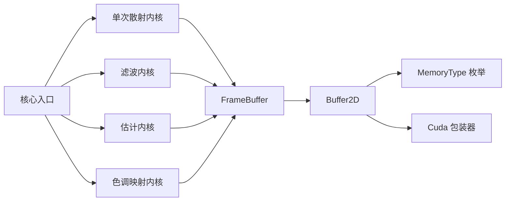

# 性能优化技术

<cite>
**本文引用的文件**
- [framebuffer.h](file://Source/framebuffer.h)
- [buffer2d.h](file://Source/buffer2d.h)
- [buffer.h](file://Source/buffer.h)
- [wrapper.cuh](file://Source/wrapper.cuh)
- [core.cu](file://Source/core.cu)
- [macros.cuh](file://Source/macros.cuh)
- [singlescattering.cuh](file://Source/singlescattering.cuh)
- [filterframeestimate.cuh](file://Source/filterframeestimate.cuh)
- [estimate.cuh](file://Source/estimate.cuh)
- [tonemap.cuh](file://Source/tonemap.cuh)
- [color.h](file://Source/color.h)
- [timing.h](file://Source/timing.h)
- [enums.h](file://Source/enums.h)
- [defines.h](file://Source/defines.h)
</cite>

## 目录
1. [引言](#引言)
2. [项目结构](#项目结构)
3. [核心组件](#核心组件)
4. [架构总览](#架构总览)
5. [详细组件分析](#详细组件分析)
6. [依赖关系分析](#依赖关系分析)
7. [性能考量](#性能考量)
8. [故障排查指南](#故障排查指南)
9. [结论](#结论)
10. [附录](#附录)

## 引言
本文件聚焦于帧缓冲与内存管理中的性能优化策略与技术，结合代码库中实际实现，系统阐述以下主题：
- 内存复用、预分配与批处理在渲染流水线中的应用
- CUDA 内存访问模式优化、纹理内存使用与共享内存利用
- 缓存友好的数据布局与内存对齐技术
- 处理内存带宽限制与计算-内存平衡
- 性能分析工具的使用与瓶颈识别方法

目标是让初学者能够循序渐进地理解这些技术，同时为有经验的开发者提供深入的实现细节与优化建议。

## 项目结构
该渲染框架采用“主机侧缓冲 + 设备侧缓冲”的双缓冲设计，围绕帧缓冲（FrameBuffer）组织多阶段渲染：单次散射估计、帧估计滤波、运行时估计累积与色调映射。内存管理通过模板化缓冲类统一抽象，支持主机与设备两种内存类型，并提供重置、释放与尺寸变更等操作。

**图表来源**
- [framebuffer.h:26-105](file://Source/framebuffer.h#L26-L105)
- [buffer2d.h:26-263](file://Source/buffer2d.h#L26-L263)
- [wrapper.cuh:35-143](file://Source/wrapper.cuh#L35-L143)

**章节来源**
- [framebuffer.h:26-105](file://Source/framebuffer.h#L26-L105)
- [buffer2d.h:26-263](file://Source/buffer2d.h#L26-L263)
- [buffer.h:27-121](file://Source/buffer.h#L27-L121)
- [wrapper.cuh:35-143](file://Source/wrapper.cuh#L35-L143)

## 核心组件
- 帧缓冲（FrameBuffer）
  - 管理渲染过程中的多层缓冲区：帧估计、临时帧估计、运行时估计、显示估计、滤波后显示估计、随机种子等。
  - 提供尺寸变更、重置与释放接口，确保在分辨率变化或渲染迭代过程中保持资源一致性。
- 二维缓冲（Buffer2D<T>）
  - 统一的二维数据容器，支持主机/设备内存类型切换、按像素访问、双线性插值采样、批量内存拷贝与重置。
  - 通过模板参数承载不同颜色空间与精度的数据类型，如 XYZA 浮点与 RGBA 字节。
- CUDA 包装器（Cuda Wrapper）
  - 封装 cudaMalloc/cudaMemcpy/cudaMemset/cudaFree 等底层调用，统一错误处理与同步机制，避免在内核代码中重复编写同步与异常处理逻辑。
- 渲染管线步骤
  - 单次散射估计、帧估计滤波、运行时估计累积、色调映射，每个步骤均以 2D 内核并行执行，块大小与网格大小通过宏进行配置。

**章节来源**
- [framebuffer.h:45-104](file://Source/framebuffer.h#L45-L104)
- [buffer2d.h:125-263](file://Source/buffer2d.h#L125-L263)
- [wrapper.cuh:53-143](file://Source/wrapper.cuh#L53-L143)
- [singlescattering.cuh:27-38](file://Source/singlescattering.cuh#L27-L38)
- [filterframeestimate.cuh:33-74](file://Source/filterframeestimate.cuh#L33-L74)
- [estimate.cuh:27-38](file://Source/estimate.cuh#L27-L38)
- [tonemap.cuh:49-65](file://Source/tonemap.cuh#L49-L65)

## 架构总览
渲染流程从 Tracer 入手，依次执行单次散射估计、帧估计滤波、运行时估计累积与色调映射。每一步都以 2D 并行内核完成像素级计算，帧缓冲作为中间结果载体贯穿全流程。

**图表来源**
- [core.cu:126-143](file://Source/core.cu#L126-L143)
- [singlescattering.cuh:27-38](file://Source/singlescattering.cuh#L27-L38)
- [filterframeestimate.cuh:66-74](file://Source/filterframeestimate.cuh#L66-L74)
- [estimate.cuh:34-38](file://Source/estimate.cuh#L34-L38)
- [tonemap.cuh:61-65](file://Source/tonemap.cuh#L61-L65)

## 详细组件分析

### 帧缓冲（FrameBuffer）与内存复用
- 多缓冲区设计
  - 帧估计与临时帧估计用于滤波前后的交换，避免写-读冲突与重复分配。
  - 运行时估计与显示估计分别承载累积平均与最终输出，减少中间转换开销。
  - 随机种子缓冲与缓存副本用于在分辨率变化后快速恢复状态。
- 尺寸变更与重置
  - Resize 在分辨率变化时统一释放并重新分配所有相关缓冲，随后将缓存副本复制回原始种子缓冲，保证渲染稳定性。
  - Reset 将种子缓冲重置为缓存副本，便于交互式渲染场景下的快速回滚。
- 主机侧显示缓冲
  - 用于最终将设备侧显示估计拷贝到主机侧，以便上层应用显示或保存。

**图表来源**
- [framebuffer.h:26-105](file://Source/framebuffer.h#L26-L105)

**章节来源**
- [framebuffer.h:45-104](file://Source/framebuffer.h#L45-L104)

### 二维缓冲（Buffer2D<T>）与内存对齐
- 数据布局与访问
  - 以行优先顺序存储，提供基于坐标的直接索引与基于归一化坐标的双线性插值采样，满足滤波与纹理采样的需求。
  - 通过模板参数支持多种颜色类型（如 XYZAf、RGBAuc），在不牺牲性能的前提下实现类型安全。
- 内存对齐与带宽优化
  - 通过统一的字节计数与元素计数接口，便于估算内存占用与带宽压力；在设备侧分配时可结合 CUDA 的对齐要求减少跨线程块的访存抖动。
- 批处理与拷贝
  - 支持主机/设备之间的批量内存拷贝，减少多次小块传输带来的同步与调度开销。

**图表来源**
- [buffer2d.h:125-164](file://Source/buffer2d.h#L125-L164)

**章节来源**
- [buffer2d.h:125-263](file://Source/buffer2d.h#L125-L263)
- [buffer.h:83-121](file://Source/buffer.h#L83-L121)

### CUDA 包装器与同步策略
- 错误处理与同步
  - 每个包装函数在调用底层 CUDA API 前后执行同步与错误检查，确保异常被及时捕获并抛出，避免静默失败导致的调试困难。
- 内存管理
  - 提供设备端内存分配、按行步进分配（pitched）、清零与释放，便于实现对齐与高效访存。
- 使用建议
  - 在频繁调用的路径中尽量合并多次内存拷贝，减少同步次数；在内核启动前后成对使用同步，避免异步错误传播。

**图表来源**
- [wrapper.cuh:53-143](file://Source/wrapper.cuh#L53-L143)

**章节来源**
- [wrapper.cuh:38-143](file://Source/wrapper.cuh#L38-L143)

### 渲染内核与并行度配置
- 宏配置
  - 通过 LAUNCH_DIMENSIONS 计算网格与块维度，LAUNCH_CUDA_KERNEL/LAUNCH_CUDA_KERNEL_TIMED 统一封装内核启动与同步，便于插入计时与错误检查。
- 内核实现
  - 单次散射、帧估计滤波、运行时估计与色调映射均为 2D 内核，使用 KERNEL_2D 宏生成线程索引与边界检查，确保覆盖全图像区域。
- 批处理与流水线
  - 每个步骤独立内核，便于并行执行与流水线化；通过帧缓冲的临时缓冲实现无锁交换。

**图表来源**
- [macros.cuh:27-101](file://Source/macros.cuh#L27-L101)
- [singlescattering.cuh:27-38](file://Source/singlescattering.cuh#L27-L38)
- [filterframeestimate.cuh:33-74](file://Source/filterframeestimate.cuh#L33-L74)
- [estimate.cuh:27-38](file://Source/estimate.cuh#L27-L38)
- [tonemap.cuh:49-65](file://Source/tonemap.cuh#L49-L65)

**章节来源**
- [macros.cuh:27-101](file://Source/macros.cuh#L27-L101)
- [singlescattering.cuh:27-38](file://Source/singlescattering.cuh#L27-L38)
- [filterframeestimate.cuh:33-74](file://Source/filterframeestimate.cuh#L33-L74)
- [estimate.cuh:27-38](file://Source/estimate.cuh#L27-L38)
- [tonemap.cuh:49-65](file://Source/tonemap.cuh#L49-L65)

### 颜色模型与数据类型选择
- 颜色类型
  - XYZAf 用于中间估计，RGBAuc 用于最终显示，减少量化误差与带宽占用。
- 线性到 sRGB 映射
  - 通过显式的颜色空间转换与曝光控制，避免在设备侧进行昂贵的幂运算，将部分计算迁移到主机侧或常量内存中。

**章节来源**
- [color.h:59-286](file://Source/color.h#L59-L286)

## 依赖关系分析
- 组件耦合
  - FrameBuffer 依赖 Buffer2D 与颜色类型；渲染内核依赖 Tracer 上下文与 FrameBuffer；CUDA 包装器被所有内存操作调用。
- 直接与间接依赖
  - Buffer2D 对枚举类型（内存类型）与 CUDA 包装器存在直接依赖；渲染内核对颜色模型与几何工具存在间接依赖。
- 循环依赖
  - 未发现循环依赖；各模块职责清晰，接口稳定。

**图表来源**
- [framebuffer.h:26-105](file://Source/framebuffer.h#L26-L105)
- [buffer2d.h:26-263](file://Source/buffer2d.h#L26-L263)
- [enums.h:26-37](file://Source/enums.h#L26-L37)
- [wrapper.cuh:35-143](file://Source/wrapper.cuh#L35-L143)
- [singlescattering.cuh:27-38](file://Source/singlescattering.cuh#L27-L38)
- [filterframeestimate.cuh:33-74](file://Source/filterframeestimate.cuh#L33-L74)
- [estimate.cuh:27-38](file://Source/estimate.cuh#L27-L38)
- [tonemap.cuh:49-65](file://Source/tonemap.cuh#L49-L65)
- [core.cu:126-143](file://Source/core.cu#L126-L143)

**章节来源**
- [enums.h:26-37](file://Source/enums.h#L26-L37)
- [wrapper.cuh:35-143](file://Source/wrapper.cuh#L35-L143)

## 性能考量
- 内存复用与预分配
  - 通过帧缓冲的多缓冲区设计与 Resize/Free/Reset 机制，在分辨率变化时避免频繁分配与拷贝，降低碎片化与同步成本。
- 批处理与流水线
  - 每个渲染步骤独立内核，配合帧缓冲的临时缓冲实现无锁交换，提高吞吐量。
- 计算-内存平衡
  - 滤波内核在设备侧完成，避免频繁主机-设备往返；颜色转换与曝光控制在内核中进行，减少额外拷贝。
- 内存带宽限制
  - 使用 XYZAf 中间格式减少量化损失，RGBAuc 输出仅在最后一步进行，降低带宽峰值。
- 访存模式与对齐
  - 通过统一的行优先布局与模板化缓冲，便于实现连续访存与对齐；在需要时可结合 pitched 分配优化跨线程块的内存访问。
- 共享内存与纹理内存
  - 当前实现主要依赖全局内存与常量内存；若需进一步优化，可在局部热点数据（如滤波核权重、查询表）上引入共享内存与纹理内存，减少全局内存压力。
- 性能分析与瓶颈识别
  - 使用计时宏封装内核执行时间，结合错误检查与同步，定位耗时步骤与潜在问题。

**章节来源**
- [buffer2d.h:125-164](file://Source/buffer2d.h#L125-L164)
- [wrapper.cuh:53-143](file://Source/wrapper.cuh#L53-L143)
- [macros.cuh:41-73](file://Source/macros.cuh#L41-L73)
- [timing.h:27-61](file://Source/timing.h#L27-L61)

## 故障排查指南
- 常见问题
  - 内存不足：检查帧缓冲分辨率与颜色类型组合，适当降低分辨率或改用更紧凑的数据类型。
  - 同步错误：确认在每次内存拷贝与内核启动后执行同步与错误检查。
  - 访存越界：核内使用 KERNEL_2D 宏生成的边界检查，确保索引合法。
- 工具与方法
  - 使用计时宏记录关键内核耗时，对比不同块/网格配置的效果。
  - 结合 CUDA 错误处理包装器，定位具体失败位置与原因。

**章节来源**
- [wrapper.cuh:38-50](file://Source/wrapper.cuh#L38-L50)
- [macros.cuh:41-73](file://Source/macros.cuh#L41-L73)
- [timing.h:27-61](file://Source/timing.h#L27-L61)

## 结论
本框架通过“帧缓冲 + 二维缓冲 + CUDA 包装器”的组合，实现了高效的体积渲染流水线。其性能优化要点包括：
- 帧缓冲多缓冲区设计与尺寸变更时的预分配/复用
- 2D 内核的批处理与流水线化
- 统一的内存管理与错误处理
- 颜色空间与数据类型的合理选择
在此基础上，可进一步探索共享内存与纹理内存的使用，以应对更严苛的带宽与延迟约束。

## 附录
- 关键实现路径参考
  - 帧缓冲与缓冲区生命周期：[framebuffer.h:45-104](file://Source/framebuffer.h#L45-L104)、[buffer2d.h:125-164](file://Source/buffer2d.h#L125-L164)
  - CUDA 包装器与同步：[wrapper.cuh:53-143](file://Source/wrapper.cuh#L53-L143)
  - 渲染内核与宏配置：[macros.cuh:27-101](file://Source/macros.cuh#L27-L101)、[singlescattering.cuh:27-38](file://Source/singlescattering.cuh#L27-L38)、[filterframeestimate.cuh:33-74](file://Source/filterframeestimate.cuh#L33-L74)、[estimate.cuh:27-38](file://Source/estimate.cuh#L27-L38)、[tonemap.cuh:49-65](file://Source/tonemap.cuh#L49-L65)
  - 颜色模型与曝光控制：[color.h:59-286](file://Source/color.h#L59-L286)
  - 计时与事件：[timing.h:27-61](file://Source/timing.h#L27-L61)
  - 枚举与定义：[enums.h:26-37](file://Source/enums.h#L26-L37)、[defines.h:37-114](file://Source/defines.h#L37-L114)