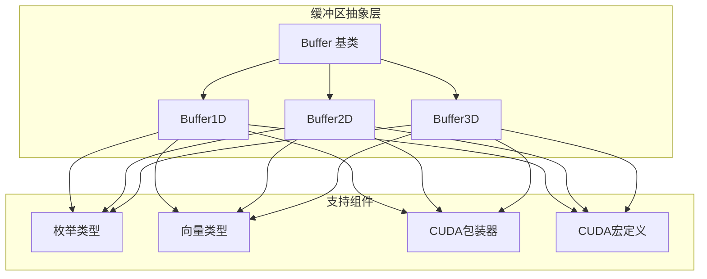
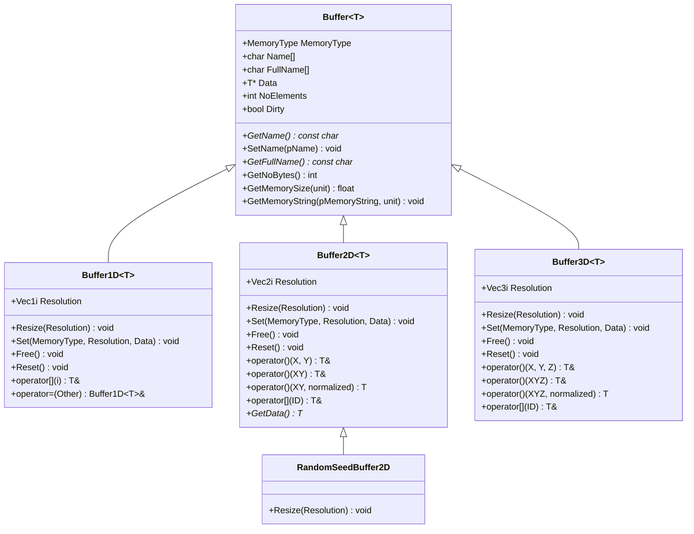
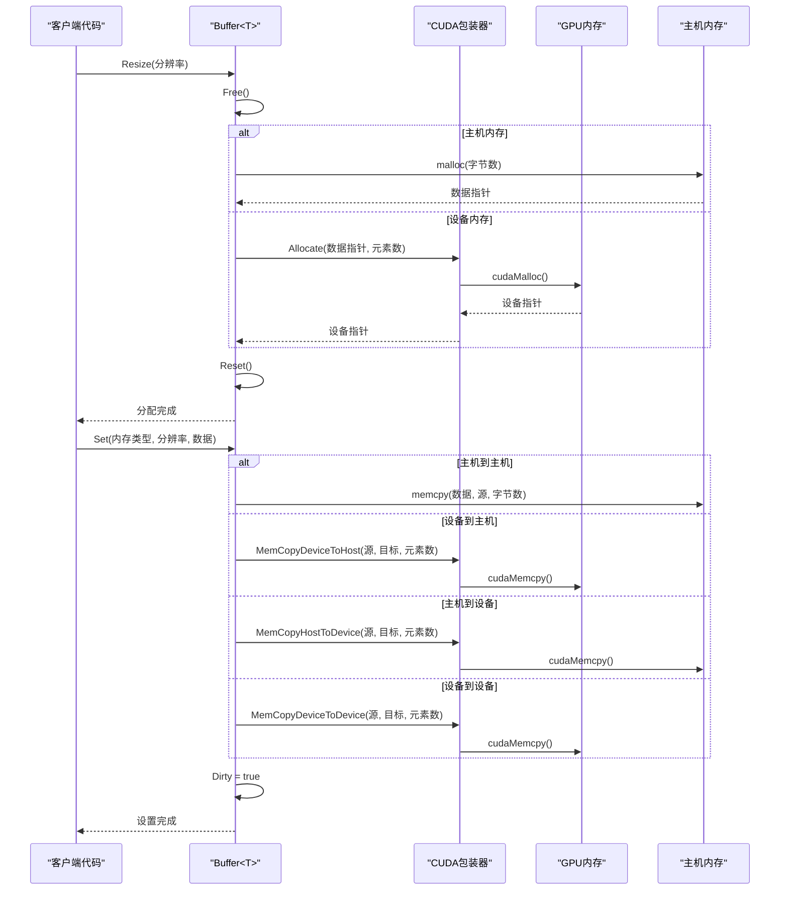
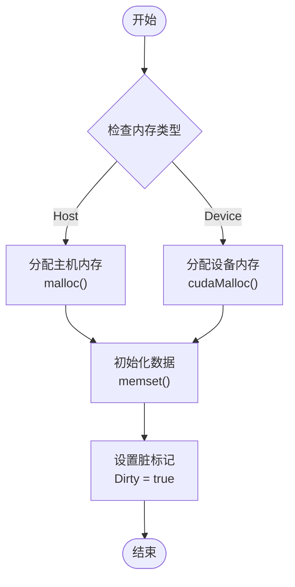
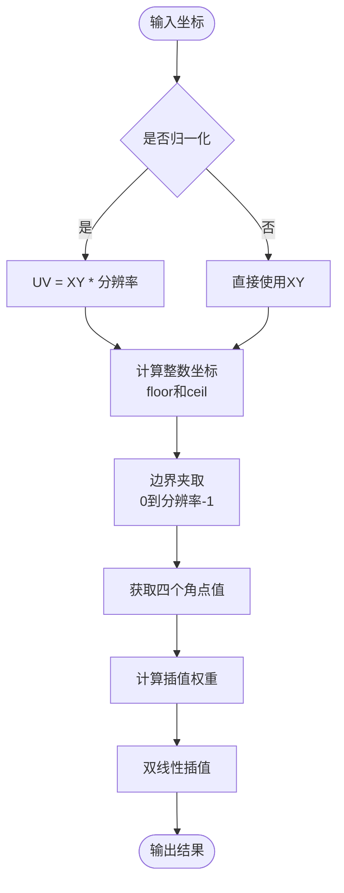
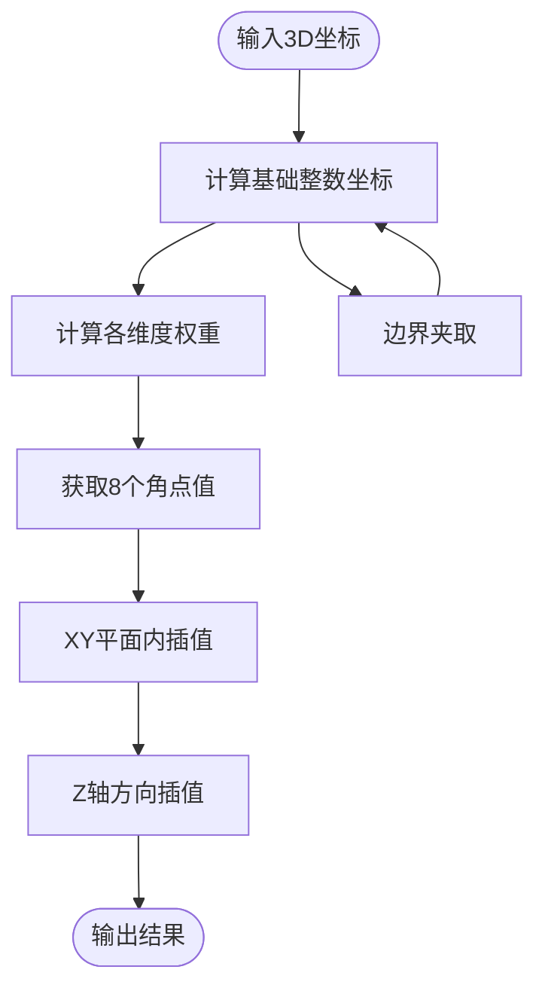
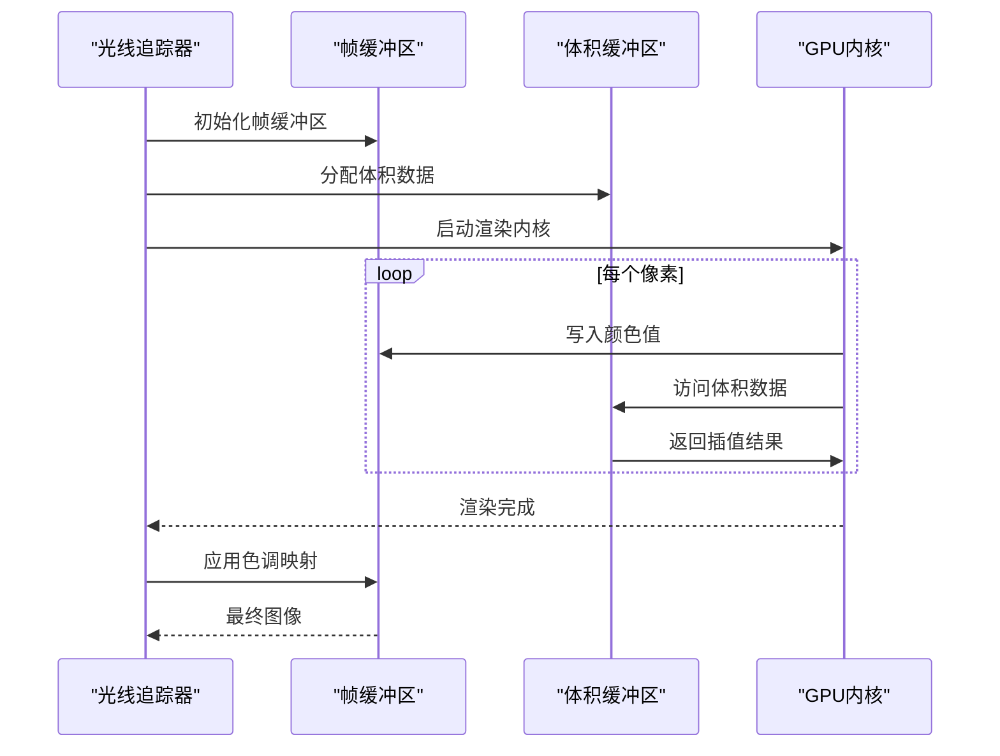
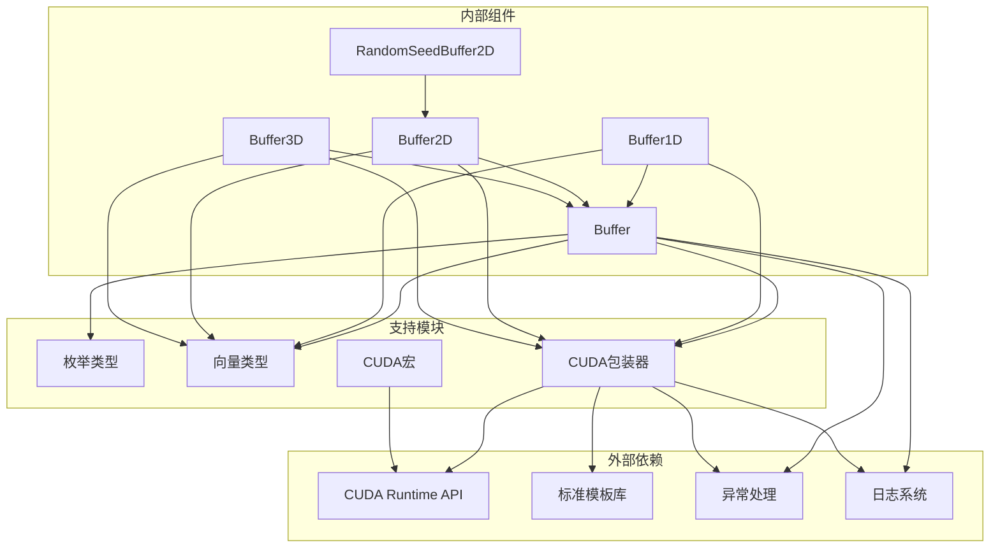

# 缓冲区抽象层

<cite>
**本文档引用的文件**
- [buffer.h](file://Source/buffer.h)
- [buffer1d.h](file://Source/buffer1d.h)
- [buffer2d.h](file://Source/buffer2d.h)
- [buffer3d.h](file://Source/buffer3d.h)
- [enums.h](file://Source/enums.h)
- [vector.h](file://Source/vector.h)
- [wrapper.cuh](file://Source/wrapper.cuh)
- [macros.cuh](file://Source/macros.cuh)
- [device.h](file://Source/device.h)
</cite>

## 目录
1. [简介](#简介)
2. [项目结构](#项目结构)
3. [核心组件](#核心组件)
4. [架构概览](#架构概览)
5. [详细组件分析](#详细组件分析)
6. [依赖关系分析](#依赖关系分析)
7. [性能考虑](#性能考虑)
8. [故障排除指南](#故障排除指南)
9. [结论](#结论)

## 简介

缓冲区抽象层是Exposure Render体积渲染框架的核心基础设施，为GPU和CPU内存管理提供了统一的抽象机制。该系统通过模板类设计实现了对一维、二维和三维缓冲区的通用封装，支持主机内存（Host）和设备内存（Device）之间的无缝切换。

本系统的主要目标包括：
- 提供统一的缓冲区接口，隐藏底层内存管理细节
- 支持GPU和CPU内存的动态分配与释放
- 实现缓冲区尺寸调整时的智能内存重新分配
- 提供高效的内存拷贝和数据传输机制
- 支持渲染流水线中的各种缓冲区操作

## 项目结构

缓冲区抽象层位于Source目录下，采用分层设计模式：

**图表来源**
- [buffer.h:27-121](file://Source/buffer.h#L27-L121)
- [buffer1d.h:26-193](file://Source/buffer1d.h#L26-L193)
- [buffer2d.h:26-263](file://Source/buffer2d.h#L26-L263)
- [buffer3d.h:26-251](file://Source/buffer3d.h#L26-L251)

**章节来源**
- [buffer.h:1-124](file://Source/buffer.h#L1-L124)
- [buffer1d.h:1-196](file://Source/buffer1d.h#L1-L196)
- [buffer2d.h:1-289](file://Source/buffer2d.h#L1-L289)
- [buffer3d.h:1-254](file://Source/buffer3d.h#L1-L254)

## 核心组件

缓冲区抽象层由一个基类和三个专门化的模板类组成，每个类都针对特定维度的数据存储进行了优化。

### 基类 Buffer<T>

基类提供了所有缓冲区类型的通用功能：
- 内存类型管理（主机/设备）
- 数据指针和元素计数
- 缓冲区名称和全名管理
- 内存大小查询和格式化输出
- 脏标记机制用于优化更新

### 一维缓冲区 Buffer1D<T>

专为线性数据设计，支持：
- 单精度浮点数数组
- 简单的一维索引访问
- 自动内存管理和重置

### 二维缓冲区 Buffer2D<T>

面向图像和纹理应用，提供：
- 高级插值功能（双线性插值）
- 位置坐标到索引的映射
- 随机种子缓冲区专用实现

### 三维缓冲区 Buffer3D<T>

用于体积数据和3D场景，包含：
- 三线性插值算法
- 体积坐标到线性索引的转换
- 高效的内存布局优化

**章节来源**
- [buffer.h:27-121](file://Source/buffer.h#L27-L121)
- [buffer1d.h:26-193](file://Source/buffer1d.h#L26-L193)
- [buffer2d.h:26-263](file://Source/buffer2d.h#L26-L263)
- [buffer3d.h:26-251](file://Source/buffer3d.h#L26-L251)

## 架构概览

缓冲区抽象层采用了典型的模板继承架构，通过虚函数实现多态行为：

**图表来源**
- [buffer.h:27-121](file://Source/buffer.h#L27-L121)
- [buffer1d.h:26-193](file://Source/buffer1d.h#L26-L193)
- [buffer2d.h:26-288](file://Source/buffer2d.h#L26-L288)
- [buffer3d.h:26-251](file://Source/buffer3d.h#L26-L251)

## 详细组件分析

### 设备内存管理机制

缓冲区系统通过CUDA包装器实现了统一的GPU内存管理：

**图表来源**
- [buffer1d.h:117-175](file://Source/buffer1d.h#L117-L175)
- [buffer2d.h:166-198](file://Source/buffer2d.h#L166-L198)
- [buffer3d.h:166-198](file://Source/buffer3d.h#L166-L198)
- [wrapper.cuh:53-114](file://Source/wrapper.cuh#L53-L114)

### 内存类型统一抽象

系统通过枚举类型实现了内存类型的统一管理：

| 枚举值 | 描述 | 使用场景 |
|--------|------|----------|
| Host | 主机内存 | CPU计算、调试、小规模数据 |
| Device | 设备内存 | GPU计算、大规模数据处理 |

内存类型信息不仅影响分配策略，还决定了后续的所有内存操作：

**图表来源**
- [enums.h:26-37](file://Source/enums.h#L26-L37)
- [buffer1d.h:132-140](file://Source/buffer1d.h#L132-L140)
- [buffer2d.h:149-163](file://Source/buffer2d.h#L149-L163)
- [buffer3d.h:149-164](file://Source/buffer3d.h#L149-L164)

### 二维缓冲区高级功能

Buffer2D提供了丰富的图像处理功能，特别是插值算法：

**图表来源**
- [buffer2d.h:227-254](file://Source/buffer2d.h#L227-L254)

### 三维缓冲区插值算法

Buffer3D实现了三线性插值，用于体积数据的高质量采样：

**图表来源**
- [buffer3d.h:222-242](file://Source/buffer3d.h#L222-L242)

### 渲染流水线集成

缓冲区系统在渲染流水线中扮演关键角色：

**图表来源**
- [buffer2d.h:210-213](file://Source/buffer2d.h#L210-L213)
- [buffer3d.h:210-214](file://Source/buffer3d.h#L210-L214)

**章节来源**
- [buffer1d.h:67-175](file://Source/buffer1d.h#L67-L175)
- [buffer2d.h:67-198](file://Source/buffer2d.h#L67-L198)
- [buffer3d.h:67-198](file://Source/buffer3d.h#L67-L198)
- [wrapper.cuh:38-147](file://Source/wrapper.cuh#L38-L147)

## 依赖关系分析

缓冲区抽象层的依赖关系体现了清晰的分层架构：

**图表来源**
- [buffer.h:21-22](file://Source/buffer.h#L21-L22)
- [buffer1d.h:21](file://Source/buffer1d.h#L21)
- [buffer2d.h:21](file://Source/buffer2d.h#L21)
- [buffer3d.h:21](file://Source/buffer3d.h#L21)
- [wrapper.cuh:26-28](file://Source/wrapper.cuh#L26-L28)

**章节来源**
- [buffer.h:21-22](file://Source/buffer.h#L21-L22)
- [buffer1d.h:21](file://Source/buffer1d.h#L21)
- [buffer2d.h:21](file://Source/buffer2d.h#L21)
- [buffer3d.h:21](file://Source/buffer3d.h#L21)
- [wrapper.cuh:26-28](file://Source/wrapper.cuh#L26-L28)

## 性能考虑

### 内存分配优化

缓冲区系统通过以下机制优化内存使用：

1. **延迟分配**：只有在需要时才进行内存分配
2. **批量释放**：统一的Free方法处理不同内存类型的释放
3. **脏标记机制**：避免不必要的数据传输
4. **智能重分配**：当分辨率改变时自动释放旧内存

### 访问模式优化

- **连续内存布局**：所有缓冲区都使用连续内存布局，提高缓存命中率
- **向量化访问**：支持[]操作符进行快速随机访问
- **边界检查**：在Debug版本中提供边界检查，Release版本中移除开销

### GPU内存管理

- **同步机制**：所有CUDA调用前后都有适当的同步
- **错误处理**：统一的错误处理机制确保程序稳定性
- **内存对齐**：利用CUDA的内存对齐特性提高性能

## 故障排除指南

### 常见问题及解决方案

#### 内存分配失败
**症状**：程序崩溃或抛出异常
**原因**：GPU内存不足或主机内存分配失败
**解决方案**：
1. 检查可用内存大小
2. 减少缓冲区分辨率
3. 确保正确调用Free()释放内存

#### 数据传输错误
**症状**：内存拷贝操作失败
**原因**：源地址或目标地址无效
**解决方案**：
1. 验证内存类型一致性
2. 检查缓冲区是否已初始化
3. 确认数据指针有效性

#### 性能问题
**症状**：渲染速度慢或内存占用高
**原因**：频繁的内存重新分配
**解决方案**：
1. 预先确定合适的缓冲区大小
2. 复用现有缓冲区而非频繁创建新对象
3. 使用脏标记机制避免不必要的更新

**章节来源**
- [wrapper.cuh:38-46](file://Source/wrapper.cuh#L38-L46)
- [buffer1d.h:67-88](file://Source/buffer1d.h#L67-L88)
- [buffer2d.h:67-96](file://Source/buffer2d.h#L67-L96)
- [buffer3d.h:67-96](file://Source/buffer3d.h#L67-L96)

## 结论

Exposure Render的缓冲区抽象层通过精心设计的模板架构，成功地为GPU和CPU内存管理提供了统一的抽象机制。该系统的主要优势包括：

1. **统一接口**：所有缓冲区类型共享相同的API，简化了使用复杂度
2. **灵活的内存管理**：支持主机和设备内存的动态切换
3. **高性能实现**：优化的内存布局和访问模式
4. **完善的错误处理**：全面的异常处理和调试支持
5. **扩展性强**：基于模板的设计便于添加新的缓冲区类型

对于初学者，建议从Buffer2D开始学习，因为它提供了最直观的二维数据访问模式。对于有经验的开发者，可以利用模板特化和自定义缓冲区类型来满足特定的性能需求。

该缓冲区抽象层为体积渲染应用提供了坚实的基础，能够有效支持从简单场景到复杂体积数据的广泛应用场景。