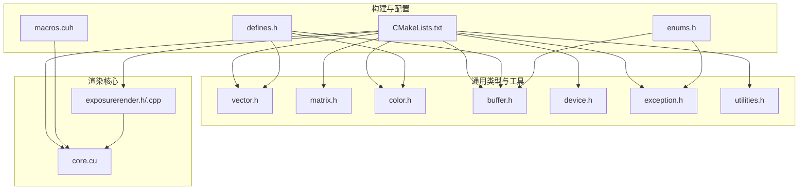
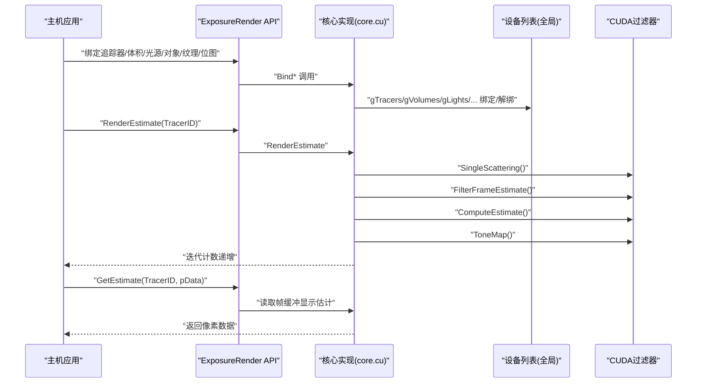
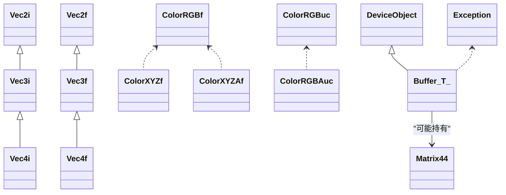
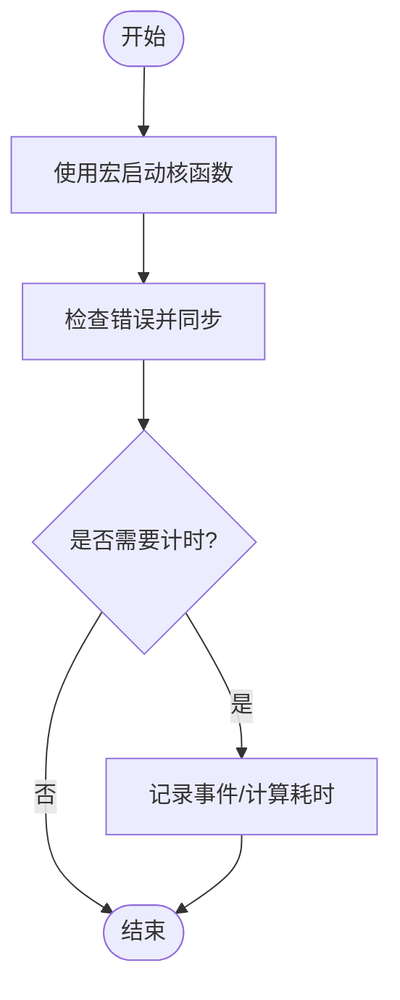
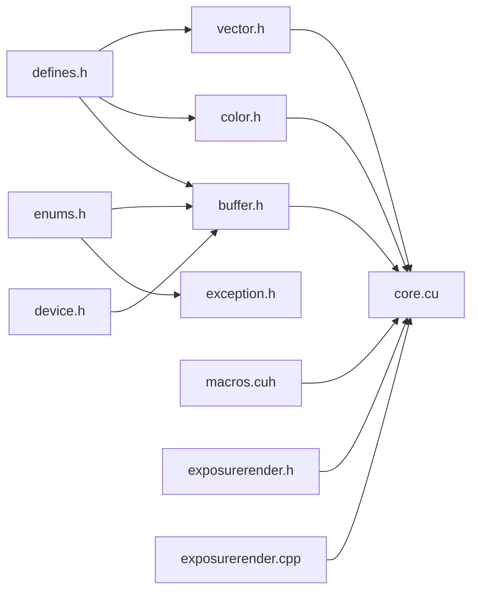

# 代码贡献规范

<cite>
**本文引用的文件**
- [README.md](file://README.md)
- [CMakeLists.txt](file://Source/CMakeLists.txt)
- [defines.h](file://Source/defines.h)
- [enums.h](file://Source/enums.h)
- [macros.cuh](file://Source/macros.cuh)
- [vector.h](file://Source/vector.h)
- [matrix.h](file://Source/matrix.h)
- [color.h](file://Source/color.h)
- [buffer.h](file://Source/buffer.h)
- [device.h](file://Source/device.h)
- [exception.h](file://Source/exception.h)
- [exposurerender.h](file://Source/exposurerender.h)
- [exposurerender.cpp](file://Source/exposurerender.cpp)
- [core.cu](file://Source/core.cu)
- [utilities.h](file://Source/utilities.h)
</cite>

## 目录
1. [引言](#引言)
2. [项目结构](#项目结构)
3. [核心组件](#核心组件)
4. [架构总览](#架构总览)
5. [详细组件分析](#详细组件分析)
6. [依赖关系分析](#依赖关系分析)
7. [性能考量](#性能考量)
8. [故障排查指南](#故障排查指南)
9. [结论](#结论)
10. [附录：代码审查检查清单与最佳实践](#附录代码审查检查清单与最佳实践)

## 引言
本文件面向新老贡献者，系统化阐述本项目的代码编写标准、命名约定、注释规范、编码风格与模块化原则，并结合实际源码示例说明 C++ 与 CUDA 的正确实践。文档同时覆盖项目特有的宏定义、常量与枚举使用规范，以及构建与组织结构要点，帮助贡献者快速上手并保持高质量一致性。

## 项目结构
项目采用“按功能域分组”的头文件组织方式，核心渲染管线以 CUDA 核函数与主机端接口协同工作。CMake 脚本将通用头文件、形状类、绑定 API、CUDA 过滤器等分别归入不同源组，便于维护与构建。

图表来源
- [CMakeLists.txt:136-155](file://Source/CMakeLists.txt#L136-L155)
- [defines.h:21-56](file://Source/defines.h#L21-L56)
- [enums.h:24-108](file://Source/enums.h#L24-L108)
- [macros.cuh:24-104](file://Source/macros.cuh#L24-L104)
- [vector.h:24-582](file://Source/vector.h#L24-L582)
- [matrix.h:24-59](file://Source/matrix.h#L24-L59)
- [color.h:23-287](file://Source/color.h#L23-L287)
- [buffer.h:24-124](file://Source/buffer.h#L24-L124)
- [device.h:25-46](file://Source/device.h#L25-L46)
- [exception.h:24-58](file://Source/exception.h#L24-L58)
- [exposurerender.h:29-44](file://Source/exposurerender.h#L29-L44)
- [exposurerender.cpp:19-24](file://Source/exposurerender.cpp#L19-L24)
- [core.cu:19-52](file://Source/core.cu#L19-L52)

章节来源
- [CMakeLists.txt:136-155](file://Source/CMakeLists.txt#L136-L155)
- [README.md:14-16](file://README.md#L14-L16)

## 核心组件
- 命名空间与导出控制：所有符号位于命名空间内，并通过导出宏在 DLL 接口层暴露，确保跨模块可见性与 ABI 稳定性。
- CUDA 宏与设备限定：通过条件编译在 CUDA 架构下启用设备限定符与内联策略，非 CUDA 环境下退化为空定义，保证跨平台兼容。
- 基础数据类型：向量、颜色、矩阵与缓冲区模板类统一采用主机/设备双端函数前缀，支持 CUDA 核函数与主机端调用。
- 枚举与常量：集中于枚举与常量头文件，避免魔法数，提升可读性与可维护性。
- 错误处理：异常类封装错误级别与消息，配合工具函数进行 CUDA 错误检查与同步。

章节来源
- [defines.h:37-56](file://Source/defines.h#L37-L56)
- [enums.h:24-108](file://Source/enums.h#L24-L108)
- [vector.h:24-582](file://Source/vector.h#L24-L582)
- [color.h:23-287](file://Source/color.h#L23-L287)
- [matrix.h:24-59](file://Source/matrix.h#L24-L59)
- [buffer.h:24-124](file://Source/buffer.h#L24-L124)
- [exception.h:24-58](file://Source/exception.h#L24-L58)

## 架构总览
渲染流程由主机端 API 驱动，CUDA 核心负责绑定资源、执行单散射估计、帧估计、估计计算与色调映射，最终输出到帧缓冲。

图表来源
- [exposurerender.h:32-42](file://Source/exposurerender.h#L32-L42)
- [core.cu:56-136](file://Source/core.cu#L56-L136)
- [core.cu:40-46](file://Source/core.cu#L40-L46)

## 详细组件分析

### 命名与导出规范
- 命名空间：所有类型与函数置于命名空间中，避免全局污染。
- 导出宏：对外接口使用导出宏修饰，确保动态库导出与外部链接一致。
- CUDA 设备限定：主机/设备函数前缀统一，核函数使用设备限定符，非 CUDA 环境下退化为空定义，便于跨平台编译。

章节来源
- [exposurerender.h:29-44](file://Source/exposurerender.h#L29-L44)
- [defines.h:31-56](file://Source/defines.h#L31-L56)
- [exposurerender.cpp:21](file://Source/exposurerender.cpp#L21)

### 数据类型与模板设计（向量/颜色/矩阵/缓冲）
- 向量族：提供整型与浮点型二维至四维向量，内置构造、运算符重载、比较、夹取与长度/归一化等常用方法；通过宏批量生成构造与运算逻辑，减少重复代码。
- 颜色族：RGB、XYZ、带 Alpha 的 XYZ 与对应的字节版本，提供跨色彩空间转换静态方法与乘法、插值等运算。
- 矩阵：4×4 浮点矩阵类，支持拷贝与赋值。
- 缓冲：模板缓冲类封装内存类型、名称、元素数量与脏标记，提供内存大小查询与格式化输出。

图表来源
- [vector.h:397-519](file://Source/vector.h#L397-L519)
- [color.h:59-142](file://Source/color.h#L59-L142)
- [matrix.h:27-56](file://Source/matrix.h#L27-L56)
- [buffer.h:27-121](file://Source/buffer.h#L27-L121)
- [device.h:28-43](file://Source/device.h#L28-L43)
- [exception.h:27-55](file://Source/exception.h#L27-L55)

章节来源
- [vector.h:24-582](file://Source/vector.h#L24-L582)
- [color.h:23-287](file://Source/color.h#L23-L287)
- [matrix.h:24-59](file://Source/matrix.h#L24-L59)
- [buffer.h:24-124](file://Source/buffer.h#L24-L124)
- [device.h:25-46](file://Source/device.h#L25-L46)
- [exception.h:24-58](file://Source/exception.h#L24-L58)

### CUDA 宏与内核启动模式
- 内核启动宏：提供维度计算、计时与错误检查的便捷宏，统一核函数调用与同步流程。
- 线程索引宏：提供一维/二维/三维线程索引与边界检查，简化核函数内部逻辑。
- 错误处理：封装 CUDA 错误检查与同步，确保核函数执行后能及时发现异常。

图表来源
- [macros.cuh:27-101](file://Source/macros.cuh#L27-L101)

章节来源
- [macros.cuh:24-104](file://Source/macros.cuh#L24-L104)

### 枚举与常量规范
- 枚举：集中定义内存类型、单位、程序化纹理类型、形状类型、着色模式、梯度模式、异常级别、发射单位、散射函数与类型等，避免分散魔数。
- 常量：数学常量、阈值、尺寸限制与颜色通道数等常量集中定义，统一使用小数或分数形式，便于数值稳定性与一致性。

章节来源
- [enums.h:24-108](file://Source/enums.h#L24-L108)
- [defines.h:58-78](file://Source/defines.h#L58-L78)

### 错误处理与日志
- 异常类：封装错误级别与消息，支持拷贝与赋值，便于传播与记录。
- 日志：主机端接口中使用调试日志记录绑定状态，有助于问题定位。
- CUDA 错误：通过宏统一检查与同步，避免遗漏错误处理路径。

章节来源
- [exception.h:24-58](file://Source/exception.h#L24-L58)
- [core.cu:56-136](file://Source/core.cu#L56-L136)
- [macros.cuh:41-73](file://Source/macros.cuh#L41-L73)

### 主机端 API 与核心流程
- API 层：提供绑定与渲染估计接口，统一对外入口。
- 核心实现：根据传入追踪器 ID 执行单散射估计、帧估计、估计计算与色调映射，并更新迭代次数。
- 资源管理：全局设备列表负责追踪器与各类资源的绑定/解绑与同步。

章节来源
- [exposurerender.h:32-42](file://Source/exposurerender.h#L32-L42)
- [core.cu:56-136](file://Source/core.cu#L56-L136)
- [core.cu:40-46](file://Source/core.cu#L40-L46)

## 依赖关系分析
- 头文件依赖：基础类型与工具类广泛被其他模块依赖；CUDA 过滤器与核心实现依赖宏与常量；API 层依赖核心实现。
- 模块耦合：API 与核心通过全局设备列表解耦；CUDA 过滤器通过统一接口参与渲染管线。
- 外部依赖：CUDA 运行时与 CMake NVCC 编译器，构建脚本明确指定目标架构与包含目录。

图表来源
- [defines.h:21-56](file://Source/defines.h#L21-L56)
- [enums.h:24-108](file://Source/enums.h#L24-L108)
- [macros.cuh:24-104](file://Source/macros.cuh#L24-L104)
- [vector.h:21-22](file://Source/vector.h#L21-L22)
- [color.h:21](file://Source/color.h#L21)
- [buffer.h:21-22](file://Source/buffer.h#L21-L22)
- [device.h:21-23](file://Source/device.h#L21-L23)
- [exposurerender.h:21-27](file://Source/exposurerender.h#L21-L27)
- [exposurerender.cpp:21](file://Source/exposurerender.cpp#L21)
- [core.cu:22-36](file://Source/core.cu#L22-L36)

章节来源
- [CMakeLists.txt:36-42](file://Source/CMakeLists.txt#L36-L42)
- [CMakeLists.txt:136-155](file://Source/CMakeLists.txt#L136-L155)

## 性能考量
- CUDA 同步与计时：使用统一宏进行错误检查与同步，避免遗漏导致的性能陷阱与难以定位的异步错误。
- 线程索引与边界：通过宏生成线程索引与边界检查，减少核函数内部分支判断开销。
- 数值稳定性：常量与夹取操作采用统一实现，降低数值误差累积风险。
- 内存管理：缓冲类提供内存大小查询与格式化输出，辅助诊断内存占用与泄漏。

## 故障排查指南
- CUDA 错误定位：优先检查核函数调用后的错误与同步，确认事件计时与销毁顺序正确。
- 绑定状态：通过主机端日志确认绑定/解绑状态，排查资源未生效问题。
- 枚举与常量：核对枚举值与常量定义，避免越界访问与非法状态。
- 类型一致性：确保主机/设备函数前缀与模板参数匹配，避免编译或运行时错误。

章节来源
- [macros.cuh:41-73](file://Source/macros.cuh#L41-L73)
- [core.cu:56-136](file://Source/core.cu#L56-L136)
- [enums.h:24-108](file://Source/enums.h#L24-L108)
- [defines.h:58-78](file://Source/defines.h#L58-L78)

## 结论
本项目在命名空间与导出控制、CUDA 设备限定、基础数据类型与模板设计、枚举与常量集中化、错误处理与日志等方面形成了清晰的规范。建议贡献者遵循本文档的命名、风格与模块化原则，并在提交前对照附录中的检查清单完成自检，以确保代码质量与可维护性。

## 附录：代码审查检查清单与最佳实践
- 命名与作用域
  - 是否使用统一命名空间包裹？
  - 对外接口是否使用导出宏修饰？
  - 变量与函数是否语义明确、避免缩写？
- CUDA 规范
  - 核函数是否使用设备限定符？主机端调用是否使用主机限定符？
  - 是否在核函数调用后进行错误检查与同步？
  - 是否使用统一的线程索引与边界检查宏？
- 数据类型与模板
  - 向量/颜色/矩阵是否复用宏生成的构造与运算逻辑？
  - 模板参数与函数前缀是否一致？
- 枚举与常量
  - 是否使用集中定义的枚举与常量，避免魔法数？
  - 常量命名是否体现物理意义或用途？
- 错误处理与日志
  - 是否在关键路径添加日志或断言？
  - CUDA 错误是否通过统一宏处理？
- 模块化与依赖
  - 头文件包含是否最小化？是否存在循环依赖？
  - 新增文件是否归入合适的 CMake 源组？
- 注释与文档
  - 公共接口是否具备简要说明其用途与参数含义？
  - 复杂算法或数值细节是否有必要注释？