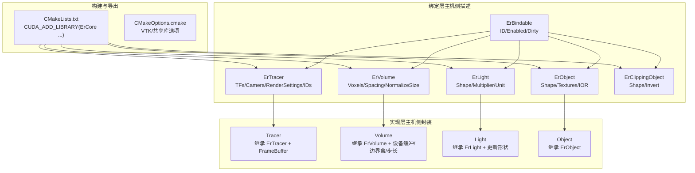
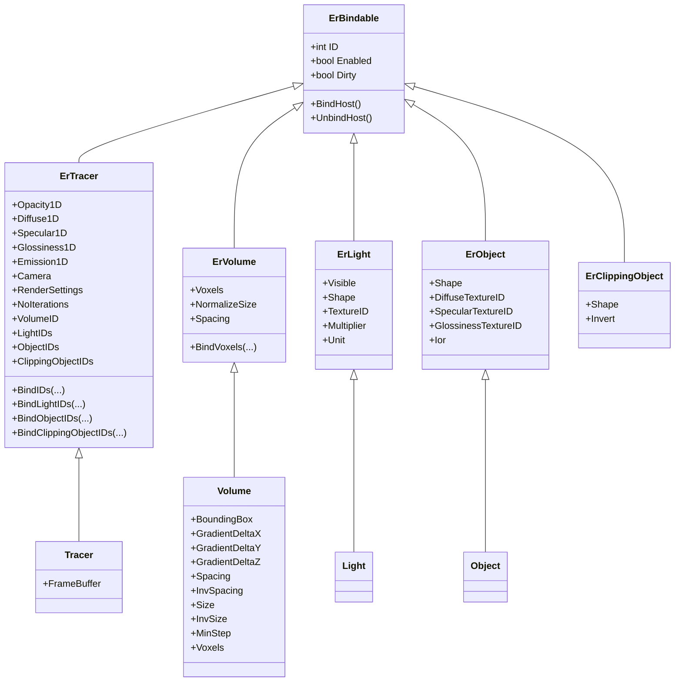
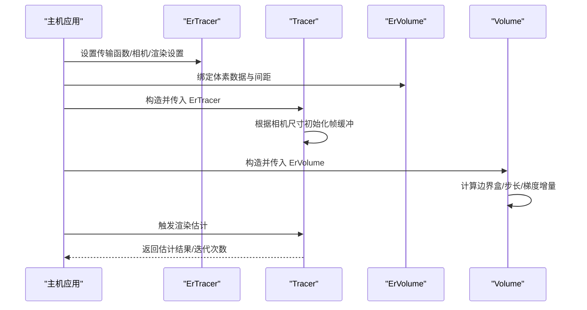
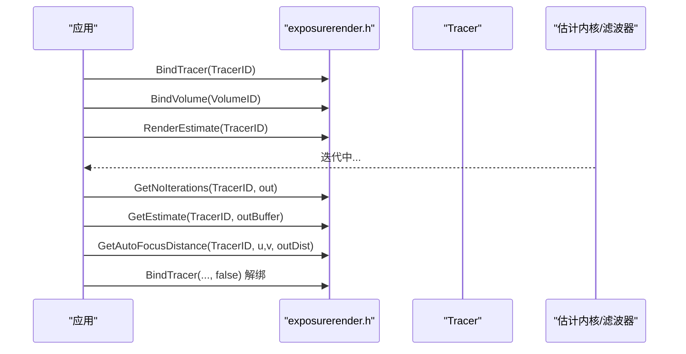
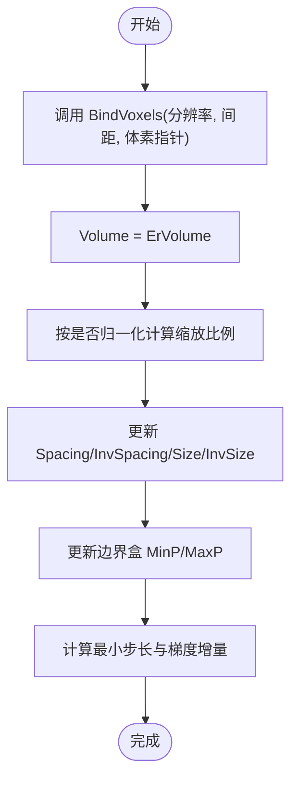
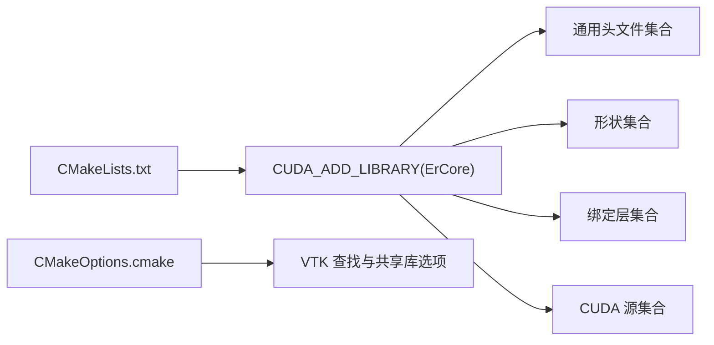

# 开发者指南

<cite>
**本文引用的文件**
- [README.md](file://README.md)
- [CMakeLists.txt](file://Source/CMakeLists.txt)
- [CMakeOptions.cmake](file://Source/CMakeOptions.cmake)
- [exposurerender.h](file://Source/exposurerender.h)
- [exposurerender.cpp](file://Source/exposurerender.cpp)
- [erbindable.h](file://Source/erbindable.h)
- [ertracer.h](file://Source/ertracer.h)
- [ervolume.h](file://Source/ervolume.h)
- [erlight.h](file://Source/erlight.h)
- [erobject.h](file://Source/erobject.h)
- [erclippingobject.h](file://Source/erclippingobject.h)
- [tracer.h](file://Source/tracer.h)
- [volume.h](file://Source/volume.h)
- [light.h](file://Source/light.h)
- [object.h](file://Source/object.h)
</cite>

## 目录
1. [简介](#简介)
2. [项目结构](#项目结构)
3. [核心组件](#核心组件)
4. [架构总览](#架构总览)
5. [详细组件分析](#详细组件分析)
6. [依赖分析](#依赖分析)
7. [性能考虑](#性能考虑)
8. [故障排查指南](#故障排查指南)
9. [结论](#结论)
10. [附录](#附录)

## 简介
本指南面向需要在现有代码库基础上进行二次开发或集成的工程师与研究者。该代码库是一个基于 CUDA 的体积光线渲染引擎，支持物理上合理的光传输与交互式渲染。文档从系统架构、领域模型、接口设计、调用流程、配置项与参数、错误处理与性能优化等维度展开，并通过图示帮助读者快速建立对整体实现的理解。

## 项目结构
仓库采用“分层+功能模块化”的组织方式：
- 核心构建与导出：CMake 脚本负责编译核心库、CUDA 源文件分组与导出符号。
- 绑定层（Bindable）：以 Er 前缀命名的“可绑定”类，用于在主机侧描述渲染对象（如光线追踪器、体积数据、光源、对象、裁剪对象、纹理、位图），并提供统一的生命周期与脏标记机制。
- 实现层（非 Er 前缀类）：在主机侧对绑定层对象进行封装，完成设备端资源管理、缓冲区拷贝、几何更新与渲染帧缓存等职责。
- 渲染 API：对外暴露一组 C 风格的绑定与渲染估计接口，便于外部应用驱动渲染流程。

图表来源
- [CMakeLists.txt:155](file://Source/CMakeLists.txt#L155)
- [erbindable.h:28-68](file://Source/erbindable.h#L28-L68)
- [ertracer.h:33-117](file://Source/ertracer.h#L33-L117)
- [ervolume.h:28-74](file://Source/ervolume.h#L28-L74)
- [erlight.h:27-66](file://Source/erlight.h#L27-L66)
- [erobject.h:27-67](file://Source/erobject.h#L27-L67)
- [erclippingobject.h:27-58](file://Source/erclippingobject.h#L27-L58)
- [tracer.h:31-55](file://Source/tracer.h#L31-L55)
- [volume.h:26-150](file://Source/volume.h#L26-L150)
- [light.h:26-46](file://Source/light.h#L26-L46)
- [object.h:26-45](file://Source/object.h#L26-L45)

章节来源
- [CMakeLists.txt:17-155](file://Source/CMakeLists.txt#L17-L155)
- [CMakeOptions.cmake:1-65](file://Source/CMakeOptions.cmake#L1-L65)

## 核心组件
本节聚焦于绑定层与实现层的关键类，解释其职责、字段与关系。

- ErBindable：所有可绑定对象的基类，提供 ID、启用状态、脏标记等通用能力，以及主机端绑定/解绑接口。
- ErTracer：光线追踪器的主机描述，包含一维传输函数（不透明度、漫反射、镜面反射、光泽度、发射）、相机、渲染设置、迭代次数、关联的体积/光源/对象/裁剪对象的 ID 列表。
- ErVolume：体积数据的主机描述，持有三维体素缓冲、体元间距与归一化尺寸策略。
- ErLight：光源的主机描述，包含可见性、形状、纹理 ID、强度倍数与单位。
- ErObject：几何对象的主机描述，包含形状、漫反射/镜面色纹理、光泽纹理与折射率。
- ErClippingObject：裁剪对象的主机描述，包含形状与反转布尔。
- Tracer：ErTracer 的实现封装，增加帧缓冲区，用于最终图像输出。
- Volume：ErVolume 的实现封装，负责设备端缓冲、边界盒、最小步长、梯度增量等计算。
- Light/Object：分别对 ErLight/ErObject 的简单封装，便于后续扩展。

章节来源
- [erbindable.h:28-68](file://Source/erbindable.h#L28-L68)
- [ertracer.h:33-117](file://Source/ertracer.h#L33-L117)
- [ervolume.h:28-74](file://Source/ervolume.h#L28-L74)
- [erlight.h:27-66](file://Source/erlight.h#L27-L66)
- [erobject.h:27-67](file://Source/erobject.h#L27-L67)
- [erclippingobject.h:27-58](file://Source/erclippingobject.h#L27-L58)
- [tracer.h:31-55](file://Source/tracer.h#L31-L55)
- [volume.h:26-150](file://Source/volume.h#L26-L150)
- [light.h:26-46](file://Source/light.h#L26-L46)
- [object.h:26-45](file://Source/object.h#L26-L45)

## 架构总览
渲染系统由“绑定层描述 + 主机侧封装 + CUDA 核”协同工作。绑定层负责声明式地描述场景要素；实现层负责资源迁移与运行时更新；CUDA 核执行体积采样、光照与传输函数查询等计算。

图表来源
- [erbindable.h:28-68](file://Source/erbindable.h#L28-L68)
- [ertracer.h:33-117](file://Source/ertracer.h#L33-L117)
- [ervolume.h:28-74](file://Source/ervolume.h#L28-L74)
- [erlight.h:27-66](file://Source/erlight.h#L27-L66)
- [erobject.h:27-67](file://Source/erobject.h#L27-L67)
- [erclippingobject.h:27-58](file://Source/erclippingobject.h#L27-L58)
- [tracer.h:31-55](file://Source/tracer.h#L31-L55)
- [volume.h:26-150](file://Source/volume.h#L26-L150)
- [light.h:26-46](file://Source/light.h#L26-L46)
- [object.h:26-45](file://Source/object.h#L26-L45)

## 详细组件分析

### 绑定层与实现层映射关系
- ErTracer ↔ Tracer：前者是主机侧描述，后者在构造时根据相机胶片尺寸初始化帧缓冲，便于渲染输出。
- ErVolume ↔ Volume：前者描述体素与间距，后者负责设备端缓冲、边界盒、最小步长与梯度增量的计算。
- ErLight ↔ Light：前者描述光源属性，后者在赋值时触发形状更新。
- ErObject ↔ Object：前者描述材质与纹理，后者为轻量封装。

图表来源
- [tracer.h:31-55](file://Source/tracer.h#L31-L55)
- [volume.h:66-129](file://Source/volume.h#L66-L129)
- [ertracer.h:33-117](file://Source/ertracer.h#L33-L117)
- [ervolume.h:28-74](file://Source/ervolume.h#L28-L74)

章节来源
- [tracer.h:31-55](file://Source/tracer.h#L31-L55)
- [volume.h:66-129](file://Source/volume.h#L66-L129)

### 渲染估计与查询接口
对外 API 提供以下能力：
- 绑定/解绑：将主机侧对象与渲染管线连接或断开。
- 渲染估计：启动一次估计过程。
- 获取估计结果：将当前估计拷贝到外部缓冲。
- 自动对焦：根据胶片坐标计算自动对焦距离。
- 迭代统计：查询当前估计的迭代次数。

图表来源
- [exposurerender.h:32-42](file://Source/exposurerender.h#L32-L42)

章节来源
- [exposurerender.h:32-42](file://Source/exposurerender.h#L32-L42)

### 体积数据绑定与设备同步
- ErVolume::BindVoxels 接受分辨率、间距与体素指针，将主机侧数据注册到内部缓冲。
- Volume 在赋值 ErVolume 时，会将体素数据迁移到设备端，计算缩放、尺寸、逆尺寸、最小步长与梯度增量，并更新边界盒。

图表来源
- [ervolume.h:63-69](file://Source/ervolume.h#L63-L69)
- [volume.h:100-129](file://Source/volume.h#L100-L129)

章节来源
- [ervolume.h:63-69](file://Source/ervolume.h#L63-L69)
- [volume.h:100-129](file://Source/volume.h#L100-L129)

### 光源与材质绑定
- ErLight：描述可见性、形状、纹理 ID、强度倍数与单位。Light 在赋值时会触发 Shape 更新，确保几何信息可用。
- ErObject：描述形状、纹理 ID 与折射率。Object 为轻量封装，便于后续扩展。

章节来源
- [erlight.h:27-66](file://Source/erlight.h#L27-L66)
- [light.h:26-46](file://Source/light.h#L26-L46)
- [erobject.h:27-67](file://Source/erobject.h#L27-L67)
- [object.h:26-45](file://Source/object.h#L26-L45)

## 依赖分析
- 构建依赖：CMake 将通用头文件、形状、绑定层与 CUDA 源文件统一打包为共享库 ErCore。
- 运行时依赖：绑定层类之间通过继承与组合形成清晰的层次；实现层在构造时完成资源初始化与尺寸计算。
- 外部依赖：CMakeOptions.cmake 中包含对 VTK 的查找与共享库选项处理。

图表来源
- [CMakeLists.txt:47-155](file://Source/CMakeLists.txt#L47-L155)
- [CMakeOptions.cmake:9-26](file://Source/CMakeOptions.cmake#L9-L26)

章节来源
- [CMakeLists.txt:47-155](file://Source/CMakeLists.txt#L47-L155)
- [CMakeOptions.cmake:9-26](file://Source/CMakeOptions.cmake#L9-L26)

## 性能考虑
- 体素数据迁移：尽量批量完成主机到设备的数据传输，避免频繁切换。
- 最小步长：体积最小步长直接影响采样密度与性能，应结合体元间距与渲染目标动态调整。
- 边界盒与梯度增量：提前计算并复用，减少每像素计算开销。
- 迭代控制：通过 NoIterations 控制估计迭代次数，平衡质量与速度。
- CUDA 架构：CMake 已针对特定流架构生成代码，确保在目标 GPU 上获得最佳性能。

## 故障排查指南
- 构建失败（未找到 VTK 或共享库选项不匹配）
  - 现象：CMake 找不到 VTK 或 Python 包装选项导致构建中断。
  - 处理：确保已安装并正确配置 VTK；若启用 Python 包装，需保持共享库选项一致。
  - 参考路径：[CMakeOptions.cmake:9-26](file://Source/CMakeOptions.cmake#L9-L26)
- 体积数据为空或尺寸异常
  - 现象：渲染无响应或出现 NaN。
  - 处理：确认 BindVoxels 的分辨率、间距与体素指针有效；检查 NormalizeSize 与 Spacing 的组合。
  - 参考路径：[ervolume.h:63-69](file://Source/ervolume.h#L63-L69)，[volume.h:100-129](file://Source/volume.h#L100-L129)
- 光源/对象未生效
  - 现象：光照或材质无变化。
  - 处理：确认 ErLight/ErObject 的 Visible/Enabled 标志；赋值后 Light 会触发 Shape 更新，确保形状数据有效。
  - 参考路径：[erlight.h:27-66](file://Source/erlight.h#L27-L66)，[light.h:39-45](file://Source/light.h#L39-L45)
- 渲染估计无输出
  - 现象：GetEstimate 返回空数据。
  - 处理：先调用 RenderEstimate，再查询 NoIterations 与 GetEstimate；确认 TracerID 正确且未被解绑。
  - 参考路径：[exposurerender.h:32-42](file://Source/exposurerender.h#L32-L42)

章节来源
- [CMakeOptions.cmake:9-26](file://Source/CMakeOptions.cmake#L9-L26)
- [ervolume.h:63-69](file://Source/ervolume.h#L63-L69)
- [volume.h:100-129](file://Source/volume.h#L100-L129)
- [erlight.h:27-66](file://Source/erlight.h#L27-L66)
- [light.h:39-45](file://Source/light.h#L39-L45)
- [exposurerender.h:32-42](file://Source/exposurerender.h#L32-L42)

## 结论
该渲染系统通过“绑定层 + 实现层 + CUDA 核”的分层设计，实现了从场景描述到渲染估计的完整链路。开发者可通过绑定层对象声明场景要素，借助实现层完成设备端资源与几何更新，再通过对外 API 驱动渲染与查询。建议在实际工程中关注数据迁移、步长与迭代控制、以及构建环境的稳定性，以获得高质量与高性能的体积渲染效果。

## 附录

### 关键接口与参数速查
- 绑定/解绑
  - BindTracer(TracerID, 是否绑定)
  - BindVolume(VolumeID, 是否绑定)
  - BindLight(LightID, 是否绑定)
  - BindObject(ObjectID, 是否绑定)
  - BindClippingObject(ClippingObjectID, 是否绑定)
  - BindTexture(TextureID, 是否绑定)
  - BindBitmap(BitmapID, 是否绑定)
- 渲染与查询
  - RenderEstimate(TracerID)
  - GetEstimate(TracerID, 输出缓冲指针)
  - GetAutoFocusDistance(TracerID, 胶片坐标 u,v, 输出对焦距离)
  - GetNoIterations(TracerID, 输出迭代次数)

章节来源
- [exposurerender.h:32-42](file://Source/exposurerender.h#L32-L42)