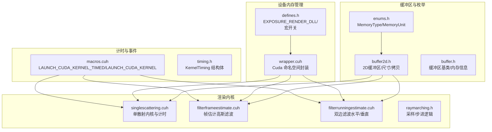
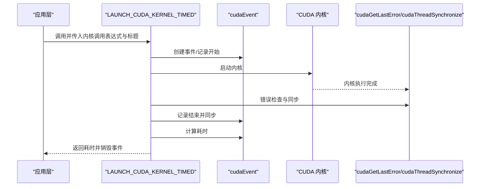
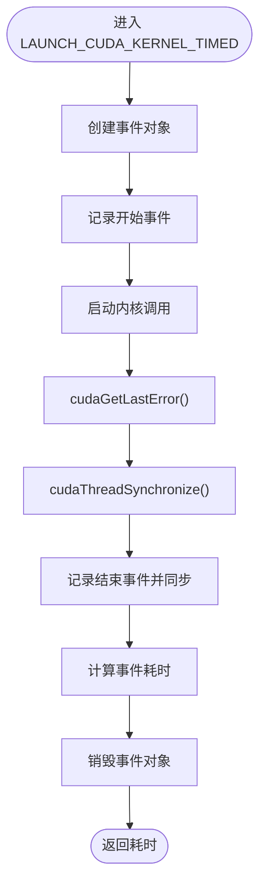
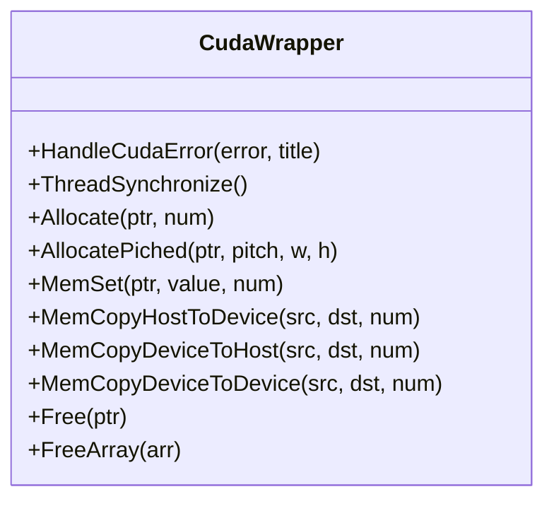
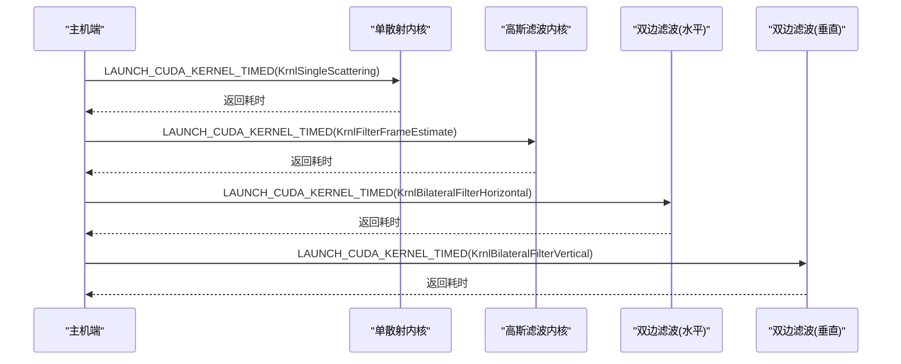
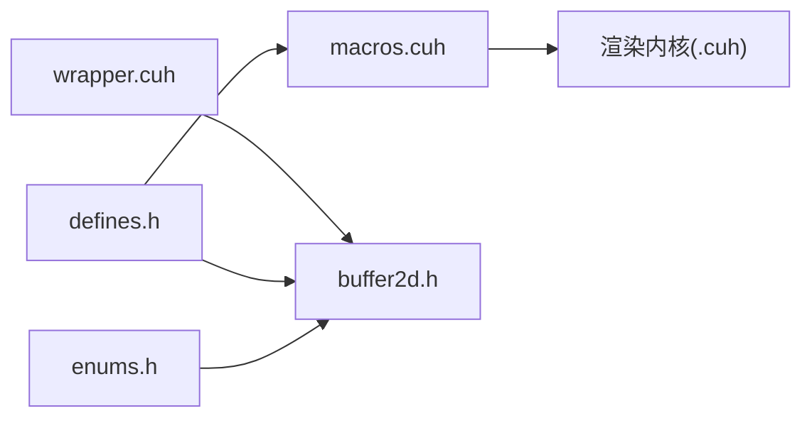

# 性能分析

<cite>
**本文引用的文件**
- [timing.h](file://Source/timing.h)
- [macros.cuh](file://Source/macros.cuh)
- [defines.h](file://Source/defines.h)
- [wrapper.cuh](file://Source/wrapper.cuh)
- [buffer.h](file://Source/buffer.h)
- [buffer2d.h](file://Source/buffer2d.h)
- [raymarching.h](file://Source/raymarching.h)
- [singlescattering.cuh](file://Source/singlescattering.cuh)
- [filterframeestimate.cuh](file://Source/filterframeestimate.cuh)
- [filterrunningestimate.cuh](file://Source/filterrunningestimate.cuh)
- [enums.h](file://Source/enums.h)
- [log.h](file://Source/log.h)
- [exposurerender.cpp](file://Source/exposurerender.cpp)
</cite>

## 目录
1. [简介](#简介)
2. [项目结构](#项目结构)
3. [核心组件](#核心组件)
4. [架构总览](#架构总览)
5. [详细组件分析](#详细组件分析)
6. [依赖关系分析](#依赖关系分析)
7. [性能考量](#性能考量)
8. [故障排查指南](#故障排查指南)
9. [结论](#结论)
10. [附录](#附录)

## 简介
本文件围绕体积渲染框架中的CUDA性能分析实践展开，系统阐述以下主题：
- CUDA性能分析方法：基于事件（cudaEvent）的内核执行时间测量、错误处理与同步策略
- GPU利用率与内存带宽分析：通过内存分配、拷贝与纹理采样路径识别瓶颈
- 实际代码示例路径：展示如何在渲染流水线中插入计时宏、如何进行内核执行时间测量
- 工具与方法：NVIDIA Nsight、nvprof等工具的使用建议与结果解读
- 热点识别与优化策略：缓存行为、分支发散、内存访问模式与步长参数调优
- 基准测试与回归测试：如何建立稳定的度量流程与回归基线

本指南兼顾初学者易懂性与资深开发者深度优化需求。

## 项目结构
该项目采用“头文件驱动 + 宏封装”的CUDA编程风格，核心性能相关模块包括：
- 计时与事件：宏定义与事件封装
- 设备内存管理：统一的分配/释放/拷贝封装
- 渲染内核：单散射、高斯滤波、双边滤波等
- 缓冲区抽象：主机/设备内存的统一接口与尺寸计算
- 枚举与常量：统一的内存单位、类型枚举

图表来源
- [macros.cuh:41-73](file://Source/macros.cuh#L41-L73)
- [timing.h:27-61](file://Source/timing.h#L27-L61)
- [wrapper.cuh:35-147](file://Source/wrapper.cuh#L35-L147)
- [singlescattering.cuh:27-38](file://Source/singlescattering.cuh#L27-L38)
- [filterframeestimate.cuh:33-69](file://Source/filterframeestimate.cuh#L33-L69)
- [filterrunningestimate.cuh:55-200](file://Source/filterrunningestimate.cuh#L55-L200)
- [buffer2d.h:26-263](file://Source/buffer2d.h#L26-L263)
- [buffer.h:27-121](file://Source/buffer.h#L27-L121)
- [enums.h:24-37](file://Source/enums.h#L24-L37)

章节来源
- [macros.cuh:27-104](file://Source/macros.cuh#L27-L104)
- [wrapper.cuh:35-147](file://Source/wrapper.cuh#L35-L147)
- [buffer2d.h:125-164](file://Source/buffer2d.h#L125-L164)
- [enums.h:24-37](file://Source/enums.h#L24-L37)

## 核心组件
- 计时宏与事件
  - LAUNCH_CUDA_KERNEL_TIMED：以cudaEvent记录开始/结束，测量内核执行耗时，并进行错误检查与资源清理
  - LAUNCH_CUDA_KERNEL：简化版内核启动与错误检查
- 设备内存封装
  - Cuda命名空间提供统一的分配、拷贝、释放、同步与错误处理
- 内核与渲染流程
  - 单散射、帧估计高斯滤波、双边滤波水平/垂直通道
- 缓冲区抽象
  - Buffer/Buffer2D提供分辨率、元素数、字节数统计与主机/设备间数据搬运
- 枚举与常量
  - MemoryType/MemoryUnit等枚举支撑内存管理与日志输出

章节来源
- [macros.cuh:41-73](file://Source/macros.cuh#L41-L73)
- [wrapper.cuh:38-141](file://Source/wrapper.cuh#L38-L141)
- [buffer2d.h:200-208](file://Source/buffer2d.h#L200-L208)
- [enums.h:24-37](file://Source/enums.h#L24-L37)

## 架构总览
下图展示了渲染管线中计时与内存管理的交互关系，以及关键内核的调用路径。

图表来源
- [macros.cuh:41-65](file://Source/macros.cuh#L41-L65)
- [wrapper.cuh:38-51](file://Source/wrapper.cuh#L38-L51)

## 详细组件分析

### 计时与事件（LAUNCH_CUDA_KERNEL_TIMED）
- 功能要点
  - 使用cudaEvent创建/记录/同步，避免CPU轮询带来的误差
  - 在内核启动后立即进行cudaGetLastError与cudaThreadSynchronize，确保错误可见且同步
  - 记录起止事件并计算毫秒级耗时，便于后续聚合与报告
- 典型用法路径
  - 单散射内核：[singlescattering.cuh:36-38](file://Source/singlescattering.cuh#L36-L38)
  - 高斯滤波内核：[filterframeestimate.cuh:68-69](file://Source/filterframeestimate.cuh#L68-L69)
  - 双边滤波内核（水平/垂直）：[filterrunningestimate.cuh:195-200](file://Source/filterrunningestimate.cuh#L195-L200)
- 适用场景
  - 测量单个内核或一组内核的执行时间
  - 作为基准测试与回归测试的时间指标

图表来源
- [macros.cuh:41-65](file://Source/macros.cuh#L41-L65)

章节来源
- [macros.cuh:41-73](file://Source/macros.cuh#L41-L73)
- [singlescattering.cuh:36-38](file://Source/singlescattering.cuh#L36-L38)
- [filterframeestimate.cuh:68-69](file://Source/filterframeestimate.cuh#L68-L69)
- [filterrunningestimate.cuh:195-200](file://Source/filterrunningestimate.cuh#L195-L200)

### 设备内存封装（Cuda 命名空间）
- 统一接口
  - Allocate/AllocatePitch：主机侧同步后分配显存，支持pitched内存
  - MemSet/MemCopyHostToDevice/MemCopyDeviceToHost/MemCopyDeviceToDevice：统一的内存清零与拷贝
  - Free/FreeArray：安全释放与置空
  - HandleCudaError：错误检查并抛出异常
- 与缓冲区协作
  - Buffer2D::Resize/Set/Reset等内部使用Cuda封装进行内存分配与拷贝
- 典型用法路径
  - 分配与拷贝：[buffer2d.h:155-161](file://Source/buffer2d.h#L155-L161)、[buffer2d.h:175-195](file://Source/buffer2d.h#L175-L195)
  - 错误处理封装：[wrapper.cuh:38-51](file://Source/wrapper.cuh#L38-L51)

图表来源
- [wrapper.cuh:38-141](file://Source/wrapper.cuh#L38-L141)

章节来源
- [wrapper.cuh:38-141](file://Source/wrapper.cuh#L38-L141)
- [buffer2d.h:155-161](file://Source/buffer2d.h#L155-L161)
- [buffer2d.h:175-195](file://Source/buffer2d.h#L175-L195)

### 渲染内核与内存访问模式
- 单散射内核（KrnlSingleScattering）
  - 使用2D内核索引宏，按像素并行更新帧估计
  - 计时入口：[singlescattering.cuh:36-38](file://Source/singlescattering.cuh#L36-L38)
- 帧估计高斯滤波（KrnlFilterFrameEstimate）
  - 对每个像素在其局部窗口内加权求和，注意边界裁剪与权重归一化
  - 计时入口：[filterframeestimate.cuh:68-69](file://Source/filterframeestimate.cuh#L68-L69)
- 双边滤波（水平/垂直）
  - 水平通道：共享内存存储范围与权重，沿行方向累积
  - 垂直通道：共享内存存储范围与权重，沿列方向累积
  - 计时入口：[filterrunningestimate.cuh:195-200](file://Source/filterrunningestimate.cuh#L195-L200)
- 采样与步进（raymarching.h）
  - 体积采样与步进长度控制，影响内存访问与吞吐
  - 关键路径：[raymarching.h:30-71](file://Source/raymarching.h#L30-L71)

图表来源
- [singlescattering.cuh:36-38](file://Source/singlescattering.cuh#L36-L38)
- [filterframeestimate.cuh:68-69](file://Source/filterframeestimate.cuh#L68-L69)
- [filterrunningestimate.cuh:195-200](file://Source/filterrunningestimate.cuh#L195-L200)

章节来源
- [singlescattering.cuh:27-38](file://Source/singlescattering.cuh#L27-L38)
- [filterframeestimate.cuh:33-69](file://Source/filterframeestimate.cuh#L33-L69)
- [filterrunningestimate.cuh:55-200](file://Source/filterrunningestimate.cuh#L55-L200)
- [raymarching.h:30-71](file://Source/raymarching.h#L30-L71)

### 缓冲区与内存带宽
- Buffer/Buffer2D
  - 提供分辨率、元素数、字节大小统计与内存字符串格式化
  - 支持主机/设备间数据搬运与重置
- 与性能的关系
  - 字节大小与带宽成正比：大缓冲区带来更高吞吐但可能受限于PCIe带宽与显存带宽
  - 2D布局影响内存访问连续性：行优先布局通常更友好
  - 共享内存使用（如双边滤波）可显著降低全局内存带宽压力

章节来源
- [buffer.h:83-113](file://Source/buffer.h#L83-L113)
- [buffer2d.h:200-208](file://Source/buffer2d.h#L200-L208)
- [filterrunningestimate.cuh:55-122](file://Source/filterrunningestimate.cuh#L55-L122)

## 依赖关系分析
- 宏与内核
  - LAUNCH_CUDA_KERNEL_TIMED依赖cudaEvent API与错误处理宏
  - 内核通过KERNEL_1D/KERNEL_2D/KERNEL_3D宏生成线程索引并进行边界检查
- 设备内存封装
  - Buffer2D等缓冲区类在分配/拷贝时调用Cuda封装函数
- 渲染设置与常量
  - defines.h提供编译期宏与数学常量，影响内核行为与性能

图表来源
- [macros.cuh:27-104](file://Source/macros.cuh#L27-L104)
- [wrapper.cuh:35-147](file://Source/wrapper.cuh#L35-L147)
- [buffer2d.h:26-263](file://Source/buffer2d.h#L26-L263)
- [enums.h:24-37](file://Source/enums.h#L24-L37)
- [defines.h:37-56](file://Source/defines.h#L37-L56)

章节来源
- [macros.cuh:27-104](file://Source/macros.cuh#L27-L104)
- [wrapper.cuh:35-147](file://Source/wrapper.cuh#L35-L147)
- [buffer2d.h:26-263](file://Source/buffer2d.h#L26-L263)
- [enums.h:24-37](file://Source/enums.h#L24-L37)
- [defines.h:37-56](file://Source/defines.h#L37-L56)

## 性能考量
- CUDA性能分析方法
  - 使用cudaEvent进行内核级计时，避免CPU轮询；在内核启动后立即cudaGetLastError与同步
  - 将计时宏封装在独立的宏中，便于在多处复用
- GPU利用率监控
  - 利用NVIDIA Nsight Systems查看SM占用率、寄存器/共享内存占用、指令吞吐
  - 结合Nsight Compute分析内核占用、活跃度、分支分歧与内存带宽
- 内存带宽分析
  - 通过Buffer/Buffer2D统计字节数，结合内核耗时估算有效带宽
  - 关注全局内存与共享内存的使用比例，减少全局内存往返
- 缓存行为与分支发散
  - 保持线程束内分支一致性，避免warp divergence
  - 利用共享内存缓存频繁访问的数据（如双边滤波中的局部窗口）
- 内存访问模式
  - 采用连续访问模式（行优先），避免跨行跳跃
  - 对于非规则访问，考虑使用纹理单元或共享内存重排
- 步长与采样
  - raymarching中的步长参数直接影响吞吐与精度平衡
  - 过小步长导致更多内存访问与算力浪费；过大则产生噪声或伪影
- 工具与方法
  - nvprof/nvbit：命令行性能分析与计数器采集
  - Nsight Systems/Compute：可视化与深入洞察
  - 建立基准测试与回归测试：固定输入、重复运行多次取均值与方差

## 故障排查指南
- 常见问题与定位
  - 内核未执行或崩溃：检查cudaGetLastError与cudaThreadSynchronize是否被调用
  - 计时不准确：确认事件同步与耗时计算顺序，避免CPU等待
  - 显存不足：检查Buffer2D::Resize与Cuda::Allocate的字节数与设备内存上限
- 错误处理与日志
  - Cuda::HandleCudaError在失败时抛出异常，便于快速定位
  - DebugLog默认关闭，可在开发阶段启用以辅助调试

章节来源
- [macros.cuh:51-52](file://Source/macros.cuh#L51-L52)
- [wrapper.cuh:38-51](file://Source/wrapper.cuh#L38-L51)
- [buffer2d.h:155-161](file://Source/buffer2d.h#L155-L161)
- [log.h:27-39](file://Source/log.h#L27-L39)

## 结论
本项目通过宏封装与统一的设备内存管理，提供了清晰的性能分析入口与可扩展的渲染内核体系。结合cudaEvent计时、共享内存优化与合理的内存访问模式，可以在保证质量的前提下获得稳定且可复现的性能表现。建议在持续集成中引入基准测试与回归测试，配合NVIDIA工具链进行定期性能审计。

## 附录
- 实战建议
  - 在关键内核前后插入LAUNCH_CUDA_KERNEL_TIMED，形成完整的性能画像
  - 对大缓冲区操作（如双边滤波）优先使用共享内存与分块策略
  - 固定随机种子与输入场景，确保测试可重复
- 相关文件路径参考
  - 计时与事件：[macros.cuh:41-73](file://Source/macros.cuh#L41-L73)
  - 设备内存封装：[wrapper.cuh:38-141](file://Source/wrapper.cuh#L38-L141)
  - 单散射内核与计时：[singlescattering.cuh:36-38](file://Source/singlescattering.cuh#L36-L38)
  - 高斯滤波内核与计时：[filterframeestimate.cuh:68-69](file://Source/filterframeestimate.cuh#L68-L69)
  - 双边滤波内核与计时：[filterrunningestimate.cuh:195-200](file://Source/filterrunningestimate.cuh#L195-L200)
  - 缓冲区与内存统计：[buffer2d.h:200-208](file://Source/buffer2d.h#L200-L208)
  - 枚举与常量：[enums.h:24-37](file://Source/enums.h#L24-L37)
  - 日志与调试：[log.h:27-39](file://Source/log.h#L27-L39)
  - 编译宏开关：[exposurerender.cpp:21](file://Source/exposurerender.cpp#L21)