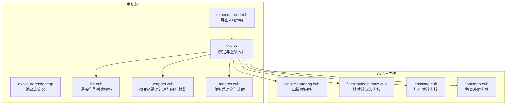
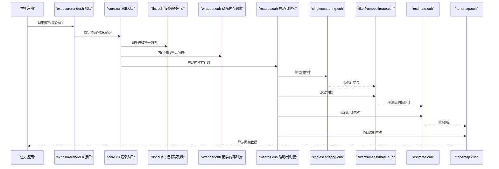
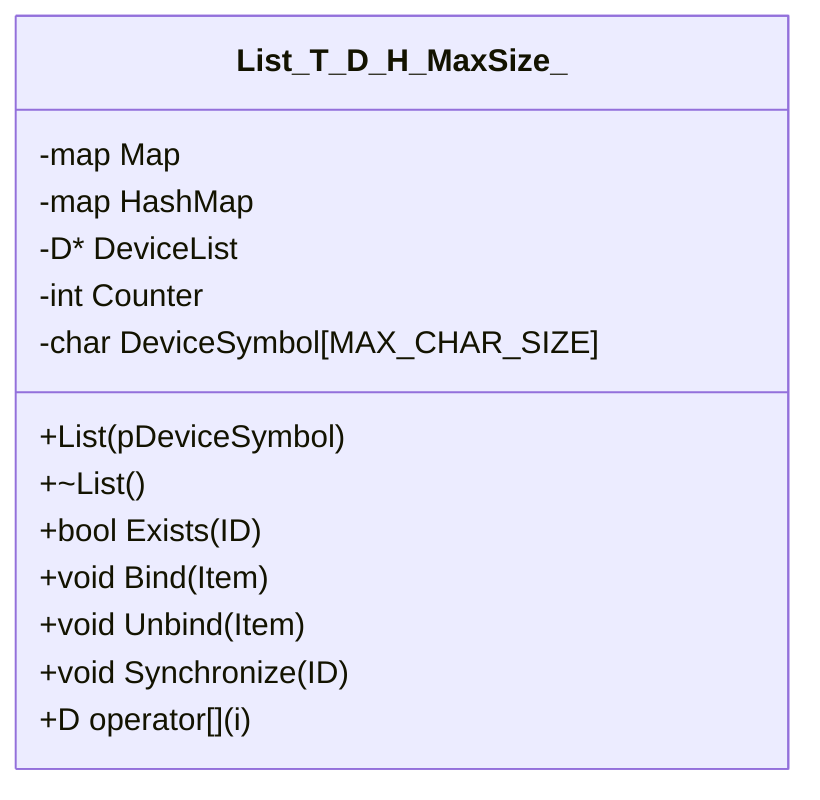
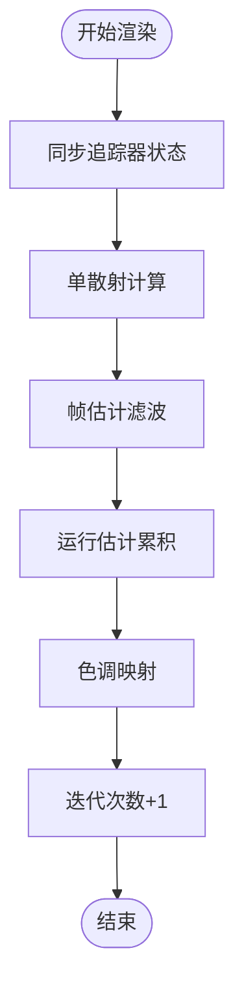
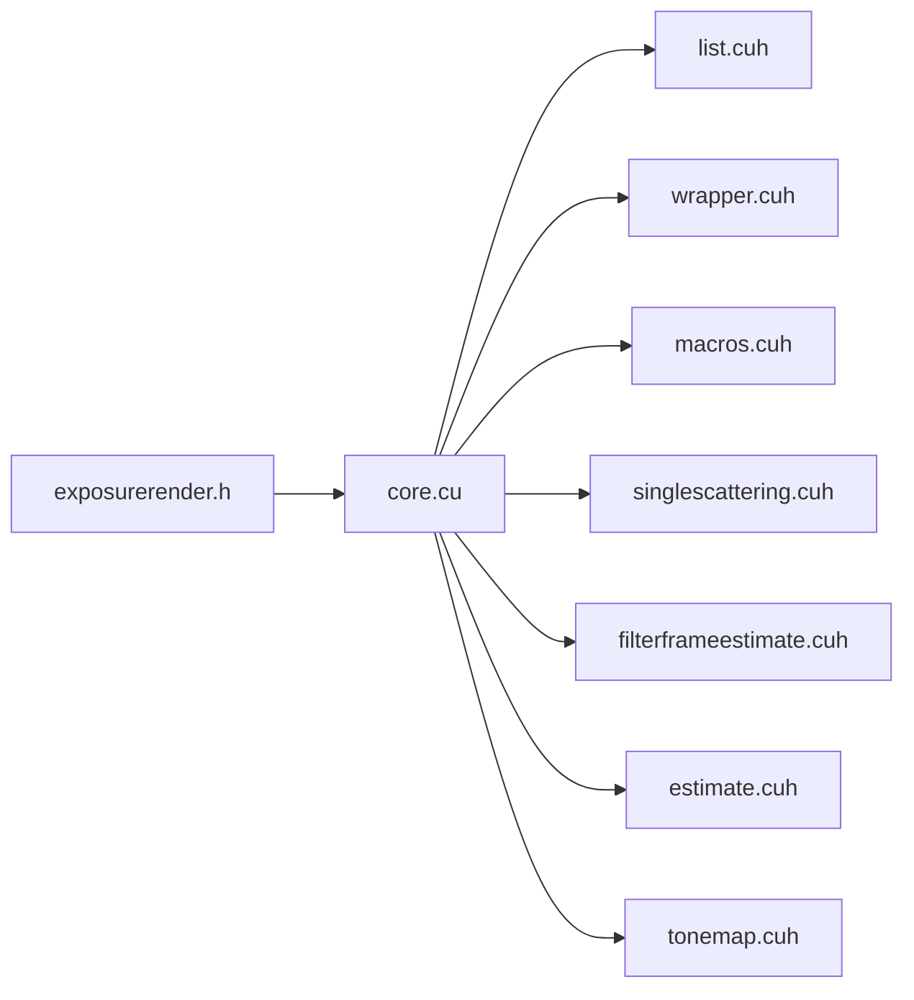

# 测试策略

<cite>
**本文引用的文件**
- [README.md](file://README.md)
- [CMakeLists.txt](file://Source/CMakeLists.txt)
- [core.cu](file://Source/core.cu)
- [exposurerender.h](file://Source/exposurerender.h)
- [exposurerender.cpp](file://Source/exposurerender.cpp)
- [macros.cuh](file://Source/macros.cuh)
- [wrapper.cuh](file://Source/wrapper.cuh)
- [list.cuh](file://Source/list.cuh)
- [singlescattering.cuh](file://Source/singlescattering.cuh)
- [filterframeestimate.cuh](file://Source/filterframeestimate.cuh)
- [estimate.cuh](file://Source/estimate.cuh)
- [tonemap.cuh](file://Source/tonemap.cuh)
</cite>

## 目录
1. [引言](#引言)
2. [项目结构](#项目结构)
3. [核心组件](#核心组件)
4. [架构总览](#架构总览)
5. [详细组件分析](#详细组件分析)
6. [依赖关系分析](#依赖关系分析)
7. [性能考量](#性能考量)
8. [故障排查指南](#故障排查指南)
9. [结论](#结论)
10. [附录](#附录)

## 引言
本文件面向“曝光渲染（Exposure Render）”项目制定系统化的测试策略，覆盖单元测试、集成测试与性能测试三类。结合代码库中CUDA内核、主机侧接口与缓冲区管理等实现，给出可操作的测试用例设计、模拟数据生成与验证方法，并说明CUDA内核测试的特殊考虑、回归与基准测试策略，以及自动化与持续集成的落地建议。目标是帮助初学者快速上手，同时为有经验的开发者提供深入的技术指导。

## 项目结构
该工程采用CMake组织构建，核心模块由主机侧头文件与CUDA内核源文件组成，形成“主机接口 + CUDA内核管线”的结构。主机侧通过一组绑定函数将渲染资源（追踪器、体积、光源、对象、纹理、位图）注入到设备符号列表；随后在渲染流水线中依次执行单散射、帧估计滤波、运行估计累积与色调映射等步骤。

图表来源
- [CMakeLists.txt:155](file://Source/CMakeLists.txt#L155)
- [core.cu:56-136](file://Source/core.cu#L56-L136)
- [exposurerender.h:32-42](file://Source/exposurerender.h#L32-L42)
- [list.cuh:27-173](file://Source/list.cuh#L27-L173)
- [wrapper.cuh:38-142](file://Source/wrapper.cuh#L38-L142)
- [macros.cuh:27-101](file://Source/macros.cuh#L27-L101)
- [singlescattering.cuh:27-38](file://Source/singlescattering.cuh#L27-L38)
- [filterframeestimate.cuh:33-74](file://Source/filterframeestimate.cuh#L33-L74)
- [estimate.cuh:27-38](file://Source/estimate.cuh#L27-L38)
- [tonemap.cuh:49-65](file://Source/tonemap.cuh#L49-L65)

章节来源
- [CMakeLists.txt:155](file://Source/CMakeLists.txt#L155)
- [core.cu:56-136](file://Source/core.cu#L56-L136)
- [exposurerender.h:32-42](file://Source/exposurerender.h#L32-L42)

## 核心组件
- 主机接口层：对外暴露绑定与渲染API，负责将资源同步至设备符号列表并驱动渲染管线。
- 设备符号列表模板：维护主机侧资源到设备符号数组的映射，支持按需同步与索引访问。
- CUDA内核流水线：单散射、帧估计滤波、运行估计累积、色调映射四步构成完整渲染流程。
- CUDA工具封装：统一的错误处理、内存分配/拷贝、事件计时宏，便于测试中的可观测性与稳定性。

章节来源
- [exposurerender.h:32-42](file://Source/exposurerender.h#L32-L42)
- [list.cuh:27-173](file://Source/list.cuh#L27-L173)
- [core.cu:56-136](file://Source/core.cu#L56-L136)
- [wrapper.cuh:38-142](file://Source/wrapper.cuh#L38-L142)
- [macros.cuh:27-101](file://Source/macros.cuh#L27-L101)

## 架构总览
下图展示了从主机调用到CUDA内核执行的关键路径，以及各阶段的输入输出与依赖关系。

图表来源
- [exposurerender.h:32-42](file://Source/exposurerender.h#L32-L42)
- [core.cu:56-136](file://Source/core.cu#L56-L136)
- [list.cuh:108-148](file://Source/list.cuh#L108-L148)
- [wrapper.cuh:53-107](file://Source/wrapper.cuh#L53-L107)
- [macros.cuh:41-73](file://Source/macros.cuh#L41-L73)
- [singlescattering.cuh:27-38](file://Source/singlescattering.cuh#L27-L38)
- [filterframeestimate.cuh:66-74](file://Source/filterframeestimate.cuh#L66-L74)
- [estimate.cuh:34-38](file://Source/estimate.cuh#L34-L38)
- [tonemap.cuh:61-65](file://Source/tonemap.cuh#L61-L65)

## 详细组件分析

### 组件A：设备符号列表模板（List）
- 职责：维护主机侧资源到设备符号数组的映射，支持绑定、解绑、按ID同步与随机访问。
- 关键点：最大容量限制、哈希映射、主机到设备内存拷贝、设备符号写入。
- 测试关注：边界条件（空表、满表）、重复绑定/解绑、按ID访问异常、同步失败场景。

图表来源
- [list.cuh:27-173](file://Source/list.cuh#L27-L173)

章节来源
- [list.cuh:27-173](file://Source/list.cuh#L27-L173)

### 组件B：渲染入口与管线控制（core.cu）
- 职责：提供绑定与渲染API，协调单散射、帧估计滤波、运行估计与色调映射四个阶段。
- 关键点：渲染步骤顺序、迭代次数统计、设备内存读取接口。
- 测试关注：渲染步骤链路完整性、参数传递正确性、输出一致性校验。

图表来源
- [core.cu:126-136](file://Source/core.cu#L126-L136)
- [singlescattering.cuh:34-38](file://Source/singlescattering.cuh#L34-L38)
- [filterframeestimate.cuh:66-74](file://Source/filterframeestimate.cuh#L66-L74)
- [estimate.cuh:34-38](file://Source/estimate.cuh#L34-L38)
- [tonemap.cuh:61-65](file://Source/tonemap.cuh#L61-L65)

章节来源
- [core.cu:56-136](file://Source/core.cu#L56-L136)

### 组件C：CUDA内核与工具宏（singlescattering.cuh、filterframeestimate.cuh、estimate.cuh、tonemap.cuh、macros.cuh、wrapper.cuh）
- 单散射内核：按像素执行单次散射积分，输出帧估计。
- 帧估计滤波：以高斯核进行局部加权平均，平滑噪声。
- 运行估计内核：基于累计移动平均更新全局估计。
- 色调映射：将颜色空间转换并应用曝光/伽马修正，输出显示图像。
- 工具宏：统一内核启动、块/网格维度计算、CUDA错误检查与计时。
- 包装函数：封装cudaMalloc/cpy/sync等，集中处理错误与同步。

章节来源
- [singlescattering.cuh:27-38](file://Source/singlescattering.cuh#L27-L38)
- [filterframeestimate.cuh:33-74](file://Source/filterframeestimate.cuh#L33-L74)
- [estimate.cuh:27-38](file://Source/estimate.cuh#L27-L38)
- [tonemap.cuh:49-65](file://Source/tonemap.cuh#L49-L65)
- [macros.cuh:27-101](file://Source/macros.cuh#L27-L101)
- [wrapper.cuh:38-142](file://Source/wrapper.cuh#L38-L142)

## 依赖关系分析
- 主机接口依赖渲染入口与设备符号列表，渲染入口再依赖各内核与工具封装。
- 内核之间存在严格的顺序依赖：单散射 → 帧估计滤波 → 运行估计 → 色调映射。
- 工具封装贯穿内核与主机交互，提供一致的错误处理与性能观测能力。

图表来源
- [exposurerender.h:32-42](file://Source/exposurerender.h#L32-L42)
- [core.cu:56-136](file://Source/core.cu#L56-L136)
- [list.cuh:27-173](file://Source/list.cuh#L27-L173)
- [wrapper.cuh:38-142](file://Source/wrapper.cuh#L38-L142)
- [macros.cuh:27-101](file://Source/macros.cuh#L27-L101)
- [singlescattering.cuh:27-38](file://Source/singlescattering.cuh#L27-L38)
- [filterframeestimate.cuh:33-74](file://Source/filterframeestimate.cuh#L33-L74)
- [estimate.cuh:27-38](file://Source/estimate.cuh#L27-L38)
- [tonemap.cuh:49-65](file://Source/tonemap.cuh#L49-L65)

章节来源
- [CMakeLists.txt:155](file://Source/CMakeLists.txt#L155)
- [core.cu:56-136](file://Source/core.cu#L56-L136)

## 性能考量
- 计时与事件：使用CUDA事件记录内核启动与完成时间，便于性能剖析与回归对比。
- 启动参数：块/网格维度影响吞吐与占用，应针对典型分辨率进行调优。
- 内存带宽：频繁的设备/主机拷贝会成为瓶颈，建议批量同步与复用缓冲。
- 算法复杂度：滤波与运行估计为O(W×H)，单散射与色调映射为O(W×H)，整体线性于像素数。

章节来源
- [macros.cuh:41-73](file://Source/macros.cuh#L41-L73)
- [filterframeestimate.cuh:66-74](file://Source/filterframeestimate.cuh#L66-L74)
- [estimate.cuh:34-38](file://Source/estimate.cuh#L34-L38)
- [tonemap.cuh:61-65](file://Source/tonemap.cuh#L61-L65)

## 故障排查指南
- CUDA错误处理：统一通过包装函数抛出异常，便于定位失败位置与上下文信息。
- 内存管理：确保在每次分配后进行同步，避免异步错误掩盖；释放前检查指针有效性。
- 同步问题：内核调用后必须检查最后错误并同步，防止后续操作读取未完成状态。
- 日志与断言：在关键路径添加日志输出，辅助回溯调用序列与参数状态。

章节来源
- [wrapper.cuh:38-142](file://Source/wrapper.cuh#L38-L142)
- [macros.cuh:41-73](file://Source/macros.cuh#L41-L73)

## 结论
本测试策略围绕主机接口、设备符号列表与CUDA内核流水线展开，强调顺序依赖下的集成测试与内核级单元测试相结合。通过统一的错误处理与计时宏，既保证了测试的稳定性，也为性能回归提供了量化依据。建议优先完善单元测试覆盖关键内核与工具函数，再逐步扩展到端到端集成测试与性能基准测试。

## 附录

### A. 测试类型与实施要点

- 单元测试
  - 目标：验证单个内核或工具函数的正确性与边界行为。
  - 方法：构造最小化输入（如小尺寸帧缓冲、固定种子随机数），断言输出满足数学性质（如非负、归一化权重之和为1）。
  - 示例路径：
    - [singlescattering.cuh:27-38](file://Source/singlescattering.cuh#L27-L38)
    - [filterframeestimate.cuh:33-74](file://Source/filterframeestimate.cuh#L33-L74)
    - [estimate.cuh:27-38](file://Source/estimate.cuh#L27-L38)
    - [tonemap.cuh:30-47](file://Source/tonemap.cuh#L30-L47)
    - [macros.cuh:27-101](file://Source/macros.cuh#L27-L101)
    - [wrapper.cuh:53-107](file://Source/wrapper.cuh#L53-L107)

- 集成测试
  - 目标：验证渲染管线各阶段的组合正确性与顺序依赖。
  - 方法：使用小型合成数据集（如纯色/条纹/已知分布体积），比较渲染输出与期望值（PSNR/SSIM阈值）。
  - 示例路径：
    - [core.cu:126-136](file://Source/core.cu#L126-L136)
    - [exposurerender.h:32-42](file://Source/exposurerender.h#L32-L42)
    - [list.cuh:108-148](file://Source/list.cuh#L108-L148)

- 性能测试
  - 目标：评估内核执行时间与内存带宽利用率。
  - 方法：使用事件计时宏记录每阶段耗时，统计多次运行的均值与方差；对比不同分辨率与块大小的影响。
  - 示例路径：
    - [macros.cuh:41-73](file://Source/macros.cuh#L41-L73)

- CUDA内核测试特殊考虑
  - 设备环境：需要可用的NVIDIA GPU与CUDA运行时；在CI中可使用容器或虚拟GPU。
  - 同步与错误：内核前后必须进行同步与错误检查，避免假阳性/阴性。
  - 数据准备：提前在主机侧构造好帧缓冲与资源列表，确保设备符号已同步。
  - 可重复性：固定随机种子或禁用随机采样以获得可重复结果。

- 回归测试与基准测试
  - 回归：对关键内核与API添加稳定测试用例，长期保存基准图像与数值指标。
  - 基准：建立不同硬件配置下的基线，定期重跑以发现性能退化。

- 自动化与持续集成
  - 构建：使用CMake生成项目，确保CUDA Toolkit与SDK路径正确。
  - 执行：在CI中启用GPU作业，安装必要驱动与CUDA版本；分阶段运行单元/集成/性能测试。
  - 报告：收集计时数据与图像差异指标，生成报告并与历史对比。

章节来源
- [README.md:14-22](file://README.md#L14-L22)
- [CMakeLists.txt:155](file://Source/CMakeLists.txt#L155)
- [wrapper.cuh:38-142](file://Source/wrapper.cuh#L38-L142)
- [macros.cuh:41-73](file://Source/macros.cuh#L41-L73)