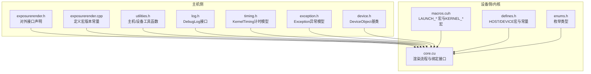
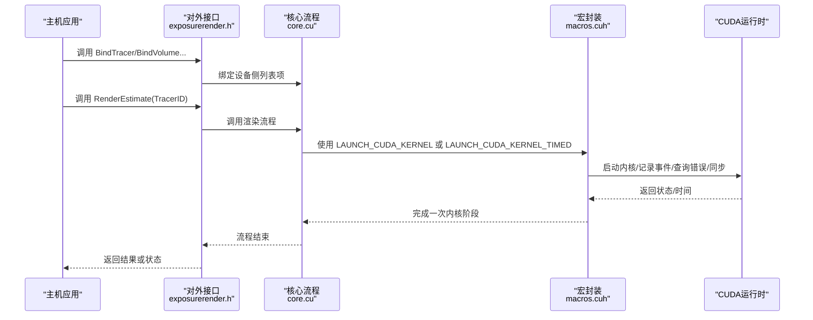
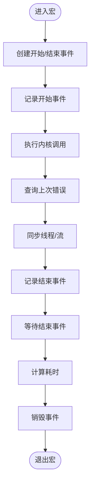
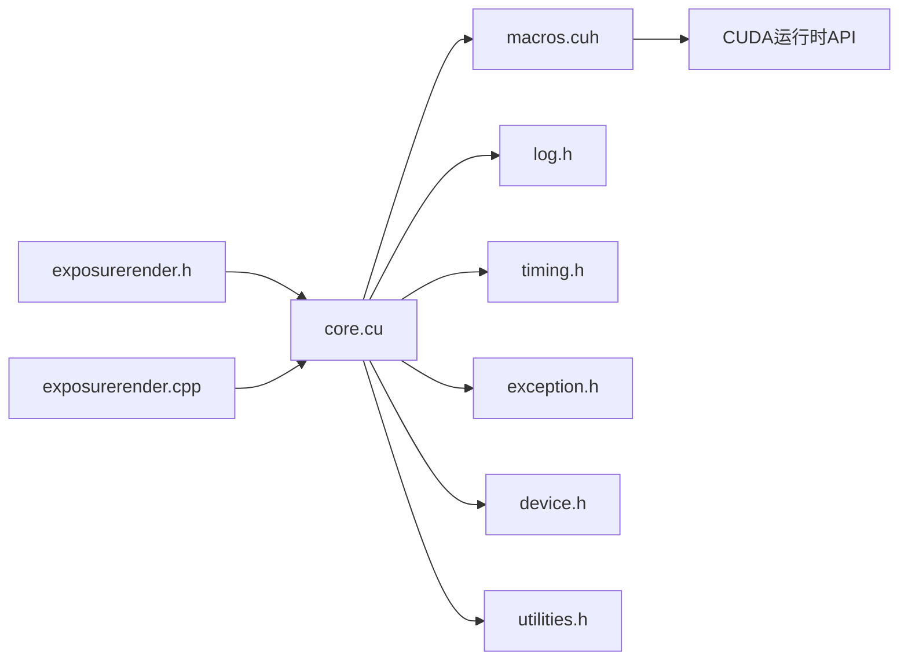

# 调试技巧

<cite>
**本文引用的文件**
- [Source/log.h](file://Source/log.h)
- [Source/timing.h](file://Source/timing.h)
- [Source/macros.cuh](file://Source/macros.cuh)
- [Source/defines.h](file://Source/defines.h)
- [Source/enums.h](file://Source/enums.h)
- [Source/exception.h](file://Source/exception.h)
- [Source/device.h](file://Source/device.h)
- [Source/core.cu](file://Source/core.cu)
- [Source/exposurerender.h](file://Source/exposurerender.h)
- [Source/exposurerender.cpp](file://Source/exposurerender.cpp)
- [Source/utilities.h](file://Source/utilities.h)
</cite>

## 目录
1. [简介](#简介)
2. [项目结构](#项目结构)
3. [核心组件](#核心组件)
4. [架构总览](#架构总览)
5. [详细组件分析](#详细组件分析)
6. [依赖关系分析](#依赖关系分析)
7. [性能考量](#性能考量)
8. [故障排查指南](#故障排查指南)
9. [结论](#结论)
10. [附录](#附录)

## 简介
本篇“调试技巧”面向CUDA与GPU内核开发，结合本项目现有实现，系统讲解主机-设备协同调试、内核调试、日志与异常处理、性能计时与瓶颈定位等方法。文档以仓库中已存在的日志、计时、宏封装、异常模型与绑定接口为依据，给出可直接落地的实践建议，并补充常见陷阱与解决思路，帮助初学者快速上手，同时为有经验的开发者提供深入参考。

## 项目结构
围绕调试主题，本项目的关键文件分布如下：
- 宏与工具：用于封装CUDA调用、计时与错误处理
- 计时与异常：提供内核事件计时与异常信息载体
- 日志：提供DebugLog接口（当前为空实现）
- 设备对象基类：统一设备侧对象生命周期管理
- 核心渲染流程：对外暴露绑定与渲染接口，串联多个内核阶段
- 工具函数：主机/设备通用数学与向量转换工具

图表来源
- [Source/exposurerender.h:32-42](file://Source/exposurerender.h#L32-L42)
- [Source/exposurerender.cpp:21-23](file://Source/exposurerender.cpp#L21-L23)
- [Source/utilities.h:25-69](file://Source/utilities.h#L25-L69)
- [Source/log.h:27-39](file://Source/log.h#L27-L39)
- [Source/timing.h:27-61](file://Source/timing.h#L27-L61)
- [Source/exception.h:27-55](file://Source/exception.h#L27-L55)
- [Source/device.h:28-43](file://Source/device.h#L28-L43)
- [Source/core.cu:56-136](file://Source/core.cu#L56-L136)
- [Source/macros.cuh:41-73](file://Source/macros.cuh#L41-L73)
- [Source/defines.h:40-56](file://Source/defines.h#L40-L56)
- [Source/enums.h:80-86](file://Source/enums.h#L80-L86)

章节来源
- [Source/exposurerender.h:32-42](file://Source/exposurerender.h#L32-L42)
- [Source/exposurerender.cpp:21-23](file://Source/exposurerender.cpp#L21-L23)
- [Source/core.cu:56-136](file://Source/core.cu#L56-L136)

## 核心组件
- 宏封装与计时
  - LAUNCH_CUDA_KERNEL/LAUNCH_CUDA_KERNEL_TIMED：封装内核调用、错误查询与同步；后者额外使用cudaEvent进行计时
  - KERNEL_1D/KERNEL_2D/KERNEL_3D：内核线程索引与边界检查模板
- 计时模型
  - KernelTiming：事件名与耗时的简单容器，便于收集与统计
- 异常模型
  - Exception：包含异常级别与消息缓冲区，便于统一处理与上报
- 日志接口
  - DebugLog：当前为空实现，建议扩展为主机侧日志输出入口
- 设备对象基类
  - DeviceObject：统一设备对象构造/析构语义，便于资源管理
- 主机-设备工具
  - utilities.h中的HOST_DEVICE函数族：向量/颜色转换、移动平均等
- 对外接口
  - bind系列接口：将渲染器、体积、光源、对象、纹理、位图等绑定到设备侧列表
  - 渲染流程：SingleScattering → FilterFrameEstimate → ComputeEstimate → ToneMap

章节来源
- [Source/macros.cuh:41-101](file://Source/macros.cuh#L41-L101)
- [Source/timing.h:27-61](file://Source/timing.h#L27-L61)
- [Source/exception.h:27-55](file://Source/exception.h#L27-L55)
- [Source/log.h:27-39](file://Source/log.h#L27-L39)
- [Source/device.h:28-43](file://Source/device.h#L28-L43)
- [Source/utilities.h:25-69](file://Source/utilities.h#L25-L69)
- [Source/exposurerender.h:32-42](file://Source/exposurerender.h#L32-L42)
- [Source/core.cu:56-136](file://Source/core.cu#L56-L136)

## 架构总览
下图展示了主机侧调用如何通过宏封装触发设备内核，并在必要时进行计时与错误检查。

图表来源
- [Source/exposurerender.h:32-42](file://Source/exposurerender.h#L32-L42)
- [Source/core.cu:126-136](file://Source/core.cu#L126-L136)
- [Source/macros.cuh:41-73](file://Source/macros.cuh#L41-L73)

## 详细组件分析

### 宏封装与内核调试
- LAUNCH_CUDA_KERNEL
  - 作用：执行内核调用后立即查询cudaGetLastError并同步，确保错误即时暴露
  - 适用：常规内核调用，无需计时
- LAUNCH_CUDA_KERNEL_TIMED
  - 作用：使用cudaEvent在内核前后记录事件，计算耗时并销毁事件
  - 适用：需要定位内核耗时与瓶颈的场景
- KERNEL_1D/2D/3D
  - 作用：生成线程全局ID、线程局部ID与线程块索引，最后进行越界返回
  - 适用：所有一维/二维/三维内核的标准入口模板

图表来源
- [Source/macros.cuh:41-65](file://Source/macros.cuh#L41-L65)

章节来源
- [Source/macros.cuh:27-101](file://Source/macros.cuh#L27-L101)

### 计时模型与性能分析
- KernelTiming
  - 字段：事件名与耗时
  - 用途：收集各内核阶段耗时，便于后续聚合与可视化
- 建议
  - 在LAUNCH_CUDA_KERNEL_TIMED中将事件名与耗时写入队列，形成时间序列
  - 结合主机侧日志输出，导出统计报告

章节来源
- [Source/timing.h:27-61](file://Source/timing.h#L27-L61)

### 异常模型与错误处理
- Exception
  - 字段：异常级别与消息缓冲区
  - 用途：统一异常信息载体，便于传播与记录
- 建议
  - 将cudaGetLastError的结果映射为Exception，携带级别与消息
  - 在关键路径（如内存分配、内核启动）抛出或记录异常

章节来源
- [Source/exception.h:27-55](file://Source/exception.h#L27-L55)
- [Source/enums.h:80-86](file://Source/enums.h#L80-L86)

### 日志记录
- DebugLog
  - 当前实现为空，建议扩展为主机侧日志输出入口
  - 可选：支持格式化字符串、线程ID、时间戳、模块名等
- 建议
  - 在关键接口（如Bind系列）与内核阶段前后输出日志
  - 配合计时模型输出“阶段耗时”摘要

章节来源
- [Source/log.h:27-39](file://Source/log.h#L27-L39)

### 设备对象基类
- DeviceObject
  - 作用：统一设备对象的构造/析构语义，便于资源管理与生命周期控制
- 建议
  - 所有设备侧对象继承该基类，确保一致的释放策略

章节来源
- [Source/device.h:28-43](file://Source/device.h#L28-L43)

### 主机-设备协同调试策略
- 绑定与同步
  - 主机侧通过Bind系列接口将数据绑定到设备侧列表
  - 渲染流程中先同步再执行内核，避免未绑定导致的未定义行为
- 建议
  - 在每次绑定后打印日志，确认绑定状态
  - 在关键内核前后插入同步点，定位卡顿或死锁

章节来源
- [Source/core.cu:56-136](file://Source/core.cu#L56-L136)
- [Source/exposurerender.h:32-42](file://Source/exposurerender.h#L32-L42)

### 主机-设备工具函数
- HOST_DEVICE函数族
  - 向量/颜色转换、移动平均等
  - 作用：减少主机与设备间的数据拷贝与格式差异
- 建议
  - 在内核中优先使用这些函数，保证一致性与可移植性

章节来源
- [Source/utilities.h:25-69](file://Source/utilities.h#L25-L69)

## 依赖关系分析
- 宏封装依赖CUDA运行时API（事件、错误、同步）
- 核心流程依赖宏封装与设备侧绑定
- 日志与计时作为横切关注点被宏封装与核心流程间接使用
- 异常模型为错误处理提供统一载体

图表来源
- [Source/macros.cuh:41-73](file://Source/macros.cuh#L41-L73)
- [Source/core.cu:56-136](file://Source/core.cu#L56-L136)
- [Source/log.h:27-39](file://Source/log.h#L27-L39)
- [Source/timing.h:27-61](file://Source/timing.h#L27-L61)
- [Source/exception.h:27-55](file://Source/exception.h#L27-L55)
- [Source/device.h:28-43](file://Source/device.h#L28-L43)
- [Source/utilities.h:25-69](file://Source/utilities.h#L25-L69)
- [Source/exposurerender.h:32-42](file://Source/exposurerender.h#L32-L42)
- [Source/exposurerender.cpp:21-23](file://Source/exposurerender.cpp#L21-L23)

章节来源
- [Source/macros.cuh:41-73](file://Source/macros.cuh#L41-L73)
- [Source/core.cu:56-136](file://Source/core.cu#L56-L136)

## 性能考量
- 使用LAUNCH_CUDA_KERNEL_TIMED对每个内核阶段进行计时，形成时间线
- 将事件名与耗时写入队列，便于后续统计与可视化
- 在热点内核中，结合线程块/网格维度规划与共享内存使用，减少全局内存访问
- 利用主机侧日志输出阶段耗时摘要，辅助定位瓶颈

章节来源
- [Source/macros.cuh:41-65](file://Source/macros.cuh#L41-L65)
- [Source/timing.h:27-61](file://Source/timing.h#L27-L61)

## 故障排查指南
- 常见问题
  - 内核未执行或崩溃：检查cudaGetLastError与同步是否在宏封装中正确调用
  - 时间测量不准确：确认事件创建/销毁与同步顺序
  - 绑定数据缺失：在Bind系列接口前后输出日志，确认绑定状态
- 解决步骤
  - 在关键路径启用LAUNCH_CUDA_KERNEL_TIMED，记录事件名与耗时
  - 将异常映射为Exception并记录级别与消息
  - 扩展DebugLog，输出关键参数与状态
  - 使用KERNEL_1D/2D/3D模板确保边界检查

章节来源
- [Source/macros.cuh:41-73](file://Source/macros.cuh#L41-L73)
- [Source/exception.h:27-55](file://Source/exception.h#L27-L55)
- [Source/log.h:27-39](file://Source/log.h#L27-L39)
- [Source/core.cu:56-136](file://Source/core.cu#L56-L136)

## 结论
本项目已具备完善的宏封装、计时模型与异常基础，结合扩展后的日志输出与绑定流程，可构建一套完整的主机-设备协同调试体系。通过在关键内核阶段插入计时与错误检查，并配合统一的异常与日志机制，能够有效定位性能瓶颈与运行时问题，提升开发效率与稳定性。

## 附录
- 宏与工具清单
  - LAUNCH_CUDA_KERNEL：执行内核并检查错误
  - LAUNCH_CUDA_KERNEL_TIMED：带计时的内核执行
  - KERNEL_1D/2D/3D：内核入口模板
- 关键接口
  - BindTracer/BindVolume/BindLight/BindObject/BindClippingObject/BindTexture/BindBitmap
  - RenderEstimate/GetEstimate/GetAutoFocusDistance/GetNoIterations

章节来源
- [Source/macros.cuh:41-101](file://Source/macros.cuh#L41-L101)
- [Source/exposurerender.h:32-42](file://Source/exposurerender.h#L32-L42)
- [Source/core.cu:56-136](file://Source/core.cu#L56-L136)