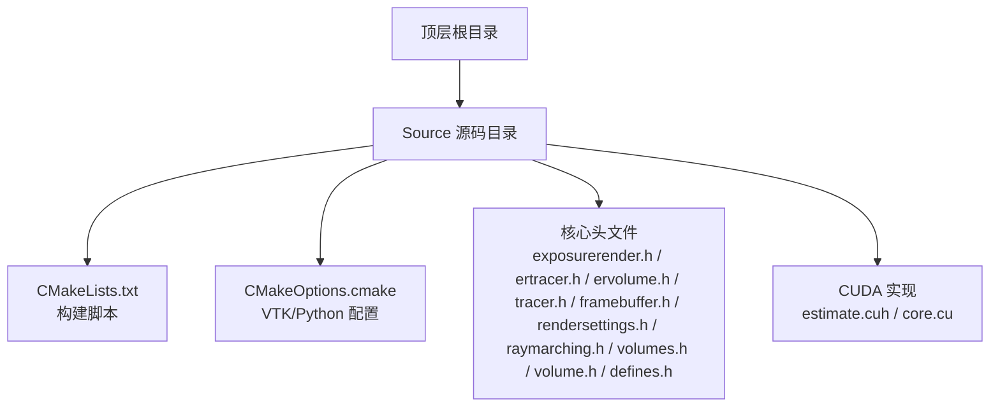
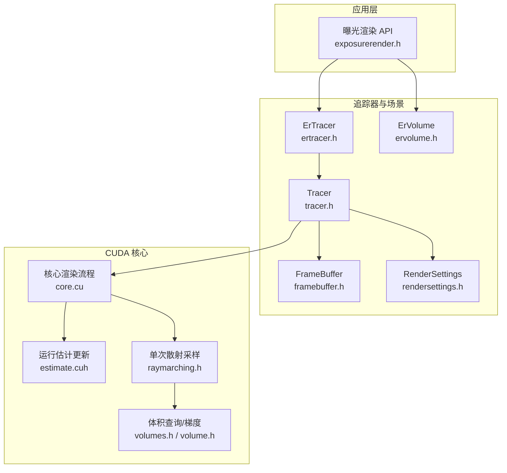
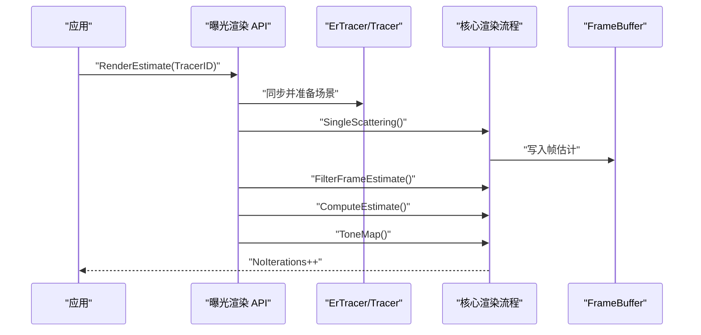
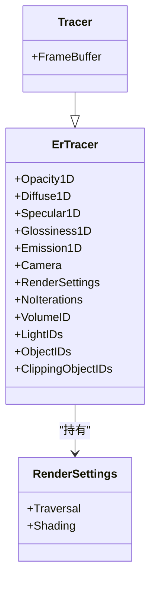
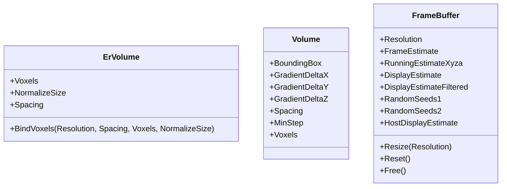
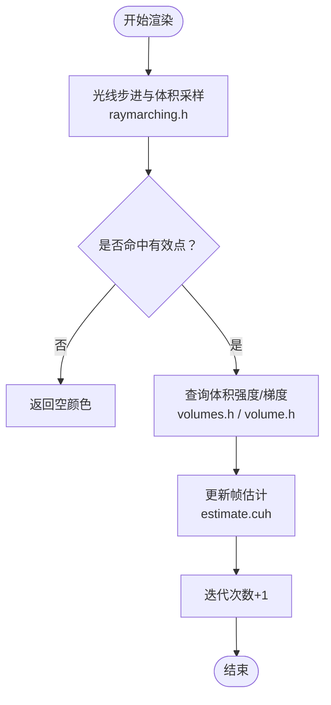

# 快速开始

<cite>
**本文引用的文件**
- [README.md](file://README.md)
- [CMakeLists.txt](file://Source/CMakeLists.txt)
- [CMakeOptions.cmake](file://Source/CMakeOptions.cmake)
- [exposurerender.h](file://Source/exposurerender.h)
- [exposurerender.cpp](file://Source/exposurerender.cpp)
- [ertracer.h](file://Source/ertracer.h)
- [ervolume.h](file://Source/ervolume.h)
- [tracer.h](file://Source/tracer.h)
- [framebuffer.h](file://Source/framebuffer.h)
- [rendersettings.h](file://Source/rendersettings.h)
- [estimate.cuh](file://Source/estimate.cuh)
- [core.cu](file://Source/core.cu)
- [raymarching.h](file://Source/raymarching.h)
- [volumes.h](file://Source/volumes.h)
- [volume.h](file://Source/volume.h)
- [defines.h](file://Source/defines.h)
</cite>

## 目录
1. [简介](#简介)
2. [项目结构](#项目结构)
3. [核心组件](#核心组件)
4. [架构总览](#架构总览)
5. [详细组件分析](#详细组件分析)
6. [依赖与构建](#依赖与构建)
7. [性能考量](#性能考量)
8. [故障排查指南](#故障排查指南)
9. [结论](#结论)
10. [附录：首次渲染示例与操作流程](#附录首次渲染示例与操作流程)

## 简介
本指南面向首次接触曝光渲染框架（CUDA 基于体积光线投射 + 物理光照）的用户，目标是帮助你在本地完成环境准备、依赖安装、编译配置与首次成功渲染的完整流程。文档覆盖系统要求检查、依赖项安装、CMake 构建配置、以及通过 API 完成一次基础渲染的步骤说明。

## 项目结构
该仓库采用分层与按功能模块组织的源码结构，核心目录与关键文件如下：
- Source 根目录包含所有源文件与构建脚本
  - CMakeLists.txt：主构建脚本，定义 CUDA 库 ErCore 的生成规则与源文件分组
  - CMakeOptions.cmake：VTK 查找与可选 Python 包装支持配置
  - 核心头文件：exposurerender.h、ertracer.h、ervolume.h、tracer.h、framebuffer.h、rendersettings.h、raymarching.h、volumes.h、volume.h、defines.h 等
  - CUDA 实现：estimate.cuh、core.cu 等

图表来源
- [CMakeLists.txt:1-155](file://Source/CMakeLists.txt#L1-L155)
- [CMakeOptions.cmake:1-65](file://Source/CMakeOptions.cmake#L1-L65)

章节来源
- [CMakeLists.txt:1-155](file://Source/CMakeLists.txt#L1-L155)
- [CMakeOptions.cmake:1-65](file://Source/CMakeOptions.cmake#L1-L65)

## 核心组件
- 曝光渲染 API（对外接口）
  - 曝光渲染 DLL 导出函数：绑定追踪器、体积、光源、对象、纹理、位图；执行估计渲染、获取估计图像、自动对焦距离与迭代次数等
  - 参考路径：[exposurerender.h:32-42](file://Source/exposurerender.h#L32-L42)
- 追踪器（Tracer）
  - 封装相机、渲染设置、传输函数、光源/对象/裁剪对象索引、体积 ID、迭代次数等
  - 参考路径：[ertracer.h:33-116](file://Source/ertracer.h#L33-L116)，[tracer.h:31-54](file://Source/tracer.h#L31-L54)
- 体积（Volume/ErVolume）
  - 提供体数据绑定（分辨率、间距、体素缓冲）、归一化尺寸与采样步长等
  - 参考路径：[ervolume.h:28-73](file://Source/ervolume.h#L28-L73)，[volume.h:26-48](file://Source/volume.h#L26-L48)
- 渲染帧缓冲（FrameBuffer）
  - 维护帧估计、运行估计、滤波后显示估计、随机种子缓存与主机侧显示缓冲等
  - 参考路径：[framebuffer.h:45-104](file://Source/framebuffer.h#L45-L104)
- 渲染设置（RenderSettings）
  - 分别包含遍历与着色两大子设置：步长因子、阴影、密度缩放、梯度计算阈值与因子等
  - 参考路径：[rendersettings.h:27-131](file://Source/rendersettings.h#L27-L131)
- CUDA 渲染管线（核心步骤）
  - 单次散射、帧估计滤波、运行估计更新、色调映射
  - 参考路径：[core.cu:126-136](file://Source/core.cu#L126-L136)，[estimate.cuh:27-38](file://Source/estimate.cuh#L27-L38)

章节来源
- [exposurerender.h:32-42](file://Source/exposurerender.h#L32-L42)
- [ertracer.h:33-116](file://Source/ertracer.h#L33-L116)
- [ervolume.h:28-73](file://Source/ervolume.h#L28-L73)
- [tracer.h:31-54](file://Source/tracer.h#L31-L54)
- [framebuffer.h:45-104](file://Source/framebuffer.h#L45-L104)
- [rendersettings.h:27-131](file://Source/rendersettings.h#L27-L131)
- [core.cu:126-136](file://Source/core.cu#L126-L136)
- [estimate.cuh:27-38](file://Source/estimate.cuh#L27-L38)

## 架构总览
下图展示了从应用调用到 CUDA 内核执行的关键交互关系，以及渲染管线的主要阶段。

图表来源
- [exposurerender.h:32-42](file://Source/exposurerender.h#L32-L42)
- [ertracer.h:33-116](file://Source/ertracer.h#L33-L116)
- [tracer.h:31-54](file://Source/tracer.h#L31-L54)
- [framebuffer.h:45-104](file://Source/framebuffer.h#L45-L104)
- [rendersettings.h:27-131](file://Source/rendersettings.h#L27-L131)
- [ervolume.h:28-73](file://Source/ervolume.h#L28-L73)
- [core.cu:126-136](file://Source/core.cu#L126-L136)
- [estimate.cuh:27-38](file://Source/estimate.cuh#L27-L38)
- [raymarching.h:30-45](file://Source/raymarching.h#L30-L45)
- [volumes.h:26-36](file://Source/volumes.h#L26-L36)
- [volume.h:26-48](file://Source/volume.h#L26-L48)

## 详细组件分析

### 曝光渲染 API（对外接口）
- 主要职责
  - 绑定/解绑追踪器、体积、光源、对象、纹理、位图
  - 执行一次渲染估计（单帧）并获取估计图像
  - 查询自动对焦距离与迭代次数
- 关键函数
  - 绑定与渲染：[exposurerender.h:32-42](file://Source/exposurerender.h#L32-L42)
  - 获取估计与迭代数：[exposurerender.h:39-42](file://Source/exposurerender.h#L39-L42)
- 实现要点
  - 绑定后由核心流程驱动渲染：[core.cu:126-136](file://Source/core.cu#L126-L136)

图表来源
- [exposurerender.h:39-42](file://Source/exposurerender.h#L39-L42)
- [core.cu:126-136](file://Source/core.cu#L126-L136)
- [estimate.cuh:27-38](file://Source/estimate.cuh#L27-L38)

章节来源
- [exposurerender.h:32-42](file://Source/exposurerender.h#L32-L42)
- [core.cu:126-136](file://Source/core.cu#L126-L136)

### 追踪器与渲染设置
- ErTracer/Tracer
  - 负责维护相机、渲染设置、传输函数、光源/对象/裁剪对象索引、体积 ID、迭代次数等
  - 参考路径：[ertracer.h:33-116](file://Source/ertracer.h#L33-L116)，[tracer.h:31-54](file://Source/tracer.h#L31-L54)
- RenderSettings
  - 控制步长、阴影、密度缩放、梯度计算策略等
  - 参考路径：[rendersettings.h:27-131](file://Source/rendersettings.h#L27-L131)

图表来源
- [ertracer.h:33-116](file://Source/ertracer.h#L33-L116)
- [tracer.h:31-54](file://Source/tracer.h#L31-L54)
- [rendersettings.h:27-131](file://Source/rendersettings.h#L27-L131)

章节来源
- [ertracer.h:33-116](file://Source/ertracer.h#L33-L116)
- [tracer.h:31-54](file://Source/tracer.h#L31-L54)
- [rendersettings.h:27-131](file://Source/rendersettings.h#L27-L131)

### 体积与帧缓冲
- ErVolume/Volume
  - 提供体数据绑定（分辨率、间距、体素缓冲），支持归一化尺寸与采样步长
  - 参考路径：[ervolume.h:28-73](file://Source/ervolume.h#L28-L73)，[volume.h:26-48](file://Source/volume.h#L26-L48)
- FrameBuffer
  - 管理帧估计、运行估计、滤波后显示估计、随机种子缓存与主机侧显示缓冲，并在分辨率变化时重分配
  - 参考路径：[framebuffer.h:45-104](file://Source/framebuffer.h#L45-L104)

图表来源
- [ervolume.h:28-73](file://Source/ervolume.h#L28-L73)
- [volume.h:26-48](file://Source/volume.h#L26-L48)
- [framebuffer.h:45-104](file://Source/framebuffer.h#L45-L104)

章节来源
- [ervolume.h:28-73](file://Source/ervolume.h#L28-L73)
- [volume.h:26-48](file://Source/volume.h#L26-L48)
- [framebuffer.h:45-104](file://Source/framebuffer.h#L45-L104)

### 渲染管线与光线步进
- 单次散射采样与体积步进
  - 通过光线盒相交确定步进范围，按密度场进行步进采样
  - 参考路径：[raymarching.h:30-45](file://Source/raymarching.h#L30-L45)
- 体积查询与梯度
  - 通过体积 ID 查询强度与中心差分梯度
  - 参考路径：[volumes.h:26-36](file://Source/volumes.h#L26-L36)
- 运行估计更新
  - 使用 CUDA 内核进行逐像素移动平均更新
  - 参考路径：[estimate.cuh:27-38](file://Source/estimate.cuh#L27-L38)

图表来源
- [raymarching.h:30-45](file://Source/raymarching.h#L30-L45)
- [volumes.h:26-36](file://Source/volumes.h#L26-L36)
- [estimate.cuh:27-38](file://Source/estimate.cuh#L27-L38)

章节来源
- [raymarching.h:30-45](file://Source/raymarching.h#L30-L45)
- [volumes.h:26-36](file://Source/volumes.h#L26-L36)
- [estimate.cuh:27-38](file://Source/estimate.cuh#L27-L38)

## 依赖与构建
- 系统要求与硬件
  - 操作系统：Windows XP/Vista/7（建议 64 位）
  - 内存：至少 1GB
  - 显卡：NVIDIA CUDA 兼容 GPU（计算能力 1.0+，建议 GTX270 或更高）
  - 备注：较大数据集可能存在问题
  - 参考路径：[README.md:17-22](file://README.md#L17-L22)
- 工具链与版本
  - Visual Studio 2017、Qt5.11.1、VTK 7.1.1、CUDA 9.2（参考官方发布说明）
  - 参考路径：[README.md:14-16](file://README.md#L14-L16)
- CMake 配置
  - 查找 CUDA 并设置目标架构标志
  - 设置导出符号与包含目录
  - 参考路径：[CMakeLists.txt:21-42](file://Source/CMakeLists.txt#L21-L42)
- VTK 支持
  - 自动查找并包含 VTK 设置；可选启用 Python 包装（需共享库）
  - 参考路径：[CMakeOptions.cmake:9-12](file://Source/CMakeOptions.cmake#L9-L12)，[CMakeOptions.cmake:21-26](file://Source/CMakeOptions.cmake#L21-L26)，[CMakeOptions.cmake:28-43](file://Source/CMakeOptions.cmake#L28-L43)
- 生成 ErCore 库
  - 将 General/ Shapes/ Bindable/ Cuda 分组源文件编译为共享库 ErCore
  - 参考路径：[CMakeLists.txt:155](file://Source/CMakeLists.txt#L155)

章节来源
- [README.md:14-22](file://README.md#L14-L22)
- [CMakeLists.txt:21-42](file://Source/CMakeLists.txt#L21-L42)
- [CMakeLists.txt:155](file://Source/CMakeLists.txt#L155)
- [CMakeOptions.cmake:9-12](file://Source/CMakeOptions.cmake#L9-L12)
- [CMakeOptions.cmake:21-26](file://Source/CMakeOptions.cmake#L21-L26)
- [CMakeOptions.cmake:28-43](file://Source/CMakeOptions.cmake#L28-L43)

## 性能考量
- 步长与密度
  - 渲染设置中的密度缩放与步长因子直接影响采样效率与质量
  - 参考路径：[rendersettings.h:66-106](file://Source/rendersettings.h#L66-L106)
- 梯度计算
  - 梯度阈值与因子用于控制边缘增强与噪声敏感性
  - 参考路径：[rendersettings.h:66-106](file://Source/rendersettings.h#L66-L106)
- CUDA 架构与内核
  - NVCC 编译标志针对特定 SM 架构进行优化
  - 参考路径：[CMakeLists.txt:32-34](file://Source/CMakeLists.txt#L32-L34)
- 帧缓冲大小
  - 分辨率变化会触发缓冲区重分配，注意内存占用
  - 参考路径：[framebuffer.h:45-68](file://Source/framebuffer.h#L45-L68)

章节来源
- [rendersettings.h:66-106](file://Source/rendersettings.h#L66-L106)
- [CMakeLists.txt:32-34](file://Source/CMakeLists.txt#L32-L34)
- [framebuffer.h:45-68](file://Source/framebuffer.h#L45-L68)

## 故障排查指南
- 构建失败（未找到 CUDA/VTK）
  - 确认已安装并正确配置 CUDA 与 VTK，确保 CMake 能找到相应组件
  - 参考路径：[CMakeLists.txt:21](file://Source/CMakeLists.txt#L21)，[CMakeOptions.cmake:9-12](file://Source/CMakeOptions.cmake#L9-L12)
- Python 包装启用但未共享库
  - 启用 Python 包装需同时开启共享库选项，否则会报错
  - 参考路径：[CMakeOptions.cmake:37-42](file://Source/CMakeOptions.cmake#L37-L42)
- 运行时渲染异常或黑屏
  - 检查体积数据绑定是否正确（分辨率、间距、指针），确认相机与渲染设置合理
  - 参考路径：[ervolume.h:63-69](file://Source/ervolume.h#L63-L69)，[ertracer.h:110-116](file://Source/ertracer.h#L110-L116)，[rendersettings.h:66-106](file://Source/rendersettings.h#L66-L106)
- CUDA 架构不匹配
  - 确保 NVCC 架构标志与目标 GPU 计算能力兼容
  - 参考路径：[CMakeLists.txt:32-34](file://Source/CMakeLists.txt#L32-L34)

章节来源
- [CMakeLists.txt:21](file://Source/CMakeLists.txt#L21)
- [CMakeOptions.cmake:9-12](file://Source/CMakeOptions.cmake#L9-L12)
- [CMakeOptions.cmake:37-42](file://Source/CMakeOptions.cmake#L37-L42)
- [ervolume.h:63-69](file://Source/ervolume.h#L63-L69)
- [ertracer.h:110-116](file://Source/ertracer.h#L110-L116)
- [rendersettings.h:66-106](file://Source/rendersettings.h#L66-L106)
- [CMakeLists.txt:32-34](file://Source/CMakeLists.txt#L32-L34)

## 结论
通过本指南，你可以在满足系统与工具链要求的前提下，完成 CMake 构建、正确绑定体积与场景参数，并调用曝光渲染 API 执行一次完整的渲染流程。若遇到构建或运行问题，请对照“故障排查指南”逐项检查。

## 附录：首次渲染示例与操作流程
以下为从环境准备到第一次成功渲染的步骤说明（不含具体代码内容，仅提供路径与顺序）：

- 环境准备与检查
  - 确认操作系统、显卡驱动与 CUDA 版本满足要求
  - 参考路径：[README.md:17-22](file://README.md#L17-L22)
- 安装与配置依赖
  - 安装 Visual Studio 2017、Qt5.11.1、VTK 7.1.1、CUDA 9.2
  - 参考路径：[README.md:14-16](file://README.md#L14-L16)
- 准备体数据
  - 准备体数据（分辨率、间距、体素数组），用于绑定到 ErVolume
  - 参考路径：[ervolume.h:63-69](file://Source/ervolume.h#L63-L69)
- 构建项目
  - 使用 CMake 配置并生成工程，确保找到 CUDA 与 VTK
  - 参考路径：[CMakeLists.txt:21-42](file://Source/CMakeLists.txt#L21-L42)，[CMakeOptions.cmake:9-12](file://Source/CMakeOptions.cmake#L9-L12)
- 初始化场景
  - 创建并配置 ErTracer/Tracer、相机、渲染设置、光源与对象
  - 参考路径：[ertracer.h:33-116](file://Source/ertracer.h#L33-L116)，[tracer.h:31-54](file://Source/tracer.h#L31-L54)，[rendersettings.h:27-131](file://Source/rendersettings.h#L27-L131)
- 绑定资源
  - 绑定 ErVolume、光源、对象、纹理、位图
  - 参考路径：[exposurerender.h:32-38](file://Source/exposurerender.h#L32-L38)
- 执行渲染
  - 调用 RenderEstimate 执行一次渲染估计
  - 参考路径：[exposurerender.h:39](file://Source/exposurerender.h#L39)，[core.cu:126-136](file://Source/core.cu#L126-L136)
- 获取结果
  - 调用 GetEstimate 获取当前估计图像数据
  - 参考路径：[exposurerender.h:40](file://Source/exposurerender.h#L40)，[core.cu:138-143](file://Source/core.cu#L138-L143)
- 常见问题
  - 若出现构建错误，检查 CUDA/VTK 是否被正确发现
  - 若渲染无输出，检查体数据绑定与相机设置
  - 参考路径：[CMakeLists.txt:21](file://Source/CMakeLists.txt#L21)，[CMakeOptions.cmake:9-12](file://Source/CMakeOptions.cmake#L9-L12)，[ervolume.h:63-69](file://Source/ervolume.h#L63-L69)，[ertracer.h:110-116](file://Source/ertracer.h#L110-L116)

章节来源
- [README.md:14-22](file://README.md#L14-L22)
- [CMakeLists.txt:21-42](file://Source/CMakeLists.txt#L21-L42)
- [CMakeOptions.cmake:9-12](file://Source/CMakeOptions.cmake#L9-L12)
- [ervolume.h:63-69](file://Source/ervolume.h#L63-L69)
- [ertracer.h:33-116](file://Source/ertracer.h#L33-L116)
- [tracer.h:31-54](file://Source/tracer.h#L31-L54)
- [rendersettings.h:27-131](file://Source/rendersettings.h#L27-L131)
- [exposurerender.h:32-40](file://Source/exposurerender.h#L32-L40)
- [core.cu:126-143](file://Source/core.cu#L126-L143)