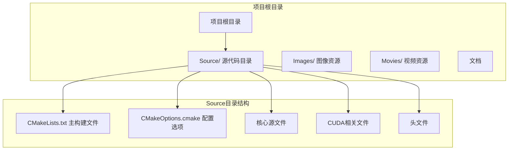
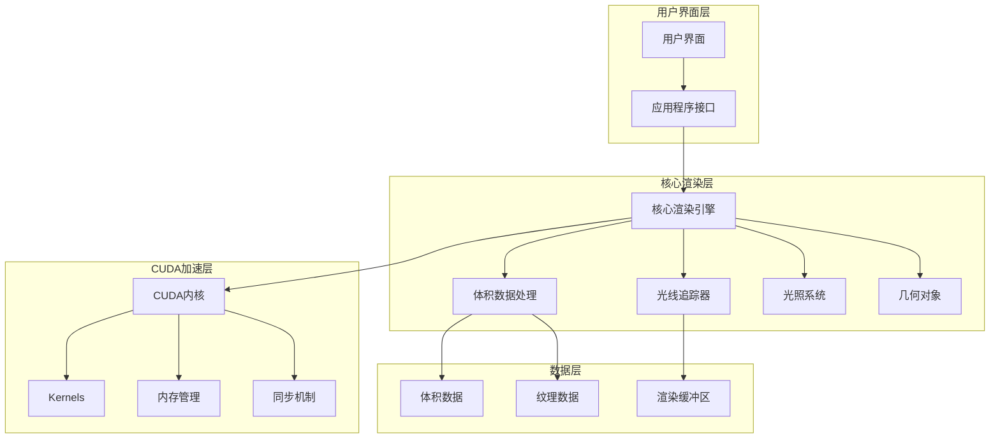
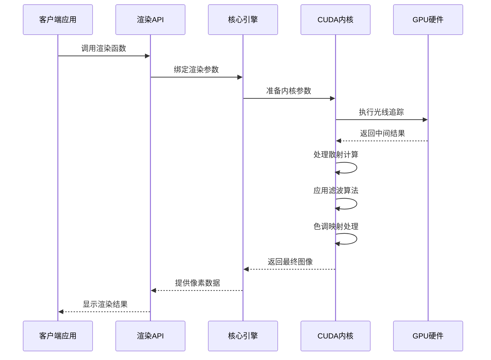
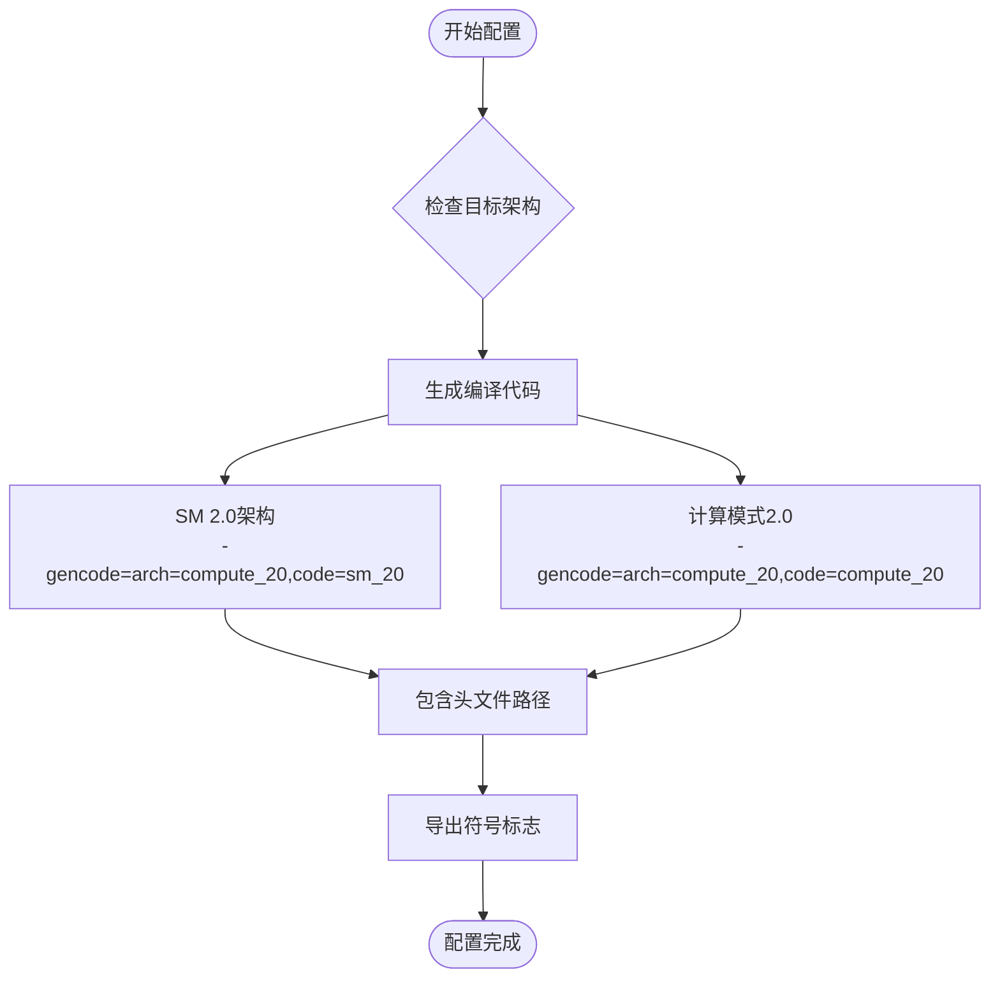
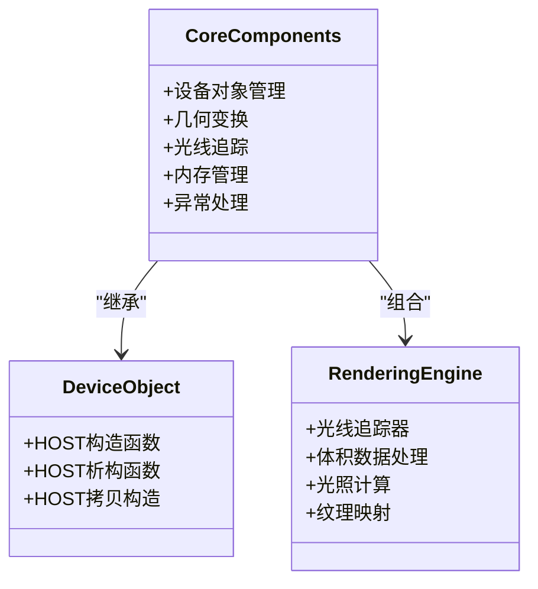
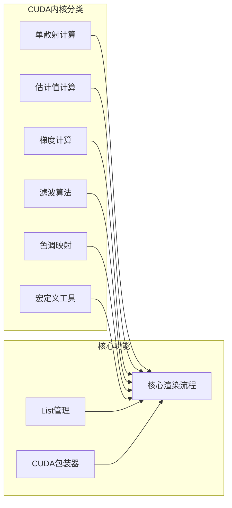
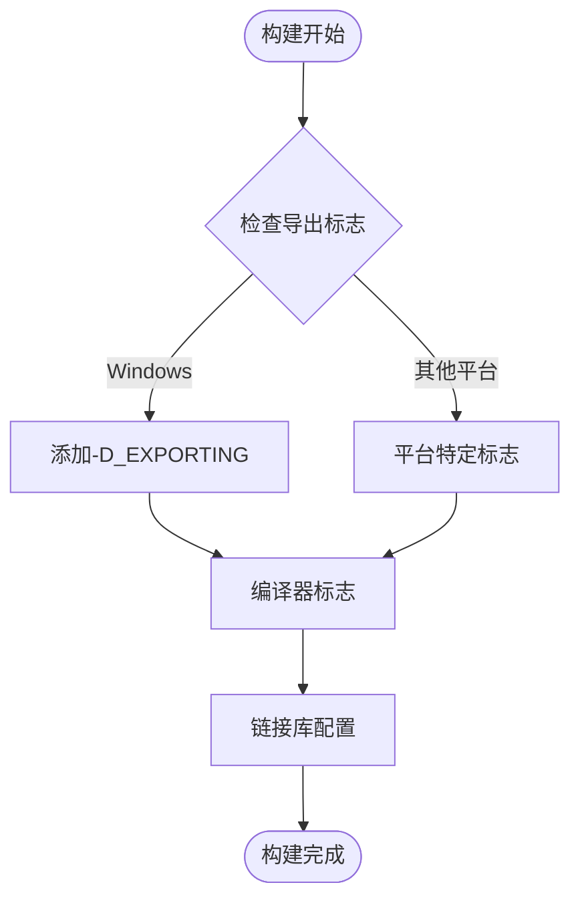
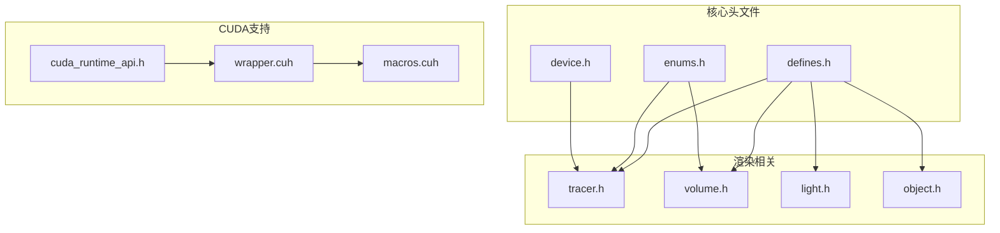
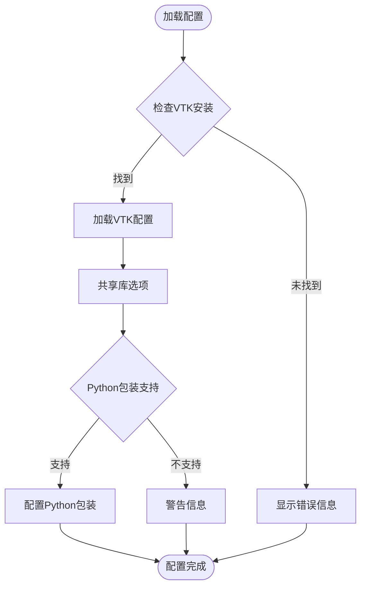

# CMake配置详解

<cite>
**本文档引用的文件**
- [CMakeLists.txt](file://Source/CMakeLists.txt)
- [CMakeOptions.cmake](file://Source/CMakeOptions.cmake)
- [README.md](file://README.md)
- [core.cu](file://Source/core.cu)
- [exposurerender.h](file://Source/exposurerender.h)
- [device.h](file://Source/device.h)
- [defines.h](file://Source/defines.h)
- [enums.h](file://Source/enums.h)
</cite>

## 目录
1. [简介](#简介)
2. [项目结构](#项目结构)
3. [核心组件](#核心组件)
4. [架构概览](#架构概览)
5. [详细组件分析](#详细组件分析)
6. [依赖关系分析](#依赖关系分析)
7. [性能考虑](#性能考虑)
8. [故障排除指南](#故障排除指南)
9. [结论](#结论)

## 简介

Exposure Render是一个基于CUDA的体积渲染框架，该项目使用CMake作为构建系统。该框架实现了交互式的照片级真实感体积渲染，结合了基于物理的光线传输算法。项目采用模块化设计，通过CMakeLists.txt文件组织源代码，支持多种CUDA架构和平台配置。

## 项目结构

该项目采用分层的项目结构，主要包含以下目录和文件：

**图表来源**
- [CMakeLists.txt:17-155](file://Source/CMakeLists.txt#L17-L155)

**章节来源**
- [CMakeLists.txt:17-155](file://Source/CMakeLists.txt#L17-L155)
- [README.md:14-61](file://README.md#L14-L61)

## 核心组件

### CMake主构建文件分析

主构建文件`CMakeLists.txt`是整个项目的构建核心，包含了以下关键配置：

#### 基础配置
- **CMake版本要求**: 最低版本2.8
- **项目名称**: ExposureRender
- **CUDA支持**: 通过`FIND_PACKAGE(CUDA)`启用CUDA编译器支持

#### CUDA架构配置
项目当前配置支持计算能力2.0及以上的GPU架构：
- `compute_20`: 支持SM 2.0架构
- `compute_20`: 支持计算模式2.0架构

**章节来源**
- [CMakeLists.txt:17-45](file://Source/CMakeLists.txt#L17-L45)

### 源文件组织结构

项目采用按功能分组的源文件组织方式，通过`SOURCE_GROUP`指令创建逻辑分组：

#### Core组
包含核心渲染引擎的基础组件，如设备对象管理、几何变换、光线追踪等基础功能。

#### General组
包含通用的数学运算、数据结构、缓冲区管理和日志系统等基础设施。

#### Shapes组
专门处理各种几何形状的定义和操作，包括平面、球体、圆柱体等基本形状。

#### Bindable组
提供API绑定接口，用于将C++对象与CUDA内核进行绑定和交互。

#### Cuda组
包含所有CUDA相关的核函数和内核实现，如单散射、估计计算、色调映射等。

**章节来源**
- [CMakeLists.txt:47-152](file://Source/CMakeLists.txt#L47-L152)

## 架构概览

### 整体架构设计

**图表来源**
- [core.cu:19-156](file://Source/core.cu#L19-L156)
- [exposurerender.h:29-45](file://Source/exposurerender.h#L29-L45)

### 数据流架构

**图表来源**
- [core.cu:126-143](file://Source/core.cu#L126-L143)
- [exposurerender.h:32-42](file://Source/exposurerender.h#L32-L42)

## 详细组件分析

### CUDA架构配置详解

#### NVCC标志配置
项目使用`-gencode`标志为不同架构生成代码：

**图表来源**
- [CMakeLists.txt:23-45](file://Source/CMakeLists.txt#L23-L45)

#### 架构兼容性说明
- **compute_20**: 支持NVIDIA GeForce GTX 200系列及更新的GPU
- **SM 2.0**: 支持具体的流处理器架构
- **计算模式**: 兼容性更好的通用计算模式

**章节来源**
- [CMakeLists.txt:23-34](file://Source/CMakeLists.txt#L23-L34)

### 源文件分组策略

#### Core组分析
包含渲染引擎的核心功能，通过`vtkErCoreSources`变量管理：

**图表来源**
- [device.h:28-43](file://Source/device.h#L28-L43)
- [CMakeLists.txt:47-48](file://Source/CMakeLists.txt#L47-L48)

#### CUDA组实现
CUDA组包含所有GPU加速的内核函数：

**图表来源**
- [CMakeLists.txt:137-149](file://Source/CMakeLists.txt#L137-L149)
- [core.cu:38-51](file://Source/core.cu#L38-L51)

**章节来源**
- [CMakeLists.txt:104-152](file://Source/CMakeLists.txt#L104-L152)

### 编译标志配置

#### 符号导出配置
项目通过`-D_EXPORTING`标志控制符号导出：

**图表来源**
- [CMakeLists.txt:44-45](file://Source/CMakeLists.txt#L44-L45)

#### 头文件包含路径
项目配置了多层头文件包含路径：
- 当前二进制目录
- 当前源码目录  
- CUDA SDK公共包含目录
- CUDA工具包包含目录

**章节来源**
- [CMakeLists.txt:36-42](file://Source/CMakeLists.txt#L36-L42)

## 依赖关系分析

### 头文件依赖关系

**图表来源**
- [defines.h:31-56](file://Source/defines.h#L31-L56)
- [enums.h:24-108](file://Source/enums.h#L24-L108)
- [wrapper.cuh:24-80](file://Source/wrapper.cuh#L24-L80)

### 库依赖配置

项目通过CMakeOptions.cmake文件管理VTK集成：

**图表来源**
- [CMakeOptions.cmake:9-26](file://Source/CMakeOptions.cmake#L9-L26)

**章节来源**
- [CMakeOptions.cmake:9-54](file://Source/CMakeOptions.cmake#L9-L54)

## 性能考虑

### CUDA架构选择策略

#### 计算能力权衡
- **SM 2.0架构**: 提供良好的向后兼容性
- **计算模式**: 更好的跨代际兼容性
- **性能影响**: 不同架构在内存带宽、寄存器数量等方面有差异

#### 内存管理优化
项目采用统一的CUDA内存管理接口：
- 动态内存分配
- 纹理内存优化
- 常量内存缓存
- 同步机制优化

### 编译优化建议

#### 编译器标志
- 使用适当的优化级别
- 启用CUDA内联优化
- 针对特定架构进行优化

#### 构建配置
- 分离调试和发布配置
- 条件编译支持
- 平台特定优化

## 故障排除指南

### 常见构建问题

#### CUDA工具包未找到
**症状**: CMake无法找到CUDA安装
**解决方案**: 
- 设置CUDA_ROOT环境变量
- 指定CUDA_TOOLKIT_ROOT_DIR
- 验证CUDA版本兼容性

#### VTK集成问题
**症状**: VTK相关配置失败
**解决方案**:
- 确保VTK正确安装
- 检查VTK_USE_FILE路径
- 验证Python包装支持状态

#### 架构兼容性问题
**症状**: 运行时CUDA错误
**解决方案**:
- 检查GPU计算能力
- 更新CUDA_NVCC_FLAGS
- 验证目标架构设置

### 调试技巧

#### 构建输出分析
- 启用详细构建日志
- 检查编译器输出
- 验证链接器行为

#### 运行时问题诊断
- 使用CUDA调试工具
- 检查内存访问模式
- 验证内核执行配置

**章节来源**
- [CMakeOptions.cmake:38-42](file://Source/CMakeOptions.cmake#L38-L42)
- [CMakeLists.txt:23-34](file://Source/CMakeLists.txt#L23-L34)

## 结论

Exposure Render的CMake配置展现了现代CUDA项目的最佳实践。通过合理的源文件组织、清晰的架构分层和灵活的构建配置，该项目实现了良好的可维护性和可扩展性。

### 关键优势

1. **模块化设计**: 通过SOURCE_GROUP实现逻辑分组，便于理解和维护
2. **架构兼容**: 支持多种CUDA架构，确保广泛的硬件兼容性
3. **配置灵活性**: 通过CMakeOptions.cmake提供可定制的构建选项
4. **性能优化**: 针对CUDA特性的优化配置

### 最佳实践总结

- 使用条件编译支持多平台
- 合理组织源文件结构
- 明确的依赖关系管理
- 详细的错误处理机制
- 灵活的配置选项系统

该配置为CUDA图形渲染项目的CMake构建提供了优秀的参考模板，既适合初学者学习，也为经验丰富的开发者提供了深入的技术细节。