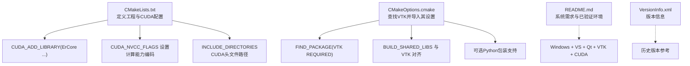
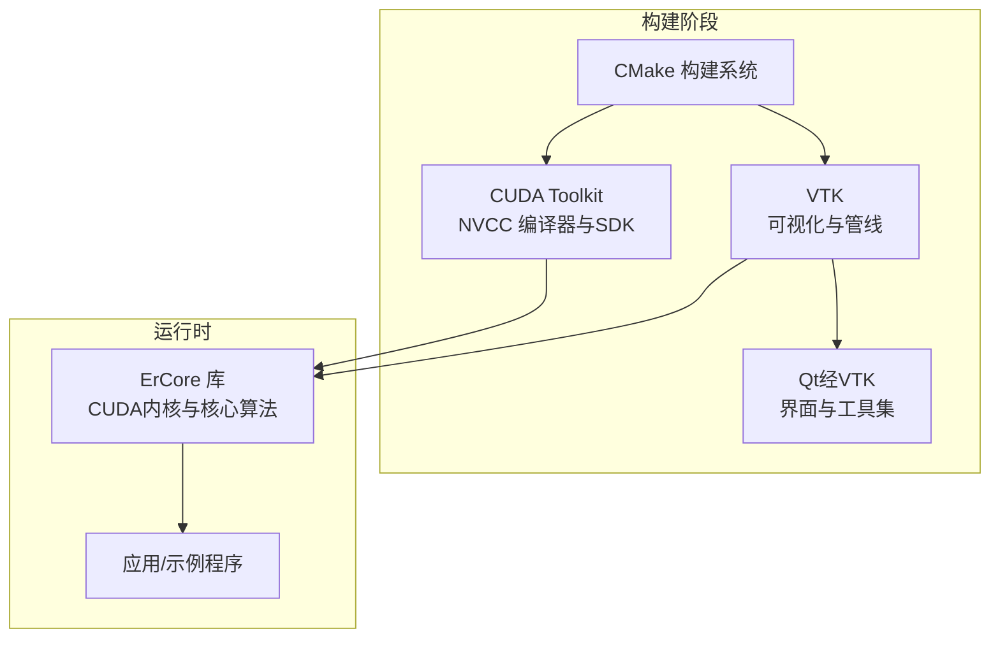
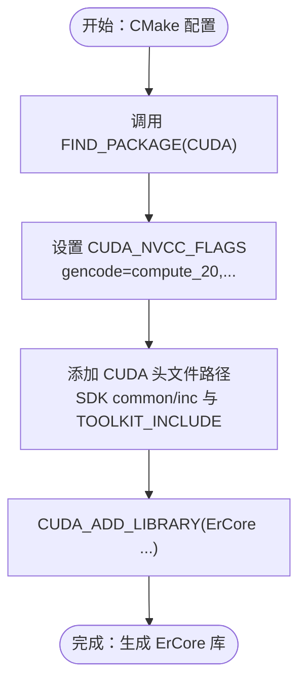
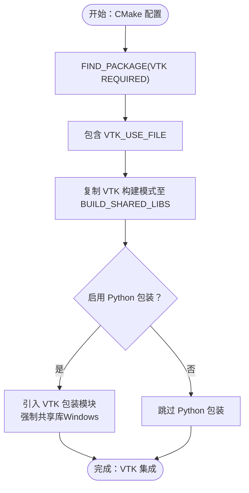
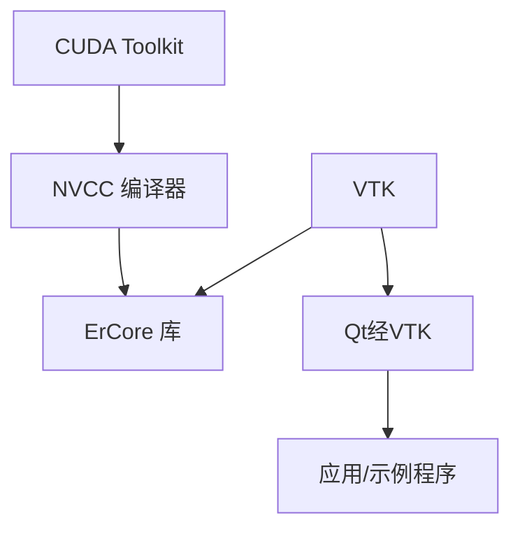

# 依赖项管理

<cite>
**本文引用的文件**
- [CMakeLists.txt](file://Source/CMakeLists.txt)
- [CMakeOptions.cmake](file://Source/CMakeOptions.cmake)
- [README.md](file://README.md)
- [VersionInfo.xml](file://VersionInfo.xml)
- [exposurerender.h](file://Source/exposurerender.h)
- [defines.h](file://Source/defines.h)
- [enums.h](file://Source/enums.h)
</cite>

## 目录
1. [简介](#简介)
2. [项目结构](#项目结构)
3. [核心组件](#核心组件)
4. [架构总览](#架构总览)
5. [详细组件分析](#详细组件分析)
6. [依赖关系分析](#依赖关系分析)
7. [性能考虑](#性能考虑)
8. [故障排除指南](#故障排除指南)
9. [结论](#结论)
10. [附录](#附录)

## 简介
本文件系统化梳理本项目在构建与运行过程中所需的外部依赖项，重点覆盖以下方面：
- 外部依赖项清单：CUDA Toolkit、VTK、Qt（通过VTK间接关联）等
- 版本要求与兼容性：基于仓库提供的测试配置与历史版本信息
- 查找与配置流程：CMake 中 FIND_PACKAGE 的使用、路径设置与导出变量
- 各依赖项在项目中的作用与集成方式：CUDA 核心计算、VTK 可视化与管线、Qt（经由VTK）界面
- 升级注意事项与平台差异：Windows 平台、Visual Studio 与 CMake 配置要点
- 完整安装指南与故障排除方法：从环境准备到常见问题定位

## 项目结构
本项目采用 CMake 构建系统，核心依赖项在顶层构建脚本中声明并通过模块化选项进行配置。关键文件与职责如下：
- Source/CMakeLists.txt：定义工程、启用 CUDA 支持、设置 NVCC 编译标志、包含 CUDA 头文件目录、构建 ErCore 库
- Source/CMakeOptions.cmake：查找并引入 VTK，处理共享/静态库选项、Python 包装支持等
- README.md：提供系统需求、已验证的构建环境（Visual Studio、Qt、VTK、CUDA）
- VersionInfo.xml：记录发布版本信息（用于参考历史版本）

**图表来源**
- [CMakeLists.txt:17-42](file://Source/CMakeLists.txt#L17-L42)
- [CMakeLists.txt:32-33](file://Source/CMakeLists.txt#L32-L33)
- [CMakeLists.txt:36-42](file://Source/CMakeLists.txt#L36-L42)
- [CMakeLists.txt:154-155](file://Source/CMakeLists.txt#L154-L155)
- [CMakeOptions.cmake:9-12](file://Source/CMakeOptions.cmake#L9-L12)
- [CMakeOptions.cmake:21-26](file://Source/CMakeOptions.cmake#L21-L26)
- [CMakeOptions.cmake:28-54](file://Source/CMakeOptions.cmake#L28-L54)
- [README.md:14-15](file://README.md#L14-L15)

**章节来源**
- [CMakeLists.txt:17-42](file://Source/CMakeLists.txt#L17-L42)
- [CMakeLists.txt:32-33](file://Source/CMakeLists.txt#L32-L33)
- [CMakeLists.txt:36-42](file://Source/CMakeLists.txt#L36-L42)
- [CMakeLists.txt:154-155](file://Source/CMakeLists.txt#L154-L155)
- [CMakeOptions.cmake:9-12](file://Source/CMakeOptions.cmake#L9-L12)
- [CMakeOptions.cmake:21-26](file://Source/CMakeOptions.cmake#L21-L26)
- [CMakeOptions.cmake:28-54](file://Source/CMakeOptions.cmake#L28-L54)
- [README.md:14-15](file://README.md#L14-L15)

## 核心组件
本节聚焦于项目对三大核心依赖项的使用方式与集成点。

- CUDA Toolkit
  - 在构建脚本中显式调用 FIND_PACKAGE(CUDA)，随后设置 NVCC 编译标志以生成特定计算架构的设备代码，并添加 CUDA SDK 与工具包头文件目录。
  - ErCore 库通过 CUDA_ADD_LIBRARY 命令构建，表明核心渲染算法以 CUDA 内核为主。
  - 关键集成点：
    - [CMakeLists.txt:21](file://Source/CMakeLists.txt#L21)
    - [CMakeLists.txt:32-33](file://Source/CMakeLists.txt#L32-L33)
    - [CMakeLists.txt:36-42](file://Source/CMakeLists.txt#L36-L42)
    - [CMakeLists.txt:154-155](file://Source/CMakeLists.txt#L154-L155)

- VTK（Visualization Toolkit）
  - 通过 CMakeOptions.cmake 使用 FIND_PACKAGE(VTK REQUIRED) 并包含 VTK_USE_FILE，确保后续组件能正确链接与编译。
  - 与构建选项联动：BUILD_SHARED_LIBS 默认跟随 VTK 的构建模式；若启用 Python 包装，则引入相应的 CMake 模块并在 Windows 下强制共享库。
  - 关键集成点：
    - [CMakeOptions.cmake:9-12](file://Source/CMakeOptions.cmake#L9-L12)
    - [CMakeOptions.cmake:21-26](file://Source/CMakeOptions.cmake#L21-L26)
    - [CMakeOptions.cmake:28-54](file://Source/CMakeOptions.cmake#L28-L54)

- Qt（通过 VTK 间接关联）
  - 项目 README 明确标注“已验证的构建环境”包含 Qt5.x；结合 VTK 的 Python 包装逻辑，可推断 Qt 通常通过 VTK 的 CMake 配置被发现与使用。
  - 关键集成点：
    - [README.md:14-15](file://README.md#L14-L15)
    - [CMakeOptions.cmake:36](file://Source/CMakeOptions.cmake#L36)

**章节来源**
- [CMakeLists.txt:21](file://Source/CMakeLists.txt#L21)
- [CMakeLists.txt:32-33](file://Source/CMakeLists.txt#L32-L33)
- [CMakeLists.txt:36-42](file://Source/CMakeLists.txt#L36-L42)
- [CMakeLists.txt:154-155](file://Source/CMakeLists.txt#L154-L155)
- [CMakeOptions.cmake:9-12](file://Source/CMakeOptions.cmake#L9-L12)
- [CMakeOptions.cmake:21-26](file://Source/CMakeOptions.cmake#L21-L26)
- [CMakeOptions.cmake:28-54](file://Source/CMakeOptions.cmake#L28-L54)
- [README.md:14-15](file://README.md#L14-L15)

## 架构总览
下图展示依赖项在构建与运行阶段的角色与交互：

**图表来源**
- [CMakeLists.txt:21](file://Source/CMakeLists.txt#L21)
- [CMakeLists.txt:36-42](file://Source/CMakeLists.txt#L36-L42)
- [CMakeLists.txt:154-155](file://Source/CMakeLists.txt#L154-L155)
- [CMakeOptions.cmake:9-12](file://Source/CMakeOptions.cmake#L9-L12)
- [README.md:14-15](file://README.md#L14-L15)

## 详细组件分析

### CUDA 依赖项分析
- 作用与集成
  - 通过 FIND_PACKAGE(CUDA) 发现并配置 CUDA 工具链，随后设置 NVCC 的 gencode 参数以生成目标 GPU 计算架构的二进制代码。
  - 添加 CUDA SDK 与工具包头文件目录，确保编译期可用的 CUDA 头文件与辅助接口。
  - 最终以 CUDA_ADD_LIBRARY 构建 ErCore 共享库，承载体积渲染与光线步进等核心算法。
- 版本与兼容性
  - 当前脚本仅启用 compute_20 的生成参数，未包含更高架构的 gencode 条目，建议在新硬件上补充相应计算架构以提升性能。
- 升级注意事项
  - 更新 CUDA 版本后需同步调整 gencode 列表与工具链路径；确保与已安装的驱动版本匹配。
  - 若使用较新的 CMake 版本，注意 CUDA 支持模块的命名与接口变化。
- 平台差异
  - 脚本未显式区分平台，但 CUDA 在 Windows 上通常通过 PATH 与 SDK 目录自动发现；建议明确设置 CUDA_TOOLKIT_ROOT_DIR 以避免歧义。

**图表来源**
- [CMakeLists.txt:21](file://Source/CMakeLists.txt#L21)
- [CMakeLists.txt:32-33](file://Source/CMakeLists.txt#L32-L33)
- [CMakeLists.txt:36-42](file://Source/CMakeLists.txt#L36-L42)
- [CMakeLists.txt:154-155](file://Source/CMakeLists.txt#L154-L155)

**章节来源**
- [CMakeLists.txt:21](file://Source/CMakeLists.txt#L21)
- [CMakeLists.txt:32-33](file://Source/CMakeLists.txt#L32-L33)
- [CMakeLists.txt:36-42](file://Source/CMakeLists.txt#L36-L42)
- [CMakeLists.txt:154-155](file://Source/CMakeLists.txt#L154-L155)

### VTK 依赖项分析
- 作用与集成
  - 使用 FIND_PACKAGE(VTK REQUIRED) 引入 VTK 的完整配置，随后包含 VTK_USE_FILE 以应用其编译与链接设置。
  - 构建选项与 VTK 对齐：BUILD_SHARED_LIBS 默认继承自 VTK；当启用 Python 包装时，引入 VTK 的 Python 包装 CMake 模块，并在 Windows 平台强制共享库。
  - 提供 Wrapping/hints 本地提示文件，便于生成语言绑定。
- 版本与兼容性
  - README 提供了“已验证的构建环境”：VTK 7.1.1、Qt5.11.1、Visual Studio 2017、CUDA 9.2。
  - 建议在升级 VTK 时同步更新 Qt 与编译器版本，确保 CMake 模块与接口兼容。
- 升级注意事项
  - Python 包装功能需要共享库；若禁用共享库，将触发致命错误。
  - VTK 的 CMake 模块与变量名可能随版本变化，升级时需核对相关变量与模块路径。
- 平台差异
  - Windows 平台下，VTK 的 CMake 配置通常通过预编译包或源码构建产物提供；建议明确设置 VTK_DIR 或 VTK_BINARY_DIR 以加速查找。

**图表来源**
- [CMakeOptions.cmake:9-12](file://Source/CMakeOptions.cmake#L9-L12)
- [CMakeOptions.cmake:21-26](file://Source/CMakeOptions.cmake#L21-L26)
- [CMakeOptions.cmake:28-54](file://Source/CMakeOptions.cmake#L28-L54)

**章节来源**
- [CMakeOptions.cmake:9-12](file://Source/CMakeOptions.cmake#L9-L12)
- [CMakeOptions.cmake:21-26](file://Source/CMakeOptions.cmake#L21-L26)
- [CMakeOptions.cmake:28-54](file://Source/CMakeOptions.cmake#L28-L54)

### Qt 依赖项分析
- 作用与集成
  - Qt 通过 VTK 的 CMake 配置间接被发现与使用；README 明确列出 Qt5.x 作为已验证环境的一部分。
  - 项目中存在与 Qt 相关的头文件与类型（如 EXPOSURE_RENDER_DLL），表明界面层可能依赖 Qt。
- 版本与兼容性
  - 已验证环境包含 Qt5.11.1；建议在升级 Qt 时同步验证 VTK 与 CMake 版本的兼容性。
- 升级注意事项
  - Qt 的安装路径与编译器工具链需与 CMake 的查找机制一致；必要时设置 QTDIR 或 CMAKE_PREFIX_PATH。
- 平台差异
  - Windows 平台下，Qt 通常通过官方安装包提供；建议统一使用与 Visual Studio 版本匹配的 Qt 版本。

**章节来源**
- [README.md:14-15](file://README.md#L14-L15)
- [exposurerender.h:31-43](file://Source/exposurerender.h#L31-L43)
- [defines.h:31-35](file://Source/defines.h#L31-L35)

## 依赖关系分析
下图展示依赖项之间的直接与间接关系，以及它们在构建与运行中的角色：

**图表来源**
- [CMakeLists.txt:21](file://Source/CMakeLists.txt#L21)
- [CMakeLists.txt:36-42](file://Source/CMakeLists.txt#L36-L42)
- [CMakeLists.txt:154-155](file://Source/CMakeLists.txt#L154-L155)
- [CMakeOptions.cmake:9-12](file://Source/CMakeOptions.cmake#L9-L12)
- [README.md:14-15](file://README.md#L14-L15)

**章节来源**
- [CMakeLists.txt:21](file://Source/CMakeLists.txt#L21)
- [CMakeLists.txt:36-42](file://Source/CMakeLists.txt#L36-L42)
- [CMakeLists.txt:154-155](file://Source/CMakeLists.txt#L154-L155)
- [CMakeOptions.cmake:9-12](file://Source/CMakeOptions.cmake#L9-L12)
- [README.md:14-15](file://README.md#L14-L15)

## 性能考虑
- CUDA 架构选择
  - 当前 gencode 仅包含 compute_20，建议根据目标 GPU 的实际计算能力补充更高架构的生成参数，以获得更优性能。
- 共享库策略
  - 保持 BUILD_SHARED_LIBS 与 VTK 的一致性有助于减少重复符号与链接问题；Python 包装场景下必须使用共享库。
- 头文件路径
  - 确保 CUDA_TOOLKIT_INCLUDE 与 CUDA_SDK_ROOT_DIR 指向正确的安装位置，避免编译失败或头文件缺失。

[本节为通用指导，不直接分析具体文件]

## 故障排除指南
- CUDA 找不到或版本不匹配
  - 现象：CMake 报告找不到 CUDA 或 NVCC 编译失败
  - 排查：确认已安装对应版本的 CUDA Toolkit；在 CMake GUI 或命令行中设置 CUDA_TOOLKIT_ROOT_DIR；检查 PATH 是否包含 nvcc 所在目录
  - 参考：
    - [CMakeLists.txt:21](file://Source/CMakeLists.txt#L21)
    - [CMakeLists.txt:36-42](file://Source/CMakeLists.txt#L36-L42)

- VTK 找不到或配置异常
  - 现象：CMake 报告找不到 VTK 或无法包含 VTK_USE_FILE
  - 排查：确认已安装 VTK 并正确配置 VTK_DIR；确保 CMake 版本与 VTK 提供的 CMake 模块兼容；在 Windows 下检查 VTK_BINARY_DIR 是否设置
  - 参考：
    - [CMakeOptions.cmake:9-12](file://Source/CMakeOptions.cmake#L9-L12)

- Python 包装导致的构建失败
  - 现象：启用 VTKMY_WRAP_PYTHON 后在 Windows 下报错，提示需要共享库
  - 排查：将 BUILD_SHARED_LIBS 设为 ON；确认 VTK 支持 Python 包装且模块路径正确
  - 参考：
    - [CMakeOptions.cmake:37-42](file://Source/CMakeOptions.cmake#L37-L42)

- Qt 相关问题
  - 现象：界面组件或符号未解析
  - 排查：确认 Qt 安装路径与编译器匹配；在 CMake 中设置 CMAKE_PREFIX_PATH 或 QTDIR；确保 Qt 与 VTK 的版本组合受支持
  - 参考：
    - [README.md:14-15](file://README.md#L14-L15)

**章节来源**
- [CMakeLists.txt:21](file://Source/CMakeLists.txt#L21)
- [CMakeLists.txt:36-42](file://Source/CMakeLists.txt#L36-L42)
- [CMakeOptions.cmake:9-12](file://Source/CMakeOptions.cmake#L9-L12)
- [CMakeOptions.cmake:37-42](file://Source/CMakeOptions.cmake#L37-L42)
- [README.md:14-15](file://README.md#L14-L15)

## 结论
本项目对依赖项的管理遵循“显式查找 + 模块导入 + 构建选项对齐”的原则：
- CUDA 通过 FIND_PACKAGE 与 NVCC gencode 配置实现跨架构的内核生成
- VTK 通过 REQUIRED 查找与 USE 文件导入确保编译与链接的一致性，并与共享库策略协同
- Qt 通过 VTK 的配置间接参与，已验证环境包含 Qt5.x

建议在升级依赖项时：
- 严格对照 README 的已验证环境
- 补充目标 GPU 的 CUDA 计算架构
- 统一共享库策略，避免 Python 包装场景下的致命错误
- 明确设置关键路径变量以减少查找不确定性

[本节为总结性内容，不直接分析具体文件]

## 附录

### 版本与兼容性摘要
- 已验证构建环境（来自 README）：Visual Studio、Qt5.11.1、VTK 7.1.1、CUDA 9.2
- CUDA 计算架构：当前启用 compute_20；建议按目标硬件补充更高架构
- VTK Python 包装：需共享库；Windows 下强制共享库

**章节来源**
- [README.md:14-15](file://README.md#L14-L15)
- [CMakeLists.txt:32-33](file://Source/CMakeLists.txt#L32-L33)
- [CMakeOptions.cmake:37-42](file://Source/CMakeOptions.cmake#L37-L42)