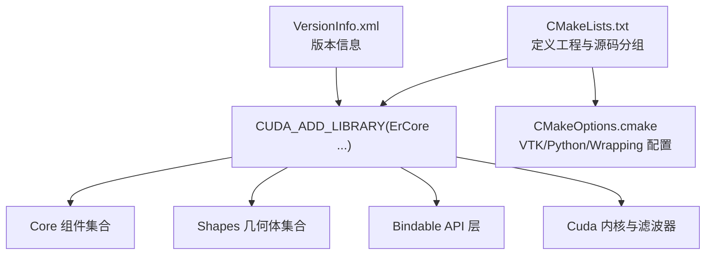
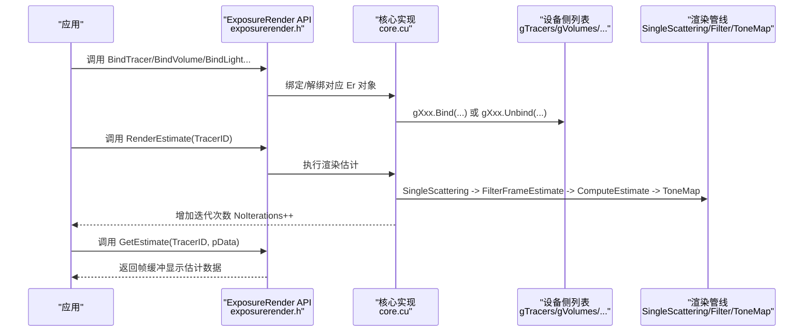
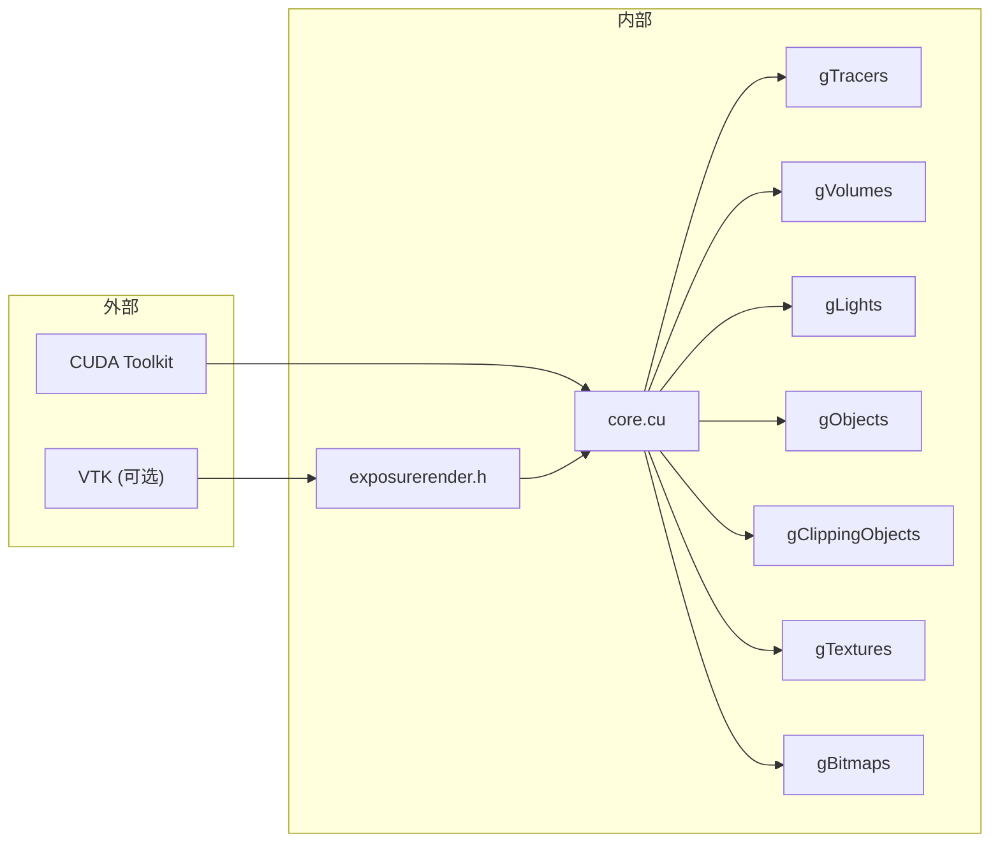
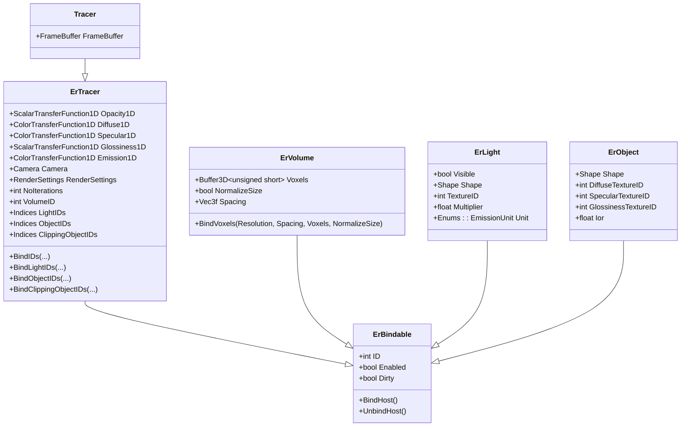

# 构建和部署

<cite>
**本文引用的文件**
- [README.md](file://README.md)
- [CMakeLists.txt](file://Source/CMakeLists.txt)
- [CMakeOptions.cmake](file://Source/CMakeOptions.cmake)
- [VersionInfo.xml](file://VersionInfo.xml)
- [.hgignore](file://.hgignore)
- [exposurerender.h](file://Source/exposurerender.h)
- [exposurerender.cpp](file://Source/exposurerender.cpp)
- [core.cu](file://Source/core.cu)
- [erbindable.h](file://Source/erbindable.h)
- [ertracer.h](file://Source/ertracer.h)
- [ervolume.h](file://Source/ervolume.h)
- [erlight.h](file://Source/erlight.h)
- [erobject.h](file://Source/erobject.h)
- [tracer.h](file://Source/tracer.h)
- [rendersettings.h](file://Source/rendersettings.h)
- [camera.h](file://Source/camera.h)
</cite>

## 目录
1. [简介](#简介)
2. [项目结构](#项目结构)
3. [核心组件](#核心组件)
4. [架构总览](#架构总览)
5. [详细组件分析](#详细组件分析)
6. [依赖分析](#依赖分析)
7. [性能考虑](#性能考虑)
8. [故障排查指南](#故障排查指南)
9. [结论](#结论)
10. [附录](#附录)

## 简介
本文件面向“构建与部署”主题，系统性阐述该 CUDA 体积光追渲染引擎的构建流程、配置项、接口与使用模式，并结合源码中的实际实现路径进行说明。目标是帮助初学者快速上手，同时为有经验的开发者提供足够的技术深度与可操作建议。

## 项目结构
该工程采用 CMake 驱动的多语言混合项目（C++/CUDA），核心库通过 CUDA_ADD_LIBRARY 产出共享库，包含以下主要模块分组：
- Core：通用几何、采样、传输、着色等基础组件
- Shapes：基本几何体（平面、球体、圆柱等）
- Bindable：对外 API 的绑定对象层（ErTracer、ErVolume、ErLight 等）
- Cuda：CUDA 核心内核与滤波器（如单散射、估计、色调映射等）

图表来源
- [CMakeLists.txt:17-155](file://Source/CMakeLists.txt#L17-L155)
- [CMakeOptions.cmake:1-65](file://Source/CMakeOptions.cmake#L1-L65)
- [VersionInfo.xml:1-10](file://VersionInfo.xml#L1-L10)

章节来源
- [CMakeLists.txt:17-155](file://Source/CMakeLists.txt#L17-L155)
- [CMakeOptions.cmake:1-65](file://Source/CMakeOptions.cmake#L1-L65)
- [README.md:14-15](file://README.md#L14-L15)

## 核心组件
围绕构建与部署，本节聚焦于以下关键点：
- 构建系统：CMake + CUDA Toolkit + 可选 VTK/Python 包装
- 库产物：共享库 ErCore（CUDA_ADD_LIBRARY）
- 导出符号：通过编译宏导出 DLL 符号
- 版本与发布：VersionInfo.xml 提供版本元数据
- 忽略目录：.hgignore 指定 Build/** 不纳入版本控制

章节来源
- [CMakeLists.txt:17-155](file://Source/CMakeLists.txt#L17-L155)
- [CMakeOptions.cmake:1-65](file://Source/CMakeOptions.cmake#L1-L65)
- [VersionInfo.xml:1-10](file://VersionInfo.xml#L1-L10)
- [.hgignore:1-2](file://.hgignore#L1-L2)

## 架构总览
下图展示从应用到渲染管线的关键调用链与数据流。应用通过暴露的 API 将场景元素绑定到 ErCore 库，随后在设备端执行渲染估计、滤波与色调映射，并将结果回传至主机缓冲区。

图表来源
- [exposurerender.h:32-43](file://Source/exposurerender.h#L32-L43)
- [core.cu:56-153](file://Source/core.cu#L56-L153)

章节来源
- [exposurerender.h:32-43](file://Source/exposurerender.h#L32-L43)
- [core.cu:56-153](file://Source/core.cu#L56-L153)

## 详细组件分析

### 组件一：构建系统与库产物
- 工程名称与最小 CMake 版本在顶层 CMakeLists 中定义
- 查找 CUDA 并设置计算架构与 NVCC 编译标志
- 添加包含目录（二进制/源码根、CUDA SDK common/inc、工具包 include）
- 通过导出宏设置 CXX 编译标志以导出符号
- 使用 CUDA_ADD_LIBRARY 生成共享库 ErCore，包含 Core、Shapes、Bindable、Cuda 四个分组的源文件

章节来源
- [CMakeLists.txt:17-155](file://Source/CMakeLists.txt#L17-L155)

### 组件二：VTK/Python 包装与共享库策略
- 若未检测到 VTK_BINARY_DIR，则查找 VTK 并包含其 use 文件
- 提供 BUILD_SHARED_LIBS 选项，默认与 VTK 设置一致
- Python 包装开关 VTKMY_WRAP_PYTHON 受 VTK_WRAP_PYTHON 影响；Windows 下要求启用共享库
- 设置 Wrapping/hints 本地提示文件

章节来源
- [CMakeOptions.cmake:9-57](file://Source/CMakeOptions.cmake#L9-L57)

### 组件三：API 接口与绑定对象
- 曝光渲染 API 在 exposurerender.h 中声明，包括绑定/解绑各类对象以及渲染估计、取估计、自动对焦距离、迭代次数查询等函数
- 绑定对象均以 ErXxx（如 ErTracer、ErVolume、ErLight、ErObject、ErClippingObject、ErTexture、ErBitmap）作为参数类型
- 绑定/解绑逻辑在 core.cu 中通过设备侧 gXxx 列表完成

章节来源
- [exposurerender.h:32-43](file://Source/exposurerender.h#L32-L43)
- [core.cu:56-124](file://Source/core.cu#L56-L124)

### 组件四：绑定基类与生命周期
- ErBindable 提供 ID、Enabled、Dirty 等通用状态字段，以及 BindHost/UnbindHost 虚方法占位
- 各绑定对象（ErTracer、ErVolume、ErLight、ErObject 等）继承自 ErBindable

章节来源
- [erbindable.h:28-68](file://Source/erbindable.h#L28-L68)
- [ertracer.h:33-117](file://Source/ertracer.h#L33-L117)
- [ervolume.h:28-74](file://Source/ervolume.h#L28-L74)
- [erlight.h:27-66](file://Source/erlight.h#L27-L66)
- [erobject.h:27-67](file://Source/erobject.h#L27-L67)

### 组件五：渲染追踪器与渲染设置
- Tracer 继承自 ErTracer，并扩展了 FrameBuffer 字段，用于存储渲染输出
- RenderSettings 包含 TraversalSettings（步长因子、阴影、最大阴影距离）与 ShadingSettings（类型、密度缩放、透射率调制、梯度计算与阈值、梯度因子）
- Camera 定义了相机姿态、曝光、伽马、视野、胶片尺寸、近远裁剪面、光圈与焦距等参数，并提供 Update 计算派生量（如屏幕范围、UV 分辨率等）

章节来源
- [tracer.h:31-55](file://Source/tracer.h#L31-L55)
- [rendersettings.h:27-131](file://Source/rendersettings.h#L27-L131)
- [camera.h:26-116](file://Source/camera.h#L26-L116)

### 组件六：渲染管线步骤与数据流
- RenderEstimate(TracerID) 在设备端依次执行：单散射、帧估计滤波、估计计算、色调映射，并递增 NoIterations
- GetEstimate(TracerID, pData) 将设备端显示估计拷贝到主机缓冲区
- GetAutoFocusDistance 与 GetNoIterations 当前为占位或注释实现

章节来源
- [core.cu:126-153](file://Source/core.cu#L126-L153)

## 依赖分析
- 外部依赖
  - CUDA Toolkit：通过 FIND_PACKAGE(CUDA) 与 NVCC 编译标志指定计算架构
  - VTK：通过 CMakeOptions.cmake 查找并包含 use 文件，支持 Python 包装
- 内部依赖
  - ErCore 共享库由多个源文件分组组成，核心运行时在 core.cu 中通过全局设备指针与列表管理各对象集合
  - 曝光渲染 API 与核心实现通过统一的绑定对象层对接

图表来源
- [CMakeLists.txt:21-42](file://Source/CMakeLists.txt#L21-L42)
- [CMakeOptions.cmake:9-12](file://Source/CMakeOptions.cmake#L9-L12)
- [core.cu:30-46](file://Source/core.cu#L30-L46)

章节来源
- [CMakeLists.txt:21-42](file://Source/CMakeLists.txt#L21-L42)
- [CMakeOptions.cmake:9-12](file://Source/CMakeOptions.cmake#L9-L12)
- [core.cu:30-46](file://Source/core.cu#L30-L46)

## 性能考虑
- 计算架构与 NVCC 标志：当前固定生成 compute_20/ sm_20 目标，适合较老的 GPU；若目标设备更高算力，需调整 gencode 参数以提升吞吐
- 步长因子与阴影：RenderSettings.Traversal 中 Primary/Shadow 步长因子影响采样密度与速度权衡；阴影开关与最大阴影距离影响代价
- 梯度计算：RenderSettings.Shading 的梯度计算方式与阈值/因子影响着色质量与性能
- 曝光与伽马：Camera.Update 中曝光与伽马倒数用于快速像素处理，合理设置可减少额外开销
- 迭代次数：RenderEstimate 每次调用增加 NoIterations，可用于动态停止条件或统计

章节来源
- [CMakeLists.txt:32-34](file://Source/CMakeLists.txt#L32-L34)
- [rendersettings.h:66-106](file://Source/rendersettings.h#L66-L106)
- [camera.h:61-96](file://Source/camera.h#L61-L96)
- [core.cu:126-136](file://Source/core.cu#L126-L136)

## 故障排查指南
- 构建失败（未找到 CUDA/VTK）
  - 现象：CMake 报告找不到 CUDA 或 VTK
  - 处理：确保已安装并正确配置 CUDA Toolkit 与 VTK；必要时设置相关环境变量或 CMake 变量
- Python 包装错误（Windows 非共享库）
  - 现象：启用 VTKMY_WRAP_PYTHON 时报错要求 BUILD_SHARED_LIBS 为 ON
  - 处理：在 Windows 平台启用共享库构建
- 版本不匹配
  - 现象：运行时报错或渲染异常
  - 处理：检查 VersionInfo.xml 中版本信息与发布包一致性；确认驱动与 CUDA 版本兼容
- 构建产物忽略
  - 现象：构建目录被版本控制忽略
  - 处理：根据 .hgignore 规则，构建输出位于 Build/**，无需纳入版本控制

章节来源
- [CMakeLists.txt:21](file://Source/CMakeLists.txt#L21)
- [CMakeOptions.cmake:37-42](file://Source/CMakeOptions.cmake#L37-L42)
- [VersionInfo.xml:1-10](file://VersionInfo.xml#L1-L10)
- [.hgignore:1-2](file://.hgignore#L1-L2)

## 结论
该工程以 CMake + CUDA 为核心，通过 ErCore 共享库封装渲染管线，配合暴露的 API 实现场景元素的绑定与渲染估计。构建配置清晰，支持 VTK/Python 包装与版本化元数据。按本文档的步骤与注意事项进行配置与部署，可在 Windows 平台上顺利构建并运行。

## 附录

### A. 构建与部署步骤（基于仓库信息）
- 系统要求与测试配置可参考 README 中的系统要求与已验证硬件组合
- 使用 CMake 配置工程，确保 CUDA Toolkit 与 VTK 可用
- 生成并构建 ErCore 共享库
- 如需 Python 包装，启用相应选项并在 Windows 上保持共享库开启
- 运行时注意版本信息与驱动/CUDA 兼容性

章节来源
- [README.md:17-22](file://README.md#L17-L22)
- [README.md:44-58](file://README.md#L44-L58)
- [CMakeLists.txt:17-155](file://Source/CMakeLists.txt#L17-L155)
- [CMakeOptions.cmake:21-26](file://Source/CMakeOptions.cmake#L21-L26)
- [VersionInfo.xml:1-10](file://VersionInfo.xml#L1-L10)

### B. 关键 API 与参数说明（路径定位）
- 绑定/解绑接口
  - [exposurerender.h:32-38](file://Source/exposurerender.h#L32-L38)
- 渲染估计与结果获取
  - [exposurerender.h:39-42](file://Source/exposurerender.h#L39-L42)
  - [core.cu:126-143](file://Source/core.cu#L126-L143)
- 自动对焦与迭代次数
  - [exposurerender.h:41-42](file://Source/exposurerender.h#L41-L42)
  - [core.cu:145-153](file://Source/core.cu#L145-L153)

### C. 类关系图（代码级）

图表来源
- [erbindable.h:28-68](file://Source/erbindable.h#L28-L68)
- [ertracer.h:33-117](file://Source/ertracer.h#L33-L117)
- [ervolume.h:28-74](file://Source/ervolume.h#L28-L74)
- [erlight.h:27-66](file://Source/erlight.h#L27-L66)
- [erobject.h:27-67](file://Source/erobject.h#L27-L67)
- [tracer.h:31-55](file://Source/tracer.h#L31-L55)