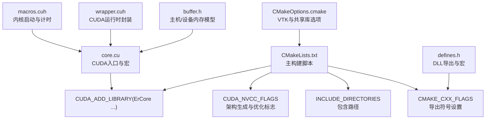
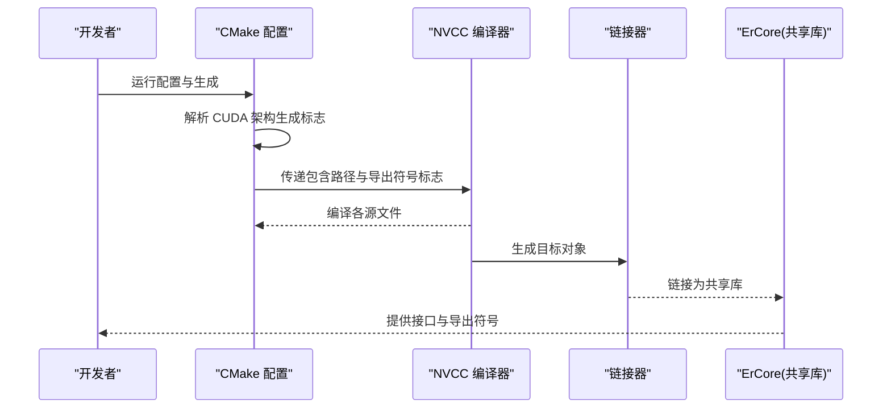
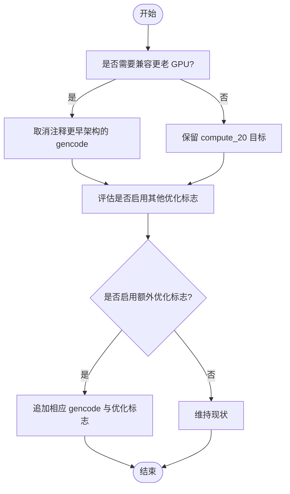
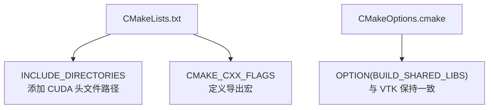
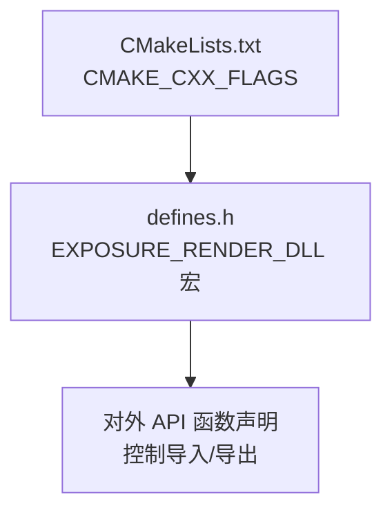
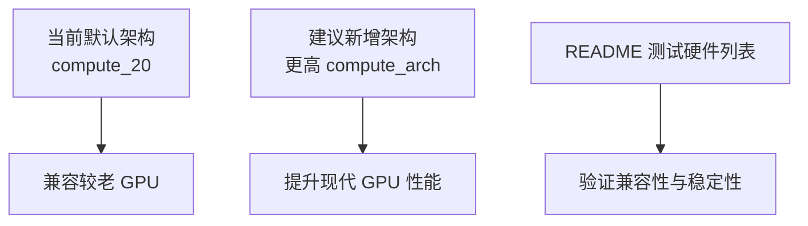
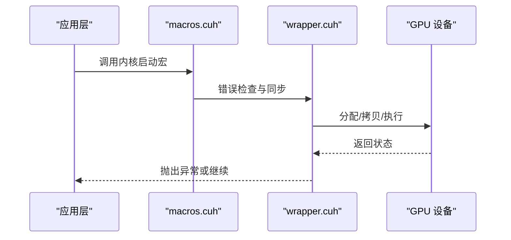
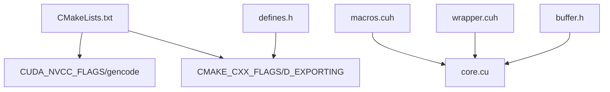

# 编译选项和标志

<cite>
**本文引用的文件**
- [CMakeLists.txt](file://Source/CMakeLists.txt)
- [CMakeOptions.cmake](file://Source/CMakeOptions.cmake)
- [README.md](file://README.md)
- [core.cu](file://Source/core.cu)
- [defines.h](file://Source/defines.h)
- [macros.cuh](file://Source/macros.cuh)
- [wrapper.cuh](file://Source/wrapper.cuh)
- [buffer.h](file://Source/buffer.h)
- [.hgignore](file://.hgignore)
</cite>

## 目录
1. [简介](#简介)
2. [项目结构](#项目结构)
3. [核心组件](#核心组件)
4. [架构总览](#架构总览)
5. [详细组件分析](#详细组件分析)
6. [依赖关系分析](#依赖关系分析)
7. [性能考虑](#性能考虑)
8. [故障排查指南](#故障排查指南)
9. [结论](#结论)
10. [附录](#附录)

## 简介
本文件系统性梳理本项目的编译选项与标志，覆盖以下方面：
- CUDA NVCC 编译标志：目标架构生成、优化相关标志的现状与建议
- CMake 编译器标志：包含路径、导出符号设置、共享库选项
- 导出符号设置：DLL 导出控制与跨平台兼容
- GPU 架构支持与优化：当前默认架构与可扩展范围
- 调试与发布差异：当前仓库未显式区分，建议与实践
- 性能优化：编译期与运行时的优化策略
- 编译时间与内存使用优化：可操作的配置建议
- 针对不同硬件配置的编译建议：基于已知测试环境与硬件要求

## 项目结构
本项目采用 CMake 构建系统，结合 CUDA Toolkit 进行 NVCC 编译。核心目录与文件如下：
- Source/CMakeLists.txt：主构建脚本，定义 CUDA 架构生成、包含路径、导出符号、源文件分组与库生成
- Source/CMakeOptions.cmake：VTK 集成与共享库选项配置
- Source/core.cu：CUDA 核心入口文件，包含宏定义与设备符号
- Source/defines.h：通用宏与 DLL 导出控制
- Source/macros.cuh：CUDA 内核启动与计时宏
- Source/wrapper.cuh：CUDA 运行时封装与错误处理
- Source/buffer.h：缓冲区抽象，体现主机/设备内存模型
- README.md：系统要求与测试硬件列表
- .hgignore：忽略构建输出目录

**图表来源**
- [CMakeLists.txt:17-155](file://Source/CMakeLists.txt#L17-L155)
- [CMakeOptions.cmake:1-65](file://Source/CMakeOptions.cmake#L1-L65)
- [core.cu:1-156](file://Source/core.cu#L1-L156)
- [defines.h:1-114](file://Source/defines.h#L1-L114)
- [macros.cuh:1-105](file://Source/macros.cuh#L1-L105)
- [wrapper.cuh:1-147](file://Source/wrapper.cuh#L1-L147)
- [buffer.h:1-124](file://Source/buffer.h#L1-L124)

**章节来源**
- [CMakeLists.txt:17-155](file://Source/CMakeLists.txt#L17-L155)
- [CMakeOptions.cmake:1-65](file://Source/CMakeOptions.cmake#L1-L65)
- [README.md:14-61](file://README.md#L14-L61)

## 核心组件
- CUDA 架构生成与优化
  - 当前默认生成 compute_20 的 sm_20 与 compute_20 双份目标，确保较老 GPU 兼容
  - 存在注释掉的更早架构（如 compute_10/11/12/13）以供回溯或兼容旧卡
  - 存在注释掉的 NVCC 优化相关标志示例，表明历史曾尝试过相关优化
- 包含路径与工具链
  - 自动查找 CUDA 并添加 SDK 与 Toolkit 头文件路径
- 导出符号设置
  - 通过 C++ 编译器标志定义导出宏，实现 DLL 导出控制
- 源文件分组与库生成
  - 将通用头文件、形状、API 绑定、CUDA 过滤器等按组组织，并生成共享库 ErCore

**章节来源**
- [CMakeLists.txt:21-46](file://Source/CMakeLists.txt#L21-L46)
- [CMakeLists.txt:50-155](file://Source/CMakeLists.txt#L50-L155)

## 架构总览
下图展示从 CMake 到 NVCC 编译、再到 CUDA 库链接的整体流程。

**图表来源**
- [CMakeLists.txt:21-46](file://Source/CMakeLists.txt#L21-L46)
- [CMakeLists.txt:154-155](file://Source/CMakeLists.txt#L154-L155)

## 详细组件分析

### CUDA NVCC 架构生成与优化标志
- 当前配置
  - 使用 gencode 生成 compute_20 对应的 sm_20 与 compute_20 目标
  - 注释掉更早架构以避免过度编译
  - 注释掉若干 NVCC 优化相关标志，表明历史曾探索但未启用
- 建议
  - 若需兼容更老 GPU，可取消对应注释；若仅面向现代 GPU，可移除旧架构以缩短编译时间
  - 如需启用特定优化（如寄存器/共享内存限制、代码大小优化等），可在保持现有架构的基础上追加相应 gencode 与优化标志

**图表来源**
- [CMakeLists.txt:23-34](file://Source/CMakeLists.txt#L23-L34)

**章节来源**
- [CMakeLists.txt:23-34](file://Source/CMakeLists.txt#L23-L34)

### CMake 编译器标志与包含路径
- 包含路径
  - 自动包含二进制目录、源码目录、CUDA SDK common/inc 与 CUDA Toolkit Include
- 导出符号设置
  - 在 C++ 编译器标志中定义导出宏，用于 DLL 导出控制
- 共享库选项
  - 通过标准 CMake 选项控制是否构建共享库，并与 VTK 设置保持一致

**图表来源**
- [CMakeLists.txt:36-46](file://Source/CMakeLists.txt#L36-L46)
- [CMakeOptions.cmake:20-26](file://Source/CMakeOptions.cmake#L20-L26)

**章节来源**
- [CMakeLists.txt:36-46](file://Source/CMakeLists.txt#L36-L46)
- [CMakeOptions.cmake:20-26](file://Source/CMakeOptions.cmake#L20-L26)

### 导出符号设置与 DLL 控制
- 宏定义
  - 在非 CUDA 架构下，根据导出宏决定函数是导入还是导出
- 实际应用
  - 通过 CMake 将导出宏传入编译器，确保在构建共享库时正确导出符号

**图表来源**
- [CMakeLists.txt:44-46](file://Source/CMakeLists.txt#L44-L46)
- [defines.h:31-35](file://Source/defines.h#L31-L35)

**章节来源**
- [CMakeLists.txt:44-46](file://Source/CMakeLists.txt#L44-L46)
- [defines.h:31-35](file://Source/defines.h#L31-L35)

### GPU 架构支持与优化选项
- 已支持架构
  - 默认生成 compute_20（sm_20 与 compute_20）
- 测试与兼容性
  - README 列举了多款 NVIDIA 硬件的测试配置，表明项目在多种 GPU 上进行过验证
- 优化建议
  - 针对现代 GPU，可增加更高 compute_arch 的 gencode 以获得更好的指令集与寄存器利用率
  - 结合实际数据规模与内存容量，选择合适的块维度与网格维度，减少无效线程与分支

**图表来源**
- [CMakeLists.txt:32-33](file://Source/CMakeLists.txt#L32-L33)
- [README.md:44-60](file://README.md#L44-L60)

**章节来源**
- [CMakeLists.txt:32-33](file://Source/CMakeLists.txt#L32-L33)
- [README.md:44-60](file://README.md#L44-L60)

### 调试与发布版本差异
- 现状
  - 仓库未显式区分 Debug 与 Release 的编译标志
- 建议
  - Debug：启用符号、禁用或降低优化、开启断言与调试日志
  - Release：启用优化、关闭调试信息、最小化运行时检查
  - 可通过 CMake 的构建类型与相应编译器标志实现

**章节来源**
- [CMakeLists.txt:17-155](file://Source/CMakeLists.txt#L17-L155)

### 性能优化相关的编译标志与最佳实践
- NVCC 优化相关标志
  - 可参考注释中的示例，结合具体 GPU 架构与工作负载进行试验
- CUDA 内核启动与计时
  - 提供统一的内核启动与计时宏，便于定位热点与评估优化效果
- 设备内存管理
  - 通过封装的分配、拷贝与同步接口，减少错误并提高一致性

**图表来源**
- [macros.cuh:41-73](file://Source/macros.cuh#L41-L73)
- [wrapper.cuh:38-147](file://Source/wrapper.cuh#L38-L147)

**章节来源**
- [macros.cuh:41-73](file://Source/macros.cuh#L41-L73)
- [wrapper.cuh:38-147](file://Source/wrapper.cuh#L38-L147)

### 编译时间优化与内存使用优化
- 编译时间优化
  - 移除不必要的 gencode 目标，仅保留目标 GPU 所需的架构
  - 合理拆分源文件，避免单个编译单元过大
  - 使用并行编译（CMake 的并行构建参数）
- 内存使用优化
  - 在 CUDA 内核中合理使用共享内存与寄存器
  - 通过合适的块/网格维度减少无效线程
  - 使用 CUDA 运行时封装进行显存管理，避免泄漏与碎片

**章节来源**
- [CMakeLists.txt:23-34](file://Source/CMakeLists.txt#L23-L34)
- [macros.cuh:27-101](file://Source/macros.cuh#L27-L101)
- [wrapper.cuh:53-147](file://Source/wrapper.cuh#L53-L147)

### 针对不同硬件配置的编译选项建议
- 较老 GPU（如 compute_10/11/12/13）
  - 保留对应 gencode，必要时启用较低优化级别
- 中低端 GPU（如 compute_20/21/30/35）
  - 保留 compute_20，按需增加更高架构；适度降低寄存器压力
- 中高端 GPU（如 compute_50/60/70/80）
  - 增加更高架构的 gencode；启用更激进的优化标志
- 内存受限设备
  - 优先使用共享内存优化；减小块尺寸；谨慎使用纹理缓存

**章节来源**
- [CMakeLists.txt:23-34](file://Source/CMakeLists.txt#L23-L34)
- [README.md:17-22](file://README.md#L17-L22)

## 依赖关系分析
- CMake 与 NVCC
  - CMakeLists.txt 中的 CUDA_NVCC_FLAGS 与 gencode 直接影响 NVCC 的目标生成
- 宏与封装
  - macros.cuh 与 wrapper.cuh 为 CUDA 内核与运行时提供统一接口，降低耦合
- 导出符号
  - defines.h 与 CMake 的 CMAKE_CXX_FLAGS 协同，确保 DLL 正确导出符号

**图表来源**
- [CMakeLists.txt:21-46](file://Source/CMakeLists.txt#L21-L46)
- [defines.h:31-35](file://Source/defines.h#L31-L35)
- [macros.cuh:27-101](file://Source/macros.cuh#L27-L101)
- [wrapper.cuh:38-147](file://Source/wrapper.cuh#L38-L147)
- [buffer.h:27-121](file://Source/buffer.h#L27-L121)

**章节来源**
- [CMakeLists.txt:21-46](file://Source/CMakeLists.txt#L21-L46)
- [defines.h:31-35](file://Source/defines.h#L31-L35)
- [macros.cuh:27-101](file://Source/macros.cuh#L27-L101)
- [wrapper.cuh:38-147](file://Source/wrapper.cuh#L38-L147)
- [buffer.h:27-121](file://Source/buffer.h#L27-L121)

## 性能考虑
- 架构选择
  - 为目标 GPU 选择最匹配的 compute_arch，避免过度泛化导致的性能损失
- 内核设计
  - 使用统一的内核启动与计时宏，便于基准测试与热点定位
- 内存带宽
  - 合理利用共享内存与常量内存；减少全局内存访问次数
- 同步与并发
  - 通过封装的同步接口减少错误；避免不必要的线程同步

[本节为通用指导，无需列出章节来源]

## 故障排查指南
- 构建失败（未找到 CUDA）
  - 确认 CUDA Toolkit 已安装且环境变量正确
  - 检查 CMake 是否能定位到 CUDA SDK 与 Toolkit Include
- 符号导出问题
  - 确保在构建共享库时定义了导出宏
  - 检查链接阶段是否正确解析导出符号
- CUDA 运行时错误
  - 使用封装的错误处理接口快速定位问题
  - 关注内核启动后的错误检查与同步调用

**章节来源**
- [CMakeLists.txt:21-46](file://Source/CMakeLists.txt#L21-L46)
- [defines.h:31-35](file://Source/defines.h#L31-L35)
- [wrapper.cuh:38-147](file://Source/wrapper.cuh#L38-L147)

## 结论
本项目在 CMake 与 NVCC 层面提供了基础而清晰的编译配置，重点在于：
- 明确的 CUDA 架构生成策略与包含路径
- 清晰的导出符号控制
- 通过宏与封装简化 CUDA 开发与调试

建议在现有基础上：
- 明确 Debug/Release 的差异化配置
- 针对目标硬件扩展 gencode 范围
- 引入更多性能优化标志与内核计时手段
- 结合 README 的测试硬件列表，制定硬件适配清单

[本节为总结，无需列出章节来源]

## 附录
- 构建输出忽略
  - .hgignore 中忽略 Build/**，避免将构建产物纳入版本控制

**章节来源**
- [.hgignore:1-2](file://.hgignore#L1-L2)