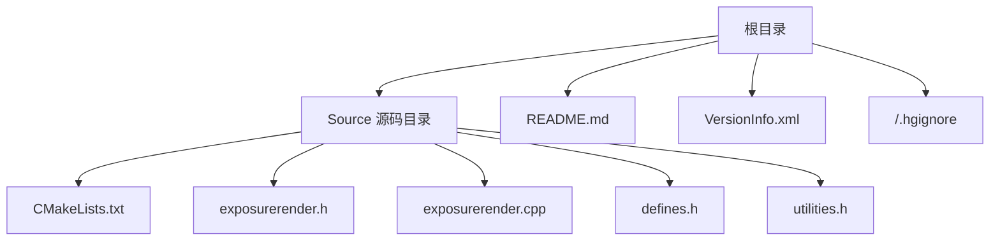
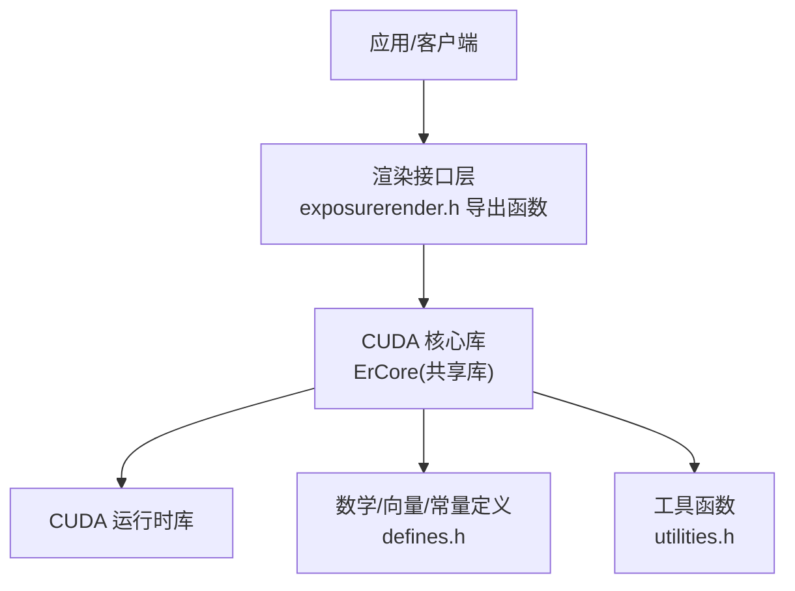
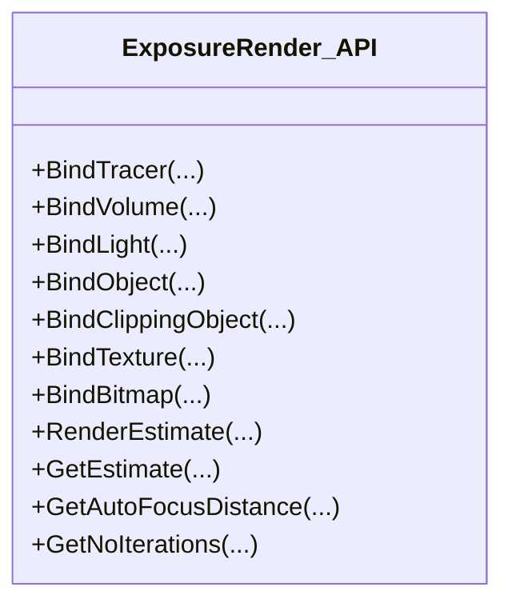
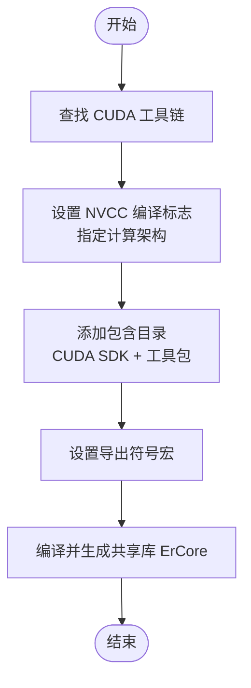
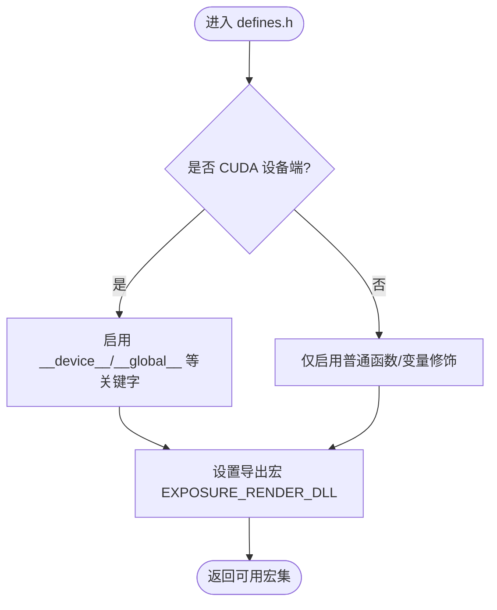
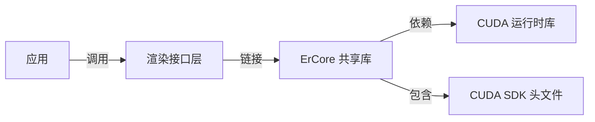
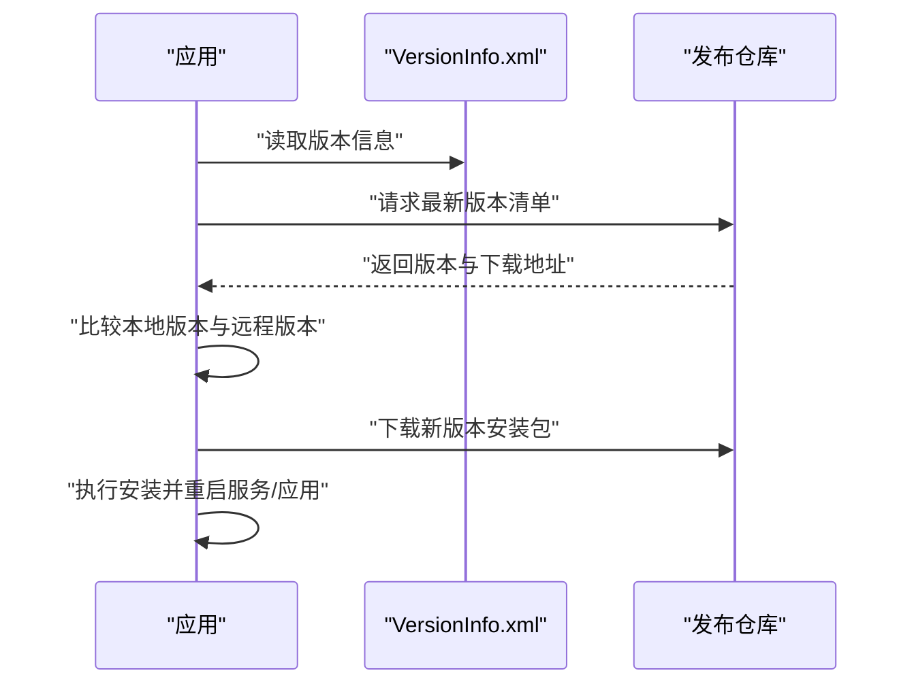

# 部署指南

<cite>
**本文引用的文件**
- [README.md](file://README.md)
- [VersionInfo.xml](file://VersionInfo.xml)
- [CMakeLists.txt](file://Source/CMakeLists.txt)
- [exposurerender.h](file://Source/exposurerender.h)
- [exposurerender.cpp](file://Source/exposurerender.cpp)
- [defines.h](file://Source/defines.h)
- [utilities.h](file://Source/utilities.h)
- [.hgignore](file://.hgignore)
</cite>

## 目录
1. [简介](#简介)
2. [项目结构](#项目结构)
3. [核心组件](#核心组件)
4. [架构总览](#架构总览)
5. [详细组件分析](#详细组件分析)
6. [依赖关系分析](#依赖关系分析)
7. [性能与资源考量](#性能与资源考量)
8. [部署流程与平台差异](#部署流程与平台差异)
9. [版本管理与更新机制](#版本管理与更新机制)
10. [打包与分发最佳实践](#打包与分发最佳实践)
11. [安全与合规](#安全与合规)
12. [故障排除与回滚策略](#故障排除与回滚策略)
13. [结论](#结论)

## 简介
本指南面向运维与开发团队，提供 Exposure Render 在 Windows 平台上的部署与发布流程说明。内容涵盖运行时依赖、环境准备、库文件分发、版本管理与更新、打包分发、安全与性能优化、以及故障排除与回滚策略。由于仓库中未包含安装程序或打包脚本，本指南在“打包与分发”部分给出可操作的最佳实践建议。

## 项目结构
- 根目录包含构建与发布相关的关键文件：README.md（系统要求、构建说明）、VersionInfo.xml（版本信息）、.hgignore（忽略构建产物）。
- Source 目录为渲染引擎源码，采用 CMake + CUDA 构建，生成共享库（DLL/So），对外暴露一组 C 接口函数用于绑定渲染器、体积数据、光源、对象、纹理等，并提供渲染估计与图像获取接口。

图示来源
- [CMakeLists.txt:1-155](file://Source/CMakeLists.txt#L1-L155)
- [exposurerender.h:1-45](file://Source/exposurerender.h#L1-L45)
- [exposurerender.cpp:1-24](file://Source/exposurerender.cpp#L1-L24)
- [defines.h:1-114](file://Source/defines.h#L1-L114)
- [utilities.h:1-70](file://Source/utilities.h#L1-L70)
- [README.md:1-61](file://README.md#L1-L61)
- [VersionInfo.xml:1-10](file://VersionInfo.xml#L1-L10)
- [.hgignore:1-2](file://.hgignore#L1-L2)

章节来源
- [README.md:14-23](file://README.md#L14-L23)
- [CMakeLists.txt:17-155](file://Source/CMakeLists.txt#L17-L155)

## 核心组件
- 渲染接口层：通过头文件声明一组导出函数，用于绑定渲染器、体积数据、光源、对象、裁剪对象、纹理与位图；并提供渲染估计、获取估计结果、自动对焦距离与迭代次数查询等能力。
- CUDA 核心库：CMake 将通用头文件、形状、绑定 API、CUDA 内核等编译为共享库，供上层应用调用。
- 运行时宏与平台导出：通过条件编译宏在 CUDA 设备端与主机端切换符号修饰与内核标记，确保跨平台兼容性。

章节来源
- [exposurerender.h:29-44](file://Source/exposurerender.h#L29-L44)
- [CMakeLists.txt:47-155](file://Source/CMakeLists.txt#L47-L155)
- [defines.h:31-56](file://Source/defines.h#L31-L56)

## 架构总览
下图展示从应用到渲染核心的调用链与依赖关系：

图示来源
- [exposurerender.h:29-44](file://Source/exposurerender.h#L29-L44)
- [CMakeLists.txt:155](file://Source/CMakeLists.txt#L155)
- [utilities.h:21](file://Source/utilities.h#L21)
- [defines.h:31-56](file://Source/defines.h#L31-L56)

## 详细组件分析

### 组件一：渲染接口与绑定 API
- 职责：为外部应用提供统一的绑定与渲染入口，支持绑定渲染器、体积、光源、对象、裁剪对象、纹理与位图；并提供渲染估计与图像读取接口。
- 关键点：使用导出宏在 Windows 上实现 DLL 导入/导出符号切换；接口命名清晰，便于上层封装。

图示来源
- [exposurerender.h:32-42](file://Source/exposurerender.h#L32-L42)

章节来源
- [exposurerender.h:29-44](file://Source/exposurerender.h#L29-L44)

### 组件二：CUDA 核心库与构建配置
- 职责：将通用几何、形状、绑定 API、CUDA 内核等源文件编译为共享库，供应用侧调用。
- 关键点：CMake 使用 CUDA 支持，指定若干计算架构的编译参数；导出符号由编译选项控制；包含 CUDA SDK 头文件路径。

图示来源
- [CMakeLists.txt:21-46](file://Source/CMakeLists.txt#L21-L46)
- [CMakeLists.txt:155](file://Source/CMakeLists.txt#L155)

章节来源
- [CMakeLists.txt:17-155](file://Source/CMakeLists.txt#L17-L155)

### 组件三：运行时宏与平台导出
- 职责：根据是否处于 CUDA 设备端，动态选择内核、主机、设备端关键字与导出宏，保证在主机与设备端的正确编译。
- 关键点：在 Windows 上通过导出宏实现 DLL 的导入/导出；在 CUDA 环境下启用设备端关键字。

图示来源
- [defines.h:31-56](file://Source/defines.h#L31-L56)

章节来源
- [defines.h:31-56](file://Source/defines.h#L31-L56)

## 依赖关系分析
- 运行时依赖
  - CUDA 运行时库：源码显式包含 CUDA 运行时头文件，表明运行时需要 CUDA 驱动与运行时库。
  - Windows 平台导出：通过导出宏实现 DLL 的导入/导出，需确保目标系统具备相应运行时。
- 构建依赖
  - CMake + CUDA Toolkit：CMakeLists 中查找 CUDA 并设置 NVCC 参数。
  - 可选：CUDA SDK 头文件路径被包含，用于编译期使用。

图示来源
- [utilities.h:21](file://Source/utilities.h#L21)
- [CMakeLists.txt:40-42](file://Source/CMakeLists.txt#L40-L42)

章节来源
- [utilities.h:21](file://Source/utilities.h#L21)
- [CMakeLists.txt:36-42](file://Source/CMakeLists.txt#L36-L42)

## 性能与资源考量
- 显存与计算能力
  - 系统要求包含最低显存与计算能力限制，部署前应确认目标 GPU 符合要求。
- 数据集规模
  - README 提示大规模数据集可能存在问题，建议在部署前进行容量评估与压力测试。
- CUDA 架构编译
  - CMake 中设置了特定计算架构的编译标志，建议在目标硬件上进行基准测试以确定最优编译参数。

章节来源
- [README.md:17-22](file://README.md#L17-L22)
- [CMakeLists.txt:32-34](file://Source/CMakeLists.txt#L32-L34)

## 部署流程与平台差异
- 平台范围
  - 官方说明适用于 Windows（XP/Vista/7），当前仓库未包含其他平台的构建脚本或配置。
- 系统要求与驱动
  - 需要满足最低显存与计算能力要求；建议在目标机器上验证驱动版本与 CUDA 运行时兼容性。
- 构建与运行时分离
  - 源码通过 CMake + CUDA 构建共享库；运行时只需该共享库与 CUDA 运行时，无需完整开发工具链。

章节来源
- [README.md:17-22](file://README.md#L17-L22)
- [README.md:14](file://README.md#L14)
- [CMakeLists.txt:17-21](file://Source/CMakeLists.txt#L17-L21)

## 版本管理与更新机制
- 版本信息文件
  - VersionInfo.xml 包含版本号、名称、下载地址等元数据，可用于版本识别与更新提示。
- 更新策略
  - 建议在发布新版本时同步更新该 XML 文件中的版本标识与下载链接。
- 版本控制
  - .hgignore 显示构建产物被忽略，建议通过版本标签或分支管理发布版本。

图示来源
- [VersionInfo.xml:1-10](file://VersionInfo.xml#L1-L10)

章节来源
- [VersionInfo.xml:1-10](file://VersionInfo.xml#L1-L10)
- [.hgignore:1-2](file://.hgignore#L1-L2)

## 打包与分发最佳实践
- 安装程序制作
  - 建议使用标准安装程序工具（如 NSIS、Inno Setup 或现代打包工具）制作安装包，包含：
    - CUDA 运行时库（按目标架构选择 x64/x86）
    - 应用所需 DLL（共享库 ErCore）
    - 必要的配置文件与图标资源
- 依赖项捆绑
  - 将 CUDA 运行时与应用 DLL 打包进安装包，避免运行时缺失导致失败。
- 自动化与一致性
  - 使用 CI/CD 流水线自动化构建与打包，确保每次发布的一致性与可追溯性。
- 发布渠道
  - 在发布页面提供校验和与签名，便于用户验证完整性与来源可信度。

[本节为通用实践建议，不直接分析具体文件，故无章节来源]

## 安全与合规
- 依赖库安全
  - 对 CUDA 运行时与第三方库进行来源验证与漏洞扫描，优先使用官方渠道提供的稳定版本。
- 配置与日志
  - 日志输出默认为空实现，建议在生产环境中谨慎开启调试日志，避免敏感信息泄露。
- 访问控制
  - 对安装目录与配置文件设置最小权限访问，防止非授权修改。

章节来源
- [log.h:27-39](file://Source/log.h#L27-L39)

## 故障排除与回滚策略
- 常见问题定位
  - CUDA 运行时缺失：检查系统是否安装匹配的 CUDA 驱动与运行时库。
  - 架构不匹配：确认编译的计算架构与目标 GPU 兼容。
  - 权限不足：确保安装目录具有写入权限，以便写入日志或临时文件。
- 回滚策略
  - 保留上一个稳定版本的安装包与 DLL，遇到问题时快速回退至前一版本。
  - 在升级前备份配置文件与用户数据，升级后验证功能正常再删除旧版本。
- 版本对比
  - 使用 VersionInfo.xml 中的版本信息与下载地址进行版本比对，确保升级路径正确。

章节来源
- [README.md:17-22](file://README.md#L17-L22)
- [VersionInfo.xml:1-10](file://VersionInfo.xml#L1-L10)

## 结论
本指南基于仓库现有文件梳理了 Exposure Render 的部署要点：明确运行时依赖（CUDA 运行时）、构建产物（共享库）、版本信息（VersionInfo.xml）与平台要求（Windows）。对于安装程序制作、打包分发、安全加固与回滚策略，给出了可操作的最佳实践建议。建议在生产环境中结合自动化流水线与严格的版本管理，确保部署的稳定性与可维护性。