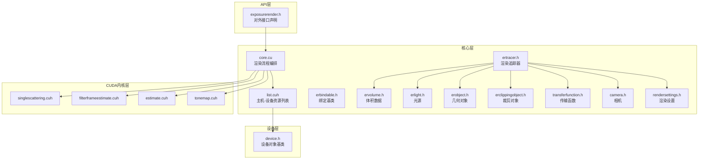
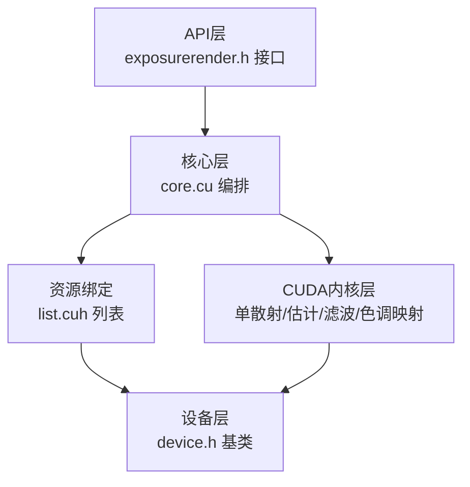
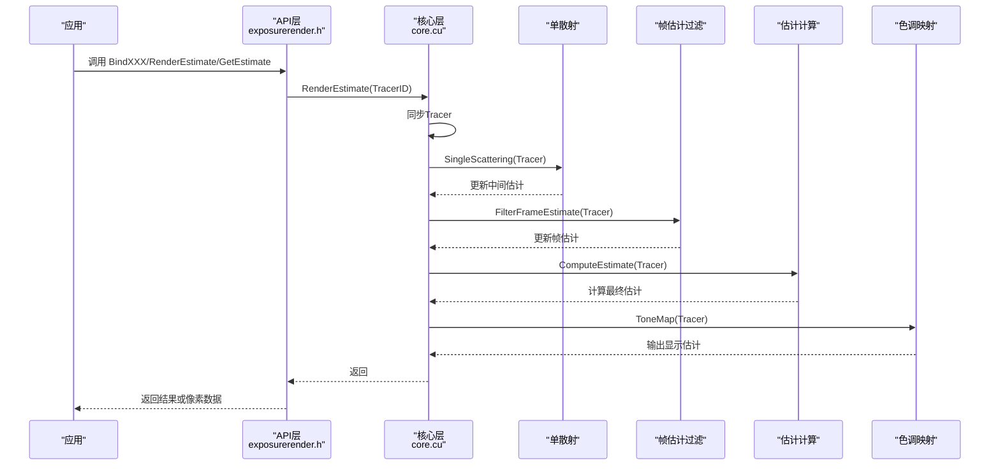
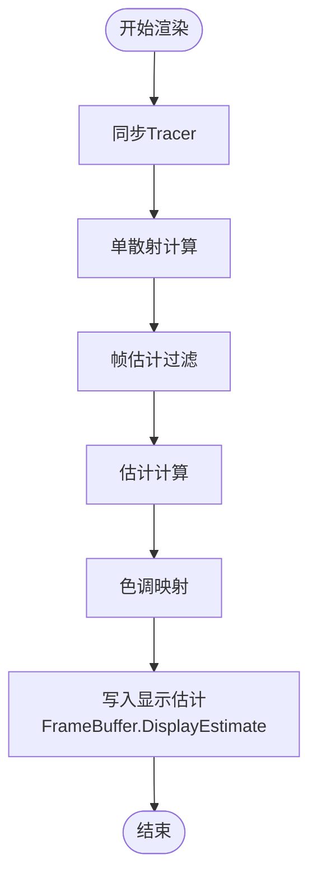
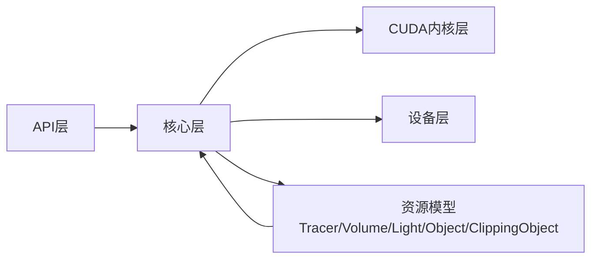

# 分层架构说明

<cite>
**本文档引用的文件**
- [exposurerender.h](file://Source/exposurerender.h)
- [exposurerender.cpp](file://Source/exposurerender.cpp)
- [core.cu](file://Source/core.cu)
- [device.h](file://Source/device.h)
- [ertracer.h](file://Source/ertracer.h)
- [ervolume.h](file://Source/ervolume.h)
- [erlight.h](file://Source/erlight.h)
- [erobject.h](file://Source/erobject.h)
- [erclippingobject.h](file://Source/erclippingobject.h)
- [erbindable.h](file://Source/erbindable.h)
- [transferfunction.h](file://Source/transferfunction.h)
- [camera.h](file://Source/camera.h)
- [rendersettings.h](file://Source/rendersettings.h)
- [list.cuh](file://Source/list.cuh)
- [README.md](file://README.md)
</cite>

## 目录
1. [简介](#简介)
2. [项目结构](#项目结构)
3. [核心组件](#核心组件)
4. [架构总览](#架构总览)
5. [详细组件分析](#详细组件分析)
6. [依赖关系分析](#依赖关系分析)
7. [性能考量](#性能考量)
8. [故障排查指南](#故障排查指南)
9. [结论](#结论)
10. [附录](#附录)

## 简介
本文件面向曝光渲染框架（Exposure Render）的分层架构，系统性阐述其四层设计：API层、核心层、CUDA内核层与设备层。文档解释每层职责、接口定义、层间通信机制，以及数据在各层之间的传递与转换流程；并通过可视化图表展示依赖关系与数据流，帮助读者理解该框架如何通过分层实现关注点分离、提升可维护性与支持模块化开发，并给出性能优化建议。

## 项目结构
- 源码位于 Source 目录，采用“按功能域组织”的方式，包含渲染器主体、几何与材质、纹理与位图、传输函数、相机与渲染设置等模块。
- 渲染管线由 C++ API 层调用 CUDA 内核层执行，设备层负责 GPU 资源管理与同步。
- 关键入口与对外接口集中在 API 层头文件中，核心渲染流程在 CUDA 源文件中实现。



图表来源
- [exposurerender.h:32-42](file://Source/exposurerender.h#L32-L42)
- [core.cu:40-51](file://Source/core.cu#L40-L51)
- [list.cuh:27-42](file://Source/list.cuh#L27-L42)
- [ertracer.h:33-117](file://Source/ertracer.h#L33-L117)
- [ervolume.h:28-74](file://Source/ervolume.h#L28-L74)
- [erlight.h:27-66](file://Source/erlight.h#L27-L66)
- [erobject.h:27-67](file://Source/erobject.h#L27-L67)
- [erclippingobject.h:27-58](file://Source/erclippingobject.h#L27-L58)
- [transferfunction.h:82-154](file://Source/transferfunction.h#L82-L154)
- [camera.h:26-116](file://Source/camera.h#L26-L116)
- [rendersettings.h:27-131](file://Source/rendersettings.h#L27-L131)

章节来源
- [README.md:14-22](file://README.md#L14-L22)
- [exposurerender.h:32-42](file://Source/exposurerender.h#L32-L42)
- [core.cu:40-51](file://Source/core.cu#L40-L51)

## 核心组件
- API层接口：提供绑定/解绑渲染元素、触发渲染估计、获取估计结果与迭代次数等对外函数，作为上层应用与渲染引擎交互的唯一入口。
- 核心层实体：以 ErTracer 为中心，聚合体积、光源、对象、裁剪对象、传输函数、相机与渲染设置；通过 ErBindable 提供统一的绑定生命周期管理。
- CUDA内核层：封装单散射、帧估计过滤、估计计算与色调映射等渲染阶段，形成可复用的内核模块。
- 设备层：抽象设备对象基类，配合主机侧资源列表完成设备符号绑定与内存拷贝。

章节来源
- [exposurerender.h:32-42](file://Source/exposurerender.h#L32-L42)
- [ertracer.h:33-117](file://Source/ertracer.h#L33-L117)
- [ervolume.h:28-74](file://Source/ervolume.h#L28-L74)
- [erlight.h:27-66](file://Source/erlight.h#L27-L66)
- [erobject.h:27-67](file://Source/erobject.h#L27-L67)
- [erclippingobject.h:27-58](file://Source/erclippingobject.h#L27-L58)
- [transferfunction.h:82-154](file://Source/transferfunction.h#L82-L154)
- [camera.h:26-116](file://Source/camera.h#L26-L116)
- [rendersettings.h:27-131](file://Source/rendersettings.h#L27-L131)
- [list.cuh:27-42](file://Source/list.cuh#L27-L42)
- [device.h:28-43](file://Source/device.h#L28-L43)

## 架构总览
分层架构通过清晰的职责边界实现关注点分离：
- API层：暴露稳定接口，屏蔽底层实现细节，便于上层集成与测试。
- 核心层：承载渲染领域模型与业务逻辑，协调资源绑定与参数传递。
- CUDA内核层：专注高性能数值计算与图像处理，保持纯内核函数的可移植性。
- 设备层：统一封装设备端资源生命周期与同步机制，降低跨主机/设备的耦合度。



图表来源
- [exposurerender.h:32-42](file://Source/exposurerender.h#L32-L42)
- [core.cu:56-136](file://Source/core.cu#L56-L136)
- [list.cuh:108-148](file://Source/list.cuh#L108-L148)
- [device.h:28-43](file://Source/device.h#L28-L43)

## 详细组件分析

### API层：对外接口与控制流
- 绑定接口：将 ErTracer、ErVolume、ErLight、ErObject、ErClippingObject、ErTexture、ErBitmap 等资源注册到核心层。
- 渲染控制：触发渲染估计、获取估计结果、查询自动对焦距离与迭代次数。
- 控制流序列：API层调用核心层函数，核心层依次执行单散射、帧估计过滤、估计计算与色调映射，并更新迭代计数。



图表来源
- [exposurerender.h:32-42](file://Source/exposurerender.h#L32-L42)
- [core.cu:126-143](file://Source/core.cu#L126-L143)

章节来源
- [exposurerender.h:32-42](file://Source/exposurerender.h#L32-L42)
- [exposurerender.cpp:21](file://Source/exposurerender.cpp#L21)

### 核心层：资源绑定与渲染编排
- 资源绑定：通过模板类 List 将主机侧资源映射到设备端数组，并维护 ID 到索引的映射表，支持全量同步与增量同步。
- 渲染编排：根据 Tracer 的相机、传输函数、渲染设置与绑定的体积/光源/对象/裁剪对象，依次执行渲染阶段。
- 数据结构：Tracer 聚合传输函数、相机与渲染设置，同时持有绑定资源的 ID 列表，用于后续查找与访问。

```mermaid
classDiagram
class ErBindable {
+int ID
+bool Enabled
+bool Dirty
+BindHost()
+UnbindHost()
}
class ErTracer {
+ScalarTransferFunction1D Opacity1D
+ColorTransferFunction1D Diffuse1D
+ColorTransferFunction1D Specular1D
+ScalarTransferFunction1D Glossiness1D
+ColorTransferFunction1D Emission1D
+Camera Camera
+RenderSettings RenderSettings
+int NoIterations
+int VolumeID
+Indices LightIDs
+Indices ObjectIDs
+Indices ClippingObjectIDs
}
class ErVolume {
+Buffer3D Voxels
+bool NormalizeSize
+Vec3f Spacing
+BindVoxels(...)
}
class ErLight {
+bool Visible
+Shape Shape
+int TextureID
+float Multiplier
+Enums : : EmissionUnit Unit
}
class ErObject {
+Shape Shape
+int DiffuseTextureID
+int SpecularTextureID
+int GlossinessTextureID
+float Ior
}
class ErClippingObject {
+Shape Shape
+bool Invert
}
class D,H,MaxSize[] {
+Bind(H)
+Unbind(H)
+Synchronize(ID)
+operator[](i) D&
-Map map<int,D*>
-HashMap map<int,int>
-DeviceList D*
-Counter int
-DeviceSymbol char[MAX]
}
ErTracer --> ErVolume : "使用"
ErTracer --> ErLight : "使用"
ErTracer --> ErObject : "使用"
ErTracer --> ErClippingObject : "使用"
ErTracer --> TransferFunction : "使用"
ErTracer --> Camera : "使用"
ErTracer --> RenderSettings : "使用"
List --> ErBindable : "管理"
```

图表来源
- [erbindable.h:28-68](file://Source/erbindable.h#L28-L68)
- [ertracer.h:33-117](file://Source/ertracer.h#L33-L117)
- [ervolume.h:28-74](file://Source/ervolume.h#L28-L74)
- [erlight.h:27-66](file://Source/erlight.h#L27-L66)
- [erobject.h:27-67](file://Source/erobject.h#L27-L67)
- [erclippingobject.h:27-58](file://Source/erclippingobject.h#L27-L58)
- [list.cuh:27-42](file://Source/list.cuh#L27-L42)

章节来源
- [core.cu:40-51](file://Source/core.cu#L40-L51)
- [core.cu:56-136](file://Source/core.cu#L56-L136)
- [list.cuh:59-106](file://Source/list.cuh#L59-L106)

### CUDA内核层：渲染阶段与数据流
- 单散射：基于体积密度与光照计算一次散射贡献。
- 帧估计过滤：对当前帧估计进行空间/时间滤波，减少噪声。
- 估计计算：累积采样估计，更新全局估计。
- 色调映射：将 HDR 估计转换为显示范围内的 RGB 帧缓冲。
- 数据流：Tracer 持有 FrameBuffer，渲染阶段逐步更新显示估计，最终通过主机侧接口读取像素数据。



图表来源
- [core.cu:126-143](file://Source/core.cu#L126-L143)

章节来源
- [core.cu:126-143](file://Source/core.cu#L126-L143)

### 设备层：资源管理与同步
- 设备对象基类：提供统一的主机/设备生命周期管理接口。
- 资源列表：List 模板负责主机侧资源到设备端数组的分配、拷贝与符号绑定，确保内核可直接访问。
- 同步机制：通过主机侧 HashMap 将 ID 映射到设备端索引，避免内核中重复查找开销。

章节来源
- [device.h:28-43](file://Source/device.h#L28-L43)
- [list.cuh:108-148](file://Source/list.cuh#L108-L148)

## 依赖关系分析
- API层依赖核心层提供的渲染流程与资源绑定接口。
- 核心层依赖 CUDA内核层的具体渲染阶段实现。
- 核心层通过设备层完成主机与设备之间的数据传输与符号绑定。
- 资源模型（Tracer/Volume/Light/Object/ClippingObject/Texture/Bitmap）在核心层被统一管理，API层仅通过 ID 进行间接访问。



图表来源
- [exposurerender.h:32-42](file://Source/exposurerender.h#L32-L42)
- [core.cu:40-51](file://Source/core.cu#L40-L51)
- [list.cuh:27-42](file://Source/list.cuh#L27-L42)

章节来源
- [exposurerender.h:32-42](file://Source/exposurerender.h#L32-L42)
- [core.cu:40-51](file://Source/core.cu#L40-L51)
- [list.cuh:27-42](file://Source/list.cuh#L27-L42)

## 性能考量
- 资源绑定与同步
  - 使用 HashMap 将 ID 映射到设备端索引，避免内核中查找开销。
  - 支持全量同步与按需同步，减少不必要的内存拷贝。
- 渲染阶段划分
  - 将单散射、滤波、估计与色调映射拆分为独立内核，便于并行与流水线化。
- 数据布局
  - Tracer 持有 FrameBuffer，渲染结果直接写入显示估计，减少中间拷贝。
- 步长与阴影
  - 渲染设置中的步长因子与阴影参数影响收敛速度与质量，应结合数据规模与目标帧率进行权衡。

章节来源
- [list.cuh:108-148](file://Source/list.cuh#L108-L148)
- [core.cu:126-143](file://Source/core.cu#L126-L143)
- [rendersettings.h:30-64](file://Source/rendersettings.h#L30-L64)

## 故障排查指南
- 绑定失败
  - 若绑定后未生效或出现“资源不存在”异常，检查资源 ID 是否正确，确认已先 Bind 再 Synchronize。
- 同步问题
  - 当设备符号未更新时，确认是否调用了 Synchronize 或按 ID 执行了增量同步。
- 渲染无输出
  - 检查 Tracer 的相机、传输函数与渲染设置是否配置正确，确认 Volume 已绑定且密度非空。
- 性能退化
  - 若迭代次数增加但图像质量提升有限，适当调整步长因子与阴影最大距离，或启用更高效的滤波策略。

章节来源
- [list.cuh:108-148](file://Source/list.cuh#L108-L148)
- [core.cu:126-143](file://Source/core.cu#L126-L143)
- [ertracer.h:33-117](file://Source/ertracer.h#L33-L117)

## 结论
该曝光渲染框架通过四层架构实现了清晰的关注点分离：API层提供稳定接口，核心层承载领域模型与编排逻辑，CUDA内核层专注于高性能计算，设备层统一资源管理。这种设计既提升了可维护性与可扩展性，又为模块化开发提供了良好基础。结合合理的资源绑定策略与渲染参数调优，可在保证质量的同时获得稳定的性能表现。

## 附录
- 系统要求与构建信息可参考项目自述文件中的说明。

章节来源
- [README.md:14-22](file://README.md#L14-L22)