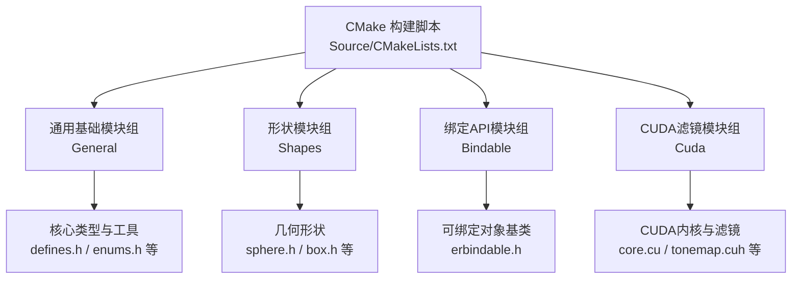
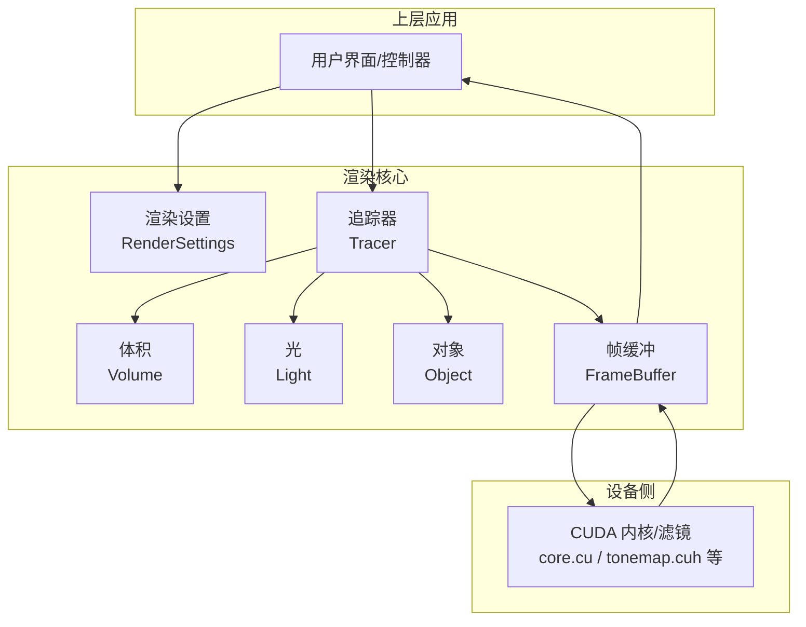
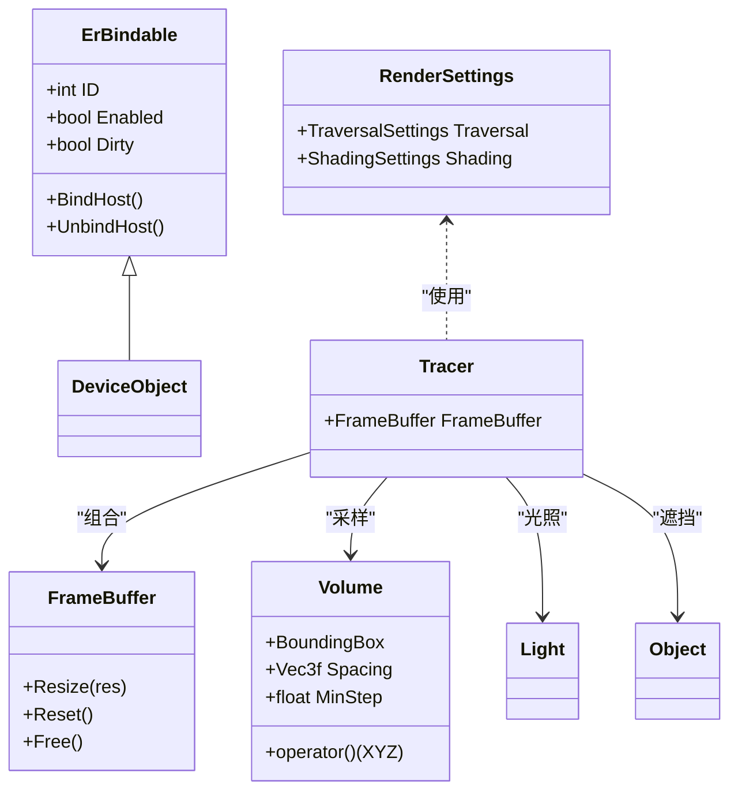
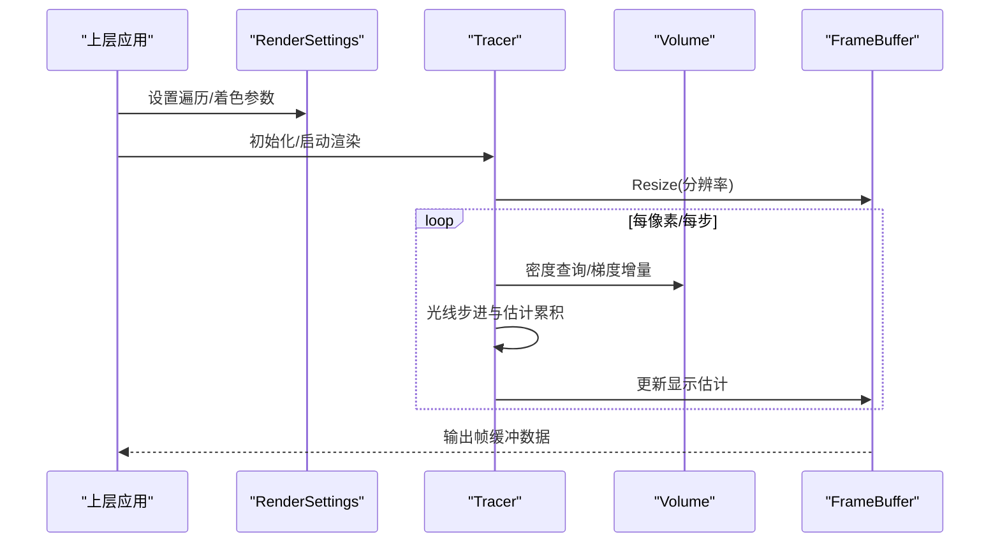
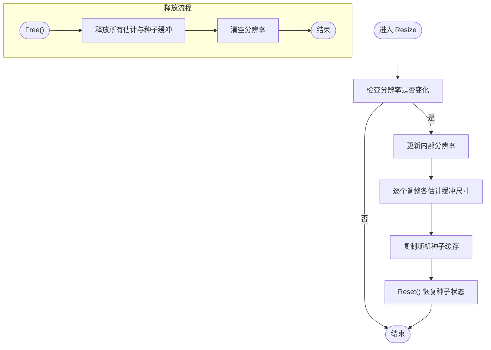
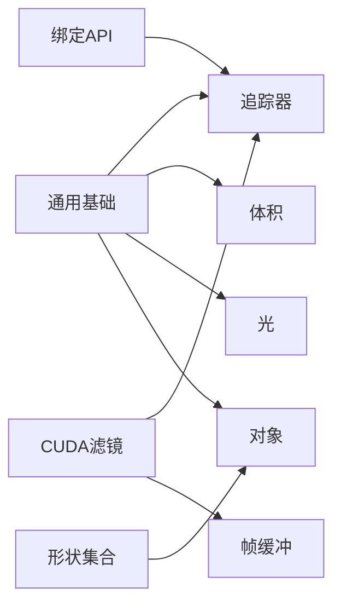

# 整体架构概览

<cite>
**本文引用的文件**
- [README.md](file://README.md)
- [CMakeLists.txt](file://Source/CMakeLists.txt)
- [defines.h](file://Source/defines.h)
- [enums.h](file://Source/enums.h)
- [rendersettings.h](file://Source/rendersettings.h)
- [device.h](file://Source/device.h)
- [framebuffer.h](file://Source/framebuffer.h)
- [tracer.h](file://Source/tracer.h)
- [volume.h](file://Source/volume.h)
- [light.h](file://Source/light.h)
- [object.h](file://Source/object.h)
- [erbindable.h](file://Source/erbindable.h)
</cite>

## 目录
1. [引言](#引言)
2. [项目结构](#项目结构)
3. [核心组件](#核心组件)
4. [架构总览](#架构总览)
5. [详细组件分析](#详细组件分析)
6. [依赖分析](#依赖分析)
7. [性能考量](#性能考量)
8. [故障排查指南](#故障排查指南)
9. [结论](#结论)
10. [附录](#附录)

## 引言
本文件为曝光渲染框架的整体架构概览文档，面向需要理解系统高层设计与实现思路的读者。文档聚焦以下目标：
- 描述系统的高层设计视图：主要组件职责、模块间依赖与数据流。
- 解释架构决策背景：为何采用CUDA并行、基于体积光传输的渲染管线等。
- 定义系统边界与外部接口：与上层应用（如Qt/VTK）及底层硬件（GPU/CUDA）的交互。
- 展示从用户输入到渲染输出的完整流程图与组件交互图。
- 讨论实时渲染、GPU加速与可扩展性的支撑机制。

## 项目结构
该工程以CMake组织，核心源码位于 Source 目录，按功能域划分为“通用基础”“形状集合”“绑定API”“CUDA滤镜”四大分组，并通过CUDA_ADD_LIBRARY生成共享库。构建配置明确启用了CUDA编译与导出符号，表明该库既可作为动态库被上层应用链接，也可在Windows平台通过DLL导入导出机制使用。

**图表来源**
- [CMakeLists.txt:104-155](file://Source/CMakeLists.txt#L104-L155)

**章节来源**
- [CMakeLists.txt:1-155](file://Source/CMakeLists.txt#L1-155)

## 核心组件
围绕渲染主干，系统由以下核心组件构成：
- 渲染设置（RenderSettings）：封装遍历步长、阴影、着色参数等渲染策略。
- 追踪器（Tracer）：继承自ErTracer，管理帧缓冲区，驱动每像素的光线步进与估计更新。
- 帧缓冲（FrameBuffer）：持有当前帧估计、运行时估计、显示估计及其临时缓冲，负责尺寸变更与重置。
- 体积（Volume）：封装体素数据、包围盒、间距与最小步长，提供密度查询与梯度方向增量。
- 光（Light）与对象（Object）：分别继承自ErLight与ErObject，承载光照与几何实体的桥接。
- 可绑定对象（ErBindable）：提供ID、启用状态、脏标记以及主机侧绑定/解绑接口，是API层的基础抽象。
- 设备对象（DeviceObject）：设备侧对象的基类，配合defines.h中的宏在主机与设备间切换。

上述组件共同组成“渲染管线”的核心骨架：用户通过上层应用设置渲染参数，Tracer根据相机与场景调用体积采样与光照计算，逐步累积显示估计并通过帧缓冲输出。

**章节来源**
- [rendersettings.h:27-131](file://Source/rendersettings.h#L27-L131)
- [tracer.h:31-55](file://Source/tracer.h#L31-L55)
- [framebuffer.h:26-105](file://Source/framebuffer.h#L26-L105)
- [volume.h:26-150](file://Source/volume.h#L26-L150)
- [light.h:26-46](file://Source/light.h#L26-L46)
- [object.h:26-45](file://Source/object.h#L26-L45)
- [erbindable.h:28-68](file://Source/erbindable.h#L28-L68)
- [device.h:28-43](file://Source/device.h#L28-L43)

## 架构总览
下图展示了从用户输入到渲染输出的关键路径：上层应用设置渲染参数与场景，Tracer依据相机与体积数据进行光线步进，累计显示估计，最终由帧缓冲输出至宿主内存供显示或保存。

**图表来源**
- [rendersettings.h:27-131](file://Source/rendersettings.h#L27-L131)
- [tracer.h:31-55](file://Source/tracer.h#L31-L55)
- [framebuffer.h:26-105](file://Source/framebuffer.h#L26-L105)
- [volume.h:26-150](file://Source/volume.h#L26-L150)
- [light.h:26-46](file://Source/light.h#L26-L46)
- [object.h:26-45](file://Source/object.h#L26-L45)
- [CMakeLists.txt:137-149](file://Source/CMakeLists.txt#L137-L149)

## 详细组件分析

### 组件关系与职责
- RenderSettings：集中管理遍历与着色两大子设置，为Tracer提供统一的渲染策略入口。
- Tracer：继承ErTracer并组合FrameBuffer，负责每帧渲染循环与估计累积。
- FrameBuffer：持有多种估计缓冲（帧估计、运行估计、显示估计），并维护随机种子与主机侧显示缓冲。
- Volume：封装体数据与几何信息，提供密度查询与梯度增量，支撑体积渲染与光照。
- Light/Object：桥接ErLight/ErObject，承载光照与几何实体的属性与更新逻辑。
- ErBindable：提供可绑定对象的通用属性与生命周期控制，便于API层统一管理。
- DeviceObject：设备侧对象基类，配合defines.h的宏在主机/设备间切换。

**图表来源**
- [erbindable.h:28-68](file://Source/erbindable.h#L28-L68)
- [device.h:28-43](file://Source/device.h#L28-L43)
- [rendersettings.h:27-131](file://Source/rendersettings.h#L27-L131)
- [tracer.h:31-55](file://Source/tracer.h#L31-L55)
- [framebuffer.h:26-105](file://Source/framebuffer.h#L26-L105)
- [volume.h:26-150](file://Source/volume.h#L26-L150)
- [light.h:26-46](file://Source/light.h#L26-L46)
- [object.h:26-45](file://Source/object.h#L26-L45)

**章节来源**
- [erbindable.h:28-68](file://Source/erbindable.h#L28-L68)
- [device.h:28-43](file://Source/device.h#L28-L43)
- [rendersettings.h:27-131](file://Source/rendersettings.h#L27-L131)
- [tracer.h:31-55](file://Source/tracer.h#L31-L55)
- [framebuffer.h:26-105](file://Source/framebuffer.h#L26-L105)
- [volume.h:26-150](file://Source/volume.h#L26-L150)
- [light.h:26-46](file://Source/light.h#L26-L46)
- [object.h:26-45](file://Source/object.h#L26-L45)

### 数据流与处理逻辑
渲染流程从用户设置开始，经由Tracer驱动，贯穿体积采样、光照计算与估计累积，最终输出到帧缓冲。下图给出序列化流程：

**图表来源**
- [rendersettings.h:27-131](file://Source/rendersettings.h#L27-L131)
- [tracer.h:31-55](file://Source/tracer.h#L31-L55)
- [framebuffer.h:45-74](file://Source/framebuffer.h#L45-L74)
- [volume.h:131-138](file://Source/volume.h#L131-L138)

**章节来源**
- [rendersettings.h:27-131](file://Source/rendersettings.h#L27-L131)
- [tracer.h:31-55](file://Source/tracer.h#L31-L55)
- [framebuffer.h:45-74](file://Source/framebuffer.h#L45-L74)
- [volume.h:131-138](file://Source/volume.h#L131-L138)

### 复杂逻辑（估计与缓冲管理）
帧缓冲包含多级估计缓冲与随机种子，支持增量估计与滤波输出。其Resize/Reset/Free流程如下：

**图表来源**
- [framebuffer.h:45-91](file://Source/framebuffer.h#L45-L91)

**章节来源**
- [framebuffer.h:45-91](file://Source/framebuffer.h#L45-L91)

## 依赖分析
- 模块分组与耦合
  - General：提供通用类型与工具（如向量、矩阵、几何、采样、蒙特卡洛等），为其他模块提供基础能力。
  - Shapes：几何形状集合，与对象系统协作。
  - Bindable：API绑定层，向上层暴露统一接口。
  - Cuda：CUDA内核与滤镜，直接依赖General提供的基础类型与工具。
- 外部依赖
  - CUDA Toolkit：通过CMake查找并编译CUDA源，生成共享库。
  - 平台与运行时：DLL导出/导入宏在Windows平台工作；CUDA架构标志针对SM 2.0及以上。
- 耦合与内聚
  - Tracer与FrameBuffer强内聚，共同完成估计累积与输出。
  - Volume与光照/对象通过采样与相交接口松耦合，便于替换与扩展。

**图表来源**
- [CMakeLists.txt:50-102](file://Source/CMakeLists.txt#L50-L102)
- [CMakeLists.txt:137-149](file://Source/CMakeLists.txt#L137-L149)

**章节来源**
- [CMakeLists.txt:50-102](file://Source/CMakeLists.txt#L50-L102)
- [CMakeLists.txt:137-149](file://Source/CMakeLists.txt#L137-L149)

## 性能考量
- GPU加速与并行化
  - CUDA内核与滤镜模块独立编译，利用GPU大规模并行执行光线步进与估计累积。
  - 帧缓冲在设备端维护多级估计与随机种子，减少主机-设备往返开销。
- 实时渲染支持
  - 增量估计与运行估计缓冲允许逐步收敛，结合滤波输出满足交互式刷新。
  - 遍历步长因子与阴影参数可通过RenderSettings动态调节，平衡质量与速度。
- 可扩展性
  - ErBindable提供统一的启用/禁用与脏标记机制，便于按需更新与批量管理。
  - Defines/Enums中定义的常量与枚举为不同硬件与算法提供可配置点。

**章节来源**
- [CMakeLists.txt:21-42](file://Source/CMakeLists.txt#L21-L42)
- [defines.h:31-56](file://Source/defines.h#L31-L56)
- [enums.h:24-108](file://Source/enums.h#L24-L108)
- [rendersettings.h:30-64](file://Source/rendersettings.h#L30-L64)
- [framebuffer.h:29-41](file://Source/framebuffer.h#L29-L41)

## 故障排查指南
- 构建问题
  - 确认已安装匹配版本的CUDA Toolkit与Visual Studio；CMake会查找CUDA SDK根目录与工具链头文件。
  - 若出现链接错误，检查DLL导出宏与CUDA共享库生成配置。
- 运行时问题
  - 若渲染无输出或黑屏，检查帧缓冲分辨率与各估计缓冲尺寸是否一致，必要时调用Resize/Reset。
  - 若性能异常，检查RenderSettings中的步长因子与阴影开关，适当降低质量参数。
- 设备兼容性
  - 确认GPU计算能力满足最低要求；若数据集较大导致显存不足，需优化数据加载或降采样。

**章节来源**
- [CMakeLists.txt:21-42](file://Source/CMakeLists.txt#L21-L42)
- [README.md:17-22](file://README.md#L17-L22)
- [framebuffer.h:45-74](file://Source/framebuffer.h#L45-L74)
- [rendersettings.h:30-64](file://Source/rendersettings.h#L30-L64)

## 结论
该曝光渲染框架采用“主机侧设置+设备侧CUDA内核”的分层架构，通过Tracer与FrameBuffer协调体积采样、光照与估计累积，借助多级估计缓冲实现增量渲染与实时输出。系统以CMake组织模块、以CUDA实现高性能并行，具备良好的可扩展性与跨平台移植潜力。建议在实际部署中结合具体硬件与数据规模，合理配置渲染参数与缓冲策略，以获得最佳的交互体验与视觉质量。

## 附录
- 系统边界与外部接口
  - 上层接口：通过ErTracer、ErVolume、ErLight、ErObject等绑定类与上层应用对接。
  - 下层接口：CUDA内核与滤镜直接操作设备内存，遵循defines.h中的宏约定。
- 关键技术栈与设计动机
  - CUDA：利用GPU并行能力加速体积光线步进与估计累积。
  - 物理光传输：结合直接与间接光照策略，提升真实感与交互性。
  - 可配置渲染参数：通过RenderSettings灵活调整质量与性能。

**章节来源**
- [erbindable.h:28-68](file://Source/erbindable.h#L28-L68)
- [defines.h:31-56](file://Source/defines.h#L31-L56)
- [README.md:4-11](file://README.md#L4-L11)