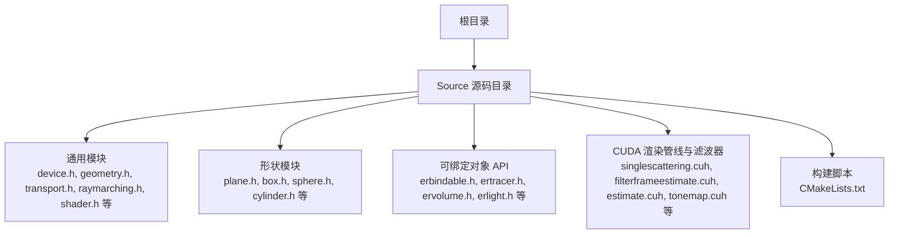
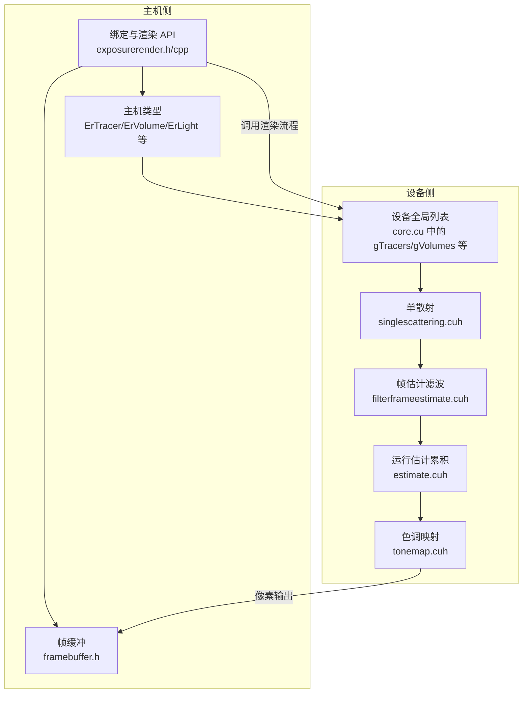
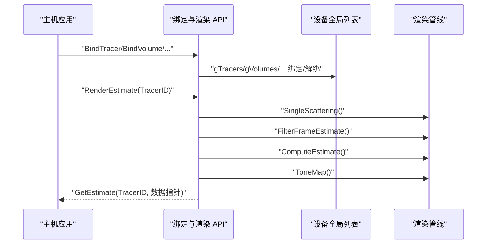
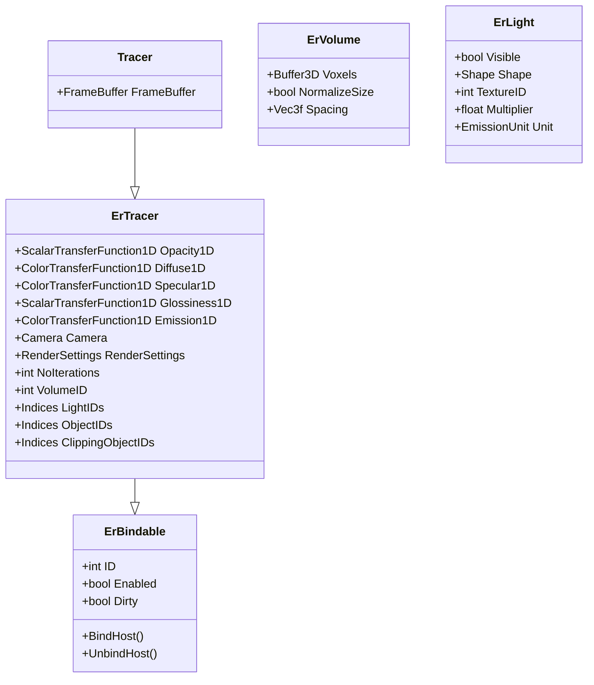
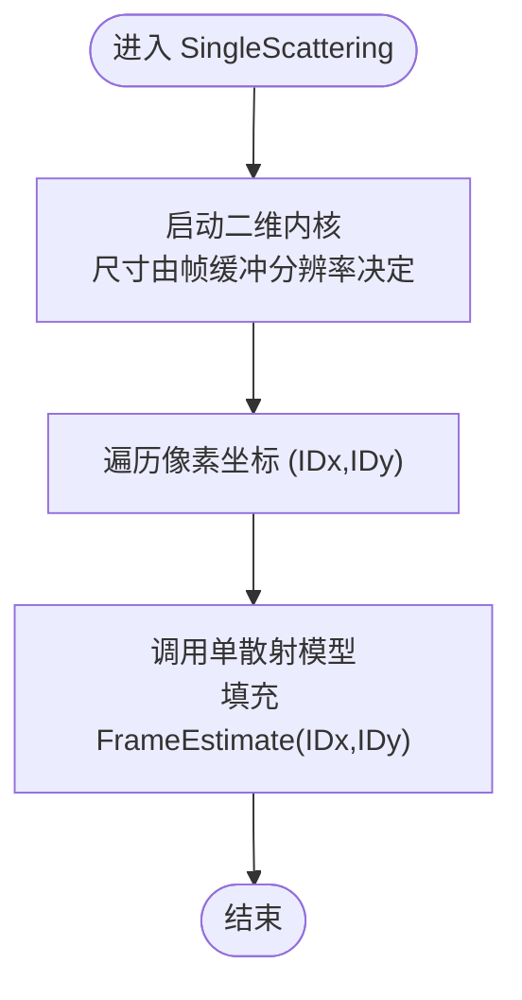
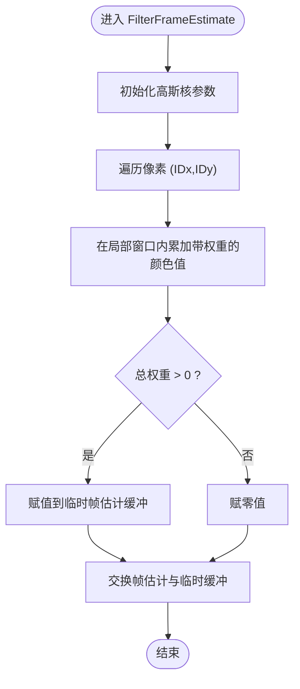
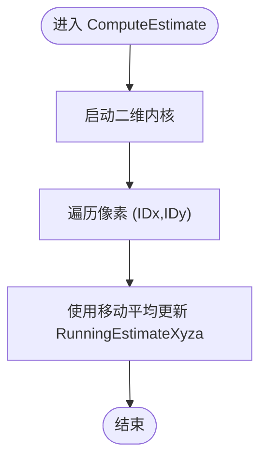
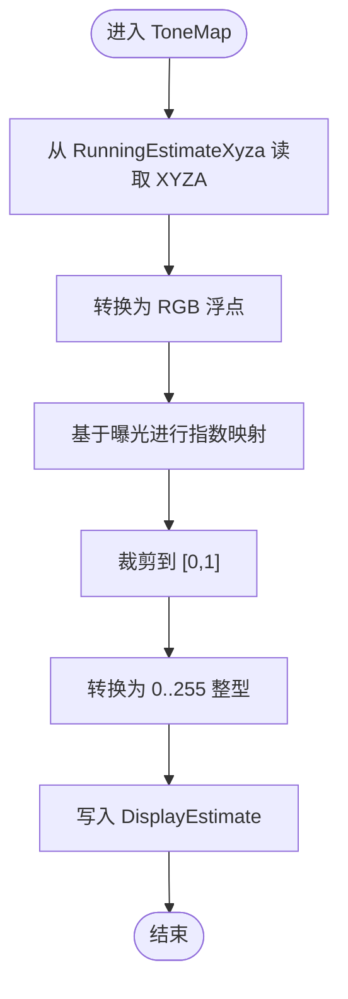

# 架构设计

<cite>
**本文引用的文件**
- [README.md](file://README.md)
- [CMakeLists.txt](file://Source/CMakeLists.txt)
- [exposurerender.h](file://Source/exposurerender.h)
- [exposurerender.cpp](file://Source/exposurerender.cpp)
- [core.cu](file://Source/core.cu)
- [erbindable.h](file://Source/erbindable.h)
- [ertracer.h](file://Source/ertracer.h)
- [ervolume.h](file://Source/ervolume.h)
- [erlight.h](file://Source/erlight.h)
- [tracer.h](file://Source/tracer.h)
- [framebuffer.h](file://Source/framebuffer.h)
- [singlescattering.cuh](file://Source/singlescattering.cuh)
- [filterframeestimate.cuh](file://Source/filterframeestimate.cuh)
- [estimate.cuh](file://Source/estimate.cuh)
- [tonemap.cuh](file://Source/tonemap.cuh)
</cite>

## 目录
1. [引言](#引言)
2. [项目结构](#项目结构)
3. [核心组件](#核心组件)
4. [架构总览](#架构总览)
5. [详细组件分析](#详细组件分析)
6. [依赖关系分析](#依赖关系分析)
7. [性能考量](#性能考量)
8. [故障排查指南](#故障排查指南)
9. [结论](#结论)
10. [附录](#附录)

## 引言
本架构文档面向“曝光渲染框架”（Exposure Render），这是一个基于 CUDA 的体积光线渲染引擎，融合了物理光照传输算法，支持交互式照片写实体积渲染。本文从系统边界、高层设计、架构模式、组件交互与数据流、技术决策与权衡、基础设施与可扩展性、部署拓扑以及安全、监控与灾备等横切关注点出发，提供系统上下文与组件分解视图，并记录技术栈、第三方依赖与版本兼容性。

## 项目结构
该工程采用分层与按功能模块组织的源码布局：
- 根目录包含构建说明与版本信息，以及 Source 子目录存放核心源码。
- Source 下按功能域划分：通用几何与工具、形状集合、绑定对象 API、CUDA 渲染管线与滤波器等。
- 使用 CMake 驱动构建，通过 CUDA_ADD_LIBRARY 产出共享库 ErCore；同时配置 CUDA 编译标志与包含路径。

图表来源
- [CMakeLists.txt:104-155](file://Source/CMakeLists.txt#L104-L155)

章节来源
- [CMakeLists.txt:17-155](file://Source/CMakeLists.txt#L17-L155)
- [README.md:14-23](file://README.md#L14-L23)

## 核心组件
- 可绑定对象基类：提供统一的标识、启用状态与脏标记机制，作为所有渲染资源（追踪器、体积、光源、纹理等）的基类。
- 追踪器（ErTracer/Tracer）：封装相机、渲染设置、传输函数、光照与对象索引等，负责驱动一帧渲染流程。
- 体积（ErVolume）：持有体数据（体素）及其采样间距与归一化参数，向渲染管线提供密度与属性查询。
- 光源（ErLight）：描述光源可见性、形状、纹理ID与发射强度单位等。
- 帧缓冲（FrameBuffer）：管理多层缓冲区（帧估计、运行估计、显示估计、随机种子等），支撑迭代式渲染与色调映射输出。
- 渲染管线（CUDA）：单散射计算、帧估计滤波、运行估计累积、色调映射与像素输出。

章节来源
- [erbindable.h:28-71](file://Source/erbindable.h#L28-L71)
- [ertracer.h:33-120](file://Source/ertracer.h#L33-L120)
- [ervolume.h:28-77](file://Source/ervolume.h#L28-L77)
- [erlight.h:27-69](file://Source/erlight.h#L27-L69)
- [tracer.h:31-58](file://Source/tracer.h#L31-L58)
- [framebuffer.h:26-108](file://Source/framebuffer.h#L26-L108)

## 架构总览
系统采用“主机侧 API + CUDA 设备侧渲染”的双层架构：
- 主机侧通过一组绑定接口将场景对象（追踪器、体积、光源、纹理等）注册到全局设备列表中，随后调用渲染估计与结果读取接口。
- 设备侧以 CUDA kernel 为核心，执行单散射、帧估计滤波、运行估计累积与色调映射，最终将像素数据拷回主机侧显示缓冲。

图表来源
- [exposurerender.h:32-42](file://Source/exposurerender.h#L32-L42)
- [core.cu:40-156](file://Source/core.cu#L40-L156)
- [singlescattering.cuh:27-41](file://Source/singlescattering.cuh#L27-L41)
- [filterframeestimate.cuh:33-77](file://Source/filterframeestimate.cuh#L33-L77)
- [estimate.cuh:27-40](file://Source/estimate.cuh#L27-L40)
- [tonemap.cuh:49-68](file://Source/tonemap.cuh#L49-L68)
- [framebuffer.h:26-108](file://Source/framebuffer.h#L26-L108)

## 详细组件分析

### 绑定与渲染 API
- 绑定接口：提供对追踪器、体积、光源、对象、裁剪对象、纹理与位图的绑定/解绑能力，内部通过设备侧全局列表完成注册。
- 渲染流程：先同步设备侧对象，再依次执行单散射、帧估计滤波、估计累积与色调映射，最后将显示估计拷回主机侧。

图表来源
- [exposurerender.h:32-42](file://Source/exposurerender.h#L32-L42)
- [core.cu:126-156](file://Source/core.cu#L126-L156)
- [singlescattering.cuh:34-38](file://Source/singlescattering.cuh#L34-L38)
- [filterframeestimate.cuh:66-74](file://Source/filterframeestimate.cuh#L66-L74)
- [estimate.cuh:34-38](file://Source/estimate.cuh#L34-L38)
- [tonemap.cuh:61-65](file://Source/tonemap.cuh#L61-L65)

章节来源
- [exposurerender.h:32-42](file://Source/exposurerender.h#L32-L42)
- [exposurerender.cpp:21](file://Source/exposurerender.cpp#L21)
- [core.cu:126-156](file://Source/core.cu#L126-L156)

### 类层次与关系

图表来源
- [erbindable.h:28-71](file://Source/erbindable.h#L28-L71)
- [ertracer.h:33-120](file://Source/ertracer.h#L33-L120)
- [tracer.h:31-58](file://Source/tracer.h#L31-L58)
- [ervolume.h:28-77](file://Source/ervolume.h#L28-L77)
- [erlight.h:27-69](file://Source/erlight.h#L27-L69)

章节来源
- [erbindable.h:28-71](file://Source/erbindable.h#L28-L71)
- [ertracer.h:33-120](file://Source/ertracer.h#L33-L120)
- [tracer.h:31-58](file://Source/tracer.h#L31-L58)
- [ervolume.h:28-77](file://Source/ervolume.h#L28-L77)
- [erlight.h:27-69](file://Source/erlight.h#L27-L69)

### 单散射计算流程

图表来源
- [singlescattering.cuh:27-38](file://Source/singlescattering.cuh#L27-L38)

章节来源
- [singlescattering.cuh:27-41](file://Source/singlescattering.cuh#L27-L41)

### 帧估计滤波流程

图表来源
- [filterframeestimate.cuh:33-77](file://Source/filterframeestimate.cuh#L33-L77)

章节来源
- [filterframeestimate.cuh:28-77](file://Source/filterframeestimate.cuh#L28-L77)

### 运行估计累积流程

图表来源
- [estimate.cuh:27-40](file://Source/estimate.cuh#L27-L40)

章节来源
- [estimate.cuh:27-40](file://Source/estimate.cuh#L27-L40)

### 色调映射流程

图表来源
- [tonemap.cuh:30-68](file://Source/tonemap.cuh#L30-L68)

章节来源
- [tonemap.cuh:30-68](file://Source/tonemap.cuh#L30-L68)

## 依赖关系分析
- 构建与编译
  - CMake 使用 CUDA 支持，定义多个计算架构目标与编译标志，导出符号并通过 CUDA_ADD_LIBRARY 生成 ErCore 共享库。
  - 包含路径覆盖源码目录与 CUDA SDK 目录。
- 运行时依赖
  - 需要 NVIDIA CUDA 兼容 GPU 与相应驱动，具备一定显存容量以容纳帧缓冲与随机种子等中间数据。
  - 主机侧 API 通过 DLL 导出符号供上层应用调用。

图表来源
- [CMakeLists.txt:21-46](file://Source/CMakeLists.txt#L21-L46)
- [CMakeLists.txt:155](file://Source/CMakeLists.txt#L155)

章节来源
- [CMakeLists.txt:21-46](file://Source/CMakeLists.txt#L21-L46)
- [CMakeLists.txt:155](file://Source/CMakeLists.txt#L155)

## 性能考量
- 并行策略
  - 渲染管线以二维像素块为粒度并行执行，内核维度与块大小根据帧缓冲分辨率动态确定，确保充分利用 GPU 并行能力。
- 内存与带宽
  - 多层缓冲（帧估计、运行估计、显示估计、随机种子）在设备端分配，减少主机-设备频繁拷贝；仅在需要时将最终显示估计拷回主机。
- 算法复杂度
  - 单散射与滤波为 O(W×H) 的像素级操作；运行估计累积为 O(W×H)；色调映射为 O(W×H)。整体渲染流程为 O(Niter × W × H)，Niter 为迭代次数。
- 可扩展性
  - 通过增加迭代次数提升质量但牺牲速度；可通过降低分辨率或简化传输函数/光源数量进行权衡。
  - 当前未见多 GPU 或分布式渲染实现，建议在单 GPU 上通过批处理或异步渲染提升吞吐。

## 故障排查指南
- 构建失败
  - 确认已安装匹配的 CUDA 工具链与 Visual Studio 版本；检查 CMake 找到 CUDA 并正确设置包含路径。
- 运行时错误
  - 显存不足：减小帧缓冲分辨率或降低体数据分辨率；确认随机种子与中间缓冲大小合理。
  - 设备列表为空：确保在渲染前已通过绑定接口将追踪器与相关对象注册到设备侧全局列表。
  - 输出异常：检查曝光参数与色调映射是否合理；确认运行估计缓冲非空且迭代计数正确递增。
- 性能问题
  - 若渲染缓慢，尝试减少滤波半径或迭代次数；检查内核启动参数与块大小是否适配当前 GPU。

章节来源
- [CMakeLists.txt:21-46](file://Source/CMakeLists.txt#L21-L46)
- [README.md:17-23](file://README.md#L17-L23)
- [core.cu:126-156](file://Source/core.cu#L126-L156)

## 结论
曝光渲染框架以 CUDA 为核心，采用“主机 API + 设备管线”的清晰分层，围绕可绑定对象模型组织场景资源，通过单散射、滤波、累积与色调映射构成完整的体积渲染流水线。系统在交互式渲染与照片写实效果之间取得平衡，具备良好的模块化与可扩展性。建议在实际部署中结合硬件规格与数据规模进行参数调优，并持续关注显存与内核性能瓶颈。

## 附录

### 技术栈与版本兼容性
- 构建工具：CMake
- 编译器：Visual Studio（参考测试配置）
- CUDA：支持多计算架构目标（含 compute_20），需匹配相应驱动
- 第三方依赖：CUDA SDK（包含头文件与示例库）

章节来源
- [CMakeLists.txt:21-46](file://Source/CMakeLists.txt#L21-L46)
- [README.md:14-15](file://README.md#L14-L15)

### 基础设施与部署拓扑
- 系统要求
  - 操作系统：Windows（XP/Vista/7）
  - 内存：至少 1GB
  - GPU：NVIDIA CUDA 兼容 GPU，建议 GTX270 或更高
  - 显存：至少 512MB DRAM（建议更大以支持更高分辨率）
- 部署建议
  - 将 ErCore 作为共享库集成至上层应用；在应用启动阶段初始化帧缓冲与随机种子；按需绑定场景对象并在渲染循环中调用渲染估计与结果读取接口。
  - 对于大规模数据集，建议分块加载与异步渲染策略，避免一次性占用过多显存。

章节来源
- [README.md:17-23](file://README.md#L17-L23)

### 安全、监控与灾备
- 安全
  - 严格输入校验与边界检查（例如像素坐标与窗口范围），防止越界访问。
  - 控制台日志用于调试（DebugLog），生产环境建议关闭或降级日志级别。
- 监控
  - 在关键内核前后插入计时与统计，评估各阶段耗时；对迭代次数与缓冲尺寸进行可视化反馈。
- 灾难恢复
  - 建议在渲染过程中定期保存中间估计结果（若需要），并提供重置帧缓冲与随机种子的能力，以便在异常后快速恢复。

章节来源
- [core.cu:56-64](file://Source/core.cu#L56-L64)
- [framebuffer.h:70-91](file://Source/framebuffer.h#L70-L91)