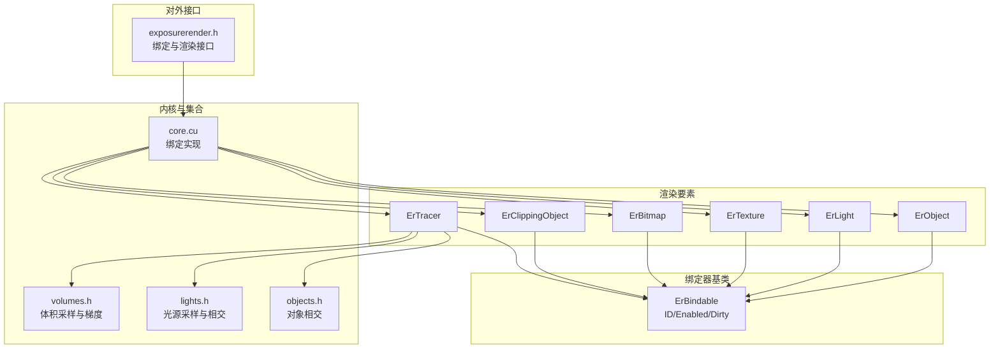
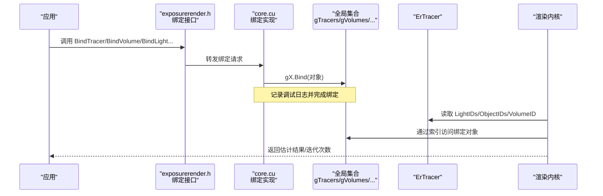
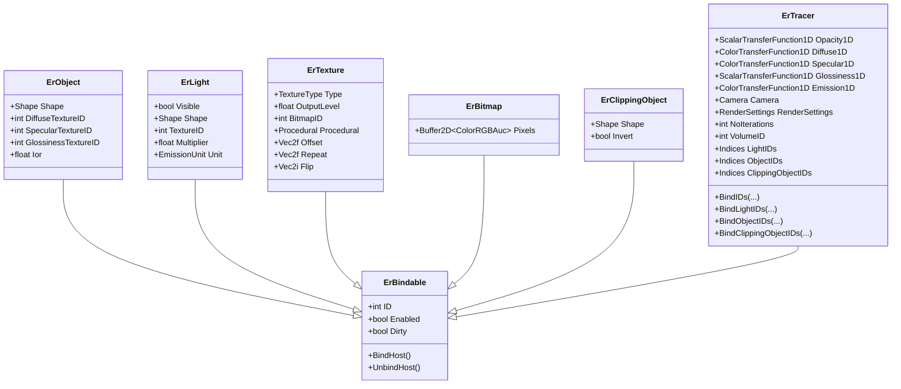
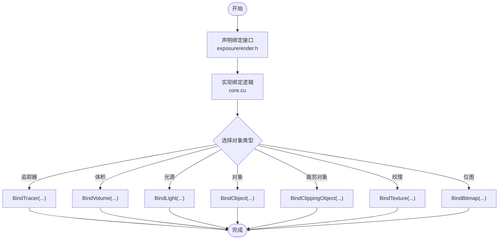
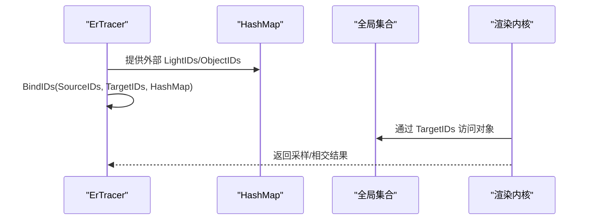
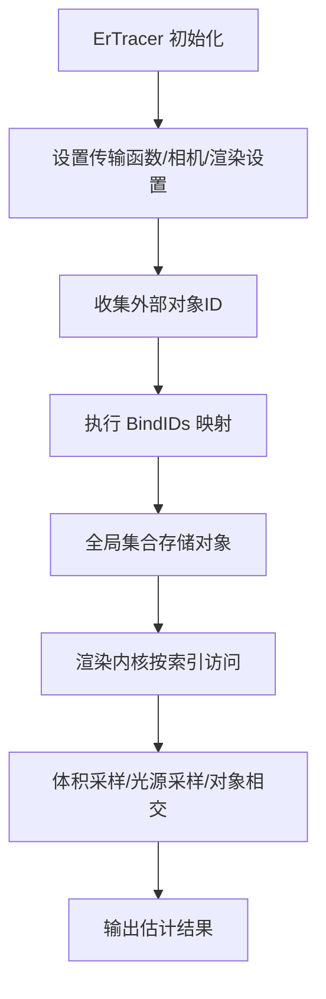
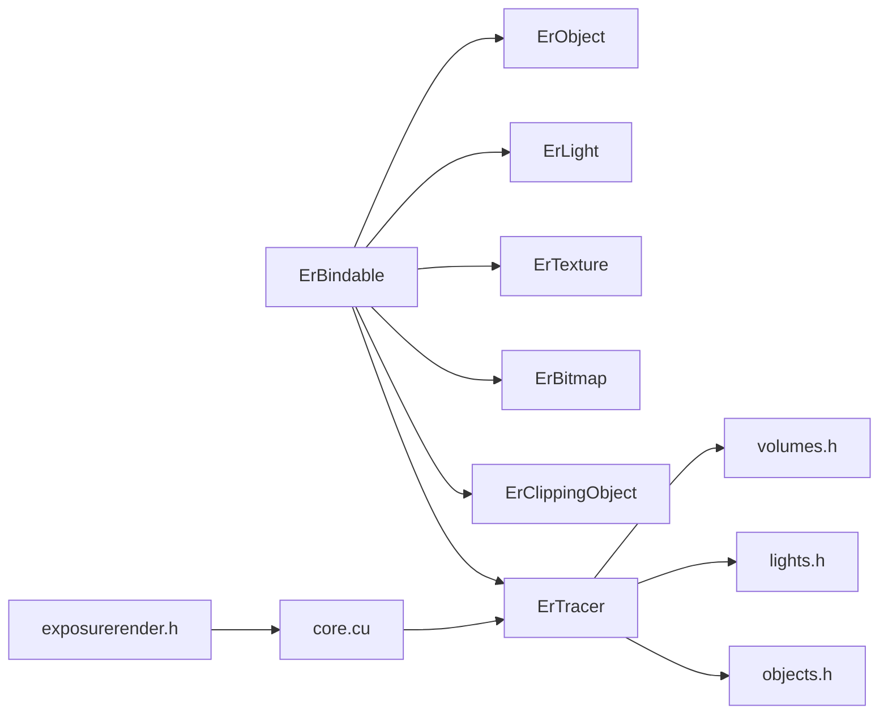

# 核心设计模式

<cite>
**本文引用的文件**
- [erbindable.h](file://Source/erbindable.h)
- [exposurerender.h](file://Source/exposurerender.h)
- [erobject.h](file://Source/erobject.h)
- [erlight.h](file://Source/erlight.h)
- [ertracer.h](file://Source/ertracer.h)
- [erclippingobject.h](file://Source/erclippingobject.h)
- [ertexture.h](file://Source/ertexture.h)
- [erbitmap.h](file://Source/erbitmap.h)
- [core.cu](file://Source/core.cu)
- [volumes.h](file://Source/volumes.h)
- [lights.h](file://Source/lights.h)
- [objects.h](file://Source/objects.h)
</cite>

## 目录
1. [引言](#引言)
2. [项目结构](#项目结构)
3. [核心组件](#核心组件)
4. [架构总览](#架构总览)
5. [详细组件分析](#详细组件分析)
6. [依赖分析](#依赖分析)
7. [性能考虑](#性能考虑)
8. [故障排查指南](#故障排查指南)
9. [结论](#结论)
10. [附录](#附录)

## 引言
本文件聚焦于曝光渲染框架中的核心设计模式，系统阐述绑定器模式（ErBindable）在资源与状态管理中的作用，以及工厂模式与观察者模式在渲染管线中的协同机制。文档从类层次、数据流、控制流与错误处理等维度，解释绑定器模式如何统一资源生命周期与脏标记策略；如何通过工厂式接口（如 BindTracer/BindVolume 等）集中管理渲染器配置；以及如何借助索引映射与全局集合实现“观察者式”的对象绑定与更新。同时给出面向非技术读者可理解的图示与流程说明，并提供可追溯到源码的参考路径。

## 项目结构
该渲染框架采用分层与模块化组织：顶层通过一组对外导出的绑定接口（BindTracer/BindVolume/BindLight 等）连接宿主与设备侧资源；底层以 ErBindable 为基类，派生出渲染要素（光源、对象、纹理、位图、裁剪对象、追踪器等），统一管理 ID、启用状态与脏标记；渲染内核通过全局集合与索引映射实现对绑定对象的访问与更新。

图表来源
- [exposurerender.h:32-42](file://Source/exposurerender.h#L32-L42)
- [erbindable.h:28-68](file://Source/erbindable.h#L28-L68)
- [erobject.h:27-66](file://Source/erobject.h#L27-L66)
- [erlight.h:27-65](file://Source/erlight.h#L27-L65)
- [ertexture.h:27-81](file://Source/ertexture.h#L27-L81)
- [erbitmap.h:28-60](file://Source/erbitmap.h#L28-L60)
- [erclippingobject.h:27-57](file://Source/erclippingobject.h#L27-L57)
- [ertracer.h:33-116](file://Source/ertracer.h#L33-L116)
- [core.cu:66-114](file://Source/core.cu#L66-L114)
- [volumes.h:26-114](file://Source/volumes.h#L26-L114)
- [lights.h:28-131](file://Source/lights.h#L28-L131)
- [objects.h:26-82](file://Source/objects.h#L26-L82)

章节来源
- [exposurerender.h:32-42](file://Source/exposurerender.h#L32-L42)
- [erbindable.h:28-68](file://Source/erbindable.h#L28-L68)
- [erobject.h:27-66](file://Source/erobject.h#L27-L66)
- [erlight.h:27-65](file://Source/erlight.h#L27-L65)
- [ertexture.h:27-81](file://Source/ertexture.h#L27-L81)
- [erbitmap.h:28-60](file://Source/erbitmap.h#L28-L60)
- [erclippingobject.h:27-57](file://Source/erclippingobject.h#L27-L57)
- [ertracer.h:33-116](file://Source/ertracer.h#L33-L116)
- [core.cu:66-114](file://Source/core.cu#L66-L114)
- [volumes.h:26-114](file://Source/volumes.h#L26-L114)
- [lights.h:28-131](file://Source/lights.h#L28-L131)
- [objects.h:26-82](file://Source/objects.h#L26-L82)

## 核心组件
- 绑定器基类 ErBindable：提供统一的标识符（ID）、启用标志（Enabled）与脏标记（Dirty），并定义主机端绑定/解绑接口，作为所有渲染要素的共同基类。
- 渲染要素派生类：ErObject、ErLight、ErTexture、ErBitmap、ErClippingObject、ErTracer 均继承自 ErBindable，承载各自的属性与行为。
- 对外绑定接口：exposurerender.h 暴露 BindTracer/BindVolume/BindLight/BindObject/BindClippingObject/BindTexture/BindBitmap 等函数，用于将宿主侧对象绑定到渲染内核。
- 内核绑定实现：core.cu 中具体实现各绑定函数，负责调用全局集合的 Bind/Unbind，并记录调试日志。
- 渲染内核：ErTracer 聚合传输函数、相机、渲染设置、迭代次数、体积与对象/光源/裁剪对象的索引列表；通过索引映射与全局集合实现“观察者式”的对象访问。

章节来源
- [erbindable.h:28-68](file://Source/erbindable.h#L28-L68)
- [erobject.h:27-66](file://Source/erobject.h#L27-L66)
- [erlight.h:27-65](file://Source/erlight.h#L27-L65)
- [ertexture.h:27-81](file://Source/ertexture.h#L27-L81)
- [erbitmap.h:28-60](file://Source/erbitmap.h#L28-L60)
- [erclippingobject.h:27-57](file://Source/erclippingobject.h#L27-L57)
- [ertracer.h:33-116](file://Source/ertracer.h#L33-L116)
- [exposurerender.h:32-42](file://Source/exposurerender.h#L32-L42)
- [core.cu:66-114](file://Source/core.cu#L66-L114)

## 架构总览
下图展示了绑定器模式、工厂式接口与观察者式集合之间的交互关系：外部通过 Bind* 接口将宿主对象注册到全局集合；渲染器通过 ErTracer 的索引列表“观察”这些对象，并在需要时进行访问与更新。

图表来源
- [exposurerender.h:32-42](file://Source/exposurerender.h#L32-L42)
- [core.cu:66-114](file://Source/core.cu#L66-L114)
- [ertracer.h:82-116](file://Source/ertracer.h#L82-L116)

章节来源
- [exposurerender.h:32-42](file://Source/exposurerender.h#L32-L42)
- [core.cu:66-114](file://Source/core.cu#L66-L114)
- [ertracer.h:82-116](file://Source/ertracer.h#L82-L116)

## 详细组件分析

### 绑定器模式（ErBindable）
- 设计要点
  - 统一标识与状态：ID 用于对象检索与映射；Enabled 控制是否参与渲染；Dirty 标记用于增量更新。
  - 主机端绑定：提供 BindHost/UnbindHost 接口，便于在宿主与设备之间同步状态。
  - 派生类一致性：所有渲染要素（对象、光源、纹理、位图、裁剪对象、追踪器）共享同一基类语义，降低上层复杂度。
- 使用场景
  - 资源管理：通过 ID 与集合配合，实现对象的注册、查找与移除。
  - 动态绑定：运行时可启用/禁用对象或标记脏状态以触发重算。
  - 渲染配置：ErTracer 将传输函数、相机、渲染设置等聚合到一个可绑定对象中，便于集中管理。
- 实际应用示例（参考路径）
  - ErBindable 的构造与赋值：[erbindable.h:31-54](file://Source/erbindable.h#L31-L54)
  - ErObject 的继承与成员：[erobject.h:27-66](file://Source/erobject.h#L27-L66)
  - ErLight 的继承与成员：[erlight.h:27-65](file://Source/erlight.h#L27-L65)
  - ErTexture 的继承与成员：[ertexture.h:27-81](file://Source/ertexture.h#L27-L81)
  - ErBitmap 的继承与成员：[erbitmap.h:28-60](file://Source/erbitmap.h#L28-L60)
  - ErClippingObject 的继承与成员：[erclippingobject.h:27-57](file://Source/erclippingobject.h#L27-L57)
  - ErTracer 的继承与索引映射：[ertracer.h:33-116](file://Source/ertracer.h#L33-L116)

图表来源
- [erbindable.h:28-68](file://Source/erbindable.h#L28-L68)
- [erobject.h:27-66](file://Source/erobject.h#L27-L66)
- [erlight.h:27-65](file://Source/erlight.h#L27-L65)
- [ertexture.h:27-81](file://Source/ertexture.h#L27-L81)
- [erbitmap.h:28-60](file://Source/erbitmap.h#L28-L60)
- [erclippingobject.h:27-57](file://Source/erclippingobject.h#L27-L57)
- [ertracer.h:33-116](file://Source/ertracer.h#L33-L116)

章节来源
- [erbindable.h:28-68](file://Source/erbindable.h#L28-L68)
- [erobject.h:27-66](file://Source/erobject.h#L27-L66)
- [erlight.h:27-65](file://Source/erlight.h#L27-L65)
- [ertexture.h:27-81](file://Source/ertexture.h#L27-L81)
- [erbitmap.h:28-60](file://Source/erbitmap.h#L28-L60)
- [erclippingobject.h:27-57](file://Source/erclippingobject.h#L27-L57)
- [ertracer.h:33-116](file://Source/ertracer.h#L33-L116)

### 工厂模式（接口与对象创建）
- 设计要点
  - 外部接口集中化：exposurerender.h 提供一组 Bind*/RenderEstimate 等对外函数，作为“工厂式”入口，屏蔽内部集合与设备细节。
  - 对象创建与配置：ErTracer/ErObject/ErLight/ErTexture/ErBitmap/ErClippingObject 等类承担具体属性与行为，配合 ErBindable 的统一状态管理。
- 使用场景
  - 快速装配渲染管线：通过 Bind* 接口一次性将所需对象加入渲染上下文。
  - 配置与参数传递：ErTracer 聚合传输函数、相机与渲染设置，便于集中调整渲染质量与效果。
- 实际应用示例（参考路径）
  - 对外绑定接口声明：[exposurerender.h:32-42](file://Source/exposurerender.h#L32-L42)
  - ErTracer 的聚合与索引映射：[ertracer.h:33-116](file://Source/ertracer.h#L33-L116)

图表来源
- [exposurerender.h:32-42](file://Source/exposurerender.h#L32-L42)
- [core.cu:66-114](file://Source/core.cu#L66-L114)

章节来源
- [exposurerender.h:32-42](file://Source/exposurerender.h#L32-L42)
- [core.cu:66-114](file://Source/core.cu#L66-L114)
- [ertracer.h:33-116](file://Source/ertracer.h#L33-L116)

### 观察者模式（索引映射与集合观察）
- 设计要点
  - 索引映射：ErTracer 提供 BindIDs/BindLightIDs/BindObjectIDs/BindClippingObjectIDs 等方法，将外部 ID 映射到内部集合索引，实现“弱耦合观察”。
  - 全局集合：core.cu 中的 gTracers/gVolumes/gLights/gObjects/gClippingObjects 等全局集合负责存储与管理对象实例。
  - 渲染内核：volumes.h/lights.h/objects.h 在内核中通过索引访问绑定对象，实现对渲染要素的“观察”与使用。
- 使用场景
  - 动态增删对象：无需修改渲染内核，仅需更新索引映射即可生效。
  - 多渲染器共享：不同 ErTracer 可通过不同的索引映射共享同一套对象集合。
- 实际应用示例（参考路径）
  - 索引映射实现：[ertracer.h:82-103](file://Source/ertracer.h#L82-L103)
  - 绑定实现（core.cu）：[core.cu:66-114](file://Source/core.cu#L66-L114)
  - 体积采样与梯度计算：[volumes.h:26-114](file://Source/volumes.h#L26-L114)
  - 光源采样与相交：[lights.h:28-131](file://Source/lights.h#L28-L131)
  - 对象相交：[objects.h:26-82](file://Source/objects.h#L26-L82)

图表来源
- [ertracer.h:82-103](file://Source/ertracer.h#L82-L103)
- [volumes.h:26-114](file://Source/volumes.h#L26-L114)
- [lights.h:28-131](file://Source/lights.h#L28-L131)
- [objects.h:26-82](file://Source/objects.h#L26-L82)

章节来源
- [ertracer.h:82-103](file://Source/ertracer.h#L82-L103)
- [core.cu:66-114](file://Source/core.cu#L66-L114)
- [volumes.h:26-114](file://Source/volumes.h#L26-L114)
- [lights.h:28-131](file://Source/lights.h#L28-L131)
- [objects.h:26-82](file://Source/objects.h#L26-L82)

### 渲染内核与动态绑定
- 设计要点
  - ErTracer 作为渲染器核心，聚合传输函数、相机与渲染设置，并维护对象/光源/裁剪对象的索引列表。
  - 通过 BindIDs 系列方法与全局集合配合，实现对对象的动态绑定与解绑。
  - 渲染内核根据索引访问对象，执行体积采样、光源采样与对象相交等操作。
- 实际应用示例（参考路径）
  - ErTracer 成员与索引映射：[ertracer.h:33-116](file://Source/ertracer.h#L33-L116)
  - 体积采样与梯度：[volumes.h:26-114](file://Source/volumes.h#L26-L114)
  - 光源采样与相交：[lights.h:28-131](file://Source/lights.h#L28-L131)
  - 对象相交：[objects.h:26-82](file://Source/objects.h#L26-L82)

图表来源
- [ertracer.h:33-116](file://Source/ertracer.h#L33-L116)
- [volumes.h:26-114](file://Source/volumes.h#L26-L114)
- [lights.h:28-131](file://Source/lights.h#L28-L131)
- [objects.h:26-82](file://Source/objects.h#L26-L82)

章节来源
- [ertracer.h:33-116](file://Source/ertracer.h#L33-L116)
- [volumes.h:26-114](file://Source/volumes.h#L26-L114)
- [lights.h:28-131](file://Source/lights.h#L28-L131)
- [objects.h:26-82](file://Source/objects.h#L26-L82)

## 依赖分析
- 类层次依赖
  - ErObject、ErLight、ErTexture、ErBitmap、ErClippingObject、ErTracer 均继承自 ErBindable，形成稳定的层次结构。
- 接口与实现依赖
  - 对外接口（exposurerender.h）依赖 core.cu 的具体实现。
  - ErTracer 依赖 volumes.h/lights.h/objects.h 提供的内核函数。
- 索引与集合依赖
  - ErTracer 的索引映射依赖全局集合（由 core.cu 管理）。
- 错误处理与异常
  - 源码包含异常头文件，但未在上述绑定与内核文件中直接出现异常抛出逻辑；建议在扩展新功能时遵循统一的异常处理策略。

图表来源
- [erbindable.h:28-68](file://Source/erbindable.h#L28-L68)
- [erobject.h:27-66](file://Source/erobject.h#L27-L66)
- [erlight.h:27-65](file://Source/erlight.h#L27-L65)
- [ertexture.h:27-81](file://Source/ertexture.h#L27-L81)
- [erbitmap.h:28-60](file://Source/erbitmap.h#L28-L60)
- [erclippingobject.h:27-57](file://Source/erclippingobject.h#L27-L57)
- [ertracer.h:33-116](file://Source/ertracer.h#L33-L116)
- [exposurerender.h:32-42](file://Source/exposurerender.h#L32-L42)
- [core.cu:66-114](file://Source/core.cu#L66-L114)
- [volumes.h:26-114](file://Source/volumes.h#L26-L114)
- [lights.h:28-131](file://Source/lights.h#L28-L131)
- [objects.h:26-82](file://Source/objects.h#L26-L82)

章节来源
- [erbindable.h:28-68](file://Source/erbindable.h#L28-L68)
- [erobject.h:27-66](file://Source/erobject.h#L27-L66)
- [erlight.h:27-65](file://Source/erlight.h#L27-L65)
- [ertexture.h:27-81](file://Source/ertexture.h#L27-L81)
- [erbitmap.h:28-60](file://Source/erbitmap.h#L28-L60)
- [erclippingobject.h:27-57](file://Source/erclippingobject.h#L27-L57)
- [ertracer.h:33-116](file://Source/ertracer.h#L33-L116)
- [exposurerender.h:32-42](file://Source/exposurerender.h#L32-L42)
- [core.cu:66-114](file://Source/core.cu#L66-L114)
- [volumes.h:26-114](file://Source/volumes.h#L26-L114)
- [lights.h:28-131](file://Source/lights.h#L28-L131)
- [objects.h:26-82](file://Source/objects.h#L26-L82)

## 性能考虑
- 脏标记与增量更新：ErBindable 的 Dirty 字段可用于避免不必要的重算，建议在属性变更后设置 Dirty，并在渲染前检查与清理。
- 索引映射优化：BindIDs 系列方法通过哈希表进行批量映射，建议确保外部 ID 的稳定性以减少重复映射开销。
- 传输函数与梯度计算：volumes.h 中提供了多种梯度计算方式（前向差分、中心差分、滤波），可根据场景选择合适的计算策略以平衡精度与性能。
- 全局集合访问：通过索引直接访问全局集合可减少查找成本，但需注意集合大小与缓存局部性。

## 故障排查指南
- 绑定失败或对象未生效
  - 检查 Bind* 调用是否传入正确的对象与布尔开关。
  - 确认 ErTracer 的索引映射是否正确建立（BindIDs/BindLightIDs/BindObjectIDs/BindClippingObjectIDs）。
  - 参考路径：[core.cu:66-114](file://Source/core.cu#L66-L114)，[ertracer.h:82-103](file://Source/ertracer.h#L82-L103)
- 渲染结果异常
  - 检查 ErTracer 的传输函数与渲染设置是否合理。
  - 确认体积、光源与对象的绑定顺序与数量是否符合预期。
  - 参考路径：[ertracer.h:33-116](file://Source/ertracer.h#L33-L116)，[volumes.h:26-114](file://Source/volumes.h#L26-L114)，[lights.h:28-131](file://Source/lights.h#L28-L131)，[objects.h:26-82](file://Source/objects.h#L26-L82)
- 性能问题
  - 启用/禁用不必要的对象（Enabled）以减少渲染负担。
  - 使用合适的梯度计算方式与传输函数分辨率。
  - 参考路径：[volumes.h:76-86](file://Source/volumes.h#L76-L86)

章节来源
- [core.cu:66-114](file://Source/core.cu#L66-L114)
- [ertracer.h:33-116](file://Source/ertracer.h#L33-L116)
- [ertracer.h:82-103](file://Source/ertracer.h#L82-L103)
- [volumes.h:26-114](file://Source/volumes.h#L26-L114)
- [lights.h:28-131](file://Source/lights.h#L28-L131)
- [objects.h:26-82](file://Source/objects.h#L26-L82)

## 结论
该渲染框架通过绑定器模式统一了资源的状态管理，借助工厂式接口实现了渲染要素的快速装配，再以观察者式的索引映射达成对对象的动态绑定与高效访问。三者协同有效支撑了资源管理、渲染器配置与动态绑定需求，既保证了扩展性，又兼顾了运行时性能。建议在后续开发中延续该模式体系，完善脏标记与异常处理机制，进一步提升系统的健壮性与可维护性。

## 附录
- 关键接口与类的参考路径
  - 绑定器基类：[erbindable.h:28-68](file://Source/erbindable.h#L28-L68)
  - 渲染要素类：[erobject.h:27-66](file://Source/erobject.h#L27-L66)，[erlight.h:27-65](file://Source/erlight.h#L27-L65)，[ertexture.h:27-81](file://Source/ertexture.h#L27-L81)，[erbitmap.h:28-60](file://Source/erbitmap.h#L28-L60)，[erclippingobject.h:27-57](file://Source/erclippingobject.h#L27-L57)，[ertracer.h:33-116](file://Source/ertracer.h#L33-L116)
  - 对外绑定接口：[exposurerender.h:32-42](file://Source/exposurerender.h#L32-L42)
  - 绑定实现：[core.cu:66-114](file://Source/core.cu#L66-L114)
  - 渲染内核：[volumes.h:26-114](file://Source/volumes.h#L26-L114)，[lights.h:28-131](file://Source/lights.h#L28-L131)，[objects.h:26-82](file://Source/objects.h#L26-L82)