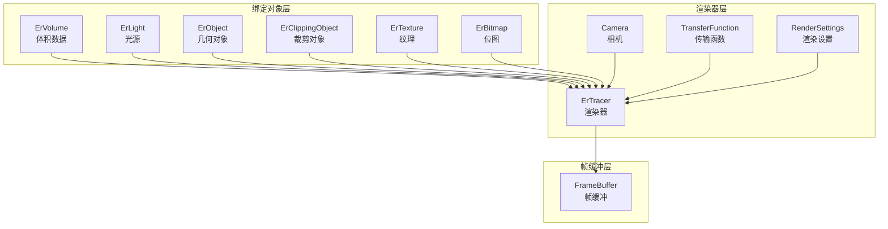
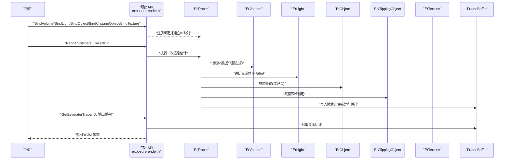
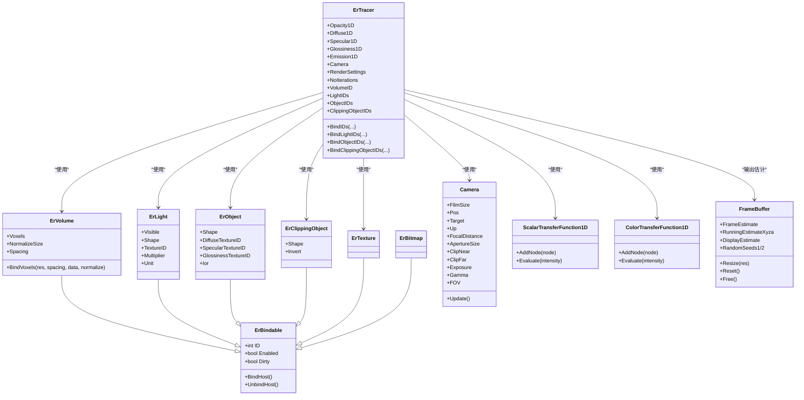
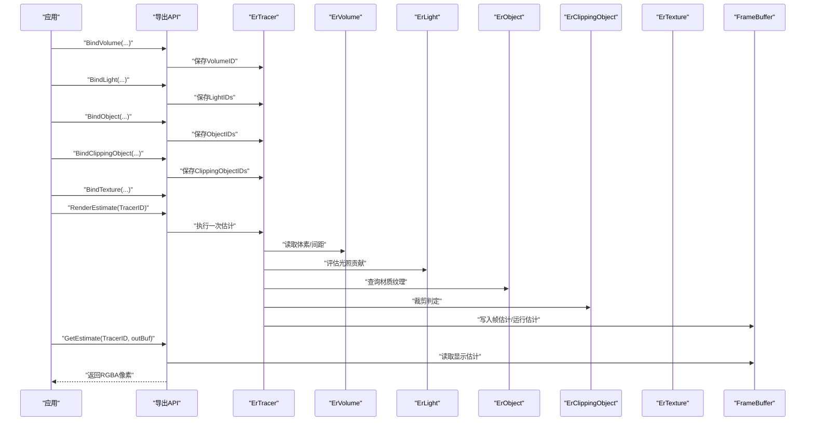
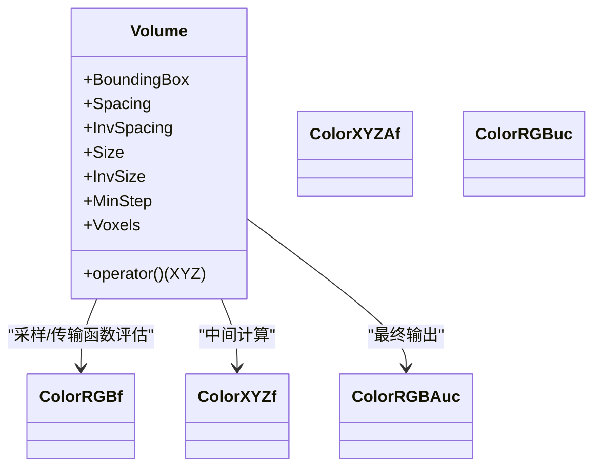
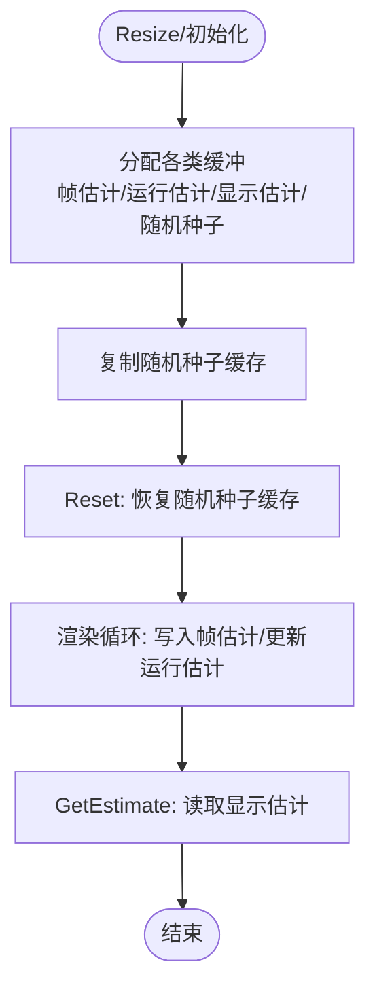
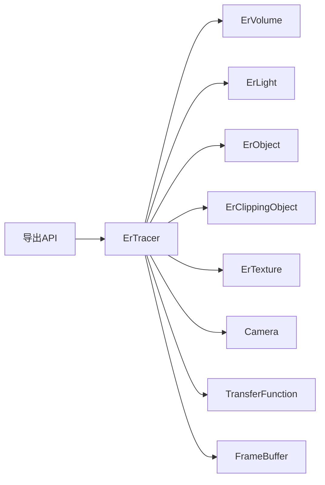

# 组件关系图

<cite>
**本文引用的文件**
- [exposurerender.h](file://Source/exposurerender.h)
- [framebuffer.h](file://Source/framebuffer.h)
- [volume.h](file://Source/volume.h)
- [light.h](file://Source/light.h)
- [texture.h](file://Source/texture.h)
- [ertracer.h](file://Source/ertracer.h)
- [ervolume.h](file://Source/ervolume.h)
- [erlight.h](file://Source/erlight.h)
- [erobject.h](file://Source/erobject.h)
- [erclippingobject.h](file://Source/erclippingobject.h)
- [erbindable.h](file://Source/erbindable.h)
- [camera.h](file://Source/camera.h)
- [transferfunction.h](file://Source/transferfunction.h)
- [buffer.h](file://Source/buffer.h)
- [color.h](file://Source/color.h)
</cite>

## 目录
1. [简介](#简介)
2. [项目结构](#项目结构)
3. [核心组件](#核心组件)
4. [架构总览](#架构总览)
5. [详细组件分析](#详细组件分析)
6. [依赖分析](#依赖分析)
7. [性能考虑](#性能考虑)
8. [故障排查指南](#故障排查指南)
9. [结论](#结论)
10. [附录](#附录)

## 简介
本文件面向曝光渲染框架，聚焦于组件关系与交互流程，绘制组件关系图、时序图与类图，阐述渲染器、帧缓冲、体积数据、光源与纹理等核心模块之间的依赖关系、调用顺序与数据交换格式；同时给出生命周期管理与资源协调机制说明，并总结组件解耦策略与扩展性设计。

## 项目结构
该渲染框架采用“绑定对象 + 渲染器 + 帧缓冲”的分层组织方式：
- 绑定对象层：暴露给上层的可绑定实体（体积、光源、物体、裁剪对象、纹理、位图），负责参数化与索引映射。
- 渲染器层：封装相机、渲染设置、传输函数与迭代计数，协调绑定对象进行渲染估计。
- 帧缓冲层：管理多份估计缓冲与随机种子，支持分辨率变化与重置。
- 数据与颜色模型：统一的颜色空间与缓冲抽象，支撑体积采样、传输函数评估与显示输出。

图表来源
- [ertracer.h:33-117](file://Source/ertracer.h#L33-L117)
- [ervolume.h:28-74](file://Source/ervolume.h#L28-L74)
- [erlight.h:27-66](file://Source/erlight.h#L27-L66)
- [erobject.h:27-67](file://Source/erobject.h#L27-L67)
- [erclippingobject.h:27-58](file://Source/erclippingobject.h#L27-L58)
- [camera.h:26-116](file://Source/camera.h#L26-L116)
- [transferfunction.h:82-154](file://Source/transferfunction.h#L82-L154)
- [framebuffer.h:26-105](file://Source/framebuffer.h#L26-L105)

章节来源
- [exposurerender.h:21-44](file://Source/exposurerender.h#L21-L44)
- [erbindable.h:28-68](file://Source/erbindable.h#L28-L68)

## 核心组件
- 绑定基类 ErBindable：提供 ID、启用状态、脏标记与主机绑定/解绑接口，是所有可绑定对象的共同基类。
- 体积数据 ErVolume：持有主机侧体数据与间距信息，支持绑定体素数据与归一化尺寸控制。
- 光源 ErLight：携带可见性、形状、纹理ID、强度倍数与发射单位。
- 几何对象 ErObject：携带形状与材质纹理ID（漫反射、镜面、光泽）及折射率。
- 裁剪对象 ErClippingObject：定义裁剪形状与是否反转内外。
- 纹理 ErTexture：材质纹理包装。
- 位图 ErBitmap：位图资源包装。
- 渲染器 ErTracer：聚合传输函数、相机、渲染设置、体积ID与对象ID集合，维护迭代次数与绑定ID映射。
- 相机 Camera：管理曝光、伽马、视野、胶片尺寸、近远裁剪与屏幕坐标系。
- 传输函数 TransferFunction：标量与颜色1D传输函数，支持节点添加与强度评估。
- 帧缓冲 FrameBuffer：管理帧估计、运行估计、显示估计及其临时缓冲与随机种子缓存。

章节来源
- [erbindable.h:28-68](file://Source/erbindable.h#L28-L68)
- [ervolume.h:28-74](file://Source/ervolume.h#L28-L74)
- [erlight.h:27-66](file://Source/erlight.h#L27-L66)
- [erobject.h:27-67](file://Source/erobject.h#L27-L67)
- [erclippingobject.h:27-58](file://Source/erclippingobject.h#L27-L58)
- [ertracer.h:33-117](file://Source/ertracer.h#L33-L117)
- [camera.h:26-116](file://Source/camera.h#L26-L116)
- [transferfunction.h:82-154](file://Source/transferfunction.h#L82-L154)
- [framebuffer.h:26-105](file://Source/framebuffer.h#L26-L105)

## 架构总览
渲染主流程通过一组导出API驱动，内部以渲染器为核心协调各组件完成估计与输出。下图展示典型渲染流程中组件交互与数据流：

图表来源
- [exposurerender.h:32-42](file://Source/exposurerender.h#L32-L42)
- [ertracer.h:82-103](file://Source/ertracer.h#L82-L103)
- [ervolume.h:63-69](file://Source/ervolume.h#L63-L69)
- [erlight.h:48-59](file://Source/erlight.h#L48-L59)
- [erobject.h:49-60](file://Source/erobject.h#L49-L60)
- [erclippingobject.h:46-54](file://Source/erclippingobject.h#L46-L54)
- [framebuffer.h:45-91](file://Source/framebuffer.h#L45-L91)

## 详细组件分析

### 类关系与继承
以下类图展示了绑定对象、渲染器与核心数据类型的关系与职责划分：

图表来源
- [erbindable.h:28-68](file://Source/erbindable.h#L28-L68)
- [ervolume.h:28-74](file://Source/ervolume.h#L28-L74)
- [erlight.h:27-66](file://Source/erlight.h#L27-L66)
- [erobject.h:27-67](file://Source/erobject.h#L27-L67)
- [erclippingobject.h:27-58](file://Source/erclippingobject.h#L27-L58)
- [ertracer.h:33-117](file://Source/ertracer.h#L33-L117)
- [camera.h:26-116](file://Source/camera.h#L26-L116)
- [transferfunction.h:82-154](file://Source/transferfunction.h#L82-L154)
- [framebuffer.h:26-105](file://Source/framebuffer.h#L26-L105)

章节来源
- [erbindable.h:28-68](file://Source/erbindable.h#L28-L68)
- [ertracer.h:33-117](file://Source/ertracer.h#L33-L117)
- [ervolume.h:28-74](file://Source/ervolume.h#L28-L74)
- [erlight.h:27-66](file://Source/erlight.h#L27-L66)
- [erobject.h:27-67](file://Source/erobject.h#L27-L67)
- [erclippingobject.h:27-58](file://Source/erclippingobject.h#L27-L58)
- [ertracer.h:82-103](file://Source/ertracer.h#L82-L103)

### 典型渲染流程时序
以下时序图展示从绑定到渲染估计再到获取结果的关键步骤与组件交互：

图表来源
- [exposurerender.h:32-42](file://Source/exposurerender.h#L32-L42)
- [ertracer.h:82-103](file://Source/ertracer.h#L82-L103)
- [framebuffer.h:45-91](file://Source/framebuffer.h#L45-L91)

章节来源
- [exposurerender.h:32-42](file://Source/exposurerender.h#L32-L42)
- [ertracer.h:82-103](file://Source/ertracer.h#L82-L103)
- [framebuffer.h:45-91](file://Source/framebuffer.h#L45-L91)

### 体积数据与颜色模型
- 体积数据 Volume：封装体素缓冲、间距、边界盒与最小步长，提供局部坐标到体素索引的映射。
- 颜色模型 Color：提供RGB/XYZ/RGBA等颜色类型的转换与运算，支持亮度计算与插值。

图表来源
- [volume.h:26-150](file://Source/volume.h#L26-L150)
- [color.h:59-142](file://Source/color.h#L59-L142)

章节来源
- [volume.h:26-150](file://Source/volume.h#L26-L150)
- [color.h:59-142](file://Source/color.h#L59-L142)

### 帧缓冲与随机种子
- 帧缓冲 FrameBuffer：管理帧估计、运行估计、显示估计与临时缓冲，支持分辨率变更与随机种子缓存/恢复。
- 缓冲抽象 Buffer：统一内存类型、名称与大小查询，便于调试与资源统计。

图表来源
- [framebuffer.h:45-91](file://Source/framebuffer.h#L45-L91)
- [buffer.h:27-121](file://Source/buffer.h#L27-L121)

章节来源
- [framebuffer.h:45-91](file://Source/framebuffer.h#L45-L91)
- [buffer.h:27-121](file://Source/buffer.h#L27-L121)

## 依赖分析
- 组件耦合与内聚
  - ErTracer 对绑定对象存在强依赖（ID集合与绑定映射），但通过 ErBindable 的统一接口降低具体实现耦合。
  - 传输函数与相机独立于具体对象，仅通过数值接口参与渲染，具备良好内聚。
- 外部依赖与集成点
  - 导出API作为唯一对外入口，集中处理绑定与渲染调度。
  - 帧缓冲作为渲染输出的唯一出口，避免渲染器直接访问宿主内存。
- 循环依赖
  - 未发现直接循环依赖；绑定对象通过ID与渲染器间接关联，无编译期循环包含。

图表来源
- [exposurerender.h:32-42](file://Source/exposurerender.h#L32-L42)
- [ertracer.h:33-117](file://Source/ertracer.h#L33-L117)
- [framebuffer.h:26-105](file://Source/framebuffer.h#L26-L105)

章节来源
- [exposurerender.h:32-42](file://Source/exposurerender.h#L32-L42)
- [ertracer.h:33-117](file://Source/ertracer.h#L33-L117)

## 性能考虑
- GPU/CPU 内存与带宽
  - 体积数据与估计缓冲均以设备端存储为主，减少频繁主机同步。
  - 传输函数采用分段线性函数，评估开销低且可并行。
- 分辨率与估计迭代
  - 帧缓冲按分辨率动态分配，建议在渲染前统一分辨率以减少重分配成本。
  - 迭代次数由渲染器维护，可通过外部API查询当前迭代数以指导用户界面反馈。
- 随机种子与收敛
  - 随机种子缓存与恢复有助于交互式渲染的稳定性与一致性。

## 故障排查指南
- 绑定对象未生效
  - 检查绑定ID映射是否正确建立，确认渲染器中 LightIDs/ObjectIDs/ClippingObjectIDs 已更新。
- 体积数据异常
  - 核对体素分辨率、间距与归一化选项，确保体积边界盒与最小步长合理。
- 光照/材质不正确
  - 确认光源可见性、纹理ID有效，材质纹理ID与对象属性一致。
- 帧缓冲问题
  - 若渲染后无输出，检查帧缓冲分辨率与随机种子缓存是否匹配；必要时调用 Reset 或 Free 后重新初始化。

章节来源
- [ertracer.h:82-103](file://Source/ertracer.h#L82-L103)
- [ervolume.h:63-69](file://Source/ervolume.h#L63-L69)
- [framebuffer.h:70-91](file://Source/framebuffer.h#L70-L91)

## 结论
该框架通过“绑定对象 + 渲染器 + 帧缓冲”的清晰分层，实现了体积渲染的模块化与可扩展性。绑定对象以统一接口接入，渲染器集中协调，帧缓冲统一输出，辅以传输函数与相机参数，形成稳定的渲染管线。通过ID映射与随机种子缓存机制，既保证了交互式渲染的流畅性，也提供了良好的资源管理与生命周期控制。

## 附录
- 接口与协议要点
  - 绑定接口：通过 BindXXX 系列导出API完成绑定与解绑，渲染器内部维护ID映射。
  - 渲染接口：RenderEstimate 执行一次估计，GetEstimate 获取当前显示估计。
  - 生命周期：先 Bind，后 RenderEstimate，最后 GetEstimate；必要时调用 Reset/Free 控制资源。
  - 数据交换：体积数据以体素数组形式传递；颜色与估计以浮点或字节形式在帧缓冲中流转。

章节来源
- [exposurerender.h:32-42](file://Source/exposurerender.h#L32-L42)
- [framebuffer.h:45-91](file://Source/framebuffer.h#L45-L91)