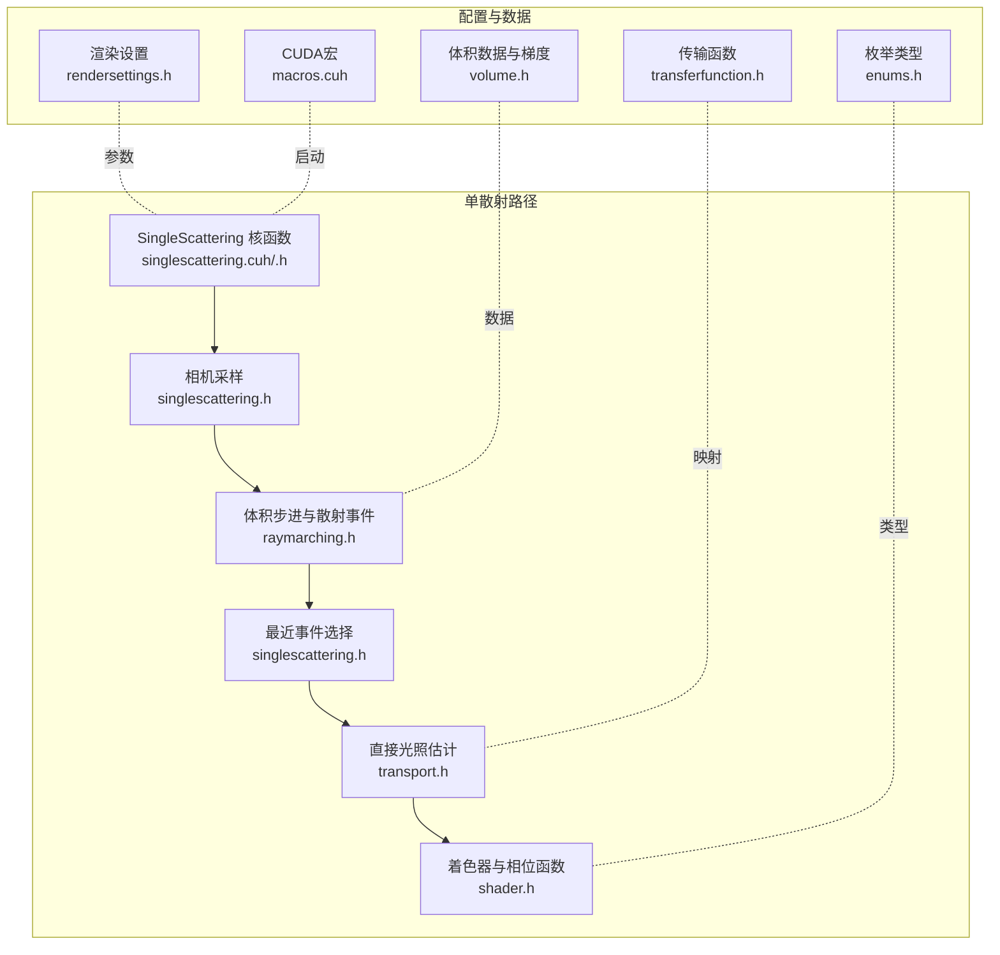
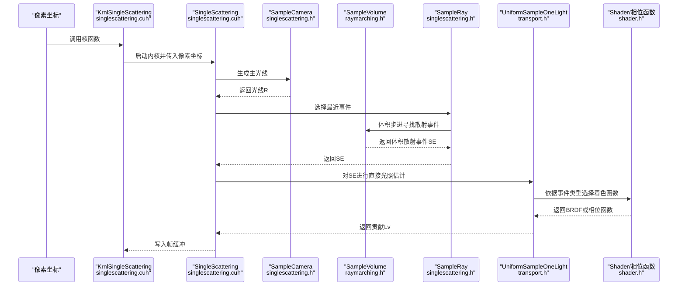
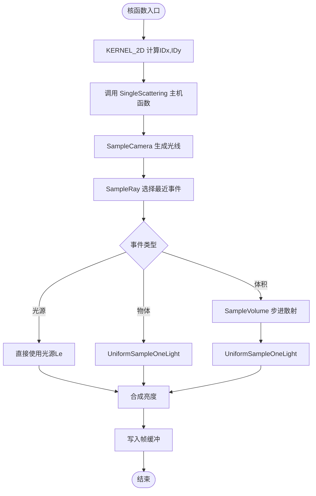
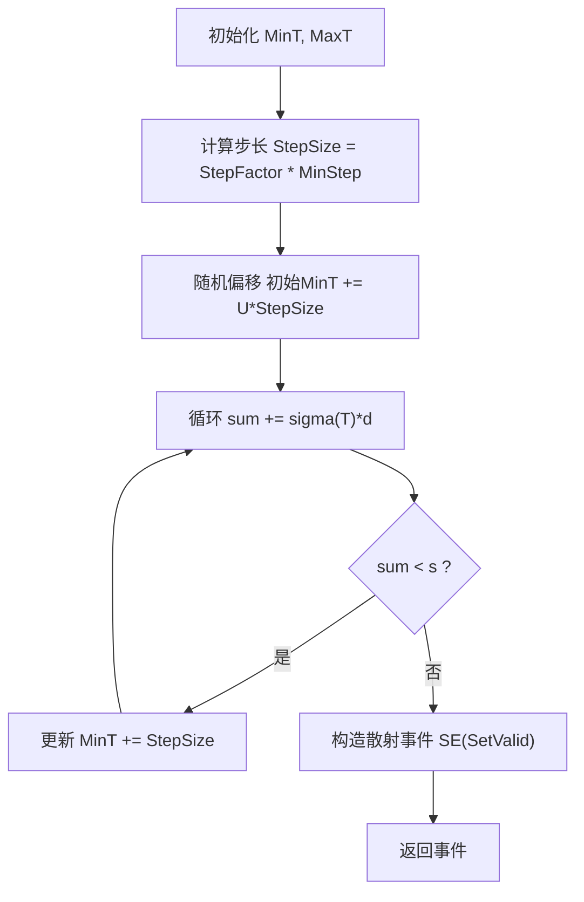
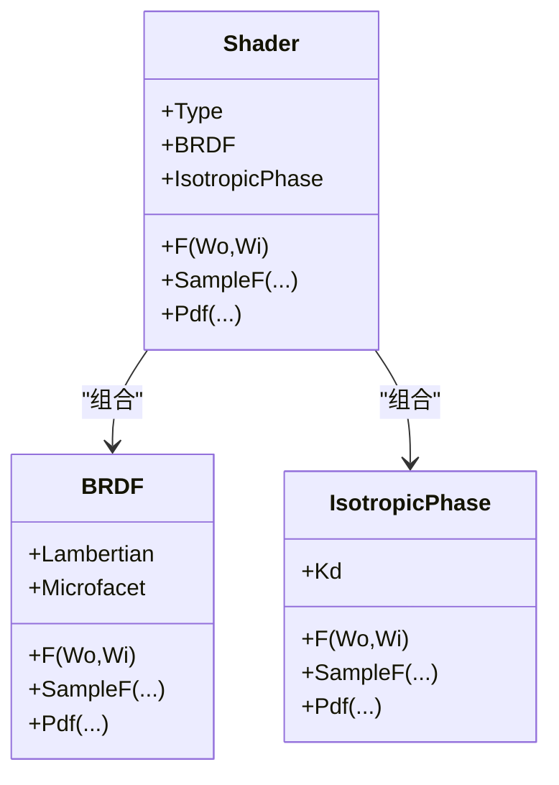
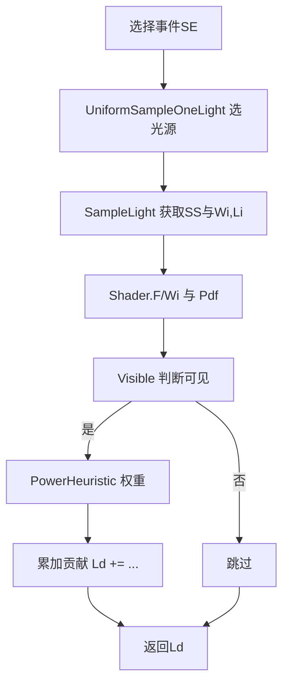
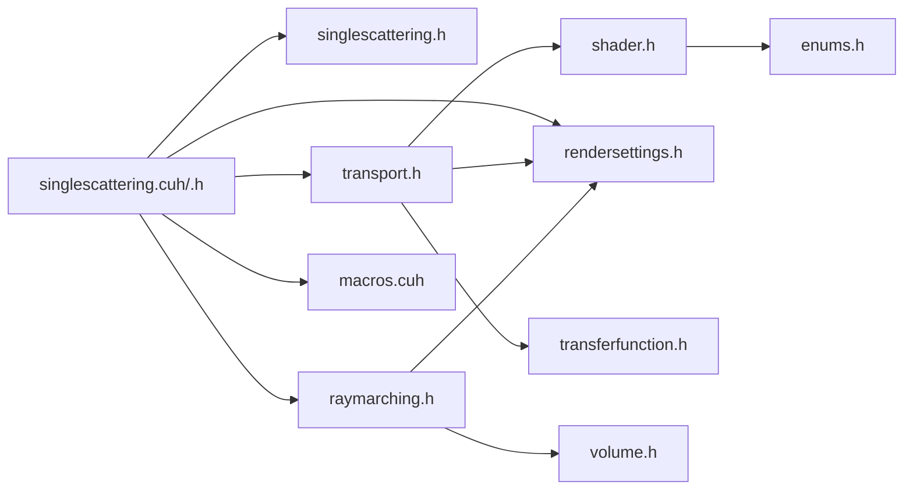

# 单散射计算原理

<cite>
**本文引用的文件**
- [singlescattering.cuh](file://Source/singlescattering.cuh)
- [singlescattering.h](file://Source/singlescattering.h)
- [scatterevent.h](file://Source/scatterevent.h)
- [transport.h](file://Source/transport.h)
- [raymarching.h](file://Source/raymarching.h)
- [shader.h](file://Source/shader.h)
- [montecarlo.h](file://Source/montecarlo.h)
- [rendersettings.h](file://Source/rendersettings.h)
- [transferfunction.h](file://Source/transferfunction.h)
- [volume.h](file://Source/volume.h)
- [enums.h](file://Source/enums.h)
- [macros.cuh](file://Source/macros.cuh)
- [README.md](file://README.md)
</cite>

## 目录
1. [引言](#引言)
2. [项目结构](#项目结构)
3. [核心组件](#核心组件)
4. [架构总览](#架构总览)
5. [详细组件分析](#详细组件分析)
6. [依赖关系分析](#依赖关系分析)
7. [性能考量](#性能考量)
8. [故障排查指南](#故障排查指南)
9. [结论](#结论)
10. [附录](#附录)

## 引言
本文件系统性阐述单散射（Single Scattering）在该体积渲染框架中的物理原理、数学模型与CUDA内核实现。内容覆盖相位函数建模、散射积分与光线步进策略、采样与重要性采样、以及数值稳定性与性能优化。文档以“SingleScattering”主流程为主线，结合体积步进、相机采样、着色器与直接光照估计等模块，帮助初学者快速上手，同时为有经验的开发者提供深入的技术细节与调参建议。

## 项目结构
该渲染框架采用CUDA加速的体积光线步进与基于物理的着色管线。单散射路径由像素级CUDA核函数驱动，通过相机采样、体积步进、最近事件选择与直接光照估计构成完整流程。关键文件职责如下：
- 单散射入口与核函数：singlescattering.cuh、singlescattering.h
- 光线步进与体积散射事件：raymarching.h
- 着色与相位函数：shader.h、transport.h
- 随机数与蒙特卡洛采样：montecarlo.h
- 渲染设置与参数：rendersettings.h
- 传输函数与标量/颜色映射：transferfunction.h
- 体积数据与梯度：volume.h
- 枚举类型与散射类型：enums.h
- CUDA宏与启动配置：macros.cuh

图表来源
- [singlescattering.cuh:27-38](file://Source/singlescattering.cuh#L27-L38)
- [singlescattering.h:76-102](file://Source/singlescattering.h#L76-L102)
- [raymarching.h:30-71](file://Source/raymarching.h#L30-L71)
- [transport.h:115-156](file://Source/transport.h#L115-L156)
- [shader.h:415-483](file://Source/shader.h#L415-L483)
- [rendersettings.h:27-131](file://Source/rendersettings.h#L27-L131)
- [transferfunction.h:82-154](file://Source/transferfunction.h#L82-L154)
- [volume.h:26-149](file://Source/volume.h#L26-L149)
- [enums.h:95-107](file://Source/enums.h#L95-L107)
- [macros.cuh:27-101](file://Source/macros.cuh#L27-L101)

章节来源
- [README.md:1-61](file://README.md#L1-L61)
- [singlescattering.cuh:27-38](file://Source/singlescattering.cuh#L27-L38)
- [singlescattering.h:76-102](file://Source/singlescattering.h#L76-L102)
- [raymarching.h:30-71](file://Source/raymarching.h#L30-L71)
- [transport.h:115-156](file://Source/transport.h#L115-L156)
- [shader.h:415-483](file://Source/shader.h#L415-L483)
- [rendersettings.h:27-131](file://Source/rendersettings.h#L27-L131)
- [transferfunction.h:82-154](file://Source/transferfunction.h#L82-L154)
- [volume.h:26-149](file://Source/volume.h#L26-L149)
- [enums.h:95-107](file://Source/enums.h#L95-L107)
- [macros.cuh:27-101](file://Source/macros.cuh#L27-L101)

## 核心组件
- 单散射核函数与主机启动
  - 核函数负责逐像素执行单散射估计，使用二维CUDA块配置与计时宏进行高效调度。
  - 主机侧封装启动维度与CUDA内核调用，并记录执行时间。
  - 参考路径：[KrnlSingleScattering:27-32](file://Source/singlescattering.cuh#L27-L32)、[SingleScattering:34-38](file://Source/singlescattering.cuh#L34-L38)

- 相机采样与景深
  - 基于屏幕点与胶片尺寸生成主光线，支持光圈与焦距模拟景深效果。
  - 参考路径：[SampleCamera:29-50](file://Source/singlescattering.h#L29-L50)

- 体积步进与散射事件
  - 使用指数分布步进法在体积内寻找首次散射事件；步长受体积最小步长与步进因子控制。
  - 参考路径：[SampleVolume:30-71](file://Source/raymarching.h#L30-L71)

- 最近事件选择
  - 在体积散射、光源相交与物体相交中选择最近者作为当前像素的散射事件。
  - 参考路径：[SampleRay:52-74](file://Source/singlescattering.h#L52-L74)

- 直接光照估计与重要性采样
  - 对选中的散射事件进行均匀采样一个光源，结合着色函数与可见性判断，使用功率权衡减少方差。
  - 参考路径：[UniformSampleOneLight:115-156](file://Source/transport.h#L115-L156)、[EstimateDirectLight:58-113](file://Source/transport.h#L58-L113)

- 着色器与相位函数
  - 提供朗伯与微表面BRDF、各向同性相位函数等，支持按事件类型切换。
  - 参考路径：[Shader:415-483](file://Source/shader.h#L415-483)、[IsotropicPhase:276-314](file://Source/shader.h#L276-314)

- 渲染设置与参数
  - 包含密度缩放、步进因子、阴影开关与最大阴影距离等关键参数。
  - 参考路径：[RenderSettings.ShadingSettings:66-106](file://Source/rendersettings.h#L66-L106)、[RenderSettings.TraversalSettings:30-64](file://Source/rendersettings.h#L30-L64)

- 传输函数与映射
  - 通过标量/颜色传输函数将体素强度映射到颜色与不透明度。
  - 参考路径：[ScalarTransferFunction1D:82-116](file://Source/transferfunction.h#L82-L116)、[ColorTransferFunction1D:118-154](file://Source/transferfunction.h#L118-L154)

- 体积数据与梯度
  - 体积网格的间距、最小步长与梯度方向用于散射事件法向量与着色。
  - 参考路径：[Volume:26-149](file://Source/volume.h#L26-L149)

- CUDA宏与启动配置
  - 提供块/网格维度计算、内核计时与错误检查宏。
  - 参考路径：[LAUNCH_DIMENSIONS:27-39](file://Source/macros.cuh#L27-L39)、[LAUNCH_CUDA_KERNEL_TIMED:41-65](file://Source/macros.cuh#L41-L65)

章节来源
- [singlescattering.cuh:27-38](file://Source/singlescattering.cuh#L27-L38)
- [singlescattering.h:29-50](file://Source/singlescattering.h#L29-L50)
- [singlescattering.h:52-74](file://Source/singlescattering.h#L52-L74)
- [singlescattering.h:76-102](file://Source/singlescattering.h#L76-L102)
- [raymarching.h:30-71](file://Source/raymarching.h#L30-L71)
- [transport.h:115-156](file://Source/transport.h#L115-L156)
- [transport.h:58-113](file://Source/transport.h#L58-L113)
- [shader.h:415-483](file://Source/shader.h#L415-L483)
- [shader.h:276-314](file://Source/shader.h#L276-L314)
- [rendersettings.h:66-106](file://Source/rendersettings.h#L66-L106)
- [rendersettings.h:30-64](file://Source/rendersettings.h#L30-L64)
- [transferfunction.h:82-154](file://Source/transferfunction.h#L82-L154)
- [volume.h:26-149](file://Source/volume.h#L26-L149)
- [macros.cuh:27-101](file://Source/macros.cuh#L27-L101)

## 架构总览
下图展示了单散射从像素到最终亮度值的端到端流程，包括相机采样、体积步进、事件选择、着色与直接光照估计。

图表来源
- [singlescattering.cuh:27-38](file://Source/singlescattering.cuh#L27-L38)
- [singlescattering.h:29-50](file://Source/singlescattering.h#L29-L50)
- [singlescattering.h:52-74](file://Source/singlescattering.h#L52-L74)
- [singlescattering.h:76-102](file://Source/singlescattering.h#L76-L102)
- [raymarching.h:30-71](file://Source/raymarching.h#L30-L71)
- [transport.h:115-156](file://Source/transport.h#L115-L156)
- [shader.h:415-483](file://Source/shader.h#L415-L483)

## 详细组件分析

### 组件A：单散射核函数与像素级流程
- 功能概述
  - 每个像素启动一次CUDA核函数，调用SingleScattering主机函数完成整条单散射路径。
  - 使用二维块配置与计时宏，确保可测量与可扩展。
- 关键实现要点
  - 核函数索引与边界检查：[KERNEL_2D:83-90](file://Source/macros.cuh#L83-L90)
  - 主机侧启动维度与内核计时：[LAUNCH_DIMENSIONS:27-39](file://Source/macros.cuh#L27-L39)、[LAUNCH_CUDA_KERNEL_TIMED:41-65](file://Source/macros.cuh#L41-L65)
  - 单散射入口与像素写入：[KrnlSingleScattering:27-32](file://Source/singlescattering.cuh#L27-L32)、[SingleScattering:34-38](file://Source/singlescattering.cuh#L34-L38)
  - 单散射主体逻辑：[SingleScattering:76-102](file://Source/singlescattering.h#L76-L102)

图表来源
- [singlescattering.cuh:27-38](file://Source/singlescattering.cuh#L27-L38)
- [singlescattering.h:29-50](file://Source/singlescattering.h#L29-L50)
- [singlescattering.h:52-74](file://Source/singlescattering.h#L52-L74)
- [singlescattering.h:76-102](file://Source/singlescattering.h#L76-L102)
- [raymarching.h:30-71](file://Source/raymarching.h#L30-L71)
- [transport.h:115-156](file://Source/transport.h#L115-L156)

章节来源
- [singlescattering.cuh:27-38](file://Source/singlescattering.cuh#L27-L38)
- [singlescattering.h:76-102](file://Source/singlescattering.h#L76-L102)
- [macros.cuh:27-101](file://Source/macros.cuh#L27-L101)

### 组件B：体积步进与散射事件
- 物理原理
  - 体积内散射遵循指数分布，步进长度s由均匀随机数通过-sigma^(-1)*ln(U)确定，其中sigma为消光截面。
  - 步长受体积最小步长与步进因子共同决定，兼顾精度与性能。
- 数学模型
  - 步进累积sum与sigma(T)·dT比较，达到阈值即返回散射事件位置与法向量。
  - 参考路径：[SampleVolume:30-71](file://Source/raymarching.h#L30-L71)
- 关键参数
  - 密度缩放与不透明度映射：[ShadingSettings.DensityScale:66-106](file://Source/rendersettings.h#L66-L106)
  - 步进因子：[TraversalSettings.StepFactorPrimary:30-64](file://Source/rendersettings.h#L30-L64)

图表来源
- [raymarching.h:30-71](file://Source/raymarching.h#L30-L71)
- [rendersettings.h:30-64](file://Source/rendersettings.h#L30-L64)
- [rendersettings.h:66-106](file://Source/rendersettings.h#L66-L106)

章节来源
- [raymarching.h:30-71](file://Source/raymarching.h#L30-L71)
- [rendersettings.h:30-64](file://Source/rendersettings.h#L30-L64)
- [rendersettings.h:66-106](file://Source/rendersettings.h#L66-L106)

### 组件C：相位函数与着色
- 相位函数
  - 各向同性相位函数：常数散射概率，适合均匀介质。
  - 参考路径：[IsotropicPhase:276-314](file://Source/shader.h#L276-314)
- 着色器
  - BRDF组合朗伯与微表面项，支持漫反射与镜面反射。
  - 通过事件类型切换至相位函数模式，实现纯相位函数渲染。
  - 参考路径：[Shader:415-483](file://Source/shader.h#L415-483)、[BRDF:316-413](file://Source/shader.h#L316-413)
- 事件类型
  - 体积、光源、物体三类事件，对应不同着色与贡献方式。
  - 参考路径：[ScatterType 枚举:101-107](file://Source/enums.h#L101-L107)

图表来源
- [shader.h:415-483](file://Source/shader.h#L415-L483)
- [shader.h:316-413](file://Source/shader.h#L316-L413)
- [shader.h:276-314](file://Source/shader.h#L276-L314)

章节来源
- [shader.h:415-483](file://Source/shader.h#L415-L483)
- [shader.h:316-413](file://Source/shader.h#L316-L413)
- [shader.h:276-314](file://Source/shader.h#L276-L314)
- [enums.h:101-107](file://Source/enums.h#L101-L107)

### 组件D：直接光照估计与重要性采样
- 流程概述
  - 对选定散射事件，均匀采样一个光源，计算从光源到散射点的可见性，使用功率权衡降低方差。
  - 参考路径：[UniformSampleOneLight:115-156](file://Source/transport.h#L115-L156)、[EstimateDirectLight:58-113](file://Source/transport.h#L58-L113)
- 可见性判断
  - 使用阴影射线与Intersect函数判断遮挡，避免不必要的计算。
  - 参考路径：[Visible:46-56](file://Source/transport.h#L46-L56)
- 权重与PDF
  - 使用功率权衡公式结合光源PDF与BRDF PDF，平衡重要性采样。
  - 参考路径：[PowerHeuristic:223-227](file://Source/montecarlo.h#L223-L227)

图表来源
- [transport.h:115-156](file://Source/transport.h#L115-L156)
- [transport.h:58-113](file://Source/transport.h#L58-L113)
- [transport.h:46-56](file://Source/transport.h#L46-L56)
- [montecarlo.h:223-227](file://Source/montecarlo.h#L223-L227)

章节来源
- [transport.h:115-156](file://Source/transport.h#L115-L156)
- [transport.h:58-113](file://Source/transport.h#L58-L113)
- [transport.h:46-56](file://Source/transport.h#L46-L56)
- [montecarlo.h:223-227](file://Source/montecarlo.h#L223-L227)

### 组件E：采样策略与数值稳定性
- 采样策略
  - 相机采样：屏幕点与胶片尺寸插值生成光线方向；景深通过同心圆盘采样模拟。
    - 参考路径：[SampleCamera:29-50](file://Source/singlescattering.h#L29-L50)、[ConcentricSampleDisk:86-137](file://Source/montecarlo.h#L86-L137)
  - 球面与半球均匀采样：用于相位函数与BRDF采样。
    - 参考路径：[UniformSampleSphereSurface:191-199](file://Source/montecarlo.h#L191-L199)、[UniformSampleHemisphere:201-221](file://Source/montecarlo.h#L201-L221)
- 数值稳定性
  - 射线与体积相交边界处理、RAY_EPS与RAY_EPS_2用于避免自相交。
  - 参考路径：[Visible:46-56](file://Source/transport.h#L46-L56)
  - 体积步进中使用minT/maxT限制有效步进范围，防止越界。
  - 参考路径：[SampleVolume:30-71](file://Source/raymarching.h#L30-L71)

章节来源
- [singlescattering.h:29-50](file://Source/singlescattering.h#L29-L50)
- [montecarlo.h:86-137](file://Source/montecarlo.h#L86-L137)
- [montecarlo.h:191-199](file://Source/montecarlo.h#L191-L199)
- [montecarlo.h:201-221](file://Source/montecarlo.h#L201-L221)
- [transport.h:46-56](file://Source/transport.h#L46-L56)
- [raymarching.h:30-71](file://Source/raymarching.h#L30-L71)

## 依赖关系分析
- 组件耦合
  - 单散射核函数依赖相机采样、体积步进与直接光照估计；后者又依赖着色器与可见性判断。
  - 渲染设置贯穿体积步进与着色过程，影响步长、密度与阴影行为。
- 外部依赖
  - CUDA运行时与事件计时用于性能测量与同步。
  - 体积数据与传输函数提供强度与颜色映射基础。

图表来源
- [singlescattering.cuh:27-38](file://Source/singlescattering.cuh#L27-L38)
- [singlescattering.h:29-50](file://Source/singlescattering.h#L29-L50)
- [singlescattering.h:76-102](file://Source/singlescattering.h#L76-L102)
- [raymarching.h:30-71](file://Source/raymarching.h#L30-L71)
- [transport.h:115-156](file://Source/transport.h#L115-L156)
- [shader.h:415-483](file://Source/shader.h#L415-L483)
- [rendersettings.h:27-131](file://Source/rendersettings.h#L27-L131)
- [transferfunction.h:82-154](file://Source/transferfunction.h#L82-L154)
- [volume.h:26-149](file://Source/volume.h#L26-L149)
- [enums.h:95-107](file://Source/enums.h#L95-L107)
- [macros.cuh:27-101](file://Source/macros.cuh#L27-L101)

章节来源
- [singlescattering.cuh:27-38](file://Source/singlescattering.cuh#L27-L38)
- [singlescattering.h:76-102](file://Source/singlescattering.h#L76-L102)
- [raymarching.h:30-71](file://Source/raymarching.h#L30-L71)
- [transport.h:115-156](file://Source/transport.h#L115-L156)
- [shader.h:415-483](file://Source/shader.h#L415-L483)
- [rendersettings.h:27-131](file://Source/rendersettings.h#L27-L131)
- [transferfunction.h:82-154](file://Source/transferfunction.h#L82-L154)
- [volume.h:26-149](file://Source/volume.h#L26-L149)
- [enums.h:95-107](file://Source/enums.h#L95-L107)
- [macros.cuh:27-101](file://Source/macros.cuh#L27-L101)

## 性能考量
- 步进策略
  - 步进因子与最小步长共同决定精度与速度权衡；增大步进因子可显著提速但可能引入噪声。
  - 参考路径：[StepFactorPrimary/StepFactorShadow:30-64](file://Source/rendersettings.h#L30-L64)
- 密度与不透明度
  - 密度缩放直接影响步进长度与散射频率；不透明度1D映射需平滑以避免阶梯噪声。
  - 参考路径：[DensityScale:66-106](file://Source/rendersettings.h#L66-L106)、[Opacity1D/Emission1D:115-156](file://Source/transport.h#L115-L156)
- 并行化与内存
  - 使用二维块配置与共享随机种子，避免全局锁竞争；注意帧缓冲与体积数据的带宽瓶颈。
  - 参考路径：[KERNEL_2D:83-90](file://Source/macros.cuh#L83-L90)、[Volume:26-149](file://Source/volume.h#L26-L149)
- 计时与调试
  - 内置CUDA事件计时宏便于定位热点；建议分阶段测量核函数与内核间开销。
  - 参考路径：[LAUNCH_CUDA_KERNEL_TIMED:41-65](file://Source/macros.cuh#L41-L65)

## 故障排查指南
- 常见问题
  - 无散射事件：检查体积边界相交与步进终止条件；确认密度缩放与步进因子合理。
    - 参考路径：[SampleVolume:30-71](file://Source/raymarching.h#L30-L71)
  - 亮度异常或全黑：检查光源数量与UniformSampleOneLight分支；确认可见性判断与功率权衡。
    - 参考路径：[UniformSampleOneLight:115-156](file://Source/transport.h#L115-L156)、[Visible:46-56](file://Source/transport.h#L46-L56)
  - 性能骤降：检查步进因子过大导致的噪声与多次重投；评估体积分辨率与传输函数节点数量。
    - 参考路径：[rendersettings.h:30-64](file://Source/rendersettings.h#L30-L64)
- 调试建议
  - 逐步关闭阴影与景深验证体积步进；使用较小分辨率快速迭代。
  - 打印事件类型与权重分布，定位采样失败或PDF退化。

章节来源
- [raymarching.h:30-71](file://Source/raymarching.h#L30-L71)
- [transport.h:115-156](file://Source/transport.h#L115-L156)
- [transport.h:46-56](file://Source/transport.h#L46-L56)
- [rendersettings.h:30-64](file://Source/rendersettings.h#L30-L64)

## 结论
单散射在该框架中通过像素级CUDA核函数串联相机采样、体积步进、事件选择与直接光照估计，形成完整的物理一致性渲染路径。借助各向同性相位函数与BRDF混合、蒙特卡洛重要性采样与功率权衡，系统在交互质量与性能之间取得良好平衡。合理配置渲染设置与传输函数，是获得稳定、高质量结果的关键。

## 附录
- 配置方法速查
  - 散射系数/密度：[ShadingSettings.DensityScale:66-106](file://Source/rendersettings.h#L66-L106)
  - 步进策略：[TraversalSettings.StepFactorPrimary/StepFactorShadow:30-64](file://Source/rendersettings.h#L30-L64)
  - 阴影与最大阴影距离：[TraversalSettings.Shadows/MaxShadowDistance:30-64](file://Source/rendersettings.h#L30-L64)
  - 不透明度与发射映射：[Opacity1D/Emission1D:115-156](file://Source/transport.h#L115-L156)、[ScalarTransferFunction1D/ColorTransferFunction1D:82-154](file://Source/transferfunction.h#L82-L154)
  - 体积数据与梯度：[Volume:26-149](file://Source/volume.h#L26-L149)
  - 事件类型与着色模式：[ScatterType/ScatterFunction 枚举:101-107](file://Source/enums.h#L101-L107)